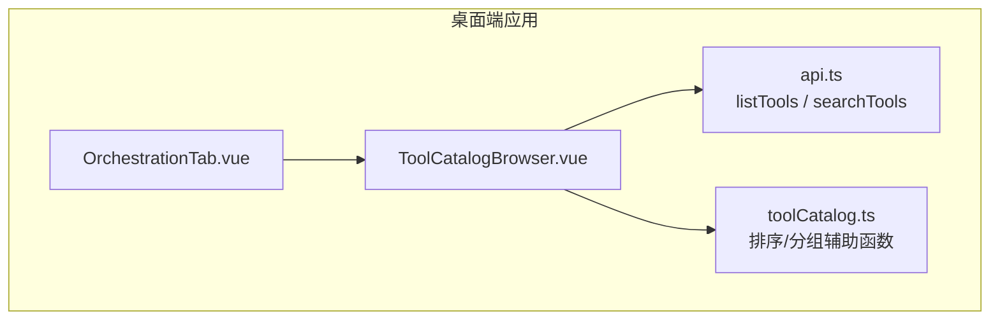
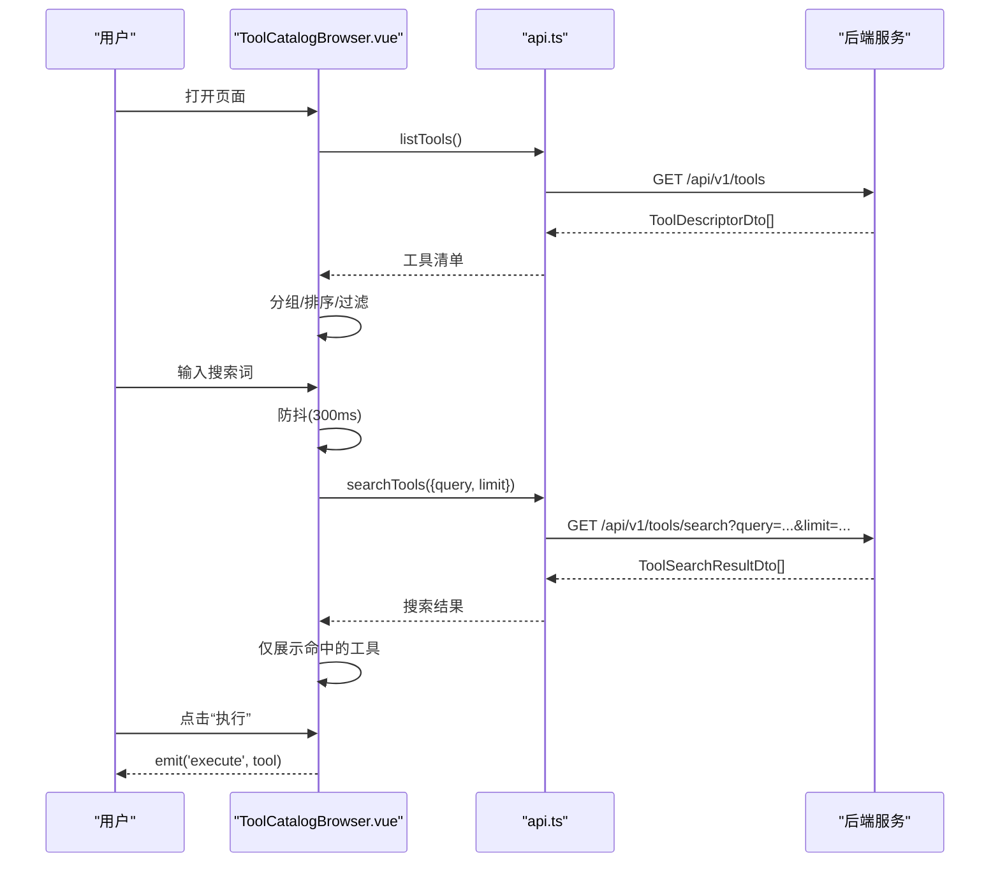
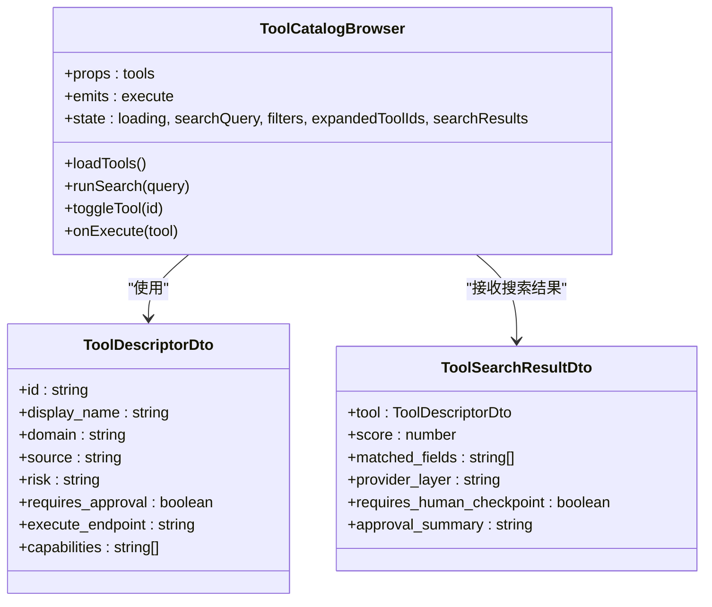
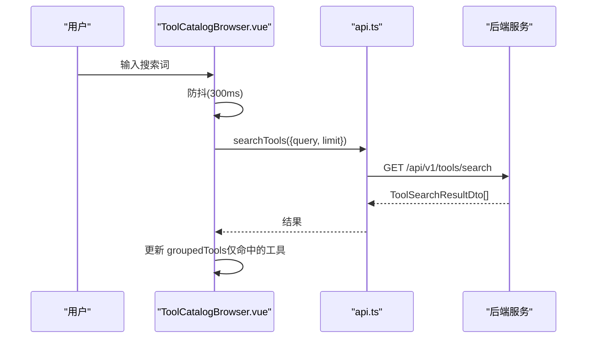
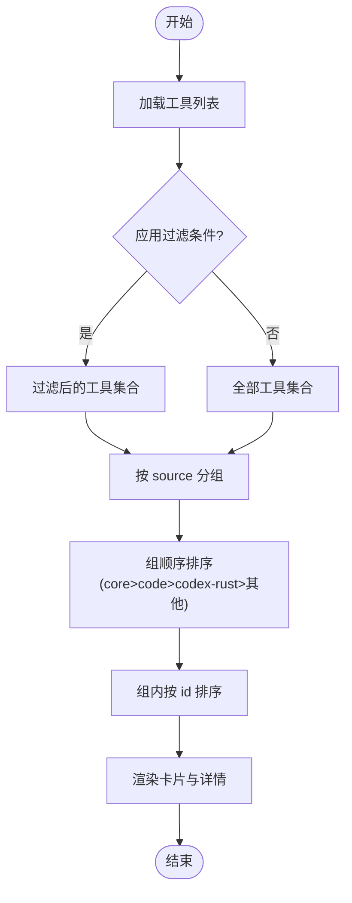
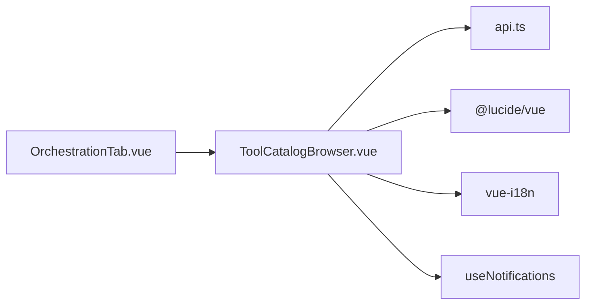

# 工具目录浏览器

<cite>
**本文引用的文件**   
- [ToolCatalogBrowser.vue](file://apps/desktop/src/components/tools/ToolCatalogBrowser.vue)
- [api.ts](file://apps/desktop/src/api.ts)
- [toolCatalog.ts](file://apps/desktop/src/toolCatalog.ts)
- [OrchestrationTab.vue](file://apps/desktop/src/components/OrchestrationTab.vue)
</cite>

## 目录
1. [简介](#简介)
2. [项目结构](#项目结构)
3. [核心组件](#核心组件)
4. [架构总览](#架构总览)
5. [详细组件分析](#详细组件分析)
6. [依赖关系分析](#依赖关系分析)
7. [性能考虑](#性能考虑)
8. [故障排查指南](#故障排查指南)
9. [结论](#结论)
10. [附录](#附录)

## 简介
本文件为“工具目录浏览器”（ToolCatalogBrowser）组件的完整技术文档，聚焦以下能力：
- 工具发现机制：支持从 API 拉取工具清单与搜索；也支持外部传入工具列表。
- 分类展示：按 source 分组、排序，卡片化展示工具元数据（名称、ID、来源、风险等级、权限标识等）。
- 搜索功能：基于后端搜索接口，带防抖与加载态。
- 属性配置、事件处理与插槽使用：props 暴露工具源，emit 暴露执行事件；当前未使用具名插槽。
- 工具过滤、排序与分页：前端多条件过滤（来源、风险、审批要求）、组内排序；搜索返回结果由后端控制数量限制。
- 描述渲染、图标加载与响应式布局：根据 toolId 映射图标；标签化展示 domain、risk、approval；网格自适应布局。

## 项目结构
- 组件位置：apps/desktop/src/components/tools/ToolCatalogBrowser.vue
- 类型与API定义：apps/desktop/src/api.ts
- 工具数据处理辅助：apps/desktop/src/toolCatalog.ts
- 使用方示例：apps/desktop/src/components/OrchestrationTab.vue

图表来源
- [OrchestrationTab.vue](file://apps/desktop/src/components/OrchestrationTab.vue)
- [ToolCatalogBrowser.vue](file://apps/desktop/src/components/tools/ToolCatalogBrowser.vue)
- [api.ts](file://apps/desktop/src/api.ts)
- [toolCatalog.ts](file://apps/desktop/src/toolCatalog.ts)

章节来源
- [ToolCatalogBrowser.vue](file://apps/desktop/src/components/tools/ToolCatalogBrowser.vue)
- [api.ts](file://apps/desktop/src/api.ts)
- [toolCatalog.ts](file://apps/desktop/src/toolCatalog.ts)
- [OrchestrationTab.vue](file://apps/desktop/src/components/OrchestrationTab.vue)

## 核心组件
- ToolCatalogBrowser.vue
  - 作用：工具目录浏览、筛选、搜索与快速执行入口。
  - 输入 props：tools（可选，外部传入的工具清单）
  - 输出事件：execute（选中工具后触发，携带 ToolDescriptorDto）
  - 内部状态：loading、searchQuery、sourceFilter、riskFilter、approvalFilter、expandedToolIds、searchResults、searchLoading
  - 关键逻辑：
    - 工具加载：若 props.tools 为空则调用 api.listTools()
    - 搜索：监听 searchQuery 防抖调用 api.searchTools()
    - 分组与排序：按 source 分组，组内按 id 排序；组顺序按 core > code > codex-rust > 其他
    - 过滤：source/risk/approval 三维度过滤；搜索结果时仅显示命中项
    - 交互：展开/收起详情；点击 Execute 触发 execute 事件

章节来源
- [ToolCatalogBrowser.vue](file://apps/desktop/src/components/tools/ToolCatalogBrowser.vue)

## 架构总览
组件通过 API 层与后端交互，获取工具清单与搜索结果，并在前端完成分组、过滤、排序与展示。

图表来源
- [ToolCatalogBrowser.vue](file://apps/desktop/src/components/tools/ToolCatalogBrowser.vue)
- [api.ts](file://apps/desktop/src/api.ts)

## 详细组件分析

### 组件属性与事件
- Props
  - tools?: ToolDescriptorDto[]：外部传入的工具清单；为空时自动从 API 拉取
- Emits
  - execute(tool: ToolDescriptorDto)：用户点击“执行”按钮时触发，供父组件接管执行流程

章节来源
- [ToolCatalogBrowser.vue](file://apps/desktop/src/components/tools/ToolCatalogBrowser.vue)

### 工具发现与加载
- 优先使用 props.tools；否则调用 api.listTools()
- 加载失败时通过通知系统提示并支持重试

章节来源
- [ToolCatalogBrowser.vue](file://apps/desktop/src/components/tools/ToolCatalogBrowser.vue)
- [api.ts](file://apps/desktop/src/api.ts)

### 搜索与防抖
- 监听 searchQuery，300ms 防抖后调用 api.searchTools({ query, limit })
- 搜索中显示 loading 提示；失败时清空结果

章节来源
- [ToolCatalogBrowser.vue](file://apps/desktop/src/components/tools/ToolCatalogBrowser.vue)
- [api.ts](file://apps/desktop/src/api.ts)

### 分类与排序
- 分组键：tool.source（如 core、code、codex-rust、extension 等）
- 组内排序：按 tool.id 字典序
- 组顺序优先级：core(0) < code(1) < codex-rust(2) < 其他(10)

章节来源
- [ToolCatalogBrowser.vue](file://apps/desktop/src/components/tools/ToolCatalogBrowser.vue)
- [toolCatalog.ts](file://apps/desktop/src/toolCatalog.ts)

### 过滤规则
- 来源过滤：sourceFilter（all 或具体 source）
- 风险过滤：riskFilter（all/read-only/workspace-write/shell/git-write/external-url），匹配 risk 字段包含关键词
- 审批过滤：approvalFilter（all/required/optional），依据 requires_approval 布尔值

章节来源
- [ToolCatalogBrowser.vue](file://apps/desktop/src/components/tools/ToolCatalogBrowser.vue)

### 工具元数据展示与权限标识
- 基础信息：display_name、id、domain、source、risk、requires_approval、execute_endpoint、capabilities
- 权限标识：requires_approval 以盾牌图标+文字呈现；risk 以不同颜色标签区分
- 能力标签：capabilities 数组以小标签形式展示

章节来源
- [ToolCatalogBrowser.vue](file://apps/desktop/src/components/tools/ToolCatalogBrowser.vue)
- [api.ts](file://apps/desktop/src/api.ts)

### 图标映射与响应式布局
- 图标映射：根据 toolId 选择 Lucide 图标（read_file、list_directory、git_*、sandbox_exec 等）
- 布局：CSS Grid 自适应列数，卡片悬停高亮，展开详情区域

章节来源
- [ToolCatalogBrowser.vue](file://apps/desktop/src/components/tools/ToolCatalogBrowser.vue)

### 快速访问（Execute）
- 卡片底部提供“执行”按钮，点击后 emit('execute', tool)，由父组件决定后续执行流程（例如进入审批、调用执行接口等）

章节来源
- [ToolCatalogBrowser.vue](file://apps/desktop/src/components/tools/ToolCatalogBrowser.vue)

### 分页实现说明
- 组件本身未实现前端分页；搜索请求通过 limit 参数限制返回条数，由后端控制分页策略

章节来源
- [ToolCatalogBrowser.vue](file://apps/desktop/src/components/tools/ToolCatalogBrowser.vue)
- [api.ts](file://apps/desktop/src/api.ts)

### 插槽使用
- 当前组件未定义具名插槽；如需扩展卡片内容，可在父组件通过包裹或二次封装实现

章节来源
- [ToolCatalogBrowser.vue](file://apps/desktop/src/components/tools/ToolCatalogBrowser.vue)

### 类图（组件与类型）

图表来源
- [ToolCatalogBrowser.vue](file://apps/desktop/src/components/tools/ToolCatalogBrowser.vue)
- [api.ts](file://apps/desktop/src/api.ts)

### 序列图（搜索流程）

图表来源
- [ToolCatalogBrowser.vue](file://apps/desktop/src/components/tools/ToolCatalogBrowser.vue)
- [api.ts](file://apps/desktop/src/api.ts)

### 流程图（过滤与分组）

图表来源
- [ToolCatalogBrowser.vue](file://apps/desktop/src/components/tools/ToolCatalogBrowser.vue)

## 依赖关系分析
- 组件依赖
  - Vue 组合式 API（computed、ref、watch、onMounted）
  - i18n（vue-i18n）
  - 图标库（@lucide/vue）
  - 通知系统（useNotifications）
  - API 层（api.ts）
- 类型依赖
  - ToolDescriptorDto、ToolSearchResultDto 等来自 api.ts
- 使用方
  - OrchestrationTab.vue 引入并使用 ToolCatalogBrowser

图表来源
- [ToolCatalogBrowser.vue](file://apps/desktop/src/components/tools/ToolCatalogBrowser.vue)
- [api.ts](file://apps/desktop/src/api.ts)
- [OrchestrationTab.vue](file://apps/desktop/src/components/OrchestrationTab.vue)

章节来源
- [ToolCatalogBrowser.vue](file://apps/desktop/src/components/tools/ToolCatalogBrowser.vue)
- [api.ts](file://apps/desktop/src/api.ts)
- [OrchestrationTab.vue](file://apps/desktop/src/components/OrchestrationTab.vue)

## 性能考虑
- 搜索防抖：300ms 延迟减少频繁请求
- 前端分组与排序：在内存中进行，避免重复网络请求
- 结果集限制：通过 limit 参数控制返回数量，降低渲染压力
- 图标按需渲染：基于 toolId 映射，避免额外资源加载
- 建议优化：
  - 对长列表可考虑虚拟滚动（当工具数量较大时）
  - 搜索可结合后端增量索引提升命中率与速度
  - 缓存最近一次搜索结果，避免重复输入相同查询

[本节为通用指导，不直接分析具体文件]

## 故障排查指南
- 无法连接后端
  - 现象：加载工具失败，显示错误通知
  - 排查：检查网关地址与网络连通性；查看 api.ts 的 request 错误处理
- 搜索无结果
  - 现象：输入关键词后结果为空
  - 排查：确认后端搜索接口是否可用；检查 query 与 limit 参数；查看 searchResults 是否为 null
- 权限标识异常
  - 现象：requires_approval 显示不正确
  - 排查：确认 ToolDescriptorDto.requires_approval 字段是否正确返回
- 图标不显示
  - 现象：部分工具图标缺失
  - 排查：检查 toolIcon 映射是否覆盖该 toolId；必要时补充映射

章节来源
- [ToolCatalogBrowser.vue](file://apps/desktop/src/components/tools/ToolCatalogBrowser.vue)
- [api.ts](file://apps/desktop/src/api.ts)

## 结论
ToolCatalogBrowser 组件提供了完整的工具目录浏览体验，包括发现、分类、搜索、过滤、排序与快速执行入口。其设计清晰、职责单一，易于集成到上层页面（如 OrchestrationTab）。通过 API 层解耦前后端，配合通知系统与图标库，形成良好的用户体验。未来可扩展插槽、分页与更多过滤维度以满足复杂场景。

[本节为总结，不直接分析具体文件]

## 附录
- 常用 API 路径
  - 工具清单：/api/v1/tools
  - 工具搜索：/api/v1/tools/search
- 数据类型
  - ToolDescriptorDto：工具描述
  - ToolSearchResultDto：搜索结果（含评分、匹配字段、审批摘要等）

章节来源
- [api.ts](file://apps/desktop/src/api.ts)