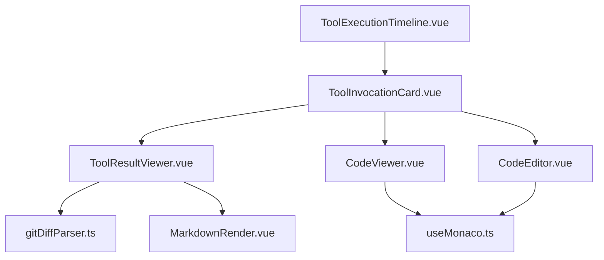
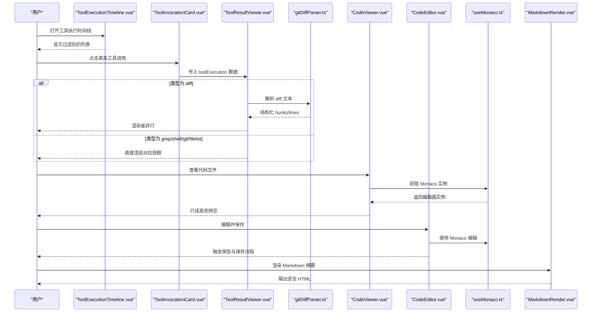
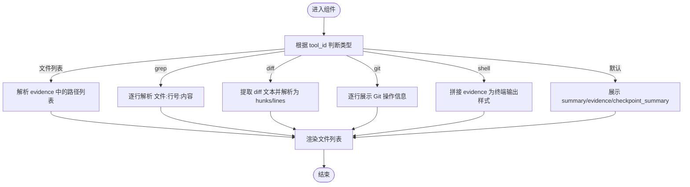
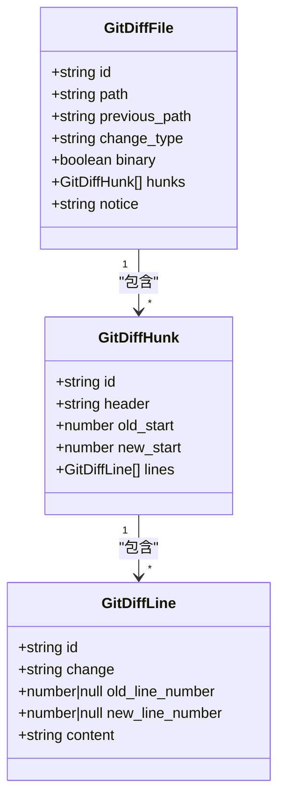
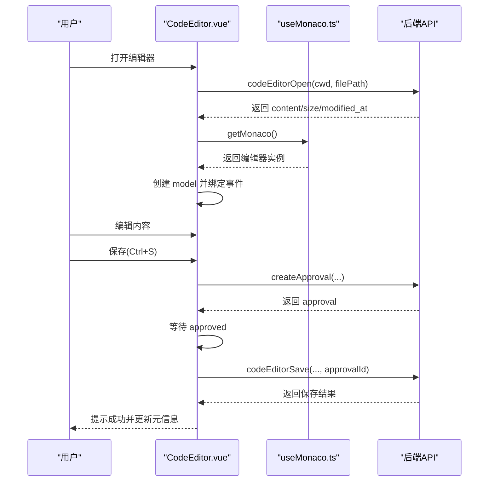
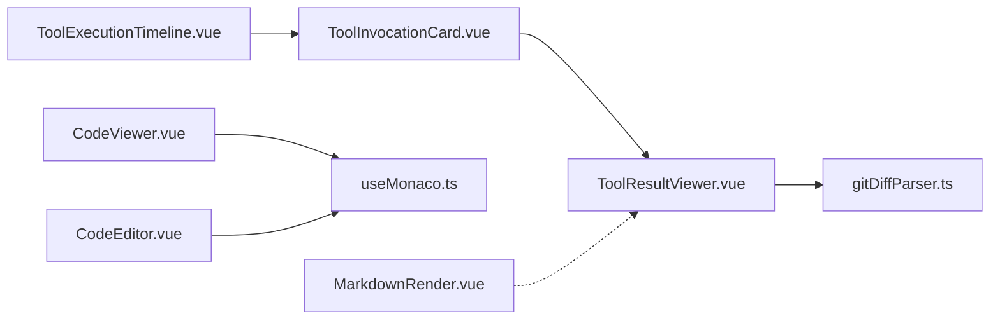

# 工具结果查看器

<cite>
**本文引用的文件**   
- [ToolResultViewer.vue](file://apps/desktop/src/components/tools/ToolResultViewer.vue)
- [ToolInvocationCard.vue](file://apps/desktop/src/components/tools/ToolInvocationCard.vue)
- [ToolExecutionTimeline.vue](file://apps/desktop/src/components/tools/ToolExecutionTimeline.vue)
- [gitDiffParser.ts](file://apps/desktop/src/gitDiffParser.ts)
- [CodeViewer.vue](file://apps/desktop/src/components/code/CodeViewer.vue)
- [CodeEditor.vue](file://apps/desktop/src/components/code/CodeEditor.vue)
- [useMonaco.ts](file://apps/desktop/src/composables/useMonaco.ts)
- [MarkdownRender.vue](file://apps/desktop/src/components/MarkdownRender.vue)
</cite>

## 目录
1. [简介](#简介)
2. [项目结构](#项目结构)
3. [核心组件](#核心组件)
4. [架构总览](#架构总览)
5. [详细组件分析](#详细组件分析)
6. [依赖关系分析](#依赖关系分析)
7. [性能与内存管理](#性能与内存管理)
8. [安全过滤与沙箱隔离](#安全过滤与沙箱隔离)
9. [大文件处理、分页加载与搜索](#大文件处理分页加载与搜索)
10. [输出格式适配、模板定制与导出](#输出格式适配模板定制与导出)
11. [故障排查指南](#故障排查指南)
12. [结论](#结论)

## 简介
本文件面向“工具结果查看器”相关的前端展示能力，系统性说明不同类型工具结果的格式化展示、语法高亮与代码预览机制；阐述内容渲染引擎、安全过滤与沙箱隔离策略；并给出大文件处理、分页加载与搜索的实现建议。同时覆盖多输出格式的适配、模板定制与导出选项，以及性能优化、内存管理与用户体验提升的实践要点。

## 项目结构
围绕工具结果查看的 UI 层由以下关键文件组成：
- 工具执行时间线与卡片：ToolExecutionTimeline.vue、ToolInvocationCard.vue
- 工具结果查看器：ToolResultViewer.vue
- Diff 解析器：gitDiffParser.ts
- 代码查看/编辑器：CodeViewer.vue、CodeEditor.vue
- Monaco 集成与语言检测：useMonaco.ts
- Markdown 渲染与安全清洗：MarkdownRender.vue

**图表来源** 
- [ToolExecutionTimeline.vue:1-646](file://apps/desktop/src/components/tools/ToolExecutionTimeline.vue#L1-L646)
- [ToolInvocationCard.vue:1-563](file://apps/desktop/src/components/tools/ToolInvocationCard.vue#L1-L563)
- [ToolResultViewer.vue:1-463](file://apps/desktop/src/components/tools/ToolResultViewer.vue#L1-L463)
- [gitDiffParser.ts:1-178](file://apps/desktop/src/gitDiffParser.ts#L1-L178)
- [CodeViewer.vue:1-164](file://apps/desktop/src/components/code/CodeViewer.vue#L1-L164)
- [CodeEditor.vue:1-287](file://apps/desktop/src/components/code/CodeEditor.vue#L1-L287)
- [useMonaco.ts:1-147](file://apps/desktop/src/composables/useMonaco.ts#L1-L147)
- [MarkdownRender.vue:1-22](file://apps/desktop/src/components/MarkdownRender.vue#L1-L22)

**章节来源**
- [ToolExecutionTimeline.vue:1-646](file://apps/desktop/src/components/tools/ToolExecutionTimeline.vue#L1-L646)
- [ToolInvocationCard.vue:1-563](file://apps/desktop/src/components/tools/ToolInvocationCard.vue#L1-L563)
- [ToolResultViewer.vue:1-463](file://apps/desktop/src/components/tools/ToolResultViewer.vue#L1-L463)
- [gitDiffParser.ts:1-178](file://apps/desktop/src/gitDiffParser.ts#L1-L178)
- [CodeViewer.vue:1-164](file://apps/desktop/src/components/code/CodeViewer.vue#L1-L164)
- [CodeEditor.vue:1-287](file://apps/desktop/src/components/code/CodeEditor.vue#L1-L287)
- [useMonaco.ts:1-147](file://apps/desktop/src/composables/useMonaco.ts#L1-L147)
- [MarkdownRender.vue:1-22](file://apps/desktop/src/components/MarkdownRender.vue#L1-L22)

## 核心组件
- ToolExecutionTimeline.vue：工具执行时间线，支持按状态筛选、排序、展开详情。
- ToolInvocationCard.vue：单条工具调用卡片，提供复制结果、重新运行、查看详情等交互，内部嵌入结果查看器。
- ToolResultViewer.vue：根据工具类型（文件列表、grep 匹配、diff、Git 操作、Shell 输出）进行差异化渲染，并提供复制功能。
- gitDiffParser.ts：统一 diff 文本解析为结构化数据，供 Diff 视图渲染。
- CodeViewer.vue / CodeEditor.vue：基于 Monaco 的代码只读查看与可编辑编辑器，支持自动语言识别、主题跟随、保存审批流。
- useMonaco.ts：Monaco 初始化、主题切换与语言检测。
- MarkdownRender.vue：Markdown 渲染并做安全清洗。

**章节来源**
- [ToolExecutionTimeline.vue:1-646](file://apps/desktop/src/components/tools/ToolExecutionTimeline.vue#L1-L646)
- [ToolInvocationCard.vue:1-563](file://apps/desktop/src/components/tools/ToolInvocationCard.vue#L1-L563)
- [ToolResultViewer.vue:1-463](file://apps/desktop/src/components/tools/ToolResultViewer.vue#L1-L463)
- [gitDiffParser.ts:1-178](file://apps/desktop/src/gitDiffParser.ts#L1-L178)
- [CodeViewer.vue:1-164](file://apps/desktop/src/components/code/CodeViewer.vue#L1-L164)
- [CodeEditor.vue:1-287](file://apps/desktop/src/components/code/CodeEditor.vue#L1-L287)
- [useMonaco.ts:1-147](file://apps/desktop/src/composables/useMonaco.ts#L1-L147)
- [MarkdownRender.vue:1-22](file://apps/desktop/src/components/MarkdownRender.vue#L1-L22)

## 架构总览
工具结果查看器的数据流从时间线到卡片再到具体结果查看器，最终通过解析器或编辑器完成渲染。

**图表来源** 
- [ToolExecutionTimeline.vue:1-646](file://apps/desktop/src/components/tools/ToolExecutionTimeline.vue#L1-L646)
- [ToolInvocationCard.vue:1-563](file://apps/desktop/src/components/tools/ToolInvocationCard.vue#L1-L563)
- [ToolResultViewer.vue:1-463](file://apps/desktop/src/components/tools/ToolResultViewer.vue#L1-L463)
- [gitDiffParser.ts:1-178](file://apps/desktop/src/gitDiffParser.ts#L1-L178)
- [CodeViewer.vue:1-164](file://apps/desktop/src/components/code/CodeViewer.vue#L1-L164)
- [CodeEditor.vue:1-287](file://apps/desktop/src/components/code/CodeEditor.vue#L1-L287)
- [useMonaco.ts:1-147](file://apps/desktop/src/composables/useMonaco.ts#L1-L147)
- [MarkdownRender.vue:1-22](file://apps/desktop/src/components/MarkdownRender.vue#L1-L22)

## 详细组件分析

### ToolResultViewer.vue：结果渲染与格式化
- 支持的视图类型：
  - 文件列表：read_file、list_directory、glob_search
  - 正则匹配：grep_content
  - 差异对比：apply_patch、code_editor、git_worktree_manager
  - Git 操作：git_*
  - Shell 输出：sandbox_exec
  - 默认：证据列表与摘要
- 关键逻辑：
  - 依据 tool_id 判定视图分支
  - 对 diff 文本提取与解析后渲染 hunk/line
  - 对 grep 结果按“文件:行号:内容”解析
  - 提供一键复制结果文本
- 性能与体验：
  - 仅展开时渲染详情区域，减少初始 DOM 压力
  - 长文本采用滚动容器限制高度，避免重排

**图表来源** 
- [ToolResultViewer.vue:1-463](file://apps/desktop/src/components/tools/ToolResultViewer.vue#L1-L463)
- [gitDiffParser.ts:1-178](file://apps/desktop/src/gitDiffParser.ts#L1-L178)

**章节来源**
- [ToolResultViewer.vue:1-463](file://apps/desktop/src/components/tools/ToolResultViewer.vue#L1-L463)
- [gitDiffParser.ts:1-178](file://apps/desktop/src/gitDiffParser.ts#L1-L178)

### ToolInvocationCard.vue：调用卡片与交互
- 功能要点：
  - 展示工具名称、ID、来源、状态、耗时、风险等级、审批标记
  - 参数提示摘要、证据标签
  - 菜单项：重新运行、查看详情、复制结果
  - 展开后内嵌 ToolResultViewer 展示结果
- 交互细节：
  - 复制结果合并 summary、checkpoint_summary 与 evidence
  - 菜单弹出与遮罩关闭逻辑

**章节来源**
- [ToolInvocationCard.vue:1-563](file://apps/desktop/src/components/tools/ToolInvocationCard.vue#L1-L563)

### ToolExecutionTimeline.vue：时间线与筛选
- 功能要点：
  - 状态筛选（全部、成功、失败、需审批、运行中）
  - 排序（最新/最旧）
  - 计算各状态计数
  - 展开节点后渲染 ToolInvocationCard
- 性能考虑：
  - 证据片段截断显示，避免过长文本影响布局

**章节来源**
- [ToolExecutionTimeline.vue:1-646](file://apps/desktop/src/components/tools/ToolExecutionTimeline.vue#L1-L646)

### gitDiffParser.ts：统一 Diff 解析
- 数据结构：
  - GitDiffFile：文件级元信息与 hunks
  - GitDiffHunk：hunk 头部与行集合
  - GitDiffLine：行变更类型（context/add/delete）及行列号
- 算法要点：
  - 逐行扫描 diff 文本，识别文件头、rename、二进制、--- /+++、@@ 块
  - 维护 old/new 行号计数器，生成带 id 的行对象
- 复杂度：
  - 时间 O(N)，N 为 diff 行数；空间与输出结构线性增长

**图表来源** 
- [gitDiffParser.ts:1-178](file://apps/desktop/src/gitDiffParser.ts#L1-L178)

**章节来源**
- [gitDiffParser.ts:1-178](file://apps/desktop/src/gitDiffParser.ts#L1-L178)

### CodeViewer.vue / CodeEditor.vue：代码预览与编辑
- CodeViewer.vue：
  - 只读模式，自动检测语言，跟随主题
  - 显示文件大小与修改时间，支持刷新与跳转编辑
- CodeEditor.vue：
  - 可编辑模式，监听内容变化，支持撤销/重做、格式化文档
  - 保存流程：创建审批请求 -> 等待批准 -> 执行保存 -> 更新元信息
  - 暴露 getContent 与 isDirty 以配合上层逻辑
- 共同点：
  - 使用 useMonaco.ts 获取 Monaco 实例与主题
  - 组件卸载时释放 editor/model 资源

**图表来源** 
- [CodeEditor.vue:1-287](file://apps/desktop/src/components/code/CodeEditor.vue#L1-L287)
- [useMonaco.ts:1-147](file://apps/desktop/src/composables/useMonaco.ts#L1-L147)

**章节来源**
- [CodeViewer.vue:1-164](file://apps/desktop/src/components/code/CodeViewer.vue#L1-L164)
- [CodeEditor.vue:1-287](file://apps/desktop/src/components/code/CodeEditor.vue#L1-L287)
- [useMonaco.ts:1-147](file://apps/desktop/src/composables/useMonaco.ts#L1-L147)

### MarkdownRender.vue：安全渲染
- 使用 marked 将 Markdown 转为 HTML
- 使用 DOMPurify 清洗 HTML，防止 XSS
- 适用于工具摘要、checkpoint_summary 等富文本展示

**章节来源**
- [MarkdownRender.vue:1-22](file://apps/desktop/src/components/MarkdownRender.vue#L1-L22)

## 依赖关系分析
- ToolExecutionTimeline.vue 依赖 ToolInvocationCard.vue
- ToolInvocationCard.vue 依赖 ToolResultViewer.vue
- ToolResultViewer.vue 依赖 gitDiffParser.ts
- CodeViewer.vue / CodeEditor.vue 依赖 useMonaco.ts
- MarkdownRender.vue 独立用于富文本渲染

**图表来源** 
- [ToolExecutionTimeline.vue:1-646](file://apps/desktop/src/components/tools/ToolExecutionTimeline.vue#L1-L646)
- [ToolInvocationCard.vue:1-563](file://apps/desktop/src/components/tools/ToolInvocationCard.vue#L1-L563)
- [ToolResultViewer.vue:1-463](file://apps/desktop/src/components/tools/ToolResultViewer.vue#L1-L463)
- [gitDiffParser.ts:1-178](file://apps/desktop/src/gitDiffParser.ts#L1-L178)
- [CodeViewer.vue:1-164](file://apps/desktop/src/components/code/CodeViewer.vue#L1-L164)
- [CodeEditor.vue:1-287](file://apps/desktop/src/components/code/CodeEditor.vue#L1-L287)
- [useMonaco.ts:1-147](file://apps/desktop/src/composables/useMonaco.ts#L1-L147)
- [MarkdownRender.vue:1-22](file://apps/desktop/src/components/MarkdownRender.vue#L1-L22)

**章节来源**
- [ToolExecutionTimeline.vue:1-646](file://apps/desktop/src/components/tools/ToolExecutionTimeline.vue#L1-L646)
- [ToolInvocationCard.vue:1-563](file://apps/desktop/src/components/tools/ToolInvocationCard.vue#L1-L563)
- [ToolResultViewer.vue:1-463](file://apps/desktop/src/components/tools/ToolResultViewer.vue#L1-L463)
- [gitDiffParser.ts:1-178](file://apps/desktop/src/gitDiffParser.ts#L1-L178)
- [CodeViewer.vue:1-164](file://apps/desktop/src/components/code/CodeViewer.vue#L1-L164)
- [CodeEditor.vue:1-287](file://apps/desktop/src/components/code/CodeEditor.vue#L1-L287)
- [useMonaco.ts:1-147](file://apps/desktop/src/composables/useMonaco.ts#L1-L147)
- [MarkdownRender.vue:1-22](file://apps/desktop/src/components/MarkdownRender.vue#L1-L22)

## 性能与内存管理
- 渲染优化
  - 仅在展开时渲染详情区域，降低首屏开销
  - 证据与摘要片段截断，避免超长文本导致重排
- 编辑器资源管理
  - 组件卸载时释放 editor 与 model，避免内存泄漏
  - 语言切换时复用 model，减少重建成本
- 主题与懒加载
  - Monaco 按需加载，主题随系统/设置动态切换
- 建议扩展
  - 对超大 diff/grep 结果引入虚拟滚动与分页加载
  - 对 shell 输出采用增量渲染与最大行数限制

[本节为通用指导，不直接分析具体文件]

## 安全过滤与沙箱隔离
- 前端安全
  - Markdown 渲染前使用 DOMPurify 清洗 HTML，防止 XSS
  - 剪贴板写入捕获异常，避免不可用环境报错
- 后端/运行时安全（参考项目其他模块）
  - 命令执行在沙箱环境中运行，具备进程隔离与权限控制
  - 文件读写受策略与审计约束
- 建议
  - 对所有外部输入（evidence、summary）进行白名单校验
  - 对 diff/grep/shell 输出进行长度与字符集限制

**章节来源**
- [MarkdownRender.vue:1-22](file://apps/desktop/src/components/MarkdownRender.vue#L1-L22)
- [ToolResultViewer.vue:1-463](file://apps/desktop/src/components/tools/ToolResultViewer.vue#L1-L463)

## 大文件处理、分页加载与搜索
- 当前实现
  - CodeViewer/CodeEditor 一次性加载文件内容，适合中小文件
  - ToolResultViewer 对 diff/grep/shell 输出未分页
- 建议方案
  - 大文件分块读取：后端提供 range 接口，前端按视口范围请求
  - 虚拟列表：对 grep/diff/shell 结果采用虚拟滚动，仅渲染可视区
  - 搜索：对证据列表与 diff 行进行本地索引与高亮匹配
  - 缓存：对已加载区块进行内存缓存，避免重复请求

[本节为通用指导，不直接分析具体文件]

## 输出格式适配、模板定制与导出
- 输出适配
  - 文件列表：路径数组
  - grep：文件:行号:内容
  - diff：统一 diff 文本
  - git：操作日志行
  - shell：原始输出文本
  - markdown：富文本摘要
- 模板定制
  - 可在 ToolResultViewer 中新增视图分支，映射新的 tool_id
  - 通过 CSS 变量调整主题色与排版
- 导出选项
  - 复制结果：支持 summary/evidence 组合复制
  - 导出 diff/grep/shell 为 .txt/.patch
  - 导出 Markdown 摘要为 .md

**章节来源**
- [ToolResultViewer.vue:1-463](file://apps/desktop/src/components/tools/ToolResultViewer.vue#L1-L463)
- [ToolInvocationCard.vue:1-563](file://apps/desktop/src/components/tools/ToolInvocationCard.vue#L1-L563)

## 故障排查指南
- 常见问题
  - 编辑器无法加载：检查 Monaco CDN/本地包可用性
  - 语言识别错误：确认文件扩展名映射
  - diff 解析为空：确认 diff 文本是否包含标准头与 @@ 块
  - 剪贴板不可用：浏览器权限或 HTTPS 限制
- 定位方法
  - 查看 ToolExecutionTimeline 的状态与耗时
  - 在 ToolInvocationCard 中复制结果，验证内容完整性
  - 检查 MarkdownRender 的输出是否被清洗

**章节来源**
- [ToolExecutionTimeline.vue:1-646](file://apps/desktop/src/components/tools/ToolExecutionTimeline.vue#L1-L646)
- [ToolInvocationCard.vue:1-563](file://apps/desktop/src/components/tools/ToolInvocationCard.vue#L1-L563)
- [ToolResultViewer.vue:1-463](file://apps/desktop/src/components/tools/ToolResultViewer.vue#L1-L463)
- [useMonaco.ts:1-147](file://apps/desktop/src/composables/useMonaco.ts#L1-L147)

## 结论
工具结果查看器通过清晰的组件分层与类型化渲染，实现了多类型工具结果的高效展示与交互。结合 Monaco 编辑器与安全的 Markdown 渲染，提供了良好的代码预览与富文本体验。未来可通过虚拟滚动、分页加载与搜索增强大文件处理能力，并通过模板化与导出完善输出适配。整体架构具备良好的可扩展性与可维护性。