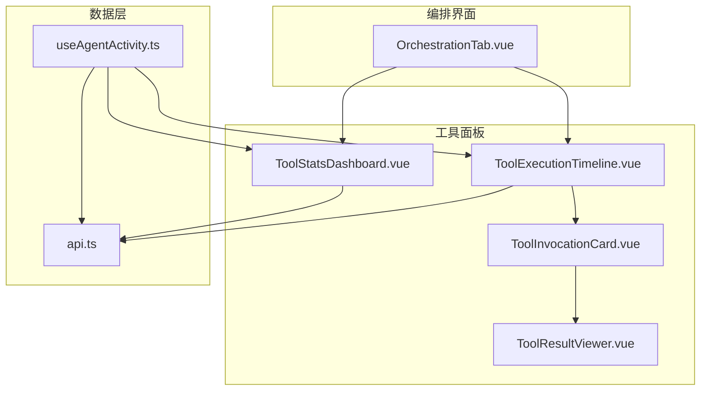
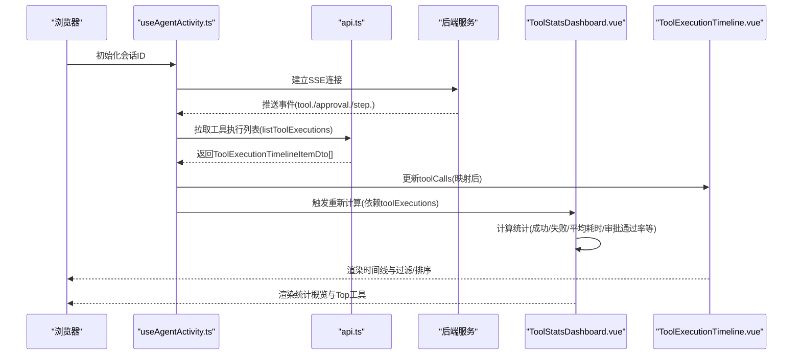
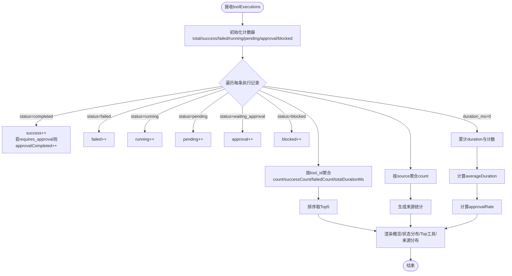
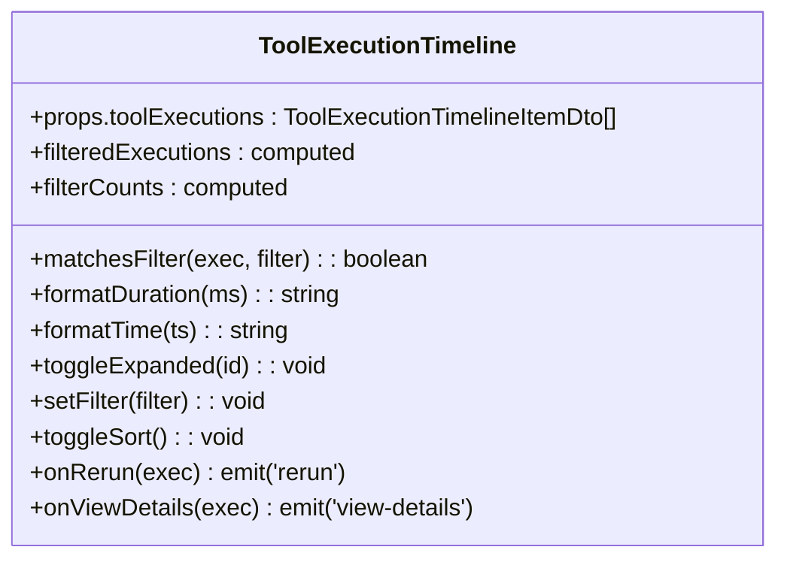
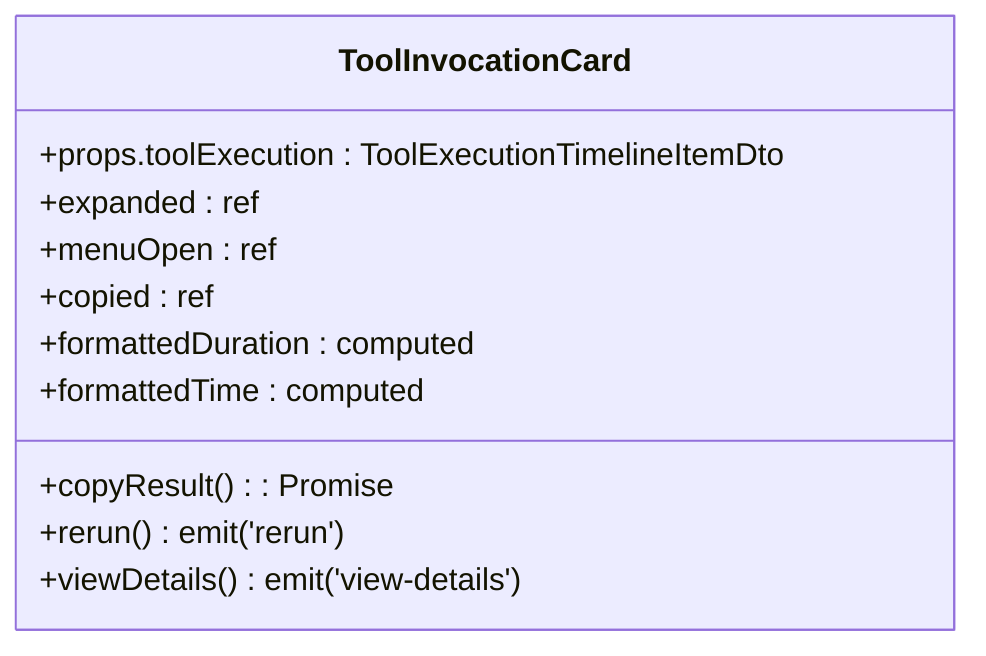
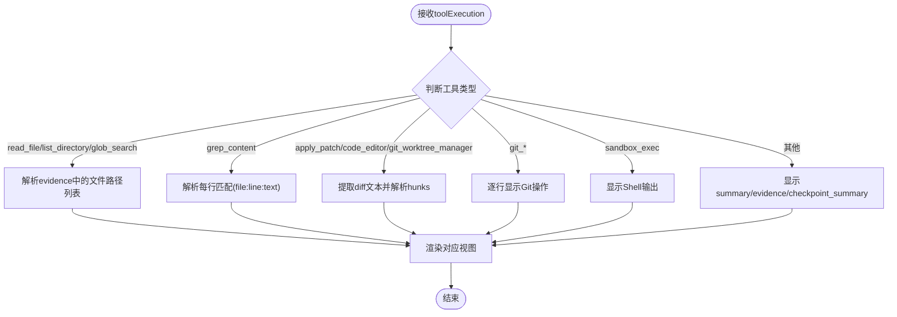
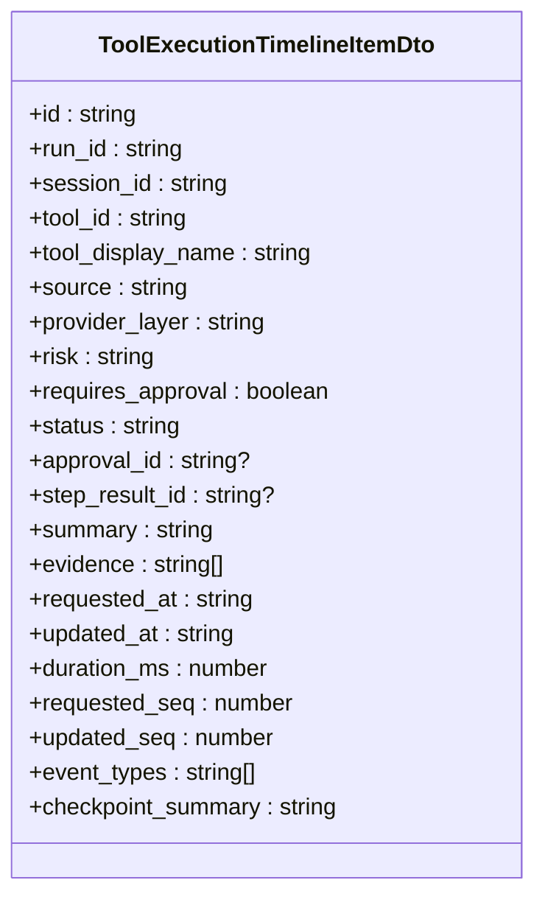
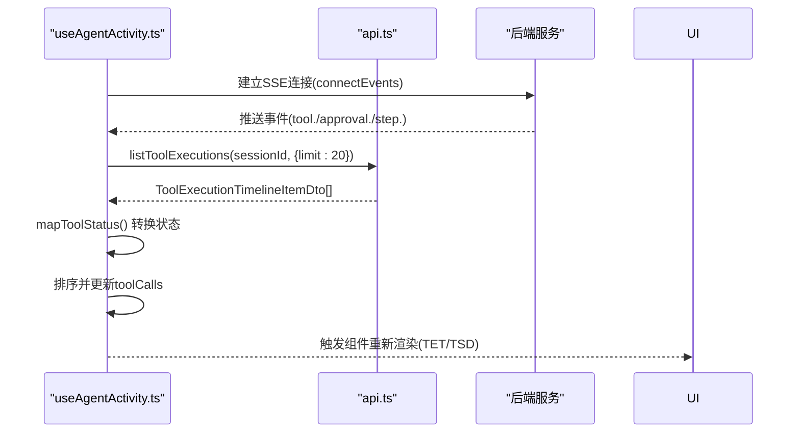
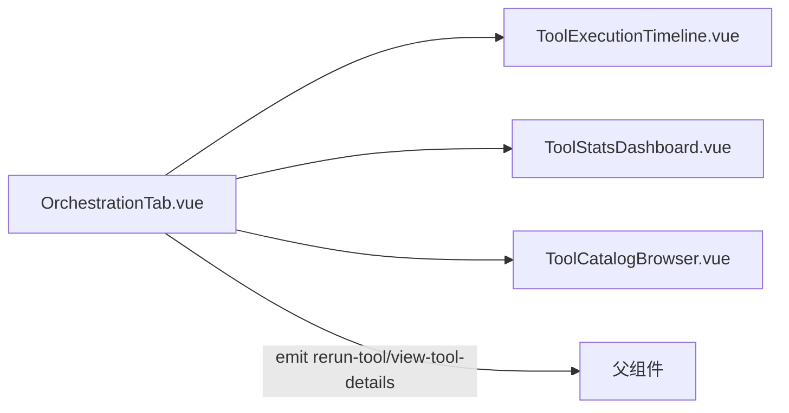
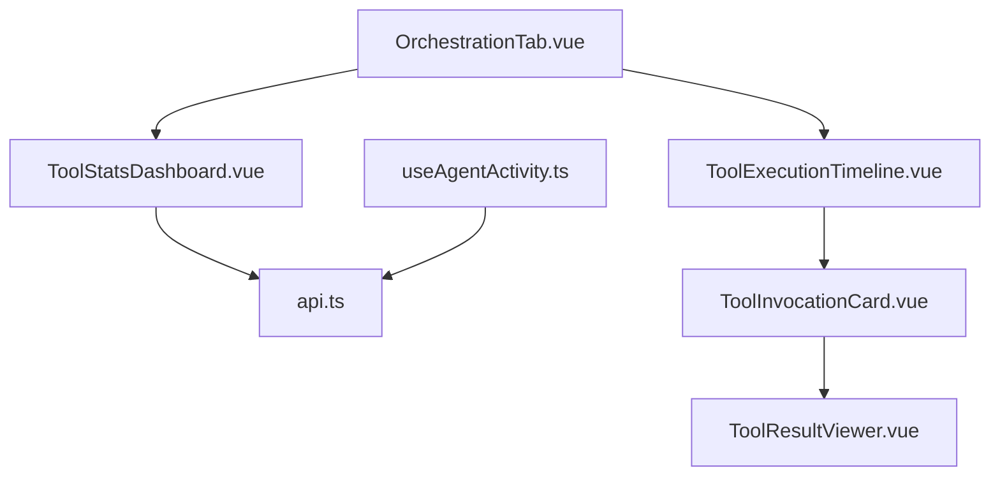

# 工具统计仪表板

<cite>
**本文引用的文件**   
- [ToolStatsDashboard.vue](file://apps/desktop/src/components/tools/ToolStatsDashboard.vue)
- [ToolExecutionTimeline.vue](file://apps/desktop/src/components/tools/ToolExecutionTimeline.vue)
- [ToolInvocationCard.vue](file://apps/desktop/src/components/tools/ToolInvocationCard.vue)
- [ToolResultViewer.vue](file://apps/desktop/src/components/tools/ToolResultViewer.vue)
- [api.ts](file://apps/desktop/src/api.ts)
- [useAgentActivity.ts](file://apps/desktop/src/composables/useAgentActivity.ts)
- [OrchestrationTab.vue](file://apps/desktop/src/components/OrchestrationTab.vue)
</cite>

## 目录
1. [简介](#简介)
2. [项目结构](#项目结构)
3. [核心组件](#核心组件)
4. [架构总览](#架构总览)
5. [详细组件分析](#详细组件分析)
6. [依赖关系分析](#依赖关系分析)
7. [性能考量](#性能考量)
8. [故障排查指南](#故障排查指南)
9. [结论](#结论)
10. [附录](#附录)

## 简介
本文件为“工具统计仪表板”提供全面文档，覆盖工具使用统计、性能指标收集与可视化展示。重点包括：
- 成功率统计、响应时间分析与错误率监控
- 图表组件的配置选项、数据格式与更新机制
- 自定义指标定义、阈值设置与告警能力（扩展建议）
- 数据聚合策略、缓存机制与实时更新

该仪表板基于 Vue 3 组件实现，通过 SSE 事件与 API 拉取工具执行记录，并在前端进行聚合与可视化。

## 项目结构
与工具统计仪表板相关的代码主要位于桌面应用的前端模块中，关键文件如下：
- 统计仪表板与时间线、调用卡片、结果查看器
- API 类型定义与请求封装
- 活动状态管理与实时事件处理
- 编排标签页集成统计视图

**图示来源** 
- [OrchestrationTab.vue:1-200](file://apps/desktop/src/components/OrchestrationTab.vue#L1-L200)
- [ToolExecutionTimeline.vue:1-200](file://apps/desktop/src/components/tools/ToolExecutionTimeline.vue#L1-L200)
- [ToolInvocationCard.vue:1-120](file://apps/desktop/src/components/tools/ToolInvocationCard.vue#L1-L120)
- [ToolResultViewer.vue:1-120](file://apps/desktop/src/components/tools/ToolResultViewer.vue#L1-L120)
- [ToolStatsDashboard.vue:1-120](file://apps/desktop/src/components/tools/ToolStatsDashboard.vue#L1-L120)
- [api.ts:790-989](file://apps/desktop/src/api.ts#L790-L989)
- [useAgentActivity.ts:500-697](file://apps/desktop/src/composables/useAgentActivity.ts#L500-L697)

**章节来源**
- [OrchestrationTab.vue:1-200](file://apps/desktop/src/components/OrchestrationTab.vue#L1-L200)
- [ToolExecutionTimeline.vue:1-200](file://apps/desktop/src/components/tools/ToolExecutionTimeline.vue#L1-L200)
- [ToolStatsDashboard.vue:1-120](file://apps/desktop/src/components/tools/ToolStatsDashboard.vue#L1-L120)
- [api.ts:790-989](file://apps/desktop/src/api.ts#L790-L989)
- [useAgentActivity.ts:500-697](file://apps/desktop/src/composables/useAgentActivity.ts#L500-L697)

## 核心组件
- ToolStatsDashboard.vue：统计仪表板，计算并展示总体指标、状态分布、Top 工具与来源分布。
- ToolExecutionTimeline.vue：工具执行时间线，支持过滤、排序、展开详情。
- ToolInvocationCard.vue：单个工具调用的卡片，包含状态、风险等级、证据摘要与操作菜单。
- ToolResultViewer.vue：结果查看器，按工具类型渲染文件列表、grep 匹配、diff、Git 操作或 Shell 输出。
- api.ts：定义 ToolExecutionTimelineItemDto 等数据结构与 HTTP 请求方法。
- useAgentActivity.ts：管理活动状态、SSE 事件处理、工具调用映射与刷新逻辑。
- OrchestrationTab.vue：编排标签页，集成时间线与统计视图。

**章节来源**
- [ToolStatsDashboard.vue:1-120](file://apps/desktop/src/components/tools/ToolStatsDashboard.vue#L1-L120)
- [ToolExecutionTimeline.vue:1-120](file://apps/desktop/src/components/tools/ToolExecutionTimeline.vue#L1-L120)
- [ToolInvocationCard.vue:1-120](file://apps/desktop/src/components/tools/ToolInvocationCard.vue#L1-L120)
- [ToolResultViewer.vue:1-120](file://apps/desktop/src/components/tools/ToolResultViewer.vue#L1-L120)
- [api.ts:790-989](file://apps/desktop/src/api.ts#L790-L989)
- [useAgentActivity.ts:500-697](file://apps/desktop/src/composables/useAgentActivity.ts#L500-L697)
- [OrchestrationTab.vue:1-200](file://apps/desktop/src/components/OrchestrationTab.vue#L1-L200)

## 架构总览
整体数据流从后端事件与 API 进入前端，经活动状态管理转换为统一模型，再由各组件消费与展示。

**图示来源** 
- [useAgentActivity.ts:500-697](file://apps/desktop/src/composables/useAgentActivity.ts#L500-L697)
- [api.ts:790-989](file://apps/desktop/src/api.ts#L790-L989)
- [ToolExecutionTimeline.vue:1-200](file://apps/desktop/src/components/tools/ToolExecutionTimeline.vue#L1-L200)
- [ToolStatsDashboard.vue:1-200](file://apps/desktop/src/components/tools/ToolStatsDashboard.vue#L1-L200)

## 详细组件分析

### ToolStatsDashboard.vue（统计仪表板）
- 输入：toolExecutions（ToolExecutionTimelineItemDto[]）
- 计算指标：
  - 总数、完成数、失败数、运行中、待处理、等待审批、被阻塞
  - 平均耗时（仅统计 duration_ms > 0 的记录）
  - 审批通过率（requires_approval 且 completed 的比例）
  - Top 工具（按调用次数排序，前5）
  - 来源分布（core/code/codex-rust/extension/unknown）
- 展示：
  - 概览卡片（总数、完成、失败、等待审批、平均耗时、审批通过率）
  - 状态分布条形图
  - Top 工具条形图（含平均耗时）
  - 来源分布条形图（带百分比）
- 更新机制：基于 props 的 computed 自动重算；父组件刷新 toolExecutions 时自动更新。

**图示来源** 
- [ToolStatsDashboard.vue:33-117](file://apps/desktop/src/components/tools/ToolStatsDashboard.vue#L33-L117)

**章节来源**
- [ToolStatsDashboard.vue:1-200](file://apps/desktop/src/components/tools/ToolStatsDashboard.vue#L1-L200)

### ToolExecutionTimeline.vue（工具执行时间线）
- 功能：
  - 过滤：全部、成功、失败、审批、运行/待处理
  - 排序：按 requested_at 升/降序
  - 展开详情：点击节点显示 ToolInvocationCard
- 数据：直接消费 toolExecutions（ToolExecutionTimelineItemDto[]）
- 交互：
  - 过滤按钮显示计数
  - 排序按钮切换顺序
  - 展开/收起详情

**图示来源** 
- [ToolExecutionTimeline.vue:91-163](file://apps/desktop/src/components/tools/ToolExecutionTimeline.vue#L91-L163)

**章节来源**
- [ToolExecutionTimeline.vue:1-200](file://apps/desktop/src/components/tools/ToolExecutionTimeline.vue#L1-L200)

### ToolInvocationCard.vue（工具调用卡片）
- 功能：
  - 显示工具名称、ID、来源、状态、耗时、风险等级、证据摘要
  - 支持复制结果、重新执行、查看详情
  - 可展开查看 ToolResultViewer
- 数据：toolExecution（ToolExecutionTimelineItemDto）
- 交互：菜单按钮、展开/收起结果

**图示来源** 
- [ToolInvocationCard.vue:23-141](file://apps/desktop/src/components/tools/ToolInvocationCard.vue#L23-L141)

**章节来源**
- [ToolInvocationCard.vue:1-200](file://apps/desktop/src/components/tools/ToolInvocationCard.vue#L1-L200)

### ToolResultViewer.vue（结果查看器）
- 功能：
  - 根据工具类型智能渲染：
    - 文件列表（read_file/list_directory/glob_search）
    - grep 匹配（grep_content）
    - diff（apply_patch/code_editor/git_worktree_manager）
    - Git 操作（git_*）
    - Shell 输出（sandbox_exec）
  - 默认模式：显示 summary/evidence/checkpoint_summary
- 数据：toolExecution（ToolExecutionTimelineItemDto）
- 交互：折叠/展开、复制结果

**图示来源** 
- [ToolResultViewer.vue:34-113](file://apps/desktop/src/components/tools/ToolResultViewer.vue#L34-L113)

**章节来源**
- [ToolResultViewer.vue:1-200](file://apps/desktop/src/components/tools/ToolResultViewer.vue#L1-L200)

### api.ts（数据类型与请求）
- 关键接口：
  - ToolExecutionTimelineItemDto：包含 id、run_id、session_id、tool_id、tool_display_name、source、provider_layer、risk、requires_approval、status、approval_id、step_result_id、summary、evidence、requested_at、updated_at、duration_ms、requested_seq、updated_seq、event_types、checkpoint_summary
- 请求封装：
  - request<T>(path, init?)：统一 fetch 封装，错误处理与 JSON 解析
  - listToolExecutions(sessionId, options?)：获取工具执行列表

**图示来源** 
- [api.ts:794-816](file://apps/desktop/src/api.ts#L794-L816)

**章节来源**
- [api.ts:790-989](file://apps/desktop/src/api.ts#L790-L989)

### useAgentActivity.ts（活动状态与实时数据）
- 职责：
  - 维护 activity、toolCalls、thinkingSteps、agentStates、progressEvents
  - 通过 SSE 监听事件，处理 tool./approval./step./task 等事件
  - 拉取工具执行列表并映射为 ToolCall
  - 根据 orchestration snapshot 丰富活动状态
- 关键方法：
  - refreshToolExecutions()：拉取并映射 toolCalls
  - mapToolStatus(status)：后端状态到前端状态的映射
  - connect()/disconnect()：SSE 连接管理

**图示来源** 
- [useAgentActivity.ts:540-583](file://apps/desktop/src/composables/useAgentActivity.ts#L540-L583)
- [useAgentActivity.ts:640-654](file://apps/desktop/src/composables/useAgentActivity.ts#L640-L654)

**章节来源**
- [useAgentActivity.ts:500-697](file://apps/desktop/src/composables/useAgentActivity.ts#L500-L697)

### OrchestrationTab.vue（编排标签页集成）
- 功能：
  - 提供 Timeline/Catalog/Stats 三个标签页
  - 将 toolExecutions 传递给 ToolExecutionTimeline 与 ToolStatsDashboard
  - 转发 rerun-tool 与 view-tool-details 事件

**图示来源** 
- [OrchestrationTab.vue:100-116](file://apps/desktop/src/components/OrchestrationTab.vue#L100-L116)

**章节来源**
- [OrchestrationTab.vue:1-200](file://apps/desktop/src/components/OrchestrationTab.vue#L1-L200)

## 依赖关系分析
- ToolStatsDashboard.vue 依赖 ToolExecutionTimelineItemDto[]，通过 computed 自动重算。
- ToolExecutionTimeline.vue 依赖 ToolExecutionTimelineItemDto[]，内部使用 ToolInvocationCard.vue。
- ToolInvocationCard.vue 依赖 ToolResultViewer.vue 用于结果展示。
- useAgentActivity.ts 依赖 api.ts 进行数据拉取与事件订阅。
- OrchestrationTab.vue 作为容器，组合时间线与统计视图。

**图示来源** 
- [ToolStatsDashboard.vue:1-120](file://apps/desktop/src/components/tools/ToolStatsDashboard.vue#L1-L120)
- [ToolExecutionTimeline.vue:1-120](file://apps/desktop/src/components/tools/ToolExecutionTimeline.vue#L1-L120)
- [ToolInvocationCard.vue:1-120](file://apps/desktop/src/components/tools/ToolInvocationCard.vue#L1-L120)
- [ToolResultViewer.vue:1-120](file://apps/desktop/src/components/tools/ToolResultViewer.vue#L1-L120)
- [useAgentActivity.ts:500-697](file://apps/desktop/src/composables/useAgentActivity.ts#L500-L697)
- [api.ts:790-989](file://apps/desktop/src/api.ts#L790-L989)
- [OrchestrationTab.vue:1-200](file://apps/desktop/src/components/OrchestrationTab.vue#L1-L200)

**章节来源**
- [ToolStatsDashboard.vue:1-200](file://apps/desktop/src/components/tools/ToolStatsDashboard.vue#L1-L200)
- [ToolExecutionTimeline.vue:1-200](file://apps/desktop/src/components/tools/ToolExecutionTimeline.vue#L1-L200)
- [ToolInvocationCard.vue:1-200](file://apps/desktop/src/components/tools/ToolInvocationCard.vue#L1-L200)
- [ToolResultViewer.vue:1-200](file://apps/desktop/src/components/tools/ToolResultViewer.vue#L1-L200)
- [useAgentActivity.ts:500-697](file://apps/desktop/src/composables/useAgentActivity.ts#L500-L697)
- [api.ts:790-989](file://apps/desktop/src/api.ts#L790-L989)
- [OrchestrationTab.vue:1-200](file://apps/desktop/src/components/OrchestrationTab.vue#L1-L200)

## 性能考量
- 计算复杂度：
  - ToolStatsDashboard 对 toolExecutions 进行一次线性扫描 O(n)，Map 聚合 O(n)。
  - ToolExecutionTimeline 过滤与排序 O(n log n)（每次过滤/排序）。
- 渲染优化：
  - 使用 computed 避免不必要的重算。
  - 列表项使用 key 提升虚拟 DOM 性能。
- 网络与事件：
  - SSE 事件驱动更新，减少轮询开销。
  - 限制拉取数量（limit: 20）控制内存占用。
- 建议：
  - 大数据量场景考虑分页或增量更新。
  - 对频繁计算的指标引入缓存（如最近 N 条记录的滑动窗口）。

[本节为通用指导，不直接分析具体文件]

## 故障排查指南
- 网络连接问题：
  - api.ts 的 request 封装会捕获网络错误并抛出异常，检查 gatewayUrl 与 CORS 配置。
- 数据解析错误：
  - 非 JSON 响应会被捕获并提示原始文本，确认后端返回格式。
- 状态映射不一致：
  - useAgentActivity.ts 的 mapToolStatus 需确保后端状态值与前端枚举一致。
- 空数据展示：
  - ToolStatsDashboard 在 total=0 时显示空状态，确认 toolExecutions 是否正确传入。
- 事件未触发：
  - 检查 SSE 连接是否建立，事件类型是否匹配（tool./approval./step./task）。

**章节来源**
- [api.ts:945-979](file://apps/desktop/src/api.ts#L945-L979)
- [useAgentActivity.ts:567-583](file://apps/desktop/src/composables/useAgentActivity.ts#L567-L583)
- [ToolStatsDashboard.vue:323-327](file://apps/desktop/src/components/tools/ToolStatsDashboard.vue#L323-L327)

## 结论
工具统计仪表板通过清晰的组件分层与数据流设计，实现了工具执行的全链路可视化。当前版本已具备成功率、响应时间与错误率的核心统计，以及审批通过率与来源分布分析。未来可扩展自定义指标、阈值告警与更丰富的图表类型，以满足更复杂的监控需求。

[本节为总结性内容，不直接分析具体文件]

## 附录

### 数据格式规范（ToolExecutionTimelineItemDto）
- id：唯一标识
- run_id：运行标识
- session_id：会话标识
- tool_id：工具标识
- tool_display_name：工具显示名
- source：来源（core/code/codex-rust/extension）
- provider_layer：提供者层级
- risk：风险等级（read/write/shell/git/url 等）
- requires_approval：是否需要审批
- status：状态（completed/failed/running/pending/waiting_approval/blocked）
- approval_id：审批ID（可选）
- step_result_id：步骤结果ID（可选）
- summary：摘要
- evidence：证据列表
- requested_at：请求时间
- updated_at：更新时间
- duration_ms：耗时（毫秒）
- requested_seq：请求序列号
- updated_seq：更新序列号
- event_types：事件类型列表
- checkpoint_summary：检查点摘要

**章节来源**
- [api.ts:794-816](file://apps/desktop/src/api.ts#L794-L816)

### 指标定义与计算公式
- 成功率 = 完成数 / 总数 × 100%
- 错误率 = 失败数 / 总数 × 100%
- 平均耗时 = 总耗时 / 有效耗时记录数
- 审批通过率 = 需要审批且完成的数量 / 需要审批的总数 × 100%

**章节来源**
- [ToolStatsDashboard.vue:33-117](file://apps/desktop/src/components/tools/ToolStatsDashboard.vue#L33-L117)

### 更新机制与缓存策略
- 实时更新：SSE 事件驱动，当收到 tool./approval./step./task 事件时刷新工具执行列表。
- 本地缓存：toolCalls 存储在响应式变量中，组件依赖自动更新。
- 建议缓存：对统计结果引入最近 N 条记录的缓存，减少重复计算。

**章节来源**
- [useAgentActivity.ts:640-654](file://apps/desktop/src/composables/useAgentActivity.ts#L640-L654)
- [ToolStatsDashboard.vue:33-117](file://apps/desktop/src/components/tools/ToolStatsDashboard.vue#L33-L117)

### 告警与阈值（扩展建议）
- 自定义指标：
  - 成功率低于阈值（如 < 95%）
  - 平均耗时超过阈值（如 > 5s）
  - 错误率高于阈值（如 > 5%）
- 告警方式：
  - 前端通知（Toast/横幅）
  - 颜色标记（红色高亮）
  - 导出报告（CSV/JSON）

[本节为概念性内容，不直接分析具体文件]