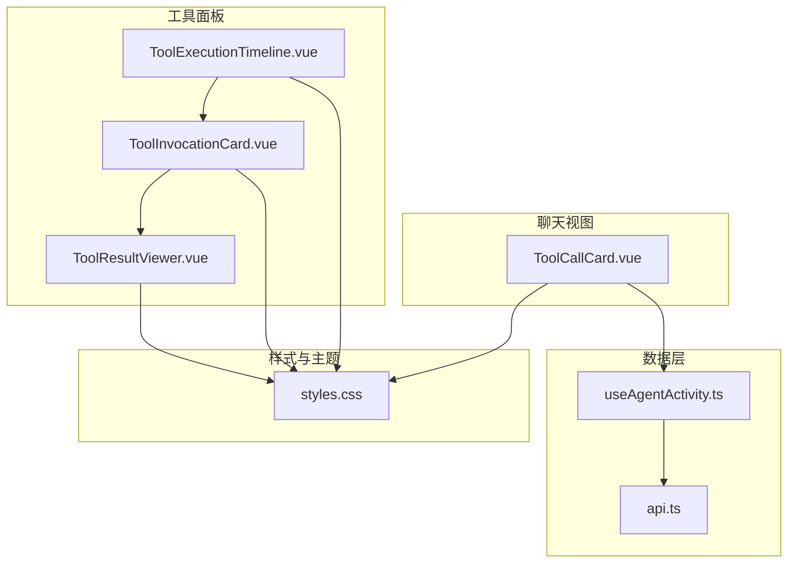
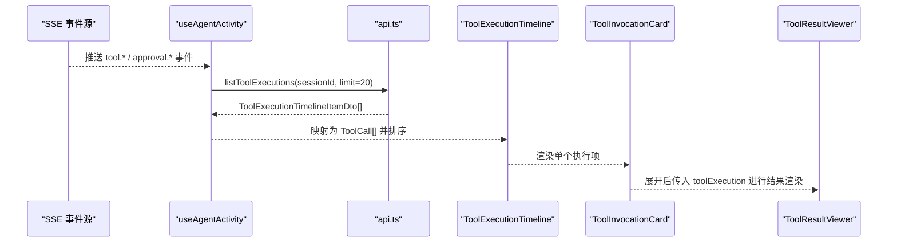
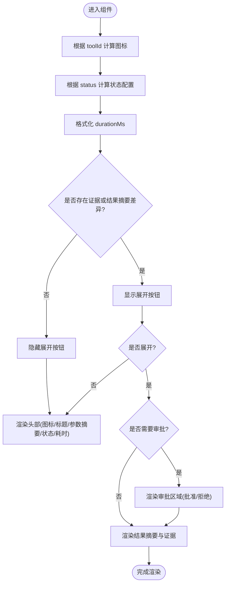
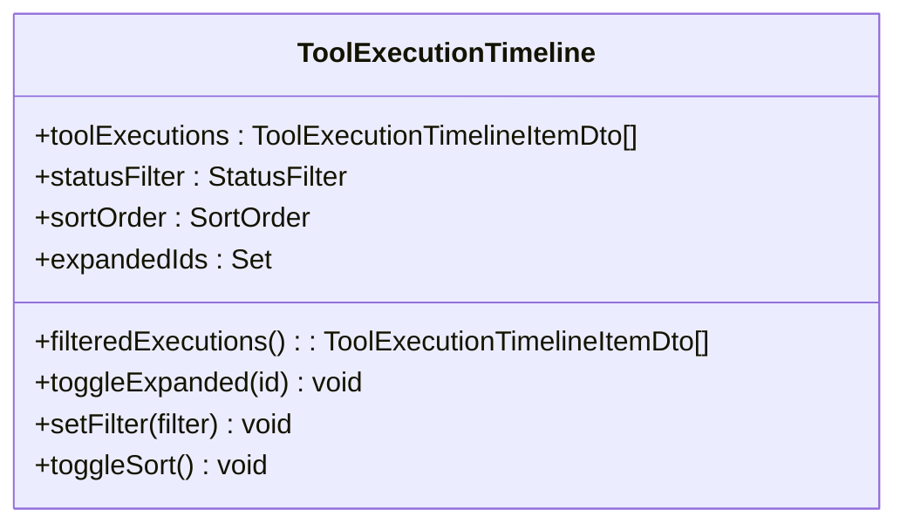
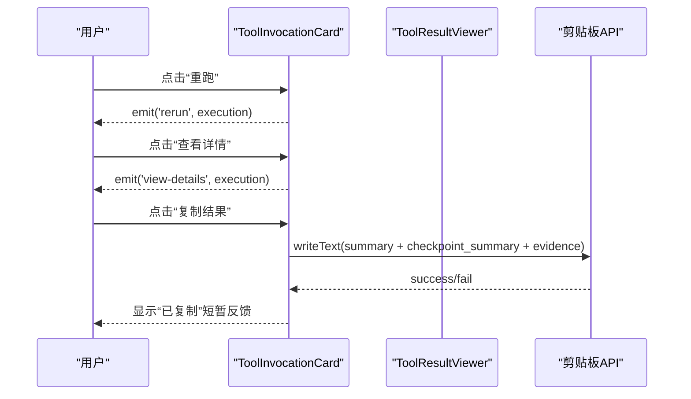
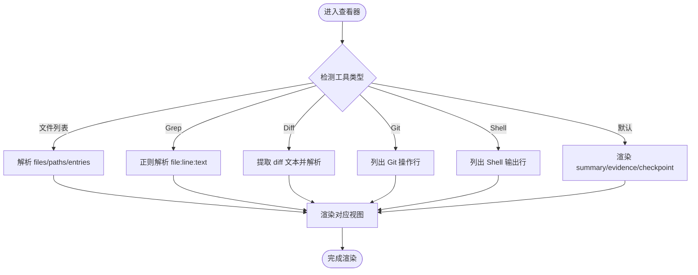
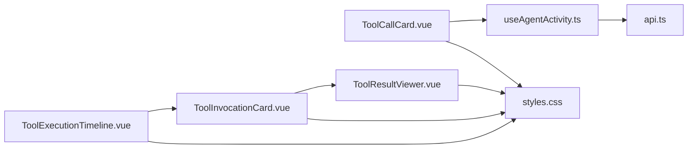

# 工具调用卡片

<cite>
**本文引用的文件**   
- [ToolCallCard.vue](file://apps/desktop/src/components/chat/ToolCallCard.vue)
- [ToolInvocationCard.vue](file://apps/desktop/src/components/tools/ToolInvocationCard.vue)
- [ToolResultViewer.vue](file://apps/desktop/src/components/tools/ToolResultViewer.vue)
- [ToolExecutionTimeline.vue](file://apps/desktop/src/components/tools/ToolExecutionTimeline.vue)
- [useAgentActivity.ts](file://apps/desktop/src/composables/useAgentActivity.ts)
- [api.ts](file://apps/desktop/src/api.ts)
- [styles.css](file://apps/desktop/src/styles.css)
</cite>

## 目录
1. [简介](#简介)
2. [项目结构](#项目结构)
3. [核心组件](#核心组件)
4. [架构总览](#架构总览)
5. [详细组件分析](#详细组件分析)
6. [依赖关系分析](#依赖关系分析)
7. [性能考虑](#性能考虑)
8. [故障排查指南](#故障排查指南)
9. [结论](#结论)
10. [附录](#附录)

## 简介
本文件为“工具调用卡片”相关的前端组件提供全面文档，覆盖以下能力：
- 工具执行状态展示（运行中、已完成、失败、等待审批等）
- 参数输入界面与摘要展示（参数提示、证据片段）
- 结果预览（文件列表、grep 匹配、diff、Git 操作、Shell 输出等）
- 状态管理（事件驱动更新、时间线刷新、排序过滤）
- 错误处理（网络异常、剪贴板不可用、解析失败）
- 用户交互（展开/折叠、复制、重新执行、查看详情、审批通过/拒绝）
- 实时反馈与进度指示（SSE 事件、轮询刷新、动画）
- 自定义样式与主题适配（CSS 变量、明暗主题）
- 多语言支持（i18n 键值约定）
- 可访问性与键盘导航（语义化标签、按钮焦点、ARIA 建议）

## 项目结构
围绕“工具调用卡片”的前端代码主要位于桌面应用前端模块中，关键文件如下：
- 聊天侧的轻量卡片：用于会话内快速展示工具调用摘要与审批交互
- 工具面板的时间线与详情卡片：用于调试/编排视图中的完整工具执行记录与结果预览
- 结果查看器：根据工具类型智能渲染不同结果格式
- 活动数据源：通过 SSE 与 API 拉取工具执行时间线并映射到 UI 模型
- 样式与主题：全局 CSS 变量支撑明暗主题与组件配色

图表来源
- [ToolCallCard.vue:1-120](file://apps/desktop/src/components/chat/ToolCallCard.vue#L1-L120)
- [ToolExecutionTimeline.vue:1-120](file://apps/desktop/src/components/tools/ToolExecutionTimeline.vue#L1-L120)
- [ToolInvocationCard.vue:1-120](file://apps/desktop/src/components/tools/ToolInvocationCard.vue#L1-L120)
- [ToolResultViewer.vue:1-120](file://apps/desktop/src/components/tools/ToolResultViewer.vue#L1-L120)
- [useAgentActivity.ts:1-120](file://apps/desktop/src/composables/useAgentActivity.ts#L1-L120)
- [api.ts:790-820](file://apps/desktop/src/api.ts#L790-L820)
- [styles.css:1-120](file://apps/desktop/src/styles.css#L1-L120)

章节来源
- [ToolCallCard.vue:1-120](file://apps/desktop/src/components/chat/ToolCallCard.vue#L1-L120)
- [ToolExecutionTimeline.vue:1-120](file://apps/desktop/src/components/tools/ToolExecutionTimeline.vue#L1-L120)
- [ToolInvocationCard.vue:1-120](file://apps/desktop/src/components/tools/ToolInvocationCard.vue#L1-L120)
- [ToolResultViewer.vue:1-120](file://apps/desktop/src/components/tools/ToolResultViewer.vue#L1-L120)
- [useAgentActivity.ts:1-120](file://apps/desktop/src/composables/useAgentActivity.ts#L1-L120)
- [api.ts:790-820](file://apps/desktop/src/api.ts#L790-L820)
- [styles.css:1-120](file://apps/desktop/src/styles.css#L1-L120)

## 核心组件
- ToolCallCard.vue：会话内的工具调用卡片，展示图标、名称、参数摘要、状态徽章、耗时、风险标签；在需要审批时显示批准/拒绝按钮；支持展开查看结果摘要与证据。
- ToolExecutionTimeline.vue：工具执行时间线，提供筛选（全部/成功/失败/审批/运行中）、排序（新/旧）、展开收起详情。
- ToolInvocationCard.vue：单条工具执行的详情卡片，包含来源、状态、风险、元信息、菜单（重跑/查看详情/复制结果），以及结果预览入口。
- ToolResultViewer.vue：结果查看器，按工具类型智能渲染（文件列表、grep 匹配、diff、Git 操作、Shell 输出、默认文本）。

章节来源
- [ToolCallCard.vue:1-140](file://apps/desktop/src/components/chat/ToolCallCard.vue#L1-L140)
- [ToolExecutionTimeline.vue:1-120](file://apps/desktop/src/components/tools/ToolExecutionTimeline.vue#L1-L120)
- [ToolInvocationCard.vue:1-120](file://apps/desktop/src/components/tools/ToolInvocationCard.vue#L1-L120)
- [ToolResultViewer.vue:1-120](file://apps/desktop/src/components/tools/ToolResultViewer.vue#L1-L120)

## 架构总览
组件间的数据流与交互关系如下：
- useAgentActivity 通过 SSE 接收运行时事件，并在工具相关事件后刷新工具执行时间线（API 拉取），将后端 DTO 映射为前端 ToolCall 模型。
- ToolExecutionTimeline 使用过滤与排序后的 ToolExecutionTimelineItemDto[] 渲染时间线节点。
- ToolInvocationCard 作为时间线节点的详情卡片，负责展示元信息与操作菜单，并将结果交给 ToolResultViewer 渲染。
- ToolCallCard 在聊天视图中直接消费 ToolCall 模型，呈现简洁的状态与审批交互。

图表来源
- [useAgentActivity.ts:540-583](file://apps/desktop/src/composables/useAgentActivity.ts#L540-L583)
- [api.ts:1020-1035](file://apps/desktop/src/api.ts#L1020-L1035)
- [ToolExecutionTimeline.vue:150-165](file://apps/desktop/src/components/tools/ToolExecutionTimeline.vue#L150-L165)
- [ToolInvocationCard.vue:130-145](file://apps/desktop/src/components/tools/ToolInvocationCard.vue#L130-L145)
- [ToolResultViewer.vue:115-140](file://apps/desktop/src/components/tools/ToolResultViewer.vue#L115-L140)

## 详细组件分析

### ToolCallCard（聊天视图工具调用卡片）
- 功能要点
  - 动态图标选择：基于 toolId 关键词匹配（read/file、search/grep/glob、patch/write/edit、git、shell/exec/sandbox、list/directory/find）
  - 状态徽章：pending/running/completed/failed/waiting_approval，带旋转动画
  - 耗时格式化：毫秒或秒
  - 风险标签：high/critical 标记高风险
  - 审批交互：当 status=waiting_approval 且存在 approvalId 时，显示批准/拒绝按钮，触发 approve/reject 事件
  - 详情展开：当存在 evidence 或 resultSummary 与 argsSummary 不同时，允许展开查看
- 状态管理与交互
  - 本地 expanded 控制展开/折叠
  - 通过 emit('approve'|'reject') 向父级传递审批决策
- 样式与主题
  - 使用 CSS 变量定义边框、背景、文字颜色与状态色
  - 支持明暗主题下的视觉一致性

图表来源
- [ToolCallCard.vue:32-73](file://apps/desktop/src/components/chat/ToolCallCard.vue#L32-L73)
- [ToolCallCard.vue:75-136](file://apps/desktop/src/components/chat/ToolCallCard.vue#L75-L136)

章节来源
- [ToolCallCard.vue:1-136](file://apps/desktop/src/components/chat/ToolCallCard.vue#L1-L136)

### ToolExecutionTimeline（工具执行时间线）
- 功能要点
  - 筛选：全部/成功/失败/审批/运行中，并显示计数
  - 排序：按请求时间升/降序
  - 展开/收起：维护 expandedIds Set
  - 元信息：时间、耗时、风险、层级、审批 ID
  - 证据标签：最多展示 3 个，其余以“+N more”表示
- 交互
  - 点击节点切换展开
  - 工具栏按钮切换筛选与排序
  - 向父级发出 rerun/view-details 事件

图表来源
- [ToolExecutionTimeline.vue:22-165](file://apps/desktop/src/components/tools/ToolExecutionTimeline.vue#L22-L165)

章节来源
- [ToolExecutionTimeline.vue:1-200](file://apps/desktop/src/components/tools/ToolExecutionTimeline.vue#L1-L200)

### ToolInvocationCard（工具执行详情卡片）
- 功能要点
  - 图标与来源分类：core/code/codex-rust/extension
  - 状态类名映射：completed/failed/running/waiting_approval/blocked/pending
  - 风险类名映射：read/shell/git/url/write/default
  - 时长与时间格式化
  - 参数提示：从 summary 拆分前 4 条
  - 审批提示：requires_approval 与 approval_id
  - 菜单操作：重跑、查看详情、复制结果（汇总 summary/checkpoint_summary/evidence）
- 交互
  - 展开/收起结果区
  - 菜单打开/关闭与遮罩点击关闭
  - 复制结果到剪贴板（失败静默处理）

图表来源
- [ToolInvocationCard.vue:115-141](file://apps/desktop/src/components/tools/ToolInvocationCard.vue#L115-L141)
- [ToolInvocationCard.vue:143-217](file://apps/desktop/src/components/tools/ToolInvocationCard.vue#L143-L217)

章节来源
- [ToolInvocationCard.vue:1-217](file://apps/desktop/src/components/tools/ToolInvocationCard.vue#L1-L217)

### ToolResultViewer（结果查看器）
- 功能要点
  - 类型识别：文件列表（read_file/list_directory/glob_search）、grep（grep_content）、diff（apply_patch/code_editor/git_worktree_manager）、Git（git_*）、Shell（sandbox_exec）
  - Diff 解析：提取 diff 文本并解析为文件与 hunk，逐行渲染增删改
  - Grep 匹配：正则解析 file:line:text
  - Shell 输出：原始文本块展示
  - 默认视图：summary/checkpoint_summary/evidence 列表
  - 复制结果：合并 summary/checkpoint_summary/evidence
- 交互
  - 展开/收起
  - 复制按钮反馈

图表来源
- [ToolResultViewer.vue:45-114](file://apps/desktop/src/components/tools/ToolResultViewer.vue#L45-L114)
- [ToolResultViewer.vue:116-210](file://apps/desktop/src/components/tools/ToolResultViewer.vue#L116-L210)

章节来源
- [ToolResultViewer.vue:1-210](file://apps/desktop/src/components/tools/ToolResultViewer.vue#L1-L210)

### 数据模型与映射
- ToolExecutionTimelineItemDto：包含 id、run_id、session_id、tool_id、tool_display_name、source、provider_layer、risk、requires_approval、status、approval_id、step_result_id、summary、evidence、requested_at、updated_at、duration_ms、requested_seq、updated_seq、event_types、checkpoint_summary
- ToolCall：前端简化模型，包含 id、toolId、toolName、status、startedAt、completedAt、durationMs、argsSummary、resultSummary、requiresApproval、approvalId、evidence、seq、risk
- 映射逻辑：在 useAgentActivity 中将 DTO 映射为 ToolCall，并进行排序

章节来源
- [api.ts:794-816](file://apps/desktop/src/api.ts#L794-L816)
- [useAgentActivity.ts:540-583](file://apps/desktop/src/composables/useAgentActivity.ts#L540-L583)

## 依赖关系分析
- 组件耦合
  - ToolExecutionTimeline 依赖 ToolInvocationCard 渲染详情
  - ToolInvocationCard 依赖 ToolResultViewer 渲染结果
  - ToolCallCard 独立于时间线，仅依赖 ToolCall 模型
- 数据依赖
  - useAgentActivity 依赖 api.ts 的事件连接与工具执行列表接口
  - 所有组件依赖 styles.css 的 CSS 变量实现主题一致
- 外部依赖
  - @lucide/vue 图标库
  - navigator.clipboard 剪贴板 API
  - EventSource SSE 事件流

图表来源
- [useAgentActivity.ts:540-583](file://apps/desktop/src/composables/useAgentActivity.ts#L540-L583)
- [api.ts:1020-1035](file://apps/desktop/src/api.ts#L1020-L1035)
- [ToolExecutionTimeline.vue:256-263](file://apps/desktop/src/components/tools/ToolExecutionTimeline.vue#L256-L263)
- [ToolInvocationCard.vue:213-216](file://apps/desktop/src/components/tools/ToolInvocationCard.vue#L213-L216)
- [styles.css:1-120](file://apps/desktop/src/styles.css#L1-L120)

章节来源
- [useAgentActivity.ts:540-583](file://apps/desktop/src/composables/useAgentActivity.ts#L540-L583)
- [api.ts:1020-1035](file://apps/desktop/src/api.ts#L1020-L1035)
- [ToolExecutionTimeline.vue:256-263](file://apps/desktop/src/components/tools/ToolExecutionTimeline.vue#L256-L263)
- [ToolInvocationCard.vue:213-216](file://apps/desktop/src/components/tools/ToolInvocationCard.vue#L213-L216)
- [styles.css:1-120](file://apps/desktop/src/styles.css#L1-L120)

## 性能考虑
- 事件驱动的增量更新：useAgentActivity 仅在 tool/approval/step/task 相关事件后刷新工具执行列表，避免全量频繁拉取
- 列表长度限制：limit=20 控制单次拉取数量，减少 DOM 压力
- 计算属性优化：各组件使用 computed 缓存派生数据（图标、状态、耗时、证据解析等）
- 渲染优化：证据与 diff 内容按需渲染，大文本使用滚动容器
- 动画与过渡：轻量 CSS 动画（旋转、脉冲、展开折叠）避免重排重绘开销

[本节为通用指导，不直接分析具体文件]

## 故障排查指南
- 网络连接失败
  - 现象：无法连接后端，工具执行列表为空
  - 排查：检查 gatewayUrl 与网络连通性；查看 api.ts 的 request 错误抛出
- JSON 解析失败
  - 现象：响应体非 JSON 导致解析异常
  - 排查：确认服务端返回格式；查看 extractErrorMessage 的错误提取逻辑
- 剪贴板不可用
  - 现象：复制结果失败无反馈
  - 排查：浏览器安全策略限制；捕获异常并静默处理
- 审批流程卡住
  - 现象：waiting_approval 状态未推进
  - 排查：确认 approval.requested/approved/rejected 事件是否到达；检查 ToolCall 状态映射

章节来源
- [api.ts:945-979](file://apps/desktop/src/api.ts#L945-L979)
- [useAgentActivity.ts:540-583](file://apps/desktop/src/composables/useAgentActivity.ts#L540-L583)
- [ToolInvocationCard.vue:115-130](file://apps/desktop/src/components/tools/ToolInvocationCard.vue#L115-L130)

## 结论
工具调用卡片体系通过清晰的组件分层与数据映射，实现了从事件驱动到结果可视化的完整链路。其设计兼顾了简洁的聊天视图与详尽的工具面板视图，提供了丰富的交互能力与良好的主题适配。建议在后续迭代中继续强化可访问性（ARIA、键盘导航）与国际化文案覆盖，以提升用户体验与可维护性。

[本节为总结性内容，不直接分析具体文件]

## 附录

### 自定义样式与主题适配
- 使用 CSS 变量统一色彩与边框，支持明暗主题切换
- 组件内 scoped 样式优先，必要时扩展全局变量
- 推荐遵循现有命名规范（如 --bg-secondary、--border-muted、--accent-primary）

章节来源
- [styles.css:1-200](file://apps/desktop/src/styles.css#L1-L200)

### 多语言处理
- 组件内硬编码文案建议迁移至 i18n 键值
- 参考 zh-CN.ts 的命名空间组织方式（app/nav/chat/context 等）
- 对工具状态、风险、审批等文案提供多语言键

章节来源
- [zh-CN.ts:1-200](file://apps/desktop/src/locales/zh-CN.ts#L1-L200)

### 可访问性与键盘导航
- 使用语义化标签（article、button、strong）提升可读性
- 为交互元素添加 aria-label 与 role（如 menu、tooltip）
- 确保 Tab 顺序合理，Enter/Space 触发按钮行为
- 高对比度与焦点可见性符合 WCAG 建议

[本节为通用指导，不直接分析具体文件]