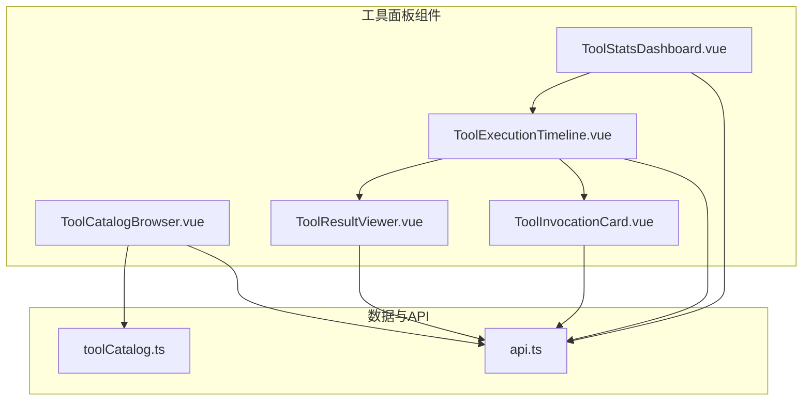
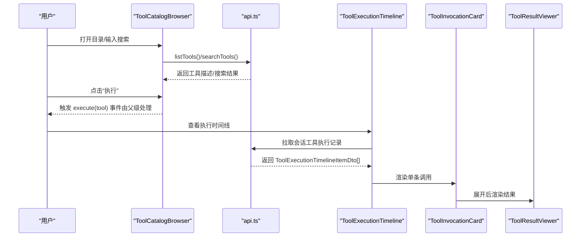
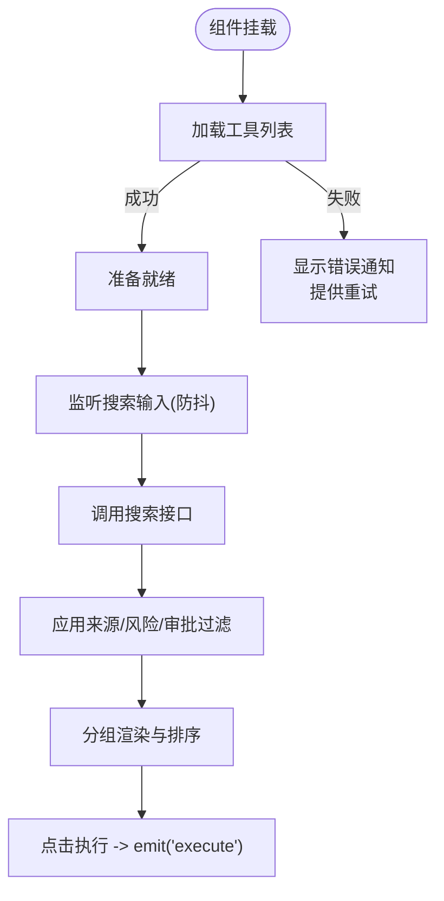
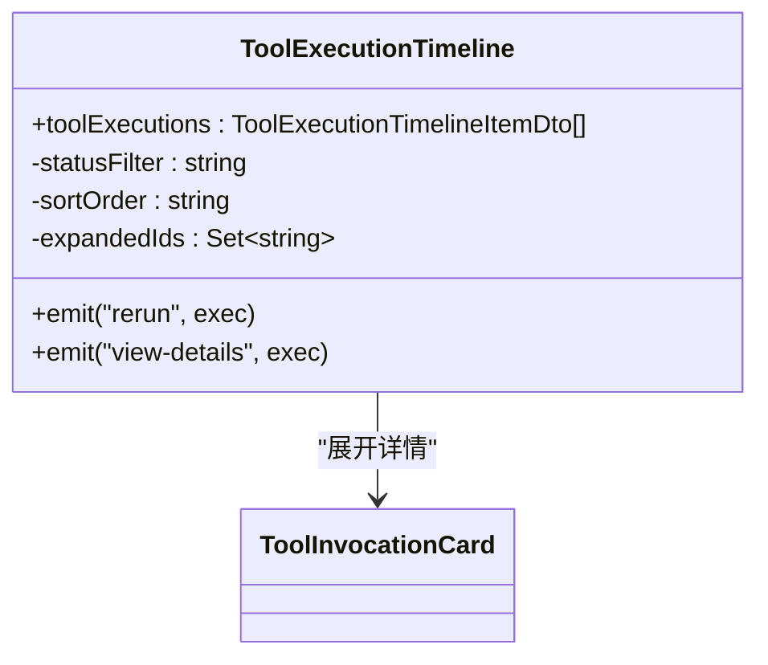
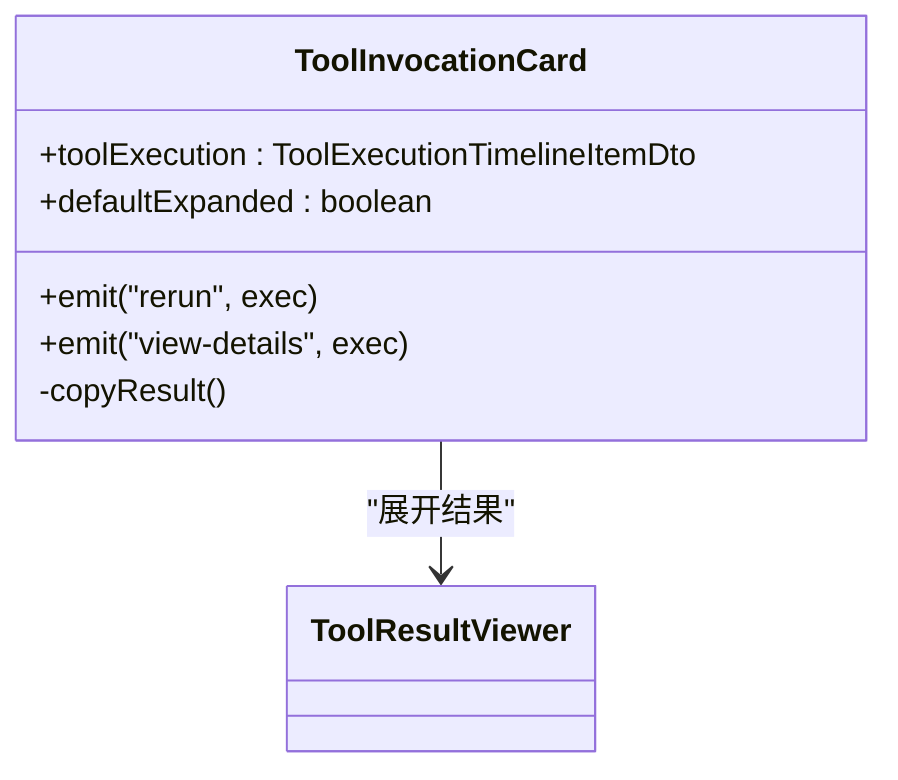
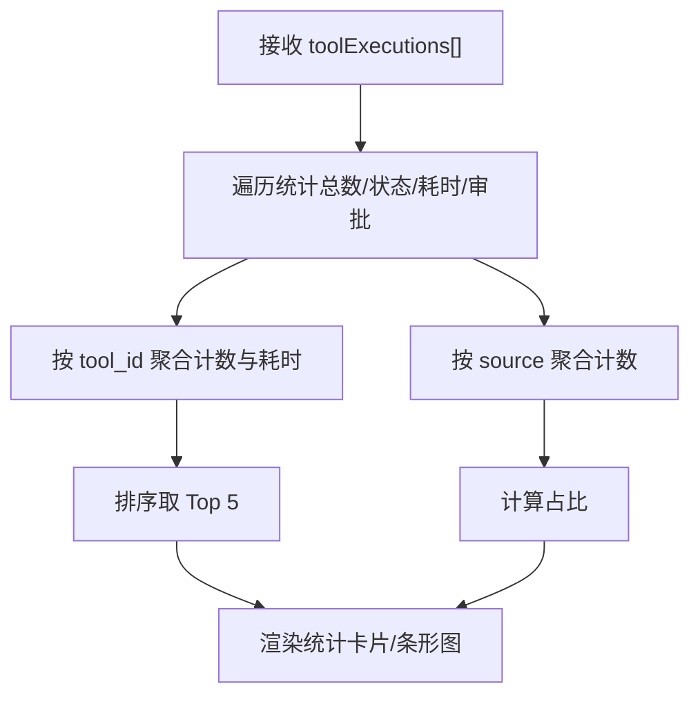
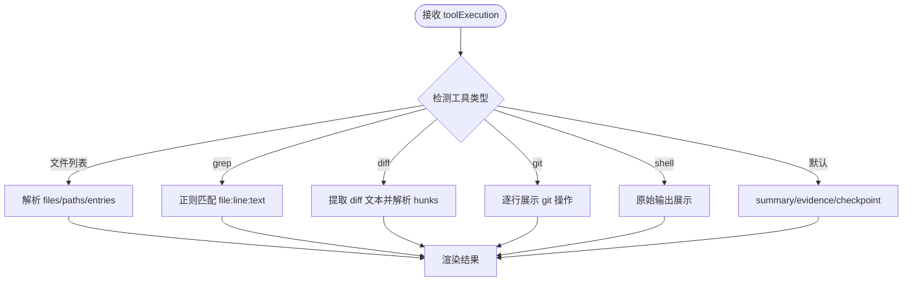
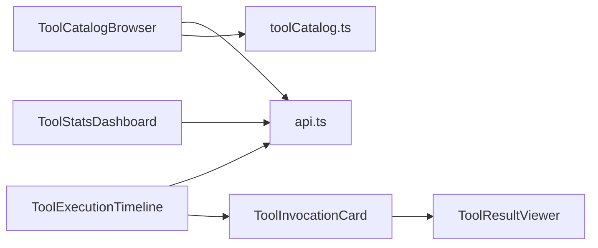

# 工具面板系统

<cite>
**本文引用的文件**
- [ToolCatalogBrowser.vue](file://apps/desktop/src/components/tools/ToolCatalogBrowser.vue)
- [ToolInvocationCard.vue](file://apps/desktop/src/components/tools/ToolInvocationCard.vue)
- [ToolExecutionTimeline.vue](file://apps/desktop/src/components/tools/ToolExecutionTimeline.vue)
- [ToolStatsDashboard.vue](file://apps/desktop/src/components/tools/ToolStatsDashboard.vue)
- [ToolResultViewer.vue](file://apps/desktop/src/components/tools/ToolResultViewer.vue)
- [api.ts](file://apps/desktop/src/api.ts)
- [toolCatalog.ts](file://apps/desktop/src/toolCatalog.ts)
- [PermissionSelector.vue](file://apps/desktop/src/components/PermissionSelector.vue)
</cite>

## 目录
1. [简介](#简介)
2. [项目结构](#项目结构)
3. [核心组件](#核心组件)
4. [架构总览](#架构总览)
5. [详细组件分析](#详细组件分析)
6. [依赖关系分析](#依赖关系分析)
7. [性能考虑](#性能考虑)
8. [故障排查指南](#故障排查指南)
9. [结论](#结论)
10. [附录](#附录)

## 简介
本文件为“工具面板系统”的完整组件文档，聚焦于工具的发现、注册、执行与监控。覆盖以下关键能力：
- 工具发现与检索：支持按来源、风险等级、审批要求筛选与搜索。
- 工具执行与跟踪：展示调用时间线、状态流转、证据与摘要。
- 结果展示：针对文件列表、grep 匹配、diff、Git 操作、Shell 输出等类型进行结构化呈现。
- 统计分析：汇总成功率、平均耗时、Top 工具、来源分布与审批通过率。
- 权限控制与审批流程：通过 requires_approval、approval_id 与 UI 提示引导人工审批。
- 错误处理与用户体验：统一的网络与解析错误提示、重试机制、加载态与空态。

## 项目结构
工具面板相关的前端实现集中在桌面应用的 Vue 组件中，数据模型与 API 封装在 api.ts，工具清单与排序逻辑在 toolCatalog.ts。

图表来源
- [ToolCatalogBrowser.vue:1-709](file://apps/desktop/src/components/tools/ToolCatalogBrowser.vue#L1-L709)
- [ToolExecutionTimeline.vue:1-646](file://apps/desktop/src/components/tools/ToolExecutionTimeline.vue#L1-L646)
- [ToolInvocationCard.vue:1-563](file://apps/desktop/src/components/tools/ToolInvocationCard.vue#L1-L563)
- [ToolStatsDashboard.vue:1-648](file://apps/desktop/src/components/tools/ToolStatsDashboard.vue#L1-L648)
- [ToolResultViewer.vue:1-463](file://apps/desktop/src/components/tools/ToolResultViewer.vue#L1-L463)
- [api.ts:790-989](file://apps/desktop/src/api.ts#L790-L989)
- [toolCatalog.ts:1-138](file://apps/desktop/src/toolCatalog.ts#L1-L138)

章节来源
- [ToolCatalogBrowser.vue:1-709](file://apps/desktop/src/components/tools/ToolCatalogBrowser.vue#L1-L709)
- [ToolExecutionTimeline.vue:1-646](file://apps/desktop/src/components/tools/ToolExecutionTimeline.vue#L1-L646)
- [ToolInvocationCard.vue:1-563](file://apps/desktop/src/components/tools/ToolInvocationCard.vue#L1-L563)
- [ToolStatsDashboard.vue:1-648](file://apps/desktop/src/components/tools/ToolStatsDashboard.vue#L1-L648)
- [ToolResultViewer.vue:1-463](file://apps/desktop/src/components/tools/ToolResultViewer.vue#L1-L463)
- [api.ts:790-989](file://apps/desktop/src/api.ts#L790-L989)
- [toolCatalog.ts:1-138](file://apps/desktop/src/toolCatalog.ts#L1-L138)

## 核心组件
- ToolCatalogBrowser：工具目录浏览与搜索，支持按来源、风险、审批过滤；点击“执行”触发 execute 事件。
- ToolExecutionTimeline：工具执行时间线，支持状态筛选、排序、展开详情。
- ToolInvocationCard：单条工具调用的卡片，展示状态、时长、证据、审批标记，支持重跑与查看详情。
- ToolStatsDashboard：统计面板，展示总体指标、状态分布、Top 工具、来源分布与审批通过率。
- ToolResultViewer：结果查看器，根据工具类型渲染文件列表、grep 匹配、diff、Git 操作、Shell 输出或默认文本。

章节来源
- [ToolCatalogBrowser.vue:1-709](file://apps/desktop/src/components/tools/ToolCatalogBrowser.vue#L1-L709)
- [ToolExecutionTimeline.vue:1-646](file://apps/desktop/src/components/tools/ToolExecutionTimeline.vue#L1-L646)
- [ToolInvocationCard.vue:1-563](file://apps/desktop/src/components/tools/ToolInvocationCard.vue#L1-L563)
- [ToolStatsDashboard.vue:1-648](file://apps/desktop/src/components/tools/ToolStatsDashboard.vue#L1-L648)
- [ToolResultViewer.vue:1-463](file://apps/desktop/src/components/tools/ToolResultViewer.vue#L1-L463)

## 架构总览
前端通过 api.ts 提供的接口获取工具清单与执行记录，组件之间以 props/emits 组合，形成“目录浏览 → 时间线 → 卡片 → 结果查看”的视图链路。

图表来源
- [ToolCatalogBrowser.vue:1-709](file://apps/desktop/src/components/tools/ToolCatalogBrowser.vue#L1-L709)
- [ToolExecutionTimeline.vue:1-646](file://apps/desktop/src/components/tools/ToolExecutionTimeline.vue#L1-L646)
- [ToolInvocationCard.vue:1-563](file://apps/desktop/src/components/tools/ToolInvocationCard.vue#L1-L563)
- [ToolResultViewer.vue:1-463](file://apps/desktop/src/components/tools/ToolResultViewer.vue#L1-L463)
- [api.ts:790-989](file://apps/desktop/src/api.ts#L790-L989)

## 详细组件分析

### ToolCatalogBrowser（工具目录浏览器）
- 功能要点
  - 本地/远程工具列表加载与错误重试。
  - 搜索框带防抖，调用搜索接口并限制返回数量。
  - 多条件过滤：来源、风险等级、是否需审批。
  - 分组展示与排序（core/code/codex-rust/extension）。
  - 展开详情显示 domain、source、risk、requires_approval、execute_endpoint、capabilities。
  - 点击“执行”向上抛出 execute 事件。
- 属性与事件
  - 属性：tools（可选，外部传入的工具描述数组）
  - 事件：execute（参数为 ToolDescriptorDto）
- 交互流程
  - 挂载时尝试加载工具列表；失败则通过通知提示并提供重试。
  - 搜索输入防抖 300ms，清空输入时重置搜索结果。
  - 过滤函数同时应用来源、风险、审批三类条件。
- 错误处理
  - 网络异常与解析异常统一捕获，使用通知组件提示并允许重试。
- 性能优化
  - 搜索防抖避免频繁请求。
  - 分组与排序仅对可见数据计算。

图表来源
- [ToolCatalogBrowser.vue:1-709](file://apps/desktop/src/components/tools/ToolCatalogBrowser.vue#L1-L709)

章节来源
- [ToolCatalogBrowser.vue:1-709](file://apps/desktop/src/components/tools/ToolCatalogBrowser.vue#L1-L709)

### ToolExecutionTimeline（工具执行时间线）
- 功能要点
  - 基于 ToolExecutionTimelineItemDto[] 渲染时间线节点。
  - 支持状态筛选（全部/成功/失败/审批/运行中）与时间排序（新/旧）。
  - 展开节点后内嵌 ToolInvocationCard 展示详细信息。
- 属性与事件
  - 属性：toolExecutions（执行记录数组）
  - 事件：rerun、view-details（向上传递当前执行项）
- 数据处理
  - 计算过滤后的列表与计数，按 requested_at 排序。
  - 格式化时间与时长，区分不同状态的视觉样式。
- 交互
  - 点击行切换展开；菜单项触发重跑与查看详情。

图表来源
- [ToolExecutionTimeline.vue:1-646](file://apps/desktop/src/components/tools/ToolExecutionTimeline.vue#L1-L646)
- [ToolInvocationCard.vue:1-563](file://apps/desktop/src/components/tools/ToolInvocationCard.vue#L1-L563)

章节来源
- [ToolExecutionTimeline.vue:1-646](file://apps/desktop/src/components/tools/ToolExecutionTimeline.vue#L1-L646)

### ToolInvocationCard（工具调用卡片）
- 功能要点
  - 展示工具名称、ID、来源、状态、时长、风险等级、层信息、时间戳与序列号。
  - 需要审批时显示审批标识与 approval_id。
  - 证据片段预览，支持复制结果到剪贴板。
  - 展开后可嵌入 ToolResultViewer 查看详细结果。
- 属性与事件
  - 属性：toolExecution（执行项）、defaultExpanded（默认展开）
  - 事件：rerun、view-details
- 交互
  - 顶部菜单支持重跑、查看详情、复制结果。
  - 底部按钮切换结果展开/收起。

图表来源
- [ToolInvocationCard.vue:1-563](file://apps/desktop/src/components/tools/ToolInvocationCard.vue#L1-L563)
- [ToolResultViewer.vue:1-463](file://apps/desktop/src/components/tools/ToolResultViewer.vue#L1-L463)

章节来源
- [ToolInvocationCard.vue:1-563](file://apps/desktop/src/components/tools/ToolInvocationCard.vue#L1-L563)

### ToolStatsDashboard（统计面板）
- 功能要点
  - 总体指标：总调用数、完成数、失败数、等待审批数、平均耗时、审批通过率。
  - 状态分布条形图：completed/failed/running/pending/waiting_approval/blocked。
  - Top 工具：按调用次数排序，展示平均耗时。
  - 来源分布：按 source 聚合占比。
- 属性
  - 属性：toolExecutions（执行记录数组）
- 计算复杂度
  - 单次遍历 O(n)，Map 聚合 byTool/bySource，排序 top 工具 O(k log k)。

图表来源
- [ToolStatsDashboard.vue:1-648](file://apps/desktop/src/components/tools/ToolStatsDashboard.vue#L1-L648)

章节来源
- [ToolStatsDashboard.vue:1-648](file://apps/desktop/src/components/tools/ToolStatsDashboard.vue#L1-L648)

### ToolResultViewer（结果查看器）
- 功能要点
  - 自动识别工具类型并渲染对应视图：
    - 文件列表：read_file/list_directory/glob_search
    - grep 匹配：grep_content
    - diff：apply_patch/code_editor/git_worktree_manager
    - Git 操作：git_* 系列
    - Shell 输出：sandbox_exec
    - 默认：summary/evidence/checkpoint_summary
  - 支持复制结果、折叠/展开。
- 属性
  - 属性：toolExecution、defaultExpanded
- 解析策略
  - 从 evidence 与 checkpoint_summary 中提取 diff 文本并解析为文件与 hunk。
  - 正则提取 grep 匹配的行信息与路径。

图表来源
- [ToolResultViewer.vue:1-463](file://apps/desktop/src/components/tools/ToolResultViewer.vue#L1-L463)

章节来源
- [ToolResultViewer.vue:1-463](file://apps/desktop/src/components/tools/ToolResultViewer.vue#L1-L463)

### 工具权限控制与审批流程
- 数据模型
  - ToolDescriptorDto 包含 risk、requires_approval、execute_endpoint、capabilities。
  - ToolExecutionTimelineItemDto 包含 status、requires_approval、approval_id、summary、evidence、checkpoint_summary。
- 前端表现
  - 目录与时间线均根据 requires_approval 显示审批标识。
  - 卡片与时间线节点在 waiting_approval 或 requires_approval 时高亮提示。
- 权限选择器
  - PermissionSelector 提供 default/auto-approve/full-access 三种模式，用于上层业务配置权限级别。
- 审批流程建议
  - 当 requires_approval 为真且 status 为 waiting_approval 时，应进入审批界面，决策后更新 approval_id 并继续执行。
  - 审批通过后，将状态推进至 running/completed，并在证据中记录审批摘要。

章节来源
- [api.ts:790-989](file://apps/desktop/src/api.ts#L790-L989)
- [ToolCatalogBrowser.vue:1-709](file://apps/desktop/src/components/tools/ToolCatalogBrowser.vue#L1-L709)
- [ToolExecutionTimeline.vue:1-646](file://apps/desktop/src/components/tools/ToolExecutionTimeline.vue#L1-L646)
- [ToolInvocationCard.vue:1-563](file://apps/desktop/src/components/tools/ToolInvocationCard.vue#L1-L563)
- [PermissionSelector.vue:1-108](file://apps/desktop/src/components/PermissionSelector.vue#L1-L108)

## 依赖关系分析
- 组件间依赖
  - ToolExecutionTimeline 依赖 ToolInvocationCard 与 ToolResultViewer。
  - ToolInvocationCard 依赖 ToolResultViewer。
  - ToolStatsDashboard 独立计算，不直接依赖其他组件。
- 数据依赖
  - 所有组件依赖 api.ts 中的 DTO 定义与请求方法。
  - ToolCatalogBrowser 依赖 toolCatalog.ts 的排序与分组辅助函数。

图表来源
- [ToolCatalogBrowser.vue:1-709](file://apps/desktop/src/components/tools/ToolCatalogBrowser.vue#L1-L709)
- [ToolExecutionTimeline.vue:1-646](file://apps/desktop/src/components/tools/ToolExecutionTimeline.vue#L1-L646)
- [ToolInvocationCard.vue:1-563](file://apps/desktop/src/components/tools/ToolInvocationCard.vue#L1-L563)
- [ToolStatsDashboard.vue:1-648](file://apps/desktop/src/components/tools/ToolStatsDashboard.vue#L1-L648)
- [ToolResultViewer.vue:1-463](file://apps/desktop/src/components/tools/ToolResultViewer.vue#L1-L463)
- [api.ts:790-989](file://apps/desktop/src/api.ts#L790-L989)
- [toolCatalog.ts:1-138](file://apps/desktop/src/toolCatalog.ts#L1-L138)

章节来源
- [ToolCatalogBrowser.vue:1-709](file://apps/desktop/src/components/tools/ToolCatalogBrowser.vue#L1-L709)
- [ToolExecutionTimeline.vue:1-646](file://apps/desktop/src/components/tools/ToolExecutionTimeline.vue#L1-L646)
- [ToolInvocationCard.vue:1-563](file://apps/desktop/src/components/tools/ToolInvocationCard.vue#L1-L563)
- [ToolStatsDashboard.vue:1-648](file://apps/desktop/src/components/tools/ToolStatsDashboard.vue#L1-L648)
- [ToolResultViewer.vue:1-463](file://apps/desktop/src/components/tools/ToolResultViewer.vue#L1-L463)
- [api.ts:790-989](file://apps/desktop/src/api.ts#L790-L989)
- [toolCatalog.ts:1-138](file://apps/desktop/src/toolCatalog.ts#L1-L138)

## 性能考虑
- 搜索防抖：ToolCatalogBrowser 使用 300ms 防抖减少无效请求。
- 列表排序与过滤：仅在必要时机计算，避免重复开销。
- 大数据量渲染：时间线与统计面板采用分页/限制数量的策略（如搜索 limit=50），避免一次性渲染过多节点。
- 结果展示优化：Diff 与长文本按需解析与裁剪，避免阻塞主线程。
- 资源管理：组件卸载时清理定时器与事件监听（如搜索防抖、全局点击事件）。

[本节为通用指导，无需特定文件引用]

## 故障排查指南
- 常见错误
  - 后端参数解析失败：例如 JSON 字段类型不匹配导致 INVALID_PARAMETER。
  - 网络不可达或 CORS 拦截：request 包装会抛出连接失败或响应非 JSON 的错误。
- 定位步骤
  - 检查 api.ts 的请求方法与错误提取逻辑，确认网关地址与请求头。
  - 查看 ToolCatalogBrowser 的通知提示与重试按钮，确认是否可恢复。
  - 在时间线与卡片中观察 status、requires_approval、approval_id 是否符合预期。
- 修复建议
  - 修正客户端传递的参数结构与后端契约一致（如数组字段不应传字符串）。
  - 增加更详细的错误日志与上下文（session_id、run_id、tool_id）。
  - 对高风险工具增加前置校验与二次确认。

章节来源
- [api.ts:790-989](file://apps/desktop/src/api.ts#L790-L989)
- [ToolCatalogBrowser.vue:1-709](file://apps/desktop/src/components/tools/ToolCatalogBrowser.vue#L1-L709)
- [ToolExecutionTimeline.vue:1-646](file://apps/desktop/src/components/tools/ToolExecutionTimeline.vue#L1-L646)
- [ToolInvocationCard.vue:1-563](file://apps/desktop/src/components/tools/ToolInvocationCard.vue#L1-L563)

## 结论
工具面板系统通过清晰的组件分层与数据契约，实现了工具的全生命周期可视化与管理。目录浏览、时间线追踪、结果展示与统计分析共同构成完整的用户体验闭环。结合权限与审批机制，可在保证安全性的前提下提升效率。建议在后续迭代中增强错误诊断、性能监控与可扩展性（如插件化工具源）。

[本节为总结性内容，无需特定文件引用]

## 附录

### 数据模型概览（节选）
- ToolDescriptorDto：工具描述（id、display_name、domain、source、risk、requires_approval、execute_endpoint、capabilities）
- ToolSearchResultDto：搜索结果（tool、score、matched_fields、provider_layer、requires_human_checkpoint、approval_summary）
- ToolExecutionTimelineItemDto：执行记录（id、run_id、session_id、tool_id、tool_display_name、source、provider_layer、risk、requires_approval、status、approval_id、summary、evidence、requested_at、updated_at、duration_ms、requested_seq、updated_seq、event_types、checkpoint_summary）

章节来源
- [api.ts:790-989](file://apps/desktop/src/api.ts#L790-L989)