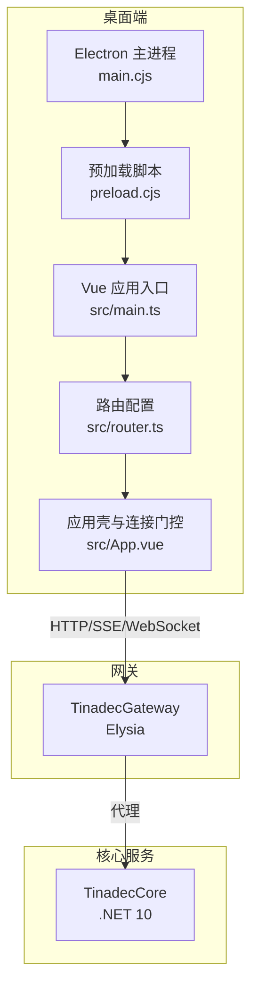
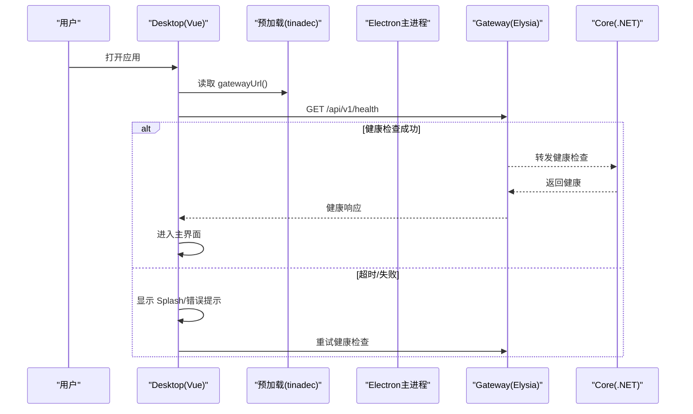
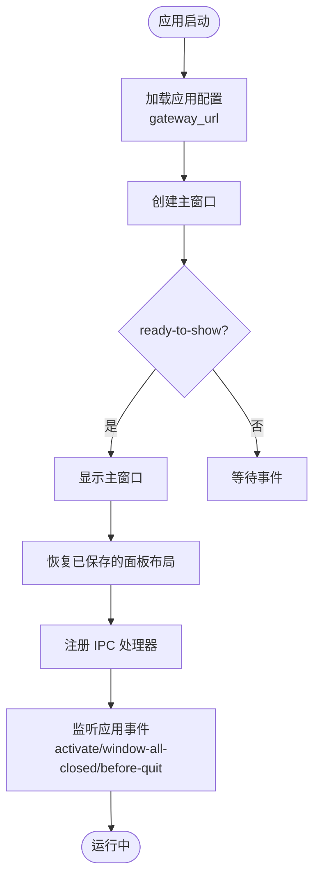
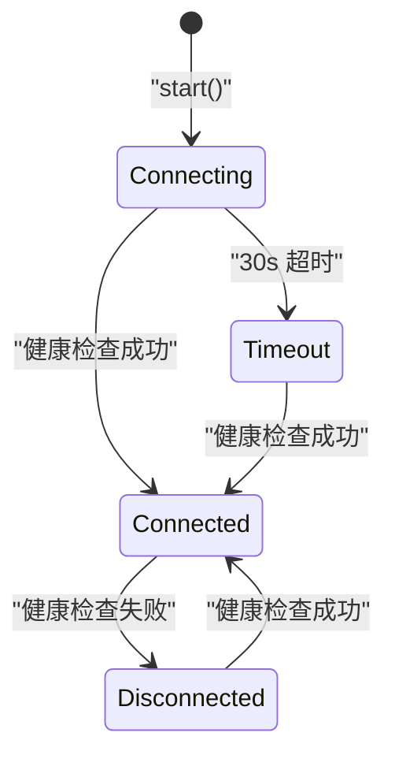
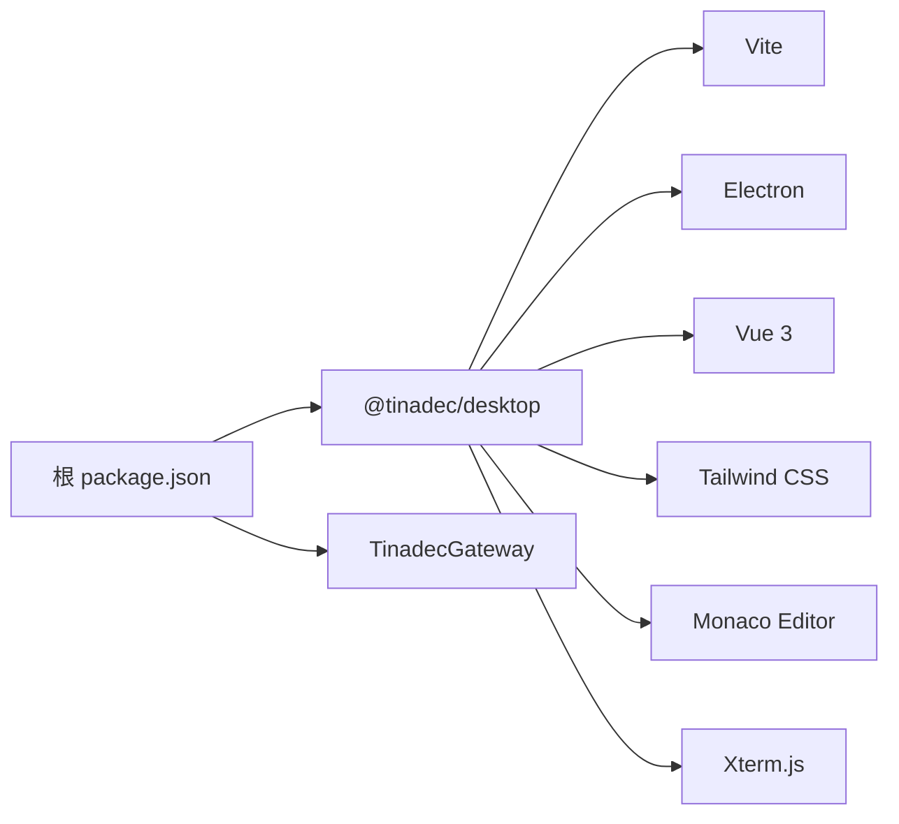

# 应用概览与架构

<cite>
**本文引用的文件**   
- [README.md](file://README.md)
- [package.json（根）](file://package.json)
- [apps/desktop/package.json](file://apps/desktop/package.json)
- [apps/desktop/vite.config.ts](file://apps/desktop/vite.config.ts)
- [apps/desktop/src/main.ts](file://apps/desktop/src/main.ts)
- [apps/desktop/src/router.ts](file://apps/desktop/src/router.ts)
- [apps/desktop/src/App.vue](file://apps/desktop/src/App.vue)
- [apps/desktop/src/composables/useConnection.ts](file://apps/desktop/src/composables/useConnection.ts)
- [apps/desktop/src/composables/useNotifications.ts](file://apps/desktop/src/composables/useNotifications.ts)
- [apps/desktop/electron/main.cjs](file://apps/desktop/electron/main.cjs)
- [apps/desktop/electron/preload.cjs](file://apps/desktop/electron/preload.cjs)
- [apps/desktop/electron/panelWindow.cjs](file://apps/desktop/electron/panelWindow.cjs)
- [apps/desktop/electron/appConfig.cjs](file://apps/desktop/electron/appConfig.cjs)
- [docs/startup.md](file://docs/startup.md)
</cite>

## 目录
1. [简介](#简介)
2. [项目结构](#项目结构)
3. [核心组件](#核心组件)
4. [架构总览](#架构总览)
5. [详细组件分析](#详细组件分析)
6. [依赖关系分析](#依赖关系分析)
7. [性能考虑](#性能考虑)
8. [故障排查指南](#故障排查指南)
9. [结论](#结论)
10. [附录](#附录)

## 简介
TinadecOffice 是一个面向 AI 智能体协作的桌面工作空间。前端采用 Electron + Vue 3 + Vite，后端由 .NET Core 的 TinadecCore 提供唯一状态权威，中间通过 Elysia 的 TinadecGateway 作为薄 BFF/代理层。Desktop 负责 UI 呈现、窗口管理与用户交互；Gateway 聚合 Core 资源并提供无状态中心视图；Core 负责编排、工具策略、模型路由、持久化与就绪回执。

设计原则强调：
- Core 是唯一状态权威，Gateway 与 Desktop 不保存业务状态
- Desktop 仅调用 Gateway，不直接访问 Core
- 写操作必须经过审批门
- API 契约统一 snake_case

## 项目结构
- apps/desktop：Electron 主进程与 Vue 渲染器工程，包含 Vite 构建配置、路由、页面与组件、IPC 预加载桥接、面板与宠物窗口管理
- TinadecGateway：Elysia TypeScript 网关，提供代理与 Swagger
- TinadecCore：.NET 模块化单体，提供健康检查、就绪检查、Agent 清单等接口
- TinadecTools：工具层（文件、命令、Git、MCP 等），支持审批门控
- docs：产品模型、架构、安全、启动手册等文档

图表来源
- [apps/desktop/electron/main.cjs:1-120](file://apps/desktop/electron/main.cjs#L1-L120)
- [apps/desktop/electron/preload.cjs:1-60](file://apps/desktop/electron/preload.cjs#L1-L60)
- [apps/desktop/src/main.ts:1-24](file://apps/desktop/src/main.ts#L1-L24)
- [apps/desktop/src/router.ts:1-45](file://apps/desktop/src/router.ts#L1-L45)
- [apps/desktop/src/App.vue:1-80](file://apps/desktop/src/App.vue#L1-L80)

章节来源
- [README.md:17-43](file://README.md#L17-L43)
- [package.json（根）:1-36](file://package.json#L1-L36)
- [apps/desktop/package.json:1-69](file://apps/desktop/package.json#L1-L69)

## 核心组件
- Electron 主进程：创建主窗口、子面板窗口、宠物窗口、调试工作室窗口；注册 IPC 通道；处理应用生命周期与退出前持久化
- 预加载桥接：向渲染进程暴露 tinadec API（Gateway URL、窗口控制、终端、面板、通知广播等）
- Vue 应用：初始化路由、国际化、主题；App.vue 负责背景层、连接门控、通知同步与页面过渡
- 连接门控：useConnection 维护 connecting/connected/timeout/disconnected 状态机，轮询健康并提示重试
- 通知系统：useNotifications 实现“通知岛”式展示，支持 transient/status/task 三类通知，跨窗口状态同步
- 面板窗口管理：panelWindow.cjs 管理可分离面板的创建、恢复、重附着、关闭与布局持久化
- 应用配置：appConfig.cjs 管理 Gateway URL（环境变量优先、用户配置次之、默认值兜底）

章节来源
- [apps/desktop/electron/main.cjs:1-120](file://apps/desktop/electron/main.cjs#L1-L120)
- [apps/desktop/electron/preload.cjs:1-112](file://apps/desktop/electron/preload.cjs#L1-L112)
- [apps/desktop/src/main.ts:1-24](file://apps/desktop/src/main.ts#L1-L24)
- [apps/desktop/src/App.vue:1-120](file://apps/desktop/src/App.vue#L1-L120)
- [apps/desktop/src/composables/useConnection.ts:1-138](file://apps/desktop/src/composables/useConnection.ts#L1-L138)
- [apps/desktop/src/composables/useNotifications.ts:1-200](file://apps/desktop/src/composables/useNotifications.ts#L1-L200)
- [apps/desktop/electron/panelWindow.cjs:1-120](file://apps/desktop/electron/panelWindow.cjs#L1-L120)
- [apps/desktop/electron/appConfig.cjs:1-74](file://apps/desktop/electron/appConfig.cjs#L1-L74)

## 架构总览
整体采用三层架构：Desktop（UI/窗口/IPC）、Gateway（BFF/代理）、Core（状态权威）。Desktop 通过 preload 暴露的 tinadec API 与主进程通信，再由主进程或渲染进程发起 HTTP/SSE/WebSocket 请求至 Gateway，Gateway 转发到 Core。事件流通过 SSE 回推，Gateway 再透传给 Desktop。

图表来源
- [apps/desktop/src/App.vue:32-80](file://apps/desktop/src/App.vue#L32-L80)
- [apps/desktop/src/composables/useConnection.ts:73-126](file://apps/desktop/src/composables/useConnection.ts#L73-L126)
- [apps/desktop/electron/preload.cjs:1-20](file://apps/desktop/electron/preload.cjs#L1-L20)
- [docs/startup.md:1-40](file://docs/startup.md#L1-L40)

## 详细组件分析

### Electron 主进程与窗口管理
- 主窗口创建：设置尺寸、图标、隐藏标题栏、启用 preload、禁用 nodeIntegration 与沙箱隔离
- 开发模式：从 Vite 服务器加载 URL，自动打开 DevTools
- 子窗口：面板窗口（可分离）、宠物窗口（桌面宠物）、调试工作室窗口
- IPC 通道：窗口控制、项目选择、应用重启、主题广播、状态通知广播、终端管理等
- 生命周期：whenReady 初始化协议与窗口；before-quit 持久化面板布局并清理终端；window-all-closed 清理所有子窗口

图表来源
- [apps/desktop/electron/main.cjs:59-105](file://apps/desktop/electron/main.cjs#L59-L105)
- [apps/desktop/electron/main.cjs:329-374](file://apps/desktop/electron/main.cjs#L329-L374)
- [apps/desktop/electron/panelWindow.cjs:73-96](file://apps/desktop/electron/panelWindow.cjs#L73-L96)

章节来源
- [apps/desktop/electron/main.cjs:1-120](file://apps/desktop/electron/main.cjs#L1-L120)
- [apps/desktop/electron/panelWindow.cjs:1-120](file://apps/desktop/electron/panelWindow.cjs#L1-L120)

### 预加载桥接与 IPC 安全
- 通过 contextBridge.exposeInMainWorld 暴露 tinadec API，包括：
  - 应用配置与 Gateway URL 获取/重置
  - 窗口控制（最小化、最大化、关闭）
  - 调试工作室打开
  - 宠物窗口管理（创建、关闭、列表、下载、启用/禁用）
  - 终端管理（创建、写入、调整大小、销毁、数据/退出事件）
  - 面板窗口（分离、重附着、关闭、聚焦、广播主题）
  - 状态通知广播与订阅
- 渲染进程无法直接访问 Node/Electron 模块，保证安全隔离

章节来源
- [apps/desktop/electron/preload.cjs:1-112](file://apps/desktop/electron/preload.cjs#L1-L112)

### Vue 应用入口与路由
- main.ts：创建 Vue 应用实例，挂载路由、国际化、主题初始化，注入通知 fallback 文本
- router.ts：使用 Hash 历史模式，定义首页、设置、市场、调试工作室、代码编辑器、分离面板、桌面宠物等路由
- App.vue：背景层（图片/视频/HTML）、连接门控（Splash/超时/断开）、通知岛与详情弹窗、页面过渡动画

章节来源
- [apps/desktop/src/main.ts:1-24](file://apps/desktop/src/main.ts#L1-L24)
- [apps/desktop/src/router.ts:1-45](file://apps/desktop/src/router.ts#L1-L45)
- [apps/desktop/src/App.vue:1-120](file://apps/desktop/src/App.vue#L1-L120)

### 连接门控与状态机
- useConnection.ts：维护连接状态机（connecting/connected/timeout/disconnected），轮询健康接口，超时后进入 timeout，后续持续监控健康变化
- 在 App.vue 中根据状态显示 Splash、错误提示与重试按钮

图表来源
- [apps/desktop/src/composables/useConnection.ts:10-28](file://apps/desktop/src/composables/useConnection.ts#L10-L28)
- [apps/desktop/src/composables/useConnection.ts:96-129](file://apps/desktop/src/composables/useConnection.ts#L96-L129)
- [apps/desktop/src/App.vue:32-80](file://apps/desktop/src/App.vue#L32-L80)

章节来源
- [apps/desktop/src/composables/useConnection.ts:1-138](file://apps/desktop/src/composables/useConnection.ts#L1-L138)
- [apps/desktop/src/App.vue:32-80](file://apps/desktop/src/App.vue#L32-L80)

### 通知系统与跨窗口同步
- useNotifications.ts：实现“通知岛”，支持 transient/status/task 三类通知，具备去重、优先级、定时过期、悬停展开、详情弹窗、历史回溯
- 跨窗口状态同步：通过 tinadec.broadcastStatusNotification 与 onStatusNotification 实现多渲染窗口间的 status 条件同步，避免回声循环
- 任务通知：pending → settled，支持进度更新与结果展示

章节来源
- [apps/desktop/src/composables/useNotifications.ts:1-200](file://apps/desktop/src/composables/useNotifications.ts#L1-L200)
- [apps/desktop/src/composables/useNotifications.ts:535-612](file://apps/desktop/src/composables/useNotifications.ts#L535-L612)

### 面板窗口管理
- panelWindow.cjs：管理可分离面板窗口的创建、位置计算、显示时机、加载失败兜底、移动/resize 持久化、关闭/重附着/聚焦、主题广播
- 布局持久化：将面板窗口状态保存到用户目录 JSON 文件，应用启动时恢复

章节来源
- [apps/desktop/electron/panelWindow.cjs:1-120](file://apps/desktop/electron/panelWindow.cjs#L1-L120)
- [apps/desktop/electron/panelWindow.cjs:235-303](file://apps/desktop/electron/panelWindow.cjs#L235-L303)
- [apps/desktop/electron/panelWindow.cjs:315-336](file://apps/desktop/electron/panelWindow.cjs#L315-L336)

### 应用配置管理
- appConfig.cjs：Gateway URL 解析与校验（仅允许 http/https，禁止凭据/查询/片段），优先级：环境变量 > 用户配置文件 > 默认值
- 原子写入：临时文件 + rename 确保配置完整性

章节来源
- [apps/desktop/electron/appConfig.cjs:1-74](file://apps/desktop/electron/appConfig.cjs#L1-L74)

## 依赖关系分析
- 根 package.json：定义 workspaces、脚本（dev/build/test）、依赖 concurrently
- apps/desktop/package.json：Electron、Vue、Vite、Tailwind、Monaco、Xterm、i18n、测试框架等
- vite.config.ts：插件（Vue、Tailwind、MCP）、别名、开发服务器端口、构建输出、依赖优化、测试环境

图表来源
- [package.json（根）:1-36](file://package.json#L1-L36)
- [apps/desktop/package.json:1-69](file://apps/desktop/package.json#L1-L69)
- [apps/desktop/vite.config.ts:1-37](file://apps/desktop/vite.config.ts#L1-L37)

章节来源
- [package.json（根）:1-36](file://package.json#L1-L36)
- [apps/desktop/package.json:1-69](file://apps/desktop/package.json#L1-L69)
- [apps/desktop/vite.config.ts:1-37](file://apps/desktop/vite.config.ts#L1-L37)

## 性能考虑
- 首屏优化：Splash 仅在首次连接时显示，子窗口跳过启动序列
- 网络轮询：健康检查间隔与超时合理配置，避免频繁请求
- 渲染优化：背景层独立于路由过渡，避免 transform 导致的 position:fixed 降级
- 窗口管理：面板窗口延迟显示与加载失败兜底，防止不可见窗口
- 通知系统：限制最大条目数与历史长度，避免内存泄漏
- 构建优化：Vite 依赖预构建（xterm 等），减少运行时开销

[本节为通用指导，无需特定文件引用]

## 故障排查指南
- 启动问题：确认 Core/Gateway/Desktop 端口占用与健康检查
- 连接失败：检查 Gateway 可达性，必要时重启 Gateway/Core
- 面板窗口不可见：检查 ready-to-show 事件与加载失败回调
- 通知不同步：检查 tinadec API 是否暴露，确认广播与订阅逻辑
- 配置异常：验证 Gateway URL 格式与环境变量覆盖

章节来源
- [docs/startup.md:143-186](file://docs/startup.md#L143-L186)
- [apps/desktop/electron/main.cjs:329-374](file://apps/desktop/electron/main.cjs#L329-L374)
- [apps/desktop/electron/panelWindow.cjs:215-233](file://apps/desktop/electron/panelWindow.cjs#L215-L233)
- [apps/desktop/src/composables/useConnection.ts:96-129](file://apps/desktop/src/composables/useConnection.ts#L96-L129)

## 结论
TinadecOffice 通过清晰的三层架构与严格的 IPC 安全边界，实现了可扩展的桌面应用。Electron 主进程负责窗口与系统能力，Vue 渲染器专注 UI 与交互，Gateway 与 Core 提供稳定可靠的后端能力。连接门控、通知系统与面板管理增强了用户体验与可维护性。建议在生产环境中加强日志记录、错误上报与性能监控。

[本节为总结，无需特定文件引用]

## 附录
- 开发环境搭建：npm install、npm run restore:dotnet、npm run dev
- 构建流程：npm run build（工作区与 .NET 解决方案）
- 部署流程：打包 Electron 应用，分发 dist 与依赖
- 技术栈说明：Electron、Vue 3、Vite、Tailwind、Elysia、.NET 10、SQLite/PostgreSQL

章节来源
- [README.md:45-95](file://README.md#L45-L95)
- [package.json（根）:9-31](file://package.json#L9-L31)
- [docs/startup.md:1-40](file://docs/startup.md#L1-L40)