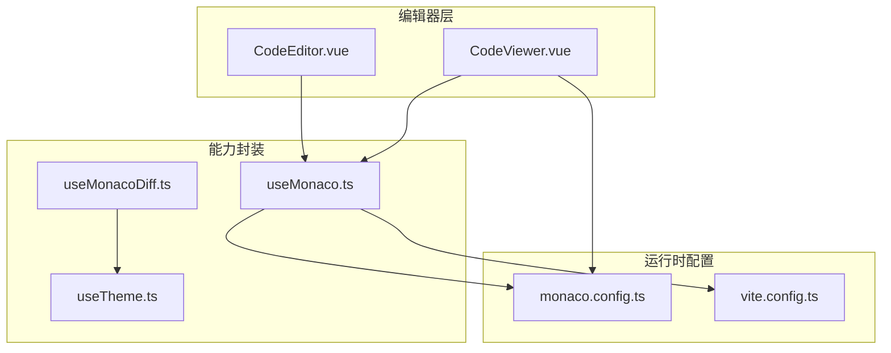
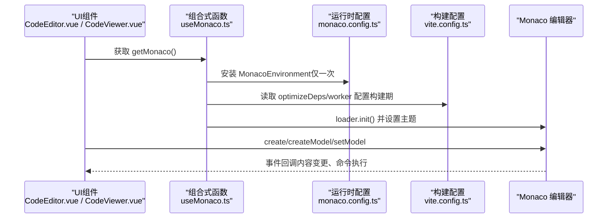
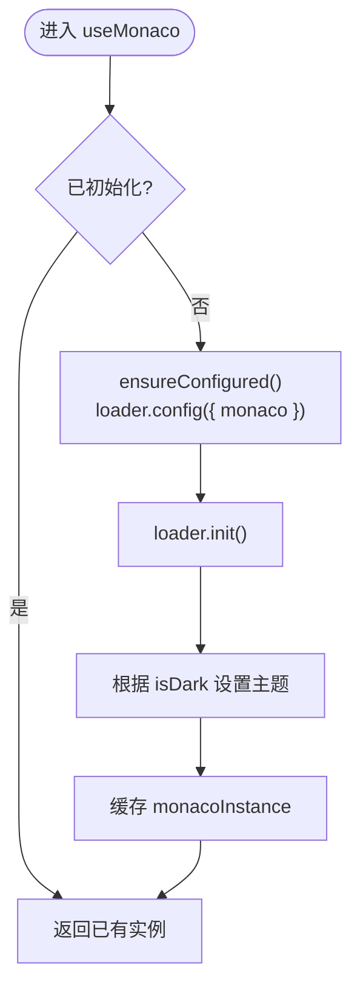
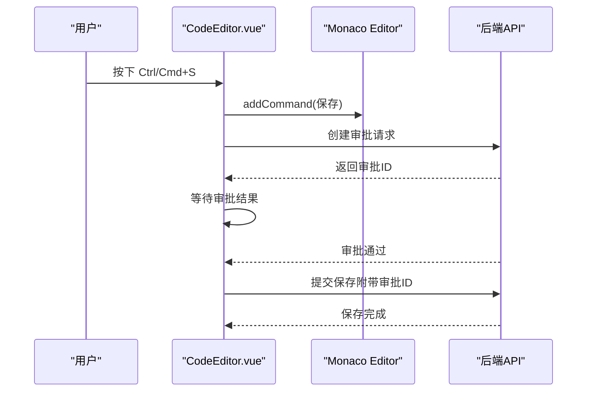
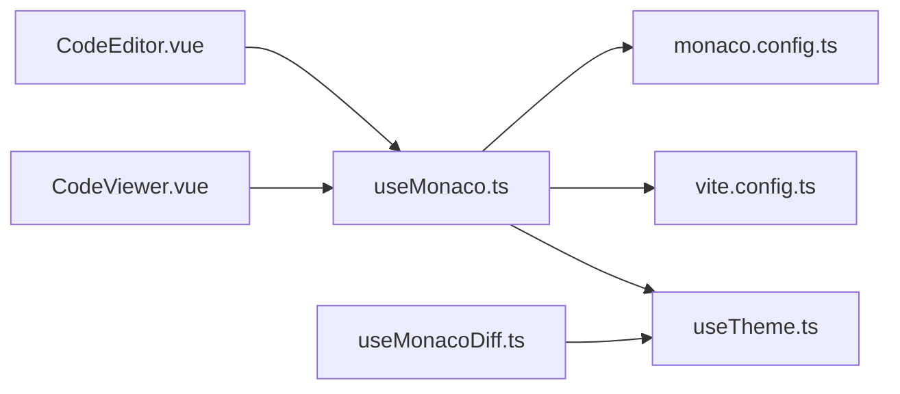

# 代码编辑器集成

<cite>
**本文引用的文件**
- [useMonaco.ts](file://apps/desktop/src/composables/useMonaco.ts)
- [monaco.config.ts](file://apps/desktop/src/monaco.config.ts)
- [CodeEditor.vue](file://apps/desktop/src/components/code/CodeEditor.vue)
- [CodeViewer.vue](file://apps/desktop/src/components/code/CodeViewer.vue)
- [useMonacoDiff.ts](file://apps/desktop/src/composables/useMonacoDiff.ts)
- [useTheme.ts](file://apps/desktop/src/composables/useTheme.ts)
- [vite.config.ts](file://apps/desktop/vite.config.ts)
</cite>

## 目录
1. [简介](#简介)
2. [项目结构](#项目结构)
3. [核心组件](#核心组件)
4. [架构总览](#架构总览)
5. [详细组件分析](#详细组件分析)
6. [依赖分析](#依赖分析)
7. [性能考虑](#性能考虑)
8. [故障排查指南](#故障排查指南)
9. [结论](#结论)
10. [附录](#附录)

## 简介
本文件面向代码编辑器集成功能，系统性说明 Monaco Editor 的初始化、主题与语言支持、语法高亮、自动补全与格式化、错误检查与实时验证、扩展机制、快捷键配置、状态管理、内容同步与撤销重做等实现细节。文档基于仓库中的 Vue 桌面应用代码进行梳理，确保读者既能快速上手，也能深入理解内部机制。

## 项目结构
编辑器相关能力集中在 apps/desktop/src 目录下：
- composables：封装 Monaco 初始化、主题联动、差异对比等可复用逻辑
- components/code：编辑器视图组件（编辑模式与只读查看）
- monaco.config.ts：Monaco Worker 环境配置与 Vite 构建提示
- vite.config.ts：Vite 构建配置（含优化项）

图表来源
- [CodeEditor.vue:1-287](file://apps/desktop/src/components/code/CodeEditor.vue#L1-L287)
- [CodeViewer.vue:1-164](file://apps/desktop/src/components/code/CodeViewer.vue#L1-L164)
- [useMonaco.ts:1-147](file://apps/desktop/src/composables/useMonaco.ts#L1-L147)
- [useMonacoDiff.ts:1-127](file://apps/desktop/src/composables/useMonacoDiff.ts#L1-L127)
- [monaco.config.ts:1-67](file://apps/desktop/src/monaco.config.ts#L1-L67)
- [vite.config.ts:1-37](file://apps/desktop/vite.config.ts#L1-L37)

章节来源
- [CodeEditor.vue:1-287](file://apps/desktop/src/components/code/CodeEditor.vue#L1-L287)
- [CodeViewer.vue:1-164](file://apps/desktop/src/components/code/CodeViewer.vue#L1-L164)
- [useMonaco.ts:1-147](file://apps/desktop/src/composables/useMonaco.ts#L1-L147)
- [useMonacoDiff.ts:1-127](file://apps/desktop/src/composables/useMonacoDiff.ts#L1-L127)
- [monaco.config.ts:1-67](file://apps/desktop/src/monaco.config.ts#L1-L67)
- [vite.config.ts:1-37](file://apps/desktop/vite.config.ts#L1-L37)

## 核心组件
- useMonaco：单例化加载 Monaco，懒初始化、主题联动、语言检测映射
- CodeEditor：可编辑的 Monaco 编辑器，包含保存审批流、撤销/重做、格式化、快捷键
- CodeViewer：只读查看器，用于展示文件内容与元信息
- useMonacoDiff：差异对比编辑器封装，支持创建/更新/销毁 Diff 实例
- monaco.config.ts：设置 MonacoEnvironment.getWorker，统一使用 editor.worker.js，简化构建
- useTheme：全局主题与强调色管理，驱动编辑器主题切换
- vite.config.ts：构建优化配置（按需 include 依赖）

章节来源
- [useMonaco.ts:1-147](file://apps/desktop/src/composables/useMonaco.ts#L1-L147)
- [CodeEditor.vue:1-287](file://apps/desktop/src/components/code/CodeEditor.vue#L1-L287)
- [CodeViewer.vue:1-164](file://apps/desktop/src/components/code/CodeViewer.vue#L1-L164)
- [useMonacoDiff.ts:1-127](file://apps/desktop/src/composables/useMonacoDiff.ts#L1-L127)
- [monaco.config.ts:1-67](file://apps/desktop/src/monaco.config.ts#L1-L67)
- [useTheme.ts:1-258](file://apps/desktop/src/composables/useTheme.ts#L1-L258)
- [vite.config.ts:1-37](file://apps/desktop/vite.config.ts#L1-L37)

## 架构总览
编辑器整体采用“组件 + 组合式函数”的分层设计：
- 组件层：CodeEditor.vue、CodeViewer.vue 负责 UI 与交互
- 能力层：useMonaco.ts、useMonacoDiff.ts 提供编辑器实例、模型、主题、差异对比能力
- 配置层：monaco.config.ts 注入 MonacoEnvironment，vite.config.ts 控制构建优化
- 主题层：useTheme.ts 提供主题与强调色，驱动编辑器主题切换

图表来源
- [CodeEditor.vue:1-287](file://apps/desktop/src/components/code/CodeEditor.vue#L1-L287)
- [CodeViewer.vue:1-164](file://apps/desktop/src/components/code/CodeViewer.vue#L1-L164)
- [useMonaco.ts:1-147](file://apps/desktop/src/composables/useMonaco.ts#L1-L147)
- [monaco.config.ts:1-67](file://apps/desktop/src/monaco.config.ts#L1-L67)
- [vite.config.ts:1-37](file://apps/desktop/vite.config.ts#L1-L37)

## 详细组件分析

### 编辑器初始化与主题设置
- 懒加载与单例：通过 ensureConfigured 与 initPromise 保证 Monaco 仅初始化一次，避免重复加载
- 主题联动：监听系统/用户主题变化，动态调用 setTheme('vs' | 'vs-dark')
- Worker 配置：在 monaco.config.ts 中设置 window.MonacoEnvironment.getWorker，统一返回 editor.worker.js，简化多语言 worker 配置

图表来源
- [useMonaco.ts:1-147](file://apps/desktop/src/composables/useMonaco.ts#L1-L147)
- [monaco.config.ts:1-67](file://apps/desktop/src/monaco.config.ts#L1-L67)

章节来源
- [useMonaco.ts:1-147](file://apps/desktop/src/composables/useMonaco.ts#L1-L147)
- [monaco.config.ts:1-67](file://apps/desktop/src/monaco.config.ts#L1-L67)
- [useTheme.ts:1-258](file://apps/desktop/src/composables/useTheme.ts#L1-L258)

### 语言支持与语法高亮
- 语言识别：detectLanguage 根据文件扩展名或特殊文件名映射到 Monaco language id
- 模型语言：创建 ITextModel 时指定语言；当 filePath 变化时，动态更新 model 的语言
- 内置语言覆盖：TS/JS、JSON、CSS/SCSS/Less、HTML/XML/SVG、Markdown、Python、Ruby、Rust、Go、Java、Kotlin、C/C++、C#/F#、Shell/Powershell、YAML/TOML/INI、SQL、PHP、Swift、Dart、Lua、R、Perl、Scala、Clojure、Elixir、Zig、Nim、GraphQL、Dockerfile、Makefile

章节来源
- [useMonaco.ts:73-146](file://apps/desktop/src/composables/useMonaco.ts#L73-L146)
- [CodeEditor.vue:42-43,227-233:42-43](file://apps/desktop/src/components/code/CodeEditor.vue#L42-L43)
- [CodeViewer.vue:30,121-128:30-30](file://apps/desktop/src/components/code/CodeViewer.vue#L30-L30)

### 编辑器核心功能
- 自动补全：由 Monaco 默认提供；如需增强（如 TS IntelliSense），可在 monaco.config.ts 中为特定 label 配置专用 worker
- 代码格式化：调用 editor.getAction('editor.action.formatDocument').run()
- 错误检查与实时验证：依赖语言服务 worker；当前统一使用 editor.worker.js，基础校验可用；高级语义检查需扩展 worker
- 撤销/重做：通过 editor.trigger('toolbar', 'undo'|'redo', null) 触发
- 快捷键：注册 Ctrl/Cmd+S 保存快捷键

图表来源
- [CodeEditor.vue:117-148,150-174:117-148](file://apps/desktop/src/components/code/CodeEditor.vue#L117-L148)
- [CodeEditor.vue:176-189](file://apps/desktop/src/components/code/CodeEditor.vue#L176-L189)

章节来源
- [CodeEditor.vue:111-189](file://apps/desktop/src/components/code/CodeEditor.vue#L111-L189)

### 编辑器扩展机制
- Worker 扩展：在 monaco.config.ts 的 getWorker 中按 label 分支，为不同语言加载对应 worker（例如 typescript、css、html）
- 插件扩展：可通过 loader.config 注入自定义语言定义、语法高亮、补全提供者
- 构建期优化：在 vite.config.ts 的 optimizeDeps.include 中预优化关键模块，减少首次加载时间

章节来源
- [monaco.config.ts:24-49](file://apps/desktop/src/monaco.config.ts#L24-L49)
- [vite.config.ts:24-30](file://apps/desktop/vite.config.ts#L24-L30)

### 自定义快捷键配置
- 保存快捷键：Ctrl/Cmd+S 绑定保存流程（发起审批→等待→提交）
- 其他快捷键：可通过 editor.addCommand 继续扩展，如复制、粘贴、查找替换等

章节来源
- [CodeEditor.vue:117-119](file://apps/desktop/src/components/code/CodeEditor.vue#L117-L119)

### 编辑器状态管理、内容同步与撤销重做
- 状态管理：content/originalContent/fileSize/modifiedAt/pendingApprovalId 等响应式变量维护编辑器状态
- 内容同步：onDidChangeModelContent 将模型值同步至 content；watch(filePath/cwd) 触发重新加载
- 撤销/重做：通过 trigger('toolbar','undo'|'redo') 调用 Monaco 内置操作

章节来源
- [CodeEditor.vue:33-47,111-115,223-233:33-47](file://apps/desktop/src/components/code/CodeEditor.vue#L33-L47)

### 差异对比（Diff）编辑器
- 创建：createDiffEditor(container, original, modified, language, options)
- 更新：updateDiffModel(editor, original, modified, language)
- 销毁：disposeDiffEditor(editor)
- 主题：跟随 useTheme 的 isDark 变化自动切换

章节来源
- [useMonacoDiff.ts:65-126](file://apps/desktop/src/composables/useMonacoDiff.ts#L65-L126)

## 依赖分析
- 组件依赖：CodeEditor.vue 与 CodeViewer.vue 均依赖 useMonaco.ts 与 detectLanguage
- 运行时依赖：monaco.config.ts 注入 MonacoEnvironment，影响所有 Monaco 实例
- 构建依赖：vite.config.ts 的 optimizeDeps 与 worker.format 影响打包产物与加载路径

图表来源
- [CodeEditor.vue:1-287](file://apps/desktop/src/components/code/CodeEditor.vue#L1-L287)
- [CodeViewer.vue:1-164](file://apps/desktop/src/components/code/CodeViewer.vue#L1-L164)
- [useMonaco.ts:1-147](file://apps/desktop/src/composables/useMonaco.ts#L1-L147)
- [useMonacoDiff.ts:1-127](file://apps/desktop/src/composables/useMonacoDiff.ts#L1-L127)
- [monaco.config.ts:1-67](file://apps/desktop/src/monaco.config.ts#L1-L67)
- [vite.config.ts:1-37](file://apps/desktop/vite.config.ts#L1-L37)

章节来源
- [CodeEditor.vue:1-287](file://apps/desktop/src/components/code/CodeEditor.vue#L1-L287)
- [CodeViewer.vue:1-164](file://apps/desktop/src/components/code/CodeViewer.vue#L1-L164)
- [useMonaco.ts:1-147](file://apps/desktop/src/composables/useMonaco.ts#L1-L147)
- [useMonacoDiff.ts:1-127](file://apps/desktop/src/composables/useMonacoDiff.ts#L1-L127)
- [monaco.config.ts:1-67](file://apps/desktop/src/monaco.config.ts#L1-L67)
- [vite.config.ts:1-37](file://apps/desktop/vite.config.ts#L1-L37)

## 性能考虑
- 懒加载与单例：Monaco 仅在首次使用时初始化，避免启动开销
- Worker 统一：默认使用 editor.worker.js，降低多语言 worker 数量；需要时可按需拆分
- 构建优化：optimizeDeps.include 预编译关键模块，减少冷启动时间
- 渲染优化：automaticLayout、minimap、smoothScrolling、scrollBeyondLastLine=false 等选项提升交互流畅度
- 大文件处理：建议分页加载、虚拟滚动或分块渲染（当前实现为整文件加载）

[本节为通用指导，不直接分析具体文件]

## 故障排查指南
- 无法加载 Monaco：检查网络与 CDN 回退路径；确认 loader.config 是否被正确调用
- 主题未生效：确认 isDark 计算与 watch 是否正确；确保 setTheme 在实例存在后调用
- 语言高亮异常：检查 detectLanguage 映射；必要时为特定扩展名添加映射
- 格式化无效：确认已启用语言服务 worker；必要时为特定语言配置专用 worker
- 保存失败：检查审批流程状态；确认 session_id 与权限策略

章节来源
- [useMonaco.ts:14-25](file://apps/desktop/src/composables/useMonaco.ts#L14-L25)
- [CodeEditor.vue:122-174](file://apps/desktop/src/components/code/CodeEditor.vue#L122-L174)
- [monaco.config.ts:24-49](file://apps/desktop/src/monaco.config.ts#L24-L49)

## 结论
本项目以清晰的组合式函数与组件分层实现了 Monaco Editor 的完整集成：从懒加载、主题联动、语言映射到差异对比与快捷键配置，均具备良好可扩展性。通过统一的 Worker 配置与构建优化，兼顾了开发体验与运行性能。后续可按需在 monaco.config.ts 中扩展语言服务 worker，并在组件中增加更多快捷键与工具栏动作，以满足更丰富的编辑场景。

[本节为总结性内容，不直接分析具体文件]

## 附录
- 常用配置项参考：
  - 编辑器选项：automaticLayout、fontSize、lineNumbers、minimap、wordWrap、tabSize、renderWhitespace、bracketPairColorization、smoothScrolling、autoClosingBrackets
  - 模型选项：readOnly、language
  - Diff 选项：renderSideBySide、originalEditable、diffWordWrap

章节来源
- [CodeEditor.vue:94-109](file://apps/desktop/src/components/code/CodeEditor.vue#L94-L109)
- [CodeViewer.vue:85-99](file://apps/desktop/src/components/code/CodeViewer.vue#L85-L99)
- [useMonacoDiff.ts:75-88](file://apps/desktop/src/composables/useMonacoDiff.ts#L75-L88)