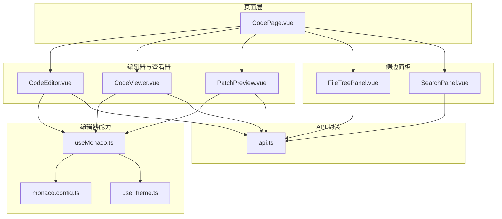
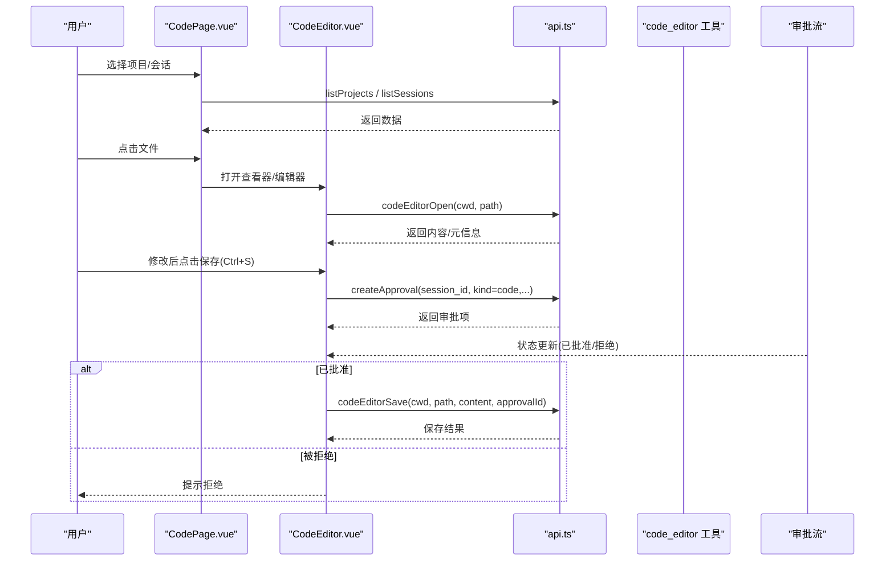
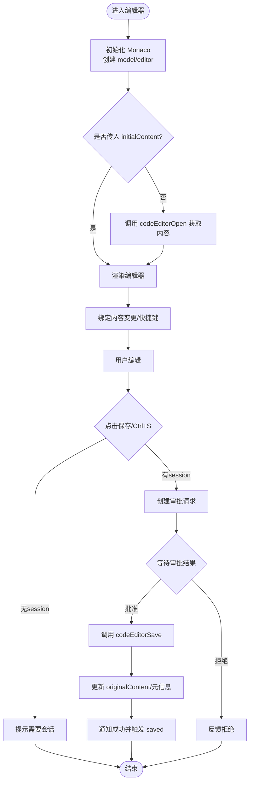
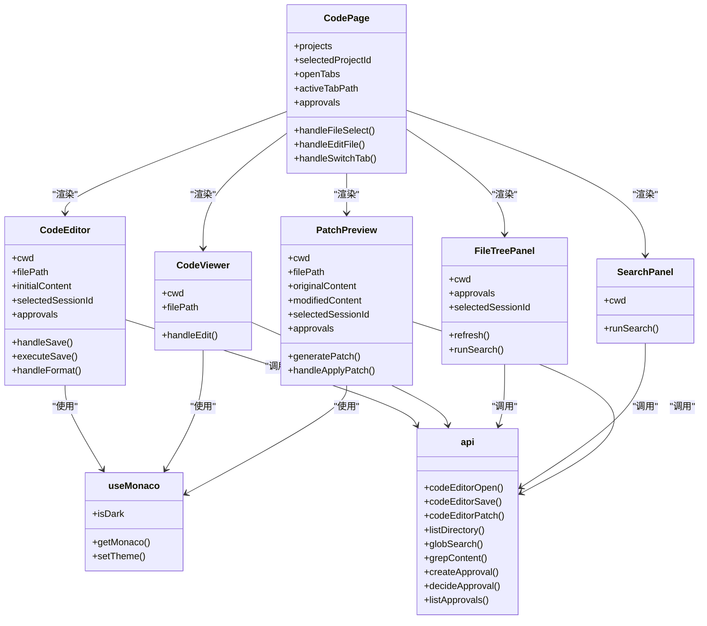

# 代码编辑页面

<cite>
**本文引用的文件**   
- [CodePage.vue](file://apps/desktop/src/pages/CodePage.vue)
- [CodeEditor.vue](file://apps/desktop/src/components/code/CodeEditor.vue)
- [CodeViewer.vue](file://apps/desktop/src/components/code/CodeViewer.vue)
- [FileTreePanel.vue](file://apps/desktop/src/components/code/FileTreePanel.vue)
- [SearchPanel.vue](file://apps/desktop/src/components/code/SearchPanel.vue)
- [PatchPreview.vue](file://apps/desktop/src/components/code/PatchPreview.vue)
- [useMonaco.ts](file://apps/desktop/src/composables/useMonaco.ts)
- [monaco.config.ts](file://apps/desktop/src/monaco.config.ts)
- [useTheme.ts](file://apps/desktop/src/composables/useTheme.ts)
- [api.ts](file://apps/desktop/src/api.ts)
</cite>

## 目录
1. [简介](#简介)
2. [项目结构](#项目结构)
3. [核心组件](#核心组件)
4. [架构总览](#架构总览)
5. [详细组件分析](#详细组件分析)
6. [依赖关系分析](#依赖关系分析)
7. [性能考量](#性能考量)
8. [故障排查指南](#故障排查指南)
9. [结论](#结论)
10. [附录](#附录)

## 简介
本文件为“代码编辑页面”的全面技术文档，聚焦 CodePage 组件的代码编辑器集成、文件树管理、代码高亮与语法检查能力。文档详细说明 Monaco Editor 的配置与使用（主题、语言支持、自动补全、格式化）、文件操作、版本控制集成（补丁预览与应用）、实时预览与调试相关实现，并提供编辑器扩展、自定义快捷键与性能优化建议。

## 项目结构
代码编辑页面位于桌面应用前端模块中，采用 Vue 单文件组件组织，围绕 CodePage 作为入口，组合多个子组件完成文件浏览、编辑、搜索、差异对比与补丁应用等能力。

图表来源
- [CodePage.vue:1-471](file://apps/desktop/src/pages/CodePage.vue#L1-L471)
- [CodeEditor.vue:1-287](file://apps/desktop/src/components/code/CodeEditor.vue#L1-L287)
- [CodeViewer.vue:1-164](file://apps/desktop/src/components/code/CodeViewer.vue#L1-L164)
- [FileTreePanel.vue:1-440](file://apps/desktop/src/components/code/FileTreePanel.vue#L1-L440)
- [SearchPanel.vue:1-346](file://apps/desktop/src/components/code/SearchPanel.vue#L1-L346)
- [PatchPreview.vue:1-262](file://apps/desktop/src/components/code/PatchPreview.vue#L1-L262)
- [useMonaco.ts:1-147](file://apps/desktop/src/composables/useMonaco.ts#L1-L147)
- [monaco.config.ts:1-67](file://apps/desktop/src/monaco.config.ts#L1-L67)
- [useTheme.ts:1-258](file://apps/desktop/src/composables/useTheme.ts#L1-L258)
- [api.ts:1170-1330](file://apps/desktop/src/api.ts#L1170-L1330)

章节来源
- [CodePage.vue:1-471](file://apps/desktop/src/pages/CodePage.vue#L1-L471)

## 核心组件
- CodePage：页面容器，负责项目选择、会话加载、审批流聚合、标签页管理与左右面板显隐控制。
- CodeEditor：可编辑的 Monaco 编辑器，支持保存、撤销/重做、格式化、快捷键 Ctrl+S、审批流驱动保存。
- CodeViewer：只读模式展示文件内容，支持切换至编辑模式。
- FileTreePanel：文件树懒加载、展开/折叠、右键菜单（重命名/删除需审批）。
- SearchPanel：文件搜索（glob）与内容搜索（grep），支持大小写敏感与正则。
- PatchPreview：差异对比与补丁生成、应用，同样通过审批流执行。
- useMonaco：Monaco 实例初始化、主题同步、语言检测映射。
- monaco.config：Vite Worker 配置与 Monaco 环境注入。
- useTheme：主题与强调色持久化与动态切换。
- api：代码工具调用封装（打开/保存/补丁/列表/搜索/grep 等）。

章节来源
- [CodePage.vue:1-471](file://apps/desktop/src/pages/CodePage.vue#L1-L471)
- [CodeEditor.vue:1-287](file://apps/desktop/src/components/code/CodeEditor.vue#L1-L287)
- [CodeViewer.vue:1-164](file://apps/desktop/src/components/code/CodeViewer.vue#L1-L164)
- [FileTreePanel.vue:1-440](file://apps/desktop/src/components/code/FileTreePanel.vue#L1-L440)
- [SearchPanel.vue:1-346](file://apps/desktop/src/components/code/SearchPanel.vue#L1-L346)
- [PatchPreview.vue:1-262](file://apps/desktop/src/components/code/PatchPreview.vue#L1-L262)
- [useMonaco.ts:1-147](file://apps/desktop/src/composables/useMonaco.ts#L1-L147)
- [monaco.config.ts:1-67](file://apps/desktop/src/monaco.config.ts#L1-L67)
- [useTheme.ts:1-258](file://apps/desktop/src/composables/useTheme.ts#L1-L258)
- [api.ts:1170-1330](file://apps/desktop/src/api.ts#L1170-L1330)

## 架构总览
页面以 CodePage 为中心，协调左侧文件树与搜索、中间标签式编辑器/查看器、右侧补丁预览。所有文件读写与补丁操作均通过 api.ts 统一封装，走 code_editor 工具通道，并借助审批流确保变更安全。Monaco 编辑器由 useMonaco 统一管理实例与主题，monaco.config 提供 Vite Worker 配置。

图表来源
- [CodePage.vue:1-471](file://apps/desktop/src/pages/CodePage.vue#L1-L471)
- [CodeEditor.vue:1-287](file://apps/desktop/src/components/code/CodeEditor.vue#L1-L287)
- [api.ts:1170-1330](file://apps/desktop/src/api.ts#L1170-L1330)

## 详细组件分析

### CodePage 组件
- 功能要点
  - 项目与会话管理：加载项目列表、默认选中首个项目；根据项目加载会话列表并选择首个会话。
  - 标签页管理：维护 openTabs 数组，支持新增、切换、关闭；区分 view/edit 模式。
  - 审批流聚合：集中处理 approval-requested 事件，刷新 approvals 列表供各子组件消费。
  - 面板控制：搜索面板与补丁面板的显示/隐藏。
  - 错误处理：加载失败时弹出 banner 并提供重试。
- 关键交互
  - 文件选择：从 FileTreePanel/SearchPanel 触发 handleFileSelect，若未打开则新建标签页。
  - 编辑模式切换：CodeViewer 触发 edit 回调，将当前标签页切换为 edit 并传入初始内容。
  - 保存成功回调：CodeEditor 触发 saved，切回 view 模式。

章节来源
- [CodePage.vue:1-471](file://apps/desktop/src/pages/CodePage.vue#L1-L471)

### CodeEditor 组件（Monaco 编辑器）
- 功能要点
  - 编辑器初始化：按需加载 Monaco，创建 model 与 editor，设置 theme、行号、最小地图、平滑滚动、括号配对等。
  - 语言识别：基于文件扩展名映射到 Monaco language id。
  - 内容同步：监听模型变化，双向同步 content 与 originalContent，计算 isDirty。
  - 快捷键：注册 Ctrl+S 保存命令。
  - 保存流程：校验 session，发起审批请求，等待批准后执行 codeEditorSave。
  - 撤销/重做/格式化：通过 editor.trigger 或内置 action 调用。
  - 生命周期：组件卸载时释放 editor 与 model。
- 配置项
  - fontSize、wordWrap、tabSize 等可通过 props 传入。
  - 主题跟随 useTheme 的 isDark 自动切换。

图表来源
- [CodeEditor.vue:1-287](file://apps/desktop/src/components/code/CodeEditor.vue#L1-L287)
- [api.ts:1170-1330](file://apps/desktop/src/api.ts#L1170-L1330)

章节来源
- [CodeEditor.vue:1-287](file://apps/desktop/src/components/code/CodeEditor.vue#L1-L287)

### CodeViewer 组件（只读查看器）
- 功能要点
  - 只读渲染：创建 readonly 的 Monaco 编辑器，展示文件内容与元信息（大小、修改时间）。
  - 切换编辑：点击编辑按钮触发 edit 回调，将内容与路径上抛给父级。
  - 语言切换：当 filePath 变化导致语言变化时，动态更新 model 的语言。
  - 资源清理：卸载时释放 editor 与 model。

章节来源
- [CodeViewer.vue:1-164](file://apps/desktop/src/components/code/CodeViewer.vue#L1-L164)

### FileTreePanel 组件（文件树）
- 功能要点
  - 懒加载目录：首次展开节点时调用 listDirectory，缓存 children 与 loaded 状态。
  - 搜索过滤：支持 glob 搜索，清空时恢复树视图。
  - 上下文菜单：重命名/删除操作会创建审批请求，需具备 selectedSessionId。
  - 图标与大小：按扩展名选择图标，非目录显示文件大小。
  - 扁平化渲染：将树结构展平为列表以提升渲染性能。

章节来源
- [FileTreePanel.vue:1-440](file://apps/desktop/src/components/code/FileTreePanel.vue#L1-L440)

### SearchPanel 组件（搜索面板）
- 功能要点
  - 双模式：文件搜索（glob）与内容搜索（grep）。
  - 选项：大小写敏感、正则匹配、上下文行数限制、最大结果数。
  - 结果高亮：对匹配文本进行分段高亮。
  - 导航：点击结果跳转到对应文件。

章节来源
- [SearchPanel.vue:1-346](file://apps/desktop/src/components/code/SearchPanel.vue#L1-L346)

### PatchPreview 组件（补丁预览与应用）
- 功能要点
  - 差异对比：使用 Monaco DiffEditor 展示 original vs modified。
  - 补丁生成：简单行级 diff，带前后上下文，生成 Codex 风格 patch 字符串。
  - 审批流：申请 apply_patch 审批，批准后调用 codeEditorPatch 应用。
  - 状态反馈：加载中、已批准、被拒绝等状态提示。

章节来源
- [PatchPreview.vue:1-262](file://apps/desktop/src/components/code/PatchPreview.vue#L1-L262)

### useMonaco 与 monaco.config（Monaco 集成）
- useMonaco
  - 实例管理：延迟初始化，保证全局唯一实例，避免重复加载。
  - 主题同步：监听系统/用户主题变化，自动切换 vs-dark/vs。
  - 语言映射：detectLanguage 根据扩展名映射到 Monaco 语言 id。
- monaco.config
  - 注入 window.MonacoEnvironment.getWorker，使 Monaco 在 Vite 环境下正确加载 worker。
  - 提供 vite 插件配置提示，确保 ESM worker 打包正确。

章节来源
- [useMonaco.ts:1-147](file://apps/desktop/src/composables/useMonaco.ts#L1-L147)
- [monaco.config.ts:1-67](file://apps/desktop/src/monaco.config.ts#L1-L67)

### useTheme（主题与强调色）
- 功能要点
  - 持久化存储：主题与强调色保存在本地存储。
  - 动态切换：监听系统偏好变化，实时更新 CSS 变量。
  - 多强调色：提供多种强调色方案，分别适配明/暗主题。

章节来源
- [useTheme.ts:1-258](file://apps/desktop/src/composables/useTheme.ts#L1-L258)

### api.ts（代码工具接口封装）
- 代码编辑器接口
  - codeEditorOpen：打开文件，返回内容、大小、修改时间。
  - codeEditorSave：保存文件，需传入 approvalId。
  - codeEditorPatch：应用补丁，需传入 approvalId。
  - codeEditorDiff：获取差异（供后续扩展使用）。
- 文件系统接口
  - listDirectory：列出目录条目。
  - globSearch：glob 模式搜索文件。
  - grepContent：内容搜索，支持大小写与上下文。
- 审批流接口
  - createApproval：创建审批请求，kind=code。
  - decideApproval：审批决策（approve/reject）。
  - listApprovals：拉取审批列表。

章节来源
- [api.ts:1170-1330](file://apps/desktop/src/api.ts#L1170-L1330)

## 依赖关系分析
- 组件耦合
  - CodePage 作为编排者，低耦合地组合子组件，通过事件通信。
  - CodeEditor/CodeViewer/PatchPreview 均依赖 useMonaco 与 api。
  - FileTreePanel/SearchPanel 仅依赖 api 与 UI 组件。
- 外部依赖
  - Monaco Editor：通过 @monaco-editor/loader 与 Vite worker 集成。
  - Vue 响应式：ref/watch/computed 驱动状态。
  - 通知系统：useNotifications 用于错误与成功提示。

图表来源
- [CodePage.vue:1-471](file://apps/desktop/src/pages/CodePage.vue#L1-L471)
- [CodeEditor.vue:1-287](file://apps/desktop/src/components/code/CodeEditor.vue#L1-L287)
- [CodeViewer.vue:1-164](file://apps/desktop/src/components/code/CodeViewer.vue#L1-L164)
- [FileTreePanel.vue:1-440](file://apps/desktop/src/components/code/FileTreePanel.vue#L1-L440)
- [SearchPanel.vue:1-346](file://apps/desktop/src/components/code/SearchPanel.vue#L1-L346)
- [PatchPreview.vue:1-262](file://apps/desktop/src/components/code/PatchPreview.vue#L1-L262)
- [useMonaco.ts:1-147](file://apps/desktop/src/composables/useMonaco.ts#L1-L147)
- [api.ts:1170-1330](file://apps/desktop/src/api.ts#L1170-L1330)

## 性能考量
- Monaco 实例复用：useMonaco 保证全局唯一实例，避免重复初始化与内存泄漏。
- 懒加载与缓存：文件树仅在展开时加载子目录，已加载节点缓存 children。
- 只读查看器：CodeViewer 使用 readOnly 模式减少不必要的编辑开销。
- 差异化渲染：PatchPreview 使用 DiffEditor 仅展示差异区域，minimap 关闭以减少渲染压力。
- 主题切换：useMonaco 监听主题变化，直接 setTheme，避免重建编辑器。
- 网络请求节流：搜索与目录加载在 loading 状态下禁用重复触发。
- 资源清理：组件卸载时主动 dispose editor/model，防止内存泄漏。

[本节为通用指导，不直接分析具体文件]

## 故障排查指南
- 无法加载项目/会话
  - 现象：页面顶部 banner 提示加载失败。
  - 排查：检查网络连接与后端服务可用性；确认 api.listProjects/listSessions 返回正常。
  - 参考：[CodePage.vue:54-74](file://apps/desktop/src/pages/CodePage.vue#L54-L74)
- 编辑器无法打开文件
  - 现象：编辑器显示加载失败提示。
  - 排查：确认 cwd 与 filePath 有效；检查 codeEditorOpen 返回值；查看网络请求。
  - 参考：[CodeEditor.vue:56-76](file://apps/desktop/src/components/code/CodeEditor.vue#L56-L76)
- 保存失败或无会话
  - 现象：提示需要会话或保存失败。
  - 排查：确保 selectedSessionId 存在；检查 createApproval 与 codeEditorSave 调用参数。
  - 参考：[CodeEditor.vue:122-174](file://apps/desktop/src/components/code/CodeEditor.vue#L122-L174)
- 补丁应用失败
  - 现象：提示应用失败或被拒绝。
  - 排查：确认 hasChanges 为真；检查 generatePatch 输出；查看审批状态。
  - 参考：[PatchPreview.vue:133-188](file://apps/desktop/src/components/code/PatchPreview.vue#L133-L188)
- 搜索无结果
  - 现象：搜索面板显示无结果。
  - 排查：检查 glob/grep 查询语句；确认 cwd 权限；查看 grep 上下文与最大结果数。
  - 参考：[SearchPanel.vue:54-78](file://apps/desktop/src/components/code/SearchPanel.vue#L54-L78)

章节来源
- [CodePage.vue:54-74](file://apps/desktop/src/pages/CodePage.vue#L54-L74)
- [CodeEditor.vue:56-76](file://apps/desktop/src/components/code/CodeEditor.vue#L56-L76)
- [CodeEditor.vue:122-174](file://apps/desktop/src/components/code/CodeEditor.vue#L122-L174)
- [PatchPreview.vue:133-188](file://apps/desktop/src/components/code/PatchPreview.vue#L133-L188)
- [SearchPanel.vue:54-78](file://apps/desktop/src/components/code/SearchPanel.vue#L54-L78)

## 结论
代码编辑页面以 CodePage 为核心，结合 Monaco Editor 的强大能力，实现了完整的文件浏览、编辑、搜索、差异对比与补丁应用流程。通过统一的 api 封装与审批流机制，确保了变更的安全性与可控性。useMonaco 与 monaco.config 提供了稳定的编辑器运行时环境，配合 useTheme 实现主题一致性。整体架构清晰、职责分明，具备良好的可扩展性与性能表现。

[本节为总结性内容，不直接分析具体文件]

## 附录

### Monaco Editor 配置与使用要点
- 主题设置
  - 自动跟随系统/用户主题，使用 vs-dark/vs 主题。
  - 参考：[useMonaco.ts:29-68](file://apps/desktop/src/composables/useMonaco.ts#L29-L68)
- 语言支持
  - detectLanguage 映射常见扩展名到 Monaco 语言 id。
  - 参考：[useMonaco.ts:73-146](file://apps/desktop/src/composables/useMonaco.ts#L73-L146)
- 自动补全与语法检查
  - 当前使用通用 editor worker，如需 TS IntelliSense、CSS/HTML 补全，可在 monaco.config 中扩展语言特定 worker。
  - 参考：[monaco.config.ts:24-47](file://apps/desktop/src/monaco.config.ts#L24-L47)
- 代码格式化
  - 通过 editor.getAction('editor.action.formatDocument') 触发。
  - 参考：[CodeEditor.vue:176-179](file://apps/desktop/src/components/code/CodeEditor.vue#L176-L179)
- 自定义快捷键
  - 已注册 Ctrl+S 保存；可按需添加其他命令。
  - 参考：[CodeEditor.vue:117-119](file://apps/desktop/src/components/code/CodeEditor.vue#L117-L119)

### 文件操作与版本控制集成
- 文件操作
  - 打开/保存/差异/补丁：通过 codeEditorOpen/Save/Diff/Patch 接口。
  - 目录与搜索：listDirectory/globSearch/grepContent。
  - 参考：[api.ts:1175-1192](file://apps/desktop/src/api.ts#L1175-L1192)
- 版本控制集成
  - 补丁生成与预览：PatchPreview 生成 Codex 风格补丁，DiffEditor 展示差异。
  - 审批流保障：apply_patch 需经审批后方可执行。
  - 参考：[PatchPreview.vue:47-103](file://apps/desktop/src/components/code/PatchPreview.vue#L47-L103)

### 实时预览与调试
- 实时预览
  - CodeViewer 只读模式即时展示文件内容，支持刷新。
  - 参考：[CodeViewer.vue:48-67](file://apps/desktop/src/components/code/CodeViewer.vue#L48-L67)
- 调试功能
  - 通过事件流 connectEvents 订阅 approval.requested/approved/rejected 等事件，便于追踪审批状态。
  - 参考：[api.ts:1310-1328](file://apps/desktop/src/api.ts#L1310-L1328)

### 编辑器扩展与性能优化方案
- 扩展点
  - 在 monaco.config 中扩展语言 worker，启用更丰富的智能提示与验证。
  - 在 useMonaco 中注册自定义命令或键绑定。
- 性能优化
  - 大文件分页加载（后端支持 start_line/end_line）。
  - 虚拟滚动（UI 层）与懒加载（文件树）。
  - 合理设置 minimap、smoothScrolling、renderWhitespace 等选项。
  - 及时释放编辑器实例与模型，避免内存泄漏。

[本节为通用指导，不直接分析具体文件]