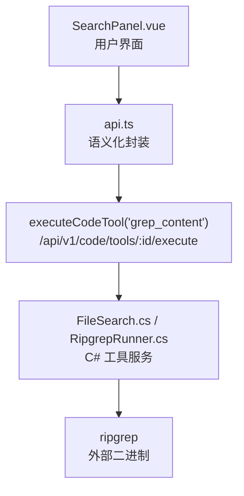
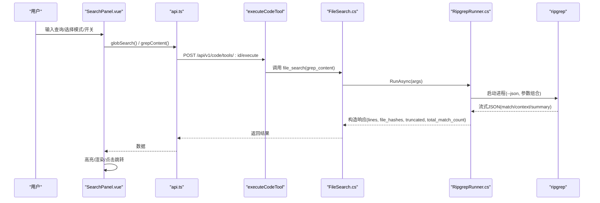
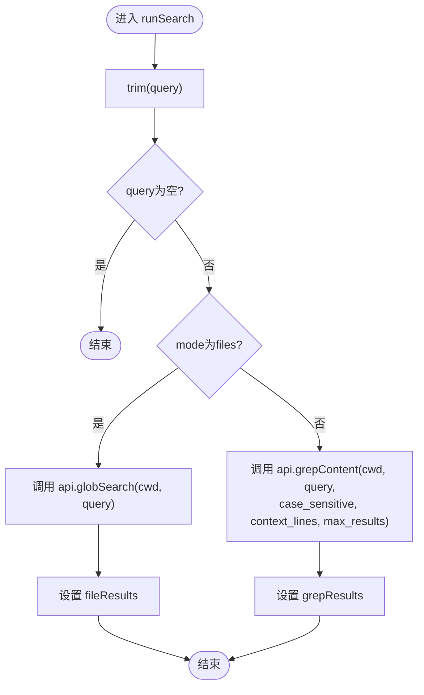
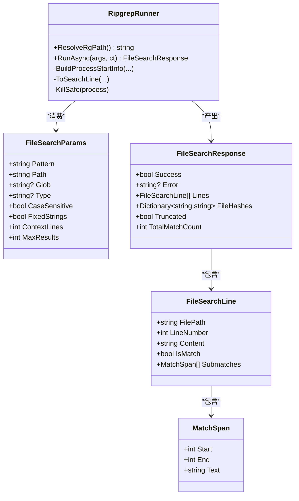

# 搜索功能

<cite>
**本文引用的文件**
- [SearchPanel.vue](file://apps/desktop/src/components/code/SearchPanel.vue)
- [api.ts](file://apps/desktop/src/api.ts)
- [FileSearch.cs](file://TinadecTools/Tools/Search/FileSearch.cs)
- [RipgrepRunner.cs](file://TinadecTools/Tools/Search/RipgrepRunner.cs)
</cite>

## 目录
1. [简介](#简介)
2. [项目结构](#项目结构)
3. [核心组件](#核心组件)
4. [架构总览](#架构总览)
5. [详细组件分析](#详细组件分析)
6. [依赖关系分析](#依赖关系分析)
7. [性能考量](#性能考量)
8. [故障排查指南](#故障排查指南)
9. [结论](#结论)
10. [附录](#附录)

## 简介
本文件面向代码搜索功能的实现与使用，重点说明 SearchPanel 组件的全文搜索能力：支持正则表达式、搜索结果高亮、快速跳转；记录搜索算法实现（基于 ripgrep）、索引构建策略（无索引，流式解析 rg --json）、以及性能优化手段。同时给出搜索配置选项、结果过滤与批量操作接口设计建议，并总结错误处理机制与常见问题定位方法。

## 项目结构
搜索功能由前端 UI 组件、API 封装层与后端工具服务组成：
- 前端：SearchPanel.vue 提供用户交互、模式切换、正则开关、大小写敏感、结果高亮与点击跳转。
- API 封装：api.ts 暴露 globSearch/grepContent 等语义化方法，统一调用后端 code tools 执行端点。
- 后端：FileSearch.cs 定义搜索请求/响应模型与工具入口；RipgrepRunner.cs 负责启动 ripgrep、解析 JSON 输出、计算文件哈希与统计信息。

图表来源
- [SearchPanel.vue:54-78](file://apps/desktop/src/components/code/SearchPanel.vue#L54-L78)
- [api.ts:1179-1182](file://apps/desktop/src/api.ts#L1179-L1182)
- [FileSearch.cs:116-139](file://TinadecTools/Tools/Search/FileSearch.cs#L116-L139)
- [RipgrepRunner.cs:79-183](file://TinadecTools/Tools/Search/RipgrepRunner.cs#L79-L183)

章节来源
- [SearchPanel.vue:1-346](file://apps/desktop/src/components/code/SearchPanel.vue#L1-L346)
- [api.ts:997-1330](file://apps/desktop/src/api.ts#L997-L1330)
- [FileSearch.cs:1-140](file://TinadecTools/Tools/Search/FileSearch.cs#L1-L140)
- [RipgrepRunner.cs:1-275](file://TinadecTools/Tools/Search/RipgrepRunner.cs#L1-L275)

## 核心组件
- SearchPanel.vue
  - 两种模式：文件匹配（glob）与内容匹配（grep）。
  - 支持大小写敏感、正则表达式开关。
  - 内容模式下对命中行进行高亮显示，并提供上下文行展示。
  - 点击结果项触发 select 事件，用于快速跳转到编辑器。
- api.ts
  - 提供 globSearch/cwd/pattern 与 grepContent/cwd/pattern/options 的便捷方法。
  - 通过 executeCodeTool 统一调用后端 code tools 执行接口。
- FileSearch.cs
  - 定义搜索参数（pattern/path/glob/type/case_sensitive/fixed_strings/context_lines/max_results）。
  - 定义响应结构（lines/file_hashes/truncated/total_match_count）。
  - 工具入口 file_search 委托给 RipgrepRunner 执行。
- RipgrepRunner.cs
  - 解析环境变量或 PATH 查找 ripgrep 可执行文件。
  - 以 --json 模式运行 rg，流式读取 match/context/summary 消息。
  - 计算命中文件的 file_hash，返回截断标志与总命中数。

章节来源
- [SearchPanel.vue:41-78](file://apps/desktop/src/components/code/SearchPanel.vue#L41-L78)
- [api.ts:1179-1182](file://apps/desktop/src/api.ts#L1179-L1182)
- [FileSearch.cs:8-38](file://TinadecTools/Tools/Search/FileSearch.cs#L8-L38)
- [FileSearch.cs:79-102](file://TinadecTools/Tools/Search/FileSearch.cs#L79-L102)
- [RipgrepRunner.cs:53-77](file://TinadecTools/Tools/Search/RipgrepRunner.cs#L53-L77)
- [RipgrepRunner.cs:79-183](file://TinadecTools/Tools/Search/RipgrepRunner.cs#L79-L183)

## 架构总览
搜索流程从前端发起，经 API 封装调用后端 code tools，再由 C# 工具服务驱动 ripgrep 完成实际文本检索，最终将结构化结果回传前端渲染。

图表来源
- [SearchPanel.vue:54-78](file://apps/desktop/src/components/code/SearchPanel.vue#L54-L78)
- [api.ts:1179-1182](file://apps/desktop/src/api.ts#L1179-L1182)
- [FileSearch.cs:116-139](file://TinadecTools/Tools/Search/FileSearch.cs#L116-L139)
- [RipgrepRunner.cs:79-183](file://TinadecTools/Tools/Search/RipgrepRunner.cs#L79-L183)

## 详细组件分析

### SearchPanel 组件分析
- 模式与状态
  - mode: files | content
  - query: 搜索词
  - caseSensitive/useRegex: 大小写敏感与正则开关
  - searching: 搜索进行中状态
  - fileResults/grepResults: 结果集
- 搜索执行
  - runSearch(): 根据模式调用 api.globSearch 或 api.grepContent，设置 context_lines（正则时不附加上下文），限制 max_results=100。
- 高亮逻辑
  - highlightText(text, pattern): 在浏览器端按 flags（gi/g）构建 RegExp 进行分段标记，非正则时对 pattern 转义。
  - escapeRegex(s): 对特殊字符进行转义，避免误解析。
- 交互与跳转
  - handleSelect(path): 触发 select 事件，上层组件打开对应文件并定位到行号（由上层决定）。

图表来源
- [SearchPanel.vue:54-78](file://apps/desktop/src/components/code/SearchPanel.vue#L54-L78)
- [SearchPanel.vue:88-115](file://apps/desktop/src/components/code/SearchPanel.vue#L88-L115)

章节来源
- [SearchPanel.vue:41-78](file://apps/desktop/src/components/code/SearchPanel.vue#L41-L78)
- [SearchPanel.vue:88-115](file://apps/desktop/src/components/code/SearchPanel.vue#L88-L115)
- [SearchPanel.vue:189-244](file://apps/desktop/src/components/code/SearchPanel.vue#L189-L244)

### 后端搜索工具分析（FileSearch + RipgrepRunner）
- 参数与响应
  - FileSearchParams: pattern/path/glob/type/case_sensitive/fixed_strings/context_lines/max_results
  - FileSearchResponse: success/error/lines/file_hashes/truncated/total_match_count
  - FileSearchLine: filepath/line_number/content/is_match/submatches
  - MatchSpan: start/end/text
- 执行流程
  - ResolveRgPath(): 优先环境变量 TINADEC_TOOLS_RG_PATH，其次工作目录 rg.exe/rg，最后 PATH。
  - BuildProcessStartInfo(): 组装 rg 参数（--json/--no-follow/-C/-g/--type/-F/大小写控制等）。
  - RunAsync(): 启动进程，流式读取 stdout，解析 match/context/summary，达到 MaxResults 后终止进程，计算 file_hash，汇总统计。
- 错误处理
  - rg 退出码 >=2 且无结果视为错误，返回错误信息。
  - 捕获 OperationCanceledException 并安全终止进程。

图表来源
- [FileSearch.cs:8-38](file://TinadecTools/Tools/Search/FileSearch.cs#L8-L38)
- [FileSearch.cs:59-102](file://TinadecTools/Tools/Search/FileSearch.cs#L59-L102)
- [RipgrepRunner.cs:53-77](file://TinadecTools/Tools/Search/RipgrepRunner.cs#L53-L77)
- [RipgrepRunner.cs:79-183](file://TinadecTools/Tools/Search/RipgrepRunner.cs#L79-L183)

章节来源
- [FileSearch.cs:8-38](file://TinadecTools/Tools/Search/FileSearch.cs#L8-L38)
- [FileSearch.cs:59-102](file://TinadecTools/Tools/Search/FileSearch.cs#L59-L102)
- [FileSearch.cs:116-139](file://TinadecTools/Tools/Search/FileSearch.cs#L116-L139)
- [RipgrepRunner.cs:53-77](file://TinadecTools/Tools/Search/RipgrepRunner.cs#L53-L77)
- [RipgrepRunner.cs:79-183](file://TinadecTools/Tools/Search/RipgrepRunner.cs#L79-L183)
- [RipgrepRunner.cs:187-233](file://TinadecTools/Tools/Search/RipgrepRunner.cs#L187-L233)
- [RipgrepRunner.cs:235-274](file://TinadecTools/Tools/Search/RipgrepRunner.cs#L235-L274)

### 前端 API 封装分析
- 语义化方法
  - globSearch(cwd, pattern): 调用 executeCodeTool('glob_search', { cwd, arguments: { pattern } })
  - grepContent(cwd, pattern, options): 调用 executeCodeTool('grep_content', { cwd, arguments: { pattern, ...options } })
- 通用请求
  - request<T>(path, init): fetch 包装，统一错误提取与 JSON 解析。
  - extractErrorMessage(data, fallback): 兼容 message 或 nested error.message。

章节来源
- [api.ts:945-979](file://apps/desktop/src/api.ts#L945-L979)
- [api.ts:981-995](file://apps/desktop/src/api.ts#L981-L995)
- [api.ts:1179-1182](file://apps/desktop/src/api.ts#L1179-L1182)

## 依赖关系分析
- 前端依赖
  - SearchPanel.vue 依赖 api.ts 提供的 globSearch/grepContent。
  - SearchPanel.vue 依赖 @lucide/vue 图标与 UI 组件库。
- 后端依赖
  - FileSearch.cs 依赖 RipgrepRunner.cs。
  - RipgrepRunner.cs 依赖操作系统环境（PATH/环境变量）与 ripgrep 二进制。
  - RipgrepRunner.cs 依赖 FileRW 工具中的文件哈希算法（用于 file_hash）。

图表来源
- [SearchPanel.vue:54-78](file://apps/desktop/src/components/code/SearchPanel.vue#L54-L78)
- [api.ts:1179-1182](file://apps/desktop/src/api.ts#L1179-L1182)
- [FileSearch.cs:116-139](file://TinadecTools/Tools/Search/FileSearch.cs#L116-L139)
- [RipgrepRunner.cs:79-183](file://TinadecTools/Tools/Search/RipgrepRunner.cs#L79-L183)

章节来源
- [SearchPanel.vue:1-346](file://apps/desktop/src/components/code/SearchPanel.vue#L1-L346)
- [api.ts:997-1330](file://apps/desktop/src/api.ts#L997-L1330)
- [FileSearch.cs:1-140](file://TinadecTools/Tools/Search/FileSearch.cs#L1-L140)
- [RipgrepRunner.cs:1-275](file://TinadecTools/Tools/Search/RipgrepRunner.cs#L1-L275)

## 性能考量
- 无索引实时搜索
  - 采用 ripgrep 的 --json 流式解析，避免全量加载与内存峰值。
  - 通过 MaxResults 限制返回条数，减少前端渲染压力。
- 上下文控制
  - 正则模式下默认不附加上下文（context_lines=0），降低数据传输量。
  - 普通模式默认 context_lines=2，平衡可读性与体积。
- 进程生命周期管理
  - 达到上限后立即终止 rg 进程，避免多余扫描。
  - 并发读取 stderr 防止死锁。
- 哈希计算
  - 仅对命中文件计算 file_hash，减少 I/O 开销。
- 前端高亮
  - 使用原生 RegExp.exec 分段标记，避免复杂 DOM 操作。
  - 空匹配时自动推进 lastIndex，避免无限循环。

[本节为通用性能讨论，不直接分析具体文件]

## 故障排查指南
- 无法连接后端
  - 检查 gatewayUrl 配置与网络连通性。
  - 查看 request 包装的错误提示（Cannot connect to backend）。
- 搜索失败
  - 前端 notify.error 会显示“Search failed”，检查后端 executeCodeTool 返回的 data.error。
  - 确认 ripgrep 可执行文件路径：环境变量 TINADEC_TOOLS_RG_PATH 或 PATH。
- 结果为空
  - 检查 query 是否为空；确认模式（files/content）与参数（case_sensitive/fixed_strings/glob/type）。
  - 关注 truncated 标志与 total_match_count，判断是否被截断。
- 正则表达式异常
  - 前端 highlightText 捕获异常并降级为无高亮；确保 useRegex=true 时传入合法正则。
- 权限与路径
  - 确保 cwd 与工作区路径有效；不可读文件会被跳过（best-effort）。

章节来源
- [SearchPanel.vue:73-77](file://apps/desktop/src/components/code/SearchPanel.vue#L73-L77)
- [api.ts:945-979](file://apps/desktop/src/api.ts#L945-L979)
- [RipgrepRunner.cs:84-86](file://TinadecTools/Tools/Search/RipgrepRunner.cs#L84-L86)
- [RipgrepRunner.cs:154-157](file://TinadecTools/Tools/Search/RipgrepRunner.cs#L154-L157)
- [RipgrepRunner.cs:160-173](file://TinadecTools/Tools/Search/RipgrepRunner.cs#L160-L173)

## 结论
SearchPanel 结合 api.ts 与后端 FileSearch/RipgrepRunner 实现了高效、可扩展的代码搜索能力。其特点包括：
- 支持 glob 与 ripgrep 全文搜索，具备正则与大小写敏感选项。
- 前端高亮与上下文展示提升可读性，点击结果快速跳转。
- 后端以流式解析 rg --json 实现低内存占用与可控结果规模。
- 提供清晰的错误处理与诊断路径，便于问题定位。

[本节为总结性内容，不直接分析具体文件]

## 附录

### 搜索配置选项
- 前端（SearchPanel.vue）
  - caseSensitive: 大小写敏感开关
  - useRegex: 正则表达式开关
  - context_lines: 上下文行数（正则模式默认 0，普通模式默认 2）
  - max_results: 最大结果数（默认 100）
- 后端（FileSearchParams）
  - pattern: 搜索模式（正则或字面量）
  - path: 搜索根目录
  - glob: 文件名过滤（如 *.ts）
  - type: 类型过滤（如 cs/ts/rust）
  - case_sensitive: 大小写敏感
  - fixed_strings: 字面量模式（-F）
  - context_lines: 上下文行数
  - max_results: 命中行数上限

章节来源
- [SearchPanel.vue:41-78](file://apps/desktop/src/components/code/SearchPanel.vue#L41-L78)
- [FileSearch.cs:8-38](file://TinadecTools/Tools/Search/FileSearch.cs#L8-L38)

### 搜索结果数据结构
- 文件搜索结果（glob）
  - matches: Array<{ path, is_dir?, is_file? }>
- 内容搜索结果（grep）
  - matches: Array<{ file, full_path?, line, text, context_before?, context_after? }>
- 后端响应（FileSearchResponse）
  - lines: Array<FileSearchLine>
  - file_hashes: Map<filepath, hash>
  - truncated: boolean
  - total_match_count: number

章节来源
- [SearchPanel.vue:22-29](file://apps/desktop/src/components/code/SearchPanel.vue#L22-L29)
- [FileSearch.cs:59-102](file://TinadecTools/Tools/Search/FileSearch.cs#L59-L102)

### 搜索历史、结果过滤与批量操作（接口设计建议）
- 搜索历史
  - 建议在本地存储最近 N 条查询（含模式与选项），提供下拉选择与一键重搜。
- 结果过滤
  - 在前端对 grepResults 进行二次过滤（按文件扩展名、行号范围、关键词片段）。
- 批量操作
  - 提供多选框选择多个结果，支持批量打开文件或批量复制匹配行。
  - 注意：当前实现未内置批量操作，需在上层组件扩展。

[本节为概念性设计建议，不直接分析具体文件]