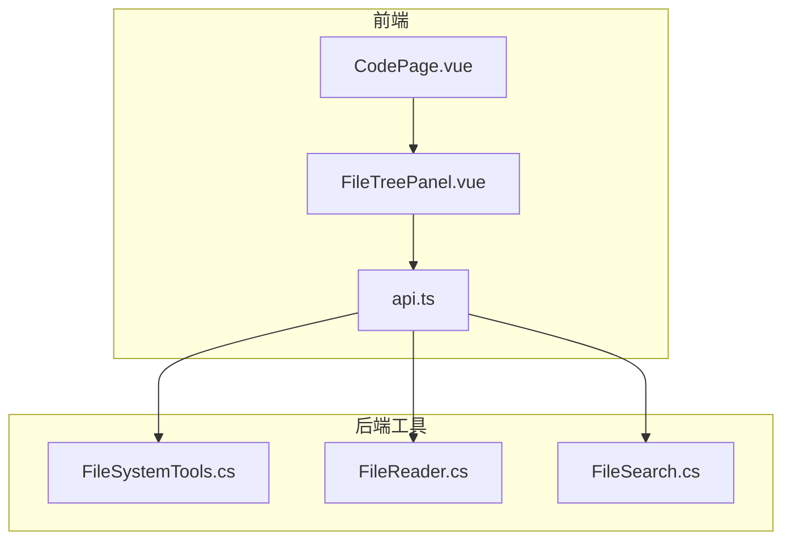
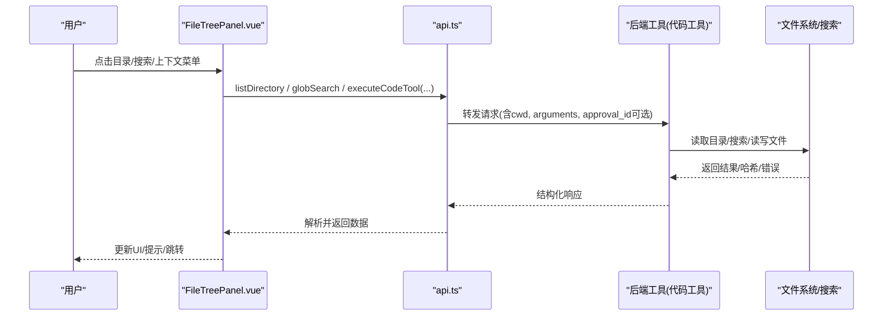
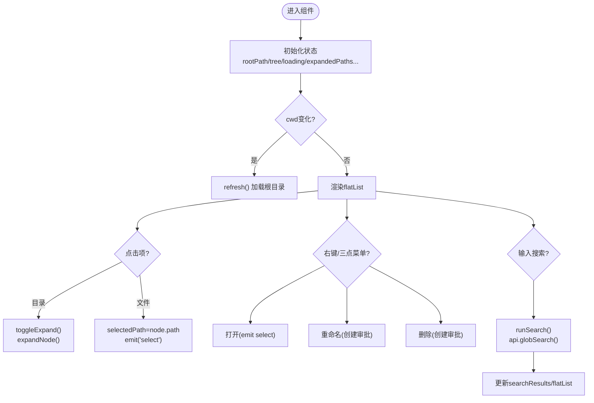
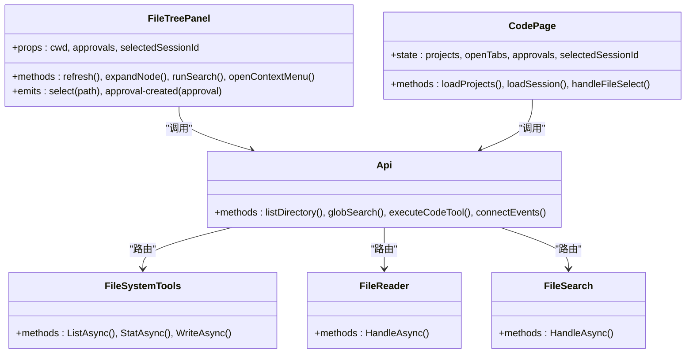

# 文件树管理

<cite>
**本文引用的文件**   
- [FileTreePanel.vue](file://apps/desktop/src/components/code/FileTreePanel.vue)
- [CodePage.vue](file://apps/desktop/src/pages/CodePage.vue)
- [api.ts](file://apps/desktop/src/api.ts)
- [FileSystemTools.cs](file://TinadecTools/Tools/FileRW/FileSystemTools.cs)
- [FileReader.cs](file://TinadecTools/Tools/FileRW/FileReader.cs)
- [FileSearch.cs](file://TinadecTools/Tools/Search/FileSearch.cs)
</cite>

## 目录
1. [简介](#简介)
2. [项目结构](#项目结构)
3. [核心组件](#核心组件)
4. [架构总览](#架构总览)
5. [详细组件分析](#详细组件分析)
6. [依赖关系分析](#依赖关系分析)
7. [性能考量](#性能考量)
8. [故障排查指南](#故障排查指南)
9. [结论](#结论)
10. [附录](#附录)

## 简介
本文件为“文件树管理”功能的全面技术文档，聚焦于 FileTreePanel 组件的文件系统浏览、筛选与搜索能力，以及打开、编辑、删除等文件操作与权限控制机制。文档同时覆盖文件图标显示、路径导航、上下文菜单的实现细节，并给出文件监听、实时更新与性能优化的技术方案，帮助开发者快速理解与扩展该模块。

## 项目结构
文件树功能由前端 Vue 组件与后端工具服务共同实现：
- 前端：FileTreePanel 负责目录树展示、展开/折叠、搜索、上下文菜单与审批流触发；CodePage 作为页面容器组织文件树、编辑器与补丁预览面板。
- API 层：统一通过 api.ts 封装对后端的调用，包括目录列表、glob 搜索、代码工具执行（如读取文件、应用补丁、编辑器动作）等。
- 后端：C# 工具提供文件系统能力（目录枚举、文件读写）、内容搜索（基于 ripgrep）与行级读取能力，并通过统一的代码工具执行接口暴露给前端。

图表来源
- [CodePage.vue:1-471](file://apps/desktop/src/pages/CodePage.vue#L1-L471)
- [FileTreePanel.vue:1-440](file://apps/desktop/src/components/code/FileTreePanel.vue#L1-L440)
- [api.ts:997-1330](file://apps/desktop/src/api.ts#L997-L1330)
- [FileSystemTools.cs:1-273](file://TinadecTools/Tools/FileRW/FileSystemTools.cs#L1-L273)
- [FileReader.cs:1-133](file://TinadecTools/Tools/FileRW/FileReader.cs#L1-L133)
- [FileSearch.cs:1-140](file://TinadecTools/Tools/Search/FileSearch.cs#L1-L140)

章节来源
- [CodePage.vue:1-471](file://apps/desktop/src/pages/CodePage.vue#L1-L471)
- [FileTreePanel.vue:1-440](file://apps/desktop/src/components/code/FileTreePanel.vue#L1-L440)
- [api.ts:997-1330](file://apps/desktop/src/api.ts#L997-L1330)

## 核心组件
- FileTreePanel.vue
  - 职责：目录树渲染、懒加载展开、隐藏项过滤、glob 搜索、选中态与事件派发、上下文菜单与审批请求。
  - 关键数据：根路径 cwd、树节点 TreeNode、展开集合 expandedPaths、选中路径 selectedPath、搜索查询 searchQuery、搜索结果 searchResults、上下文菜单 contextMenuPath。
  - 交互：点击目录展开/折叠，点击文件触发 select 事件；右键或三点按钮打开上下文菜单，支持打开、重命名（需审批）、删除（需审批）。
- CodePage.vue
  - 职责：项目管理、会话选择、标签页管理、审批列表刷新、补丁预览面板联动。
  - 与 FileTreePanel 协作：传递 cwd、selectedSessionId、approvals，接收 select 与 approval-created 事件。
- api.ts
  - 职责：HTTP 请求封装、错误提取、代码工具语义化封装（listDirectory、globSearch、readFile、applyPatch、codeEditorOpen/Save/Diff/Patch 等）。
  - 事件订阅：connectEvents 用于 SSE 事件监听（如 approval.requested/approved/rejected 等），可用于实时刷新。

章节来源
- [FileTreePanel.vue:1-440](file://apps/desktop/src/components/code/FileTreePanel.vue#L1-L440)
- [CodePage.vue:1-471](file://apps/desktop/src/pages/CodePage.vue#L1-L471)
- [api.ts:997-1330](file://apps/desktop/src/api.ts#L997-L1330)

## 架构总览
文件树管理的端到端流程如下：
- 用户在前端 FileTreePanel 中展开目录或进行搜索，触发对应 API 调用。
- 后端通过代码工具执行（executeCodeTool）路由到具体工具（如 list_directory、glob_search、read_file、code_editor 等）。
- 工具返回结构化结果，前端进行 UI 更新与状态同步。
- 涉及写操作（删除、重命名、保存、应用补丁）时，前端创建审批请求，等待审批通过后由后端执行。

图表来源
- [FileTreePanel.vue:79-167](file://apps/desktop/src/components/code/FileTreePanel.vue#L79-L167)
- [api.ts:1174-1192](file://apps/desktop/src/api.ts#L1174-L1192)
- [FileSystemTools.cs:69-103](file://TinadecTools/Tools/FileRW/FileSystemTools.cs#L69-L103)
- [FileSearch.cs:116-139](file://TinadecTools/Tools/Search/FileSearch.cs#L116-L139)

## 详细组件分析

### FileTreePanel 组件分析
- 目录结构与懒加载
  - entryToNode 将后端 DirEntry 转换为 TreeNode，维护 path、isDir、size、children、loaded、loading。
  - expandNode 按需加载子目录，避免一次性加载大目录导致卡顿。
- 筛选与搜索
  - showHidden 控制是否显示隐藏项（以点开头）。
  - runSearch 调用 globSearch，将匹配结果映射为扁平节点列表，支持按文件名后缀区分图标类型。
- 文件图标与大小格式化
  - getFileIcon 根据扩展名选择代码/文本/通用图标。
  - formatSize 将字节数格式化为 B/KB/MB。
- 上下文菜单与权限控制
  - 打开：直接触发 select 事件，由父组件处理打开逻辑。
  - 重命名/删除：需要 selectedSessionId，否则提示会话缺失；成功后 emit approval-created 事件，由父组件加入审批列表。
- 路径导航与选中态
  - handleNodeClick 区分目录与文件，目录展开/折叠，文件设置 selectedPath 并派发 select。
  - flatList 计算属性根据搜索或树结构生成扁平列表，配合滚动区域高效渲染。

图表来源
- [FileTreePanel.vue:66-167](file://apps/desktop/src/components/code/FileTreePanel.vue#L66-L167)
- [FileTreePanel.vue:174-193](file://apps/desktop/src/components/code/FileTreePanel.vue#L174-L193)
- [FileTreePanel.vue:199-237](file://apps/desktop/src/components/code/FileTreePanel.vue#L199-L237)
- [FileTreePanel.vue:239-259](file://apps/desktop/src/components/code/FileTreePanel.vue#L239-L259)

章节来源
- [FileTreePanel.vue:1-440](file://apps/desktop/src/components/code/FileTreePanel.vue#L1-L440)

### CodePage 页面集成
- 项目与会话管理：loadProjects/loadSession 获取项目列表与默认会话，确保 selectedSessionId 可用。
- 标签页管理：handleFileSelect 打开新标签或切换已有标签；handleCloseTab/handleSwitchTab 管理标签生命周期。
- 审批流：handleApprovalCreated 将新建审批加入 approvals；decideApproval 提交审批决策并刷新列表。
- 与 FileTreePanel 协作：传递 cwd、selectedSessionId、approvals，接收 select 与 approval-created 事件。

章节来源
- [CodePage.vue:1-471](file://apps/desktop/src/pages/CodePage.vue#L1-L471)

### API 层与代码工具封装
- 目录与搜索
  - listDirectory(cwd, dirPath) 调用 executeCodeTool('list_directory', { cwd, arguments: { path: dirPath } })。
  - globSearch(cwd, pattern) 调用 executeCodeTool('glob_search', { cwd, arguments: { pattern } })。
- 文件读取与编辑
  - readFile(cwd, filePath, options) 调用 read_file。
  - codeEditorOpen/Save/Diff/Patch 调用 code_editor 的不同 action。
- 审批与事件
  - createApproval/decideApproval 管理审批生命周期。
  - connectEvents 订阅 SSE 事件，可用于实时更新审批状态与工具执行结果。

章节来源
- [api.ts:1174-1192](file://apps/desktop/src/api.ts#L1174-L1192)
- [api.ts:1034-1048](file://apps/desktop/src/api.ts#L1034-L1048)
- [api.ts:1310-1328](file://apps/desktop/src/api.ts#L1310-L1328)

### 后端工具实现要点
- FileSystemTools
  - ListAsync：分页枚举目录，自然排序，支持 cursor 游标分页，限制最大页数。
  - StatAsync：获取单个路径的元信息。
  - WriteAsync：写入文件，覆盖时需校验 file_hash 一致性，保证并发安全与幂等性。
- FileReader
  - HandleAsync：按行号范围读取，返回文件哈希与扩展行内容（含行哈希），便于增量对比与缓存。
- FileSearch
  - HandleAsync：封装 ripgrep 搜索，支持 glob/type/fixed_strings/context_lines/max_results 等参数，返回命中行与上下文行，附带文件哈希映射。

章节来源
- [FileSystemTools.cs:69-176](file://TinadecTools/Tools/FileRW/FileSystemTools.cs#L69-L176)
- [FileReader.cs:59-116](file://TinadecTools/Tools/FileRW/FileReader.cs#L59-L116)
- [FileSearch.cs:116-139](file://TinadecTools/Tools/Search/FileSearch.cs#L116-L139)

## 依赖关系分析
- 前端依赖
  - FileTreePanel 依赖 api.ts 提供的目录与搜索接口，依赖 useNotifications 进行错误提示。
  - CodePage 依赖 api.ts 的项目/会话/审批接口，依赖路由与 UI 组件库。
- 后端依赖
  - 代码工具通过 ToolFunction 注解注册，统一由 executeCodeTool 路由分发。
  - 文件系统访问使用 WorkspacePathResolver 与 FileToolRuntime 进行路径解析与并发控制。
  - 搜索依赖 RipgrepRunner 执行 rg 命令。

图表来源
- [FileTreePanel.vue:1-440](file://apps/desktop/src/components/code/FileTreePanel.vue#L1-L440)
- [CodePage.vue:1-471](file://apps/desktop/src/pages/CodePage.vue#L1-L471)
- [api.ts:997-1330](file://apps/desktop/src/api.ts#L997-L1330)
- [FileSystemTools.cs:1-273](file://TinadecTools/Tools/FileRW/FileSystemTools.cs#L1-L273)
- [FileReader.cs:1-133](file://TinadecTools/Tools/FileRW/FileReader.cs#L1-L133)
- [FileSearch.cs:1-140](file://TinadecTools/Tools/Search/FileSearch.cs#L1-L140)

章节来源
- [api.ts:997-1330](file://apps/desktop/src/api.ts#L997-L1330)
- [FileSystemTools.cs:1-273](file://TinadecTools/Tools/FileRW/FileSystemTools.cs#L1-L273)
- [FileReader.cs:1-133](file://TinadecTools/Tools/FileRW/FileReader.cs#L1-L133)
- [FileSearch.cs:1-140](file://TinadecTools/Tools/Search/FileSearch.cs#L1-L140)

## 性能考量
- 懒加载与分页
  - 目录展开按需加载，避免一次性拉取大量节点；后端 ListAsync 支持 cursor 分页，限制 MaxPageSize。
- 搜索优化
  - globSearch 使用 ripgrep 引擎，支持类型过滤与结果截断（max_results），减少网络与渲染压力。
- 行级读取与哈希
  - FileReader 支持按行范围读取，返回文件哈希与行哈希，便于增量对比与缓存失效判断。
- 并发与锁
  - WriteAsync 使用 RwLock 保护文件句柄，避免并发写入冲突；覆盖前校验 file_hash 保证一致性。
- 前端渲染
  - 使用扁平列表与虚拟滚动（UiScrollArea）提升大目录渲染性能；computed 计算 flatList 减少重复计算。

[本节为通用指导，不直接分析具体文件]

## 故障排查指南
- 网络连接失败
  - api.ts 的 request 函数在 fetch 异常时抛出“无法连接后端”的错误，检查 gatewayUrl 与网络连通性。
- 目录加载失败
  - FileTreePanel.refresh 捕获错误并提示重试；确认后端 list_directory 工具可用与路径权限。
- 搜索无结果
  - 检查 glob 模式是否正确；必要时启用固定字符串模式或调整 rg 参数。
- 审批流程问题
  - 删除/重命名需 selectedSessionId；若未设置会提示会话缺失；通过 connectEvents 监听 approval.* 事件确认状态。
- 文件写入冲突
  - WriteAsync 要求覆盖时提供正确的 file_hash；若不一致将被拒绝，需重新读取最新内容再提交。

章节来源
- [api.ts:945-979](file://apps/desktop/src/api.ts#L945-L979)
- [FileTreePanel.vue:124-140](file://apps/desktop/src/components/code/FileTreePanel.vue#L124-L140)
- [FileTreePanel.vue:199-237](file://apps/desktop/src/components/code/FileTreePanel.vue#L199-L237)
- [FileSystemTools.cs:123-176](file://TinadecTools/Tools/FileRW/FileSystemTools.cs#L123-L176)
- [api.ts:1310-1328](file://apps/desktop/src/api.ts#L1310-L1328)

## 结论
FileTreePanel 提供了完整的文件树浏览、筛选与搜索能力，结合后端代码工具实现了安全的文件操作与审批控制。通过懒加载、分页、行级读取与哈希校验等技术手段，系统在大规模目录与高并发场景下仍保持良好性能。建议在生产环境中结合 SSE 事件实现更细粒度的实时更新，并完善错误提示与重试机制以提升用户体验。

[本节为总结性内容，不直接分析具体文件]

## 附录
- 常用 API 路径参考
  - 目录列表：executeCodeTool('list_directory', ...)
  - 全局搜索：executeCodeTool('glob_search', ...)
  - 文件读取：executeCodeTool('read_file', ...)
  - 编辑器动作：executeCodeTool('code_editor', { action: 'open'|'save'|'diff'|'patch', ... })
  - 审批管理：createApproval/decideApproval
  - 事件订阅：connectEvents(sessionId, onEvent)

章节来源
- [api.ts:1174-1192](file://apps/desktop/src/api.ts#L1174-L1192)
- [api.ts:1034-1048](file://apps/desktop/src/api.ts#L1034-L1048)
- [api.ts:1310-1328](file://apps/desktop/src/api.ts#L1310-L1328)