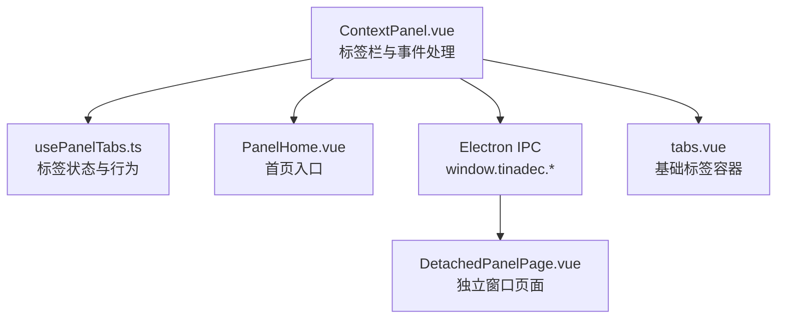
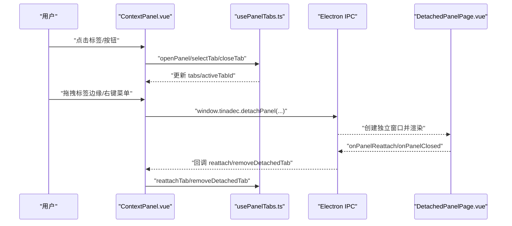
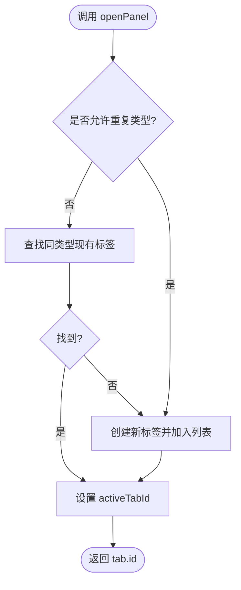
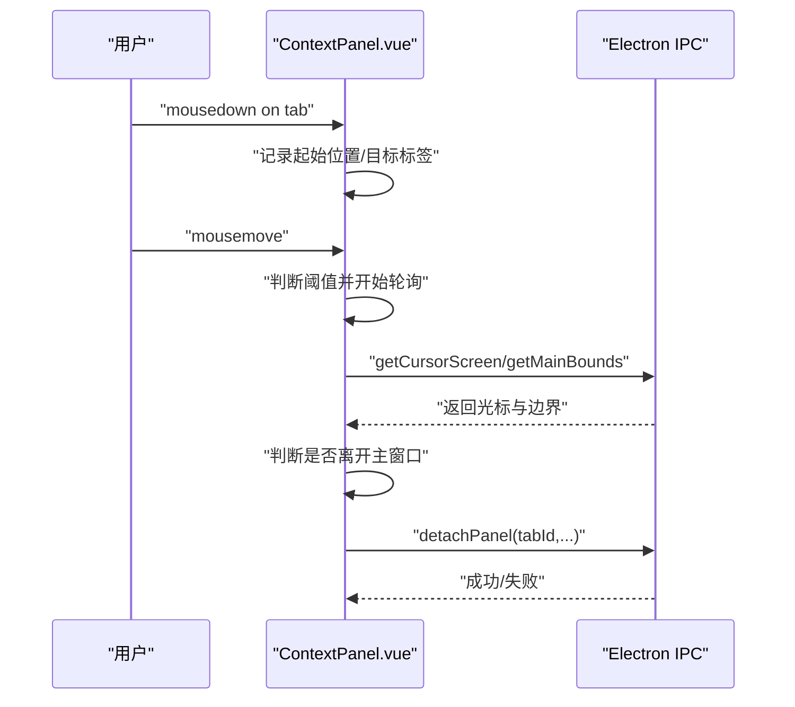
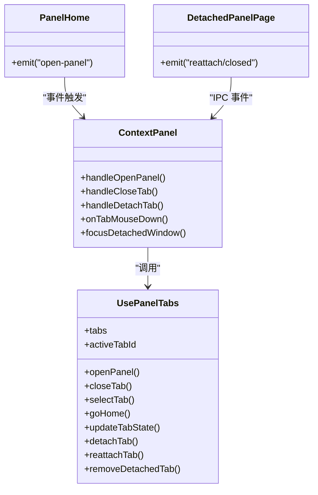

# 标签页管理

<cite>
**本文引用的文件**   
- [usePanelTabs.ts](file://apps/desktop/src/composables/usePanelTabs.ts)
- [ContextPanel.vue](file://apps/desktop/src/components/ContextPanel.vue)
- [tabs.vue](file://apps/desktop/src/components/ui/tabs.vue)
- [PanelHome.vue](file://apps/desktop/src/components/PanelHome.vue)
- [DetachedPanelPage.vue](file://apps/desktop/src/pages/DetachedPanelPage.vue)
</cite>

## 目录
1. [简介](#简介)
2. [项目结构](#项目结构)
3. [核心组件](#核心组件)
4. [架构总览](#架构总览)
5. [详细组件分析](#详细组件分析)
6. [依赖关系分析](#依赖关系分析)
7. [性能与内存优化](#性能与内存优化)
8. [故障排查指南](#故障排查指南)
9. [结论](#结论)
10. [附录](#附录)

## 简介
本文件为“标签页管理系统”的完整技术文档，聚焦多文件标签的管理机制与用户交互。内容涵盖：
- 标签创建、切换、关闭与状态保持
- 标签生命周期管理与内存优化
- 标签布局、拖拽排序（拆离）与键盘导航
- 标签持久化、恢复机制与错误恢复策略
- 与 Electron 窗口的分离/重连流程

## 项目结构
标签页系统由前端 Vue 组合式函数与面板组件构成，并通过 Electron IPC 与主进程协作实现窗口级“拆离/重连”。关键文件如下：
- usePanelTabs.ts：标签状态与行为的核心逻辑（创建、切换、关闭、拆离、重连等）
- ContextPanel.vue：标签栏 UI、事件处理、拖拽拆离、监听外部窗口事件
- tabs.vue：通用标签容器（用于其他场景的基础 Tabs）
- PanelHome.vue：首页入口，触发打开面板
- DetachedPanelPage.vue：独立窗口页面（承载被拆离的标签页）

图表来源
- [ContextPanel.vue:1-553](file://apps/desktop/src/components/ContextPanel.vue#L1-L553)
- [usePanelTabs.ts:1-238](file://apps/desktop/src/composables/usePanelTabs.ts#L1-L238)
- [PanelHome.vue:1-301](file://apps/desktop/src/components/PanelHome.vue#L1-L301)
- [DetachedPanelPage.vue:1-200](file://apps/desktop/src/pages/DetachedPanelPage.vue#L1-L200)
- [tabs.vue:1-38](file://apps/desktop/src/components/ui/tabs.vue#L1-L38)

章节来源
- [usePanelTabs.ts:1-238](file://apps/desktop/src/composables/usePanelTabs.ts#L1-L238)
- [ContextPanel.vue:1-553](file://apps/desktop/src/components/ContextPanel.vue#L1-L553)
- [PanelHome.vue:1-301](file://apps/desktop/src/components/PanelHome.vue#L1-L301)
- [tabs.vue:1-38](file://apps/desktop/src/components/ui/tabs.vue#L1-L38)
- [DetachedPanelPage.vue:1-200](file://apps/desktop/src/pages/DetachedPanelPage.vue#L1-L200)

## 核心组件
- 标签数据模型
  - PanelTab：包含 id、type、title、icon、closable、state 等字段，表示一个标签页
  - DetachedTabInfo：记录已拆离到独立窗口的标签信息（tabId、type、title、windowId）
- 状态与计算属性
  - tabs：所有标签列表
  - activeTabId：当前激活标签 ID
  - activeTab：当前激活标签对象
  - openTabs：非 home 类型的标签集合
  - detachedTabs：已拆离标签跟踪列表
- 核心方法
  - openPanel(type, title, icon, state?)：打开标签（支持单实例复用或允许重复类型）
  - closeTab(id)：关闭标签并自动选择相邻标签
  - selectTab(id)：切换激活标签
  - goHome()：回到首页标签
  - updateTabState(id, state)：合并更新标签状态
  - detachTab(id, options?)：将标签拆离到独立窗口
  - reattachTab(type, title, icon, state?)：从独立窗口重新附着回主面板
  - removeDetachedTab(tabId)：清理已关闭的独立窗口标签

章节来源
- [usePanelTabs.ts:25-49](file://apps/desktop/src/composables/usePanelTabs.ts#L25-L49)
- [usePanelTabs.ts:51-102](file://apps/desktop/src/composables/usePanelTabs.ts#L51-L102)
- [usePanelTabs.ts:104-133](file://apps/desktop/src/composables/usePanelTabs.ts#L104-L133)
- [usePanelTabs.ts:140-181](file://apps/desktop/src/composables/usePanelTabs.ts#L140-L181)
- [usePanelTabs.ts:187-205](file://apps/desktop/src/composables/usePanelTabs.ts#L187-L205)

## 架构总览
标签页系统采用“组合式函数 + 组件”的架构，UI 层通过 ContextPanel.vue 暴露操作入口，业务逻辑集中在 usePanelTabs.ts，跨窗口通信通过 window.tinadec.* API 完成。

图表来源
- [ContextPanel.vue:107-130](file://apps/desktop/src/components/ContextPanel.vue#L107-L130)
- [ContextPanel.vue:158-254](file://apps/desktop/src/components/ContextPanel.vue#L158-L254)
- [usePanelTabs.ts:140-181](file://apps/desktop/src/composables/usePanelTabs.ts#L140-L181)
- [DetachedPanelPage.vue:1-200](file://apps/desktop/src/pages/DetachedPanelPage.vue#L1-L200)

## 详细组件分析

### 使用组合式函数 usePanelTabs
- 职责
  - 维护标签集合与激活状态
  - 提供打开、关闭、切换、状态更新、拆离/重连等方法
  - 对某些类型（如 preview、terminal）允许多实例，其余类型默认单实例复用
- 复杂度
  - openPanel/closeTab/selectTab 均为 O(n) 查找与数组操作（n 为标签数量）
  - 建议当标签数较大时引入 Map 索引以加速查找
- 错误处理
  - detachTab 捕获异常返回 false，避免崩溃
  - closeTab 对不可关闭标签进行保护

图表来源
- [usePanelTabs.ts:76-102](file://apps/desktop/src/composables/usePanelTabs.ts#L76-L102)

章节来源
- [usePanelTabs.ts:51-102](file://apps/desktop/src/composables/usePanelTabs.ts#L51-L102)
- [usePanelTabs.ts:104-133](file://apps/desktop/src/composables/usePanelTabs.ts#L104-L133)
- [usePanelTabs.ts:140-181](file://apps/desktop/src/composables/usePanelTabs.ts#L140-L181)

### 上下文面板 ContextPanel.vue
- 职责
  - 渲染浏览器风格标签栏与内容区
  - 处理标签点击、关闭、右键菜单、拖拽拆离
  - 监听独立窗口事件（重连、关闭、已拆离）
  - 根据面板宽度与标签数量动态控制标签文本显示模式
- 拖拽拆离流程
  - mousedown 记录起始位置与目标标签
  - mousemove 判断移动阈值后开始轮询光标位置
  - 通过 Electron IPC 获取主窗口边界与光标坐标，若超出边界则触发拆离
  - 释放鼠标时清理事件监听与定时器

图表来源
- [ContextPanel.vue:158-254](file://apps/desktop/src/components/ContextPanel.vue#L158-L254)
- [ContextPanel.vue:107-130](file://apps/desktop/src/components/ContextPanel.vue#L107-L130)

章节来源
- [ContextPanel.vue:1-553](file://apps/desktop/src/components/ContextPanel.vue#L1-L553)

### 基础标签容器 tabs.vue
- 职责
  - 提供双向绑定的 modelValue 与内部 activeTab 同步
  - 通过插槽分发标签项与内容区域
- 适用场景
  - 非面板标签场景的通用 Tabs 容器

章节来源
- [tabs.vue:1-38](file://apps/desktop/src/components/ui/tabs.vue#L1-L38)

### 首页入口 PanelHome.vue
- 职责
  - 展示功能卡片网格，点击后触发 open-panel 事件
  - 支持紧凑模式与徽章计数（如待审批数量）

章节来源
- [PanelHome.vue:1-301](file://apps/desktop/src/components/PanelHome.vue#L1-L301)

### 独立窗口 DetachedPanelPage.vue
- 职责
  - 承载被拆离的标签页，渲染对应面板内容
  - 向主进程发送重连/关闭事件，供主面板同步状态

章节来源
- [DetachedPanelPage.vue:1-200](file://apps/desktop/src/pages/DetachedPanelPage.vue#L1-L200)

## 依赖关系分析
- ContextPanel.vue 依赖 usePanelTabs.ts 提供的状态与方法
- ContextPanel.vue 通过 window.tinadec.* 与 Electron 主进程通信
- PanelHome.vue 通过事件触发 ContextPanel.vue 的 openPanel
- DetachedPanelPage.vue 与主面板通过 IPC 事件协同

图表来源
- [usePanelTabs.ts:51-222](file://apps/desktop/src/composables/usePanelTabs.ts#L51-L222)
- [ContextPanel.vue:1-553](file://apps/desktop/src/components/ContextPanel.vue#L1-L553)
- [PanelHome.vue:1-301](file://apps/desktop/src/components/PanelHome.vue#L1-L301)
- [DetachedPanelPage.vue:1-200](file://apps/desktop/src/pages/DetachedPanelPage.vue#L1-L200)

章节来源
- [usePanelTabs.ts:51-222](file://apps/desktop/src/composables/usePanelTabs.ts#L51-L222)
- [ContextPanel.vue:1-553](file://apps/desktop/src/components/ContextPanel.vue#L1-L553)
- [PanelHome.vue:1-301](file://apps/desktop/src/components/PanelHome.vue#L1-L301)
- [DetachedPanelPage.vue:1-200](file://apps/desktop/src/pages/DetachedPanelPage.vue#L1-L200)

## 性能与内存优化
- 标签查找优化
  - 当前使用数组 find/filter，时间复杂度 O(n)。建议在标签数量增长时引入 Map<id, Tab> 索引，降低查找与删除成本
- 状态更新策略
  - updateTabState 使用浅合并，避免深层嵌套导致的频繁重渲染；必要时可引入增量更新
- 拖拽轮询开销
  - startCursorPolling 每 50ms 轮询一次，应在 drag 结束后立即停止，避免泄漏
- 组件渲染
  - v-show 而非 v-if 控制标签内容可见性，减少 DOM 重建；在大量标签时可考虑虚拟滚动
- 内存回收
  - 关闭标签时确保移除事件监听与定时器，防止内存泄漏
- 监控建议
  - 统计标签数量、活跃标签切换频率、拆离/重连次数，作为性能指标

[本节为通用指导，不直接分析具体文件]

## 故障排查指南
- 无法拆离标签
  - 检查 window.tinadec?.detachPanel 是否存在（浏览器环境不可用）
  - 确认标签是否为 closable=true
- 独立窗口未正确重连
  - 检查 onPanelReattach 回调是否注册
  - 确认 reattachTab 参数（type/title/icon/state）是否正确
- 标签关闭后未切换
  - 确认 closeTab 中 activeTabId 的切换逻辑是否命中
- 拖拽无响应
  - 检查 onDragMouseUp 是否清理事件监听与定时器
  - 确认 getCursorScreen/getMainBounds 返回值有效

章节来源
- [ContextPanel.vue:107-130](file://apps/desktop/src/components/ContextPanel.vue#L107-L130)
- [ContextPanel.vue:158-254](file://apps/desktop/src/components/ContextPanel.vue#L158-L254)
- [usePanelTabs.ts:140-181](file://apps/desktop/src/composables/usePanelTabs.ts#L140-L181)

## 结论
标签页管理系统通过清晰的组合式函数与组件分工，实现了稳定的标签生命周期管理、灵活的拆离/重连机制以及良好的用户体验。建议在生产环境中引入索引优化与性能监控，进一步提升大规模标签场景下的稳定性与流畅度。

[本节为总结性内容，不直接分析具体文件]

## 附录
- 标签类型与图标映射
  - git、approval、orchestration、events、doctor、preview、agent、terminal
- 快捷键建议（可选扩展）
  - Ctrl+Tab/Ctrl+Shift+Tab：前后切换标签
  - Ctrl+W：关闭当前标签
  - Alt+数字：跳转到第 N 个标签
- 持久化与恢复（建议方案）
  - 将 tabs 与 activeTabId 序列化至本地存储（IndexedDB/LocalStorage）
  - 应用启动时恢复状态，并对无效标签进行清理
  - 独立窗口状态可通过 IPC 同步，避免不一致

[本节为概念性内容，不直接分析具体文件]