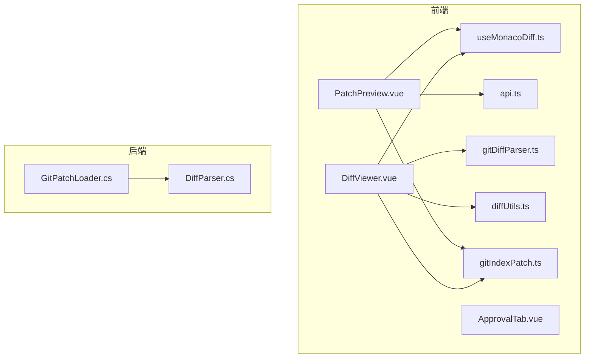
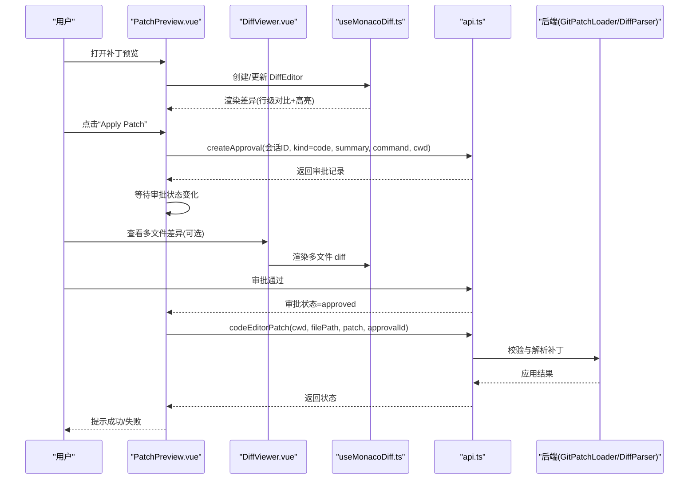
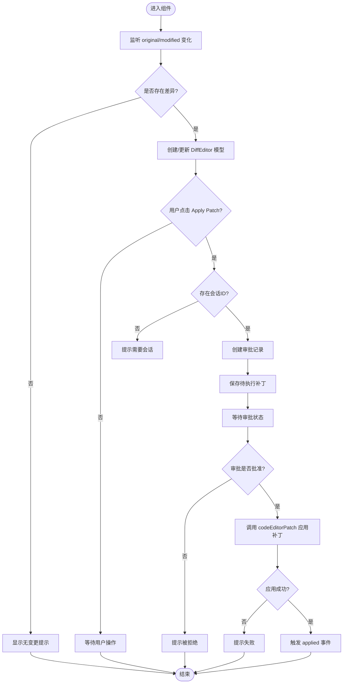
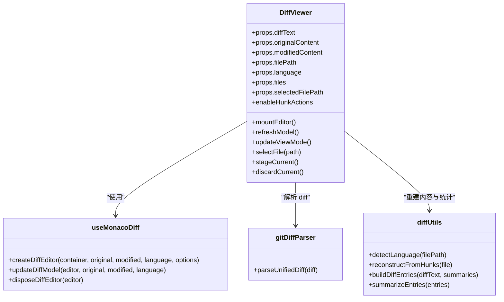
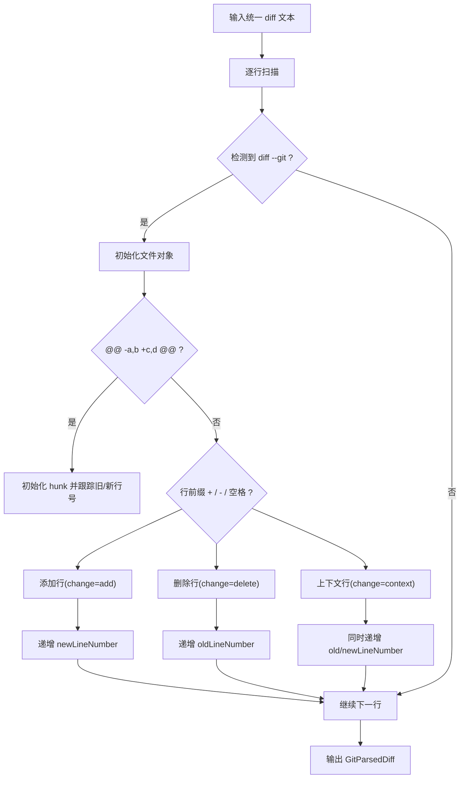
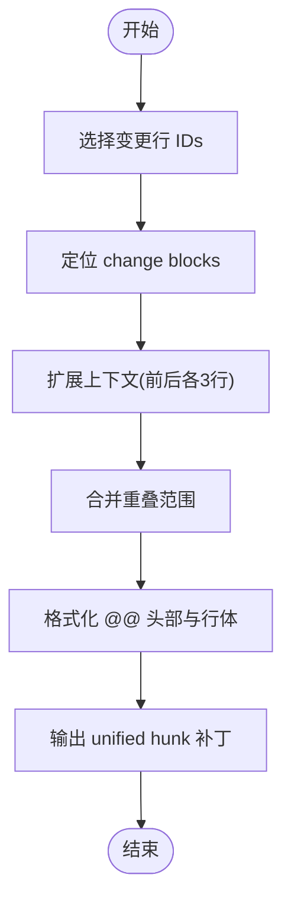
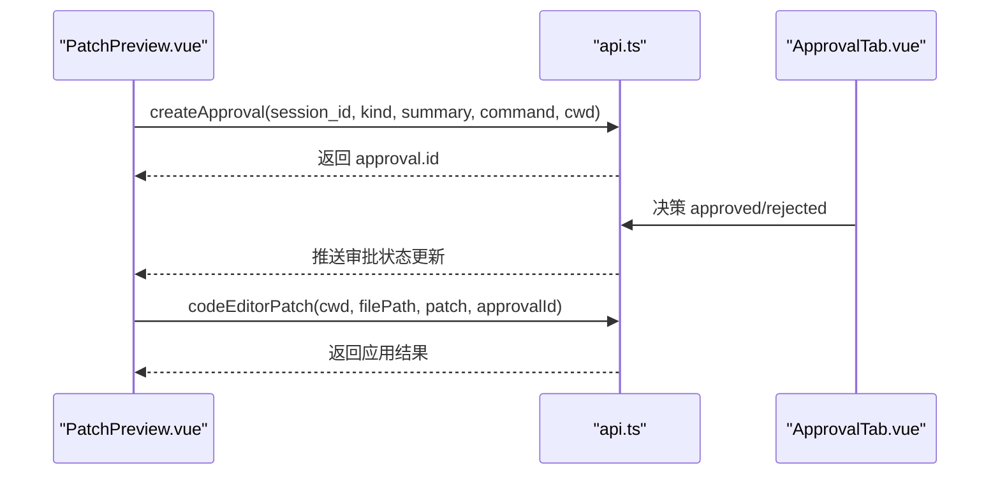
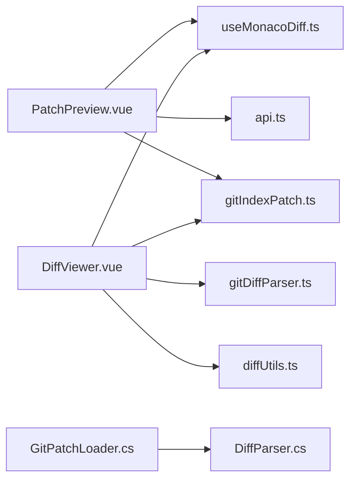

# 补丁预览

<cite>
**本文引用的文件**   
- [PatchPreview.vue](file://apps/desktop/src/components/code/PatchPreview.vue)
- [DiffViewer.vue](file://apps/desktop/src/components/git/DiffViewer.vue)
- [useMonacoDiff.ts](file://apps/desktop/src/composables/useMonacoDiff.ts)
- [gitDiffParser.ts](file://apps/desktop/src/gitDiffParser.ts)
- [gitIndexPatch.ts](file://apps/desktop/src/gitIndexPatch.ts)
- [diffUtils.ts](file://apps/desktop/src/components/git/diffUtils.ts)
- [api.ts](file://apps/desktop/src/api.ts)
- [ApprovalTab.vue](file://apps/desktop/src/components/ApprovalTab.vue)
- [DiffParser.cs](file://TinadecTools/Tools/Git/DiffParser.cs)
- [GitPatchLoader.cs](file://TinadecTools/Tools/Git/GitPatchLoader.cs)
</cite>

## 目录
1. [简介](#简介)
2. [项目结构](#项目结构)
3. [核心组件](#核心组件)
4. [架构总览](#架构总览)
5. [详细组件分析](#详细组件分析)
6. [依赖关系分析](#依赖关系分析)
7. [性能考量](#性能考量)
8. [故障排查指南](#故障排查指南)
9. [结论](#结论)
10. [附录](#附录)

## 简介
本文件为“补丁预览”功能的全面技术文档，聚焦 PatchPreview 组件的代码差异展示能力，包括行级对比、变更高亮与合并冲突解决。内容覆盖 Git diff 解析、差异计算、可视化渲染、补丁应用与回滚、审批流程集成，以及针对大文件处理与内存管理的优化策略。读者可据此理解从前端到后端的完整数据流与实现细节。

## 项目结构
补丁预览功能涉及前端 Vue 组件、Monaco Diff 编辑器封装、统一 diff 解析器、索引补丁生成工具，以及后端 Git 工具链的 diff 解析与加载。关键文件分布如下：
- 前端展示与交互：PatchPreview.vue、DiffViewer.vue、ApprovalTab.vue
- Monaco 编辑器封装：useMonacoDiff.ts
- 差异解析与构建：gitDiffParser.ts、gitIndexPatch.ts、diffUtils.ts
- API 类型定义：api.ts
- 后端差异解析与加载：DiffParser.cs、GitPatchLoader.cs

图表来源 
- [PatchPreview.vue:1-262](file://apps/desktop/src/components/code/PatchPreview.vue#L1-L262)
- [DiffViewer.vue:1-470](file://apps/desktop/src/components/git/DiffViewer.vue#L1-L470)
- [useMonacoDiff.ts:1-127](file://apps/desktop/src/composables/useMonacoDiff.ts#L1-L127)
- [gitDiffParser.ts:1-178](file://apps/desktop/src/gitDiffParser.ts#L1-L178)
- [gitIndexPatch.ts:1-108](file://apps/desktop/src/gitIndexPatch.ts#L1-L108)
- [diffUtils.ts:1-164](file://apps/desktop/src/components/git/diffUtils.ts#L1-L164)
- [api.ts:1-800](file://apps/desktop/src/api.ts#L1-L800)
- [DiffParser.cs:1-316](file://TinadecTools/Tools/Git/DiffParser.cs#L1-L316)
- [GitPatchLoader.cs:1-42](file://TinadecTools/Tools/Git/GitPatchLoader.cs#L1-L42)

章节来源
- [PatchPreview.vue:1-262](file://apps/desktop/src/components/code/PatchPreview.vue#L1-L262)
- [DiffViewer.vue:1-470](file://apps/desktop/src/components/git/DiffViewer.vue#L1-L470)
- [useMonacoDiff.ts:1-127](file://apps/desktop/src/composables/useMonacoDiff.ts#L1-L127)
- [gitDiffParser.ts:1-178](file://apps/desktop/src/gitDiffParser.ts#L1-L178)
- [gitIndexPatch.ts:1-108](file://apps/desktop/src/gitIndexPatch.ts#L1-L108)
- [diffUtils.ts:1-164](file://apps/desktop/src/components/git/diffUtils.ts#L1-L164)
- [api.ts:1-800](file://apps/desktop/src/api.ts#L1-L800)
- [DiffParser.cs:1-316](file://TinadecTools/Tools/Git/DiffParser.cs#L1-L316)
- [GitPatchLoader.cs:1-42](file://TinadecTools/Tools/Git/GitPatchLoader.cs#L1-L42)

## 核心组件
- PatchPreview.vue：提供单文件的代码差异预览、简易补丁生成、审批申请与执行、状态反馈与资源清理。
- DiffViewer.vue：支持单文件或多文件差异视图，基于 Monaco DiffEditor 渲染，具备统计、模式切换与操作按钮。
- useMonacoDiff.ts：封装 Monaco 初始化、主题同步、DiffEditor 创建与模型更新、销毁。
- gitDiffParser.ts：解析统一 diff（unified diff），输出结构化文件、hunk、行级变更。
- gitIndexPatch.ts：根据用户选择的变更块生成可独立应用的 unified hunk 补丁。
- diffUtils.ts：语言检测、从 hunks 重建近似 original/modified 文本、汇总统计。
- api.ts：审批相关 DTO 与接口类型定义。
- ApprovalTab.vue：审批面板，用于请求与决策审批。
- DiffParser.cs / GitPatchLoader.cs：后端解析统一 diff 与限制补丁大小，返回结构化结果。

章节来源
- [PatchPreview.vue:1-262](file://apps/desktop/src/components/code/PatchPreview.vue#L1-L262)
- [DiffViewer.vue:1-470](file://apps/desktop/src/components/git/DiffViewer.vue#L1-L470)
- [useMonacoDiff.ts:1-127](file://apps/desktop/src/composables/useMonacoDiff.ts#L1-L127)
- [gitDiffParser.ts:1-178](file://apps/desktop/src/gitDiffParser.ts#L1-L178)
- [gitIndexPatch.ts:1-108](file://apps/desktop/src/gitIndexPatch.ts#L1-L108)
- [diffUtils.ts:1-164](file://apps/desktop/src/components/git/diffUtils.ts#L1-L164)
- [api.ts:1-800](file://apps/desktop/src/api.ts#L1-L800)
- [ApprovalTab.vue:1-58](file://apps/desktop/src/components/ApprovalTab.vue#L1-L58)
- [DiffParser.cs:1-316](file://TinadecTools/Tools/Git/DiffParser.cs#L1-L316)
- [GitPatchLoader.cs:1-42](file://TinadecTools/Tools/Git/GitPatchLoader.cs#L1-L42)

## 架构总览
补丁预览的整体流程如下：
- 前端通过 PatchPreview 或 DiffViewer 获取原始与修改后的内容，使用 Monaco DiffEditor 进行行级对比与高亮。
- 如需应用补丁，PatchPreview 生成 Codex 风格补丁字符串并发起审批请求；审批通过后调用 codeEditorPatch 接口应用补丁。
- 多文件场景下，DiffViewer 将统一 diff 文本解析为结构化对象，再重建 original/modified 文本供编辑器渲染。
- 后端通过 GitPatchLoader 限制补丁大小，使用 DiffParser 解析统一 diff，确保安全性与稳定性。

图表来源 
- [PatchPreview.vue:133-198](file://apps/desktop/src/components/code/PatchPreview.vue#L133-L198)
- [DiffViewer.vue:113-152](file://apps/desktop/src/components/git/DiffViewer.vue#L113-L152)
- [useMonacoDiff.ts:65-123](file://apps/desktop/src/composables/useMonacoDiff.ts#L65-L123)
- [api.ts:25-44](file://apps/desktop/src/api.ts#L25-L44)
- [GitPatchLoader.cs:13-40](file://TinadecTools/Tools/Git/GitPatchLoader.cs#L13-L40)
- [DiffParser.cs:144-259](file://TinadecTools/Tools/Git/DiffParser.cs#L144-L259)

## 详细组件分析

### PatchPreview 组件分析
- 差异渲染：监听 props.originalContent/modifiedContent 变化，使用 Monaco DiffEditor 创建/更新模型，自动布局与主题适配。
- 补丁生成：基于行级比较生成 Codex 风格补丁（含上下文行），便于下游工具应用。
- 审批流程：无会话时提示错误；有会话则创建审批记录，保存待执行补丁；监听审批状态，批准后调用 codeEditorPatch 应用。
- 生命周期管理：组件卸载时释放 DiffEditor 与模型，避免内存泄漏。

图表来源 
- [PatchPreview.vue:115-131](file://apps/desktop/src/components/code/PatchPreview.vue#L115-L131)
- [PatchPreview.vue:47-103](file://apps/desktop/src/components/code/PatchPreview.vue#L47-L103)
- [PatchPreview.vue:133-198](file://apps/desktop/src/components/code/PatchPreview.vue#L133-L198)
- [PatchPreview.vue:200-213](file://apps/desktop/src/components/code/PatchPreview.vue#L200-L213)

章节来源
- [PatchPreview.vue:1-262](file://apps/desktop/src/components/code/PatchPreview.vue#L1-L262)

### DiffViewer 组件分析
- 多文件支持：当传入 files 列表时，支持选择不同文件并显示对应差异；否则以单文件模式工作。
- 差异重建：若仅提供 diffText，则通过 gitDiffParser 解析后，使用 reconstructFromHunks 重建 original/modified 文本供 Monaco 渲染。
- 统计与模式：展示增删行数、文件总数，支持侧边/内联两种视图模式切换。
- 操作扩展：预留 stage/discard hunk 动作，便于后续与 Git 索引操作集成。

图表来源 
- [DiffViewer.vue:113-152](file://apps/desktop/src/components/git/DiffViewer.vue#L113-L152)
- [useMonacoDiff.ts:65-123](file://apps/desktop/src/composables/useMonacoDiff.ts#L65-L123)
- [gitDiffParser.ts:36-156](file://apps/desktop/src/gitDiffParser.ts#L36-L156)
- [diffUtils.ts:95-111](file://apps/desktop/src/components/git/diffUtils.ts#L95-L111)

章节来源
- [DiffViewer.vue:1-470](file://apps/desktop/src/components/git/DiffViewer.vue#L1-L470)
- [useMonacoDiff.ts:1-127](file://apps/desktop/src/composables/useMonacoDiff.ts#L1-L127)
- [gitDiffParser.ts:1-178](file://apps/desktop/src/gitDiffParser.ts#L1-L178)
- [diffUtils.ts:1-164](file://apps/desktop/src/components/git/diffUtils.ts#L1-L164)

### Git Diff 解析与差异计算
- 前端解析：gitDiffParser.ts 按统一 diff 规范逐行扫描，识别文件头、rename/new/deleted/binary、hunk header 与行前缀（+/-/空格），输出结构化 GitParsedDiff。
- 后端解析：DiffParser.cs 同样解析 name-status、numstat 与 unified diff，合并为 GitFileChange/GitPatchFile 列表，保证前后端一致性。
- 重建文本：diffUtils.ts 的 reconstructFromHunks 仅重建变更区域及其上下文，足以支撑 Monaco DiffEditor 的可视化。

图表来源 
- [gitDiffParser.ts:36-156](file://apps/desktop/src/gitDiffParser.ts#L36-L156)
- [DiffParser.cs:144-259](file://TinadecTools/Tools/Git/DiffParser.cs#L144-L259)

章节来源
- [gitDiffParser.ts:1-178](file://apps/desktop/src/gitDiffParser.ts#L1-L178)
- [DiffParser.cs:1-316](file://TinadecTools/Tools/Git/DiffParser.cs#L1-L316)
- [diffUtils.ts:95-111](file://apps/desktop/src/components/git/diffUtils.ts#L95-L111)

### 补丁生成与索引补丁
- PatchPreview 的 generatePatch：基于简单行级比较，选取首尾差异位置，插入上下文行，生成 Codex 风格补丁字符串。
- gitIndexPatch 的 buildGitIndexPatch：根据用户选择的变更块 ID，保持替换块的原子性，合并相邻范围，输出可独立应用的 unified hunk 补丁。

图表来源 
- [gitIndexPatch.ts:14-50](file://apps/desktop/src/gitIndexPatch.ts#L14-L50)
- [gitIndexPatch.ts:78-103](file://apps/desktop/src/gitIndexPatch.ts#L78-L103)

章节来源
- [PatchPreview.vue:47-103](file://apps/desktop/src/components/code/PatchPreview.vue#L47-L103)
- [gitIndexPatch.ts:1-108](file://apps/desktop/src/gitIndexPatch.ts#L1-L108)

### 审批流程集成
- PatchPreview 在点击 Apply Patch 时创建审批记录（kind=code），并保存待执行补丁；监听审批状态变化，批准后调用 codeEditorPatch 应用。
- ApprovalTab 提供审批请求与决策界面，与 PatchPreview 协同完成人机协作审批。

图表来源 
- [PatchPreview.vue:133-198](file://apps/desktop/src/components/code/PatchPreview.vue#L133-L198)
- [ApprovalTab.vue:1-58](file://apps/desktop/src/components/ApprovalTab.vue#L1-L58)
- [api.ts:25-44](file://apps/desktop/src/api.ts#L25-L44)

章节来源
- [PatchPreview.vue:133-198](file://apps/desktop/src/components/code/PatchPreview.vue#L133-L198)
- [ApprovalTab.vue:1-58](file://apps/desktop/src/components/ApprovalTab.vue#L1-L58)
- [api.ts:25-44](file://apps/desktop/src/api.ts#L25-L44)

### 合并冲突解决
- 当前 PatchPreview 未内置冲突解决 UI；建议在 DiffViewer 中扩展“选择变更块”能力，结合 gitIndexPatch 生成局部补丁，配合审批流程逐步解决冲突。
- 对于二进制文件或截断差异，UI 应明确提示不可直接应用，引导用户手动处理。

[本节为概念性说明，不直接分析具体文件]

## 依赖关系分析
- PatchPreview 依赖 useMonacoDiff 进行编辑器渲染，依赖 api.ts 进行审批与补丁应用。
- DiffViewer 依赖 gitDiffParser 与 diffUtils 进行差异解析与重建，依赖 useMonacoDiff 渲染。
- gitIndexPatch 依赖 gitDiffParser 的结构化输出。
- 后端 GitPatchLoader 依赖 DiffParser 解析统一 diff，并限制补丁大小。

图表来源 
- [PatchPreview.vue:1-262](file://apps/desktop/src/components/code/PatchPreview.vue#L1-L262)
- [DiffViewer.vue:1-470](file://apps/desktop/src/components/git/DiffViewer.vue#L1-L470)
- [useMonacoDiff.ts:1-127](file://apps/desktop/src/composables/useMonacoDiff.ts#L1-L127)
- [gitDiffParser.ts:1-178](file://apps/desktop/src/gitDiffParser.ts#L1-L178)
- [gitIndexPatch.ts:1-108](file://apps/desktop/src/gitIndexPatch.ts#L1-L108)
- [diffUtils.ts:1-164](file://apps/desktop/src/components/git/diffUtils.ts#L1-L164)
- [GitPatchLoader.cs:1-42](file://TinadecTools/Tools/Git/GitPatchLoader.cs#L1-L42)
- [DiffParser.cs:1-316](file://TinadecTools/Tools/Git/DiffParser.cs#L1-L316)

章节来源
- [PatchPreview.vue:1-262](file://apps/desktop/src/components/code/PatchPreview.vue#L1-L262)
- [DiffViewer.vue:1-470](file://apps/desktop/src/components/git/DiffViewer.vue#L1-L470)
- [useMonacoDiff.ts:1-127](file://apps/desktop/src/composables/useMonacoDiff.ts#L1-L127)
- [gitDiffParser.ts:1-178](file://apps/desktop/src/gitDiffParser.ts#L1-L178)
- [gitIndexPatch.ts:1-108](file://apps/desktop/src/gitIndexPatch.ts#L1-L108)
- [diffUtils.ts:1-164](file://apps/desktop/src/components/git/diffUtils.ts#L1-L164)
- [GitPatchLoader.cs:1-42](file://TinadecTools/Tools/Git/GitPatchLoader.cs#L1-L42)
- [DiffParser.cs:1-316](file://TinadecTools/Tools/Git/DiffParser.cs#L1-L316)

## 性能考量
- 大文件处理：
  - 后端 GitPatchLoader 限制补丁字节数，超过阈值返回 truncated 标志，避免内存溢出。
  - 前端 DiffViewer 仅重建变更区域与上下文，减少内存占用。
- 渲染优化：
  - Monaco DiffEditor 关闭 minimap、wordWrap、overviewRuler，降低渲染开销。
  - 自动布局与只读模式提升性能。
- 内存管理：
  - 组件卸载时释放 DiffEditor 与模型，防止内存泄漏。
  - 主题切换时复用实例，避免重复初始化。
- 差异算法：
  - 前端使用行级比较与上下文窗口，适合快速预览；复杂场景建议引入更精确的差异算法（如 Myers 算法）按需启用。

[本节提供通用指导，不直接分析具体文件]

## 故障排查指南
- 无会话无法应用补丁：PatchPreview 在未提供 selectedSessionId 时会提示错误，需确保会话有效。
- 审批失败：检查 createApproval 返回值与错误信息，确认后端审批服务可用。
- 补丁应用失败：检查 codeEditorPatch 返回状态与摘要，必要时查看后端日志。
- 二进制文件：DiffViewer 会显示二进制提示，无法直接应用文本补丁，需手动处理。
- 差异过大：后端返回 truncated 标志，需调整 maxPatchBytes 或分块处理。

章节来源
- [PatchPreview.vue:133-163](file://apps/desktop/src/components/code/PatchPreview.vue#L133-L163)
- [DiffViewer.vue:276-282](file://apps/desktop/src/components/git/DiffViewer.vue#L276-L282)
- [GitPatchLoader.cs:29-40](file://TinadecTools/Tools/Git/GitPatchLoader.cs#L29-L40)

## 结论
补丁预览功能通过前端 Monaco DiffEditor 与统一 diff 解析器实现了高效的行级对比与变更高亮，结合审批流程保障安全应用。后端对补丁大小进行限制，确保系统稳定性。未来可扩展冲突解决 UI、更精细的差异算法与增量渲染以提升用户体验与性能。

[本节为总结性内容，不直接分析具体文件]

## 附录
- 术语表：
  - unified diff：统一差异格式，包含 @@ 头部与 +/-/空格 行前缀。
  - hunk：差异块，表示一段连续的变更区域。
  - 审批流程：人机协作机制，确保高风险操作经人工确认。
- 最佳实践：
  - 优先使用重构后的 original/modified 文本进行渲染，避免直接解析 diff 文本。
  - 对大文件采用分块加载与懒渲染策略。
  - 始终在组件卸载时释放编辑器与模型资源。

[本节为补充信息，不直接分析具体文件]