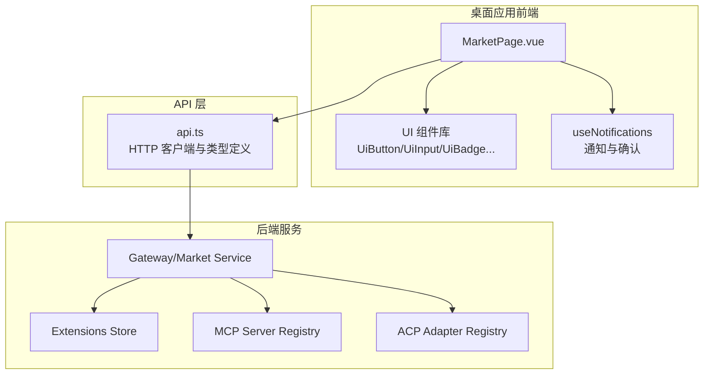
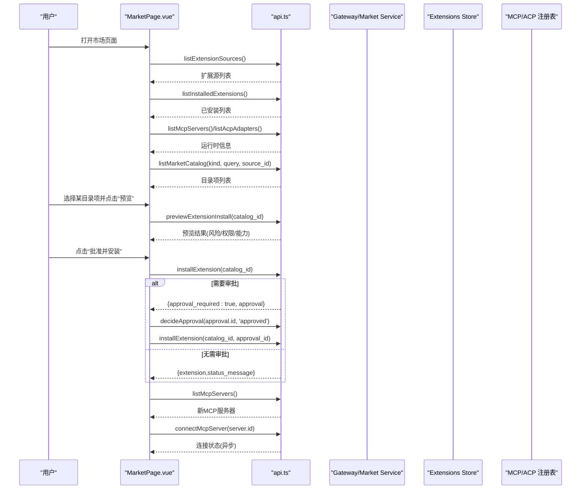
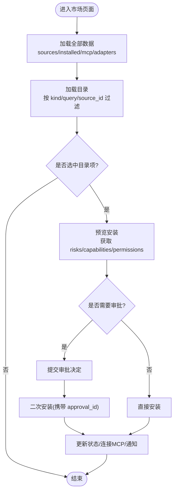
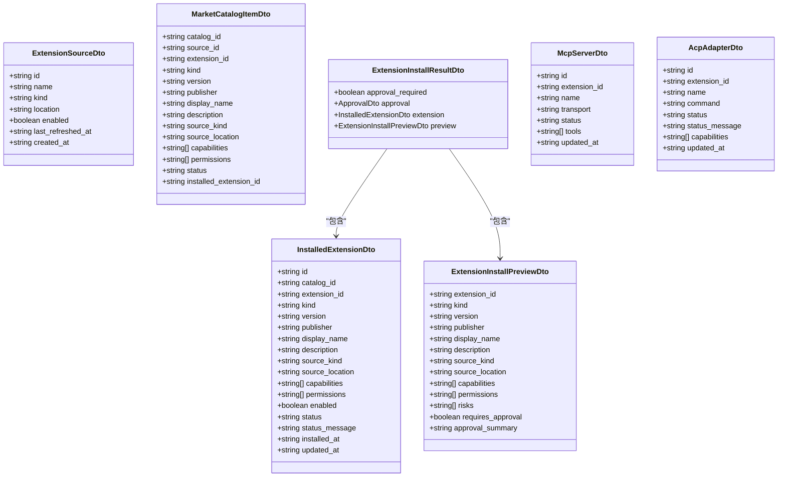
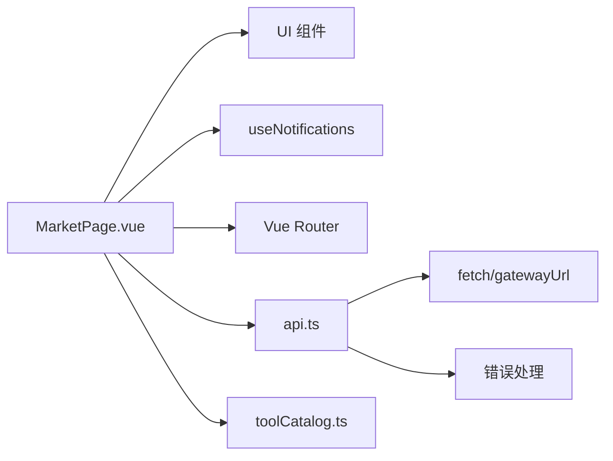

# 市场页面

<cite>
**本文引用的文件**   
- [MarketPage.vue](file://apps/desktop/src/pages/MarketPage.vue)
- [api.ts](file://apps/desktop/src/api.ts)
- [toolCatalog.ts](file://apps/desktop/src/toolCatalog.ts)
</cite>

## 目录
1. [简介](#简介)
2. [项目结构](#项目结构)
3. [核心组件](#核心组件)
4. [架构总览](#架构总览)
5. [详细组件分析](#详细组件分析)
6. [依赖关系分析](#依赖关系分析)
7. [性能考量](#性能考量)
8. [故障排查指南](#故障排查指南)
9. [结论](#结论)
10. [附录](#附录)

## 简介
本文件为“市场页面”（MarketPage）的完整技术文档，聚焦工具市场与插件商店能力：工具浏览、搜索、安装与管理；记录工具目录结构、元数据管理与版本控制；说明工具分类、标签系统与推荐排序；提供工具预览、依赖检查与批量安装能力的实现要点。该页面通过前端 Vue 组件与后端 API 交互，完成扩展源管理、目录拉取、安装预览、审批流程、启用/禁用与卸载等全生命周期操作。

## 项目结构
市场页面位于桌面应用的前端工程中，采用单页组件组织方式：
- 页面组件：MarketPage.vue 负责 UI 与业务编排
- API 层：api.ts 定义所有 HTTP 接口调用与类型契约
- 工具目录与排序：toolCatalog.ts 提供工具分组、排序与能力提取等通用逻辑

图表来源
- [MarketPage.vue:1-592](file://apps/desktop/src/pages/MarketPage.vue#L1-L592)
- [api.ts:997-1122](file://apps/desktop/src/api.ts#L997-L1122)

章节来源
- [MarketPage.vue:1-592](file://apps/desktop/src/pages/MarketPage.vue#L1-L592)
- [api.ts:997-1122](file://apps/desktop/src/api.ts#L997-L1122)

## 核心组件
- MarketPage.vue
  - 功能：展示工具市场与插件商店，支持按种类筛选、关键词搜索、来源过滤、安装预览、安装审批、启用/禁用、卸载、直接安装（本地/归档/GitHub/Git/HTTPS/MCPB/DXT）。
  - 状态：sources（扩展源）、catalog（目录项）、installed（已安装）、mcpServers/acpAdapters（运行时）、selectedCatalogId（选中项）、kindFilter/sourceFilter/query（筛选）、preview/directPreview（预览）、busy/loading（加载态）。
  - 关键方法：loadAll/loadCatalog/loadPreview/approveAndInstallCatalog/previewDirectInstall/approveAndInstallDirect/toggleExtension/removeExtension/addSource/refreshSource。
- api.ts
  - 功能：封装市场相关的所有 REST 接口，包括扩展源 CRUD、目录查询、安装预览与安装、已安装列表、MCP/ACP 管理等。
  - 类型：ExtensionSourceDto、MarketCatalogItemDto、InstalledExtensionDto、ExtensionInstallPreviewDto、ExtensionInstallResultDto、McpServerDto、AcpAdapterDto 等。
- toolCatalog.ts
  - 功能：工具分组、排序、能力提取、搜索结果排序等通用逻辑，可用于市场页面的工具展示与推荐排序。

章节来源
- [MarketPage.vue:1-592](file://apps/desktop/src/pages/MarketPage.vue#L1-L592)
- [api.ts:287-376](file://apps/desktop/src/api.ts#L287-L376)
- [api.ts:1088-1122](file://apps/desktop/src/api.ts#L1088-L1122)
- [toolCatalog.ts:1-138](file://apps/desktop/src/toolCatalog.ts#L1-L138)

## 架构总览
市场页面采用“前端组件 + API 层 + 后端服务”的分层架构：
- 前端组件负责用户交互与状态管理
- API 层统一网络请求与错误处理
- 后端服务提供扩展源管理、目录检索、安装与审批、运行时注册（MCP/ACP）等能力

图表来源
- [MarketPage.vue:178-233](file://apps/desktop/src/pages/MarketPage.vue#L178-L233)
- [MarketPage.vue:269-297](file://apps/desktop/src/pages/MarketPage.vue#L269-L297)
- [api.ts:1088-1122](file://apps/desktop/src/api.ts#L1088-L1122)

## 详细组件分析

### MarketPage 组件分析
- 数据流
  - 初始化 onMounted → loadAll → ensureBuiltInSources → Promise.all([sources, installed, mcpServers, adapters]) → loadCatalog
  - 筛选变化 watch(kindFilter, sourceFilter) → loadCatalog
  - 选中项变化 watch(selectedCatalogId) → loadPreview
- 交互流程
  - 搜索与刷新：输入框回车或点击刷新按钮触发 loadCatalog
  - 添加来源：addSource → createExtensionSource → loadAll
  - 刷新来源：refreshSource → refreshExtensionSource → loadAll
  - 安装流程：approveAndInstallCatalog → installExtension → 可选 approve → 再次 install → 自动连接 MCP
  - 直接安装：previewDirectInstall → approveAndInstallDirect
  - 启停与卸载：toggleExtension → enable/disable → loadAll/loadPreview；removeExtension → deleteExtension → loadAll/loadPreview
- 错误处理
  - run(label, action) 包裹异常并通过 useNotifications.error 提示
  - loadAll/loadCatalog 捕获错误并以 status.error 形式显示重试动作
- 界面元素
  - 左侧栏：搜索、种类筛选、来源列表、添加来源表单
  - 中间列表：目录卡片（名称、描述、类别、发布者、版本、状态）
  - 右侧详情：基本信息、能力/权限、风险预览、运行时信息、操作按钮、直接安装区

图表来源
- [MarketPage.vue:178-233](file://apps/desktop/src/pages/MarketPage.vue#L178-L233)
- [MarketPage.vue:269-297](file://apps/desktop/src/pages/MarketPage.vue#L269-L297)
- [MarketPage.vue:299-330](file://apps/desktop/src/pages/MarketPage.vue#L299-L330)

章节来源
- [MarketPage.vue:1-592](file://apps/desktop/src/pages/MarketPage.vue#L1-L592)

### API 层与市场接口
- 扩展源管理
  - listExtensionSources / createExtensionSource / refreshExtensionSource
- 目录与搜索
  - listMarketCatalog(kind?, query?, source_id?)
- 安装与预览
  - previewExtensionInstall({ catalog_id? | source_kind?, source_location?, manifest_json? })
  - installExtension({ catalog_id? | source_kind?, source_location?, manifest_json?, approval_id? })
- 已安装与生命周期
  - listInstalledExtensions / enableExtension / disableExtension / updateExtension / deleteExtension
- 运行时集成
  - listMcpServers / reloadMcpServer / connectMcpServer
  - listAcpAdapters / probeAcpAdapter

图表来源
- [api.ts:287-376](file://apps/desktop/src/api.ts#L287-L376)
- [api.ts:1088-1122](file://apps/desktop/src/api.ts#L1088-L1122)

章节来源
- [api.ts:287-376](file://apps/desktop/src/api.ts#L287-L376)
- [api.ts:1088-1122](file://apps/desktop/src/api.ts#L1088-L1122)

### 工具目录结构与元数据管理
- 目录项字段
  - catalog_id：目录唯一标识
  - extension_id：扩展唯一标识
  - kind：skill/mcp-server/acp-adapter/tool-pack 等
  - version/publisher/display_name/description：基础元数据
  - source_kind/source_location：来源类型与位置
  - capabilities/permissions：能力与权限声明
  - status：目录项状态（可用/已安装/禁用等）
- 已安装项字段
  - 除基础元数据外，包含 enabled/status/status_message 等运行期状态
- 预览与安装结果
  - preview.risks：风险清单
  - preview.requires_approval：是否需要人工审批
  - result.approval：审批对象（如需）
  - result.extension：安装后的扩展实体

章节来源
- [api.ts:297-376](file://apps/desktop/src/api.ts#L297-L376)

### 工具分类、标签系统与推荐算法
- 分类
  - kind 字段用于区分 skill/mcp-server/acp-adapter/tool-pack
  - 前端 kindOptions 提供 All/Skill/MCP/ACP 快速筛选
- 标签系统
  - capabilities/permissions 作为能力与权限标签，在详情页以 chip 形式展示
- 推荐与排序
  - toolCatalog.ts 提供 sortedToolSearchResults：按 score 降序、sourceRank、id 字典序排序
  - 可结合 MarketCatalogItemDto 的 capabilities/version/publisher 进行前端二次排序或加权

章节来源
- [MarketPage.vue:73-78](file://apps/desktop/src/pages/MarketPage.vue#L73-L78)
- [toolCatalog.ts:77-85](file://apps/desktop/src/toolCatalog.ts#L77-L85)

### 工具预览、依赖检查与批量安装
- 预览
  - previewExtensionInstall：根据 catalog_id 或 source_kind/source_location/manifest_json 返回 risks/capabilities/permissions/requires_approval
- 依赖检查
  - 通过 capabilities/permissions 与运行时信息（MCP/ACP）判断依赖是否满足；安装后若为 MCP，则尝试连接
- 批量安装
  - 当前实现为单项安装；可在前端循环调用 installExtension 并聚合结果，结合 useNotifications 分批反馈

章节来源
- [MarketPage.vue:235-245](file://apps/desktop/src/pages/MarketPage.vue#L235-L245)
- [MarketPage.vue:269-297](file://apps/desktop/src/pages/MarketPage.vue#L269-L297)
- [api.ts:1105-1112](file://apps/desktop/src/api.ts#L1105-L1112)

## 依赖关系分析
- MarketPage.vue 依赖
  - UI 组件：UiButton/UiInput/UiBadge 等
  - 通知：useNotifications（notify/status/confirm/dismissByKey）
  - 路由：Vue Router（返回主页）
  - API：api.ts 的市场与扩展接口
- API 层依赖
  - fetch 与 gatewayUrl（window.tinadec?.gatewayUrl）
  - 错误处理：extractErrorMessage、request 包装器
- 工具目录与排序
  - toolCatalog.ts 提供排序与能力解析，可与市场目录项组合使用

图表来源
- [MarketPage.vue:1-50](file://apps/desktop/src/pages/MarketPage.vue#L1-L50)
- [api.ts:943-995](file://apps/desktop/src/api.ts#L943-L995)
- [toolCatalog.ts:1-30](file://apps/desktop/src/toolCatalog.ts#L1-L30)

章节来源
- [MarketPage.vue:1-592](file://apps/desktop/src/pages/MarketPage.vue#L1-L592)
- [api.ts:943-995](file://apps/desktop/src/api.ts#L943-L995)
- [toolCatalog.ts:1-138](file://apps/desktop/src/toolCatalog.ts#L1-L138)

## 性能考量
- 并发加载
  - loadAll 使用 Promise.all 并行拉取 sources/installed/mcp/adapters，减少首屏等待
- 按需刷新
  - 仅当 kindFilter/sourceFilter 变化时重新加载目录，避免不必要的请求
- 预览优化
  - selectedCatalogId 变化才触发 loadPreview，降低重复计算
- 错误重试
  - 错误提示中包含“重试”动作，便于快速恢复

[本节为通用指导，不直接分析具体文件]

## 故障排查指南
- 网络连接失败
  - request 包装器会抛出“Cannot connect to backend”错误，检查 gatewayUrl 与网络连通性
- 响应非 JSON
  - 解析失败将抛出“Invalid response from server”，检查后端返回格式
- 安装失败
  - 检查 preview.risks 与 requires_approval；必要时先提交审批再安装
  - 查看 installed.status 与 status_message 定位问题
- MCP/ACP 连接问题
  - 使用 connectMcpServer/probeAcpAdapter 诊断运行时状态

章节来源
- [api.ts:945-995](file://apps/desktop/src/api.ts#L945-L995)
- [MarketPage.vue:147-156](file://apps/desktop/src/pages/MarketPage.vue#L147-L156)
- [MarketPage.vue:198-210](file://apps/desktop/src/pages/MarketPage.vue#L198-L210)

## 结论
MarketPage 提供了完整的工具市场与插件商店体验，涵盖从目录浏览、搜索筛选、预览审批到安装启停的全链路。通过清晰的 API 契约与健壮的错误处理，确保用户体验与稳定性。未来可扩展批量安装、更丰富的推荐策略与更细粒度的权限控制。

[本节为总结，不直接分析具体文件]

## 附录
- 常用 API 路径参考
  - 扩展源：/api/v1/market/sources
  - 目录：/api/v1/market/catalog
  - 预览安装：/api/v1/extensions/install-preview
  - 安装：/api/v1/extensions/install
  - 已安装：/api/v1/extensions/installed
  - MCP：/api/v1/mcp/servers
  - ACP：/api/v1/acp/adapters

章节来源
- [api.ts:1088-1122](file://apps/desktop/src/api.ts#L1088-L1122)