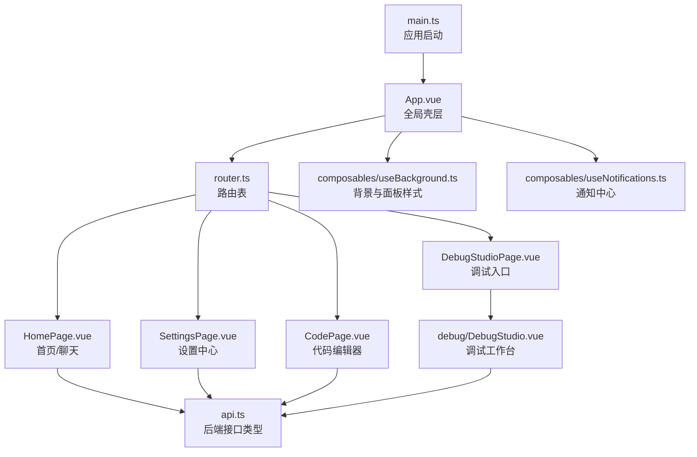
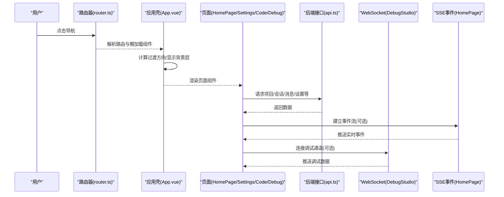
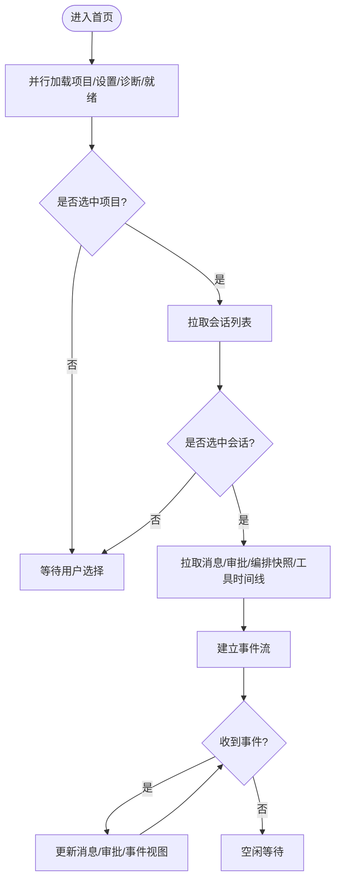
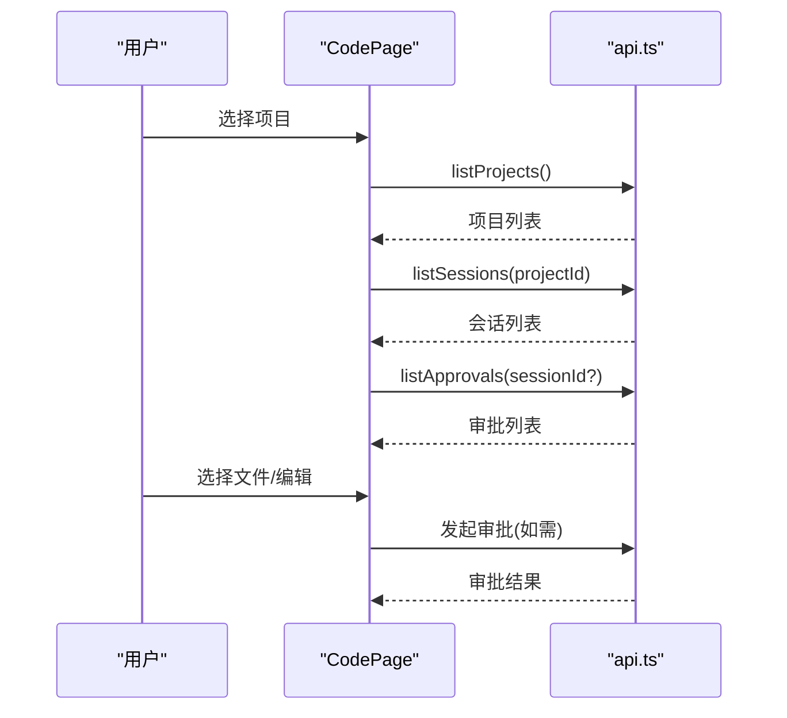
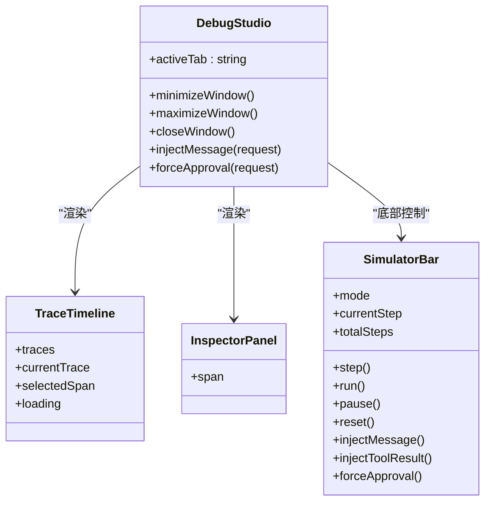
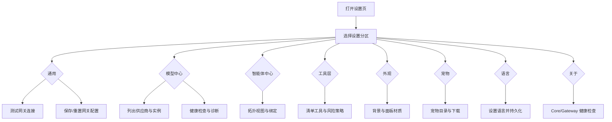
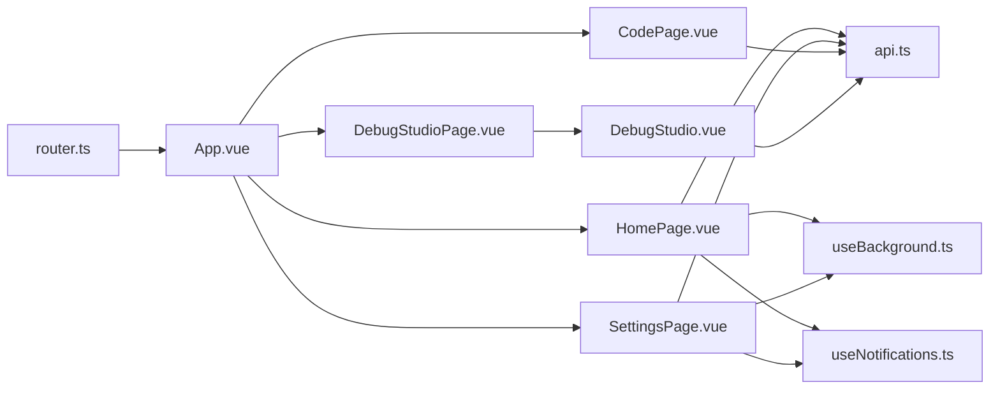

# 应用页面模块

<cite>
**本文引用的文件**   
- [router.ts](file://apps/desktop/src/router.ts)
- [App.vue](file://apps/desktop/src/App.vue)
- [main.ts](file://apps/desktop/src/main.ts)
- [HomePage.vue](file://apps/desktop/src/pages/HomePage.vue)
- [CodePage.vue](file://apps/desktop/src/pages/CodePage.vue)
- [DebugStudioPage.vue](file://apps/desktop/src/pages/DebugStudioPage.vue)
- [SettingsPage.vue](file://apps/desktop/src/pages/SettingsPage.vue)
- [DebugStudio.vue](file://apps/desktop/src/debug/DebugStudio.vue)
- [api.ts](file://apps/desktop/src/api.ts)
- [i18n.ts](file://apps/desktop/src/i18n.ts)
- [useBackground.ts](file://apps/desktop/src/composables/useBackground.ts)
- [background.ts](file://apps/desktop/src/types/background.ts)
- [useNotifications.ts](file://apps/desktop/src/composables/useNotifications.ts)
</cite>

## 目录
1. [简介](#简介)
2. [项目结构](#项目结构)
3. [核心组件](#核心组件)
4. [架构总览](#架构总览)
5. [详细组件分析](#详细组件分析)
6. [依赖关系分析](#依赖关系分析)
7. [性能考虑](#性能考虑)
8. [故障排查指南](#故障排查指南)
9. [结论](#结论)
10. [附录](#附录)

## 简介
本文件面向“应用页面模块”，聚焦桌面端 Vue 应用中的关键页面：HomePage、CodePage、DebugStudioPage、SettingsPage。文档从路由配置、页面布局与数据流、用户交互、状态共享、国际化、权限控制、错误边界、性能优化（懒加载、缓存策略）等维度进行系统化说明，帮助读者快速理解并扩展这些页面的功能。

## 项目结构
- 路由定义位于 router.ts，采用 Hash 模式，所有页面通过动态 import 实现按需加载。
- App.vue 负责全局背景层、连接状态门控、通知中心挂载、页面过渡动画方向计算。
- main.ts 初始化 Vue 应用、注册路由与 i18n，注入通知默认文案，并在挂载前应用主题。
- 页面组件位于 pages 目录；调试工作室由 DebugStudioPage.vue 作为入口，实际逻辑在 debug/DebugStudio.vue。
- 设置页 SettingsPage.vue 整合模型中心、智能体中心、工具层、外观、宠物、语言、API 文档、关于等子模块。
- API 类型与接口集中在 api.ts，供各页面统一调用。
- 国际化配置在 i18n.ts，支持中文与英文，默认读取本地存储的 locale。
- 背景与面板样式通过 composables/useBackground.ts 与 types/background.ts 统一管理。
- 通知系统由 composables/useNotifications.ts 提供跨窗口状态同步与任务生命周期管理。

图表来源
- [main.ts:1-24](file://apps/desktop/src/main.ts#L1-L24)
- [App.vue:1-182](file://apps/desktop/src/App.vue#L1-L182)
- [router.ts:1-45](file://apps/desktop/src/router.ts#L1-L45)
- [HomePage.vue:1-428](file://apps/desktop/src/pages/HomePage.vue#L1-L428)
- [SettingsPage.vue:1-800](file://apps/desktop/src/pages/SettingsPage.vue#L1-L800)
- [CodePage.vue:1-471](file://apps/desktop/src/pages/CodePage.vue#L1-L471)
- [DebugStudioPage.vue:1-8](file://apps/desktop/src/pages/DebugStudioPage.vue#L1-L8)
- [DebugStudio.vue:1-303](file://apps/desktop/src/debug/DebugStudio.vue#L1-L303)
- [api.ts:1-200](file://apps/desktop/src/api.ts#L1-L200)
- [useBackground.ts:1-230](file://apps/desktop/src/composables/useBackground.ts#L1-L230)
- [useNotifications.ts:1-200](file://apps/desktop/src/composables/useNotifications.ts#L1-L200)

章节来源
- [router.ts:1-45](file://apps/desktop/src/router.ts#L1-L45)
- [App.vue:1-182](file://apps/desktop/src/App.vue#L1-L182)
- [main.ts:1-24](file://apps/desktop/src/main.ts#L1-L24)

## 核心组件
- HomePage：项目与会话管理、消息发送、事件订阅、审批处理、右侧上下文面板（事件、诊断、编排快照、工具执行时间线）、Agent 活动共享。
- CodePage：项目选择、文件树与搜索、多标签编辑/查看、补丁预览、审批流集成。
- DebugStudioPage：调试工作室入口，内部使用 WebSocket、Trace 数据、模拟与指标仪表板。
- SettingsPage：全局设置中心，包含网关配置、模型中心、智能体中心、工具层、外观、宠物、语言、API 文档、关于与健康检查。

章节来源
- [HomePage.vue:1-428](file://apps/desktop/src/pages/HomePage.vue#L1-L428)
- [CodePage.vue:1-471](file://apps/desktop/src/pages/CodePage.vue#L1-L471)
- [DebugStudioPage.vue:1-8](file://apps/desktop/src/pages/DebugStudioPage.vue#L1-L8)
- [DebugStudio.vue:1-303](file://apps/desktop/src/debug/DebugStudio.vue#L1-L303)
- [SettingsPage.vue:1-800](file://apps/desktop/src/pages/SettingsPage.vue#L1-L800)

## 架构总览
- 路由层：Hash 模式，页面组件懒加载，导航方向由 App.vue 根据路由顺序决定过渡动画。
- 应用壳层：App.vue 渲染全局背景层（不受页面过渡影响），管理后端连接门控与通知中心。
- 页面层：各页面独立维护自身状态，通过 composables 共享全局样式与背景设置，通过 api.ts 访问后端能力。
- 通信层：HTTP 接口 + SSE 事件流（HomePage）+ WebSocket（Debug Studio）。
- 国际化：i18n 在应用启动时注入，页面内通过 useI18n 获取翻译。
- 权限控制：审批流程贯穿 Chat、Git、Shell 操作，由后端生成 ApprovalDto，前端展示决策界面。

图表来源
- [router.ts:1-45](file://apps/desktop/src/router.ts#L1-L45)
- [App.vue:1-182](file://apps/desktop/src/App.vue#L1-L182)
- [HomePage.vue:1-428](file://apps/desktop/src/pages/HomePage.vue#L1-L428)
- [DebugStudio.vue:1-303](file://apps/desktop/src/debug/DebugStudio.vue#L1-L303)
- [api.ts:1-200](file://apps/desktop/src/api.ts#L1-L200)

## 详细组件分析

### HomePage 分析与数据流
- 布局：顶部拖拽条、头部、工作区（ChatPanel、AppSidebar、ContextPanel 三栏）。
- 数据流：
  - 初始化并行加载项目列表、模型设置、诊断报告、就绪状态。
  - 选择项目后拉取会话列表；选择会话后拉取消息、审批、编排快照、工具执行时间线。
  - 通过 EventSource 订阅事件流，增量更新事件与相关视图。
- 用户交互：
  - 打开项目、创建会话、发送消息、自动更新会话标题。
  - 请求 Shell 审批、审批决策、记录审批变更。
  - 切换项目与会话触发数据重载与事件重连。
- 状态共享：
  - Agent 活动通过 useAgentActivity 共享给聊天与侧边栏。
  - 背景与面板材质效果通过 useBackground 与 usePanelStyles 全局共享。
- 错误处理：
  - 使用通知系统 banner/error 提示加载失败并提供重试动作。
  - 事件重连与异常捕获保证稳定性。

图表来源
- [HomePage.vue:125-177](file://apps/desktop/src/pages/HomePage.vue#L125-L177)
- [HomePage.vue:179-198](file://apps/desktop/src/pages/HomePage.vue#L179-L198)
- [HomePage.vue:298-317](file://apps/desktop/src/pages/HomePage.vue#L298-L317)

章节来源
- [HomePage.vue:1-428](file://apps/desktop/src/pages/HomePage.vue#L1-L428)

### CodePage 分析与数据流
- 布局：顶部工具栏（返回、项目选择、新建、刷新、搜索开关、补丁开关）、左侧文件树与搜索、中间标签编辑区、右侧补丁预览。
- 数据流：
  - 加载项目列表，选择项目后自动选择首个会话（若存在）。
  - 拉取审批列表，用于文件操作与补丁预览的审批门控。
- 用户交互：
  - 文件选择与编辑切换（查看/编辑模式）。
  - 关闭与切换标签，新建文件需走审批流程。
  - 补丁预览展示原始与修改内容，支持审批请求。
- 错误处理：
  - 项目加载失败时显示 banner 并提供重试。
  - 审批决策失败时弹出错误通知。

图表来源
- [CodePage.vue:54-95](file://apps/desktop/src/pages/CodePage.vue#L54-L95)
- [CodePage.vue:97-152](file://apps/desktop/src/pages/CodePage.vue#L97-L152)

章节来源
- [CodePage.vue:1-471](file://apps/desktop/src/pages/CodePage.vue#L1-L471)

### DebugStudioPage 与 DebugStudio 分析
- 入口：DebugStudioPage.vue 仅作为路由组件，实际 UI 与逻辑在 debug/DebugStudio.vue。
- 功能：
  - 顶部标题栏（会话选择、直播回放开关、窗口控制）。
  - 标签页：时间线、智能体图、指标、诊断、预览。
  - 底部模拟器栏：步进、运行、暂停、重置、注入消息、注入工具结果、强制审批决策。
- 数据流：
  - 使用 WebSocket 连接调试通道，拉取 Trace 数据、指标与诊断信息。
  - 支持模拟消息注入与审批决策强制，反馈到运行时。
- 错误处理：
  - 注入失败或拒绝时显示错误通知，保留错误上下文。

图表来源
- [DebugStudio.vue:1-303](file://apps/desktop/src/debug/DebugStudio.vue#L1-L303)
- [DebugStudioPage.vue:1-8](file://apps/desktop/src/pages/DebugStudioPage.vue#L1-L8)

章节来源
- [DebugStudioPage.vue:1-8](file://apps/desktop/src/pages/DebugStudioPage.vue#L1-L8)
- [DebugStudio.vue:1-303](file://apps/desktop/src/debug/DebugStudio.vue#L1-L303)

### SettingsPage 分析
- 布局：左侧导航（通用、模型、智能体、智能体演化、提示词上下文、提示词工程、工具层、外观、宠物、语言、API 文档、关于），右侧对应内容区。
- 功能要点：
  - 通用：网关 URL 配置、保存/重置、连接测试、重启提示。
  - 模型中心：供应商模板、实例列表、健康检查、路由覆盖。
  - 智能体中心：拓扑视图、运行时绑定、候选与诊断。
  - 工具层：清单工具、风险策略、语言支持、可用性诊断。
  - 外观：主题、强调色、背景（图片/视频/HTML）、面板材质效果。
  - 宠物：目录浏览、下载、启用/禁用、删除、文件夹打开。
  - 语言：切换 locale 并持久化。
  - 关于：健康检查（Core/Gateway）。
- 状态共享：
  - 背景与面板样式通过 useBackground 与 usePanelStyles 全局共享。
  - 通知中心用于操作反馈与错误提示。
- 错误处理：
  - 网关连接失败、宠物操作失败、健康检查异常均通过通知系统反馈。

图表来源
- [SettingsPage.vue:1-800](file://apps/desktop/src/pages/SettingsPage.vue#L1-L800)
- [useBackground.ts:1-230](file://apps/desktop/src/composables/useBackground.ts#L1-L230)
- [useNotifications.ts:1-200](file://apps/desktop/src/composables/useNotifications.ts#L1-L200)

章节来源
- [SettingsPage.vue:1-800](file://apps/desktop/src/pages/SettingsPage.vue#L1-L800)

### 页面路由配置与懒加载
- 路由表使用 createWebHashHistory，路径与名称映射清晰。
- 页面组件通过动态 import 实现懒加载，减少初始包体积。
- App.vue 根据路由名称顺序计算过渡方向，提升导航体验。

章节来源
- [router.ts:1-45](file://apps/desktop/src/router.ts#L1-L45)
- [App.vue:82-103](file://apps/desktop/src/App.vue#L82-L103)

### 状态共享与数据获取
- 背景与面板样式：useBackground 提供全局背景设置与 DOM 应用，Settings 与 HomePage 共享。
- 通知系统：useNotifications 提供跨窗口状态同步、任务生命周期、确认对话框。
- API 类型：api.ts 集中定义 DTO 与接口类型，页面统一消费。
- 事件流：HomePage 使用 EventSource 订阅事件，实时更新消息、审批与工具执行。
- WebSocket：Debug Studio 使用 WebSocket 连接调试通道，支持模拟与诊断。

章节来源
- [useBackground.ts:1-230](file://apps/desktop/src/composables/useBackground.ts#L1-L230)
- [useNotifications.ts:1-200](file://apps/desktop/src/composables/useNotifications.ts#L1-L200)
- [api.ts:1-200](file://apps/desktop/src/api.ts#L1-L200)
- [HomePage.vue:298-317](file://apps/desktop/src/pages/HomePage.vue#L298-L317)
- [DebugStudio.vue:60-64](file://apps/desktop/src/debug/DebugStudio.vue#L60-L64)

### 权限控制与审批流程
- 审批对象：ApprovalDto 表示待审批项（如 Shell 命令、Git 操作）。
- 流程：
  - 前端发起请求（如 requestShellApproval），后端返回审批项。
  - 用户在 ContextPanel 或 CodePage 中决策（approved/rejected）。
  - 决策后刷新审批列表与相关视图。
- 错误处理：决策失败时通过通知系统提示错误。

章节来源
- [HomePage.vue:280-296](file://apps/desktop/src/pages/HomePage.vue#L280-L296)
- [CodePage.vue:134-145](file://apps/desktop/src/pages/CodePage.vue#L134-L145)
- [api.ts:25-44](file://apps/desktop/src/api.ts#L25-L44)

### 国际化支持
- i18n 配置：zh-CN 与 en 两套资源，默认从 localStorage 读取 locale。
- 应用启动：main.ts 注入 i18n 并设置通知默认文案。
- 页面使用：各页面通过 useI18n 获取 t 函数进行文本替换。

章节来源
- [i18n.ts:1-24](file://apps/desktop/src/i18n.ts#L1-L24)
- [main.ts:1-24](file://apps/desktop/src/main.ts#L1-L24)
- [HomePage.vue:1-20](file://apps/desktop/src/pages/HomePage.vue#L1-L20)
- [SettingsPage.vue:140-142](file://apps/desktop/src/pages/SettingsPage.vue#L140-L142)

## 依赖关系分析
- 页面与路由：router.ts 定义页面组件懒加载，App.vue 管理过渡与背景层。
- 页面与 API：HomePage、CodePage、SettingsPage、DebugStudio 均依赖 api.ts 的类型与接口。
- 页面与 Composables：useBackground 与 useNotifications 被多个页面复用，确保一致的用户体验。
- 页面间通信：通过路由参数与全局状态（背景、通知）间接通信；调试工作室通过 WebSocket 与后端通信。

图表来源
- [router.ts:1-45](file://apps/desktop/src/router.ts#L1-L45)
- [App.vue:1-182](file://apps/desktop/src/App.vue#L1-L182)
- [HomePage.vue:1-428](file://apps/desktop/src/pages/HomePage.vue#L1-L428)
- [SettingsPage.vue:1-800](file://apps/desktop/src/pages/SettingsPage.vue#L1-L800)
- [CodePage.vue:1-471](file://apps/desktop/src/pages/CodePage.vue#L1-L471)
- [DebugStudioPage.vue:1-8](file://apps/desktop/src/pages/DebugStudioPage.vue#L1-L8)
- [DebugStudio.vue:1-303](file://apps/desktop/src/debug/DebugStudio.vue#L1-L303)
- [api.ts:1-200](file://apps/desktop/src/api.ts#L1-L200)
- [useBackground.ts:1-230](file://apps/desktop/src/composables/useBackground.ts#L1-L230)
- [useNotifications.ts:1-200](file://apps/desktop/src/composables/useNotifications.ts#L1-L200)

章节来源
- [router.ts:1-45](file://apps/desktop/src/router.ts#L1-L45)
- [App.vue:1-182](file://apps/desktop/src/App.vue#L1-L182)
- [api.ts:1-200](file://apps/desktop/src/api.ts#L1-L200)

## 性能考虑
- 懒加载：路由组件动态 import，减少首屏负载。
- 背景层稳定：App.vue 将背景层置于 Transition 外部，避免 CSS position 退化导致的滑动问题。
- 事件流优化：HomePage 限制事件数组长度（最近 80 条），避免内存增长。
- 并发请求：初始化阶段使用 Promise.all 并行加载多项数据，缩短等待时间。
- 通知限流：useNotifications 限制最大条目数与历史条目数，防止卡顿。
- 主题与样式：useBackground 与 usePanelStyles 通过响应式属性最小化 DOM 操作。

[本节为通用指导，不直接分析具体文件]

## 故障排查指南
- 后端连接失败：
  - App.vue 监听连接状态，超时或断开时显示通知并提供重试动作。
- 数据加载失败：
  - HomePage 与 CodePage 在 catch 分支中使用 banner.error 提示失败原因与重试按钮。
- 网关配置错误：
  - SettingsPage 对 URL 进行规范化校验，失败时显示错误通知。
- 宠物操作失败：
  - SettingsPage 捕获下载、启用、删除等操作异常并通过通知反馈。
- 调试注入失败：
  - DebugStudio 在注入消息或审批决策失败时显示错误通知，保留错误上下文。

章节来源
- [App.vue:44-69](file://apps/desktop/src/App.vue#L44-L69)
- [HomePage.vue:143-154](file://apps/desktop/src/pages/HomePage.vue#L143-L154)
- [CodePage.vue:63-74](file://apps/desktop/src/pages/CodePage.vue#L63-L74)
- [SettingsPage.vue:494-516](file://apps/desktop/src/pages/SettingsPage.vue#L494-L516)
- [SettingsPage.vue:305-331](file://apps/desktop/src/pages/SettingsPage.vue#L305-L331)
- [DebugStudio.vue:40-58](file://apps/desktop/src/debug/DebugStudio.vue#L40-L58)

## 结论
应用页面模块以清晰的职责划分与模块化设计为基础，结合路由懒加载、全局背景与通知系统、事件流与 WebSocket 通信，实现了高效且稳定的用户交互体验。HomePage 聚焦聊天与上下文，CodePage 提供代码编辑与审批门控，DebugStudio 提供强大的调试与模拟能力，SettingsPage 整合了丰富的配置与管理功能。通过统一的 API 类型、国际化与权限控制机制，系统在可扩展性与可维护性方面具备良好基础。

[本节为总结性内容，不直接分析具体文件]

## 附录
- 类型与常量：
  - BackgroundType、PanelEffect、AppearanceSettings 等定义于 types/background.ts。
  - DEFAULT_BACKGROUND_SETTINGS 与 DEFAULT_PANEL_STYLE_SETTINGS 提供默认值。
- 通知系统能力：
  - 支持 transient、status、task 三类通知，具备跨窗口状态同步与任务生命周期管理。
- 国际化资源：
  - zh-CN.ts 包含大量界面文案，便于扩展与维护。

章节来源
- [background.ts:1-57](file://apps/desktop/src/types/background.ts#L1-L57)
- [useNotifications.ts:1-200](file://apps/desktop/src/composables/useNotifications.ts#L1-L200)
- [zh-CN.ts:1-200](file://apps/desktop/src/locales/zh-CN.ts#L1-L200)