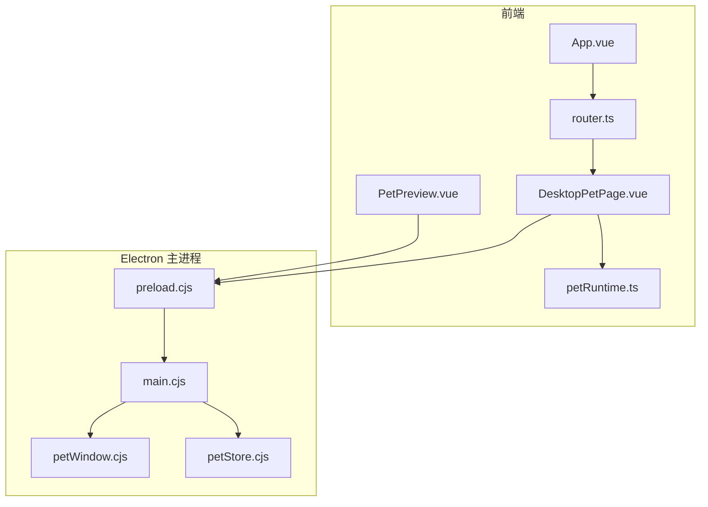
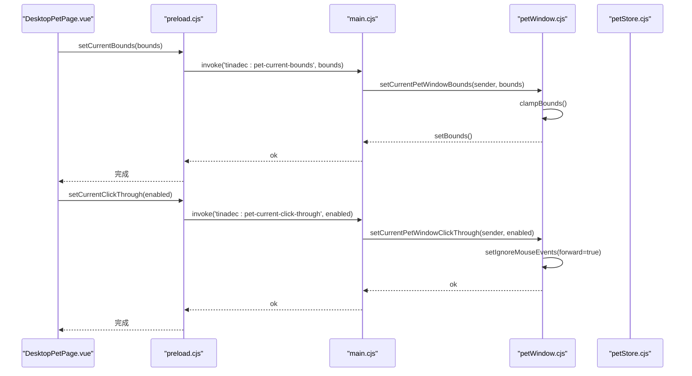
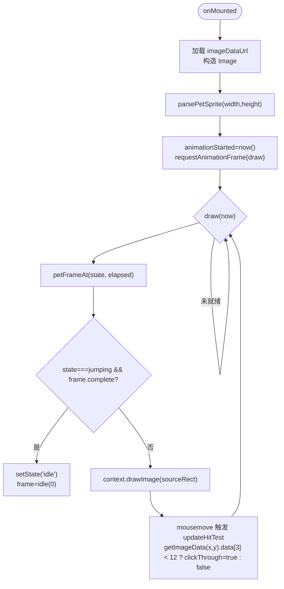
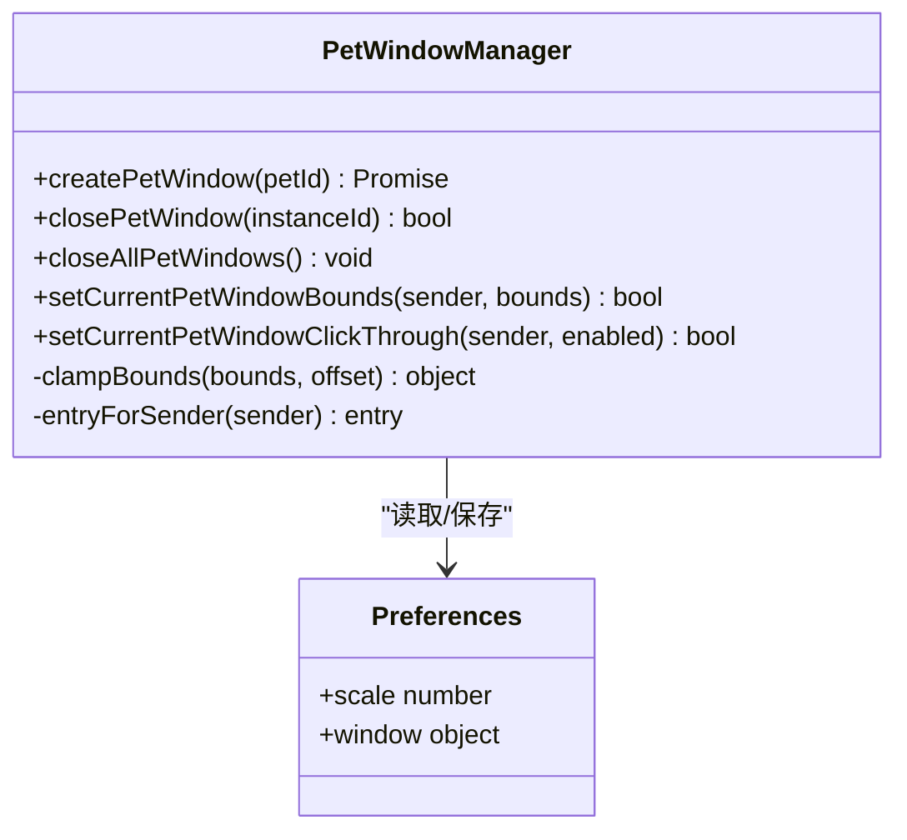
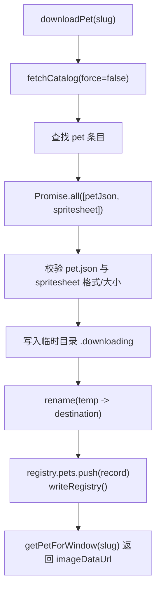
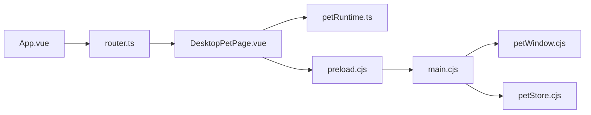

# 桌面宠物页面

<cite>
**本文引用的文件**   
- [DesktopPetPage.vue](file://apps/desktop/src/pages/DesktopPetPage.vue)
- [petRuntime.ts](file://apps/desktop/src/pets/petRuntime.ts)
- [petWindow.cjs](file://apps/desktop/electron/petWindow.cjs)
- [petStore.cjs](file://apps/desktop/electron/petStore.cjs)
- [preload.cjs](file://apps/desktop/electron/preload.cjs)
- [main.cjs](file://apps/desktop/electron/main.cjs)
- [router.ts](file://apps/desktop/src/router.ts)
- [App.vue](file://apps/desktop/src/App.vue)
- [PetPreview.vue](file://apps/desktop/src/components/PetPreview.vue)
- [windowLifecycle.test.ts](file://apps/desktop/src/windowLifecycle.test.ts)
- [petWindows.test.ts](file://apps/desktop/src/petWindows.test.ts)
</cite>

## 目录
1. [简介](#简介)
2. [项目结构](#项目结构)
3. [核心组件](#核心组件)
4. [架构总览](#架构总览)
5. [详细组件分析](#详细组件分析)
6. [依赖关系分析](#依赖关系分析)
7. [性能考量](#性能考量)
8. [故障排查指南](#故障排查指南)
9. [结论](#结论)
10. [附录](#附录)

## 简介
本文件面向桌面端“宠物”功能，系统性说明 DesktopPetPage 组件的渲染、动画与交互，以及 Electron 侧的窗口管理、持久化与状态同步。文档覆盖：
- 宠物运行时环境（Electron BrowserWindow）、生命周期管理与状态同步
- 宠物皮肤系统（精灵图/帧序列）与行为模式（idle、running、jumping 等）
- 个性化设置（缩放、窗口位置、点击穿透）
- 窗口管理（多实例、置顶、透明、尺寸约束）
- 性能优化（Canvas 渲染、像素对齐、节流保存、懒加载预览）

## 项目结构
桌面宠物由前端 Vue 页面与 Electron 主进程协同实现：
- 前端页面：DesktopPetPage.vue 负责 Canvas 绘制、动画循环、用户交互（拖拽移动、滚轮缩放、双击跳跃、点击穿透判定）
- 运行时库：petRuntime.ts 定义精灵图布局解析、帧计算与源矩形映射
- Electron 主进程：petWindow.cjs 创建并管理宠物窗口；petStore.cjs 负责下载、缓存、注册表与本地持久化
- IPC 桥接：preload.cjs 暴露 window.tinadec.pets API；main.cjs 注册 IPC 处理器并协调窗口事件
- 路由与入口：router.ts 将 /pet 路由到 DesktopPetPage；App.vue 识别宠物窗口并跳过后端连接流程

**图表来源**
- [DesktopPetPage.vue:1-297](file://apps/desktop/src/pages/DesktopPetPage.vue#L1-L297)
- [petRuntime.ts:1-63](file://apps/desktop/src/pets/petRuntime.ts#L1-L63)
- [petWindow.cjs:1-194](file://apps/desktop/electron/petWindow.cjs#L1-L194)
- [petStore.cjs:1-361](file://apps/desktop/electron/petStore.cjs#L1-L361)
- [preload.cjs:1-112](file://apps/desktop/electron/preload.cjs#L1-L112)
- [main.cjs:1-200](file://apps/desktop/electron/main.cjs#L1-L200)
- [router.ts:1-45](file://apps/desktop/src/router.ts#L1-L45)
- [App.vue:1-182](file://apps/desktop/src/App.vue#L1-L182)
- [PetPreview.vue:1-171](file://apps/desktop/src/components/PetPreview.vue#L1-L171)

**章节来源**
- [router.ts:1-45](file://apps/desktop/src/router.ts#L1-L45)
- [App.vue:1-182](file://apps/desktop/src/App.vue#L1-L182)

## 核心组件
- DesktopPetPage.vue：Canvas 渲染与交互的核心页面，驱动动画帧、处理拖拽/缩放/点击穿透、调用 window.tinadec.pets 更新窗口状态
- petRuntime.ts：精灵图网格与帧时序算法，提供 parsePetSprite、petFrameAt、petSourceRect
- petWindow.cjs：宠物窗口工厂与管理器，维护多实例、置顶、透明、尺寸边界、点击穿透
- petStore.cfg：宠物清单、下载、预览缓存、注册表读写、偏好设置持久化
- preload.cjs：IPC 桥接，向渲染进程暴露 pets API
- main.cjs：IPC 处理器注册、窗口事件广播、协议注册（tinadec-pet-preview）

**章节来源**
- [DesktopPetPage.vue:1-297](file://apps/desktop/src/pages/DesktopPetPage.vue#L1-L297)
- [petRuntime.ts:1-63](file://apps/desktop/src/pets/petRuntime.ts#L1-L63)
- [petWindow.cjs:1-194](file://apps/desktop/electron/petWindow.cjs#L1-L194)
- [petStore.cjs:1-361](file://apps/desktop/electron/petStore.cjs#L1-L361)
- [preload.cjs:1-112](file://apps/desktop/electron/preload.cjs#L1-L112)
- [main.cjs:1-200](file://apps/desktop/electron/main.cjs#L1-L200)

## 架构总览
桌面宠物采用“渲染进程 + 主进程”分离架构：
- 渲染进程通过 Canvas 绘制精灵图帧，使用 requestAnimationFrame 维持高帧率动画
- 主进程负责窗口创建、置顶、透明、尺寸约束、点击穿透控制与本地持久化
- 通过 preload 暴露的 tinadec.pets API 进行 IPC 通信，确保安全隔离

**图表来源**
- [DesktopPetPage.vue:74-90](file://apps/desktop/src/pages/DesktopPetPage.vue#L74-L90)
- [preload.cjs:16-36](file://apps/desktop/electron/preload.cjs#L16-L36)
- [main.cjs:152-169](file://apps/desktop/electron/main.cjs#L152-L169)
- [petWindow.cjs:159-172](file://apps/desktop/electron/petWindow.cjs#L159-L172)

**章节来源**
- [main.cjs:152-196](file://apps/desktop/electron/main.cjs#L152-L196)
- [petWindow.cjs:14-33](file://apps/desktop/electron/petWindow.cjs#L14-L33)

## 详细组件分析

### DesktopPetPage 组件分析
职责与特性：
- 使用 Canvas 绘制精灵图当前帧，按设备像素比调整画布尺寸，避免模糊
- 动画循环基于 requestAnimationFrame，根据 elapsedMs 计算当前帧列号
- 支持拖拽移动（pointer 事件），实时调用 setCurrentBounds 更新窗口位置
- 支持滚轮缩放与右下角拖拽手柄缩放，限制 scale 在 0.18~1.2 之间
- 双击触发跳跃动画（jumping），完成后自动回到 idle
- 鼠标移动时通过 getImageData 对像素透明度阈值判断，动态切换点击穿透（clickThrough）
- 卸载时取消动画帧并关闭点击穿透

**图表来源**
- [DesktopPetPage.vue:157-175](file://apps/desktop/src/pages/DesktopPetPage.vue#L157-L175)
- [DesktopPetPage.vue:34-72](file://apps/desktop/src/pages/DesktopPetPage.vue#L34-L72)
- [DesktopPetPage.vue:80-90](file://apps/desktop/src/pages/DesktopPetPage.vue#L80-L90)
- [petRuntime.ts:34-53](file://apps/desktop/src/pets/petRuntime.ts#L34-L53)

**章节来源**
- [DesktopPetPage.vue:1-297](file://apps/desktop/src/pages/DesktopPetPage.vue#L1-L297)

### 宠物运行时库（petRuntime.ts）
- 常量：PETDEX_COLUMNS=8，基础帧宽高 192x208，帧宽高比固定
- PET_STATES：定义各状态的行号、帧数、时长（毫秒）
- parsePetSprite：校验精灵图尺寸，计算 columns、rows、frameWidth、frameHeight
- petFrameAt：根据 elapsedMs 计算 column，返回 row、column、complete
- petSourceRect：根据 layout 与 frame 计算 source 矩形

复杂度与性能：
- 每帧 O(1) 计算，无额外分配
- 严格整数校验，避免非法精灵图导致异常

**章节来源**
- [petRuntime.ts:1-63](file://apps/desktop/src/pets/petRuntime.ts#L1-L63)

### Electron 窗口管理（petWindow.cjs）
- createPetWindow：检查重复实例，读取偏好，clampBounds 约束尺寸与位置，创建透明、置顶、无边框窗口
- 事件监听 move/resize 延迟保存偏好（防抖 150ms）
- close/closeAll/closeCurrent：清理 Map、关闭窗口、禁用宠物并广播变更
- setCurrentPetWindowBounds：合并当前 bounds 与输入，clamp 后 setBounds
- setCurrentPetWindowClickThrough：setIgnoreMouseEvents(forward=true) 实现点击穿透

**图表来源**
- [petWindow.cjs:41-110](file://apps/desktop/electron/petWindow.cjs#L41-L110)
- [petWindow.cjs:159-172](file://apps/desktop/electron/petWindow.cjs#L159-L172)

**章节来源**
- [petWindow.cjs:1-194](file://apps/desktop/electron/petWindow.cjs#L1-L194)

### 宠物存储与下载（petStore.cjs）
- 清单与缓存：从 petdex.dev 拉取 manifest，缓存 5 分钟；spritesheet/webp/png 校验与大小限制
- 预览缓存：内存 LRU 式缓存，限制最大字节数，去重请求
- 下载流程：并行获取 pet.json 与 spritesheet，写入临时目录，原子重命名，写入 registry.json
- 注册表：listDownloaded/getPetForWindow 返回 imageDataUrl（base64 data URI）
- 偏好设置：scale 范围 0.18~1.2，window 坐标与尺寸四舍五入并持久化

**图表来源**
- [petStore.cjs:229-277](file://apps/desktop/electron/petStore.cjs#L229-L277)
- [petStore.cjs:115-129](file://apps/desktop/electron/petStore.cjs#L115-L129)
- [petStore.cjs:151-174](file://apps/desktop/electron/petStore.cjs#L151-L174)

**章节来源**
- [petStore.cjs:1-361](file://apps/desktop/electron/petStore.cjs#L1-L361)

### IPC 桥接与路由（preload.cjs、main.cjs、router.ts、App.vue）
- preload.cjs：暴露 window.tinadec.pets.create/list/download/setEnabled/openFolder/remove 等 API
- main.cjs：注册 tinadec:* IPC 处理器，处理宠物窗口创建/关闭/列表/偏好/启用等；注册 tinadec-pet-preview 自定义协议
- router.ts：/pet 路由指向 DesktopPetPage
- App.vue：检测 isPetWindow（hash 以 #/pet 开头），跳过后端连接与通知同步，直接渲染 RouterView

**章节来源**
- [preload.cjs:16-36](file://apps/desktop/electron/preload.cjs#L16-L36)
- [main.cjs:152-196](file://apps/desktop/electron/main.cjs#L152-L196)
- [router.ts:36-40](file://apps/desktop/src/router.ts#L36-L40)
- [App.vue:36-76](file://apps/desktop/src/App.vue#L36-L76)

### 宠物预览组件（PetPreview.vue）
- 懒加载：IntersectionObserver 进入视口才加载图片
- 骨架屏与旋转加载器：提升感知性能
- 失败重试：超时 20s 标记失败，提供重试按钮
- 稳定占位：aspect-ratio 保持 192/208 比例，避免抖动

**章节来源**
- [PetPreview.vue:1-171](file://apps/desktop/src/components/PetPreview.vue#L1-L171)

## 依赖关系分析
- DesktopPetPage 依赖 petRuntime 进行帧计算与源矩形映射
- DesktopPetPage 通过 window.tinadec.pets 调用 preload 暴露的 IPC API
- main.cjs 作为 IPC 中枢，转发至 petWindow.cjs 与 petStore.cjs
- petWindow.cjs 依赖 petStore.cjs 读取偏好与宠物数据
- App.vue 与 router.ts 决定宠物窗口是否跳过应用初始化流程

**图表来源**
- [DesktopPetPage.vue:1-297](file://apps/desktop/src/pages/DesktopPetPage.vue#L1-L297)
- [petRuntime.ts:1-63](file://apps/desktop/src/pets/petRuntime.ts#L1-L63)
- [preload.cjs:16-36](file://apps/desktop/electron/preload.cjs#L16-L36)
- [main.cjs:152-196](file://apps/desktop/electron/main.cjs#L152-L196)
- [petWindow.cjs:1-194](file://apps/desktop/electron/petWindow.cjs#L1-L194)
- [petStore.cjs:1-361](file://apps/desktop/electron/petStore.cjs#L1-L361)
- [App.vue:36-76](file://apps/desktop/src/App.vue#L36-L76)
- [router.ts:36-40](file://apps/desktop/src/router.ts#L36-L40)

**章节来源**
- [petWindows.test.ts:13-55](file://apps/desktop/src/petWindows.test.ts#L13-L55)
- [windowLifecycle.test.ts:10-36](file://apps/desktop/src/windowLifecycle.test.ts#L10-L36)

## 性能考量
- Canvas 渲染：
  - 使用 devicePixelRatio 适配高分屏，避免模糊
  - willReadFrequently 提示频繁读取像素，优化 getImageData 路径
  - imageSmoothingEnabled=false 保证像素风格清晰
- 动画循环：
  - requestAnimationFrame 保证与屏幕刷新同步，减少掉帧
  - 仅在 loaded 且 image/layout 就绪时启动 draw
- 窗口操作：
  - move/resize 事件使用 setTimeout 防抖 150ms 保存偏好，降低磁盘 IO
  - clampBounds 限制最小/最大尺寸与屏幕工作区，避免越界
- 资源加载：
  - 预览缓存 LRU，限制内存占用
  - 下载过程并行请求，临时目录原子替换，避免脏数据
- 点击穿透：
  - 基于像素透明度阈值快速判定，避免不必要的 UI 层拦截

[本节为通用指导，不直接分析具体文件]

## 故障排查指南
- 宠物无法显示或闪烁：
  - 检查 imageDataUrl 是否正确加载，image.onerror 会关闭点击穿透
  - 确认 parsePetSprite 抛出无效尺寸错误时的处理分支
- 拖拽/缩放无效：
  - 确认 pointer 事件捕获与 dragStart/resizeStart 状态重置
  - 检查 setCurrentBounds 传入的 width/height/scale 是否在允许范围
- 点击穿透失效：
  - 确认 hasRenderedFrame 已为 true 且 getImageData 返回值 alpha < 12
  - 检查 setIgnoreMouseEvents(forward=true) 是否生效
- 下载失败或预览卡住：
  - 查看 fetchTrusted 的超时与重定向限制
  - 校验 spritesheet 头信息（PNG/WebP）与大小限制
- 窗口位置异常：
  - 检查 clampBounds 的工作区计算与默认偏移
  - 确认 savePetPreferences 是否成功持久化 window 坐标

**章节来源**
- [DesktopPetPage.vue:157-180](file://apps/desktop/src/pages/DesktopPetPage.vue#L157-L180)
- [petStore.cjs:45-87](file://apps/desktop/electron/petStore.cjs#L45-L87)
- [petWindow.cjs:14-33](file://apps/desktop/electron/petWindow.cjs#L14-L33)

## 结论
桌面宠物功能通过 Canvas 高性能渲染与 Electron 窗口管理能力，实现了流畅、可交互、可定制的宠物体验。其架构清晰、职责分明：
- 前端专注渲染与交互，运行时库提供稳定的帧计算
- 主进程负责窗口与持久化，保障安全与稳定性
- IPC 桥接简化跨进程通信，便于扩展与维护
建议后续优化方向：
- 增加更多行为模式与动画组合
- 引入更细粒度的性能监控（FPS、内存峰值）
- 扩展皮肤系统与主题配置，支持用户自定义

[本节为总结性内容，不直接分析具体文件]

## 附录
- 关键 API 速查：
  - window.tinadec.pets.getCurrent/setCurrentBounds/setCurrentClickThrough/closeCurrent
  - petRuntime.parsePetSprite/petFrameAt/petSourceRect
  - petWindow.createPetWindow/clampBounds/setIgnoreMouseEvents
  - petStore.downloadPet/fetchCatalog/savePetPreferences/getPetForWindow

[本节为补充信息，不直接分析具体文件]