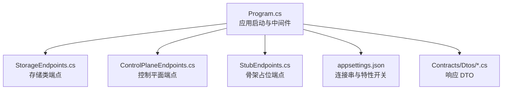
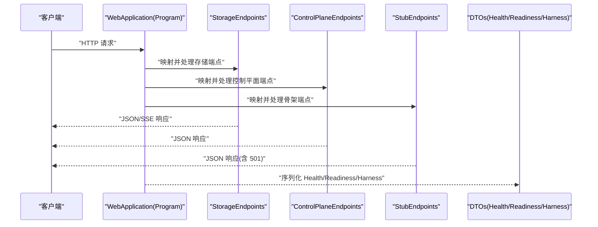
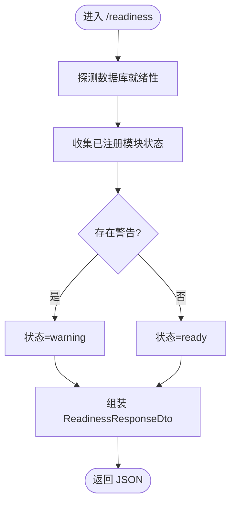
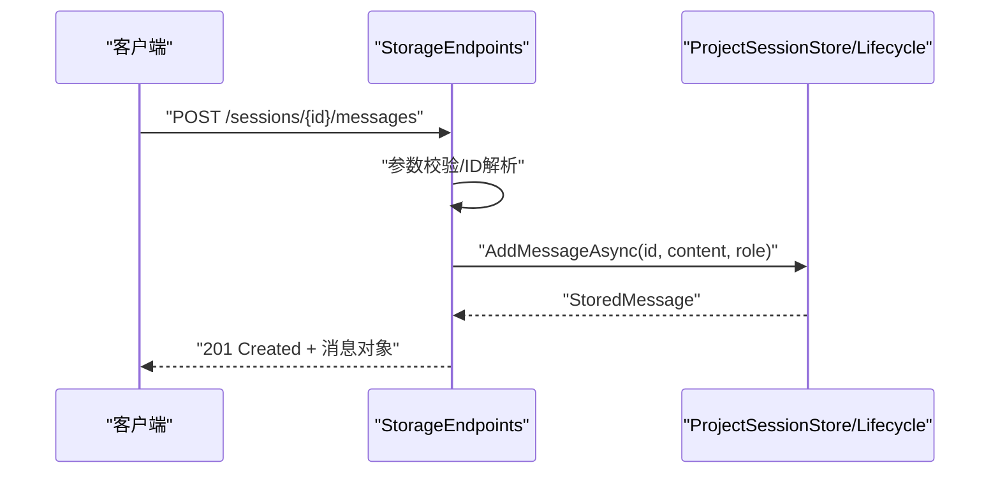
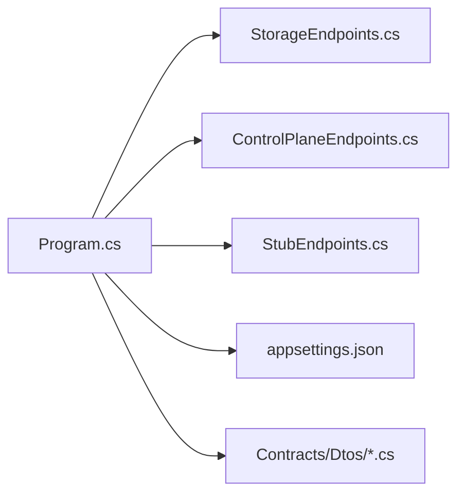

# API 文档设置

<cite>
**本文引用的文件**   
- [Program.cs](file://TinadecCore\Api\Program.cs)
- [appsettings.json](file://TinadecCore\Api\appsettings.json)
- [ControlPlaneEndpoints.cs](file://TinadecCore\Api\Endpoints\ControlPlaneEndpoints.cs)
- [StorageEndpoints.cs](file://TinadecCore\Api\Endpoints\StorageEndpoints.cs)
- [StubEndpoints.cs](file://TinadecCore\Api\Endpoints\StubEndpoints.cs)
- [HealthResponseDto.cs](file://TinadecCore\Contracts\Dtos\HealthResponseDto.cs)
- [ReadinessResponseDto.cs](file://TinadecCore\Contracts\Dtos\ReadinessResponseDto.cs)
- [HarnessManifestDto.cs](file://TinadecCore\Contracts\Dtos\HarnessManifestDto.cs)
</cite>

## 目录
1. [简介](#简介)
2. [项目结构](#项目结构)
3. [核心组件](#核心组件)
4. [架构总览](#架构总览)
5. [详细组件分析](#详细组件分析)
6. [依赖关系分析](#依赖关系分析)
7. [性能考虑](#性能考虑)
8. [故障排查指南](#故障排查指南)
9. [结论](#结论)
10. [附录](#附录)

## 简介
本模块为 API 文档与在线调试能力提供基础支撑。当前实现以 ASP.NET Core Minimal API 为主，提供健康检查、就绪性探测、系统清单与存储/控制面端点。文档目标包括：
- 内置 API 文档浏览器的功能说明（Swagger/OpenAPI 在线查看与测试）
- API 端点的分类导航、搜索过滤与参数说明
- 交互式 API 测试（请求构建、响应查看、错误调试）
- API 版本管理、变更日志与迁移指南
- 使用统计、调用频率与性能监控
- 客户端生成、SDK 下载与集成示例
- 认证配置、安全策略与访问控制

注意：仓库中未包含 Swagger/OpenAPI 中间件或 UI 的显式配置代码。本节提供基于现有端点的“如何启用与配置”的实践指引，确保在不侵入业务逻辑的前提下完成文档化与交互测试。

## 项目结构
API 服务由 Program 启动，注册持久化与核心模块，随后挂载三类端点：
- 健康与就绪性端点（/api/v1/health, /api/v1/readiness）
- 存储相关端点（项目、会话、消息、运行事件等）
- 控制平面端点（模型提供者、路由、提示词片段、代理、审批等）
- 骨架占位端点（用于兼容前端/Gateway 的只读或返回 501 的接口）

图表来源 
- [Program.cs:10-40](file://TinadecCore\Api\Program.cs#L10-L40)
- [StorageEndpoints.cs:11-93](file://TinadecCore\Api\Endpoints\StorageEndpoints.cs#L11-L93)
- [ControlPlaneEndpoints.cs:8-44](file://TinadecCore\Api\Endpoints\ControlPlaneEndpoints.cs#L8-L44)
- [StubEndpoints.cs:15-24](file://TinadecCore\Api\Endpoints\StubEndpoints.cs#L15-L24)
- [appsettings.json:1-31](file://TinadecCore\Api\appsettings.json#L1-L31)

章节来源
- [Program.cs:10-175](file://TinadecCore\Api\Program.cs#L10-L175)
- [appsettings.json:1-31](file://TinadecCore\Api\appsettings.json#L1-L31)

## 核心组件
- 健康检查与健康响应 DTO
  - GET /api/v1/health 返回名称、状态、版本与时间戳，便于外部探针与负载均衡器校验。
- 就绪性探测与框架信息
  - GET /api/v1/readiness 返回框架就绪状态、存储就绪状态与各模块注册状态，支持 warning/ready 两级。
- 系统清单（Harness Manifest）
  - GET /api/v1/harness/manifest 返回运行时、工具注册摘要、Agent 分层、工具提供者、设计说明与模块描述。
- 存储端点
  - 项目、会话、消息、运行与事件回放（SSE），提供 CRUD 与流式事件读取。
- 控制平面端点
  - 模型提供者模板与实例、路由、提示词片段、代理、审批等。
- 骨架端点
  - 面向 Gateway/BFF 的只读或返回 501 的占位接口，保证前端可稳定消费。

章节来源
- [Program.cs:44-117](file://TinadecCore\Api\Program.cs#L44-L117)
- [Program.cs:122-164](file://TinadecCore\Api\Program.cs#L122-L164)
- [StorageEndpoints.cs:11-93](file://TinadecCore\Api\Endpoints\StorageEndpoints.cs#L11-L93)
- [ControlPlaneEndpoints.cs:8-44](file://TinadecCore\Api\Endpoints\ControlPlaneEndpoints.cs#L8-L44)
- [StubEndpoints.cs:15-24](file://TinadecCore\Api\Endpoints\StubEndpoints.cs#L15-L24)
- [HealthResponseDto.cs:1-13](file://TinadecCore\Contracts\Dtos\HealthResponseDto.cs#L1-L13)
- [ReadinessResponseDto.cs:1-32](file://TinadecCore\Contracts\Dtos\ReadinessResponseDto.cs#L1-L32)
- [HarnessManifestDto.cs:1-53](file://TinadecCore\Contracts\Dtos\HarnessManifestDto.cs#L1-L53)

## 架构总览
下图展示从 HTTP 请求到响应 DTO 的端到端路径，以及关键中间件与配置的作用点。

图表来源 
- [Program.cs:10-40](file://TinadecCore\Api\Program.cs#L10-L40)
- [StorageEndpoints.cs:11-93](file://TinadecCore\Api\Endpoints\StorageEndpoints.cs#L11-L93)
- [ControlPlaneEndpoints.cs:8-44](file://TinadecCore\Api\Endpoints\ControlPlaneEndpoints.cs#L8-L44)
- [StubEndpoints.cs:15-24](file://TinadecCore\Api\Endpoints\StubEndpoints.cs#L15-L24)
- [HealthResponseDto.cs:1-13](file://TinadecCore\Contracts\Dtos\HealthResponseDto.cs#L1-L13)
- [ReadinessResponseDto.cs:1-32](file://TinadecCore\Contracts\Dtos\ReadinessResponseDto.cs#L1-L32)
- [HarnessManifestDto.cs:1-53](file://TinadecCore\Contracts\Dtos\HarnessManifestDto.cs#L1-L53)

## 详细组件分析

### 健康与就绪性端点
- GET /api/v1/health
  - 用途：服务存活与健康状态
  - 响应字段：name、status、version、time
- GET /api/v1/readiness
  - 用途：服务就绪性与模块/存储状态
  - 响应字段：status、frameworkReady、frameworkName、frameworkVersion、storage、modules

图表来源 
- [Program.cs:122-164](file://TinadecCore\Api\Program.cs#L122-L164)
- [ReadinessResponseDto.cs:1-32](file://TinadecCore\Contracts\Dtos\ReadinessResponseDto.cs#L1-L32)

章节来源
- [Program.cs:44-53](file://TinadecCore\Api\Program.cs#L44-L53)
- [Program.cs:122-164](file://TinadecCore\Api\Program.cs#L122-L164)
- [HealthResponseDto.cs:1-13](file://TinadecCore\Contracts\Dtos\HealthResponseDto.cs#L1-L13)
- [ReadinessResponseDto.cs:1-32](file://TinadecCore\Contracts\Dtos\ReadinessResponseDto.cs#L1-L32)

### 系统清单（Harness Manifest）
- GET /api/v1/harness/manifest
  - 用途：对外暴露运行时、工具注册摘要、Agent 分层、工具提供者、设计说明与模块描述
  - 关键字段：runtime、ownershipModel、toolRegistry、agentLayers、toolProviders、tools、designNotes、framework、modules

章节来源
- [Program.cs:58-117](file://TinadecCore\Api\Program.cs#L58-L117)
- [HarnessManifestDto.cs:1-53](file://TinadecCore\Contracts\Dtos\HarnessManifestDto.cs#L1-L53)

### 存储端点（项目/会话/消息/运行/事件）
- 项目
  - GET /api/v1/projects
  - POST /api/v1/projects
- 会话
  - GET /api/v1/sessions?projectId|project_id
  - POST /api/v1/sessions
  - PATCH /api/v1/sessions/{sessionId}
  - GET /api/v1/sessions/{sessionId}/messages
  - POST /api/v1/sessions/{sessionId}/messages
  - GET /api/v1/sessions/{sessionId}/runs
- 事件回放（SSE）
  - GET /api/v1/events?sessionId|session_id&afterSeq|after_seq

图表来源 
- [StorageEndpoints.cs:63-69](file://TinadecCore\Api\Endpoints\StorageEndpoints.cs#L63-L69)

章节来源
- [StorageEndpoints.cs:11-93](file://TinadecCore\Api\Endpoints\StorageEndpoints.cs#L11-L93)

### 控制平面端点（模型/提示词/代理/审批）
- 模型提供者与路由
  - GET/POST/PUT/DELETE /api/v1/model-providers
  - GET /api/v1/model-provider-templates
  - GET /api/v1/model-routes
  - PUT /api/v1/model-routes/{purpose}
  - GET/PUT /api/v1/model-settings（部分能力返回 501）
- 提示词片段
  - GET/POST/PUT/DELETE /api/v1/prompt-fragments
  - 克隆/版本/回滚/信号/对比（部分能力返回 501）
- 代理与模式
  - GET/PUT /api/v1/agents
  - GET /api/v1/agent-modes
  - GET /api/v1/agent-candidates
- 审批
  - GET/POST /api/v1/approvals
  - POST /api/v1/approvals/{id}/decision

章节来源
- [ControlPlaneEndpoints.cs:8-44](file://TinadecCore\Api\Endpoints\ControlPlaneEndpoints.cs#L8-L44)

### 骨架端点（兼容层）
- 诊断与就绪性（doctor、model-readiness、tool-layer-readiness）
- 会话编排与工具执行（只读或 501）
- 市场与扩展（只读或 501）
- MCP/ACP（只读或 501）
- 调试（traces、spans、metrics、snapshot、diagnostics、breakpoints）

章节来源
- [StubEndpoints.cs:15-242](file://TinadecCore\Api\Endpoints\StubEndpoints.cs#L15-L242)

## 依赖关系分析
- Program 负责：
  - 配置 JSON 序列化策略（snake_case、忽略 null）
  - 注册持久化与核心模块
  - 启动迁移与生命周期协调
  - 挂载三类端点
- appsettings.json 提供：
  - 日志级别与允许主机
  - 连接字符串与存储提供者选择（SQLite/PostgreSQL）
  - 开发身份开关与租户/工作区标识

图表来源 
- [Program.cs:10-40](file://TinadecCore\Api\Program.cs#L10-L40)
- [appsettings.json:1-31](file://TinadecCore\Api\appsettings.json#L1-L31)

章节来源
- [Program.cs:10-40](file://TinadecCore\Api\Program.cs#L10-L40)
- [appsettings.json:1-31](file://TinadecCore\Api\appsettings.json#L1-L31)

## 性能考虑
- JSON 序列化
  - 统一 snake_case 命名与忽略 null，减少负载体积与下游解析成本。
- 事件回放（SSE）
  - 服务端逐条写入事件，适合长连接消费；建议客户端合理分页 with afterSeq 避免全量拉取。
- 存储与就绪性探测
  - readiness 会探测数据库与模块状态，生产环境应缓存结果或降低探测频率。
- 骨架端点
  - 大量 501 响应可减少无效调用开销，但需在前端做好降级与重试策略。

[本节为通用指导，不直接分析具体文件]

## 故障排查指南
- 常见错误码与场景
  - 400 Bad Request：参数校验失败（如无效的 projectId/sessionId）
  - 404 Not Found：资源不存在（会话/项目/追踪等）
  - 409 Conflict：重复创建冲突（如重复项目根）
  - 501 Not Implemented：骨架端点未实现的能力（如 shell 执行、模拟、扩展安装等）
- 快速定位
  - 先调用 /api/v1/health 与 /api/v1/readiness 确认服务状态与存储可用性
  - 通过 /api/v1/debug/* 获取跟踪与指标（骨架模式下多为空数据）
  - 关注 SSE 事件流的 event 与 data 字段，定位异常事件类型

章节来源
- [StorageEndpoints.cs:27-90](file://TinadecCore\Api\Endpoints\StorageEndpoints.cs#L27-L90)
- [StubEndpoints.cs:100-240](file://TinadecCore\Api\Endpoints\StubEndpoints.cs#L100-L240)

## 结论
当前 API 服务提供了稳定的健康检查、就绪性探测、系统清单与存储/控制面端点，并通过骨架端点保障前后端解耦与渐进式实现。为完善“API 文档设置”，建议在保持现有端点不变的前提下，引入 OpenAPI/Swagger 中间件与 UI，结合现有 DTO 自动生成文档与在线测试能力，同时补充认证与安全策略、统计与监控、版本管理与迁移指南。

[本节为总结性内容，不直接分析具体文件]

## 附录

### 如何启用内置 API 文档浏览器（Swagger/OpenAPI）
- 目标
  - 在现有 Minimal API 基础上启用 OpenAPI 文档与交互式 UI，无需改动业务端点。
- 步骤概览
  - 添加 OpenAPI 包与中间件
  - 在 Program 中注册并映射 OpenAPI 文档与 UI
  - 指定文档元数据（标题、版本、描述、许可证等）
  - 可选：启用安全方案（如 Bearer/JWT）以便在线鉴权测试
- 注意事项
  - 保持 JSON 序列化策略一致（snake_case）
  - 对返回 501 的骨架端点，可在文档中标注“暂不可用”
  - 将 /api/v1/events 的 SSE 行为在文档中明确标注

[本节为实践指引，不直接分析具体文件]

### API 端点分类导航与搜索过滤
- 分类建议
  - 健康与就绪性：/api/v1/health、/api/v1/readiness
  - 系统清单：/api/v1/harness/manifest
  - 存储：/api/v1/projects、/api/v1/sessions、/api/v1/sessions/{id}/messages、/api/v1/events
  - 控制平面：/api/v1/model-*、/api/v1/prompt-fragments、/api/v1/agents、/api/v1/approvals
  - 骨架：/api/v1/debug、/api/v1/market、/api/v1/extensions、/api/v1/mcp、/api/v1/acp
- 搜索与过滤
  - 按路径前缀分组（/api/v1/*）
  - 按方法筛选（GET/POST/PUT/DELETE/PATCH）
  - 按标签（健康、存储、控制面、骨架）
  - 关键字匹配（如 “events”、“providers”、“agents”）

[本节为概念性说明，不直接分析具体文件]

### 交互式 API 测试（请求构建、响应查看、错误调试）
- 请求构建
  - 自动填充路径参数与查询参数
  - 根据 DTO 生成请求体模板（snake_case）
- 响应查看
  - 格式化 JSON 输出
  - 高亮错误码与消息
- 错误调试
  - 记录请求/响应头与时间戳
  - 针对 501 骨架端点给出“能力未启用”提示
  - 对 SSE 事件流进行分段展示与回放

[本节为概念性说明，不直接分析具体文件]

### API 版本管理、变更日志与迁移指南
- 版本策略
  - 当前所有端点均位于 /api/v1/*，便于后续演进至 v2
- 变更日志
  - 新增/废弃/破坏性变更需在文档中显著标注
- 迁移指南
  - 提供旧版到新版的字段映射与示例
  - 对 501 能力逐步上线时，更新文档状态

[本节为概念性说明，不直接分析具体文件]

### 使用统计、调用频率与性能监控
- 建议采集
  - 请求计数、延迟分布、错误率、SSE 连接数
  - 存储读写吞吐与事件回放速率
- 可视化
  - 仪表盘展示热点端点与慢请求
  - 告警阈值（错误率、延迟、连接数）

[本节为概念性说明，不直接分析具体文件]

### API 客户端生成、SDK 下载与集成示例
- 生成方式
  - 基于 OpenAPI 规范生成多语言 SDK（C#/TypeScript/Python 等）
- 集成要点
  - 统一 base_url 与超时配置
  - 处理 snake_case 字段与 501 响应
  - 对 SSE 事件流提供专用客户端

[本节为概念性说明，不直接分析具体文件]

### 认证配置、安全策略与访问控制
- 开发模式
  - appsettings.json 中 EnableDevelopmentIdentity 可用于本地调试
- 生产建议
  - 启用 JWT/OAuth2，配置网关级鉴权
  - 限制敏感端点（如 approvals、debug）访问范围
  - 对 SSE 与写操作增加限流与审计

章节来源
- [appsettings.json:23-29](file://TinadecCore\Api\appsettings.json#L23-L29)