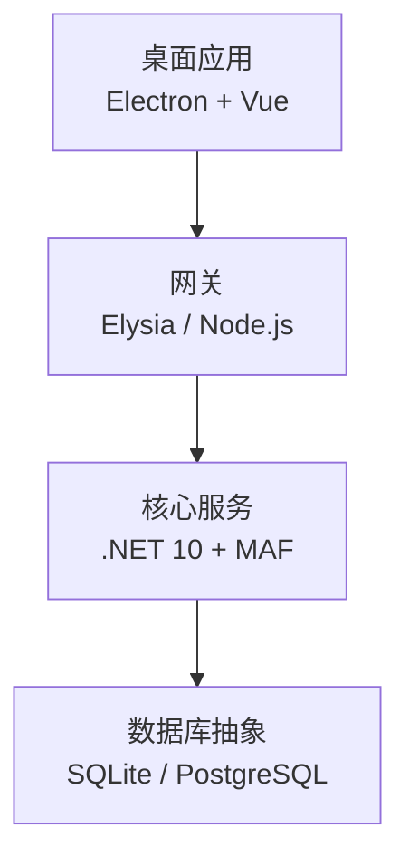
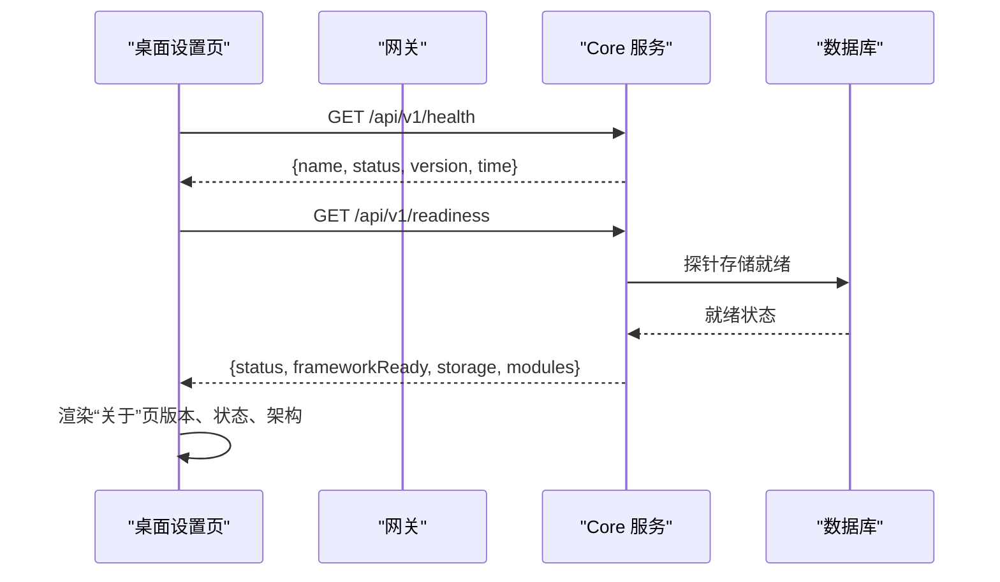
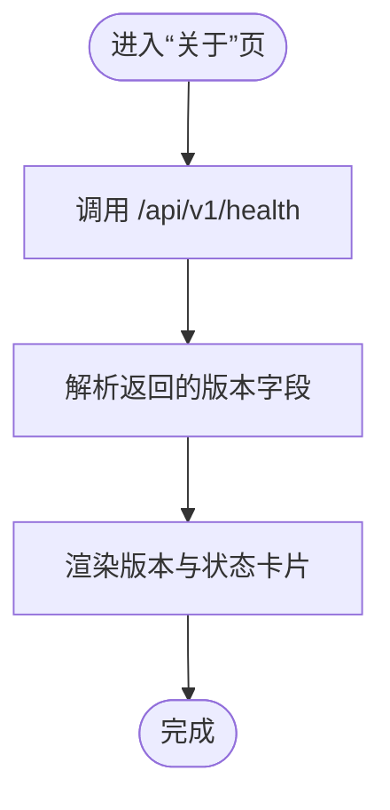
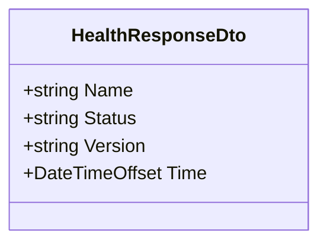
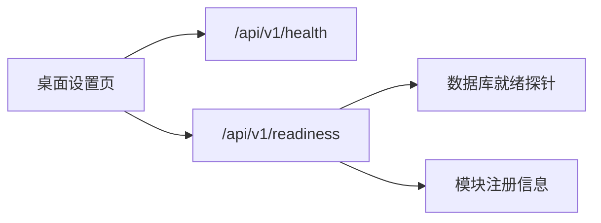

# 关于设置

<cite>
**本文引用的文件**   
- [README.md](file://README.md)
- [package.json](file://package.json)
- [Program.cs](file://TinadecCore/Api/Program.cs)
- [HealthResponseDto.cs](file://TinadecCore/Contracts/Dtos/HealthResponseDto.cs)
- [SettingsPage.vue](file://apps/desktop/src/pages/SettingsPage.vue)
</cite>

## 目录
1. [简介](#简介)
2. [项目结构](#项目结构)
3. [核心组件](#核心组件)
4. [架构总览](#架构总览)
5. [详细组件分析](#详细组件分析)
6. [依赖关系分析](#依赖关系分析)
7. [性能考量](#性能考量)
8. [故障排除指南](#故障排除指南)
9. [结论](#结论)
10. [附录](#附录)

## 简介
本“关于设置”文档聚焦于应用版本信息展示、系统健康检查、依赖项清单、许可证与开源协议、反馈与支持渠道，以及性能基准、内存统计与错误日志收集等运维与诊断能力。内容基于代码仓库中的前端设置页、后端健康与就绪接口、以及根级配置与说明文件进行整理，确保读者能够准确理解当前实现与使用方式。

## 项目结构
- Desktop（Electron + Vue 3）：提供“设置”页面，包含“关于”子页，用于展示版本、运行状态与架构概览。
- Gateway（Elysia + TypeScript）：作为薄 BFF/代理，暴露 API 文档端点。
- Core（.NET 10 + ASP.NET Core + MAF）：唯一状态权威，提供健康检查、就绪检测与模块清单等接口。

**图表来源** 
- [README.md:17-43](file://README.md#L17-L43)

**章节来源**
- [README.md:17-43](file://README.md#L17-L43)

## 核心组件
- 版本信息与构建信息
  - 桌面应用版本在“关于”页中显示为 v0.1.0。
  - Core 健康接口返回版本号字段，便于前端统一展示。
- 系统健康检查
  - Core 提供 /api/v1/health 与 /api/v1/readiness 两个关键端点，分别用于基础健康与就绪性探测。
  - 前端“关于”页会调用健康接口并展示 Core 与 Gateway 的运行状态。
- 依赖项清单
  - 根 package.json 声明工作区与脚本；Gateway 的依赖由各自包管理文件维护。
- 许可证与开源协议
  - 根 package.json 与 README 均声明 GPL-3.0-or-later。
- 反馈与支持资源
  - “关于”页提供 GitHub 链接与 API 文档入口。
- 性能基准、内存统计与错误日志
  - 当前仓库未内置专用基准测试或内存统计工具；建议通过外部监控与日志采集方案补充。

**章节来源**
- [SettingsPage.vue:3544-3648](file://apps/desktop/src/pages/SettingsPage.vue#L3544-L3648)
- [Program.cs:44-53](file://TinadecCore/Api/Program.cs#L44-L53)
- [Program.cs:122-164](file://TinadecCore/Api/Program.cs#L122-L164)
- [package.json:1-36](file://package.json#L1-L36)
- [README.md:117-120](file://README.md#L117-L120)

## 架构总览
下图展示了“关于设置”相关的数据流：前端从 Core 获取健康与就绪信息，并在“关于”页呈现版本与状态。

**图表来源** 
- [Program.cs:44-53](file://TinadecCore/Api/Program.cs#L44-L53)
- [Program.cs:122-164](file://TinadecCore/Api/Program.cs#L122-L164)
- [SettingsPage.vue:366-382](file://apps/desktop/src/pages/SettingsPage.vue#L366-L382)

## 详细组件分析

### 版本信息展示
- 桌面“关于”页展示应用名称、版本号与架构分层（Desktop/Gateway/Core），并提供 GitHub 与 API 文档入口。
- Core 健康接口返回固定版本号，便于前端统一读取。
- 根 package.json 的 name 与 version 字段定义工作区元数据。

**图表来源** 
- [SettingsPage.vue:3544-3648](file://apps/desktop/src/pages/SettingsPage.vue#L3544-L3648)
- [Program.cs:44-53](file://TinadecCore/Api/Program.cs#L44-L53)
- [package.json:1-10](file://package.json#L1-L10)

**章节来源**
- [SettingsPage.vue:3544-3648](file://apps/desktop/src/pages/SettingsPage.vue#L3544-L3648)
- [Program.cs:44-53](file://TinadecCore/Api/Program.cs#L44-L53)
- [package.json:1-10](file://package.json#L1-L10)

### 系统健康检查功能
- Core 健康端点返回 name、status、version、time，兼容旧版契约。
- 就绪端点聚合框架就绪、存储就绪与模块注册状态，输出 warning 或 ready。
- 前端“关于”页对 Core 与 Gateway 状态进行可视化展示。

**图表来源** 
- [HealthResponseDto.cs:1-13](file://TinadecCore/Contracts/Dtos/HealthResponseDto.cs#L1-L13)

**章节来源**
- [Program.cs:44-53](file://TinadecCore/Api/Program.cs#L44-L53)
- [Program.cs:122-164](file://TinadecCore/Api/Program.cs#L122-L164)
- [SettingsPage.vue:366-382](file://apps/desktop/src/pages/SettingsPage.vue#L366-L382)

### 依赖项清单
- 根 package.json 定义了工作区、脚本与开发依赖。
- Gateway 的依赖由其自身包管理文件维护（不在本文直接列出）。
- .NET 解决方案与 Core 模块依赖由 .csproj 与包管理器维护（不在本文直接列出）。

**章节来源**
- [package.json:1-36](file://package.json#L1-L36)

### 许可证信息与开源协议
- 根 package.json 与 README 均声明 GPL-3.0-or-later。
- “关于”页底部显示版权与许可证标识。

**章节来源**
- [package.json:1-10](file://package.json#L1-L10)
- [README.md:117-120](file://README.md#L117-L120)
- [SettingsPage.vue:3647-3648](file://apps/desktop/src/pages/SettingsPage.vue#L3647-L3648)

### 反馈渠道与支持资源
- “关于”页提供 GitHub 仓库链接与 API 文档入口（通过 Gateway 的 /docs）。
- 用户可通过 GitHub Issues 提交问题与功能请求。

**章节来源**
- [SettingsPage.vue:3637-3645](file://apps/desktop/src/pages/SettingsPage.vue#L3637-L3645)
- [README.md:56-58](file://README.md#L56-L58)

### 性能基准测试结果、内存使用统计与错误日志收集
- 当前仓库未内置专用的性能基准测试、内存统计或集中式错误日志收集工具。
- 建议结合外部监控（如进程指标、APM、日志采集）与 CI/CD 中的压测脚本进行补充。

[本节为通用指导，不直接分析具体文件]

## 依赖关系分析
- 前端“关于”页依赖 Core 的健康与就绪接口，以展示运行时状态。
- Core 的健康与就绪端点依赖数据库就绪探针与模块注册信息。
- 根 package.json 协调多工作区的开发与构建流程。

**图表来源** 
- [Program.cs:44-53](file://TinadecCore/Api/Program.cs#L44-L53)
- [Program.cs:122-164](file://TinadecCore/Api/Program.cs#L122-L164)
- [SettingsPage.vue:366-382](file://apps/desktop/src/pages/SettingsPage.vue#L366-L382)

**章节来源**
- [Program.cs:44-53](file://TinadecCore/Api/Program.cs#L44-L53)
- [Program.cs:122-164](file://TinadecCore/Api/Program.cs#L122-L164)
- [SettingsPage.vue:366-382](file://apps/desktop/src/pages/SettingsPage.vue#L366-L382)

## 性能考量
- 健康与就绪接口为轻量查询，适合高频轮询；建议在客户端侧控制刷新频率。
- 数据库就绪探针应避免阻塞启动路径，必要时采用异步与超时保护。
- 前端“关于”页渲染应尽量减少重排重绘，避免大对象频繁更新。

[本节为通用指导，不直接分析具体文件]

## 故障排除指南
- 无法连接 Core
  - 检查 Core 是否已启动且端口可达。
  - 确认网络策略与防火墙规则。
- 健康接口返回非 ok
  - 查看 Core 日志定位异常。
  - 检查数据库连接与迁移状态。
- 就绪状态为 warning
  - 检查未配置的模块与存储探针详情。
  - 根据提示补齐配置或启用相应模块。
- 前端“关于”页状态不可用
  - 确认 Gateway 可访问且代理正常。
  - 检查浏览器控制台的网络请求与错误信息。

**章节来源**
- [Program.cs:44-53](file://TinadecCore/Api/Program.cs#L44-L53)
- [Program.cs:122-164](file://TinadecCore/Api/Program.cs#L122-L164)
- [SettingsPage.vue:366-382](file://apps/desktop/src/pages/SettingsPage.vue#L366-L382)

## 结论
“关于设置”模块通过前端“关于”页与后端健康/就绪接口，提供了清晰的版本信息与运行状态展示。当前仓库尚未内置性能基准、内存统计与集中式错误日志收集，建议结合外部工具完善运维能力。许可证与反馈渠道已在界面与文档中明确，便于社区协作与问题追踪。

[本节为总结性内容，不直接分析具体文件]

## 附录
- 常用命令与端口参考见 README。
- 如需扩展“关于”页信息，可在 Core 的健康或就绪响应中增加字段，并在前端对应位置展示。

**章节来源**
- [README.md:45-58](file://README.md#L45-L58)