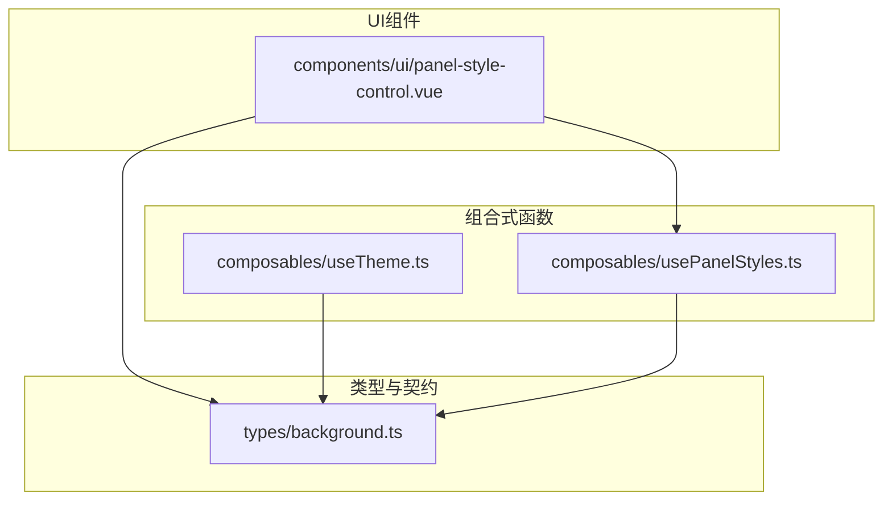
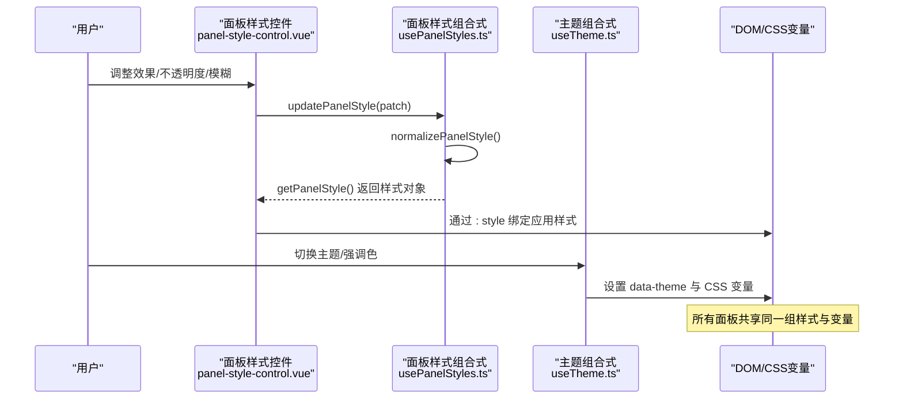
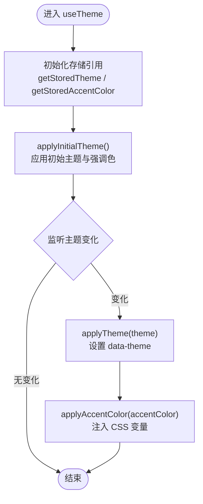
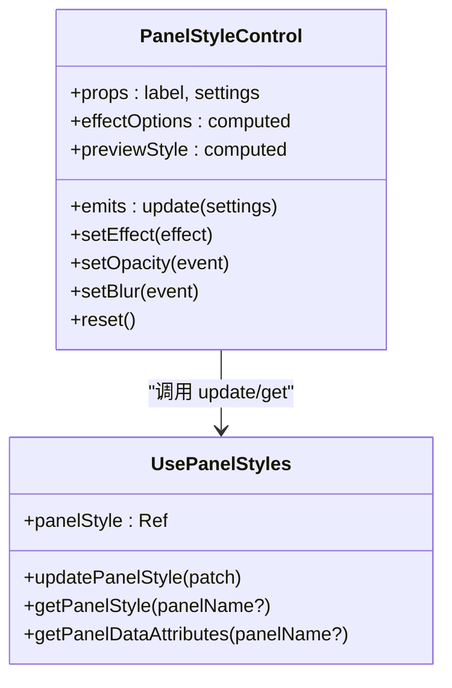
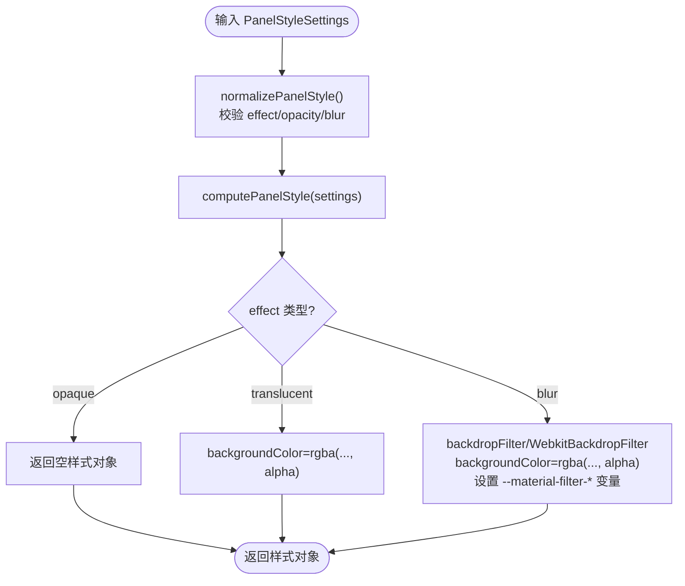
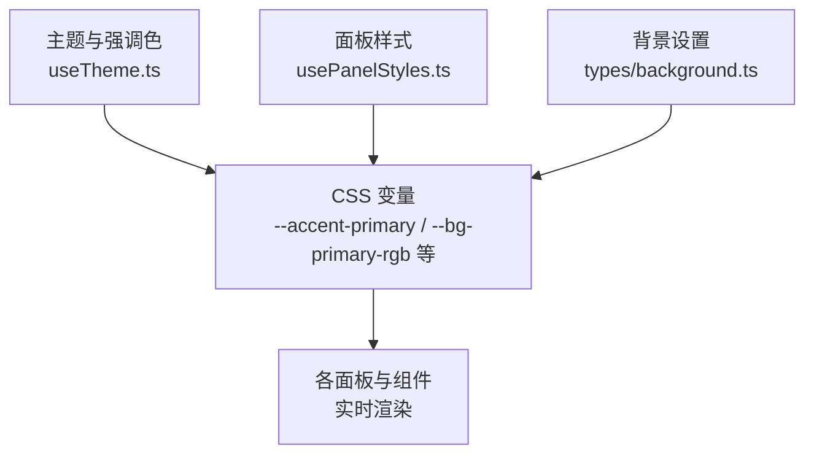
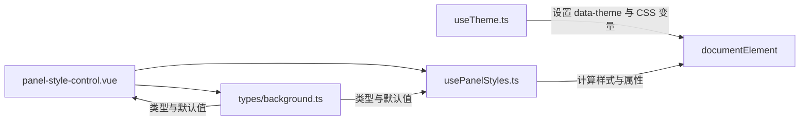

# 外观设置

<cite>
**本文引用的文件**   
- [useTheme.ts](file://apps/desktop/src/composables/useTheme.ts)
- [background.ts](file://apps/desktop/src/types/background.ts)
- [panel-style-control.vue](file://apps/desktop/src/components/ui/panel-style-control.vue)
- [usePanelStyles.ts](file://apps/desktop/src/composables/usePanelStyles.ts)
</cite>

## 目录
1. [简介](#简介)
2. [项目结构](#项目结构)
3. [核心组件](#核心组件)
4. [架构总览](#架构总览)
5. [详细组件分析](#详细组件分析)
6. [依赖关系分析](#依赖关系分析)
7. [性能考量](#性能考量)
8. [故障排查指南](#故障排查指南)
9. [结论](#结论)
10. [附录](#附录)

## 简介
本模块为桌面端应用的外观设置提供统一的主题与面板样式能力，包括：
- 主题系统：支持深色、浅色与跟随系统的自动切换，并允许手动覆盖。
- 强调色配置：内置多套预设颜色方案，并提供自定义颜色选择器扩展点。
- 背景设置：支持图片、视频与HTML背景，具备不透明度与模糊控制，以及尺寸、位置与重复策略。
- 面板样式控制：统一的毛玻璃、半透明与纯色三种材质效果，支持全局应用与实时预览。
- 响应式与可访问性：通过CSS变量与数据属性驱动，适配不同屏幕与高对比度模式。
- 主题预览与批量应用：在设置界面中即时预览效果，并可一键应用到所有面板。
- 导出导入与版本管理：基于本地存储持久化，便于分享与迁移。

## 项目结构
外观设置相关代码集中在桌面端应用中，采用组合式函数（composable）与类型定义分离的方式组织：
- 类型定义：集中描述背景与面板样式的结构与默认值。
- 组合式函数：封装主题、强调色与面板样式的状态管理与计算逻辑。
- UI组件：提供用户交互与实时预览的面板样式控制面板。

图表来源
- [background.ts:1-57](file://apps/desktop/src/types/background.ts#L1-L57)
- [useTheme.ts:1-258](file://apps/desktop/src/composables/useTheme.ts#L1-L258)
- [usePanelStyles.ts:1-203](file://apps/desktop/src/composables/usePanelStyles.ts#L1-L203)
- [panel-style-control.vue:1-293](file://apps/desktop/src/components/ui/panel-style-control.vue#L1-L293)

章节来源
- [background.ts:1-57](file://apps/desktop/src/types/background.ts#L1-L57)
- [useTheme.ts:1-258](file://apps/desktop/src/composables/useTheme.ts#L1-L258)
- [usePanelStyles.ts:1-203](file://apps/desktop/src/composables/usePanelStyles.ts#L1-L203)
- [panel-style-control.vue:1-293](file://apps/desktop/src/components/ui/panel-style-control.vue#L1-L293)

## 核心组件
- 主题与强调色（useTheme）
  - 支持 dark/light/system 三种主题模式，system 模式下监听系统偏好变化。
  - 内置多套强调色预设，按当前主题动态映射到 CSS 变量。
  - 使用本地存储持久化主题与强调色选择。
- 面板样式（usePanelStyles）
  - 提供 opaque/translucent/blur 三种材质效果，全局生效于所有面板。
  - 根据设置计算内联样式与 data 属性，供 Vue :style 绑定与 CSS 选择器使用。
  - 对数值进行归一化与范围限制，确保稳定性。
- 面板样式控制面板（panel-style-control.vue）
  - 提供效果选择、不透明度与模糊滑块，以及实时预览区域。
  - 复用 computePanelStyle 保证预览与真实渲染一致。

章节来源
- [useTheme.ts:1-258](file://apps/desktop/src/composables/useTheme.ts#L1-L258)
- [usePanelStyles.ts:1-203](file://apps/desktop/src/composables/usePanelStyles.ts#L1-L203)
- [panel-style-control.vue:1-293](file://apps/desktop/src/components/ui/panel-style-control.vue#L1-L293)

## 架构总览
外观设置由“类型契约 + 组合式函数 + UI组件”三层构成，数据流从用户交互出发，经组合式函数计算后更新到 DOM/CSS 变量或 Vue 绑定样式，实现实时预览与全局应用。

图表来源
- [panel-style-control.vue:1-293](file://apps/desktop/src/components/ui/panel-style-control.vue#L1-L293)
- [usePanelStyles.ts:1-203](file://apps/desktop/src/composables/usePanelStyles.ts#L1-L203)
- [useTheme.ts:1-258](file://apps/desktop/src/composables/useTheme.ts#L1-L258)

## 详细组件分析

### 主题与强调色（useTheme）
- 主题模式
  - 支持 dark/light/system；system 模式通过 matchMedia 监听系统偏好变化并自动切换。
  - 将 resolved 主题写入 documentElement 的 data-theme 属性，供 CSS 层读取。
- 强调色
  - 内置多套预设（如蓝、绿、紫、橙、粉、红、青、黄），每套包含暗/亮两套配色集合。
  - 根据当前主题选择对应配色集，并将 accentPrimary/accentBrand/textBrand/borderInputFocus/shadowFocus 等变量注入根节点。
- 持久化
  - 使用本地存储保存主题与强调色键值，避免初始化时直接访问 localStorage 造成阻塞。
- 响应式
  - 通过 watch 监听主题与强调色变化，实时更新 CSS 变量与 data-theme。

图表来源
- [useTheme.ts:1-258](file://apps/desktop/src/composables/useTheme.ts#L1-L258)

章节来源
- [useTheme.ts:1-258](file://apps/desktop/src/composables/useTheme.ts#L1-L258)

### 背景设置（types/background.ts）
- 背景类型
  - none/image/video/html，source 支持 URL 或本地路径。
- 控制参数
  - opacity（0-100）、blur（0-20px）、size（cover/contain/auto）、position（center/top/bottom/left/right）、repeat（no-repeat/repeat/repeat-x/repeat-y）。
- 默认值
  - DEFAULT_BACKGROUND_SETTINGS 提供默认背景配置。

章节来源
- [background.ts:1-57](file://apps/desktop/src/types/background.ts#L1-L57)

### 面板样式控制（panel-style-control.vue）
- 功能
  - 提供 opaque/translucent/blur 三种材质效果按钮。
  - translucent/blur 显示不透明度滑块；blur 额外显示模糊强度滑块。
  - 预览区使用 computePanelStyle 生成样式，确保所见即所得。
- 交互
  - 通过 emit('update', patch) 向上层传递变更，上层调用 usePanelStyles.updatePanelStyle 合并并持久化。
  - 支持重置为默认值。

图表来源
- [panel-style-control.vue:1-293](file://apps/desktop/src/components/ui/panel-style-control.vue#L1-L293)
- [usePanelStyles.ts:1-203](file://apps/desktop/src/composables/usePanelStyles.ts#L1-L203)

章节来源
- [panel-style-control.vue:1-293](file://apps/desktop/src/components/ui/panel-style-control.vue#L1-L293)
- [usePanelStyles.ts:1-203](file://apps/desktop/src/composables/usePanelStyles.ts#L1-L203)

### 面板样式组合式（usePanelStyles.ts）
- 存储与归一化
  - 使用 effectScope 与 useStorage 持久化 panelStyle 设置，并在初始化时进行 normalizePanelStyle 校验与范围限制。
- 样式计算
  - computePanelStyle 根据 effect 类型生成内联样式：
    - opaque：不附加特殊样式，使用 CSS 默认背景。
    - translucent：rgba 背景，alpha 来自 opacity。
    - blur：backdrop-filter/WebkitBackdropFilter 模糊，同时设置 rgba 背景，并暴露 --material-filter-section 与 --material-filter-raised 派生变量。
- 数据属性
  - getPanelDataAttributes 输出 data-panel-effect，供 CSS 层根据效果类型重映射 surface 变量。

图表来源
- [usePanelStyles.ts:1-203](file://apps/desktop/src/composables/usePanelStyles.ts#L1-L203)

章节来源
- [usePanelStyles.ts:1-203](file://apps/desktop/src/composables/usePanelStyles.ts#L1-L203)

### 概念总览
- 主题与强调色联动：主题切换会触发强调色变量的重新计算，确保暗/亮主题下的对比度与品牌一致性。
- 面板材质效果全局化：所有面板共享同一组 material 设置，通过 data-panel-effect 与 CSS 变量实现一致的视觉层级。
- 背景高级功能：图片/视频/HTML 背景结合不透明度与模糊，可在保持内容可读性的同时营造氛围感。

[本图为概念示意，不直接映射具体源码文件]

## 依赖关系分析
- 组件依赖
  - panel-style-control.vue 依赖 usePanelStyles.ts 的计算与持久化能力，并消费 types/background.ts 的类型定义。
  - useTheme.ts 独立管理主题与强调色，通过 DOM 属性与 CSS 变量影响全局样式。
- 数据流向
  - 用户操作 → 组件 emit → 组合式函数更新 → 计算样式/变量 → 应用到 DOM/CSS。
- 外部依赖
  - @vueuse/core 的 useStorage 用于本地持久化。
  - Vue 的 ref/watch/effectScope 用于响应式与生命周期管理。

图表来源
- [panel-style-control.vue:1-293](file://apps/desktop/src/components/ui/panel-style-control.vue#L1-L293)
- [usePanelStyles.ts:1-203](file://apps/desktop/src/composables/usePanelStyles.ts#L1-L203)
- [useTheme.ts:1-258](file://apps/desktop/src/composables/useTheme.ts#L1-L258)
- [background.ts:1-57](file://apps/desktop/src/types/background.ts#L1-L57)

章节来源
- [panel-style-control.vue:1-293](file://apps/desktop/src/components/ui/panel-style-control.vue#L1-L293)
- [usePanelStyles.ts:1-203](file://apps/desktop/src/composables/usePanelStyles.ts#L1-L203)
- [useTheme.ts:1-258](file://apps/desktop/src/composables/useTheme.ts#L1-L258)
- [background.ts:1-57](file://apps/desktop/src/types/background.ts#L1-L57)

## 性能考量
- 延迟初始化：useTheme 与 usePanelStyles 均延迟初始化存储引用，避免模块加载时的同步 I/O 开销。
- 响应式最小化：仅对必要状态（theme/accentColor/panelStyle）建立 watch，减少不必要的重渲染。
- 样式计算优化：computePanelStyle 仅在设置变化时执行，且返回值直接用于 :style 绑定，避免中间层转换。
- 兼容性处理：blur 同时设置标准与 WebKit 前缀，确保 Chromium/Electron 环境稳定。
- 数值归一化：normalizePanelStyle 对输入进行范围限制与类型检查，防止异常值导致性能抖动。

## 故障排查指南
- 主题未生效
  - 检查 data-theme 是否正确设置；确认系统偏好监听事件是否触发。
  - 验证 CSS 变量是否被注入根节点。
- 强调色无效
  - 确认 accentColor 键值是否存在于预设列表；检查当前主题对应的配色集是否匹配。
- 面板样式不更新
  - 确认组件是否正确 emit('update') 且上层调用 updatePanelStyle；检查 normalizePanelStyle 是否将值限制在合法范围。
- 毛玻璃效果异常
  - 检查 backdrop-filter 与 WebKitBackdropFilter 是否同时设置；确认浏览器/环境是否支持。
- 背景不显示
  - 验证 source 是否为有效 URL 或本地路径；检查 opacity/blur 是否过大导致不可见。

章节来源
- [useTheme.ts:1-258](file://apps/desktop/src/composables/useTheme.ts#L1-L258)
- [usePanelStyles.ts:1-203](file://apps/desktop/src/composables/usePanelStyles.ts#L1-L203)
- [panel-style-control.vue:1-293](file://apps/desktop/src/components/ui/panel-style-control.vue#L1-L293)
- [background.ts:1-57](file://apps/desktop/src/types/background.ts#L1-L57)

## 结论
外观设置模块以清晰的类型契约与组合式函数为核心，实现了主题、强调色、背景与面板样式的统一管理。通过响应式更新与 CSS 变量机制，提供了高性能、可扩展且跨平台一致的视觉效果。建议后续在以下方面持续优化：
- 增强自定义颜色选择器的易用性与校验。
- 提供更丰富的背景动态效果与性能监控。
- 完善主题导出/导入与版本管理工具，支持团队协作与回滚。

## 附录
- 术语说明
  - 材质效果：指面板背景的视觉表现，包括纯色、半透明与毛玻璃。
  - 数据属性：data-panel-effect 用于 CSS 层识别当前材质效果类型。
  - CSS 变量：通过 documentElement.style.setProperty 注入，供全局样式消费。
- 最佳实践
  - 在组件中使用 :style 绑定 computePanelStyle 返回值，避免直接操作 DOM。
  - 使用 i18n 标签与默认值，确保界面文本国际化与健壮性。
  - 对用户输入进行归一化与范围限制，提升稳定性与可维护性。