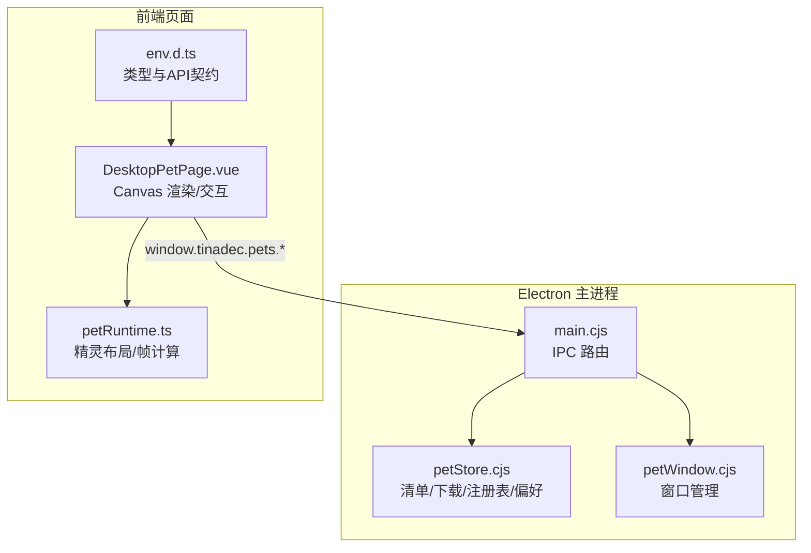
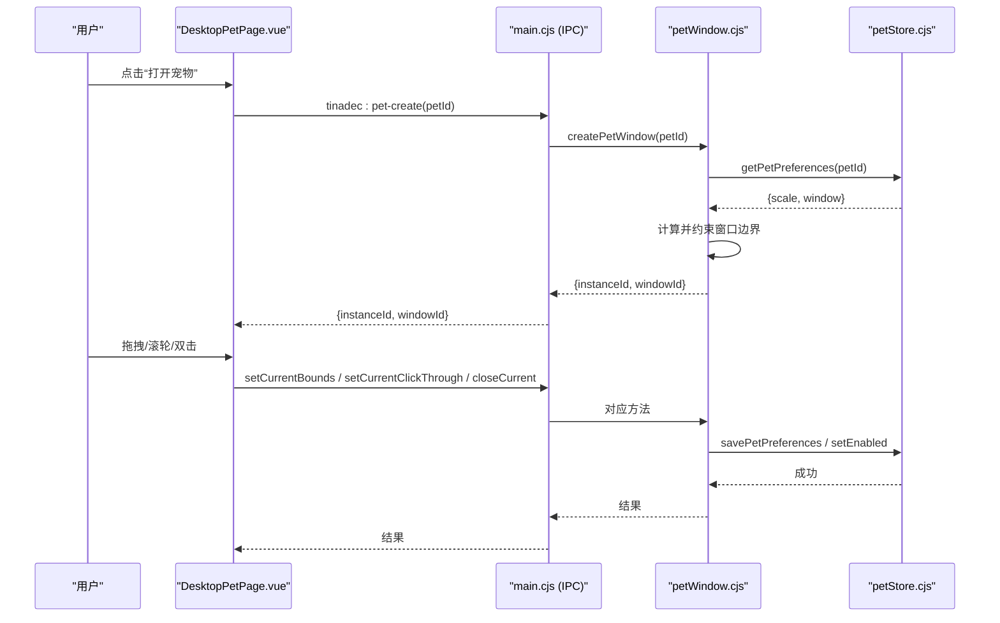
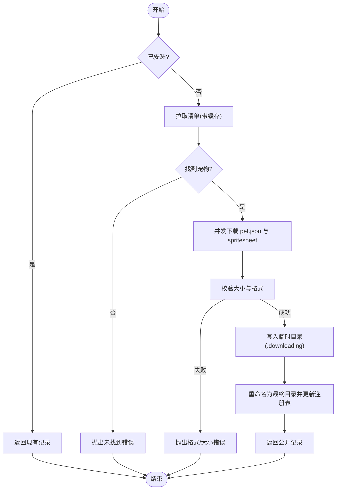
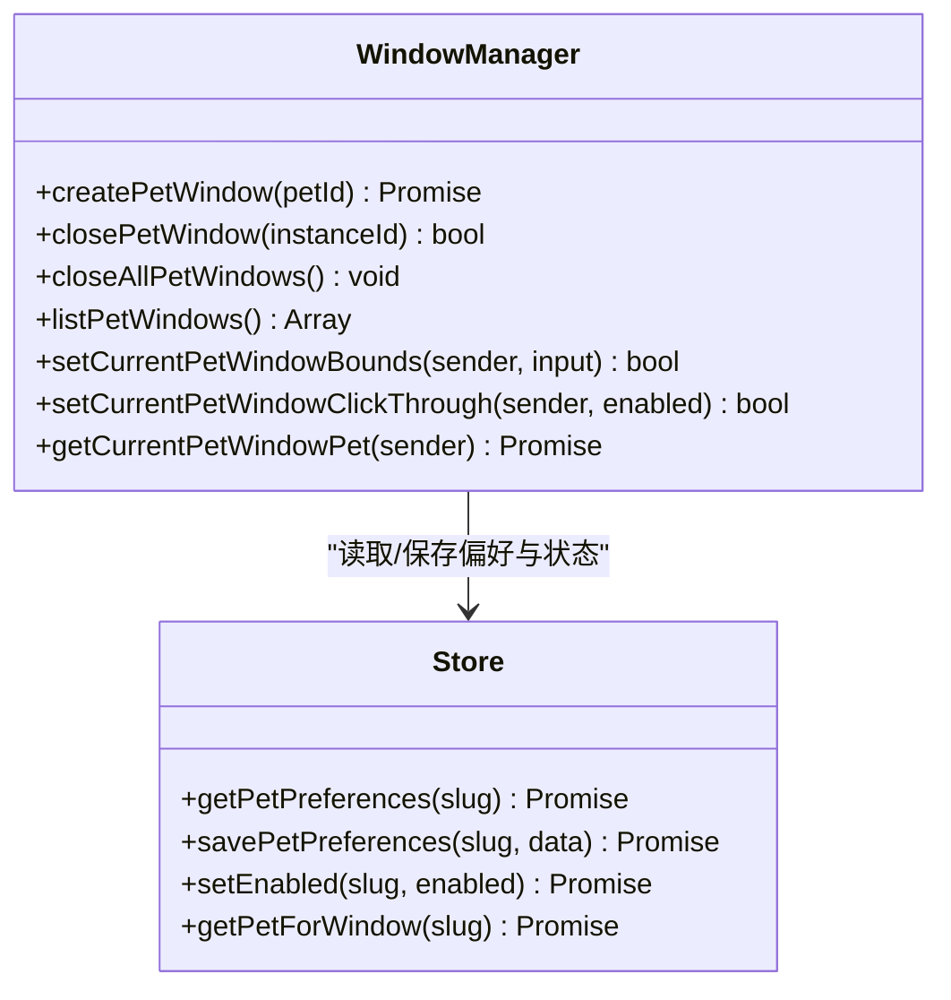
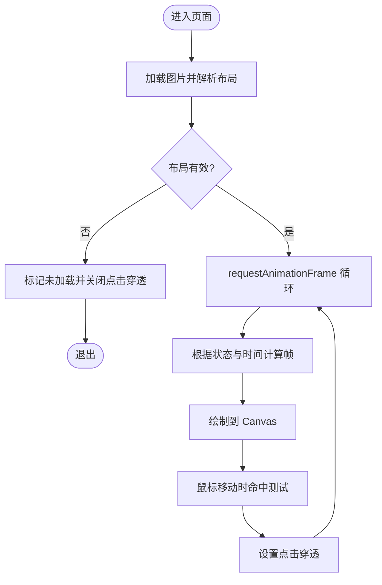
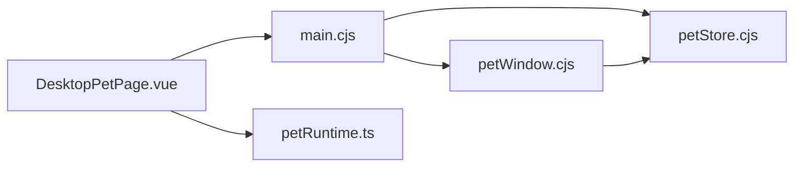

# 宠物设置

<cite>
**本文引用的文件**   
- [petStore.cjs](file://apps/desktop/electron/petStore.cjs)
- [petWindow.cjs](file://apps/desktop/electron/petWindow.cjs)
- [main.cjs](file://apps/desktop/electron/main.cjs)
- [DesktopPetPage.vue](file://apps/desktop/src/pages/DesktopPetPage.vue)
- [petRuntime.ts](file://apps/desktop/src/pets/petRuntime.ts)
- [env.d.ts](file://apps/desktop/src/env.d.ts)
</cite>

## 目录
1. [简介](#简介)
2. [项目结构](#项目结构)
3. [核心组件](#核心组件)
4. [架构总览](#架构总览)
5. [详细组件分析](#详细组件分析)
6. [依赖关系分析](#依赖关系分析)
7. [性能考虑](#性能考虑)
8. [故障排查指南](#故障排查指南)
9. [结论](#结论)
10. [附录](#附录)

## 简介
本模块为桌面端“宠物”（桌面小宠）提供完整生命周期管理与交互能力，涵盖从市场下载、本地安装、启用/禁用、删除与目录浏览，到运行时窗口管理、状态监控、事件与通信机制，以及安全沙箱与资源隔离策略。前端通过 Canvas 渲染精灵帧动画，Electron 主进程负责窗口与文件系统操作，前后端通过 IPC 桥接。

## 项目结构
- Electron 主进程层
  - petStore.cjs：宠物清单、下载、缓存、注册表与偏好存储
  - petWindow.cjs：宠物窗口创建、尺寸/位置控制、点击穿透、关闭与列表
  - main.cjs：IPC 路由与对外暴露的 API
- 前端页面层
  - DesktopPetPage.vue：Canvas 渲染、拖拽移动、缩放、点击穿透判定、交互事件
  - petRuntime.ts：精灵布局解析、帧计算、状态常量
  - env.d.ts：类型定义与全局 API 契约

**图表来源** 
- [main.cjs:151-158](file://apps/desktop/electron/main.cjs#L151-L158)
- [petStore.cjs:1-361](file://apps/desktop/electron/petStore.cjs#L1-L361)
- [petWindow.cjs:1-194](file://apps/desktop/electron/petWindow.cjs#L1-L194)
- [DesktopPetPage.vue:1-297](file://apps/desktop/src/pages/DesktopPetPage.vue#L1-L297)
- [petRuntime.ts:1-63](file://apps/desktop/src/pets/petRuntime.ts#L1-L63)
- [env.d.ts:106-164](file://apps/desktop/src/env.d.ts#L106-L164)

**章节来源**
- [main.cjs:151-158](file://apps/desktop/electron/main.cjs#L151-L158)
- [petStore.cjs:1-361](file://apps/desktop/electron/petStore.cjs#L1-L361)
- [petWindow.cjs:1-194](file://apps/desktop/electron/petWindow.cjs#L1-L194)
- [DesktopPetPage.vue:1-297](file://apps/desktop/src/pages/DesktopPetPage.vue#L1-L297)
- [petRuntime.ts:1-63](file://apps/desktop/src/pets/petRuntime.ts#L1-L63)
- [env.d.ts:106-164](file://apps/desktop/src/env.d.ts#L106-L164)

## 核心组件
- 清单与下载（petStore.cjs）
  - 远程清单拉取与缓存、资产校验（大小限制、格式校验）、预览缓存（LRU 式内存缓存）
  - 本地注册表 registry.json 读写（原子写入），宠物目录 pets/<slug> 管理
  - 下载流程：校验元数据与精灵图 -> 临时目录写入 -> 重命名提交 -> 更新注册表
  - 启用/禁用、删除、打开目录、偏好保存（scale/window bounds）
- 窗口管理（petWindow.cjs）
  - 创建透明无边框置顶窗口，支持拖拽移动、滚轮缩放、点击穿透
  - 自动持久化窗口边界与缩放比例，关闭时禁用宠物
  - 多实例管理与查询
- 前端渲染（DesktopPetPage.vue + petRuntime.ts）
  - 基于 Canvas 的精灵帧绘制，状态机驱动动画（idle/running/jumping/waving 等）
  - 指针事件处理拖拽移动、双击跳跃、滚轮缩放、右下角拖拽调整尺寸
  - 像素级命中测试决定点击穿透
- 类型与 API 契约（env.d.ts）
  - 定义 PetdexCatalogPet、DownloadedPet、PetWindowInfo、PetWindowApi 等接口
  - 暴露 fetchCatalog/download/listDownloaded/setEnabled/closeCurrent/getCurrent 等 API

**章节来源**
- [petStore.cjs:115-174](file://apps/desktop/electron/petStore.cjs#L115-L174)
- [petStore.cjs:229-277](file://apps/desktop/electron/petStore.cjs#L229-L277)
- [petStore.cjs:279-337](file://apps/desktop/electron/petStore.cjs#L279-L337)
- [petWindow.cjs:41-110](file://apps/desktop/electron/petWindow.cjs#L41-L110)
- [petWindow.cjs:159-172](file://apps/desktop/electron/petWindow.cjs#L159-L172)
- [DesktopPetPage.vue:34-72](file://apps/desktop/src/pages/DesktopPetPage.vue#L34-L72)
- [DesktopPetPage.vue:92-147](file://apps/desktop/src/pages/DesktopPetPage.vue#L92-L147)
- [petRuntime.ts:1-63](file://apps/desktop/src/pets/petRuntime.ts#L1-L63)
- [env.d.ts:106-164](file://apps/desktop/src/env.d.ts#L106-L164)

## 架构总览
下图展示从 UI 到主进程的调用链路与数据流：

**图表来源** 
- [main.cjs:151-158](file://apps/desktop/electron/main.cjs#L151-L158)
- [petWindow.cjs:41-110](file://apps/desktop/electron/petWindow.cjs#L41-L110)
- [petStore.cjs:318-337](file://apps/desktop/electron/petStore.cjs#L318-L337)
- [DesktopPetPage.vue:105-126](file://apps/desktop/src/pages/DesktopPetPage.vue#L105-L126)

## 详细组件分析

### 宠物清单与下载（petStore.cjs）
- 清单获取与缓存
  - 远程清单拉取，字段映射与 URL 白名单校验，5 分钟缓存
- 预览缓存
  - 内存 LRU 式缓存，按最大字节数淘汰旧项，避免重复下载
- 下载与安装
  - 并发拉取 pet.json 与 spritesheet，严格大小限制与格式校验
  - 使用 .downloading 临时目录，成功后重命名为最终目录，写入 metadata.json 并更新 registry.json
- 启用/禁用与删除
  - 修改 registry.json 中的 enabled 标志；删除时递归移除目录并清理注册表
- 偏好与窗口信息
  - 保存 scale（0.18~1.2）与 window 边界（四值校验），读取时返回公开记录

**图表来源** 
- [petStore.cjs:115-174](file://apps/desktop/electron/petStore.cjs#L115-L174)
- [petStore.cjs:229-277](file://apps/desktop/electron/petStore.cjs#L229-L277)

**章节来源**
- [petStore.cjs:115-174](file://apps/desktop/electron/petStore.cjs#L115-L174)
- [petStore.cjs:229-277](file://apps/desktop/electron/petStore.cjs#L229-L277)
- [petStore.cjs:279-337](file://apps/desktop/electron/petStore.cjs#L279-L337)

### 窗口管理与运行态（petWindow.cjs）
- 窗口创建
  - 根据偏好计算初始尺寸与位置，确保在屏幕工作区内；无边框、透明、置顶、不可最小化/最大化
  - 绑定 move/resize 事件，延迟持久化保存边界与缩放
- 窗口控制
  - 关闭单个/全部/当前窗口；按实例或宠物 ID 查询；点击穿透开关
- 关闭行为
  - 关闭当前窗口时自动禁用该宠物（setEnabled(false)）

**图表来源** 
- [petWindow.cjs:41-110](file://apps/desktop/electron/petWindow.cjs#L41-L110)
- [petWindow.cjs:159-172](file://apps/desktop/electron/petWindow.cjs#L159-L172)
- [petStore.cjs:318-337](file://apps/desktop/electron/petStore.cjs#L318-L337)

**章节来源**
- [petWindow.cjs:41-110](file://apps/desktop/electron/petWindow.cjs#L41-L110)
- [petWindow.cjs:159-172](file://apps/desktop/electron/petWindow.cjs#L159-L172)
- [petWindow.cjs:174-180](file://apps/desktop/electron/petWindow.cjs#L174-L180)

### 前端渲染与交互（DesktopPetPage.vue + petRuntime.ts）
- 渲染管线
  - 加载 imageDataUrl -> 解析精灵布局 -> requestAnimationFrame 循环绘制当前帧
- 状态机
  - idle/running-right/running-left/waving/jumping/failed/waiting/review 等状态，每状态定义帧数与时长
- 交互逻辑
  - 拖拽移动：pointer 事件计算位移并调用 setCurrentBounds
  - 滚轮缩放：按步长调整 scale，保持底部对齐
  - 双击跳跃：切换至 jumping 状态并在完成后回 idle
  - 点击穿透：像素级命中测试，非透明区域允许点击，否则穿透
- 资源与性能
  - willReadFrequently 上下文优化，imageSmoothingEnabled=false 像素化渲染

**图表来源** 
- [DesktopPetPage.vue:34-72](file://apps/desktop/src/pages/DesktopPetPage.vue#L34-L72)
- [DesktopPetPage.vue:80-90](file://apps/desktop/src/pages/DesktopPetPage.vue#L80-L90)
- [DesktopPetPage.vue:92-147](file://apps/desktop/src/pages/DesktopPetPage.vue#L92-L147)
- [petRuntime.ts:7-17](file://apps/desktop/src/pets/petRuntime.ts#L7-L17)
- [petRuntime.ts:34-45](file://apps/desktop/src/pets/petRuntime.ts#L34-L45)
- [petRuntime.ts:47-53](file://apps/desktop/src/pets/petRuntime.ts#L47-L53)

**章节来源**
- [DesktopPetPage.vue:34-72](file://apps/desktop/src/pages/DesktopPetPage.vue#L34-L72)
- [DesktopPetPage.vue:80-90](file://apps/desktop/src/pages/DesktopPetPage.vue#L80-L90)
- [DesktopPetPage.vue:92-147](file://apps/desktop/src/pages/DesktopPetPage.vue#L92-L147)
- [petRuntime.ts:1-63](file://apps/desktop/src/pets/petRuntime.ts#L1-L63)

### 类型与 API 契约（env.d.ts）
- 数据结构
  - PetdexCatalogPet：清单条目（slug、displayName、kind、spritesheetUrl、petJsonUrl、zipUrl）
  - DownloadedPet：已安装宠物（含 imageDataUrl、enabled、scale、window）
  - PetWindowInfo：窗口实例信息（instanceId、petId、windowId、bounds）
  - PetWindowApi：前端可用的 API 集合（fetchCatalog、download、listDownloaded、setEnabled、closeCurrent、getCurrent、list、getWindowPet、onChanged）
- 作用
  - 统一前后端契约，便于 IDE 提示与类型检查

**章节来源**
- [env.d.ts:106-164](file://apps/desktop/src/env.d.ts#L106-L164)

## 依赖关系分析
- 主进程依赖
  - main.cjs 依赖 petStore.cjs 与 petWindow.cjs，集中暴露 IPC 方法
  - petWindow.cjs 依赖 petStore.cjs 进行偏好与状态读写
- 前端依赖
  - DesktopPetPage.vue 依赖 petRuntime.ts 的常量与算法
  - 所有前端调用通过 window.tinadec.pets.* 访问，由 main.cjs 路由到具体实现

**图表来源** 
- [main.cjs:151-158](file://apps/desktop/electron/main.cjs#L151-L158)
- [petWindow.cjs:4](file://apps/desktop/electron/petWindow.cjs#L4)
- [DesktopPetPage.vue:5-12](file://apps/desktop/src/pages/DesktopPetPage.vue#L5-L12)

**章节来源**
- [main.cjs:151-158](file://apps/desktop/electron/main.cjs#L151-L158)
- [petWindow.cjs:4](file://apps/desktop/electron/petWindow.cjs#L4)
- [DesktopPetPage.vue:5-12](file://apps/desktop/src/pages/DesktopPetPage.vue#L5-L12)

## 性能考虑
- 清单与预览缓存
  - 清单 5 分钟缓存，预览内存缓存按最大字节数淘汰，减少网络与磁盘 IO
- 下载并发与限流
  - 并发拉取 pet.json 与 spritesheet，单请求超时与重定向限制，防止阻塞
- 渲染优化
  - Canvas willReadFrequently 与像素化渲染，避免不必要的重绘
- 窗口持久化节流
  - 移动/缩放后延迟保存，降低频繁 I/O

[本节为通用指导，不直接分析具体文件]

## 故障排查指南
- 下载失败
  - 清单无效/资产过大/格式不正确：检查清单版本与字段、确认内容长度限制与头信息
  - 重定向过多：检查 URL 白名单与跳转目标是否可信
- 预览异常
  - 精灵图格式校验失败：确认 PNG/WebP 魔数与头部
  - 预览缓存溢出：观察内存占用与淘汰策略
- 窗口问题
  - 无法显示/置顶：检查透明模式与 alwaysOnTop 配置
  - 边界越界：查看 clampBounds 计算与显示器 workArea
  - 点击穿透失效：检查命中测试像素透明度阈值
- 注册表损坏
  - 原子写入失败：检查临时文件与重命名权限

**章节来源**
- [petStore.cjs:115-174](file://apps/desktop/electron/petStore.cjs#L115-L174)
- [petStore.cjs:224-227](file://apps/desktop/electron/petStore.cjs#L224-L227)
- [petWindow.cjs:14-33](file://apps/desktop/electron/petWindow.cjs#L14-L33)
- [DesktopPetPage.vue:80-90](file://apps/desktop/src/pages/DesktopPetPage.vue#L80-L90)

## 结论
本模块以清晰的职责划分实现了桌面宠物的全生命周期管理：清单与下载、本地注册与偏好、窗口与交互、渲染与状态机。通过严格的白名单与大小限制、原子写入与内存缓存，保障了稳定性与性能。前端采用 Canvas 像素化渲染与精确命中测试，提供流畅的交互体验。后续可扩展更多筛选与排序能力、事件总线与跨宠物通信、以及更丰富的调试与性能分析工具。

[本节为总结性内容，不直接分析具体文件]

## 附录

### 生命周期操作速查
- 下载：fetchCatalog -> download -> 校验 -> 写入 -> 注册
- 安装：registry.json 新增记录，metadata.json 持久化
- 启用/禁用：修改 enabled 标志，影响窗口可见性与行为
- 删除：移除目录与注册表记录
- 目录浏览：openPetFolder 返回本地路径

**章节来源**
- [petStore.cjs:115-174](file://apps/desktop/electron/petStore.cjs#L115-L174)
- [petStore.cjs:229-277](file://apps/desktop/electron/petStore.cjs#L229-L277)
- [petStore.cjs:279-337](file://apps/desktop/electron/petStore.cjs#L279-L337)
- [petStore.cjs:300-305](file://apps/desktop/electron/petStore.cjs#L300-L305)

### 安全与沙箱要点
- 白名单域名与协议校验，禁止任意重定向
- 资源大小限制与格式校验，防止恶意注入
- 窗口 contextIsolation、nodeIntegration=false、sandbox=true
- 关闭新窗口能力，限制 webSecurity 仅用于必要场景

**章节来源**
- [petStore.cjs:36-43](file://apps/desktop/electron/petStore.cjs#L36-L43)
- [petStore.cjs:45-87](file://apps/desktop/electron/petStore.cjs#L45-L87)
- [petWindow.cjs:75-82](file://apps/desktop/electron/petWindow.cjs#L75-L82)
- [petWindow.cjs:85](file://apps/desktop/electron/petWindow.cjs#L85)