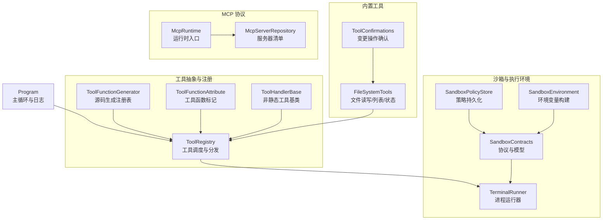
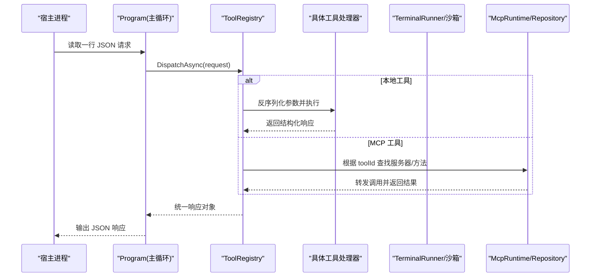
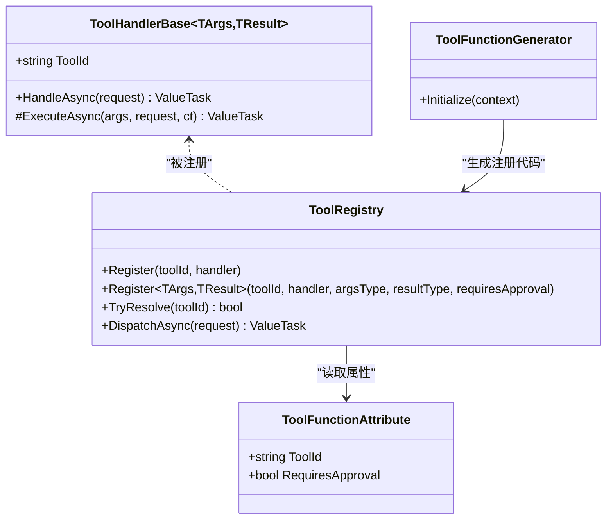
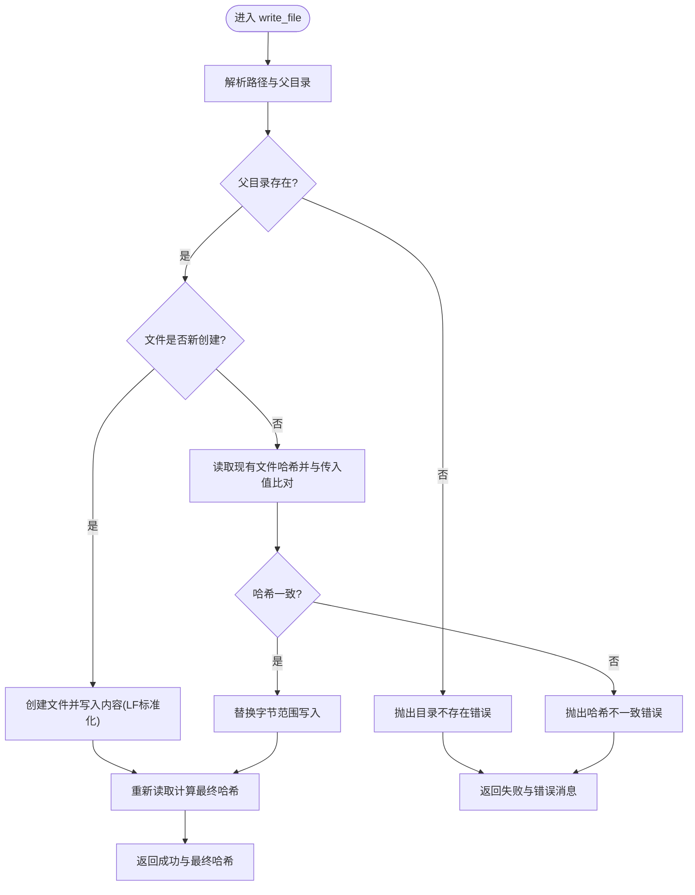
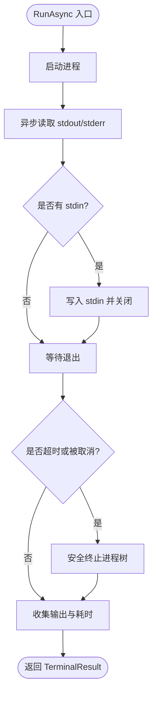
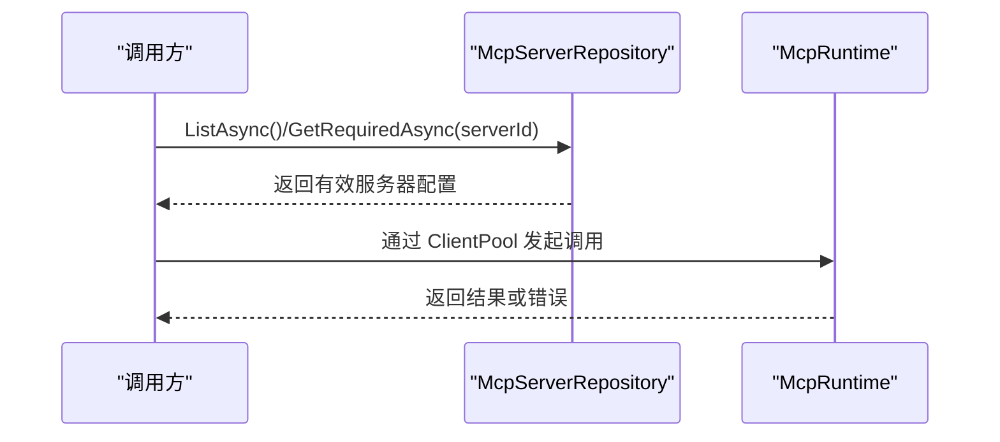
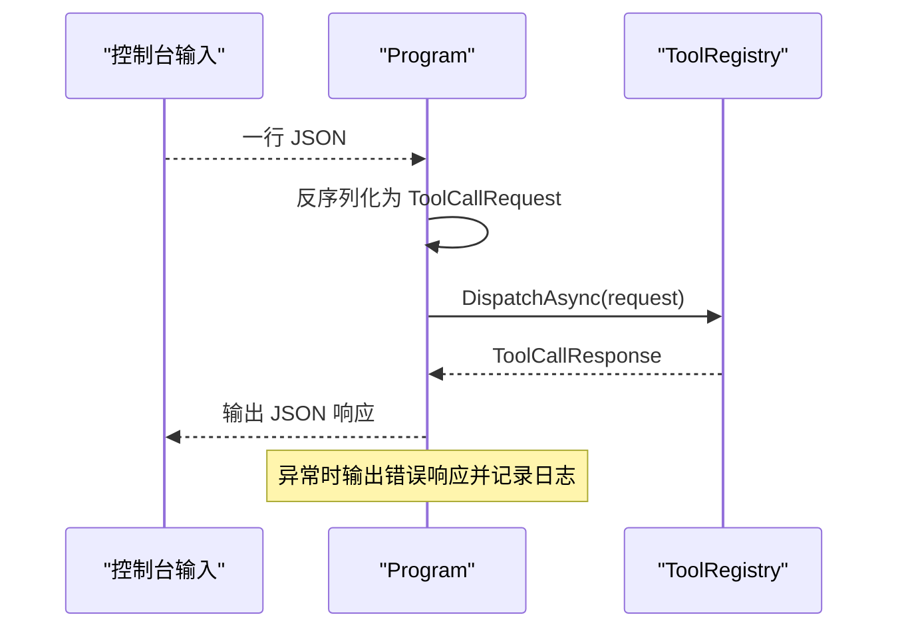
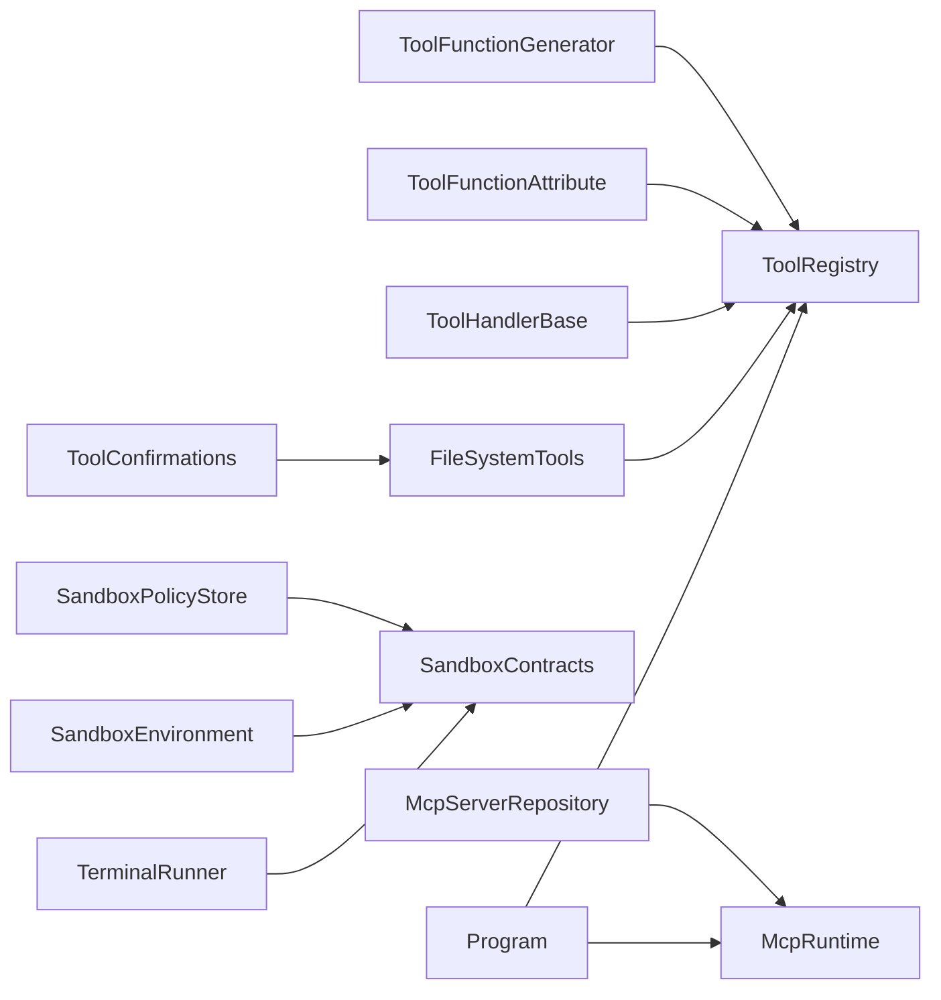

# 工具层设置

<cite>
**本文引用的文件**   
- [TinadecTools/Abstractions/ToolRegistry.cs](file://TinadecTools/Abstractions/ToolRegistry.cs)
- [TinadecTools/Abstractions/ToolFunctionAttribute.cs](file://TinadecTools/Abstractions/ToolFunctionAttribute.cs)
- [TinadecTools/Abstractions/ToolHandlerBase.cs](file://TinadecTools/Abstractions/ToolHandlerBase.cs)
- [TinadecTools.Generators/ToolFunctionGenerator.cs](file://TinadecTools.Generators/ToolFunctionGenerator.cs)
- [TinadecTools/Program.cs](file://TinadecTools/Program.cs)
- [TinadecTools/Tools/FileRW/FileSystemTools.cs](file://TinadecTools/Tools/FileRW/FileSystemTools.cs)
- [TinadecTools/Runtime/Sandbox/SandboxPolicyStore.cs](file://TinadecTools/Runtime/Sandbox/SandboxPolicyStore.cs)
- [TinadecTools/Runtime/Sandbox/SandboxEnvironment.cs](file://TinadecTools/Runtime/Sandbox/SandboxEnvironment.cs)
- [TinadecTools/Runtime/Sandbox/SandboxContracts.cs](file://TinadecTools/Runtime/Sandbox/SandboxContracts.cs)
- [TinadecTools/Runtime/TerminalRunner.cs](file://TinadecTools/Runtime/TerminalRunner.cs)
- [TinadecTools/Tools/Mcp/McpRuntime.cs](file://TinadecTools/Tools/Mcp/McpRuntime.cs)
- [TinadecTools/Tools/Mcp/McpServerRepository.cs](file://TinadecTools/Tools/Mcp/McpServerRepository.cs)
- [TinadecTools/Tools/ToolConfirmations.cs](file://TinadecTools/Tools/ToolConfirmations.cs)
</cite>

## 目录
1. [简介](#简介)
2. [项目结构](#项目结构)
3. [核心组件](#核心组件)
4. [架构总览](#架构总览)
5. [详细组件分析](#详细组件分析)
6. [依赖关系分析](#依赖关系分析)
7. [性能与监控](#性能与监控)
8. [故障排查指南](#故障排查指南)
9. [结论](#结论)
10. [附录：API参考与集成示例](#附录api参考与集成示例)

## 简介
本模块为“工具层设置”，提供统一的工具发现、注册、执行与治理体系，支持内置工具、外部工具以及 MCP（Model Context Protocol）协议的统一管理。文档涵盖：
- 工具风险等级评估、权限控制与访问策略配置
- 工具执行环境隔离（沙箱）与资源限制
- 工具依赖管理、版本冲突解决与自动更新机制
- 工具性能监控、调用统计与错误分析
- 工具插件开发指南、API 参考与集成示例
- 工具与智能体的能力映射与动态加载策略

## 项目结构
工具层以 C# 为主，采用“抽象定义 + 源码生成器 + 运行时调度”的分层设计；MCP 协议通过独立仓库与客户端池进行统一接入；沙箱子系统提供进程级隔离与环境裁剪。



**图表来源** 
- [TinadecTools/Abstractions/ToolRegistry.cs:1-86](file://TinadecTools/Abstractions/ToolRegistry.cs#L1-L86)
- [TinadecTools/Abstractions/ToolFunctionAttribute.cs:1-15](file://TinadecTools/Abstractions/ToolFunctionAttribute.cs#L1-L15)
- [TinadecTools/Abstractions/ToolHandlerBase.cs:1-43](file://TinadecTools/Abstractions/ToolHandlerBase.cs#L1-L43)
- [TinadecTools.Generators/ToolFunctionGenerator.cs:1-101](file://TinadecTools.Generators/ToolFunctionGenerator.cs#L1-L101)
- [TinadecTools/Tools/FileRW/FileSystemTools.cs:1-273](file://TinadecTools/Tools/FileRW/FileSystemTools.cs#L1-L273)
- [TinadecTools/Tools/ToolConfirmations.cs:1-12](file://TinadecTools/Tools/ToolConfirmations.cs#L1-L12)
- [TinadecTools/Runtime/Sandbox/SandboxContracts.cs:1-71](file://TinadecTools/Runtime/Sandbox/SandboxContracts.cs#L1-L71)
- [TinadecTools/Runtime/Sandbox/SandboxPolicyStore.cs:1-83](file://TinadecTools/Runtime/Sandbox/SandboxPolicyStore.cs#L1-L83)
- [TinadecTools/Runtime/Sandbox/SandboxEnvironment.cs:1-69](file://TinadecTools/Runtime/Sandbox/SandboxEnvironment.cs#L1-L69)
- [TinadecTools/Runtime/TerminalRunner.cs:1-149](file://TinadecTools/Runtime/TerminalRunner.cs#L1-L149)
- [TinadecTools/Tools/Mcp/McpRuntime.cs:1-19](file://TinadecTools/Tools/Mcp/McpRuntime.cs#L1-L19)
- [TinadecTools/Tools/Mcp/McpServerRepository.cs:1-53](file://TinadecTools/Tools/Mcp/McpServerRepository.cs#L1-L53)
- [TinadecTools/Program.cs:1-68](file://TinadecTools/Program.cs#L1-L68)

**章节来源**
- [TinadecTools/Program.cs:1-68](file://TinadecTools/Program.cs#L1-L68)
- [TinadecTools/Abstractions/ToolRegistry.cs:1-86](file://TinadecTools/Abstractions/ToolRegistry.cs#L1-L86)

## 核心组件
- 工具注册与调度
  - ToolRegistry：维护工具 ID 到处理委托的映射，负责参数校验、反序列化、审批检查与结果封装。
  - ToolFunctionAttribute：声明式标注工具方法，支持 RequiresApproval 标记高风险操作。
  - ToolHandlerBase：非静态工具的抽象基类，统一参数解析与响应构造流程。
  - ToolFunctionGenerator：编译期扫描带注解的方法，自动生成注册代码，实现零样板注册。
- 内置工具
  - FileSystemTools：提供 ls/stat/write_file 等文件操作，包含游标分页、自然排序、写入哈希校验与行尾标准化。
  - ToolConfirmations：强制变更类工具携带确认字段，缺失则拒绝执行。
- 沙箱与执行环境
  - SandboxContracts：定义沙箱请求/响应、权限模型与后端接口。
  - SandboxPolicyStore：读取/合并/持久化 .tinadec/sandbox.json 策略文件。
  - SandboxEnvironment：裁剪并构建子进程环境变量，保留必要系统变量与缓存路径。
  - TerminalRunner：进程启动、超时控制、输出截断与优雅终止。
- MCP 协议
  - McpRuntime：暴露服务器仓库与客户端池，提供测试注入与生命周期清理。
  - McpServerRepository：从配置文件或环境变量加载 MCP 服务器清单，按 Id 查询。

**章节来源**
- [TinadecTools/Abstractions/ToolRegistry.cs:1-86](file://TinadecTools/Abstractions/ToolRegistry.cs#L1-L86)
- [TinadecTools/Abstractions/ToolFunctionAttribute.cs:1-15](file://TinadecTools/Abstractions/ToolFunctionAttribute.cs#L1-L15)
- [TinadecTools/Abstractions/ToolHandlerBase.cs:1-43](file://TinadecTools/Abstractions/ToolHandlerBase.cs#L1-L43)
- [TinadecTools.Generators/ToolFunctionGenerator.cs:1-101](file://TinadecTools.Generators/ToolFunctionGenerator.cs#L1-L101)
- [TinadecTools/Tools/FileRW/FileSystemTools.cs:1-273](file://TinadecTools/Tools/FileRW/FileSystemTools.cs#L1-L273)
- [TinadecTools/Tools/ToolConfirmations.cs:1-12](file://TinadecTools/Tools/ToolConfirmations.cs#L1-L12)
- [TinadecTools/Runtime/Sandbox/SandboxContracts.cs:1-71](file://TinadecTools/Runtime/Sandbox/SandboxContracts.cs#L1-L71)
- [TinadecTools/Runtime/Sandbox/SandboxPolicyStore.cs:1-83](file://TinadecTools/Runtime/Sandbox/SandboxPolicyStore.cs#L1-L83)
- [TinadecTools/Runtime/Sandbox/SandboxEnvironment.cs:1-69](file://TinadecTools/Runtime/Sandbox/SandboxEnvironment.cs#L1-L69)
- [TinadecTools/Runtime/TerminalRunner.cs:1-149](file://TinadecTools/Runtime/TerminalRunner.cs#L1-L149)
- [TinadecTools/Tools/Mcp/McpRuntime.cs:1-19](file://TinadecTools/Tools/Mcp/McpRuntime.cs#L1-L19)
- [TinadecTools/Tools/Mcp/McpServerRepository.cs:1-53](file://TinadecTools/Tools/Mcp/McpServerRepository.cs#L1-L53)

## 架构总览
工具层采用“声明式标注 + 源码生成 + 运行时调度”的统一模式，所有工具通过 ToolRegistry 集中注册与分发。执行路径支持直接本地执行与沙箱隔离执行；MCP 工具通过独立仓库与客户端池管理。



**图表来源** 
- [TinadecTools/Program.cs:1-68](file://TinadecTools/Program.cs#L1-L68)
- [TinadecTools/Abstractions/ToolRegistry.cs:1-86](file://TinadecTools/Abstractions/ToolRegistry.cs#L1-L86)
- [TinadecTools/Tools/Mcp/McpRuntime.cs:1-19](file://TinadecTools/Tools/Mcp/McpRuntime.cs#L1-L19)
- [TinadecTools/Tools/Mcp/McpServerRepository.cs:1-53](file://TinadecTools/Tools/Mcp/McpServerRepository.cs#L1-L53)

## 详细组件分析

### 工具注册与调度（ToolRegistry、ToolFunctionAttribute、ToolHandlerBase、ToolFunctionGenerator）
- 设计要点
  - 使用字典缓存工具 ID 到处理委托，支持大小写不敏感匹配。
  - 支持两种注册方式：基于委托的直接注册与基于泛型方法的强类型注册。
  - 对 requiresApproval 的工具在派发前进行审批标志检查。
  - 使用 System.Text.Json 的 JsonTypeInfo 提升序列化性能与 AOT 友好性。
- 源码生成
  - 编译器增量生成器扫描带有 ToolFunctionAttribute 的静态方法，自动生成注册代码，避免手写注册逻辑。
- 复杂度与性能
  - 注册 O(1)，分发 O(1)；序列化/反序列化由 JsonTypeInfo 优化。



**图表来源** 
- [TinadecTools/Abstractions/ToolRegistry.cs:1-86](file://TinadecTools/Abstractions/ToolRegistry.cs#L1-L86)
- [TinadecTools/Abstractions/ToolFunctionAttribute.cs:1-15](file://TinadecTools/Abstractions/ToolFunctionAttribute.cs#L1-L15)
- [TinadecTools/Abstractions/ToolHandlerBase.cs:1-43](file://TinadecTools/Abstractions/ToolHandlerBase.cs#L1-L43)
- [TinadecTools.Generators/ToolFunctionGenerator.cs:1-101](file://TinadecTools.Generators/ToolFunctionGenerator.cs#L1-L101)

**章节来源**
- [TinadecTools/Abstractions/ToolRegistry.cs:1-86](file://TinadecTools/Abstractions/ToolRegistry.cs#L1-L86)
- [TinadecTools/Abstractions/ToolFunctionAttribute.cs:1-15](file://TinadecTools/Abstractions/ToolFunctionAttribute.cs#L1-L15)
- [TinadecTools/Abstractions/ToolHandlerBase.cs:1-43](file://TinadecTools/Abstractions/ToolHandlerBase.cs#L1-L43)
- [TinadecTools.Generators/ToolFunctionGenerator.cs:1-101](file://TinadecTools.Generators/ToolFunctionGenerator.cs#L1-L101)

### 内置文件工具（FileSystemTools）
- 功能概览
  - ls：目录枚举，支持游标分页与自然排序，限制最大页大小。
  - stat：路径元信息获取，支持符号链接目标解析。
  - write_file：创建或覆盖写入，覆盖时要求 file_hash 一致性校验，行尾标准化为 LF。
- 安全与权限
  - write_file 标记 RequiresApproval=true，需审批才能执行。
  - 父目录必须存在，覆盖时需计算并比对文件哈希，防止并发篡改。
- 数据结构与复杂度
  - 列表枚举 O(N) 排序后分页；写入为 O(M) 字节流写入。



**图表来源** 
- [TinadecTools/Tools/FileRW/FileSystemTools.cs:1-273](file://TinadecTools/Tools/FileRW/FileSystemTools.cs#L1-L273)

**章节来源**
- [TinadecTools/Tools/FileRW/FileSystemTools.cs:1-273](file://TinadecTools/Tools/FileRW/FileSystemTools.cs#L1-L273)

### 沙箱策略与环境（SandboxPolicyStore、SandboxEnvironment、SandboxContracts）
- 策略文件
  - 位置：工作区根目录下的 .tinadec/sandbox.json，包含 read_paths、write_paths、environment_variables 与 version。
  - 支持合并新增授权并持久化，路径规范化去重与平台大小写处理。
- 环境变量构建
  - 仅保留最小必要系统变量与代理相关变量，按需注入缓存目录环境变量（NPM/NUGET/PIP/CARGO）。
- 协议与后端
  - 定义执行请求/响应、重置作用域与后端接口，便于跨平台扩展。

```mermaid
classDiagram
class SandboxPolicyStore {
+Load() SandboxPolicyFile
+MergeGrants(permissions, existing) SandboxPolicyFile
+Save(policy) void
+Delete() void
+MergeAndPersist(permissions) SandboxPolicyFile
}
class SandboxEnvironment {
+Build(sandboxAccountDirs, extraEnvVarNames) Dictionary
+IsEnvironmentVariableNameValid(name) bool
}
class SandboxContracts {
<<enum>> SandboxResetScope
class SandboxPermissions {
+string[] ReadPaths
+string[] WritePaths
+string[] EnvironmentVariableNames
}
class SandboxPolicyFile {
+int Version
+string[] ReadPaths
+string[] WritePaths
+string[] EnvironmentVariables
}
class SandboxRunnerRequest {
+string Executable
+string[] Arguments
+string WorkingDirectory
+string? Stdin
+int TimeoutMs
+Dictionary~string,string~ Environment
}
class SandboxRunnerResponse {
+bool Success
+int ExitCode
+string Stdout
+string Stderr
+bool TimedOut
+long DurationMs
+string? Error
+bool StdoutTruncated
+bool stderr_truncated
}
class ISandboxBackend {
+bool IsSupported
+bool IsInitialized
+EnsureSetupAsync(ct) Task
+ExecuteAsync(req, perms, persist, ct) Task
+ResetAsync(scope, ct) Task
}
}
SandboxPolicyStore --> SandboxContracts : "读写策略"
SandboxEnvironment --> SandboxContracts : "构建环境"
```

**图表来源** 
- [TinadecTools/Runtime/Sandbox/SandboxPolicyStore.cs:1-83](file://TinadecTools/Runtime/Sandbox/SandboxPolicyStore.cs#L1-L83)
- [TinadecTools/Runtime/Sandbox/SandboxEnvironment.cs:1-69](file://TinadecTools/Runtime/Sandbox/SandboxEnvironment.cs#L1-L69)
- [TinadecTools/Runtime/Sandbox/SandboxContracts.cs:1-71](file://TinadecTools/Runtime/Sandbox/SandboxContracts.cs#L1-L71)

**章节来源**
- [TinadecTools/Runtime/Sandbox/SandboxPolicyStore.cs:1-83](file://TinadecTools/Runtime/Sandbox/SandboxPolicyStore.cs#L1-L83)
- [TinadecTools/Runtime/Sandbox/SandboxEnvironment.cs:1-69](file://TinadecTools/Runtime/Sandbox/SandboxEnvironment.cs#L1-L69)
- [TinadecTools/Runtime/Sandbox/SandboxContracts.cs:1-71](file://TinadecTools/Runtime/Sandbox/SandboxContracts.cs#L1-L71)

### 进程运行器（TerminalRunner）
- 功能特性
  - 支持标准输入、输出、错误流捕获，输出长度上限与截断标记。
  - 超时控制与进程树安全终止，异常捕获与失败快速返回。
- 适用场景
  - 作为沙箱后端的基础执行单元，承载命令执行与资源限制。



**图表来源** 
- [TinadecTools/Runtime/TerminalRunner.cs:1-149](file://TinadecTools/Runtime/TerminalRunner.cs#L1-L149)

**章节来源**
- [TinadecTools/Runtime/TerminalRunner.cs:1-149](file://TinadecTools/Runtime/TerminalRunner.cs#L1-L149)

### MCP 协议集成（McpRuntime、McpServerRepository）
- 服务器清单
  - 支持从环境变量或默认 mcp_servers.json 加载，过滤无效条目并按 Id 检索。
- 运行时
  - 暴露 Repository 与 ClientPool，提供测试注入与异步释放。



**图表来源** 
- [TinadecTools/Tools/Mcp/McpServerRepository.cs:1-53](file://TinadecTools/Tools/Mcp/McpServerRepository.cs#L1-L53)
- [TinadecTools/Tools/Mcp/McpRuntime.cs:1-19](file://TinadecTools/Tools/Mcp/McpRuntime.cs#L1-L19)

**章节来源**
- [TinadecTools/Tools/Mcp/McpServerRepository.cs:1-53](file://TinadecTools/Tools/Mcp/McpServerRepository.cs#L1-L53)
- [TinadecTools/Tools/Mcp/McpRuntime.cs:1-19](file://TinadecTools/Tools/Mcp/McpRuntime.cs#L1-L19)

### 主循环与错误处理（Program）
- 主循环
  - 从标准输入逐行读取 JSON 请求，反序列化为 ToolCallRequest，调用 ToolRegistry.DispatchAsync，并将响应序列化输出。
- 错误处理
  - 捕获异常并输出 ToolCallErrorResponse，记录调试与警告日志。
- 生命周期
  - 初始化 FileToolRuntime 工作区，注册生成的工具，最后释放 MCP 资源。



**图表来源** 
- [TinadecTools/Program.cs:1-68](file://TinadecTools/Program.cs#L1-L68)
- [TinadecTools/Abstractions/ToolRegistry.cs:1-86](file://TinadecTools/Abstractions/ToolRegistry.cs#L1-L86)

**章节来源**
- [TinadecTools/Program.cs:1-68](file://TinadecTools/Program.cs#L1-L68)

## 依赖关系分析
- 内聚与耦合
  - ToolRegistry 与 ToolFunctionAttribute/ToolHandlerBase 低耦合，通过委托与泛型解耦实现。
  - 源码生成器与注册表紧密耦合，减少运行时反射开销。
  - 沙箱子系统与执行器解耦，通过 ISandboxBackend 接口扩展不同后端。
- 外部依赖
  - System.Text.Json 用于高性能序列化与 AOT 友好。
  - NLog 用于日志记录。
  - 操作系统 API（Windows 特定）用于沙箱账户与进程管理（在 WindowsSandbox* 文件中）。



**图表来源** 
- [TinadecTools.Generators/ToolFunctionGenerator.cs:1-101](file://TinadecTools.Generators/ToolFunctionGenerator.cs#L1-L101)
- [TinadecTools/Abstractions/ToolRegistry.cs:1-86](file://TinadecTools/Abstractions/ToolRegistry.cs#L1-L86)
- [TinadecTools/Abstractions/ToolFunctionAttribute.cs:1-15](file://TinadecTools/Abstractions/ToolFunctionAttribute.cs#L1-L15)
- [TinadecTools/Abstractions/ToolHandlerBase.cs:1-43](file://TinadecTools/Abstractions/ToolHandlerBase.cs#L1-L43)
- [TinadecTools/Tools/FileRW/FileSystemTools.cs:1-273](file://TinadecTools/Tools/FileRW/FileSystemTools.cs#L1-L273)
- [TinadecTools/Tools/ToolConfirmations.cs:1-12](file://TinadecTools/Tools/ToolConfirmations.cs#L1-L12)
- [TinadecTools/Runtime/Sandbox/SandboxPolicyStore.cs:1-83](file://TinadecTools/Runtime/Sandbox/SandboxPolicyStore.cs#L1-L83)
- [TinadecTools/Runtime/Sandbox/SandboxEnvironment.cs:1-69](file://TinadecTools/Runtime/Sandbox/SandboxEnvironment.cs#L1-L69)
- [TinadecTools/Runtime/Sandbox/SandboxContracts.cs:1-71](file://TinadecTools/Runtime/Sandbox/SandboxContracts.cs#L1-L71)
- [TinadecTools/Runtime/TerminalRunner.cs:1-149](file://TinadecTools/Runtime/TerminalRunner.cs#L1-L149)
- [TinadecTools/Tools/Mcp/McpServerRepository.cs:1-53](file://TinadecTools/Tools/Mcp/McpServerRepository.cs#L1-L53)
- [TinadecTools/Tools/Mcp/McpRuntime.cs:1-19](file://TinadecTools/Tools/Mcp/McpRuntime.cs#L1-L19)
- [TinadecTools/Program.cs:1-68](file://TinadecTools/Program.cs#L1-L68)

**章节来源**
- [TinadecTools/Program.cs:1-68](file://TinadecTools/Program.cs#L1-L68)
- [TinadecTools/Abstractions/ToolRegistry.cs:1-86](file://TinadecTools/Abstractions/ToolRegistry.cs#L1-L86)

## 性能与监控
- 性能优化
  - 使用 System.Text.Json 的 JsonTypeInfo 预编译类型信息，降低反射与序列化成本。
  - 源码生成器在编译期完成注册，避免运行时扫描与反射。
  - 文件操作采用流式写入与只读锁，避免重复 I/O 与竞争条件。
- 监控与统计
  - 当前实现通过 NLog 记录关键事件（工具调用成功/失败、异常），可在上层网关或服务中聚合指标。
  - 建议增加调用计数、延迟直方图、错误分类统计，以便可视化与告警。
- 资源限制
  - TerminalRunner 支持超时与输出截断，防止长任务与超大输出影响稳定性。
  - 沙箱策略可限制读写路径与环境变量，降低越权风险。

[本节为通用指导，无需引用具体文件]

## 故障排查指南
- 常见错误
  - 未知工具 ID：检查 ToolRegistry 是否正确注册，或生成器是否生效。
  - 参数解析失败：确保 JSON 结构与工具参数类型一致，注意数组/字符串类型差异。
  - 审批失败：RequiresApproval=true 的工具需要传入 Approved=true。
  - 文件写入失败：覆盖时未提供正确的 file_hash，或父目录不存在。
  - MCP 服务器未找到：检查 mcp_servers.json 或环境变量配置。
- 定位步骤
  - 查看 Program 的错误响应与日志输出。
  - 检查 .tinadec/sandbox.json 策略是否包含所需路径与变量。
  - 验证 MCP 服务器清单格式与有效性。

**章节来源**
- [TinadecTools/Program.cs:1-68](file://TinadecTools/Program.cs#L1-L68)
- [TinadecTools/Tools/FileRW/FileSystemTools.cs:1-273](file://TinadecTools/Tools/FileRW/FileSystemTools.cs#L1-L273)
- [TinadecTools/Tools/Mcp/McpServerRepository.cs:1-53](file://TinadecTools/Tools/Mcp/McpServerRepository.cs#L1-L53)

## 结论
工具层通过声明式标注与源码生成实现了高内聚、低耦合的工具注册与调度；结合沙箱策略与进程运行器，提供了安全的执行环境与资源限制；MCP 协议支持外部工具的统一接入。建议在网关层补充指标采集与审计，完善版本管理与自动更新机制，进一步提升系统的可观测性与可维护性。

[本节为总结，无需引用具体文件]

## 附录：API参考与集成示例

### 工具插件开发指南
- 步骤
  - 定义参数与返回值类型，并在同一命名空间下声明对应的 JsonSerializableContext。
  - 使用 ToolFunctionAttribute 标注静态方法，指定 toolId 与 RequiresApproval。
  - 保持方法签名：ValueTask<TResult> Method(TArgs args, CancellationToken)。
  - 编译时自动生成注册代码，无需手动注册。
- 最佳实践
  - 使用 JsonTypeInfo 提升性能与 AOT 兼容性。
  - 对危险操作启用 RequiresApproval，并在上层进行审批流程。
  - 合理划分工具粒度，避免单工具职责过大。

**章节来源**
- [TinadecTools/Abstractions/ToolFunctionAttribute.cs:1-15](file://TinadecTools/Abstractions/ToolFunctionAttribute.cs#L1-L15)
- [TinadecTools.Generators/ToolFunctionGenerator.cs:1-101](file://TinadecTools.Generators/ToolFunctionGenerator.cs#L1-L101)
- [TinadecTools/Tools/FileRW/FileSystemTools.cs:1-273](file://TinadecTools/Tools/FileRW/FileSystemTools.cs#L1-L273)

### API 参考（工具调用协议）
- 请求
  - ToolCallRequest：包含 toolId、toolCallId、params（JsonElement）、approved（可选）。
- 响应
  - ToolCallResponse：包含 callId、isSuccess、response（JsonElement）。
  - ToolCallErrorResponse：包含 callId、isSuccess=false、error。
- 行为
  - 未知 toolId 抛出异常并返回错误响应。
  - 需要审批的工具在未批准时返回拒绝消息。

**章节来源**
- [TinadecTools/Program.cs:1-68](file://TinadecTools/Program.cs#L1-L68)
- [TinadecTools/Abstractions/ToolRegistry.cs:1-86](file://TinadecTools/Abstractions/ToolRegistry.cs#L1-L86)

### 集成示例（MCP 服务器清单）
- 清单文件
  - 默认位置：mcp_servers.json，或通过环境变量 TINADEC_TOOLS_MCP_CONFIG 指定。
  - 每个服务器需包含 id 与 command，其他字段按需扩展。
- 使用方式
  - 通过 McpServerRepository.ListAsync/GetRequiredAsync 获取配置。
  - 通过 McpRuntime.ClientPool 发起调用。

**章节来源**
- [TinadecTools/Tools/Mcp/McpServerRepository.cs:1-53](file://TinadecTools/Tools/Mcp/McpServerRepository.cs#L1-L53)
- [TinadecTools/Tools/Mcp/McpRuntime.cs:1-19](file://TinadecTools/Tools/Mcp/McpRuntime.cs#L1-L19)

### 工具与智能体能力映射与动态加载
- 能力映射
  - 将工具 ID 映射为智能体能力描述，供编排器选择合适工具。
- 动态加载
  - 利用源码生成器在编译期完成注册，运行时通过 ToolRegistry.TryResolve 动态解析。
  - 对于 MCP 工具，按服务器清单动态发现与调用。

**章节来源**
- [TinadecTools/Abstractions/ToolRegistry.cs:1-86](file://TinadecTools/Abstractions/ToolRegistry.cs#L1-L86)
- [TinadecTools/Tools/Mcp/McpServerRepository.cs:1-53](file://TinadecTools/Tools/Mcp/McpServerRepository.cs#L1-L53)