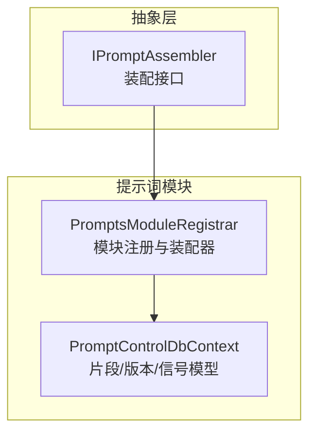
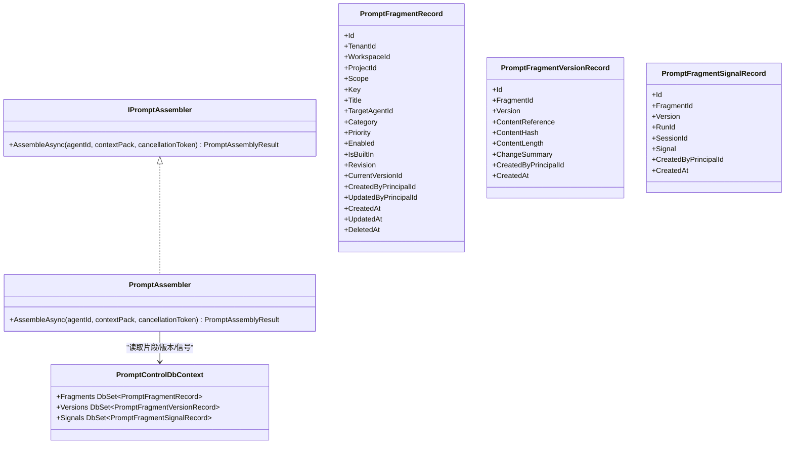
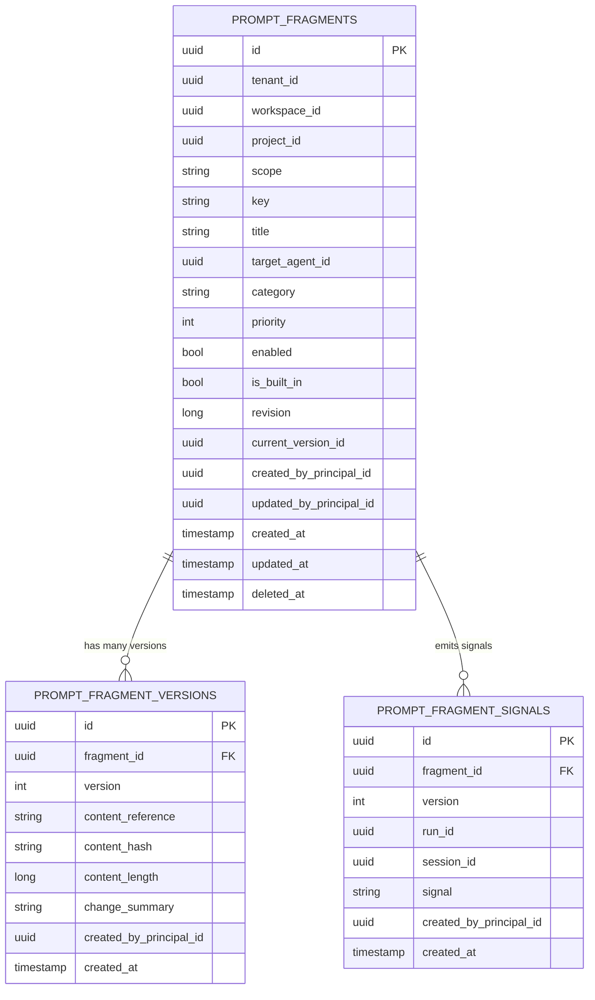
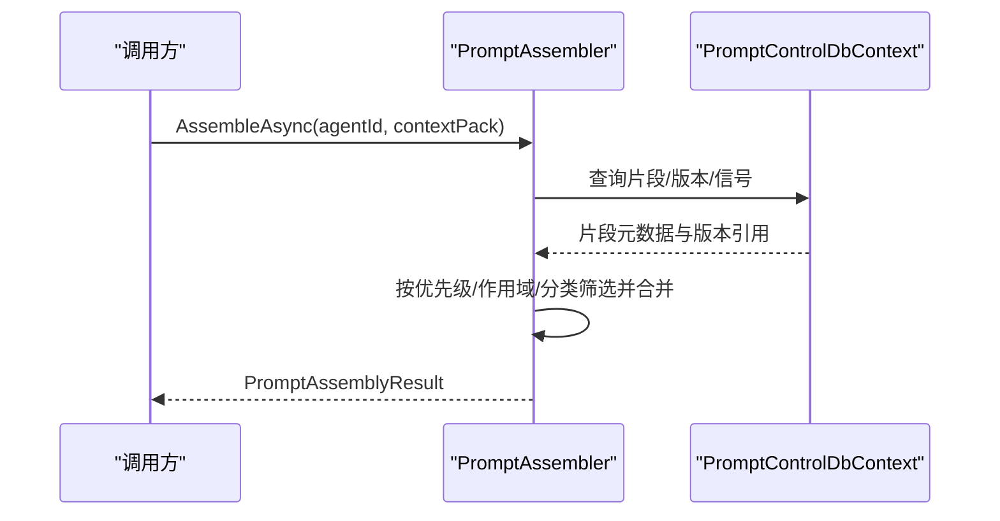
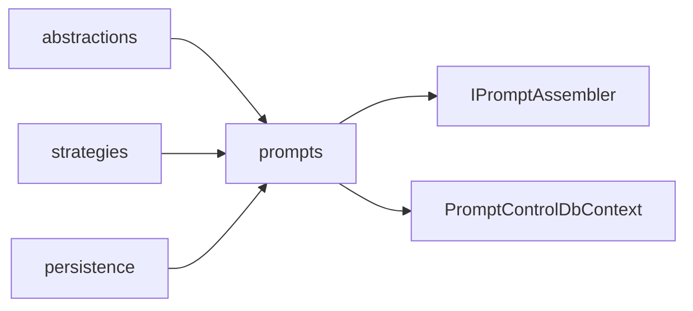

# 提示词片段管理

<cite>
**本文引用的文件**   
- [IPromptAssembler.cs](file://TinadecCore/Abstractions/Ports/IPromptAssembler.cs)
- [PromptControlDbContext.cs](file://TinadecCore/Prompts/PromptControlDbContext.cs)
- [PromptsModuleRegistrar.cs](file://TinadecCore/Prompts/PromptsModuleRegistrar.cs)
</cite>

## 目录
1. [简介](#简介)
2. [项目结构](#项目结构)
3. [核心组件](#核心组件)
4. [架构总览](#架构总览)
5. [详细组件分析](#详细组件分析)
6. [依赖关系分析](#依赖关系分析)
7. [性能考虑](#性能考虑)
8. [故障排查指南](#故障排查指南)
9. [结论](#结论)
10. [附录](#附录)

## 简介
本文件面向“提示词片段管理”功能，围绕片段的创建、编辑、删除与查询（CRUD）、属性定义（标题、键值、作用域、分类、优先级、启用状态）、搜索与过滤、导入导出、权限控制与访问限制、模板管理与复用、以及与智能体的绑定关系和动态加载机制进行系统化说明。当前仓库中提示词模块处于骨架阶段，已提供数据模型与装配接口，但尚未实现完整的持久化与API端点。本文在现有代码基础上给出可落地的设计与扩展建议，确保后续开发有清晰的蓝图。

## 项目结构
提示词相关能力集中在 TinadecCore 的 Prompts 模块与 Abstractions.Ports 中的装配接口：
- 数据模型与数据库上下文：定义片段、版本、信号等实体及表映射
- 装配器接口与结果：定义确定性的提示词组装契约
- 模块注册：注入 DbContextFactory、迁移参与者与装配器

图表来源
- [IPromptAssembler.cs:1-23](file://TinadecCore/Abstractions/Ports/IPromptAssembler.cs#L1-L23)
- [PromptControlDbContext.cs:1-39](file://TinadecCore/Prompts/PromptControlDbContext.cs#L1-L39)
- [PromptsModuleRegistrar.cs:1-55](file://TinadecCore/Prompts/PromptsModuleRegistrar.cs#L1-L55)

章节来源
- [IPromptAssembler.cs:1-23](file://TinadecCore/Abstractions/Ports/IPromptAssembler.cs#L1-L23)
- [PromptControlDbContext.cs:1-39](file://TinadecCore/Prompts/PromptControlDbContext.cs#L1-L39)
- [PromptsModuleRegistrar.cs:1-55](file://TinadecCore/Prompts/PromptsModuleRegistrar.cs#L1-L55)

## 核心组件
- 提示词装配接口与结果
  - 接口：用于将片段、智能体指令、技能贡献与上下文打包为 ChatOptions.Instructions/AIContext
  - 结果：包含最终指令文本、预估Token数、参与片段ID列表与警告信息
- 提示词数据模型
  - 片段记录：标识、租户/工作区/项目、作用域、键、标题、目标智能体、分类、优先级、启用状态、内置标记、修订号、当前版本、审计字段、时间戳、软删除
  - 版本记录：内容引用、内容哈希、长度、变更摘要、审计字段与时间戳
  - 信号记录：片段与版本关联的运行信号（如构建、失效、预热）
- 模块注册
  - 注入 DbContextFactory、EF Core 迁移参与者、装配器实现（骨架）

章节来源
- [IPromptAssembler.cs:1-23](file://TinadecCore/Abstractions/Ports/IPromptAssembler.cs#L1-L23)
- [PromptControlDbContext.cs:1-39](file://TinadecCore/Prompts/PromptControlDbContext.cs#L1-L39)
- [PromptsModuleRegistrar.cs:1-55](file://TinadecCore/Prompts/PromptsModuleRegistrar.cs#L1-L55)

## 架构总览
提示词模块通过装配器对外暴露确定性组装能力；数据层由 EF Core 上下文管理片段、版本与信号三张表；模块注册负责基础设施接入。

图表来源
- [IPromptAssembler.cs:1-23](file://TinadecCore/Abstractions/Ports/IPromptAssembler.cs#L1-L23)
- [PromptsModuleRegistrar.cs:38-54](file://TinadecCore/Prompts/PromptsModuleRegistrar.cs#L38-L54)
- [PromptControlDbContext.cs:5-33](file://TinadecCore/Prompts/PromptControlDbContext.cs#L5-L33)

## 详细组件分析

### 数据模型与持久化
- 片段主表（prompt_fragments）
  - 唯一索引：(tenant_id, workspace_id, project_id, key, target_agent_id, deleted_at)
  - 关键字段：scope（作用域）、key（键）、title（标题）、category（分类）、priority（优先级）、enabled（启用状态）、is_built_in（是否内置）、revision（修订号）、current_version_id（当前版本）
- 版本表（prompt_fragment_versions）
  - 唯一索引：(fragment_id, version)
  - 关键字段：content_reference（内容引用）、content_hash（内容哈希）、content_length（长度）、change_summary（变更摘要）
- 信号表（prompt_fragment_signals）
  - 索引：(fragment_id, version, created_at)
  - 关键字段：signal（信号类型）、run_id、session_id

图表来源
- [PromptControlDbContext.cs:14-31](file://TinadecCore/Prompts/PromptControlDbContext.cs#L14-L31)

章节来源
- [PromptControlDbContext.cs:14-31](file://TinadecCore/Prompts/PromptControlDbContext.cs#L14-L31)

### 装配器与动态加载
- 装配器接口定义了 AssembleAsync 方法，输入 agentId 与 ContextPack，输出组装后的 Instructions、预估 Token、片段ID集合与警告
- 当前实现为骨架，返回空指令与警告，便于后续扩展为从数据库加载片段并按规则合并

图表来源
- [IPromptAssembler.cs:10-14](file://TinadecCore/Abstractions/Ports/IPromptAssembler.cs#L10-L14)
- [PromptsModuleRegistrar.cs:38-54](file://TinadecCore/Prompts/PromptsModuleRegistrar.cs#L38-L54)

章节来源
- [IPromptAssembler.cs:1-23](file://TinadecCore/Abstractions/Ports/IPromptAssembler.cs#L1-L23)
- [PromptsModuleRegistrar.cs:38-54](file://TinadecCore/Prompts/PromptsModuleRegistrar.cs#L38-L54)

### 片段属性与约束
- 标题（title）：人类可读名称，最大长度512
- 键值（key）：片段唯一标识，最大长度256
- 作用域（scope）：全局或智能体特定（示例默认值为 workspace）
- 分类（category）：片段归类，最大长度128
- 优先级（priority）：整数，用于排序与选择
- 启用状态（enabled）：布尔，控制是否参与组装
- 其他：内置标记、修订号、当前版本、审计字段、时间戳、软删除

章节来源
- [PromptControlDbContext.cs:14-20](file://TinadecCore/Prompts/PromptControlDbContext.cs#L14-L20)
- [PromptControlDbContext.cs:36-38](file://TinadecCore/Prompts/PromptControlDbContext.cs#L36-L38)

### 搜索与过滤
- 基于唯一索引与常用查询条件，推荐支持以下筛选维度：
  - 名称/键值模糊匹配（title/key）
  - 作用域（scope）
  - 分类（category）
  - 目标智能体（target_agent_id）
  - 启用状态（enabled）
  - 租户/工作区/项目（tenant_id/workspace_id/project_id）
- 建议分页与排序（priority、updated_at），并提供全文检索扩展（如向量或全文索引）以增强体验

[本节为设计建议，不直接分析具体文件]

### 导入与导出
- 导入
  - 批量创建/更新片段与版本，支持冲突策略（覆盖/跳过/合并）
  - 校验 key 唯一性与作用域约束，生成变更摘要与版本号
- 导出
  - 按条件导出片段元数据与版本内容引用，支持 JSON/CSV 格式
  - 导出前进行权限校验与脱敏（如有敏感字段）

[本节为设计建议，不直接分析具体文件]

### 权限控制与访问限制
- 多租户隔离：基于 tenant_id 强制过滤
- 作用域控制：workspace/project/agent 级别可见性
- 操作权限：创建/编辑/删除需具备相应角色或资源权限
- 审计追踪：记录创建者、更新者与时间戳

[本节为设计建议，不直接分析具体文件]

### 模板管理与复用
- 模板即片段：将常用片段标记为模板（可通过 category 或 is_built_in 区分）
- 复用方式：通过 key 引用或复制为新片段，保留版本历史
- 模板发布：通过信号机制触发预热或缓存刷新

[本节为设计建议，不直接分析具体文件]

### 与智能体的绑定与动态加载
- 绑定关系：target_agent_id 明确片段对某智能体的适用性
- 动态加载：装配时根据 agentId 与上下文动态选择片段，按优先级与作用域合并
- 运行时信号：通过信号表记录构建/失效事件，驱动缓存或热更新

章节来源
- [PromptControlDbContext.cs:14-20](file://TinadecCore/Prompts/PromptControlDbContext.cs#L14-L20)
- [PromptControlDbContext.cs:27-31](file://TinadecCore/Prompts/PromptControlDbContext.cs#L27-L31)

## 依赖关系分析
- 模块依赖
  - prompts 模块依赖 abstractions、strategies、persistence
- 服务注册
  - 注入 DbContextFactory、迁移参与者、装配器实现

图表来源
- [PromptsModuleRegistrar.cs:21-30](file://TinadecCore/Prompts/PromptsModuleRegistrar.cs#L21-L30)

章节来源
- [PromptsModuleRegistrar.cs:21-30](file://TinadecCore/Prompts/PromptsModuleRegistrar.cs#L21-L30)

## 性能考虑
- 索引优化：充分利用唯一索引与复合索引提升查询效率
- 版本去重：通过 content_hash 避免重复存储大文本
- 分页与懒加载：列表查询分页，详情按需加载版本内容
- 缓存策略：热点片段缓存（按 agentId+scope+category 维度）
- 异步处理：导入/导出与信号处理采用异步任务

[本节为通用建议，不直接分析具体文件]

## 故障排查指南
- 常见问题
  - 键值冲突：检查唯一索引 (tenant_id, workspace_id, project_id, key, target_agent_id, deleted_at)
  - 版本不一致：确认 current_version_id 与版本表一致
  - 作用域错误：验证 scope 取值与上下文环境匹配
- 定位手段
  - 查看信号表记录，定位构建/失效事件
  - 使用审计字段追踪变更来源与时间
  - 校验 content_hash 一致性，排查内容篡改或损坏

章节来源
- [PromptControlDbContext.cs:14-20](file://TinadecCore/Prompts/PromptControlDbContext.cs#L14-L20)
- [PromptControlDbContext.cs:27-31](file://TinadecCore/Prompts/PromptControlDbContext.cs#L27-L31)

## 结论
当前提示词模块提供了清晰的数据模型与装配接口，奠定了片段管理的坚实基础。下一步应优先实现 CRUD 与搜索过滤、导入导出、权限控制与模板复用，并完善与智能体的绑定与动态加载逻辑，使片段能够在运行时被高效、安全地组装与使用。

## 附录
- 术语
  - 片段：可复用的提示词单元，具备元数据与版本历史
  - 作用域：片段生效范围（全局/工作区/项目/智能体）
  - 信号：片段生命周期事件（构建、失效、预热）
- 扩展建议
  - 引入全文检索与语义相似度匹配
  - 增加片段依赖图与冲突检测
  - 提供可视化编辑器与差异对比

[本节为概念性内容，不直接分析具体文件]