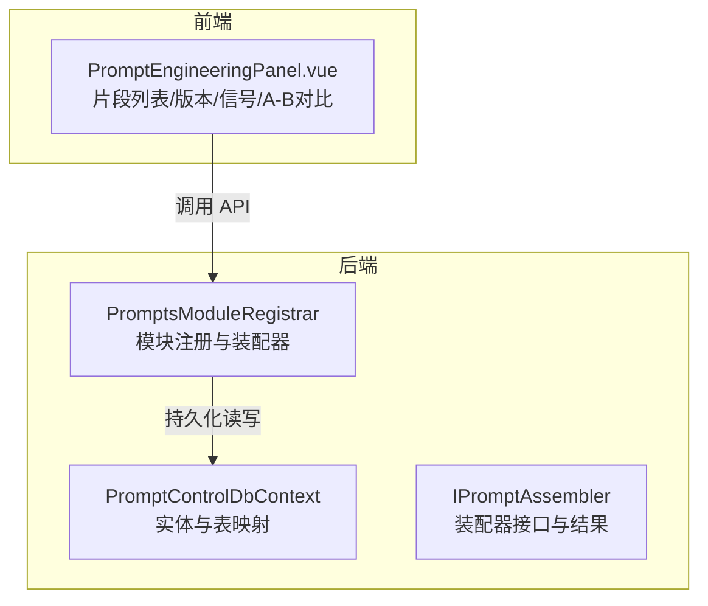
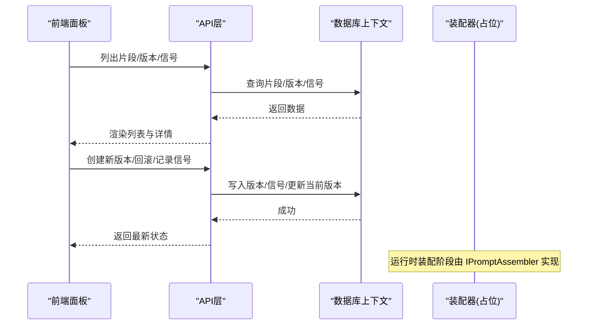
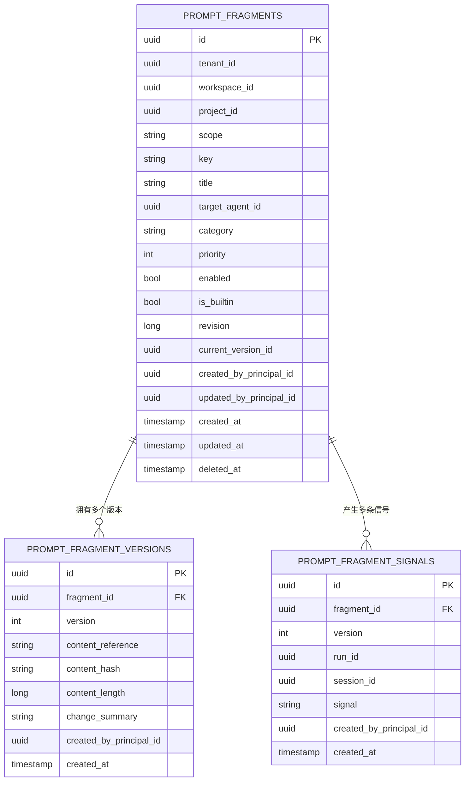
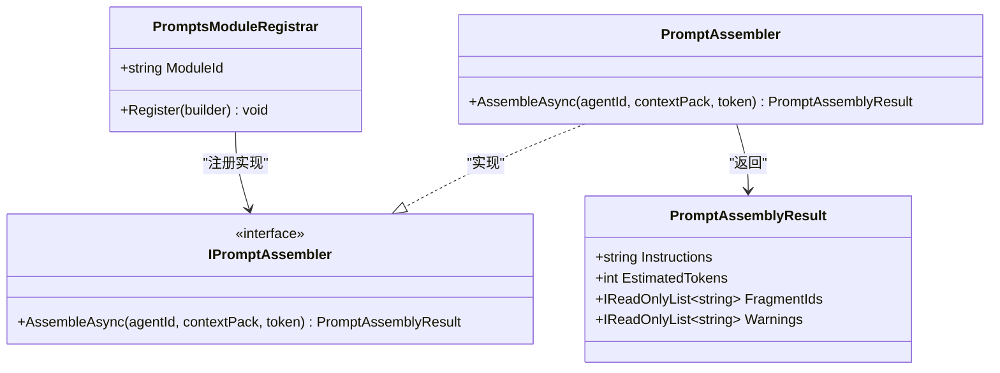
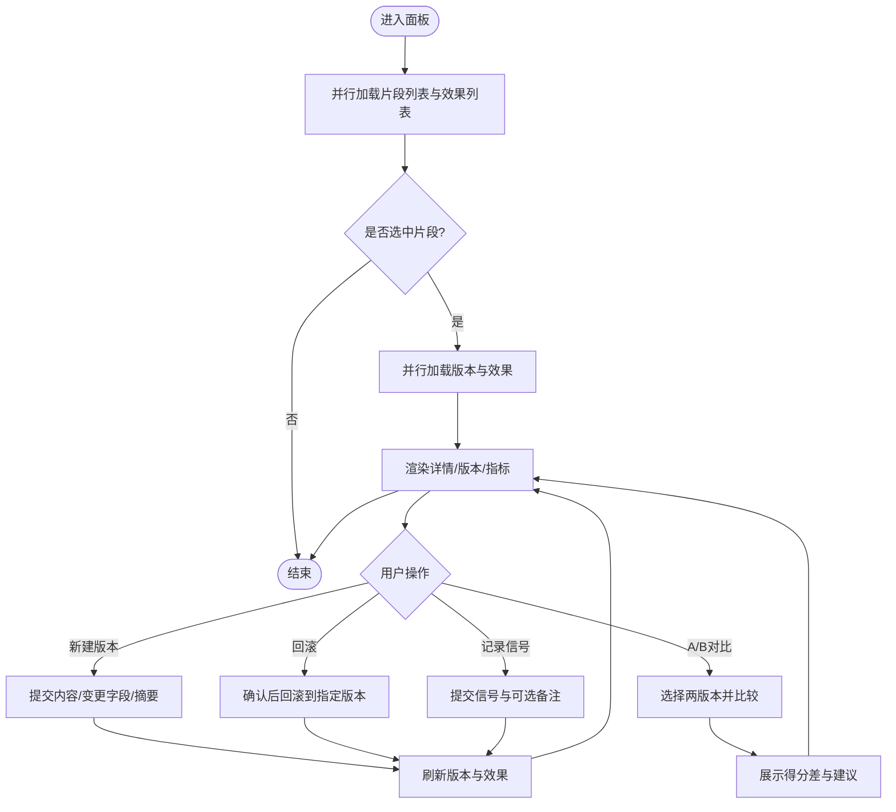
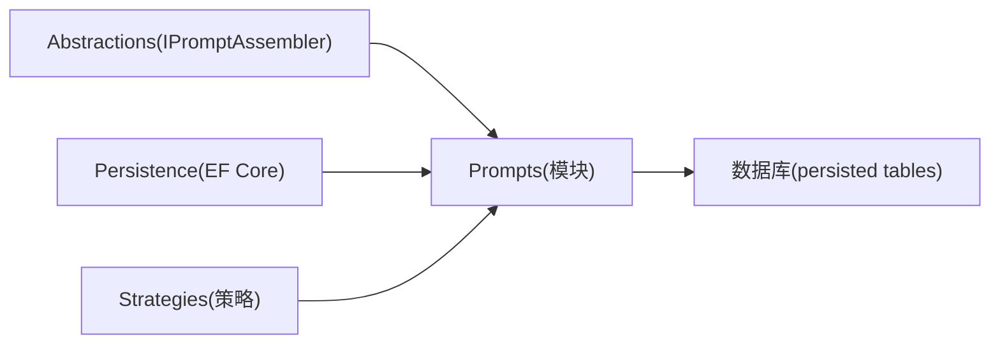

# 提示词设置

<cite>
**本文引用的文件**
- [PromptControlDbContext.cs](file://TinadecCore/Prompts/PromptControlDbContext.cs)
- [PromptsModuleRegistrar.cs](file://TinadecCore/Prompts/PromptsModuleRegistrar.cs)
- [IPromptAssembler.cs](file://TinadecCore/Abstractions/Ports/IPromptAssembler.cs)
- [PromptEngineeringPanel.vue](file://apps/desktop/src/components/PromptEngineeringPanel.vue)
</cite>

## 目录
1. [简介](#简介)
2. [项目结构](#项目结构)
3. [核心组件](#核心组件)
4. [架构总览](#架构总览)
5. [详细组件分析](#详细组件分析)
6. [依赖关系分析](#依赖关系分析)
7. [性能考量](#性能考量)
8. [故障排查指南](#故障排查指南)
9. [结论](#结论)
10. [附录](#附录)

## 简介
本模块为“提示词设置”提供完整的后端数据模型、模块注册与前端工程化面板，支持：
- 按作用域（全局/工作区/智能体特定）、分类与优先级组织提示词片段
- 版本快照、变更追踪与回滚
- 信号采集与效果评估（A/B 对比）
- 预览与编辑（当前以文本编辑为主，后续可扩展富文本能力）
- 与智能体的绑定关系与动态加载接口（通过装配器抽象预留）

该文档面向产品、研发与运维人员，既提供高层概览，也给出代码级结构与流程说明。

## 项目结构
提示词相关代码主要分布在以下位置：
- 后端数据模型与数据库上下文：TinadecCore/Prompts
- 模块注册与装配器抽象：TinadecCore/Abstractions/Ports
- 前端工程化面板：apps/desktop/src/components/PromptEngineeringPanel.vue

图表来源
- [PromptControlDbContext.cs:1-39](file://TinadecCore/Prompts/PromptControlDbContext.cs#L1-L39)
- [PromptsModuleRegistrar.cs:1-55](file://TinadecCore/Prompts/PromptsModuleRegistrar.cs#L1-L55)
- [IPromptAssembler.cs:1-23](file://TinadecCore/Abstractions/Ports/IPromptAssembler.cs#L1-L23)
- [PromptEngineeringPanel.vue:1-200](file://apps/desktop/src/components/PromptEngineeringPanel.vue#L1-L200)

章节来源
- [PromptControlDbContext.cs:1-39](file://TinadecCore/Prompts/PromptControlDbContext.cs#L1-L39)
- [PromptsModuleRegistrar.cs:1-55](file://TinadecCore/Prompts/PromptsModuleRegistrar.cs#L1-L55)
- [IPromptAssembler.cs:1-23](file://TinadecCore/Abstractions/Ports/IPromptAssembler.cs#L1-L23)
- [PromptEngineeringPanel.vue:1-200](file://apps/desktop/src/components/PromptEngineeringPanel.vue#L1-L200)

## 核心组件
- 数据模型与存储
  - 片段主记录：包含租户/工作区/项目、作用域、键、标题、目标智能体、分类、优先级、启用状态、内置标记、修订号、当前版本等
  - 版本记录：内容引用、哈希、长度、变更摘要、创建人及时间
  - 信号记录：片段ID、版本、运行/会话ID、信号类型、创建信息
- 模块注册与装配器
  - 模块元数据、依赖声明、能力声明
  - 装配器接口定义与返回结果（指令、预估Token、片段ID集合、警告）
- 前端工程化面板
  - 片段列表、详情、版本历史、信号记录、A/B 对比、效果概览

章节来源
- [PromptControlDbContext.cs:14-31](file://TinadecCore/Prompts/PromptControlDbContext.cs#L14-L31)
- [PromptControlDbContext.cs:36-38](file://TinadecCore/Prompts/PromptControlDbContext.cs#L36-L38)
- [PromptsModuleRegistrar.cs:16-31](file://TinadecCore/Prompts/PromptsModuleRegistrar.cs#L16-L31)
- [PromptsModuleRegistrar.cs:38-54](file://TinadecCore/Prompts/PromptsModuleRegistrar.cs#L38-L54)
- [IPromptAssembler.cs:8-22](file://TinadecCore/Abstractions/Ports/IPromptAssembler.cs#L8-L22)
- [PromptEngineeringPanel.vue:83-135](file://apps/desktop/src/components/PromptEngineeringPanel.vue#L83-L135)

## 架构总览
提示词系统采用“前后端分离 + 模块化装配”的架构：
- 前端通过 API 管理片段、版本、信号与对比
- 后端通过 EF Core 上下文维护片段、版本与信号三张表
- 模块注册器暴露装配器接口，供运行时将片段与上下文组装为最终指令

图表来源
- [PromptEngineeringPanel.vue:136-229](file://apps/desktop/src/components/PromptEngineeringPanel.vue#L136-L229)
- [PromptControlDbContext.cs:12-31](file://TinadecCore/Prompts/PromptControlDbContext.cs#L12-L31)
- [PromptsModuleRegistrar.cs:38-54](file://TinadecCore/Prompts/PromptsModuleRegistrar.cs#L38-L54)

## 详细组件分析

### 数据模型与持久化
- 片段主记录字段与作用域
  - 作用域：workspace（可拓展至 global/skill/agent 等）
  - 分类：用于分组与筛选
  - 优先级：影响装配顺序
  - 目标智能体：绑定到具体智能体
  - 内置标记：区分系统内置与用户自定义
  - 唯一索引：租户/工作区/项目/键/目标智能体/删除时间
- 版本记录
  - 版本序列号唯一性约束
  - 内容哈希与长度便于去重与统计
- 信号记录
  - 关联片段与版本，支持运行/会话维度归因

图表来源
- [PromptControlDbContext.cs:14-31](file://TinadecCore/Prompts/PromptControlDbContext.cs#L14-L31)
- [PromptControlDbContext.cs:36-38](file://TinadecCore/Prompts/PromptControlDbContext.cs#L36-L38)

章节来源
- [PromptControlDbContext.cs:14-31](file://TinadecCore/Prompts/PromptControlDbContext.cs#L14-L31)
- [PromptControlDbContext.cs:36-38](file://TinadecCore/Prompts/PromptControlDbContext.cs#L36-L38)

### 模块注册与装配器
- 模块注册器
  - 声明模块ID、版本、依赖、能力（片段装配、智能体指令、技能贡献、确定性装配）
  - 注入数据库上下文工厂与迁移参与者
  - 注册装配器实例
- 装配器接口
  - 输入：智能体ID、上下文包
  - 输出：指令文本、预估Token、使用的片段ID、警告信息
  - 当前骨架实现返回空指令与警告，待完善

图表来源
- [PromptsModuleRegistrar.cs:16-31](file://TinadecCore/Prompts/PromptsModuleRegistrar.cs#L16-L31)
- [PromptsModuleRegistrar.cs:38-54](file://TinadecCore/Prompts/PromptsModuleRegistrar.cs#L38-L54)
- [IPromptAssembler.cs:8-22](file://TinadecCore/Abstractions/Ports/IPromptAssembler.cs#L8-L22)

章节来源
- [PromptsModuleRegistrar.cs:16-31](file://TinadecCore/Prompts/PromptsModuleRegistrar.cs#L16-L31)
- [PromptsModuleRegistrar.cs:38-54](file://TinadecCore/Prompts/PromptsModuleRegistrar.cs#L38-L54)
- [IPromptAssembler.cs:8-22](file://TinadecCore/Abstractions/Ports/IPromptAssembler.cs#L8-L22)

### 前端工程化面板（版本、信号、A/B 对比）
- 功能清单
  - 片段列表与选择
  - 版本历史展示与新建版本
  - 回滚到指定版本
  - 记录正/负信号并刷新效果
  - A/B 比较两个版本的得分与建议
  - 效果概览（排序与可视化）
- 交互流程
  - 初始化时并行拉取片段列表与效果列表
  - 选择片段后并行拉取版本与单片段效果
  - 创建版本时提交内容与变更字段、变更摘要
  - 回滚前二次确认，成功后刷新本地与详情
  - 记录信号后刷新局部与全局效果
  - A/B 比较时校验版本不同并展示差异与建议

图表来源
- [PromptEngineeringPanel.vue:83-135](file://apps/desktop/src/components/PromptEngineeringPanel.vue#L83-L135)
- [PromptEngineeringPanel.vue:136-229](file://apps/desktop/src/components/PromptEngineeringPanel.vue#L136-L229)

章节来源
- [PromptEngineeringPanel.vue:83-135](file://apps/desktop/src/components/PromptEngineeringPanel.vue#L83-L135)
- [PromptEngineeringPanel.vue:136-229](file://apps/desktop/src/components/PromptEngineeringPanel.vue#L136-L229)

### 提示词编辑器与预览（现状与扩展建议）
- 现状
  - 当前使用文本域进行查看与编辑，未实现富文本、变量插值、条件逻辑与模板语法
  - 预览为静态文本展示，无实时渲染与多智能体上下文模拟
- 建议扩展
  - 引入富文本编辑器，支持变量插值（如 {{var}}）、条件逻辑（if/else）、模板语法（for/include）
  - 增加实时预览区域，支持多智能体上下文注入与差异化渲染
  - 提供语法校验与高亮、错误定位与修复建议

[本节为概念性说明，不直接分析具体文件]

### 提示词质量评估与 A/B 测试
- 信号采集
  - 支持正/负信号，可关联版本与备注
  - 服务端聚合生成效果分数、活跃版本、调用次数等指标
- A/B 对比
  - 选择两个版本，计算得分差异与建议
  - 前端可视化呈现推荐策略

章节来源
- [PromptEngineeringPanel.vue:191-229](file://apps/desktop/src/components/PromptEngineeringPanel.vue#L191-L229)
- [PromptEngineeringPanel.vue:436-485](file://apps/desktop/src/components/PromptEngineeringPanel.vue#L436-L485)

### 版本控制、变更追踪与回滚机制
- 版本快照
  - 每次创建版本记录内容引用、哈希、长度与变更摘要
  - 变更字段可多选（content/priority/enabled 等）
- 回滚
  - 前端二次确认，后端更新当前版本指向目标版本
  - 保持历史可追溯

章节来源
- [PromptEngineeringPanel.vue:144-164](file://apps/desktop/src/components/PromptEngineeringPanel.vue#L144-L164)
- [PromptEngineeringPanel.vue:166-189](file://apps/desktop/src/components/PromptEngineeringPanel.vue#L166-L189)

### 提示词与智能体的绑定与动态加载
- 绑定关系
  - 片段主记录包含目标智能体ID，支持按智能体筛选与装配
- 动态加载
  - 通过 IPromptAssembler.AssembleAsync 在运行时根据智能体ID与上下文包组装指令
  - 当前为骨架实现，待填充实际装配逻辑

章节来源
- [PromptControlDbContext.cs:14-20](file://TinadecCore/Prompts/PromptControlDbContext.cs#L14-L20)
- [IPromptAssembler.cs:8-14](file://TinadecCore/Abstractions/Ports/IPromptAssembler.cs#L8-L14)
- [PromptsModuleRegistrar.cs:38-54](file://TinadecCore/Prompts/PromptsModuleRegistrar.cs#L38-L54)

## 依赖关系分析
- 模块依赖
  - prompts 模块依赖 abstractions、strategies、persistence
- 运行时装配
  - 通过 IModuleRegistrar 统一注册，装配器对外暴露 AssembleAsync
- 数据依赖
  - 片段、版本、信号三表强关联，版本与信号均依赖片段ID

图表来源
- [PromptsModuleRegistrar.cs:21-30](file://TinadecCore/Prompts/PromptsModuleRegistrar.cs#L21-L30)
- [PromptControlDbContext.cs:12-31](file://TinadecCore/Prompts/PromptControlDbContext.cs#L12-L31)

章节来源
- [PromptsModuleRegistrar.cs:21-30](file://TinadecCore/Prompts/PromptsModuleRegistrar.cs#L21-L30)
- [PromptControlDbContext.cs:12-31](file://TinadecCore/Prompts/PromptControlDbContext.cs#L12-L31)

## 性能考量
- 数据库层面
  - 合理索引：片段唯一索引、版本唯一索引、信号复合索引已配置
  - 内容哈希与长度：避免重复存储与快速比对
- 前端层面
  - 并行请求减少首屏等待
  - 列表分页与懒加载（建议）
- 装配器层面
  - 缓存片段与上下文解析结果（建议）
  - 增量组装与流式输出（建议）

[本节为通用指导，不直接分析具体文件]

## 故障排查指南
- 常见问题
  - 无法加载片段或版本：检查 API 连通性与权限
  - 创建版本失败：校验必填字段与变更字段格式
  - 回滚失败：确认目标版本存在且未被删除
  - 信号记录无效：确认版本选择与片段ID正确
- 调试建议
  - 打开浏览器网络面板查看请求与响应
  - 检查数据库表记录一致性（片段-版本-信号）
  - 关注装配器警告信息（当前骨架会返回警告）

章节来源
- [PromptEngineeringPanel.vue:96-107](file://apps/desktop/src/components/PromptEngineeringPanel.vue#L96-L107)
- [PromptEngineeringPanel.vue:159-164](file://apps/desktop/src/components/PromptEngineeringPanel.vue#L159-L164)
- [PromptEngineeringPanel.vue:184-189](file://apps/desktop/src/components/PromptEngineeringPanel.vue#L184-L189)
- [PromptEngineeringPanel.vue:206-211](file://apps/desktop/src/components/PromptEngineeringPanel.vue#L206-L211)
- [PromptsModuleRegistrar.cs:45-52](file://TinadecCore/Prompts/PromptsModuleRegistrar.cs#L45-L52)

## 结论
本模块已具备提示词片段的完整生命周期管理能力（创建、版本化、信号采集、效果评估与A/B对比），并通过装配器接口预留了运行时动态装配能力。下一步重点在于完善装配器实现、增强编辑器富文本与预览能力、优化性能与可用性。

[本节为总结性内容，不直接分析具体文件]

## 附录
- 最佳实践
  - 明确作用域与分类，避免碎片化
  - 合理使用优先级，确保关键指令优先生效
  - 每次变更保留清晰的变更摘要与变更字段
  - 通过信号与A/B对比持续优化提示词质量
- 导入导出与批量编辑
  - 当前未实现，建议基于片段列表与版本接口扩展批量操作与CSV/JSON导入导出
- 搜索与过滤
  - 建议按作用域、分类、关键词、启用状态、目标智能体等多维度检索

[本节为补充说明，不直接分析具体文件]