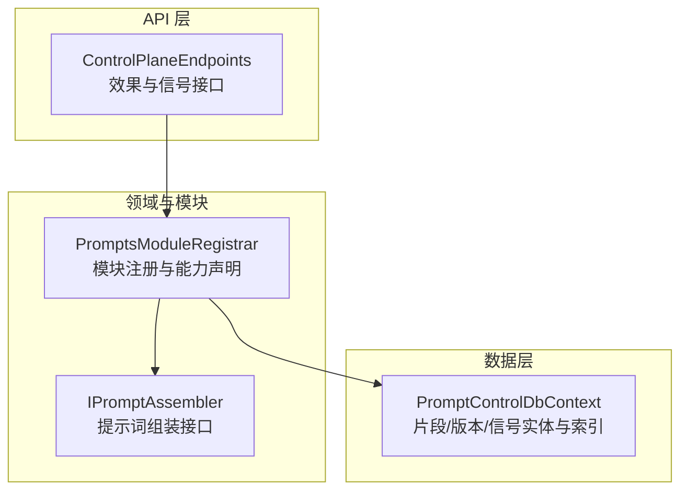
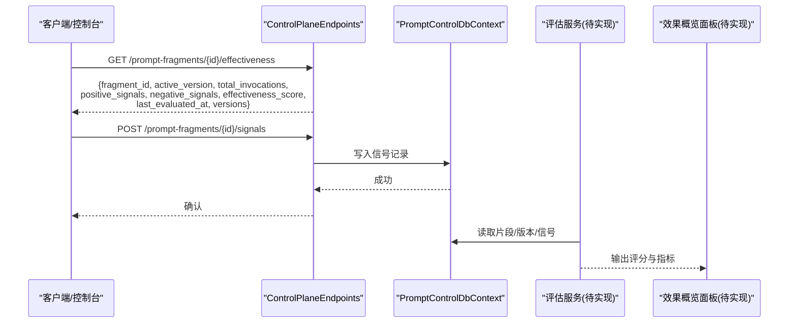
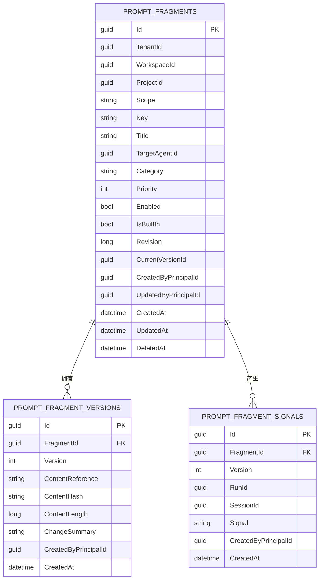
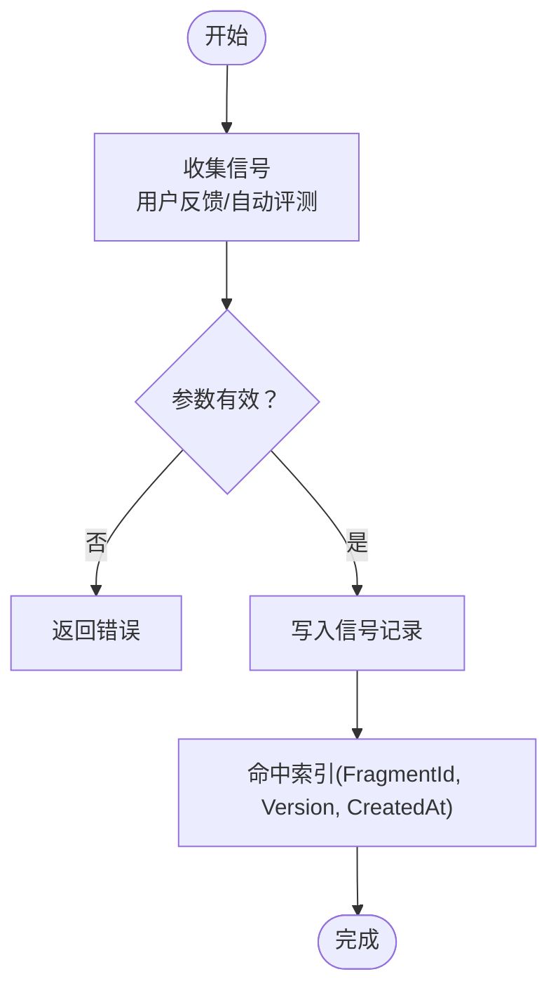
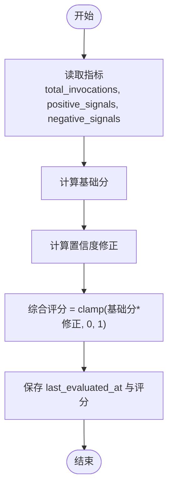
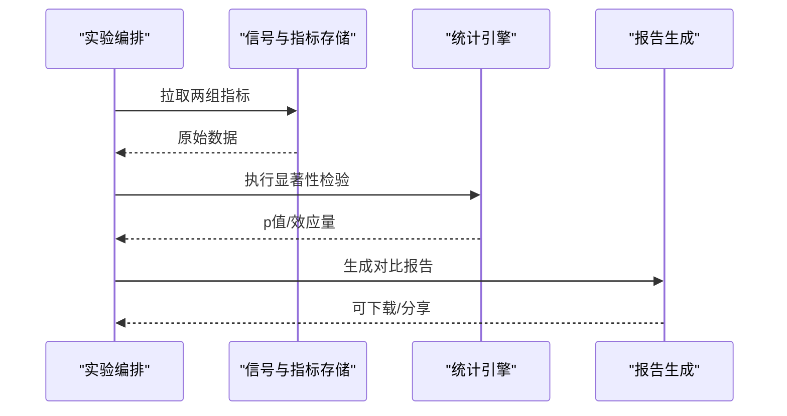
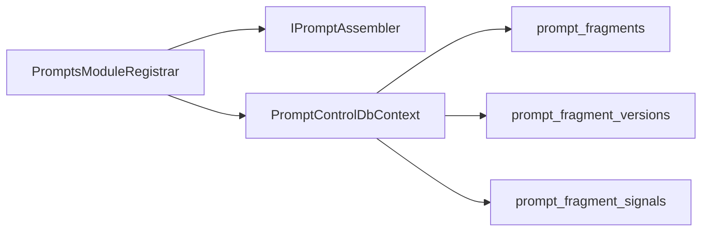

# 效果评估与信号追踪

<cite>
**本文引用的文件**   
- [ControlPlaneEndpoints.cs](file://TinadecCore/Api/Endpoints/ControlPlaneEndpoints.cs)
- [PromptControlDbContext.cs](file://TinadecCore/Prompts/PromptControlDbContext.cs)
- [PromptsModuleRegistrar.cs](file://TinadecCore/Prompts/PromptsModuleRegistrar.cs)
- [IPromptAssembler.cs](file://TinadecCore/Abstractions/Ports/IPromptAssembler.cs)
</cite>

## 目录
1. [简介](#简介)
2. [项目结构](#项目结构)
3. [核心组件](#核心组件)
4. [架构总览](#架构总览)
5. [详细组件分析](#详细组件分析)
6. [依赖关系分析](#依赖关系分析)
7. [性能考量](#性能考量)
8. [故障排查指南](#故障排查指南)
9. [结论](#结论)
10. [附录](#附录)

## 简介
本文件面向“提示词效果评估系统”，围绕正向/负向信号记录、用户反馈与自动评估、综合评分算法、效果概览面板、A/B测试与统计显著性、趋势分析与性能监控、数据导出与报告生成、阈值设置与告警机制进行系统化说明。当前仓库已提供效果评估的API契约与持久化模型骨架，为后续实现完整评估管线奠定基础。

## 项目结构
与效果评估相关的关键位置：
- API层：控制平面端点定义效果查询与信号上报接口（占位实现）
- 数据层：EF Core DbContext 定义提示词片段、版本与信号的表结构与索引
- 模块注册：提示词模块装配与能力声明（骨架状态）
- 抽象端口：提示词组装接口与结果类型

**图表来源** 
- [ControlPlaneEndpoints.cs:20-32](file://TinadecCore/Api/Endpoints/ControlPlaneEndpoints.cs#L20-L32)
- [PromptsModuleRegistrar.cs:12-31](file://TinadecCore/Prompts/PromptsModuleRegistrar.cs#L12-L31)
- [IPromptAssembler.cs:8-22](file://TinadecCore/Abstractions/Ports/IPromptAssembler.cs#L8-L22)
- [PromptControlDbContext.cs:5-34](file://TinadecCore/Prompts/PromptControlDbContext.cs#L5-L34)

**章节来源**
- [ControlPlaneEndpoints.cs:20-32](file://TinadecCore/Api/Endpoints/ControlPlaneEndpoints.cs#L20-L32)
- [PromptControlDbContext.cs:5-34](file://TinadecCore/Prompts/PromptControlDbContext.cs#L5-L34)
- [PromptsModuleRegistrar.cs:12-31](file://TinadecCore/Prompts/PromptsModuleRegistrar.cs#L12-L31)
- [IPromptAssembler.cs:8-22](file://TinadecCore/Abstractions/Ports/IPromptAssembler.cs#L8-L22)

## 核心组件
- 效果评估API契约
  - 单片段效果查询：返回活跃版本、调用次数、正/负信号计数、综合评分、最近评估时间、版本列表等
  - 批量效果查询：返回所有片段的效果概览
  - 信号上报：用于记录正向/负向信号（当前为占位，需结合运行上下文）
  - 对比接口：用于A/B测试（当前为占位，需版本遥测）
- 数据模型
  - 片段实体：标识、键、标题、作用域、分类、优先级、启用状态、内置标记、修订号、当前版本ID、创建/更新人、时间戳、软删除
  - 版本实体：内容引用、内容哈希、长度、变更摘要、创建人、时间戳；唯一索引(片段ID, 版本)
  - 信号实体：片段ID、版本、运行ID、会话ID、信号值、创建人、时间戳；索引(片段ID, 版本, 创建时间)
- 模块与接口
  - 提示词模块：注册数据库上下文、迁移参与者、提示词组装器，声明能力
  - 提示词组装接口：将片段、Agent指令、技能贡献与上下文组装为最终指令与元信息

**章节来源**
- [ControlPlaneEndpoints.cs:20-32](file://TinadecCore/Api/Endpoints/ControlPlaneEndpoints.cs#L20-L32)
- [PromptControlDbContext.cs:14-31](file://TinadecCore/Prompts/PromptControlDbContext.cs#L14-L31)
- [PromptControlDbContext.cs:36-38](file://TinadecCore/Prompts/PromptControlDbContext.cs#L36-L38)
- [PromptsModuleRegistrar.cs:16-31](file://TinadecCore/Prompts/PromptsModuleRegistrar.cs#L16-L31)
- [IPromptAssembler.cs:8-22](file://TinadecCore/Abstractions/Ports/IPromptAssembler.cs#L8-L22)

## 架构总览
效果评估系统的端到端流程包括：
- 运行时采集：在提示词执行链路中记录调用次数与信号（正向/负向）
- 存储与聚合：通过EF Core持久化信号与版本信息，按片段与版本维度聚合指标
- 评估计算：基于信号数量、调用次数与用户反馈计算综合评分
- 展示与分析：提供概览面板、趋势图、A/B对比与显著性检验
- 告警与导出：阈值触发告警，支持数据导出与报告生成

**图表来源** 
- [ControlPlaneEndpoints.cs:28-31](file://TinadecCore/Api/Endpoints/ControlPlaneEndpoints.cs#L28-L31)
- [PromptControlDbContext.cs:8-10](file://TinadecCore/Prompts/PromptControlDbContext.cs#L8-L10)

## 详细组件分析

### 效果评估API与数据模型
- 单片段效果查询
  - 路径：GET /api/v1/prompt-fragments/{id}/effectiveness
  - 响应字段：fragment_id、active_version、total_invocations、positive_signals、negative_signals、effectiveness_score、last_evaluated_at、versions
- 批量效果查询
  - 路径：GET /api/v1/prompt-fragments/effectiveness
- 信号上报
  - 路径：POST /api/v1/prompt-fragments/{id}/signals
  - 用途：记录正向/负向信号，需绑定运行上下文（RunId/SessionId）
- 数据模型索引
  - 片段：唯一索引(TenantId, WorkspaceId, ProjectId, Key, TargetAgentId, DeletedAt)
  - 版本：唯一索引(FragmentId, Version)
  - 信号：索引(FragmentId, Version, CreatedAt)

**图表来源** 
- [PromptControlDbContext.cs:14-31](file://TinadecCore/Prompts/PromptControlDbContext.cs#L14-L31)
- [PromptControlDbContext.cs:36-38](file://TinadecCore/Prompts/PromptControlDbContext.cs#L36-L38)

**章节来源**
- [ControlPlaneEndpoints.cs:28-31](file://TinadecCore/Api/Endpoints/ControlPlaneEndpoints.cs#L28-L31)
- [PromptControlDbContext.cs:14-31](file://TinadecCore/Prompts/PromptControlDbContext.cs#L14-L31)
- [PromptControlDbContext.cs:36-38](file://TinadecCore/Prompts/PromptControlDbContext.cs#L36-L38)

### 信号记录机制（正向/负向）
- 信号语义
  - 正向信号：例如用户点赞、采纳、修复率提升、耗时下降等
  - 负向信号：例如用户点踩、回滚、错误率上升、超时等
- 记录时机
  - 建议在提示词执行完成后，结合用户反馈或自动化评测结果写入信号
  - 必须携带FragmentId、Version、RunId/SessionId以便关联上下文
- 存储与索引
  - 使用Signals表记录，按FragmentId+Version+CreatedAt建立索引以加速聚合查询

**图表来源** 
- [PromptControlDbContext.cs:27-31](file://TinadecCore/Prompts/PromptControlDbContext.cs#L27-L31)

**章节来源**
- [PromptControlDbContext.cs:27-31](file://TinadecCore/Prompts/PromptControlDbContext.cs#L27-L31)

### 效果评分算法（建议方案）
- 输入指标
  - 调用次数 total_invocations
  - 正向信号数 positive_signals
  - 负向信号数 negative_signals
  - 可选：用户反馈权重、质量指标（如成功率、时延）
- 计算公式（示例）
  - 基础分 = (positive_signals - negative_signals) / max(total_invocations, 1)
  - 置信度修正 = f(total_invocations)，样本越多修正越大
  - 综合评分 = clamp(基础分 * 置信度修正, 0, 1)
- 评估周期
  - 实时增量更新：每次信号写入后局部重算
  - 定时批处理：对历史数据进行滚动窗口统计

[该图为概念流程图，不直接映射具体代码文件]

### A/B测试与统计显著性（建议方案）
- 实验设计
  - 同一Fragment的不同Version作为对照组与实验组
  - 随机分流或分层抽样，确保可比性
- 关键指标
  - 转化率（正向信号占比）、平均质量分、时延分布、错误率
- 显著性检验
  - 比例差异：Z检验或卡方检验
  - 均值差异：t检验或Mann-Whitney U（非参数）
- 决策规则
  - p值 < 阈值且效应量达到业务要求则采纳新版本

[该图为概念流程图，不直接映射具体代码文件]

### 效果概览面板（建议方案）
- 展示内容
  - 所有提示词的排名、评分、调用量、正/负信号比、最近评估时间
  - 筛选与排序：按评分、调用量、更新时间、分类、作用域
- 交互功能
  - 点击片段进入详情，查看趋势、版本对比、信号明细
  - 导出CSV/JSON，订阅告警通知

[该部分为概念设计，不直接映射具体代码文件]

### 趋势分析与性能监控（建议方案）
- 时间序列
  - 按日/周/月聚合评分、调用量、信号比率
  - 异常检测：滑动窗口Z-score或IQR
- 性能监控
  - 提示词组装耗时、Token估算、缓存命中率
  - 资源占用与错误率监控

[该部分为概念设计，不直接映射具体代码文件]

### 数据导出与报告生成（建议方案）
- 导出范围
  - 片段清单、版本历史、信号明细、评分与趋势
- 报告格式
  - CSV/Excel、PDF报告、Markdown摘要
- 自动化
  - 定时任务生成并归档报告，邮件/消息推送

[该部分为概念设计，不直接映射具体代码文件]

### 阈值设置与告警机制（建议方案）
- 阈值策略
  - 评分低于阈值、负信号占比超过阈值、调用量突降/突增
- 告警通道
  - 站内通知、邮件、IM机器人
- 处置流程
  - 自动降级/回滚、人工复核、复盘闭环

[该部分为概念设计，不直接映射具体代码文件]

## 依赖关系分析
- 模块依赖
  - PromptsModuleRegistrar 依赖 abstractions、strategies、persistence
- 接口依赖
  - IPromptAssembler 被模块注册为单例，供上层调用
- 数据依赖
  - PromptControlDbContext 管理三张核心表，提供CRUD与索引优化

**图表来源** 
- [PromptsModuleRegistrar.cs:21-30](file://TinadecCore/Prompts/PromptsModuleRegistrar.cs#L21-L30)
- [PromptControlDbContext.cs:8-10](file://TinadecCore/Prompts/PromptControlDbContext.cs#L8-L10)

**章节来源**
- [PromptsModuleRegistrar.cs:16-31](file://TinadecCore/Prompts/PromptsModuleRegistrar.cs#L16-L31)
- [PromptControlDbContext.cs:8-10](file://TinadecCore/Prompts/PromptControlDbContext.cs#L8-L10)

## 性能考量
- 索引优化
  - 信号表按(FragmentId, Version, CreatedAt)索引，利于按片段与版本聚合
  - 版本表唯一索引避免重复版本
- 查询策略
  - 使用分页与过滤减少大数据集传输
  - 热点片段评分增量更新，避免全量重算
- 并发与一致性
  - 信号写入采用幂等键或去重策略
  - 评分计算与写入使用事务保证一致性

[本节为通用指导，不直接分析具体文件]

## 故障排查指南
- API占位返回
  - 信号上报与对比接口当前返回“能力不可用”的结构化错误，需在运行时启用对应能力
- 数据缺失
  - 检查是否写入RunId/SessionId，确保信号可追溯
- 索引未命中
  - 确认查询条件包含FragmentId与Version，必要时添加覆盖索引

**章节来源**
- [ControlPlaneEndpoints.cs:30-31](file://TinadecCore/Api/Endpoints/ControlPlaneEndpoints.cs#L30-L31)
- [PromptControlDbContext.cs:27-31](file://TinadecCore/Prompts/PromptControlDbContext.cs#L27-L31)

## 结论
当前仓库提供了效果评估系统的API契约与数据模型骨架，明确了信号记录、版本管理与片段维度的聚合基础。下一步应优先实现信号上报与评估计算服务，完善A/B测试与显著性检验，构建概览面板与告警机制，形成从数据采集到决策闭环的完整体系。

## 附录
- 术语
  - 正向信号：体现效果改进的信号
  - 负向信号：体现效果退化的信号
  - 综合评分：融合多指标的归一化分数
  - 显著性检验：统计方法验证差异是否由随机波动导致

[本节为补充说明，不直接分析具体文件]