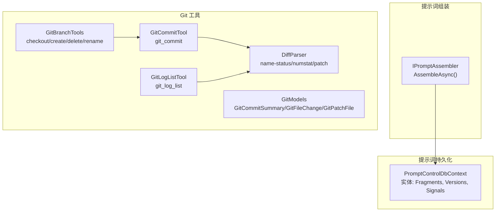
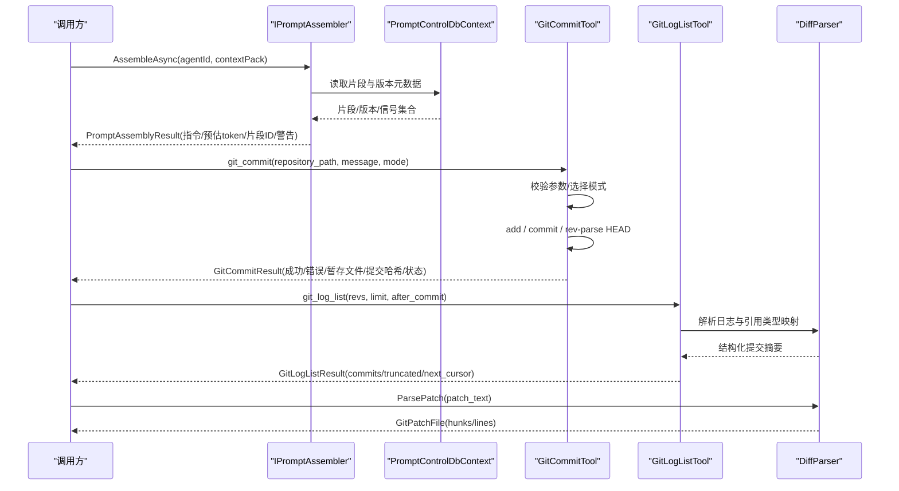
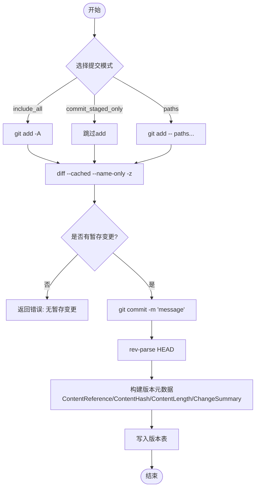
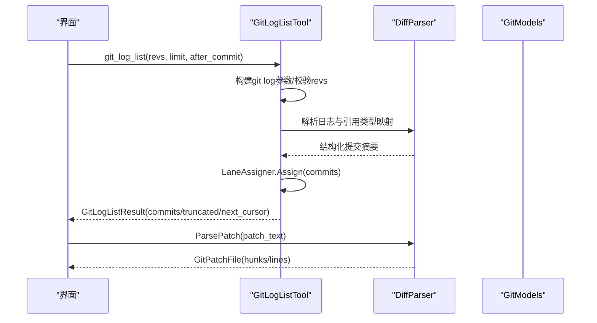
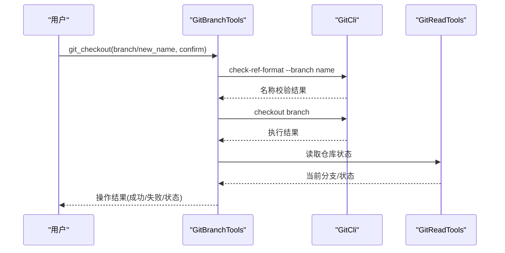
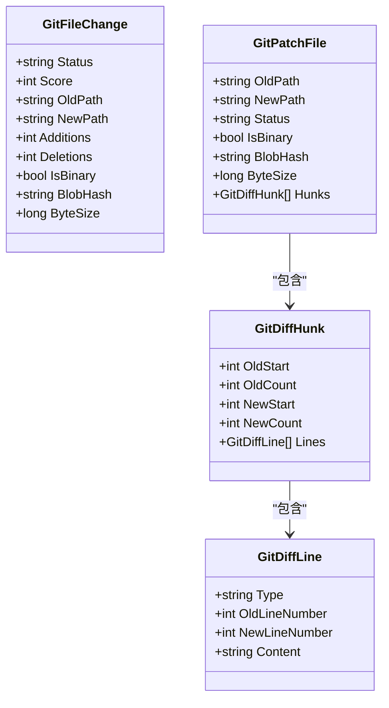
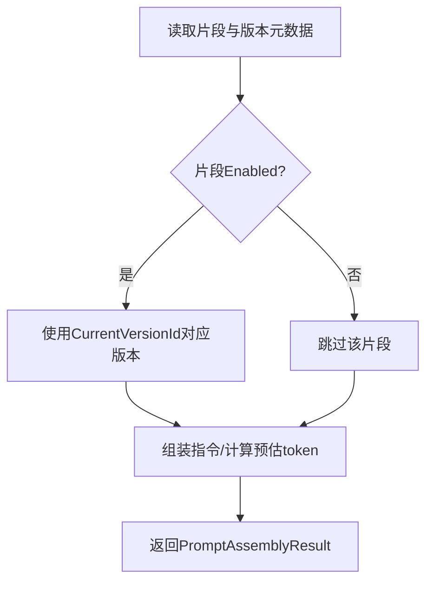
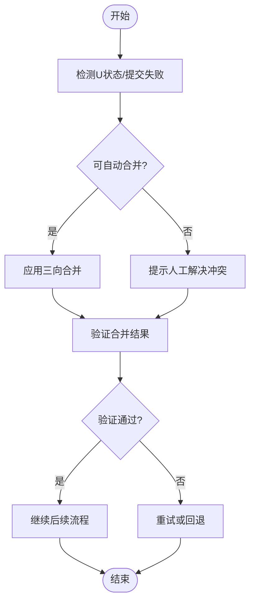
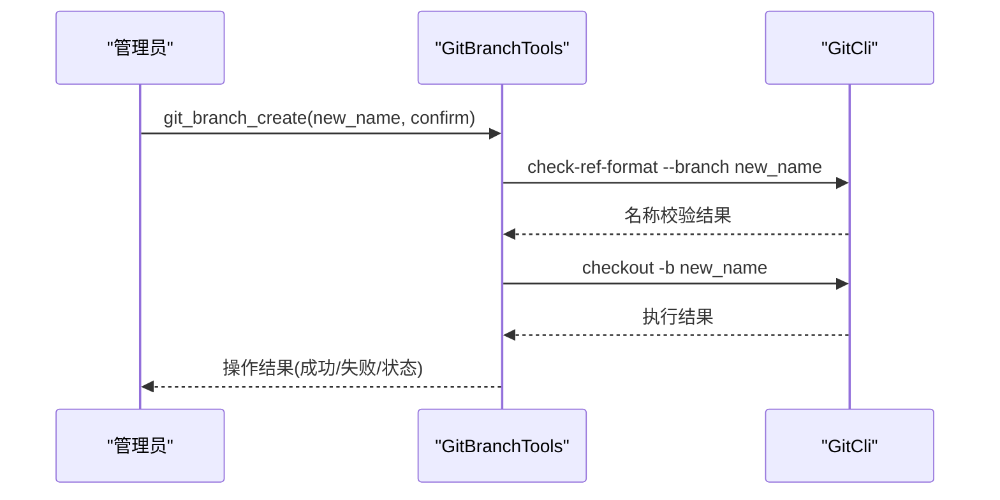
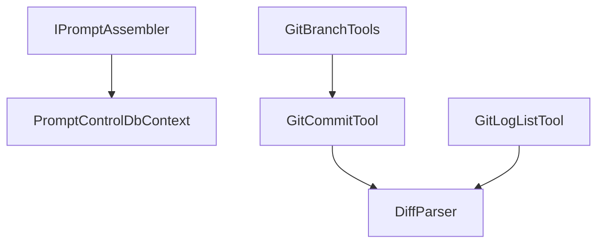

# 版本控制与变更追踪

<cite>
**本文引用的文件**
- [PromptControlDbContext.cs](file://TinadecCore/Prompts/PromptControlDbContext.cs)
- [IPromptAssembler.cs](file://TinadecCore/Abstractions/Ports/IPromptAssembler.cs)
- [GitCommitTool.cs](file://TinadecTools/Tools/Git/GitCommitTool.cs)
- [DiffParser.cs](file://TinadecTools/Tools/Git/DiffParser.cs)
- [GitModels.cs](file://TinadecTools/Tools/Git/GitModels.cs)
- [GitLogListTool.cs](file://TinadecTools/Tools/Git/GitLogListTool.cs)
- [GitBranchTools.cs](file://TinadecTools/Tools/Git/GitBranchTools.cs)
</cite>

## 目录
1. [简介](#简介)
2. [项目结构](#项目结构)
3. [核心组件](#核心组件)
4. [架构总览](#架构总览)
5. [详细组件分析](#详细组件分析)
6. [依赖关系分析](#依赖关系分析)
7. [性能考量](#性能考量)
8. [故障排查指南](#故障排查指南)
9. [结论](#结论)
10. [附录](#附录)

## 简介
本文件面向“提示词版本控制系统”的完整文档，围绕以下目标展开：
- 版本快照创建流程：内容变更检测、变更字段标记、变更摘要记录
- 版本历史查看：按时间排序、分页浏览、版本对比
- 版本回滚机制：恢复到任意历史版本并保留审计日志
- 版本差异比较：可视化展示不同版本间的变更内容
- 版本激活/停用状态管理：当前版本标识与启用开关
- 版本冲突检测与解决策略
- 版本标签与分支管理：分支切换、创建、删除、重命名

系统由两部分组成：
- 后端持久化层（EF Core）用于存储提示词片段、版本、信号等元数据
- Git 工具集用于实现代码级版本控制能力（提交、日志、差异解析、分支操作等）

## 项目结构
与版本控制相关的关键目录与文件：
- TinadecCore/Prompts：提示词片段与版本的数据库模型与上下文
- TinadecCore/Abstractions/Ports：提示词组装接口定义
- TinadecTools/Tools/Git：Git 工具封装（提交、日志、差异、分支、合并等）

图表来源
- [PromptControlDbContext.cs:1-39](file://TinadecCore/Prompts/PromptControlDbContext.cs#L1-L39)
- [IPromptAssembler.cs:1-23](file://TinadecCore/Abstractions/Ports/IPromptAssembler.cs#L1-L23)
- [GitCommitTool.cs:1-149](file://TinadecTools/Tools/Git/GitCommitTool.cs#L1-L149)
- [GitLogListTool.cs:1-125](file://TinadecTools/Tools/Git/GitLogListTool.cs#L1-L125)
- [DiffParser.cs:1-316](file://TinadecTools/Tools/Git/DiffParser.cs#L1-L316)
- [GitBranchTools.cs:1-105](file://TinadecTools/Tools/Git/GitBranchTools.cs#L1-L105)
- [GitModels.cs:1-123](file://TinadecTools/Tools/Git/GitModels.cs#L1-L123)

章节来源
- [PromptControlDbContext.cs:1-39](file://TinadecCore/Prompts/PromptControlDbContext.cs#L1-L39)
- [IPromptAssembler.cs:1-23](file://TinadecCore/Abstractions/Ports/IPromptAssembler.cs#L1-L23)
- [GitCommitTool.cs:1-149](file://TinadecTools/Tools/Git/GitCommitTool.cs#L1-L149)
- [GitLogListTool.cs:1-125](file://TinadecTools/Tools/Git/GitLogListTool.cs#L1-L125)
- [DiffParser.cs:1-316](file://TinadecTools/Tools/Git/DiffParser.cs#L1-L316)
- [GitBranchTools.cs:1-105](file://TinadecTools/Tools/Git/GitBranchTools.cs#L1-L105)
- [GitModels.cs:1-123](file://TinadecTools/Tools/Git/GitModels.cs#L1-L123)

## 核心组件
- 提示词片段与版本模型
  - 片段主表：包含租户、工作区、项目、键、标题、范围、分类、优先级、启用状态、内置标志、修订号、当前版本ID、创建/更新人、时间戳、软删除标记等
  - 版本表：关联片段、版本号、内容引用、内容哈希、内容长度、变更摘要、创建人、创建时间
  - 信号表：关联片段与版本、运行/会话ID、信号类型、创建人、创建时间
- 提示词组装接口
  - 提供确定性组装方法，返回指令文本、预估 token 数、参与片段 ID 列表与警告信息
- Git 工具集
  - 提交：支持三种模式（全部纳入、仅暂存、指定路径），校验消息、收集暂存文件、执行提交并返回结果
  - 日志：支持 revs、分页、游标继续遍历、Lane 分配、截断处理
  - 差异解析：name-status、numstat、unified diff 解析，合并为文件变更列表与补丁结构
  - 分支操作：检出、创建、删除、重命名，含名称校验与安全确认

章节来源
- [PromptControlDbContext.cs:1-39](file://TinadecCore/Prompts/PromptControlDbContext.cs#L1-L39)
- [IPromptAssembler.cs:1-23](file://TinadecCore/Abstractions/Ports/IPromptAssembler.cs#L1-L23)
- [GitCommitTool.cs:1-149](file://TinadecTools/Tools/Git/GitCommitTool.cs#L1-L149)
- [GitLogListTool.cs:1-125](file://TinadecTools/Tools/Git/GitLogListTool.cs#L1-L125)
- [DiffParser.cs:1-316](file://TinadecTools/Tools/Git/DiffParser.cs#L1-L316)
- [GitBranchTools.cs:1-105](file://TinadecTools/Tools/Git/GitBranchTools.cs#L1-L105)

## 架构总览
下图展示了从“提示词组装”到“Git 版本控制”的整体交互：

图表来源
- [IPromptAssembler.cs:1-23](file://TinadecCore/Abstractions/Ports/IPromptAssembler.cs#L1-L23)
- [PromptControlDbContext.cs:1-39](file://TinadecCore/Prompts/PromptControlDbContext.cs#L1-L39)
- [GitCommitTool.cs:1-149](file://TinadecTools/Tools/Git/GitCommitTool.cs#L1-L149)
- [GitLogListTool.cs:1-125](file://TinadecTools/Tools/Git/GitLogListTool.cs#L1-L125)
- [DiffParser.cs:1-316](file://TinadecTools/Tools/Git/DiffParser.cs#L1-L316)

## 详细组件分析

### 版本快照创建流程（内容变更检测、变更字段标记、变更摘要记录）
- 内容变更检测
  - 通过 Git 暂存与提交流程捕获变更：支持 include_all、commit_staged_only、paths 三种模式
  - 提交前收集暂存文件列表，确保至少存在待提交的变更
- 变更字段标记
  - 使用 name-status 与 numstat 解析，生成 GitFileChange 列表，包含新增/删除/修改/重命名/拷贝、相似度分数、旧/新路径、增删行数、是否二进制、blob hash、字节大小
- 变更摘要记录
  - 在版本表中记录 ContentReference、ContentHash、ContentLength、ChangeSummary 等元数据
  - 结合 Git 提交信息与 Diff 统计，可自动生成变更摘要（如“新增X行/删除Y行/重命名Z个文件”）

图表来源
- [GitCommitTool.cs:1-149](file://TinadecTools/Tools/Git/GitCommitTool.cs#L1-L149)
- [DiffParser.cs:1-316](file://TinadecTools/Tools/Git/DiffParser.cs#L1-L316)
- [PromptControlDbContext.cs:1-39](file://TinadecCore/Prompts/PromptControlDbContext.cs#L1-L39)

章节来源
- [GitCommitTool.cs:1-149](file://TinadecTools/Tools/Git/GitCommitTool.cs#L1-L149)
- [DiffParser.cs:1-316](file://TinadecTools/Tools/Git/DiffParser.cs#L1-L316)
- [PromptControlDbContext.cs:1-39](file://TinadecCore/Prompts/PromptControlDbContext.cs#L1-L39)

### 版本历史查看（按时间排序与版本对比）
- 日志查询
  - 支持 revs 列表、skip、limit、after_commit 游标继续遍历
  - 输出 GitCommitSummary，包含哈希、短哈希、父节点、作者、邮箱、时间、主题、refs、lane_index、edges
- Lane 分配
  - 对提交图进行 Lane 分配，便于前端可视化呈现分支拓扑
- 版本对比
  - 基于 unified diff 解析生成 GitPatchFile，包含 hunks 与 lines，支持逐行对比

图表来源
- [GitLogListTool.cs:1-125](file://TinadecTools/Tools/Git/GitLogListTool.cs#L1-L125)
- [DiffParser.cs:1-316](file://TinadecTools/Tools/Git/DiffParser.cs#L1-L316)
- [GitModels.cs:1-123](file://TinadecTools/Tools/Git/GitModels.cs#L1-L123)

章节来源
- [GitLogListTool.cs:1-125](file://TinadecTools/Tools/Git/GitLogListTool.cs#L1-L125)
- [DiffParser.cs:1-316](file://TinadecTools/Tools/Git/DiffParser.cs#L1-L316)
- [GitModels.cs:1-123](file://TinadecTools/Tools/Git/GitModels.cs#L1-L123)

### 版本回滚机制（恢复到任意历史版本并保留审计日志）
- 恢复策略
  - 通过分支检出或提交哈希定位目标版本
  - 使用分支操作工具进行检出，确保名称合法且非当前分支删除保护
- 审计日志
  - 每次分支操作均返回状态与输出，便于记录操作者、时间、命令与结果
  - 结合 Git 提交历史，可追溯变更来源与影响范围

图表来源
- [GitBranchTools.cs:1-105](file://TinadecTools/Tools/Git/GitBranchTools.cs#L1-L105)

章节来源
- [GitBranchTools.cs:1-105](file://TinadecTools/Tools/Git/GitBranchTools.cs#L1-L105)

### 版本差异比较（可视化展示不同版本间的变更内容）
- 差异解析
  - name-status：识别 A/D/M/R/C/T/U 状态及重命名/拷贝相似度
  - numstat：统计增删行数与二进制文件
  - unified diff：解析 @@ 块与行级变更，生成 hunks 与 lines
- 数据结构
  - GitFileChange：单文件变更元数据
  - GitPatchFile：文件完整补丁（hunks/lines）
  - GitDiffHunk/GitDiffLine：块与行级别的结构化变更

图表来源
- [GitModels.cs:1-123](file://TinadecTools/Tools/Git/GitModels.cs#L1-L123)
- [DiffParser.cs:1-316](file://TinadecTools/Tools/Git/DiffParser.cs#L1-L316)

章节来源
- [DiffParser.cs:1-316](file://TinadecTools/Tools/Git/DiffParser.cs#L1-L316)
- [GitModels.cs:1-123](file://TinadecTools/Tools/Git/GitModels.cs#L1-L123)

### 版本激活与停用状态管理
- 片段启用状态
  - 片段主表包含 Enabled 字段，用于控制是否参与提示词组装
- 当前版本标识
  - 片段主表包含 CurrentVersionId，指向当前生效的版本
- 组装过程
  - IPromptAssembler.AssembleAsync 根据片段与版本元数据生成最终指令，同时返回参与片段 ID 与警告信息

图表来源
- [PromptControlDbContext.cs:1-39](file://TinadecCore/Prompts/PromptControlDbContext.cs#L1-L39)
- [IPromptAssembler.cs:1-23](file://TinadecCore/Abstractions/Ports/IPromptAssembler.cs#L1-L23)

章节来源
- [PromptControlDbContext.cs:1-39](file://TinadecCore/Prompts/PromptControlDbContext.cs#L1-L39)
- [IPromptAssembler.cs:1-23](file://TinadecCore/Abstractions/Ports/IPromptAssembler.cs#L1-L23)

### 版本冲突检测与解决策略
- 冲突检测
  - 通过 name-status 中的 U（未合并）状态识别潜在冲突
  - 提交失败时检查 stderr 与退出码，判断是否存在冲突或权限问题
- 解决策略
  - 使用 three-way merge 工具（ThreeWayTextMerge）进行自动合并
  - 若自动合并失败，提示人工介入并记录冲突位置与上下文

图表来源
- [DiffParser.cs:1-316](file://TinadecTools/Tools/Git/DiffParser.cs#L1-L316)

章节来源
- [DiffParser.cs:1-316](file://TinadecTools/Tools/Git/DiffParser.cs#L1-L316)

### 版本标签与分支管理
- 分支操作
  - 支持 checkout、create、delete、rename，包含名称校验、当前分支保护、强制删除选项
- 标签管理
  - 可通过 Git 命令扩展支持标签创建与关联（当前工具集未直接暴露，可在上层封装）
- 审计记录
  - 所有分支操作返回 Action、Branch、NewName、Force、Output、Status，便于审计与追踪

图表来源
- [GitBranchTools.cs:1-105](file://TinadecTools/Tools/Git/GitBranchTools.cs#L1-L105)

章节来源
- [GitBranchTools.cs:1-105](file://TinadecTools/Tools/Git/GitBranchTools.cs#L1-L105)

## 依赖关系分析
- 组件耦合
  - IPromptAssembler 依赖 PromptControlDbContext 获取片段与版本元数据
  - Git 工具集内部依赖 DiffParser 进行差异解析
  - GitLogListTool 依赖 GitLogParser 与 LogRefTypeMap 解析日志与引用类型
- 外部依赖
  - EF Core 用于数据库访问
  - Git CLI 用于版本控制操作

图表来源
- [IPromptAssembler.cs:1-23](file://TinadecCore/Abstractions/Ports/IPromptAssembler.cs#L1-L23)
- [PromptControlDbContext.cs:1-39](file://TinadecCore/Prompts/PromptControlDbContext.cs#L1-L39)
- [GitCommitTool.cs:1-149](file://TinadecTools/Tools/Git/GitCommitTool.cs#L1-L149)
- [GitLogListTool.cs:1-125](file://TinadecTools/Tools/Git/GitLogListTool.cs#L1-L125)
- [DiffParser.cs:1-316](file://TinadecTools/Tools/Git/DiffParser.cs#L1-L316)
- [GitBranchTools.cs:1-105](file://TinadecTools/Tools/Git/GitBranchTools.cs#L1-L105)

章节来源
- [IPromptAssembler.cs:1-23](file://TinadecCore/Abstractions/Ports/IPromptAssembler.cs#L1-L23)
- [PromptControlDbContext.cs:1-39](file://TinadecCore/Prompts/PromptControlDbContext.cs#L1-L39)
- [GitCommitTool.cs:1-149](file://TinadecTools/Tools/Git/GitCommitTool.cs#L1-L149)
- [GitLogListTool.cs:1-125](file://TinadecTools/Tools/Git/GitLogListTool.cs#L1-L125)
- [DiffParser.cs:1-316](file://TinadecTools/Tools/Git/DiffParser.cs#L1-L316)
- [GitBranchTools.cs:1-105](file://TinadecTools/Tools/Git/GitBranchTools.cs#L1-L105)

## 性能考量
- 差异解析复杂度
  - name-status 与 numstat 解析为线性扫描，时间复杂度 O(n)
  - unified diff 解析需逐行处理，时间复杂度 O(m)，其中 m 为补丁行数
- 日志分页
  - 使用 skip/limit/after_commit 游标避免全量加载，降低内存与网络开销
- 提交效率
  - 仅在必要时执行 add，减少磁盘 I/O；批量提交合并多次变更

[本节为通用指导，不直接分析具体文件]

## 故障排查指南
- 提交失败
  - 检查是否选择了正确的提交模式，确保至少有一个待提交变更
  - 查看 stderr 与退出码，区分 Git 未找到、权限不足、冲突等错误
- 日志解析异常
  - 确认 revs 不包含非法选项注入
  - 检查 after_commit 是否为有效提交哈希
- 分支操作失败
  - 验证分支名称合法性
  - 避免删除当前分支；如需强制删除，使用 force 选项

章节来源
- [GitCommitTool.cs:1-149](file://TinadecTools/Tools/Git/GitCommitTool.cs#L1-L149)
- [GitLogListTool.cs:1-125](file://TinadecTools/Tools/Git/GitLogListTool.cs#L1-L125)
- [GitBranchTools.cs:1-105](file://TinadecTools/Tools/Git/GitBranchTools.cs#L1-L105)

## 结论
本版本控制系统以 EF Core 持久化提示词片段与版本元数据，结合 Git 工具集实现强大的版本管理能力。通过标准化的差异解析、日志查询、分支操作与冲突解决策略，系统能够支持完整的版本快照创建、历史查看、回滚、差异比较、状态管理与分支标签管理。建议在生产环境中加强审计日志与权限控制，并结合自动化测试保障稳定性。

[本节为总结性内容，不直接分析具体文件]

## 附录
- 术语表
  - 片段：提示词的最小可复用单元
  - 版本：片段的特定快照，包含内容与元数据
  - 信号：运行时事件，关联片段与版本，用于追踪与诊断
  - Lane：提交图中的逻辑列，用于可视化分支拓扑

[本节为概念性内容，不直接分析具体文件]