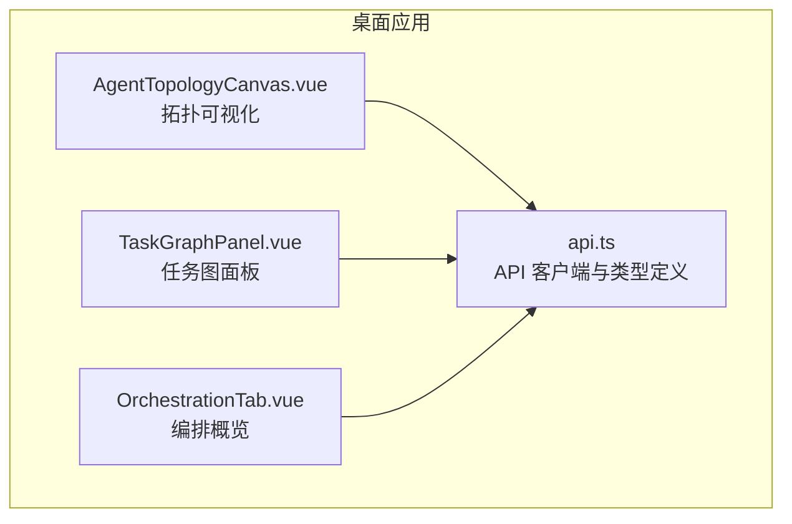
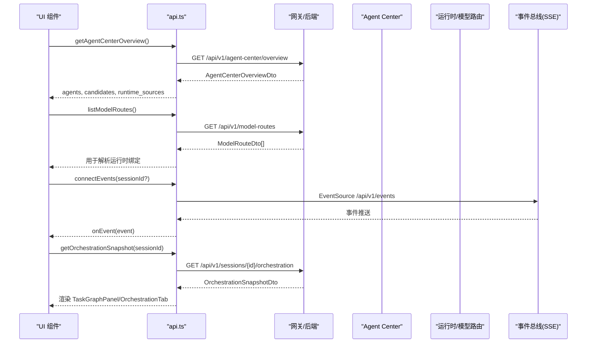
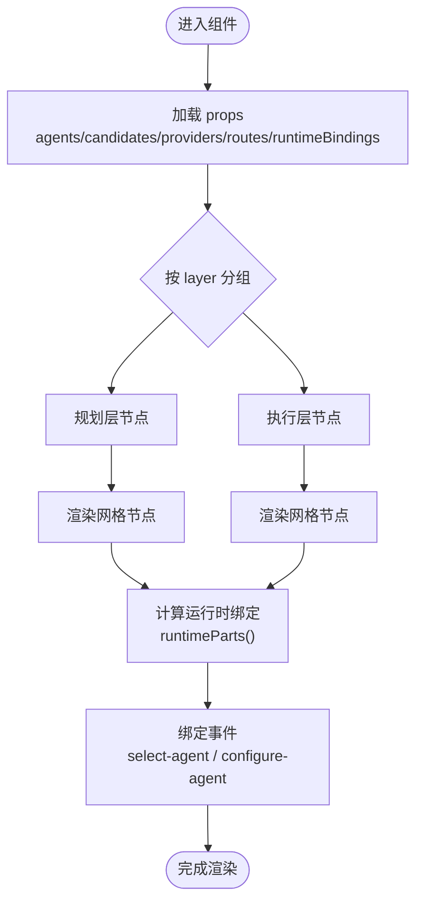
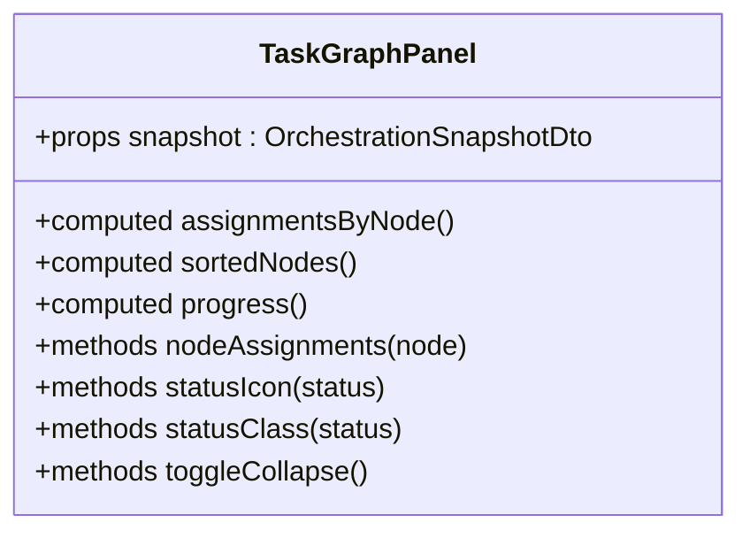
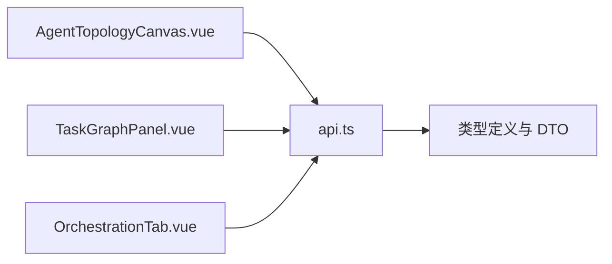

# 智能体拓扑管理

<cite>
**本文引用的文件**   
- [AgentTopologyCanvas.vue](file://apps/desktop/src/components/AgentTopologyCanvas.vue)
- [api.ts](file://apps/desktop/src/api.ts)
- [TaskGraphPanel.vue](file://apps/desktop/src/components/TaskGraphPanel.vue)
- [OrchestrationTab.vue](file://apps/desktop/src/components/OrchestrationTab.vue)
</cite>

## 目录
1. [简介](#简介)
2. [项目结构](#项目结构)
3. [核心组件](#核心组件)
4. [架构总览](#架构总览)
5. [详细组件分析](#详细组件分析)
6. [依赖关系分析](#依赖关系分析)
7. [性能考虑](#性能考虑)
8. [故障排查指南](#故障排查指南)
9. [结论](#结论)
10. [附录](#附录)

## 简介
本文件围绕“智能体拓扑管理”能力，系统化说明：
- 智能体关系图的可视化展示与视图切换（拓扑图与列表）
- 智能体依赖关系的建立、修改与删除
- 智能体层级结构管理（规划层与执行层）
- 智能体间通信协议、消息传递机制与事件订阅模式
- 拓扑结构的导入导出、版本管理与批量操作
- 拓扑冲突检测、依赖分析与优化建议工具
- 拓扑变更的影响评估与回滚机制

上述能力由前端可视化组件与后端 API 契约共同实现。前端通过类型化接口与 SSE/流式通道进行交互，后端提供统一的 Agent Center、模型路由、编排快照与事件总线等能力。

## 项目结构
与智能体拓扑管理直接相关的前端代码集中在桌面应用模块中，主要包括：
- 拓扑可视化组件：AgentTopologyCanvas.vue
- 编排与任务图面板：TaskGraphPanel.vue、OrchestrationTab.vue
- 统一 API 客户端与数据契约：api.ts

图表来源
- [AgentTopologyCanvas.vue:1-125](file://apps/desktop/src/components/AgentTopologyCanvas.vue#L1-L125)
- [TaskGraphPanel.vue:1-119](file://apps/desktop/src/components/TaskGraphPanel.vue#L1-L119)
- [OrchestrationTab.vue:1-289](file://apps/desktop/src/components/OrchestrationTab.vue#L1-L289)
- [api.ts:997-1330](file://apps/desktop/src/api.ts#L997-L1330)

章节来源
- [AgentTopologyCanvas.vue:1-125](file://apps/desktop/src/components/AgentTopologyCanvas.vue#L1-L125)
- [api.ts:997-1330](file://apps/desktop/src/api.ts#L997-L1330)

## 核心组件
- 拓扑可视化组件（AgentTopologyCanvas.vue）
  - 按 layer 字段将智能体划分为“规划层”和“执行层”，并分别渲染为网格节点
  - 支持选择与双击配置动作，向父组件发出 select-agent 与 configure-agent 事件
  - 运行时绑定信息通过 runtimeBindings 与 routes/providers 推导显示
- 任务图面板（TaskGraphPanel.vue）
  - 基于 OrchestrationSnapshotDto 的 nodes/assignments 构建任务步骤与进度
  - 根据状态映射图标与样式，支持折叠/展开
- 编排概览（OrchestrationTab.vue）
  - 聚合运行摘要、监督发现、工具执行时间线、上下文包、步骤结果等
  - 提供工具目录浏览与统计视图切换

章节来源
- [AgentTopologyCanvas.vue:1-125](file://apps/desktop/src/components/AgentTopologyCanvas.vue#L1-L125)
- [TaskGraphPanel.vue:1-119](file://apps/desktop/src/components/TaskGraphPanel.vue#L1-L119)
- [OrchestrationTab.vue:1-289](file://apps/desktop/src/components/OrchestrationTab.vue#L1-L289)

## 架构总览
智能体拓扑管理在前端以 Vue 组件为核心，通过 api.ts 调用后端服务获取拓扑、运行时绑定、模型路由、编排快照与事件流。整体数据流如下：

图表来源
- [api.ts:1123-1128](file://apps/desktop/src/api.ts#L1123-L1128)
- [api.ts:1078-1082](file://apps/desktop/src/api.ts#L1078-L1082)
- [api.ts:1310-1328](file://apps/desktop/src/api.ts#L1310-L1328)
- [api.ts:1022-1023](file://apps/desktop/src/api.ts#L1022-L1023)

## 详细组件分析

### 拓扑可视化组件（AgentTopologyCanvas.vue）
- 输入属性
  - agents: AgentProfileDto[]，包含 id、name、layer、model_route_purpose、enabled 等
  - candidates: AgentCandidateDto[]，演化候选智能体
  - providers/routes/runtimeBindings: 用于计算每个节点的运行时绑定与显示名称
  - selectedAgentId/agentLabels/candidateLabels: 选中态与标签映射
- 处理逻辑
  - 按 layer === 'planning'/'execution' 分组渲染
  - runtimeParts 函数优先使用 runtimeBinding，否则回退到 route/provider/model 推导
  - 点击触发 select-agent，双击触发 configure-agent
- 输出事件
  - select-agent(id)
  - configure-agent(id)

图表来源
- [AgentTopologyCanvas.vue:24-45](file://apps/desktop/src/components/AgentTopologyCanvas.vue#L24-L45)
- [AgentTopologyCanvas.vue:48-124](file://apps/desktop/src/components/AgentTopologyCanvas.vue#L48-L124)

章节来源
- [AgentTopologyCanvas.vue:1-125](file://apps/desktop/src/components/AgentTopologyCanvas.vue#L1-L125)

### 任务图面板（TaskGraphPanel.vue）
- 数据来源：OrchestrationSnapshotDto.nodes/assignments/run/graph
- 功能要点
  - 按优先级排序节点，计算进度（done/total/percent）
  - 根据 status 映射图标与样式类
  - 支持折叠/展开，提升大任务图的可读性

图表来源
- [TaskGraphPanel.vue:15-65](file://apps/desktop/src/components/TaskGraphPanel.vue#L15-L65)

章节来源
- [TaskGraphPanel.vue:1-119](file://apps/desktop/src/components/TaskGraphPanel.vue#L1-L119)

### 编排概览（OrchestrationTab.vue）
- 聚合运行摘要、监督发现、工具执行时间线、上下文包、步骤结果
- 提供三个子视图：Timeline、Catalog、Stats，便于从不同维度观察编排过程

章节来源
- [OrchestrationTab.vue:1-289](file://apps/desktop/src/components/OrchestrationTab.vue#L1-L289)

## 依赖关系分析
- 组件对 API 的依赖
  - AgentTopologyCanvas.vue 依赖 AgentProfileDto、AgentCandidateDto、ModelProviderInstanceDto、ModelRouteDto、AgentRuntimeBindingDto
  - TaskGraphPanel.vue 依赖 OrchestrationSnapshotDto、TaskNodeDto、AgentAssignmentDto
  - OrchestrationTab.vue 依赖 OrchestrationSnapshotDto、ToolExecutionTimelineItemDto、ToolDescriptorDto
- API 客户端职责
  - 统一请求封装、错误提取、SSE 事件连接、流式调用
  - 暴露 Agent Center、模型中心、工具、提示词片段、编排等接口

图表来源
- [AgentTopologyCanvas.vue:5-16](file://apps/desktop/src/components/AgentTopologyCanvas.vue#L5-L16)
- [TaskGraphPanel.vue:13-17](file://apps/desktop/src/components/TaskGraphPanel.vue#L13-L17)
- [OrchestrationTab.vue:4-13](file://apps/desktop/src/components/OrchestrationTab.vue#L4-L13)
- [api.ts:997-1330](file://apps/desktop/src/api.ts#L997-L1330)

章节来源
- [api.ts:997-1330](file://apps/desktop/src/api.ts#L997-L1330)

## 性能考虑
- 大数据量渲染
  - 拓扑节点较多时，建议使用虚拟滚动或分页；当前组件采用网格布局，建议在父级控制数据规模
- 事件流与 SSE
  - connectEvents 使用 EventSource，注意在组件销毁时关闭连接，避免内存泄漏
- 运行时绑定推导
  - runtimeParts 每次渲染都会查找 routes/providers，可在上层缓存或预聚合以减少重复计算
- 编排快照
  - getOrchestrationSnapshot 返回完整快照，建议按需刷新与增量更新

[本节为通用指导，不直接分析具体文件]

## 故障排查指南
- 网络与后端连通性
  - request 封装会在 fetch 失败或响应非 JSON 时抛出明确错误，检查 gatewayUrl 与 CORS
- 事件订阅异常
  - connectEvents 会注册多种事件类型，若未收到事件，确认 sessionId 与后端事件总线是否正常
- 运行时绑定未解析
  - runtime_kind 为 unresolved 时，需检查 model-routes 与 provider 实例是否已配置
- 编排快照为空
  - 确保先发起一次会话/运行，再拉取 orchestration 快照

章节来源
- [api.ts:945-979](file://apps/desktop/src/api.ts#L945-L979)
- [api.ts:1310-1328](file://apps/desktop/src/api.ts#L1310-L1328)
- [AgentTopologyCanvas.vue:27-45](file://apps/desktop/src/components/AgentTopologyCanvas.vue#L27-L45)

## 结论
智能体拓扑管理以清晰的层级划分（规划层/执行层）与可视化的拓扑图为核心，结合运行时绑定、模型路由与编排快照，形成完整的拓扑观测与运维闭环。通过统一的 API 客户端与事件总线，前端能够实时感知拓扑变化与运行状态，支撑依赖管理、冲突检测与影响评估等高级能力。

[本节为总结性内容，不直接分析具体文件]

## 附录

### 智能体层级结构与关系管理
- 层级组织
  - planning 层：负责策略与调度
  - execution 层：负责具体执行
- 依赖关系
  - 通过 model_route_purpose 关联模型路由，进而绑定 provider_instance_id 与 model
  - runtime_binding 可覆盖默认路由，支持 inherit/fixed_model/provider_auto/cli/acp 等选择策略
- 操作能力
  - 建立：保存 agent profile 与 runtime binding
  - 修改：更新 mode、system_prompt、allowed_tools、capabilities、enabled 等
  - 删除：通过后端接口删除（如适用），或在 UI 上禁用

章节来源
- [api.ts:559-573](file://apps/desktop/src/api.ts#L559-L573)
- [api.ts:507-535](file://apps/desktop/src/api.ts#L507-L535)
- [api.ts:1197-1215](file://apps/desktop/src/api.ts#L1197-L1215)

### 通信协议、消息传递与事件订阅
- 事件订阅
  - connectEvents 使用 EventSource 连接 /api/v1/events，支持 session 过滤
  - 事件类型包括 project/session/message/approval/tool.shell.approval_required/run/task_graph/task.step.result/supervision/context.pack 等
- 流式调用
  - invokeStream 使用 SSE 推送 ModelStreamChunkDto，支持 tool_call_delta、usage、error 等字段
- 消息传递
  - 会话消息通过 postMessage/listMessages 进行增查

章节来源
- [api.ts:1310-1328](file://apps/desktop/src/api.ts#L1310-L1328)
- [api.ts:1258-1308](file://apps/desktop/src/api.ts#L1258-L1308)
- [api.ts:1017-1021](file://apps/desktop/src/api.ts#L1017-L1021)

### 拓扑导入导出、版本管理与批量操作
- 导入导出
  - 可通过 getHarnessManifest 获取系统全量清单（含工具、层、风险等），作为拓扑快照的基础
  - 结合外部脚本将 Manifest 转换为拓扑描述文件，再由后端接口批量写入（如 saveAgent/saveModelProvider/saveModelRoute）
- 版本管理
  - 提示词片段具备版本与回滚能力（listPromptFragmentVersions/createPromptFragmentVersion/rollbackPromptFragment），可作为模板/配置的版本化管理参考
- 批量操作
  - 通过循环调用 saveAgent/updateAgentMode/saveModelProvider/saveModelRoute 实现批量更新
  - 建议在上层做幂等与事务包装，保证一致性

章节来源
- [api.ts:1141-1141](file://apps/desktop/src/api.ts#L1141-L1141)
- [api.ts:1237-1255](file://apps/desktop/src/api.ts#L1237-L1255)
- [api.ts:1197-1215](file://apps/desktop/src/api.ts#L1197-L1215)

### 拓扑冲突检测、依赖分析与优化建议
- 冲突检测
  - 利用 listModelProviders/getModelReadiness/getModelCatalogReadiness 探测提供者健康与可用性，识别路由冲突与不可用依赖
  - ToolLayerReadinessReceipt 提供工具层就绪度与代理范围扫描，辅助发现未解析 scope 与审批门控
- 依赖分析
  - 通过 AgentCenterOverviewDto 中的 agents/runtime_sources/diagnostics 汇总依赖关系与诊断信息
- 优化建议
  - 结合 readiness/evidence 与 diagnostics.design_notes 生成优化建议（例如替换 provider、调整路由、启用能力）

章节来源
- [api.ts:1001-1002](file://apps/desktop/src/api.ts#L1001-L1002)
- [api.ts:1065-1066](file://apps/desktop/src/api.ts#L1065-L1066)
- [api.ts:1123-1123](file://apps/desktop/src/api.ts#L1123-L1123)

### 拓扑变更影响评估与回滚机制
- 影响评估
  - 变更前调用 getOrchestrationSnapshot 与 listToolExecutions 评估当前运行与工具使用情况
  - 使用 readiness 与 diagnostics 预判变更对提供者/路由/工具的影响
- 回滚机制
  - 提示词片段支持版本回滚（rollbackPromptFragment），可作为配置回滚范式
  - 对于拓扑配置，建议保存变更前的快照（Manifest/DTO），必要时恢复

章节来源
- [api.ts:1022-1023](file://apps/desktop/src/api.ts#L1022-L1023)
- [api.ts:1023-1029](file://apps/desktop/src/api.ts#L1023-L1029)
- [api.ts:1242-1245](file://apps/desktop/src/api.ts#L1242-L1245)