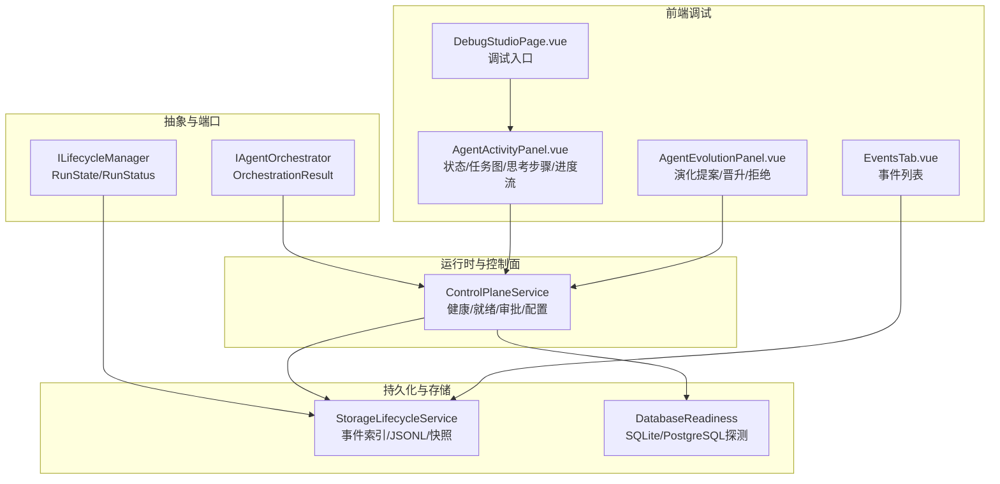
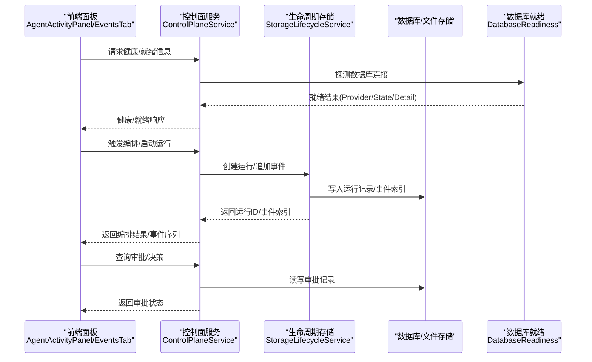
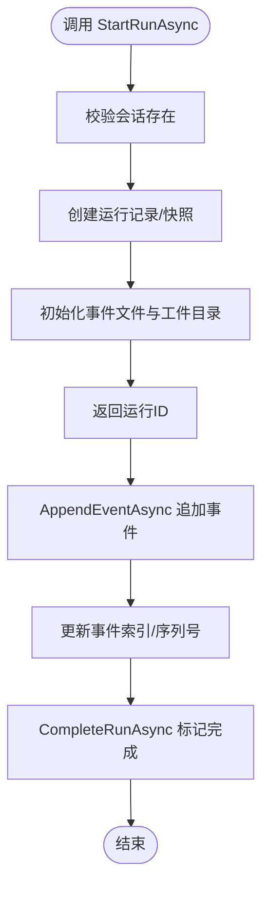
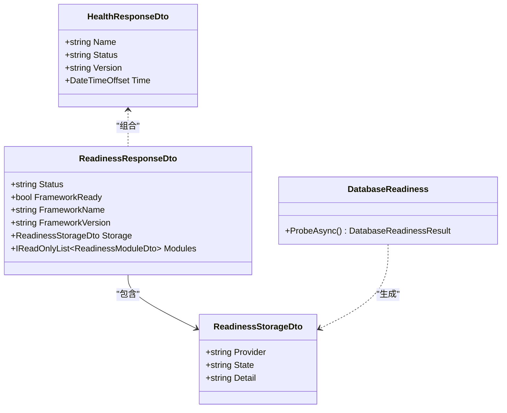
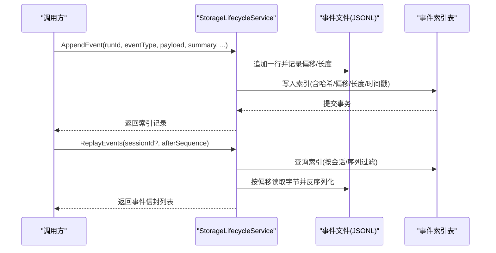
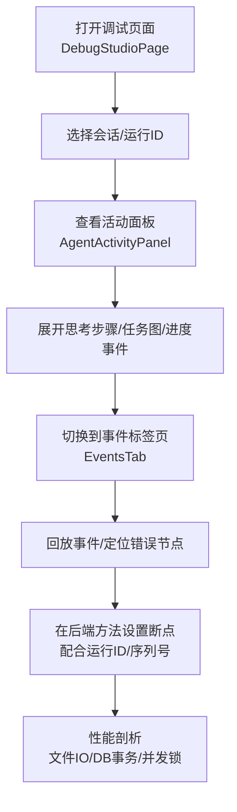
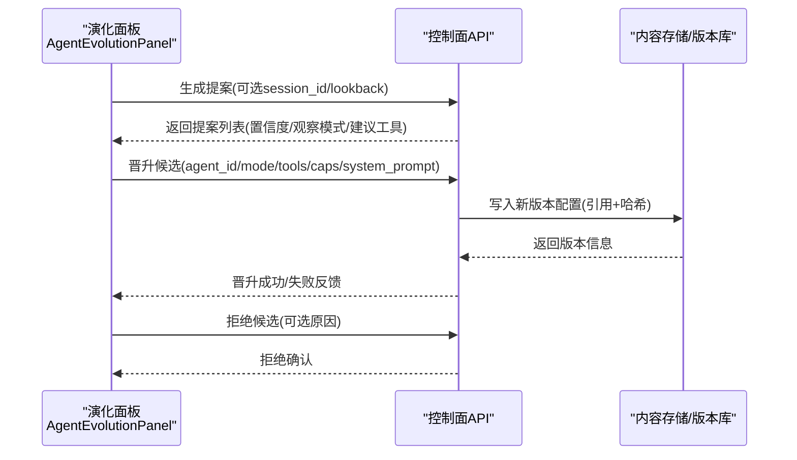
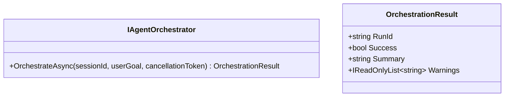
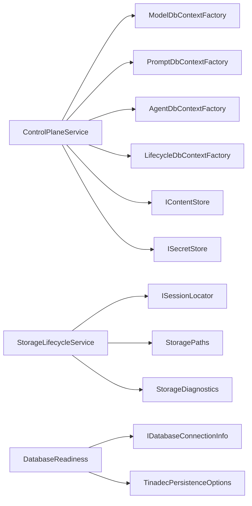

# 智能体生命周期与调试

<cite>
**本文引用的文件**   
- [ILifecycleManager.cs](file://TinadecCore/Abstractions/Ports/ILifecycleManager.cs)
- [StorageLifecycleService.cs](file://TinadecCore/Lifecycle/StorageLifecycleService.cs)
- [ControlPlaneService.cs](file://TinadecCore/Runtime/ControlPlaneService.cs)
- [HealthResponseDto.cs](file://TinadecCore/Contracts/Dtos/HealthResponseDto.cs)
- [ReadinessResponseDto.cs](file://TinadecCore/Contracts/Dtos/ReadinessResponseDto.cs)
- [DatabaseReadiness.cs](file://TinadecCore/Persistence/DatabaseReadiness.cs)
- [IAgentOrchestrator.cs](file://TinadecCore/Abstractions/Ports/IAgentOrchestrator.cs)
- [AgentActivityPanel.vue](file://apps/desktop/src/components/AgentActivityPanel.vue)
- [EventsTab.vue](file://apps/desktop/src/components/EventsTab.vue)
- [DebugStudioPage.vue](file://apps/desktop/src/pages/DebugStudioPage.vue)
- [AgentEvolutionPanel.vue](file://apps/desktop/src/components/AgentEvolutionPanel.vue)
</cite>

## 目录
1. [简介](#简介)
2. [项目结构](#项目结构)
3. [核心组件](#核心组件)
4. [架构总览](#架构总览)
5. [详细组件分析](#详细组件分析)
6. [依赖关系分析](#依赖关系分析)
7. [性能考量](#性能考量)
8. [故障排查指南](#故障排查指南)
9. [结论](#结论)
10. [附录](#附录)

## 简介
本文件面向“智能体生命周期与调试”主题，系统性阐述智能体的启动、停止、重启与销毁等生命周期管理；状态监控与健康检查；事件追踪与调用链；调试工具集成（日志查看、断点调试、性能分析）；以及智能体演化管理（版本升级、配置迁移、数据兼容性）。文档同时覆盖生产环境的监控告警与故障排查建议。

## 项目结构
围绕生命周期与调试的关键代码分布在以下模块：
- 抽象接口层：定义生命周期管理与编排的契约
- 运行时与控制面：提供健康检查、就绪性、审批与配置管理
- 持久化与存储：事件日志、运行记录、数据库就绪探测
- 前端调试面板：活动面板、事件面板、调试入口、演化面板

**图表来源** 
- [ILifecycleManager.cs:1-41](file://TinadecCore/Abstractions/Ports/ILifecycleManager.cs#L1-L41)
- [IAgentOrchestrator.cs:1-24](file://TinadecCore/Abstractions/Ports/IAgentOrchestrator.cs#L1-L24)
- [ControlPlaneService.cs:1-71](file://TinadecCore/Runtime/ControlPlaneService.cs#L1-L71)
- [StorageLifecycleService.cs:1-291](file://TinadecCore/Lifecycle/StorageLifecycleService.cs#L1-L291)
- [DatabaseReadiness.cs:1-123](file://TinadecCore/Persistence/DatabaseReadiness.cs#L1-L123)
- [AgentActivityPanel.vue:1-800](file://apps/desktop/src/components/AgentActivityPanel.vue#L1-L800)
- [EventsTab.vue:1-19](file://apps/desktop/src/components/EventsTab.vue#L1-L19)
- [DebugStudioPage.vue:1-8](file://apps/desktop/src/pages/DebugStudioPage.vue#L1-L8)
- [AgentEvolutionPanel.vue:1-729](file://apps/desktop/src/components/AgentEvolutionPanel.vue#L1-L729)

**章节来源**
- [ILifecycleManager.cs:1-41](file://TinadecCore/Abstractions/Ports/ILifecycleManager.cs#L1-L41)
- [IAgentOrchestrator.cs:1-24](file://TinadecCore/Abstractions/Ports/IAgentOrchestrator.cs#L1-L24)
- [ControlPlaneService.cs:1-71](file://TinadecCore/Runtime/ControlPlaneService.cs#L1-L71)
- [StorageLifecycleService.cs:1-291](file://TinadecCore/Lifecycle/StorageLifecycleService.cs#L1-L291)
- [DatabaseReadiness.cs:1-123](file://TinadecCore/Persistence/DatabaseReadiness.cs#L1-L123)
- [AgentActivityPanel.vue:1-800](file://apps/desktop/src/components/AgentActivityPanel.vue#L1-L800)
- [EventsTab.vue:1-19](file://apps/desktop/src/components/EventsTab.vue#L1-L19)
- [DebugStudioPage.vue:1-8](file://apps/desktop/src/pages/DebugStudioPage.vue#L1-L8)
- [AgentEvolutionPanel.vue:1-729](file://apps/desktop/src/components/AgentEvolutionPanel.vue#L1-L729)

## 核心组件
- 生命周期管理接口：定义运行开始、完成与状态查询能力，并提供运行状态与枚举
- 编排器接口：统一编排入口，返回运行ID、成功标志与摘要
- 控制面服务：聚合模型、提示词、智能体、生命周期等上下文，提供健康/就绪、审批与配置管理
- 存储型生命周期服务：基于数据库与文件系统的事件追加、回放、索引重建、迁移与诊断
- 数据库就绪探测：对 SQLite/PostgreSQL 的连接探测与超时控制
- 前端调试面板：实时展示智能体活动、任务图、思考步骤、进度事件与事件列表

**章节来源**
- [ILifecycleManager.cs:1-41](file://TinadecCore/Abstractions/Ports/ILifecycleManager.cs#L1-L41)
- [IAgentOrchestrator.cs:1-24](file://TinadecCore/Abstractions/Ports/IAgentOrchestrator.cs#L1-L24)
- [ControlPlaneService.cs:1-71](file://TinadecCore/Runtime/ControlPlaneService.cs#L1-L71)
- [StorageLifecycleService.cs:1-291](file://TinadecCore/Lifecycle/StorageLifecycleService.cs#L1-L291)
- [DatabaseReadiness.cs:1-123](file://TinadecCore/Persistence/DatabaseReadiness.cs#L1-L123)
- [AgentActivityPanel.vue:1-800](file://apps/desktop/src/components/AgentActivityPanel.vue#L1-L800)
- [EventsTab.vue:1-19](file://apps/desktop/src/components/EventsTab.vue#L1-L19)

## 架构总览
下图展示了从前端到后端控制面、再到持久化的关键交互路径，涵盖健康检查、就绪性、事件追踪与审批流程。

**图表来源** 
- [ControlPlaneService.cs:1-71](file://TinadecCore/Runtime/ControlPlaneService.cs#L1-L71)
- [StorageLifecycleService.cs:1-291](file://TinadecCore/Lifecycle/StorageLifecycleService.cs#L1-L291)
- [DatabaseReadiness.cs:1-123](file://TinadecCore/Persistence/DatabaseReadiness.cs#L1-L123)
- [AgentActivityPanel.vue:1-800](file://apps/desktop/src/components/AgentActivityPanel.vue#L1-L800)
- [EventsTab.vue:1-19](file://apps/desktop/src/components/EventsTab.vue#L1-L19)

## 详细组件分析

### 生命周期管理（启动/停止/重启/销毁）
- 启动运行：通过生命周期接口或编排器发起，底层由存储型服务创建运行记录、初始化快照与事件文件
- 完成运行：更新运行状态为完成并记录完成时间
- 状态查询：按运行ID获取当前状态与元数据
- 重启/销毁：通过外部编排策略结合运行状态与事件回放实现（例如根据最后事件序列恢复）

**图表来源** 
- [StorageLifecycleService.cs:1-291](file://TinadecCore/Lifecycle/StorageLifecycleService.cs#L1-L291)
- [ILifecycleManager.cs:1-41](file://TinadecCore/Abstractions/Ports/ILifecycleManager.cs#L1-L41)

**章节来源**
- [ILifecycleManager.cs:1-41](file://TinadecCore/Abstractions/Ports/ILifecycleManager.cs#L1-L41)
- [StorageLifecycleService.cs:1-291](file://TinadecCore/Lifecycle/StorageLifecycleService.cs#L1-L291)

### 状态监控与健康检查
- 健康检查：返回名称、状态、版本与时间戳
- 就绪性：框架加载状态、存储提供者状态、模块状态明细
- 数据库就绪：按提供者执行 SELECT 1 探测，支持超时与异常处理

**图表来源** 
- [HealthResponseDto.cs:1-13](file://TinadecCore/Contracts/Dtos/HealthResponseDto.cs#L1-L13)
- [ReadinessResponseDto.cs:1-32](file://TinadecCore/Contracts/Dtos/ReadinessResponseDto.cs#L1-L32)
- [DatabaseReadiness.cs:1-123](file://TinadecCore/Persistence/DatabaseReadiness.cs#L1-L123)

**章节来源**
- [HealthResponseDto.cs:1-13](file://TinadecCore/Contracts/Dtos/HealthResponseDto.cs#L1-L13)
- [ReadinessResponseDto.cs:1-32](file://TinadecCore/Contracts/Dtos/ReadinessResponseDto.cs#L1-L32)
- [DatabaseReadiness.cs:1-123](file://TinadecCore/Persistence/DatabaseReadiness.cs#L1-L123)

### 事件追踪与调用链
- 事件追加：按运行ID并发安全地追加 JSONL 行，维护序列号与时间戳
- 事件回放：按会话与序列过滤，读取对应字节偏移，还原事件信封
- 索引重建：扫描事件文件，修复缺失索引，记录诊断消息
- 前端展示：活动面板显示思考步骤、任务图与进度事件；事件标签页展示事件列表

**图表来源** 
- [StorageLifecycleService.cs:1-291](file://TinadecCore/Lifecycle/StorageLifecycleService.cs#L1-L291)
- [EventsTab.vue:1-19](file://apps/desktop/src/components/EventsTab.vue#L1-L19)
- [AgentActivityPanel.vue:1-800](file://apps/desktop/src/components/AgentActivityPanel.vue#L1-L800)

**章节来源**
- [StorageLifecycleService.cs:1-291](file://TinadecCore/Lifecycle/StorageLifecycleService.cs#L1-L291)
- [EventsTab.vue:1-19](file://apps/desktop/src/components/EventsTab.vue#L1-L19)
- [AgentActivityPanel.vue:1-800](file://apps/desktop/src/components/AgentActivityPanel.vue#L1-L800)

### 调试工具集成（日志/断点/性能）
- 日志查看：通过事件回放与活动面板的进度事件流，定位问题发生的时间线与上下文
- 断点调试：在控制面与服务方法处设置断点，结合运行ID与事件序列进行单步跟踪
- 性能分析：关注事件追加的并发锁、文件写入吞吐、数据库查询与事务提交耗时

**图表来源** 
- [DebugStudioPage.vue:1-8](file://apps/desktop/src/pages/DebugStudioPage.vue#L1-L8)
- [AgentActivityPanel.vue:1-800](file://apps/desktop/src/components/AgentActivityPanel.vue#L1-L800)
- [EventsTab.vue:1-19](file://apps/desktop/src/components/EventsTab.vue#L1-L19)

**章节来源**
- [DebugStudioPage.vue:1-8](file://apps/desktop/src/pages/DebugStudioPage.vue#L1-L8)
- [AgentActivityPanel.vue:1-800](file://apps/desktop/src/components/AgentActivityPanel.vue#L1-L800)
- [EventsTab.vue:1-19](file://apps/desktop/src/components/EventsTab.vue#L1-L19)

### 智能体演化管理（版本升级/配置迁移/数据兼容）
- 提案生成：基于历史事件与模式挖掘生成候选智能体提案
- 晋升流程：将候选升级为正式智能体配置，支持工具与能力集合、系统提示词覆盖
- 拒绝流程：记录拒绝原因并归档评估备注
- 数据兼容：通过内容引用与版本化存储，保证配置变更的可追溯与回滚

**图表来源** 
- [AgentEvolutionPanel.vue:1-729](file://apps/desktop/src/components/AgentEvolutionPanel.vue#L1-L729)
- [ControlPlaneService.cs:1-71](file://TinadecCore/Runtime/ControlPlaneService.cs#L1-L71)

**章节来源**
- [AgentEvolutionPanel.vue:1-729](file://apps/desktop/src/components/AgentEvolutionPanel.vue#L1-L729)
- [ControlPlaneService.cs:1-71](file://TinadecCore/Runtime/ControlPlaneService.cs#L1-L71)

### 编排与协作（双层级）
- 规划层：主动规划与监督
- 执行层：被动任务执行
- 动态创建、任务分发、协作调度与结果聚合

**图表来源** 
- [IAgentOrchestrator.cs:1-24](file://TinadecCore/Abstractions/Ports/IAgentOrchestrator.cs#L1-L24)

**章节来源**
- [IAgentOrchestrator.cs:1-24](file://TinadecCore/Abstractions/Ports/IAgentOrchestrator.cs#L1-L24)

## 依赖关系分析
- 控制面服务依赖多个 DbContextFactory 与内容/密钥存储，形成跨域管理能力
- 生命周期服务依赖会话定位器、存储路径与诊断器，确保事件与快照一致性
- 数据库就绪探测依赖连接信息与超时配置，屏蔽底层差异

**图表来源** 
- [ControlPlaneService.cs:1-71](file://TinadecCore/Runtime/ControlPlaneService.cs#L1-L71)
- [StorageLifecycleService.cs:1-291](file://TinadecCore/Lifecycle/StorageLifecycleService.cs#L1-L291)
- [DatabaseReadiness.cs:1-123](file://TinadecCore/Persistence/DatabaseReadiness.cs#L1-L123)

**章节来源**
- [ControlPlaneService.cs:1-71](file://TinadecCore/Runtime/ControlPlaneService.cs#L1-L71)
- [StorageLifecycleService.cs:1-291](file://TinadecCore/Lifecycle/StorageLifecycleService.cs#L1-L291)
- [DatabaseReadiness.cs:1-123](file://TinadecCore/Persistence/DatabaseReadiness.cs#L1-L123)

## 性能考量
- 事件追加采用每运行一个信号量，避免并发写冲突；文件写入使用 WriteThrough 与显式 flush，保障持久性
- 事件回放按索引偏移读取，减少全量解析开销；批量重建索引时跳过不完整尾部与畸形记录
- 数据库就绪探测支持超时限制，防止阻塞启动流程
- 前端活动面板仅保留最近若干条进度事件，降低渲染压力

[本节为通用指导，不直接分析具体文件]

## 故障排查指南
- 健康检查失败：检查健康响应中的状态字段与版本信息，确认服务是否正常运行
- 就绪性异常：查看存储提供者状态与模块详情，定位未配置或不可用模块
- 数据库连接失败：核对连接字符串与提供者类型，关注探针超时与异常消息
- 事件不一致：运行 Reconcile 重建索引，检查诊断消息中忽略的不完整或畸形记录
- 审批卡住：检查审批状态与过期时间，确保决策值合法且未被重复处理

**章节来源**
- [HealthResponseDto.cs:1-13](file://TinadecCore/Contracts/Dtos/HealthResponseDto.cs#L1-L13)
- [ReadinessResponseDto.cs:1-32](file://TinadecCore/Contracts/Dtos/ReadinessResponseDto.cs#L1-L32)
- [DatabaseReadiness.cs:1-123](file://TinadecCore/Persistence/DatabaseReadiness.cs#L1-L123)
- [StorageLifecycleService.cs:1-291](file://TinadecCore/Lifecycle/StorageLifecycleService.cs#L1-L291)
- [ControlPlaneService.cs:1-71](file://TinadecCore/Runtime/ControlPlaneService.cs#L1-L71)

## 结论
本方案以清晰的接口契约与分层架构实现了智能体生命周期的可靠管理，并通过事件驱动与索引机制提供强大的可观测性与调试能力。健康检查与就绪性探测保障了系统的稳定性，而演化面板则提供了智能体配置的演进与治理手段。在生产环境中，建议结合事件回放、审批审计与数据库就绪探针，构建完善的监控告警与故障排查体系。

[本节为总结性内容，不直接分析具体文件]

## 附录
- 术语说明
  - 运行(Run)：一次智能体执行的上下文与生命周期单元
  - 事件(Event)：描述运行过程中关键动作与状态的增量记录
  - 就绪性(Readiness)：系统对外提供服务前的自检结果
  - 演化(Evolution)：基于观察模式的智能体配置建议与晋升流程

[本节为概念性内容，不直接分析具体文件]