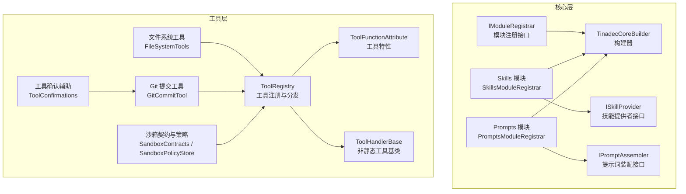
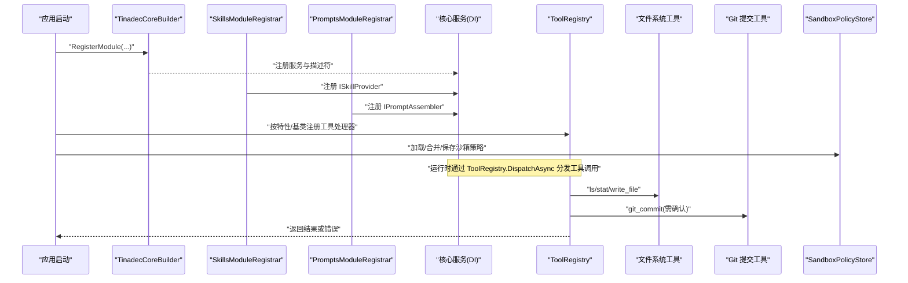
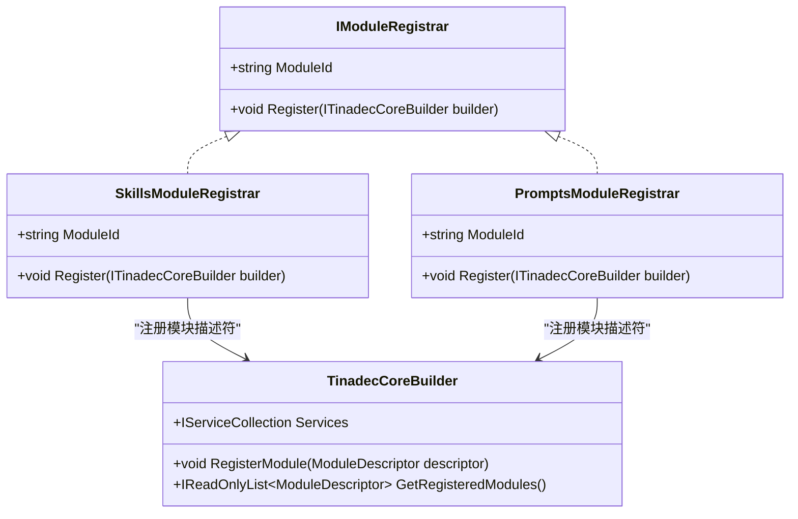
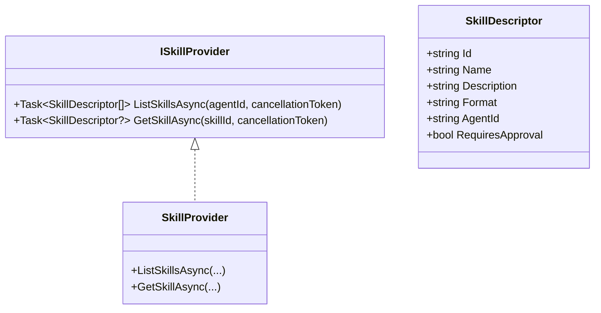
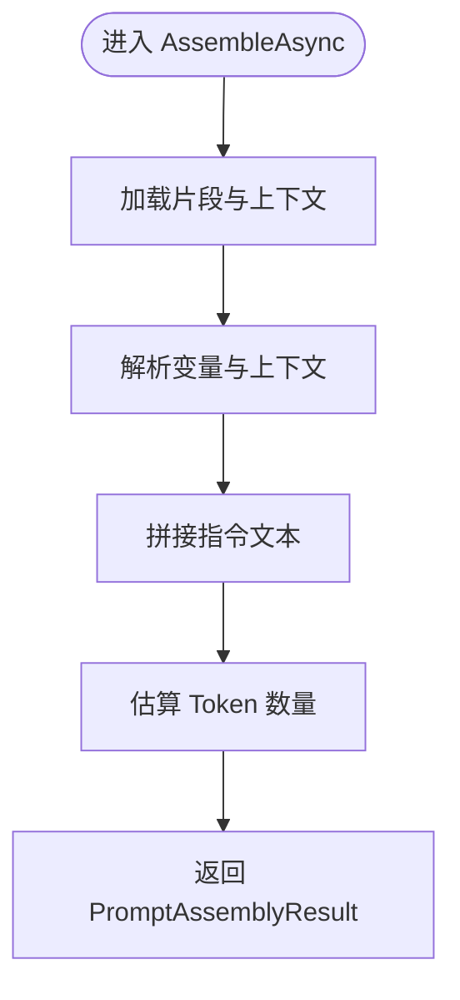
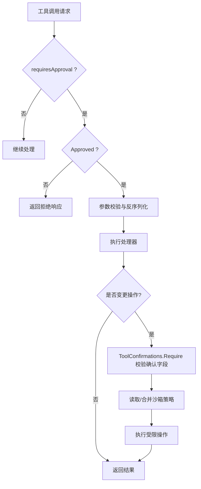
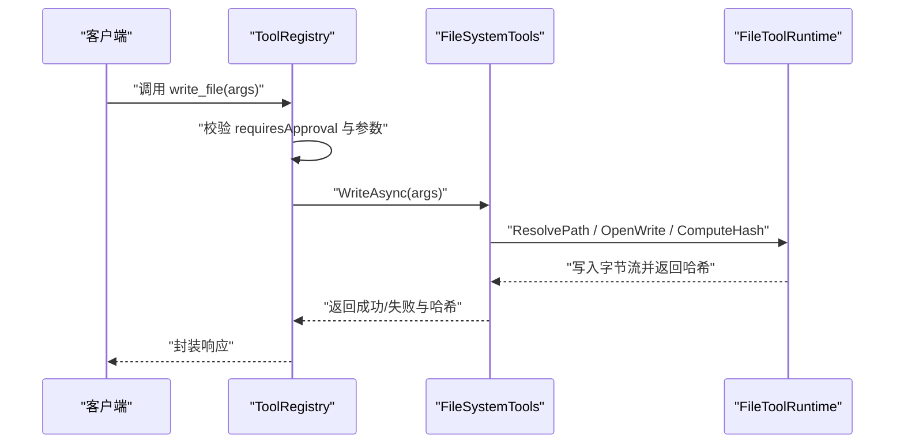
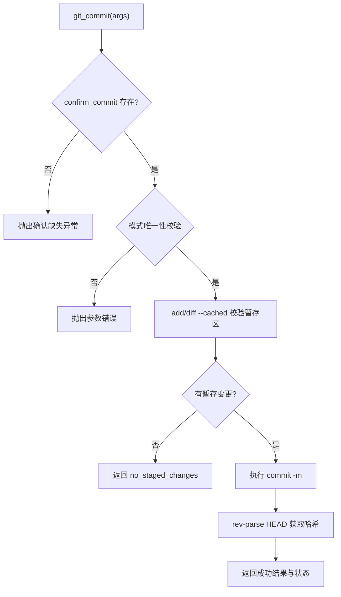
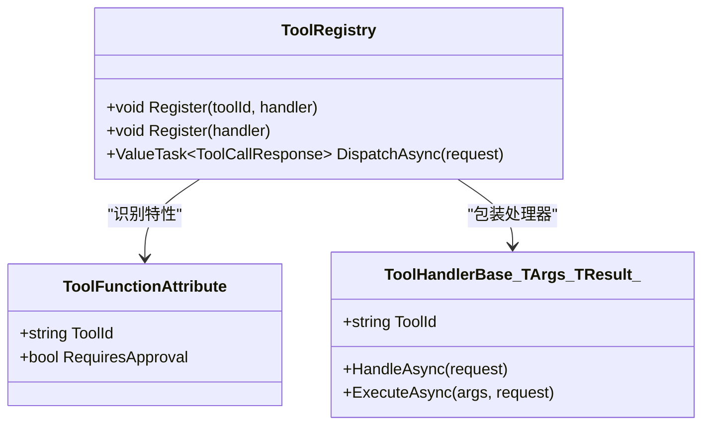
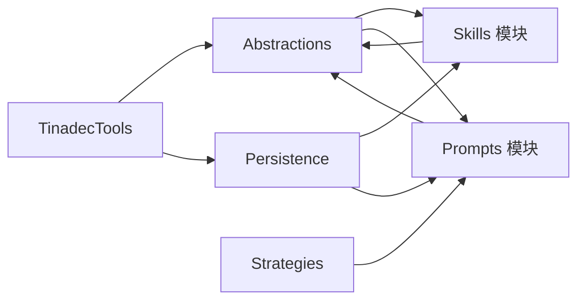

# 智能体能力配置

<cite>
**本文引用的文件**   
- [ISkillProvider.cs](file://TinadecCore/Abstractions/Ports/ISkillProvider.cs)
- [SkillsModuleRegistrar.cs](file://TinadecCore/Skills/SkillsModuleRegistrar.cs)
- [PromptsModuleRegistrar.cs](file://TinadecCore/Prompts/PromptsModuleRegistrar.cs)
- [IModuleRegistrar.cs](file://TinadecCore/Abstractions/IModuleRegistrar.cs)
- [TinadecCoreBuilder.cs](file://TinadecCore/Runtime/TinadecCoreBuilder.cs)
- [ToolRegistry.cs](file://TinadecTools/Abstractions/ToolRegistry.cs)
- [ToolFunctionAttribute.cs](file://TinadecTools/Abstractions/ToolFunctionAttribute.cs)
- [ToolHandlerBase.cs](file://TinadecTools/Abstractions/ToolHandlerBase.cs)
- [FileSystemTools.cs](file://TinadecTools/Tools/FileRW/FileSystemTools.cs)
- [GitCommitTool.cs](file://TinadecTools/Tools/Git/GitCommitTool.cs)
- [SandboxContracts.cs](file://TinadecTools/Runtime/Sandbox/SandboxContracts.cs)
- [SandboxPolicyStore.cs](file://TinadecTools/Runtime/Sandbox/SandboxPolicyStore.cs)
- [ToolConfirmations.cs](file://TinadecTools/Tools/ToolConfirmations.cs)
</cite>

## 目录
1. [简介](#简介)
2. [项目结构](#项目结构)
3. [核心组件](#核心组件)
4. [架构总览](#架构总览)
5. [详细组件分析](#详细组件分析)
6. [依赖关系分析](#依赖关系分析)
7. [性能考量](#性能考量)
8. [故障排查指南](#故障排查指南)
9. [结论](#结论)
10. [附录](#附录)

## 简介
本文件面向“智能体能力配置”的完整说明，覆盖能力声明、注册与管理机制；工具权限（读写、执行）与安全边界；系统提示词模板管理、变量替换与动态生成；能力组合策略、优先级与冲突解决；能力验证、测试与调试；能力包管理与版本控制；以及扩展点开发与最佳实践。文档以仓库现有实现为依据，提供可操作的指导与图示。

## 项目结构
- 核心模块通过显式注册的模块化方式组织，每个业务模块实现统一的注册接口，向构建器登记服务与能力元数据。
- 技能（Skill）与提示词（Prompt）分别由独立模块提供，统一通过抽象端口对外暴露。
- 工具（Tool）在 TinadecTools 中集中定义与注册，支持基于特性标注与泛型基类的两种注册路径，并内置沙箱策略存储与确认机制。

图表来源 
- [IModuleRegistrar.cs:1-17](file://TinadecCore/Abstractions/IModuleRegistrar.cs#L1-L17)
- [TinadecCoreBuilder.cs:1-31](file://TinadecCore/Runtime/TinadecCoreBuilder.cs#L1-L31)
- [SkillsModuleRegistrar.cs:1-54](file://TinadecCore/Skills/SkillsModuleRegistrar.cs#L1-L54)
- [PromptsModuleRegistrar.cs:1-55](file://TinadecCore/Prompts/PromptsModuleRegistrar.cs#L1-L55)
- [ISkillProvider.cs:1-28](file://TinadecCore/Abstractions/Ports/ISkillProvider.cs#L1-L28)
- [ToolRegistry.cs:1-86](file://TinadecTools/Abstractions/ToolRegistry.cs#L1-L86)
- [ToolFunctionAttribute.cs:1-15](file://TinadecTools/Abstractions/ToolFunctionAttribute.cs#L1-L15)
- [ToolHandlerBase.cs:1-43](file://TinadecTools/Abstractions/ToolHandlerBase.cs#L1-L43)
- [FileSystemTools.cs:1-273](file://TinadecTools/Tools/FileRW/FileSystemTools.cs#L1-L273)
- [GitCommitTool.cs:1-149](file://TinadecTools/Tools/Git/GitCommitTool.cs#L1-L149)
- [SandboxContracts.cs:1-71](file://TinadecTools/Runtime/Sandbox/SandboxContracts.cs#L1-L71)
- [SandboxPolicyStore.cs:1-83](file://TinadecTools/Runtime/Sandbox/SandboxPolicyStore.cs#L1-L83)
- [ToolConfirmations.cs:1-12](file://TinadecTools/Tools/ToolConfirmations.cs#L1-L12)

章节来源
- [IModuleRegistrar.cs:1-17](file://TinadecCore/Abstractions/IModuleRegistrar.cs#L1-L17)
- [TinadecCoreBuilder.cs:1-31](file://TinadecCore/Runtime/TinadecCoreBuilder.cs#L1-L31)
- [SkillsModuleRegistrar.cs:1-54](file://TinadecCore/Skills/SkillsModuleRegistrar.cs#L1-L54)
- [PromptsModuleRegistrar.cs:1-55](file://TinadecCore/Prompts/PromptsModuleRegistrar.cs#L1-L55)

## 核心组件
- 模块注册与构建器：所有模块通过 IModuleRegistrar 显式注册，TinadecCoreBuilder 收集描述符并委托 DI 容器完成服务注入。
- 技能提供者：ISkillProvider 暴露列出与获取技能的接口，当前为骨架实现，后续可扩展文件/类/内联技能与 SKILL.md 格式。
- 提示词装配器：IPromptAssembler 负责将片段组装为 ChatOptions.Instructions，当前为骨架实现，返回空指令与警告。
- 工具注册与分发：ToolRegistry 维护工具处理器映射，支持特性标注与泛型基类两种方式，并提供参数校验、批准检查与调度。
- 沙箱策略：SandboxPolicyStore 持久化工作区内的读写路径与环境变量白名单，合并与保存策略文件。
- 工具确认：ToolConfirmations 强制要求变更类工具的确认字段，缺失则抛出异常。

章节来源
- [IModuleRegistrar.cs:1-17](file://TinadecCore/Abstractions/IModuleRegistrar.cs#L1-L17)
- [TinadecCoreBuilder.cs:1-31](file://TinadecCore/Runtime/TinadecCoreBuilder.cs#L1-L31)
- [ISkillProvider.cs:1-28](file://TinadecCore/Abstractions/Ports/ISkillProvider.cs#L1-L28)
- [SkillsModuleRegistrar.cs:1-54](file://TinadecCore/Skills/SkillsModuleRegistrar.cs#L1-L54)
- [PromptsModuleRegistrar.cs:1-55](file://TinadecCore/Prompts/PromptsModuleRegistrar.cs#L1-L55)
- [ToolRegistry.cs:1-86](file://TinadecTools/Abstractions/ToolRegistry.cs#L1-L86)
- [SandboxPolicyStore.cs:1-83](file://TinadecTools/Runtime/Sandbox/SandboxPolicyStore.cs#L1-L83)
- [ToolConfirmations.cs:1-12](file://TinadecTools/Tools/ToolConfirmations.cs#L1-L12)

## 架构总览
下图展示了从模块注册到能力暴露、再到工具调用与沙箱策略的整体流程。

图表来源 
- [TinadecCoreBuilder.cs:1-31](file://TinadecCore/Runtime/TinadecCoreBuilder.cs#L1-L31)
- [SkillsModuleRegistrar.cs:1-54](file://TinadecCore/Skills/SkillsModuleRegistrar.cs#L1-L54)
- [PromptsModuleRegistrar.cs:1-55](file://TinadecCore/Prompts/PromptsModuleRegistrar.cs#L1-L55)
- [ToolRegistry.cs:1-86](file://TinadecTools/Abstractions/ToolRegistry.cs#L1-L86)
- [FileSystemTools.cs:1-273](file://TinadecTools/Tools/FileRW/FileSystemTools.cs#L1-L273)
- [GitCommitTool.cs:1-149](file://TinadecTools/Tools/Git/GitCommitTool.cs#L1-L149)
- [SandboxPolicyStore.cs:1-83](file://TinadecTools/Runtime/Sandbox/SandboxPolicyStore.cs#L1-L83)

## 详细组件分析

### 能力声明与注册（模块与能力元数据）
- 模块通过 IModuleRegistrar 暴露 ModuleId 与 Register(builder) 方法，内部使用 builder.RegisterModule(...) 登记能力清单、依赖、语言与 MAF 原语等元数据。
- Skills 模块声明了 file_skills、class_skills、inline_skills、skill_md、sep_2640、extension_installations、mcp_acp_integrations 等能力标识。
- Prompts 模块声明了 fragment_assembly、agent_instructions、skill_contributions、deterministic_assembly 等能力标识。
- 构建器维护已注册模块列表，供端点或诊断查询。

图表来源 
- [IModuleRegistrar.cs:1-17](file://TinadecCore/Abstractions/IModuleRegistrar.cs#L1-L17)
- [TinadecCoreBuilder.cs:1-31](file://TinadecCore/Runtime/TinadecCoreBuilder.cs#L1-L31)
- [SkillsModuleRegistrar.cs:1-54](file://TinadecCore/Skills/SkillsModuleRegistrar.cs#L1-L54)
- [PromptsModuleRegistrar.cs:1-55](file://TinadecCore/Prompts/PromptsModuleRegistrar.cs#L1-L55)

章节来源
- [IModuleRegistrar.cs:1-17](file://TinadecCore/Abstractions/IModuleRegistrar.cs#L1-L17)
- [TinadecCoreBuilder.cs:1-31](file://TinadecCore/Runtime/TinadecCoreBuilder.cs#L1-L31)
- [SkillsModuleRegistrar.cs:1-54](file://TinadecCore/Skills/SkillsModuleRegistrar.cs#L1-L54)
- [PromptsModuleRegistrar.cs:1-55](file://TinadecCore/Prompts/PromptsModuleRegistrar.cs#L1-L55)

### 技能提供者（能力发现与获取）
- ISkillProvider 定义 ListSkillsAsync 与 GetSkillAsync，返回 SkillDescriptor 数组或单个技能。
- SkillsModuleRegistrar 中的 SkillProvider 目前返回空集合或 null，作为骨架占位，便于后续接入 MAF AgentSkillsProvider 与 SKILL.md。

图表来源 
- [ISkillProvider.cs:1-28](file://TinadecCore/Abstractions/Ports/ISkillProvider.cs#L1-L28)
- [SkillsModuleRegistrar.cs:1-54](file://TinadecCore/Skills/SkillsModuleRegistrar.cs#L1-L54)

章节来源
- [ISkillProvider.cs:1-28](file://TinadecCore/Abstractions/Ports/ISkillProvider.cs#L1-L28)
- [SkillsModuleRegistrar.cs:1-54](file://TinadecCore/Skills/SkillsModuleRegistrar.cs#L1-L54)

### 提示词装配器（模板管理、变量替换与动态生成）
- PromptsModuleRegistrar 注册 IPromptAssembler，当前实现 AssembleAsync 返回空指令与警告，表明处于骨架状态。
- 未来可在该装配器中集成片段库、变量替换引擎与确定性组装策略，以满足 agent_instructions 与 skill_contributions 的能力需求。

图表来源 
- [PromptsModuleRegistrar.cs:1-55](file://TinadecCore/Prompts/PromptsModuleRegistrar.cs#L1-L55)

章节来源
- [PromptsModuleRegistrar.cs:1-55](file://TinadecCore/Prompts/PromptsModuleRegistrar.cs#L1-L55)

### 工具权限配置（读写、执行与安全边界）
- 工具注册支持 requiresApproval 标记，未获批准的调用直接返回拒绝响应。
- 变更类工具（如 write_file、git_commit）通过 ToolFunctionAttribute 的 RequiresApproval 与 ToolConfirmations.Require 双重保障。
- 沙箱策略文件 .tinadec/sandbox.json 维护 read_paths、write_paths、environment_variables 白名单，支持合并与持久化。

图表来源 
- [ToolRegistry.cs:1-86](file://TinadecTools/Abstractions/ToolRegistry.cs#L1-L86)
- [ToolFunctionAttribute.cs:1-15](file://TinadecTools/Abstractions/ToolFunctionAttribute.cs#L1-L15)
- [ToolConfirmations.cs:1-12](file://TinadecTools/Tools/ToolConfirmations.cs#L1-L12)
- [SandboxContracts.cs:1-71](file://TinadecTools/Runtime/Sandbox/SandboxContracts.cs#L1-L71)
- [SandboxPolicyStore.cs:1-83](file://TinadecTools/Runtime/Sandbox/SandboxPolicyStore.cs#L1-L83)

章节来源
- [ToolRegistry.cs:1-86](file://TinadecTools/Abstractions/ToolRegistry.cs#L1-L86)
- [ToolFunctionAttribute.cs:1-15](file://TinadecTools/Abstractions/ToolFunctionAttribute.cs#L1-L15)
- [ToolConfirmations.cs:1-12](file://TinadecTools/Tools/ToolConfirmations.cs#L1-L12)
- [SandboxContracts.cs:1-71](file://TinadecTools/Runtime/Sandbox/SandboxContracts.cs#L1-L71)
- [SandboxPolicyStore.cs:1-83](file://TinadecTools/Runtime/Sandbox/SandboxPolicyStore.cs#L1-L83)

### 文件系统工具（读写权限与冲突保护）
- ls/stat 提供只读能力，支持分页游标与自然排序。
- write_file 要求父目录存在，覆盖时强制校验 file_hash，确保并发安全与一致性；写入后计算新 hash 返回。
- 工具内部使用 FileToolRuntime 提供的句柄与锁，避免竞态条件。

图表来源 
- [ToolRegistry.cs:1-86](file://TinadecTools/Abstractions/ToolRegistry.cs#L1-L86)
- [FileSystemTools.cs:1-273](file://TinadecTools/Tools/FileRW/FileSystemTools.cs#L1-L273)

章节来源
- [FileSystemTools.cs:1-273](file://TinadecTools/Tools/FileRW/FileSystemTools.cs#L1-L273)

### Git 提交工具（变更确认与工作区模式）
- git_commit 需要 confirm_commit 字段，且必须选择一种模式：include_all、commit_staged_only 或 paths。
- 提交前会 add 变更并 diff --cached 校验暂存区内容，成功后返回 commit hash 与状态。

图表来源 
- [GitCommitTool.cs:1-149](file://TinadecTools/Tools/Git/GitCommitTool.cs#L1-L149)
- [ToolConfirmations.cs:1-12](file://TinadecTools/Tools/ToolConfirmations.cs#L1-L12)

章节来源
- [GitCommitTool.cs:1-149](file://TinadecTools/Tools/Git/GitCommitTool.cs#L1-L149)
- [ToolConfirmations.cs:1-12](file://TinadecTools/Tools/ToolConfirmations.cs#L1-L12)

### 工具注册与分发（两种注册方式）
- 特性标注：在静态方法上标注 [ToolFunction("toolId", RequiresApproval = true)]，由生成器或手动注册到 ToolRegistry。
- 泛型基类：继承 ToolHandlerBase<TArgs, TResult>，实现 ExecuteAsync，由注册表包装为统一处理器。

图表来源 
- [ToolRegistry.cs:1-86](file://TinadecTools/Abstractions/ToolRegistry.cs#L1-L86)
- [ToolFunctionAttribute.cs:1-15](file://TinadecTools/Abstractions/ToolFunctionAttribute.cs#L1-L15)
- [ToolHandlerBase.cs:1-43](file://TinadecTools/Abstractions/ToolHandlerBase.cs#L1-L43)

章节来源
- [ToolRegistry.cs:1-86](file://TinadecTools/Abstractions/ToolRegistry.cs#L1-L86)
- [ToolFunctionAttribute.cs:1-15](file://TinadecTools/Abstractions/ToolFunctionAttribute.cs#L1-L15)
- [ToolHandlerBase.cs:1-43](file://TinadecTools/Abstractions/ToolHandlerBase.cs#L1-L43)

### 能力组合策略、优先级与冲突解决
- 当前代码未实现自动组合与优先级排序逻辑，但可通过以下策略落地：
  - 能力标签与依赖声明：利用模块描述符中的 Capabilities 与 Dependencies 进行组合约束。
  - 工具命名空间隔离：不同模块的工具 ID 前缀区分，避免冲突。
  - 审批与确认分层：对高风险工具设置 RequiresApproval 与确认字段，形成执行边界。
  - 沙箱策略合并：通过 SandboxPolicyStore.MergeGrants 合并多来源权限，保证最小授权原则。
- 建议在未来引入能力编排器，根据上下文与策略选择最优能力集，并在冲突时回退到更安全的默认能力。

[本节为概念性说明，不直接分析具体文件]

### 能力验证、测试与调试
- 单元测试：针对工具处理器与沙箱策略编写单测，覆盖参数校验、批准检查、路径解析与哈希校验。
- 集成测试：模拟 Gateway/Core 调用链，验证 ToolRegistry.DispatchAsync 的端到端行为。
- 调试技巧：
  - 启用日志输出（NLog），记录工具调用参数与结果。
  - 查看 .tinadec/sandbox.json 确认权限合并结果。
  - 对 write_file 与 git_commit 增加断点，观察确认字段与哈希校验流程。

[本节为通用指导，不直接分析具体文件]

### 能力包管理、版本控制与分发部署
- 模块版本：各模块在 Register 中声明 Version，便于升级与兼容性检查。
- 能力清单：Capabilities 字段描述模块能力，便于上层编排与展示。
- 分发建议：
  - 将能力包以 NuGet 或插件形式发布，包含描述符与处理器实现。
  - 通过构建器在应用启动时显式注册，避免反射扫描带来的不确定性。
  - 使用迁移参与者（DbContextMigrationParticipant）确保数据库结构与能力版本一致。

章节来源
- [SkillsModuleRegistrar.cs:1-54](file://TinadecCore/Skills/SkillsModuleRegistrar.cs#L1-L54)
- [PromptsModuleRegistrar.cs:1-55](file://TinadecCore/Prompts/PromptsModuleRegistrar.cs#L1-L55)
- [IModuleRegistrar.cs:1-17](file://TinadecCore/Abstractions/IModuleRegistrar.cs#L1-L17)

### 扩展点开发指南与最佳实践
- 新增工具：
  - 静态工具：添加 [ToolFunction] 特性，确保参数类型具备 JsonSerializable 上下文。
  - 非静态工具：继承 ToolHandlerBase，实现 ExecuteAsync，并在注册阶段加入 ToolRegistry。
- 权限与安全：
  - 对写操作与外部调用设置 RequiresApproval = true。
  - 使用 ToolConfirmations.Require 强制确认字段。
  - 通过 SandboxPolicyStore 精确限定读写路径与环境变量。
- 提示词扩展：
  - 在 IPromptAssembler 中实现片段加载、变量替换与组装逻辑。
  - 保持确定性输出，便于预览与缓存。
- 技能扩展：
  - 在 ISkillProvider 中实现技能发现与获取，支持 SKILL.md 与脚本执行委托。

章节来源
- [ToolFunctionAttribute.cs:1-15](file://TinadecTools/Abstractions/ToolFunctionAttribute.cs#L1-L15)
- [ToolHandlerBase.cs:1-43](file://TinadecTools/Abstractions/ToolHandlerBase.cs#L1-L43)
- [ToolRegistry.cs:1-86](file://TinadecTools/Abstractions/ToolRegistry.cs#L1-L86)
- [SandboxPolicyStore.cs:1-83](file://TinadecTools/Runtime/Sandbox/SandboxPolicyStore.cs#L1-L83)
- [PromptsModuleRegistrar.cs:1-55](file://TinadecCore/Prompts/PromptsModuleRegistrar.cs#L1-L55)
- [ISkillProvider.cs:1-28](file://TinadecCore/Abstractions/Ports/ISkillProvider.cs#L1-L28)

## 依赖关系分析
- 模块间依赖：Skills 与 Prompts 模块均依赖 Abstractions 与 Persistence，并通过 IMigrationParticipant 参与迁移。
- 工具层依赖：工具处理器依赖 ToolRegistry 进行分发，部分工具依赖沙箱策略与确认辅助。
- 无循环依赖：模块注册与工具注册均为单向依赖，符合清晰的分层设计。

图表来源 
- [SkillsModuleRegistrar.cs:1-54](file://TinadecCore/Skills/SkillsModuleRegistrar.cs#L1-L54)
- [PromptsModuleRegistrar.cs:1-55](file://TinadecCore/Prompts/PromptsModuleRegistrar.cs#L1-L55)
- [ToolRegistry.cs:1-86](file://TinadecTools/Abstractions/ToolRegistry.cs#L1-L86)

章节来源
- [SkillsModuleRegistrar.cs:1-54](file://TinadecCore/Skills/SkillsModuleRegistrar.cs#L1-L54)
- [PromptsModuleRegistrar.cs:1-55](file://TinadecCore/Prompts/PromptsModuleRegistrar.cs#L1-L55)
- [ToolRegistry.cs:1-86](file://TinadecTools/Abstractions/ToolRegistry.cs#L1-L86)

## 性能考量
- 工具参数序列化：使用 System.Text.Json 的源生成上下文减少反射开销。
- 文件操作：采用流式写入与哈希计算，避免大对象内存峰值。
- 并发控制：文件句柄加写锁，防止并发覆盖。
- 沙箱策略：合并与持久化仅在必要时触发，避免频繁 IO。

[本节为通用指导，不直接分析具体文件]

## 故障排查指南
- 工具参数解析失败：检查 JSON 结构与类型匹配，确认 JsonTypeInfo 上下文包含所需类型。
- 未批准调用被拒：确认 Approve 流程已正确设置 request.Approved。
- 确认字段缺失：变更类工具必须传入 confirm_* 字段，否则抛出异常。
- 路径不存在或权限不足：核对 WorkspacePathResolver 解析结果与 sandbox.json 白名单。
- 哈希不一致：覆盖写时必须提供正确的 file_hash，确保并发安全。

章节来源
- [ToolRegistry.cs:1-86](file://TinadecTools/Abstractions/ToolRegistry.cs#L1-L86)
- [ToolConfirmations.cs:1-12](file://TinadecTools/Tools/ToolConfirmations.cs#L1-L12)
- [SandboxPolicyStore.cs:1-83](file://TinadecTools/Runtime/Sandbox/SandboxPolicyStore.cs#L1-L83)
- [FileSystemTools.cs:1-273](file://TinadecTools/Tools/FileRW/FileSystemTools.cs#L1-L273)

## 结论
本系统通过模块化的能力注册、严格的工具权限控制与沙箱策略，构建了安全可控的智能体能力体系。当前技能与提示词模块处于骨架状态，为后续扩展预留了清晰的扩展点。建议在后续迭代中完善能力编排、变量替换与动态生成，同时加强测试与调试工具，提升整体可维护性与可观测性。

[本节为总结性内容，不直接分析具体文件]

## 附录
- 术语对照：
  - 能力（Capability）：模块声明的功能标识，用于编排与展示。
  - 工具（Tool）：可被智能体调用的函数或操作，受权限与确认机制保护。
  - 技能（Skill）：可被智能体使用的知识或脚本，支持多种格式。
  - 提示词（Prompt）：由片段与变量组装而成的指令文本。
- 参考路径：
  - 模块注册：[IModuleRegistrar.cs:1-17](file://TinadecCore/Abstractions/IModuleRegistrar.cs#L1-L17)
  - 构建器：[TinadecCoreBuilder.cs:1-31](file://TinadecCore/Runtime/TinadecCoreBuilder.cs#L1-L31)
  - 技能接口：[ISkillProvider.cs:1-28](file://TinadecCore/Abstractions/Ports/ISkillProvider.cs#L1-L28)
  - 提示词装配：[PromptsModuleRegistrar.cs:1-55](file://TinadecCore/Prompts/PromptsModuleRegistrar.cs#L1-L55)
  - 工具注册：[ToolRegistry.cs:1-86](file://TinadecTools/Abstractions/ToolRegistry.cs#L1-L86)
  - 沙箱策略：[SandboxPolicyStore.cs:1-83](file://TinadecTools/Runtime/Sandbox/SandboxPolicyStore.cs#L1-L83)

[本节为补充信息，不直接分析具体文件]