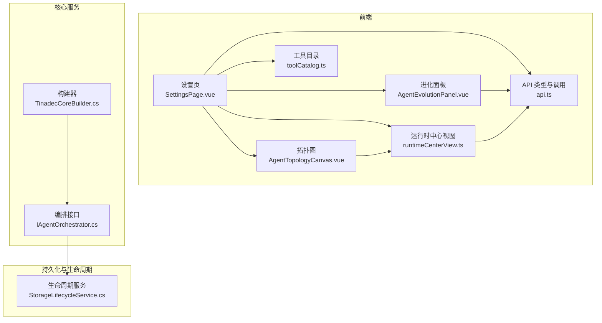
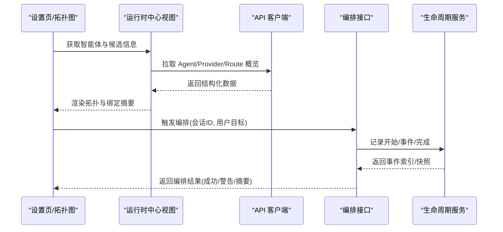
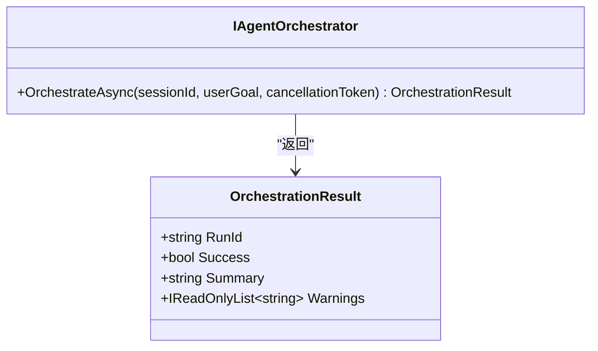
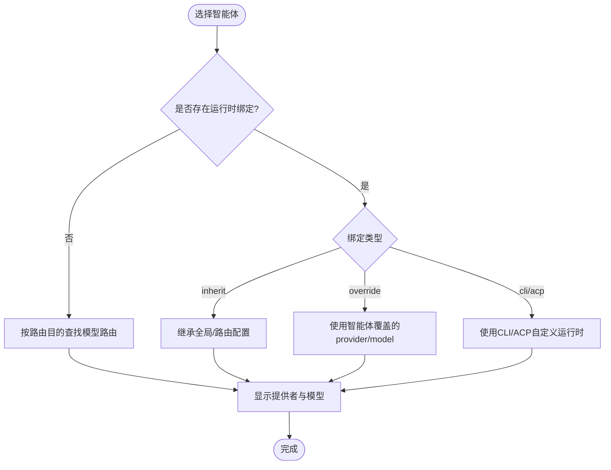
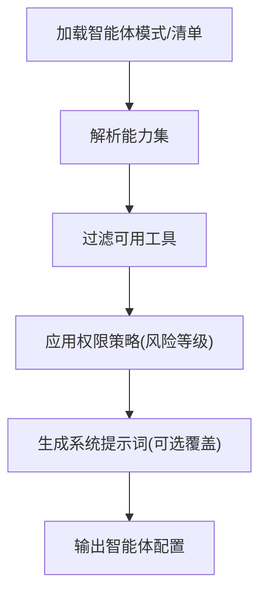
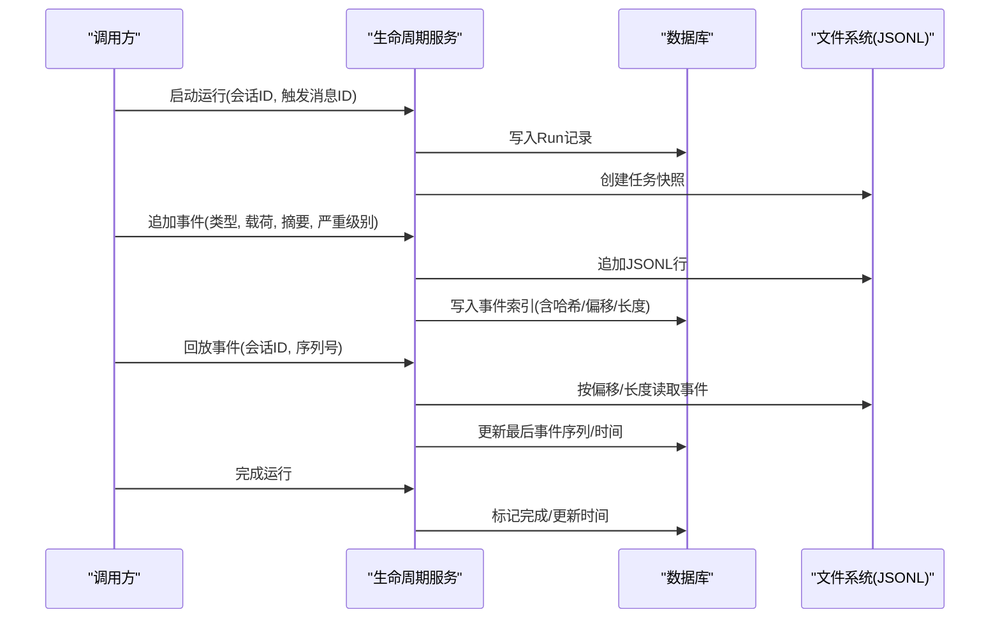
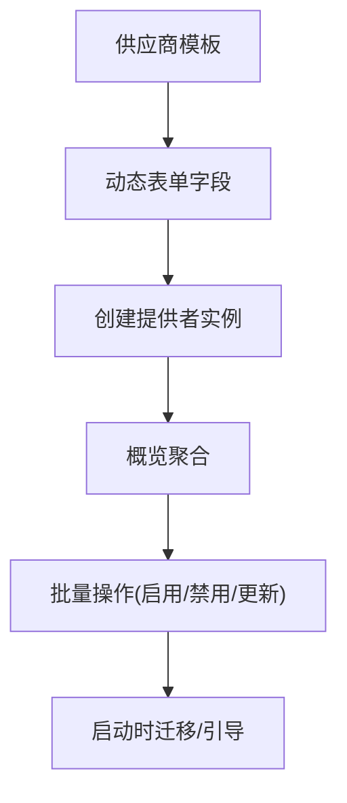
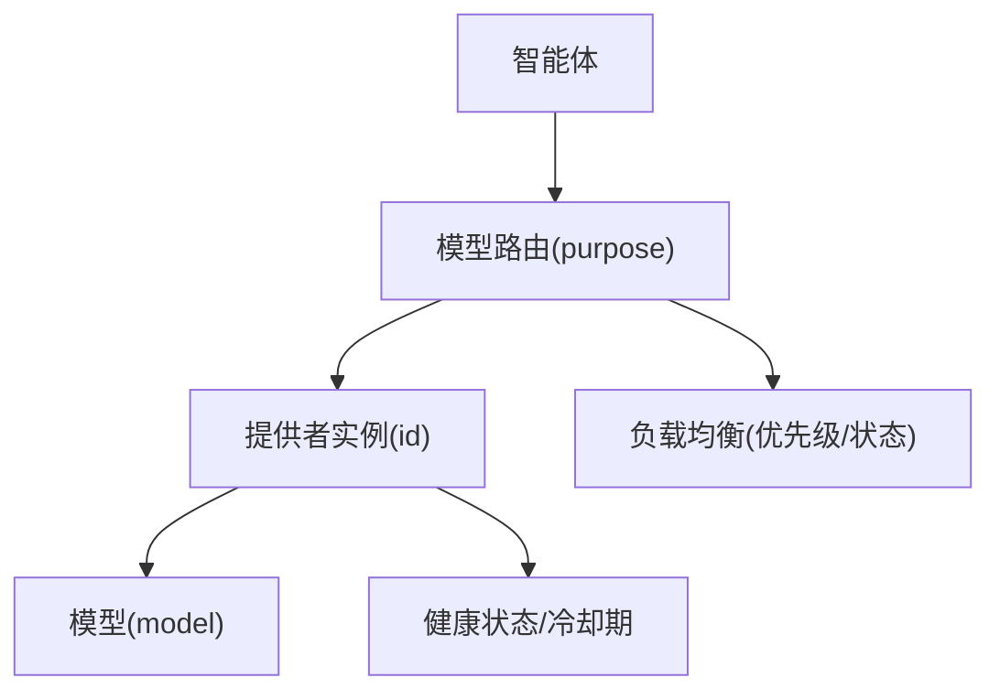
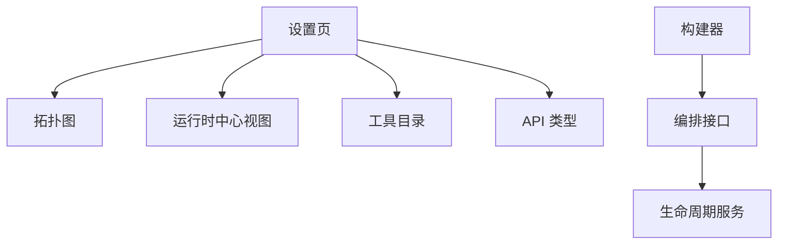

# 智能体设置

<cite>
**本文引用的文件**   
- [IAgentOrchestrator.cs](file://TinadecCore/Abstractions/Ports/IAgentOrchestrator.cs)
- [TinadecCoreBuilder.cs](file://TinadecCore/Runtime/TinadecCoreBuilder.cs)
- [StorageLifecycleService.cs](file://TinadecCore/Lifecycle/StorageLifecycleService.cs)
- [AgentTopologyCanvas.vue](file://apps/desktop/src/components/AgentTopologyCanvas.vue)
- [SettingsPage.vue](file://apps/desktop/src/pages/SettingsPage.vue)
- [runtimeCenterView.ts](file://apps/desktop/src/runtimeCenterView.ts)
- [toolCatalog.ts](file://apps/desktop/src/toolCatalog.ts)
- [AgentEvolutionPanel.vue](file://apps/desktop/src/components/AgentEvolutionPanel.vue)
- [api.ts](file://apps/desktop/src/api.ts)
</cite>

## 目录
1. [简介](#简介)
2. [项目结构](#项目结构)
3. [核心组件](#核心组件)
4. [架构总览](#架构总览)
5. [详细组件分析](#详细组件分析)
6. [依赖关系分析](#依赖关系分析)
7. [性能考虑](#性能考虑)
8. [故障排查指南](#故障排查指南)
9. [结论](#结论)
10. [附录](#附录)

## 简介
本文件面向“智能体设置”模块，系统化说明双层智能体（规划层与执行层）的配置方法、运行时绑定策略（继承、覆盖与自定义运行环境）、能力声明与工具权限管理、系统提示词配置、拓扑图可视化（关系图与列表视图切换）、生命周期管理与状态监控调试、模板库与批量部署、以及智能体与模型的关联与负载均衡策略。文档同时提供代码级架构图与流程图，帮助读者快速理解并高效使用。

## 项目结构
智能体设置涉及前端界面、运行时编排与后端持久化三大层面：
- 前端界面：设置页、拓扑图、进化面板等，负责用户交互与数据展示。
- 运行时编排：定义双层智能体的编排接口与构建器，支撑任务调度与结果聚合。
- 持久化与生命周期：记录运行事件、快照与索引，支持回放与一致性修复。

**图表来源** 
- [SettingsPage.vue](file://apps/desktop/src/pages/SettingsPage.vue)
- [AgentTopologyCanvas.vue](file://apps/desktop/src/components/AgentTopologyCanvas.vue)
- [AgentEvolutionPanel.vue](file://apps/desktop/src/components/AgentEvolutionPanel.vue)
- [runtimeCenterView.ts](file://apps/desktop/src/runtimeCenterView.ts)
- [toolCatalog.ts](file://apps/desktop/src/toolCatalog.ts)
- [api.ts](file://apps/desktop/src/api.ts)
- [IAgentOrchestrator.cs](file://TinadecCore/Abstractions/Ports/IAgentOrchestrator.cs)
- [TinadecCoreBuilder.cs](file://TinadecCore/Runtime/TinadecCoreBuilder.cs)
- [StorageLifecycleService.cs](file://TinadecCore/Lifecycle/StorageLifecycleService.cs)

**章节来源**
- [SettingsPage.vue](file://apps/desktop/src/pages/SettingsPage.vue)
- [AgentTopologyCanvas.vue](file://apps/desktop/src/components/AgentTopologyCanvas.vue)
- [AgentEvolutionPanel.vue](file://apps/desktop/src/components/AgentEvolutionPanel.vue)
- [runtimeCenterView.ts](file://apps/desktop/src/runtimeCenterView.ts)
- [toolCatalog.ts](file://apps/desktop/src/toolCatalog.ts)
- [api.ts](file://apps/desktop/src/api.ts)
- [IAgentOrchestrator.cs](file://TinadecCore/Abstractions/Ports/IAgentOrchestrator.cs)
- [TinadecCoreBuilder.cs](file://TinadecCore/Runtime/TinadecCoreBuilder.cs)
- [StorageLifecycleService.cs](file://TinadecCore/Lifecycle/StorageLifecycleService.cs)

## 核心组件
- 双层智能体编排接口：定义规划层与执行层的统一编排入口，支持会话级目标驱动的任务编排与结果汇总。
- 构建器：收集模块描述并委托 DI 完成服务注册，便于扩展与装配。
- 生命周期服务：以事件日志与索引的方式记录运行轨迹，支持回放、诊断与一致性修复。
- 前端设置与可视化：提供智能体拓扑图（关系图/列表切换）、运行时绑定选择、能力与工具权限配置、系统提示词编辑、进化提案与批量操作。

**章节来源**
- [IAgentOrchestrator.cs](file://TinadecCore/Abstractions/Ports/IAgentOrchestrator.cs)
- [TinadecCoreBuilder.cs](file://TinadecCore/Runtime/TinadecCoreBuilder.cs)
- [StorageLifecycleService.cs](file://TinadecCore/Lifecycle/StorageLifecycleService.cs)
- [AgentTopologyCanvas.vue](file://apps/desktop/src/components/AgentTopologyCanvas.vue)
- [SettingsPage.vue](file://apps/desktop/src/pages/SettingsPage.vue)
- [runtimeCenterView.ts](file://apps/desktop/src/runtimeCenterView.ts)
- [toolCatalog.ts](file://apps/desktop/src/toolCatalog.ts)
- [AgentEvolutionPanel.vue](file://apps/desktop/src/components/AgentEvolutionPanel.vue)
- [api.ts](file://apps/desktop/src/api.ts)

## 架构总览
下图展示了从前端到核心编排与持久化的整体交互流程，包括智能体拓扑展示、运行时绑定解析、模型路由与提供者实例、以及事件回放与诊断。

**图表来源** 
- [SettingsPage.vue](file://apps/desktop/src/pages/SettingsPage.vue)
- [AgentTopologyCanvas.vue](file://apps/desktop/src/components/AgentTopologyCanvas.vue)
- [runtimeCenterView.ts](file://apps/desktop/src/runtimeCenterView.ts)
- [api.ts](file://apps/desktop/src/api.ts)
- [IAgentOrchestrator.cs](file://TinadecCore/Abstractions/Ports/IAgentOrchestrator.cs)
- [StorageLifecycleService.cs](file://TinadecCore/Lifecycle/StorageLifecycleService.cs)

## 详细组件分析

### 双层智能体编排（规划层与执行层）
- 规划层：主动式规划与监督，负责将用户目标分解为可执行任务序列。
- 执行层：被动式任务执行，接收规划层指令并产出结果。
- 编排接口：统一入口，支持异步编排、取消令牌、结果摘要与警告收集。

**图表来源** 
- [IAgentOrchestrator.cs](file://TinadecCore/Abstractions/Ports/IAgentOrchestrator.cs)

**章节来源**
- [IAgentOrchestrator.cs](file://TinadecCore/Abstractions/Ports/IAgentOrchestrator.cs)

### 运行时绑定配置（继承、覆盖与自定义运行环境）
- 继承：默认从全局模型中心或路由继承 provider/model。
- 覆盖：在智能体级别指定 provider_instance_id 与 model_id，实现按智能体覆盖。
- 自定义运行环境：支持 CLI/ACP 等本地运行时，通过 runtime_id 与 driver 指定。
- 前端解析：根据 binding.runtime_kind 与 route_purpose 计算显示名称与模型。

**图表来源** 
- [AgentTopologyCanvas.vue](file://apps/desktop/src/components/AgentTopologyCanvas.vue)
- [runtimeCenterView.ts](file://apps/desktop/src/runtimeCenterView.ts)
- [api.ts](file://apps/desktop/src/api.ts)

**章节来源**
- [AgentTopologyCanvas.vue](file://apps/desktop/src/components/AgentTopologyCanvas.vue)
- [runtimeCenterView.ts](file://apps/desktop/src/runtimeCenterView.ts)
- [api.ts](file://apps/desktop/src/api.ts)

### 智能体能力声明、工具权限与系统提示词
- 能力声明：通过 capabilities 字段声明智能体具备的能力（如 streaming、tool-calls、json-mode、workspace）。
- 工具权限：allowed_tools 控制智能体可调用的工具集合，支持按风险等级筛选与排序。
- 系统提示词：system_prompt 允许对智能体行为进行定制，可在进化提案中预填建议。

**图表来源** 
- [toolCatalog.ts](file://apps/desktop/src/toolCatalog.ts)
- [AgentEvolutionPanel.vue](file://apps/desktop/src/components/AgentEvolutionPanel.vue)
- [api.ts](file://apps/desktop/src/api.ts)

**章节来源**
- [toolCatalog.ts](file://apps/desktop/src/toolCatalog.ts)
- [AgentEvolutionPanel.vue](file://apps/desktop/src/components/AgentEvolutionPanel.vue)
- [api.ts](file://apps/desktop/src/api.ts)

### 智能体拓扑图可视化（关系图与列表视图切换）
- 关系图：分层展示规划层与执行层智能体节点，标注运行时提供者与模型。
- 列表视图：以表格形式列出智能体、候选与绑定详情，便于批量操作。
- 交互：单击选中、双击进入配置；支持候选分支展示与标签映射。

**图表来源** 
- [AgentTopologyCanvas.vue](file://apps/desktop/src/components/AgentTopologyCanvas.vue)
- [SettingsPage.vue](file://apps/desktop/src/pages/SettingsPage.vue)

**章节来源**
- [AgentTopologyCanvas.vue](file://apps/desktop/src/components/AgentTopologyCanvas.vue)
- [SettingsPage.vue](file://apps/desktop/src/pages/SettingsPage.vue)

### 智能体生命周期管理、状态监控与调试
- 生命周期：启动运行、追加事件、完成运行、回放事件、一致性修复与迁移。
- 状态监控：事件索引包含时间戳、严重级别、摘要与负载哈希，支持按会话/序列回放。
- 调试：任务快照与诊断消息辅助定位问题，支持 JSONL 事件文件读取与校验。

**图表来源** 
- [StorageLifecycleService.cs](file://TinadecCore/Lifecycle/StorageLifecycleService.cs)

**章节来源**
- [StorageLifecycleService.cs](file://TinadecCore/Lifecycle/StorageLifecycleService.cs)

### 智能体模板库、批量部署与配置迁移
- 模板库：基于供应商/驱动模板生成表单字段与默认值，支持云API、本地服务器与CLI/ACP。
- 批量部署：通过概览数据构建提供者实例列表，支持搜索、过滤与批量启用/禁用。
- 配置迁移：生命周期服务在启动时执行迁移与表结构引导，确保存储一致性。

**图表来源** 
- [runtimeCenterView.ts](file://apps/desktop/src/runtimeCenterView.ts)
- [SettingsPage.vue](file://apps/desktop/src/pages/SettingsPage.vue)
- [StorageLifecycleService.cs](file://TinadecCore/Lifecycle/StorageLifecycleService.cs)

**章节来源**
- [runtimeCenterView.ts](file://apps/desktop/src/runtimeCenterView.ts)
- [SettingsPage.vue](file://apps/desktop/src/pages/SettingsPage.vue)
- [StorageLifecycleService.cs](file://TinadecCore/Lifecycle/StorageLifecycleService.cs)

### 智能体与模型的关联关系与负载均衡策略
- 关联关系：智能体通过 model_route_purpose 与 ModelRouteDto 关联至具体 provider_instance_id 与 model。
- 负载均衡：通过多提供者实例与健康检查，结合路由优先级与状态（ready/warning/blocked）进行分配。
- 前端展示：运行时中心视图聚合 API/CLI/ACP 提供者，统一呈现状态与诊断信息。

**图表来源** 
- [api.ts](file://apps/desktop/src/api.ts)
- [runtimeCenterView.ts](file://apps/desktop/src/runtimeCenterView.ts)
- [SettingsPage.vue](file://apps/desktop/src/pages/SettingsPage.vue)

**章节来源**
- [api.ts](file://apps/desktop/src/api.ts)
- [runtimeCenterView.ts](file://apps/desktop/src/runtimeCenterView.ts)
- [SettingsPage.vue](file://apps/desktop/src/pages/SettingsPage.vue)

## 依赖关系分析
- 前端依赖：设置页依赖拓扑图、运行时中心视图、工具目录与 API 类型定义。
- 核心依赖：编排接口与构建器解耦模块装配，生命周期服务依赖会话定位与存储路径。
- 外部依赖：模型提供者（云API/本地服务/CLI/ACP），事件存储（JSONL+索引）。

**图表来源** 
- [SettingsPage.vue](file://apps/desktop/src/pages/SettingsPage.vue)
- [AgentTopologyCanvas.vue](file://apps/desktop/src/components/AgentTopologyCanvas.vue)
- [runtimeCenterView.ts](file://apps/desktop/src/runtimeCenterView.ts)
- [toolCatalog.ts](file://apps/desktop/src/toolCatalog.ts)
- [api.ts](file://apps/desktop/src/api.ts)
- [IAgentOrchestrator.cs](file://TinadecCore/Abstractions/Ports/IAgentOrchestrator.cs)
- [TinadecCoreBuilder.cs](file://TinadecCore/Runtime/TinadecCoreBuilder.cs)
- [StorageLifecycleService.cs](file://TinadecCore/Lifecycle/StorageLifecycleService.cs)

**章节来源**
- [SettingsPage.vue](file://apps/desktop/src/pages/SettingsPage.vue)
- [AgentTopologyCanvas.vue](file://apps/desktop/src/components/AgentTopologyCanvas.vue)
- [runtimeCenterView.ts](file://apps/desktop/src/runtimeCenterView.ts)
- [toolCatalog.ts](file://apps/desktop/src/toolCatalog.ts)
- [api.ts](file://apps/desktop/src/api.ts)
- [IAgentOrchestrator.cs](file://TinadecCore/Abstractions/Ports/IAgentOrchestrator.cs)
- [TinadecCoreBuilder.cs](file://TinadecCore/Runtime/TinadecCoreBuilder.cs)
- [StorageLifecycleService.cs](file://TinadecCore/Lifecycle/StorageLifecycleService.cs)

## 性能考虑
- 事件回放：采用 JSONL 追加写与索引偏移读取，避免全量扫描，提升回放效率。
- 并发控制：事件写入使用信号量保证单 run 串行，防止竞态条件。
- 前端渲染：拓扑图与列表视图按需过滤与分页，减少大数据量下的渲染压力。
- 提供者健康：缓存健康状态与冷却期，降低频繁探测开销。

[本节为通用指导，不直接分析具体文件]

## 故障排查指南
- 连接问题：检查网关地址与协议，测试健康端点，确认网络可达。
- 绑定未解析：当 runtime_kind 为 unresolved 时，需检查路由与提供者实例是否配置正确。
- 事件不一致：使用回放与一致性修复功能，校验 JSONL 完整性与索引哈希。
- 工具权限：核对 allowed_tools 与风险策略，确保工具来源与能力匹配。

**章节来源**
- [SettingsPage.vue](file://apps/desktop/src/pages/SettingsPage.vue)
- [AgentTopologyCanvas.vue](file://apps/desktop/src/components/AgentTopologyCanvas.vue)
- [StorageLifecycleService.cs](file://TinadecCore/Lifecycle/StorageLifecycleService.cs)

## 结论
智能体设置模块通过清晰的双层编排接口、灵活的运行时绑定策略、完善的生命周期与事件追踪、以及直观的前端可视化，提供了完整的智能体配置与管理能力。借助模板库与批量部署机制，可快速规模化落地；结合模型路由与健康状态，可实现稳定的负载均衡与高可用。

[本节为总结性内容，不直接分析具体文件]

## 附录
- 术语表：
  - 规划层：主动式任务规划与监督的智能体层级。
  - 执行层：被动式任务执行的智能体层级。
  - 运行时绑定：智能体与模型/提供者的关联配置，支持继承与覆盖。
  - 能力声明：智能体对外暴露的功能特性集合。
  - 工具权限：对工具访问的控制策略，通常与风险等级相关。
  - 系统提示词：用于引导智能体行为的文本指令。
  - 拓扑图：展示智能体及其关系的可视化视图。
  - 生命周期：智能体运行的开始、事件记录、完成与回放过程。

[本节为概念性内容，不直接分析具体文件]