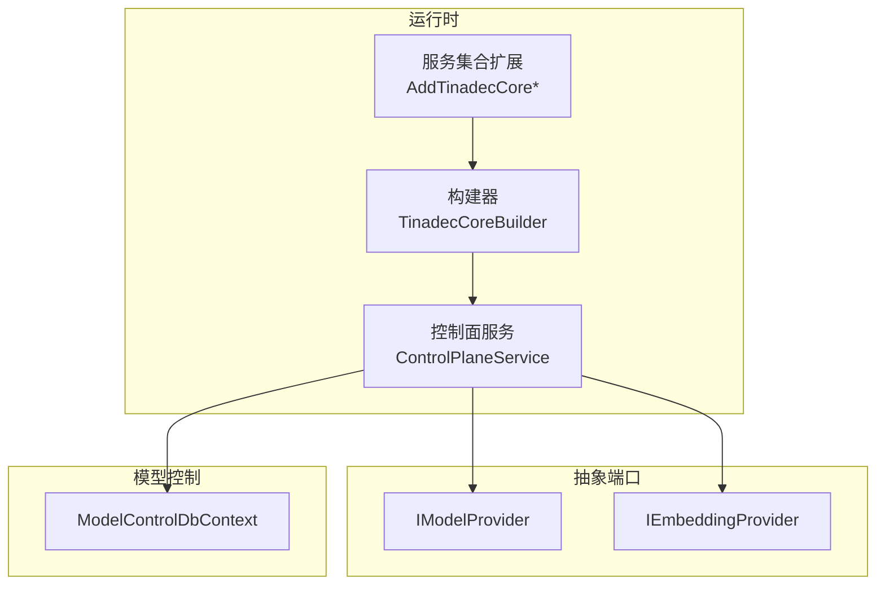
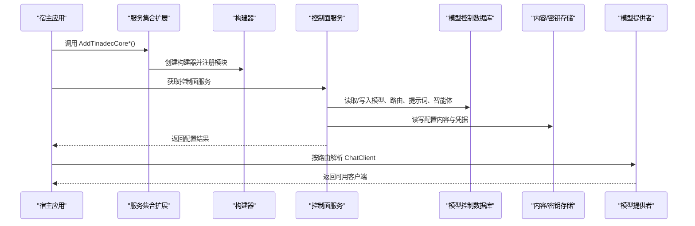
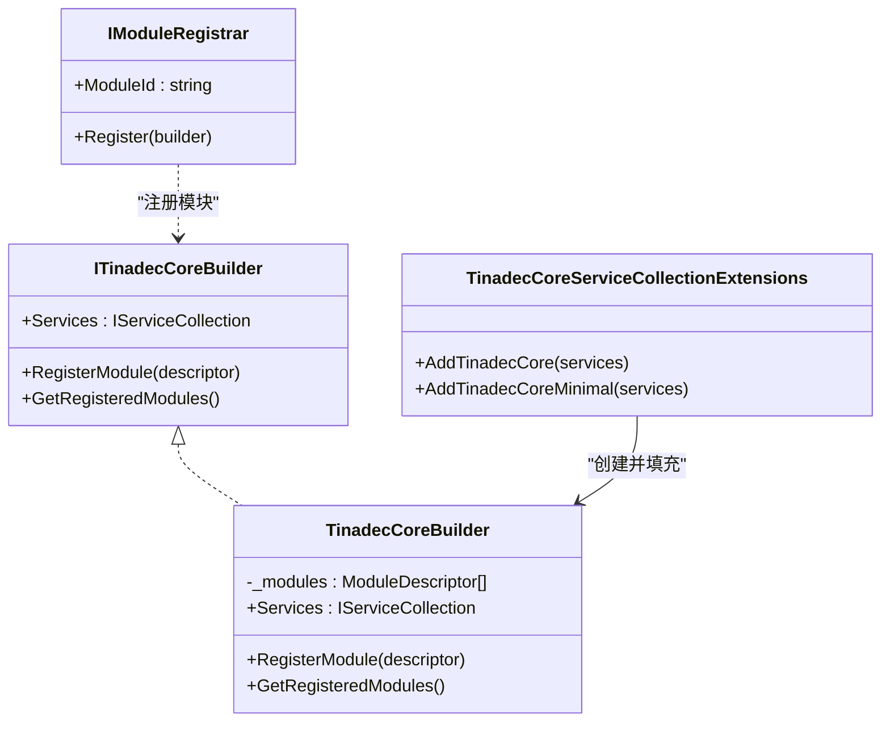
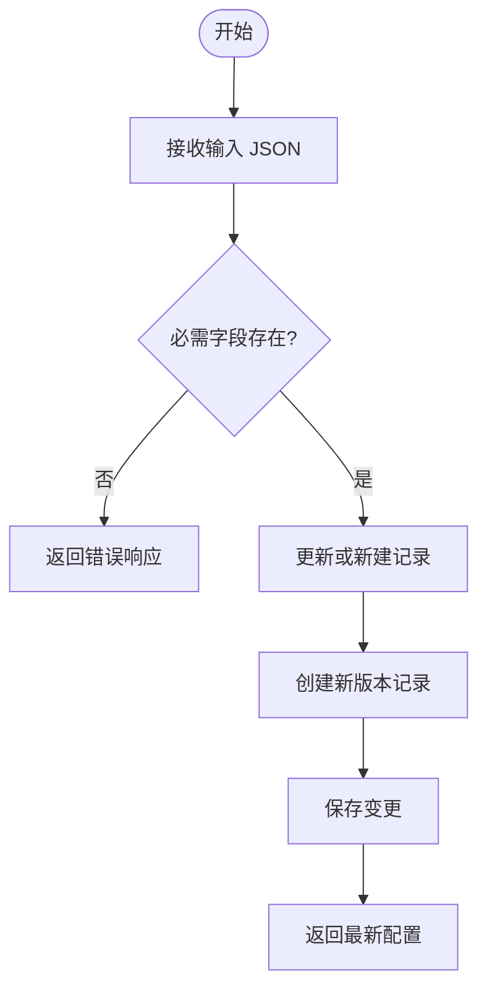
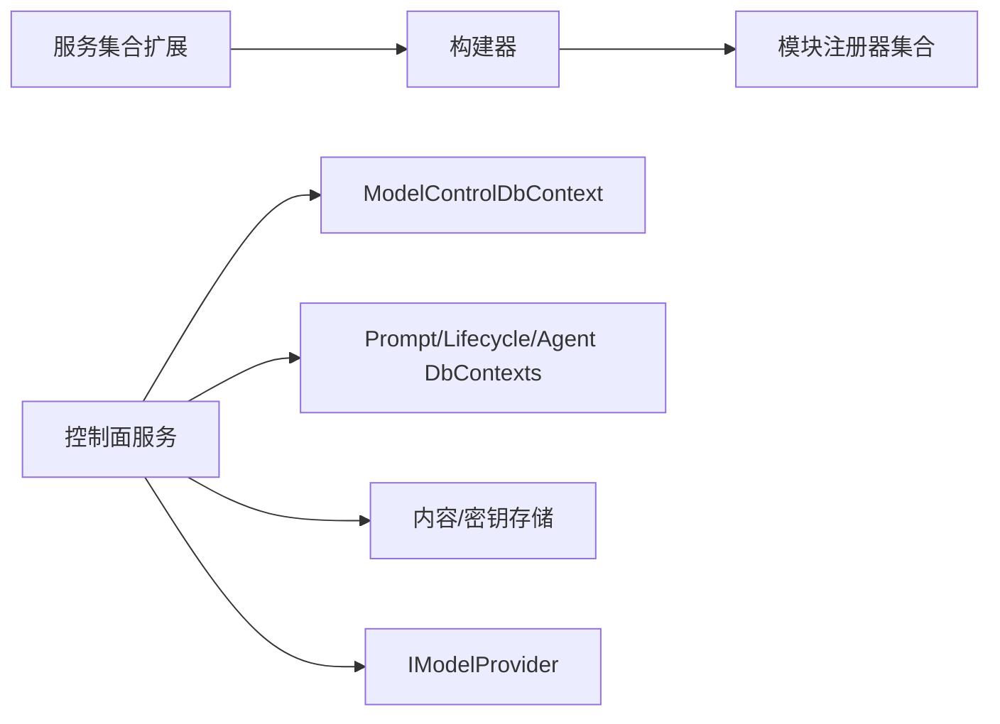

# 智能体运行时配置

<cite>
**本文引用的文件**   
- [TinadecCoreBuilder.cs](file://TinadecCore/Runtime/TinadecCoreBuilder.cs)
- [ControlPlaneService.cs](file://TinadecCore/Runtime/ControlPlaneService.cs)
- [TinadecCoreServiceCollectionExtensions.cs](file://TinadecCore/Runtime/TinadecCoreServiceCollectionExtensions.cs)
- [IModelProvider.cs](file://TinadecCore/Abstractions/Ports/IModelProvider.cs)
- [ITinadecCoreBuilder.cs](file://TinadecCore/Abstractions/ITinadecCoreBuilder.cs)
- [IModuleRegistrar.cs](file://TinadecCore/Abstractions/IModuleRegistrar.cs)
- [ModelControlDbContext.cs](file://TinadecCore/Models/ModelControlDbContext.cs)
</cite>

## 目录
1. [简介](#简介)
2. [项目结构](#项目结构)
3. [核心组件](#核心组件)
4. [架构总览](#架构总览)
5. [详细组件分析](#详细组件分析)
6. [依赖关系分析](#依赖关系分析)
7. [性能与并发调优](#性能与并发调优)
8. [故障诊断与健康检查](#故障诊断与健康检查)
9. [安全与权限控制](#安全与权限控制)
10. [日志、调试与性能分析](#日志调试与性能分析)
11. [结论](#结论)

## 简介
本文件面向“双层智能体架构”的运行时配置，聚焦以下目标：
- 运行时绑定机制：模块注册、服务装配、继承与覆盖策略。
- 模型提供商选择：驱动、连接方式、凭据管理、路由与能力声明。
- CLI 运行时配置与 ACP 适配器设置：通过控制面 API 持久化并生效。
- 运行时状态监控、健康检查与故障诊断：就绪性检测与可观测性。
- 性能调优参数、资源限制与并发控制：在 DI 与存储层进行约束。
- 环境隔离、安全策略与访问权限：租户/工作区隔离、内容存储与密钥管理。
- 日志收集、调试模式与性能分析：统一日志与诊断入口。

## 项目结构
运行时相关代码主要位于 TinadecCore 子项目中，采用模块化设计，通过构建器与模块注册器将各子系统装配到依赖注入容器。关键路径包括：
- 运行时构建与扩展：Runtime 目录下的构建器与服务集合扩展。
- 控制面服务：提供模型、路由、提示词、智能体等配置的 CRUD 接口。
- 抽象端口：模型与嵌入提供者接口，定义就绪性与调用契约。
- 模型控制数据库上下文：模型实例与路由的版本化持久化。

图表来源
- [TinadecCoreBuilder.cs:1-31](file://TinadecCore/Runtime/TinadecCoreBuilder.cs#L1-L31)
- [TinadecCoreServiceCollectionExtensions.cs:20-61](file://TinadecCore/Runtime/TinadecCoreServiceCollectionExtensions.cs#L20-L61)
- [ControlPlaneService.cs:14-71](file://TinadecCore/Runtime/ControlPlaneService.cs#L14-L71)
- [IModelProvider.cs:10-51](file://TinadecCore/Abstractions/Ports/IModelProvider.cs#L10-L51)
- [ModelControlDbContext.cs:5-46](file://TinadecCore/Models/ModelControlDbContext.cs#L5-L46)

章节来源
- [TinadecCoreBuilder.cs:1-31](file://TinadecCore/Runtime/TinadecCoreBuilder.cs#L1-L31)
- [TinadecCoreServiceCollectionExtensions.cs:20-61](file://TinadecCore/Runtime/TinadecCoreServiceCollectionExtensions.cs#L20-L61)

## 核心组件
- 构建器与模块注册
  - ITinadecCoreBuilder：定义服务集合与模块描述符注册接口。
  - TinadecCoreBuilder：默认实现，维护已注册模块列表，暴露 Services 供宿主使用。
  - IModuleRegistrar：模块注册器契约，显式注册服务与描述符（无反射扫描）。
- 服务集合扩展
  - AddTinadecCore：全量注册所有核心模块（租户、向量库、生命周期、模型、上下文、提示词、内存、技能、循环守卫、DMA EA）。
  - AddTinadecCoreMinimal：最小集注册，便于裁剪与编译时优化。
- 控制面服务
  - ControlPlaneService：提供模型提供商、路由、提示词、智能体、审批请求等的增删改查与版本化管理；通过内容存储与密钥存储读写配置与凭据。
- 模型与嵌入提供者接口
  - IModelProvider：按路由或默认解析 ChatClient，支持就绪性检查。
  - IEmbeddingProvider：生成嵌入向量，返回维度与可用性信息。

章节来源
- [ITinadecCoreBuilder.cs:1-52](file://TinadecCore/Abstractions/ITinadecCoreBuilder.cs#L1-L52)
- [IModuleRegistrar.cs:1-17](file://TinadecCore/Abstractions/IModuleRegistrar.cs#L1-L17)
- [TinadecCoreServiceCollectionExtensions.cs:20-61](file://TinadecCore/Runtime/TinadecCoreServiceCollectionExtensions.cs#L20-L61)
- [ControlPlaneService.cs:14-71](file://TinadecCore/Runtime/ControlPlaneService.cs#L14-L71)
- [IModelProvider.cs:10-51](file://TinadecCore/Abstractions/Ports/IModelProvider.cs#L10-L51)

## 架构总览
下图展示运行时装配与控制面数据流的关系：构建器聚合模块，控制面服务通过多个 DbContext 与内容/密钥存储完成配置持久化，并通过 IModelProvider 对外暴露模型能力。

图表来源
- [TinadecCoreServiceCollectionExtensions.cs:20-61](file://TinadecCore/Runtime/TinadecCoreServiceCollectionExtensions.cs#L20-L61)
- [TinadecCoreBuilder.cs:1-31](file://TinadecCore/Runtime/TinadecCoreBuilder.cs#L1-L31)
- [ControlPlaneService.cs:14-71](file://TinadecCore/Runtime/ControlPlaneService.cs#L14-L71)
- [ModelControlDbContext.cs:5-46](file://TinadecCore/Models/ModelControlDbContext.cs#L5-L46)

## 详细组件分析

### 运行时绑定机制（继承、覆盖、自定义运行环境）
- 模块注册顺序决定依赖装配顺序，构建器维护 ModuleDescriptor 列表，宿主可通过扩展方法选择性注册模块，实现最小化或定制化运行环境。
- 覆盖策略：通过显式注册顺序与 DI 替换实现覆盖（例如替换存储实现、调整提供者实现），避免反射扫描带来的不确定性。
- 继承与扩展：新增模块需实现 IModuleRegistrar，并在扩展方法中调用 Register(builder)，从而纳入构建期清单与运行时装配。

图表来源
- [ITinadecCoreBuilder.cs:1-52](file://TinadecCore/Abstractions/ITinadecCoreBuilder.cs#L1-L52)
- [TinadecCoreBuilder.cs:1-31](file://TinadecCore/Runtime/TinadecCoreBuilder.cs#L1-L31)
- [IModuleRegistrar.cs:1-17](file://TinadecCore/Abstractions/IModuleRegistrar.cs#L1-L17)
- [TinadecCoreServiceCollectionExtensions.cs:20-61](file://TinadecCore/Runtime/TinadecCoreServiceCollectionExtensions.cs#L20-L61)

章节来源
- [ITinadecCoreBuilder.cs:1-52](file://TinadecCore/Abstractions/ITinadecCoreBuilder.cs#L1-L52)
- [TinadecCoreBuilder.cs:1-31](file://TinadecCore/Runtime/TinadecCoreBuilder.cs#L1-L31)
- [TinadecCoreServiceCollectionExtensions.cs:20-61](file://TinadecCore/Runtime/TinadecCoreServiceCollectionExtensions.cs#L20-L61)

### 模型提供商选择与路由
- 提供商实例：包含驱动类型、显示名、连接方式、作用域、启用状态、当前版本与修订号。
- 路由：按用途（purpose）映射到具体提供商实例与模型名称，支持版本化与时间戳。
- 控制面 API：提供提供商与路由的增删改查，支持条件匹配（ifMatch）与乐观锁。

图表来源
- [ControlPlaneService.cs:36-55](file://TinadecCore/Runtime/ControlPlaneService.cs#L36-L55)
- [ModelControlDbContext.cs:5-46](file://TinadecCore/Models/ModelControlDbContext.cs#L5-L46)

章节来源
- [ControlPlaneService.cs:36-55](file://TinadecCore/Runtime/ControlPlaneService.cs#L36-L55)
- [ModelControlDbContext.cs:5-46](file://TinadecCore/Models/ModelControlDbContext.cs#L5-L46)

### CLI 运行时配置与 ACP 适配器设置
- CLI 配置通过控制面 API 持久化：提供商、路由、提示词、智能体等均支持 JSON 输入与版本化存储。
- ACP 适配器：通过 IModelProvider 与 IEmbeddingProvider 抽象屏蔽底层差异，CLI 侧只需按 purpose 选择路由即可。
- 建议流程：
  - 使用 CLI 提交提供商配置（driver、connection_kind、base_url、model、binary_path、home_path、server_url、launch_args、capabilities）。
  - 配置路由（purpose -> provider_instance_id, model）。
  - 通过 IModelProvider.GetChatClientAsync(routeId) 获取客户端执行调用。

章节来源
- [ControlPlaneService.cs:36-71](file://TinadecCore/Runtime/ControlPlaneService.cs#L36-L71)
- [IModelProvider.cs:10-51](file://TinadecCore/Abstractions/Ports/IModelProvider.cs#L10-L51)

### 运行时状态监控与健康检查
- 就绪性检查：IModelProvider.CheckReadinessAsync 返回 IsReady、StatusMessage、Warnings。
- 控制面健康：通过 ListProviders/ListRoutes 等接口观察配置是否生效与启用状态。
- 建议集成：
  - 启动时执行 CheckReadinessAsync，记录警告与失败原因。
  - 定期轮询控制面接口，校验配置一致性。

章节来源
- [IModelProvider.cs:10-51](file://TinadecCore/Abstractions/Ports/IModelProvider.cs#L10-L51)
- [ControlPlaneService.cs:36-55](file://TinadecCore/Runtime/ControlPlaneService.cs#L36-L55)

### 运行时性能调优参数、资源限制与并发控制
- DI 与模块裁剪：使用 AddTinadecCoreMinimal 减少不必要的模块，降低启动开销与内存占用。
- 存储层：DbContext 连接池、查询超时、事务粒度影响吞吐；建议在宿主中合理配置 EF Core 选项。
- 并发控制：对控制面写操作使用 ifMatch 乐观锁，避免并发覆盖；读多写少场景可引入缓存层。
- 资源限制：结合宿主进程级限制（CPU/内存）与存储 I/O 限流，确保稳定性。

章节来源
- [TinadecCoreServiceCollectionExtensions.cs:20-61](file://TinadecCore/Runtime/TinadecCoreServiceCollectionExtensions.cs#L20-L61)
- [ControlPlaneService.cs:44-55](file://TinadecCore/Runtime/ControlPlaneService.cs#L44-L55)

### 运行时环境隔离、安全策略与访问权限
- 租户与工作区隔离：所有实体均包含 TenantId、WorkspaceId，确保数据隔离。
- 内容存储与密钥管理：配置内容通过 IContentStore 持久化，敏感凭据通过 ISecretStore 管理。
- 内置项保护：内置提示词与智能体为只读，防止误改。
- 建议策略：
  - 严格校验输入与作用域（scope）。
  - 使用最小权限原则访问内容/密钥存储。
  - 审计变更记录（Created/UpdatedByPrincipalId、CreatedAt/UpdatedAt）。

章节来源
- [ControlPlaneService.cs:56-71](file://TinadecCore/Runtime/ControlPlaneService.cs#L56-L71)
- [ModelControlDbContext.cs:5-46](file://TinadecCore/Models/ModelControlDbContext.cs#L5-L46)

### 运行时日志收集、调试模式与性能分析工具
- 日志建议：
  - 控制面 API 入参/出参、异常堆栈、数据库操作耗时。
  - 模型调用链路（路由解析、客户端创建、调用结果）。
- 调试模式：
  - 开启详细日志级别，输出配置加载与版本切换过程。
  - 使用 ifMatch 失败码（412）定位并发冲突。
- 性能分析：
  - 采集 EF Core 慢查询与连接池指标。
  - 监控 I/O 延迟与内容/密钥存储吞吐。

[本节为通用指导，不直接分析具体文件]

## 依赖关系分析
- 构建器依赖模块注册器，扩展方法按依赖顺序注册模块。
- 控制面服务依赖多个 DbContext 工厂与存储接口，解耦数据源与业务逻辑。
- 模型提供者接口作为外部能力边界，屏蔽底层实现差异。

图表来源
- [TinadecCoreServiceCollectionExtensions.cs:20-61](file://TinadecCore/Runtime/TinadecCoreServiceCollectionExtensions.cs#L20-L61)
- [ControlPlaneService.cs:14-71](file://TinadecCore/Runtime/ControlPlaneService.cs#L14-L71)
- [ModelControlDbContext.cs:5-46](file://TinadecCore/Models/ModelControlDbContext.cs#L5-L46)

章节来源
- [TinadecCoreServiceCollectionExtensions.cs:20-61](file://TinadecCore/Runtime/TinadecCoreServiceCollectionExtensions.cs#L20-L61)
- [ControlPlaneService.cs:14-71](file://TinadecCore/Runtime/ControlPlaneService.cs#L14-L71)

## 性能与并发调优
- 启动优化：按需注册模块，减少初始化成本。
- 查询优化：合理使用索引（如租户+工作区+驱动+删除标记），避免全表扫描。
- 并发控制：使用乐观锁（Revision/ifMatch）保障一致性；批量写入分事务处理。
- 存储优化：内容存储与密钥存储应独立于主库，避免阻塞。

章节来源
- [ModelControlDbContext.cs:5-46](file://TinadecCore/Models/ModelControlDbContext.cs#L5-L46)
- [ControlPlaneService.cs:44-55](file://TinadecCore/Runtime/ControlPlaneService.cs#L44-L55)

## 故障诊断与健康检查
- 健康检查：调用 CheckReadinessAsync 获取就绪状态与警告信息。
- 配置一致性：对比路由与提供商实例是否存在且启用。
- 常见问题：
  - 412 预条件失败：检查 ifMatch 与 Revision。
  - 内置项只读：提示词/智能体修改需克隆后编辑。
  - 凭据缺失：确认密钥存储中存在对应 SecretReference。

章节来源
- [IModelProvider.cs:10-51](file://TinadecCore/Abstractions/Ports/IModelProvider.cs#L10-L51)
- [ControlPlaneService.cs:44-71](file://TinadecCore/Runtime/ControlPlaneService.cs#L44-L71)

## 安全与权限控制
- 数据隔离：TenantId/WorkspaceId 强制隔离。
- 凭据安全：ISecretStore 管理敏感信息，避免明文存储。
- 审计追踪：记录创建/更新主体与时间，便于溯源。
- 最小权限：仅授予必要的数据访问权限。

章节来源
- [ControlPlaneService.cs:56-71](file://TinadecCore/Runtime/ControlPlaneService.cs#L56-L71)
- [ModelControlDbContext.cs:5-46](file://TinadecCore/Models/ModelControlDbContext.cs#L5-L46)

## 日志、调试与性能分析
- 日志规范：结构化日志，包含租户、工作区、操作类型、耗时与错误码。
- 调试模式：开启详细日志，捕获配置加载与版本切换事件。
- 性能分析：采集数据库慢查询、存储 I/O 指标与模型调用延迟。

[本节为通用指导，不直接分析具体文件]

## 结论
通过构建器与模块注册器的显式装配、控制面服务的版本化配置与 IModelProvider 的统一抽象，系统实现了灵活的双层智能体运行时绑定机制。借助健康检查、乐观锁与存储隔离，保障了稳定性与安全性。建议在生产环境中结合宿主级资源限制与可观测性体系，持续优化性能与可靠性。