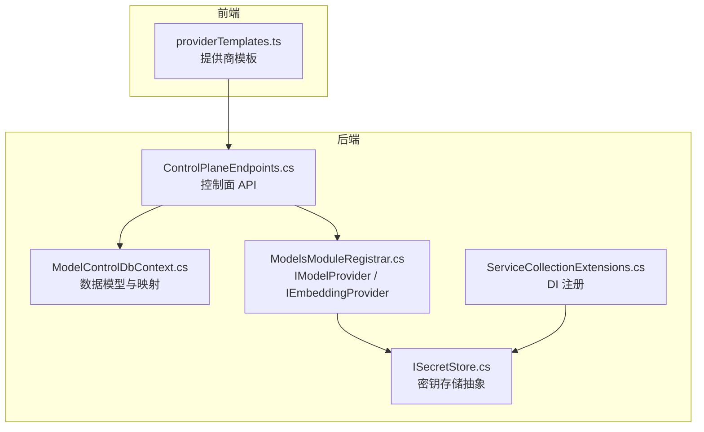
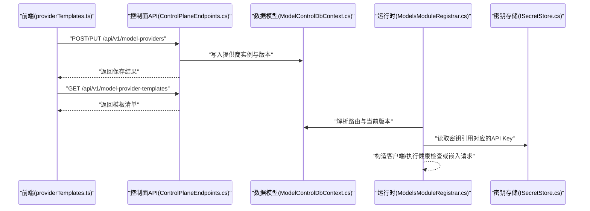
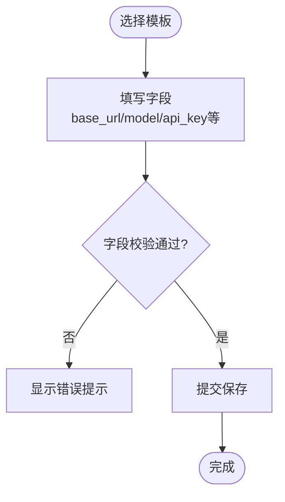
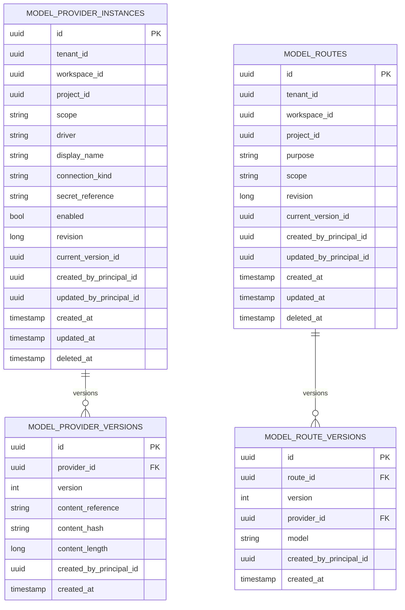
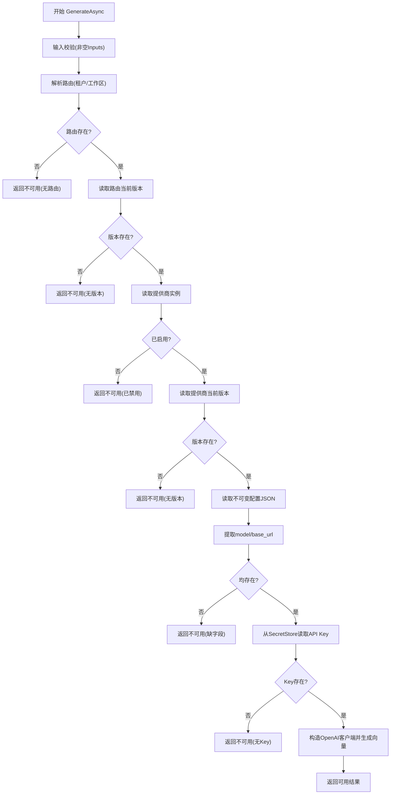
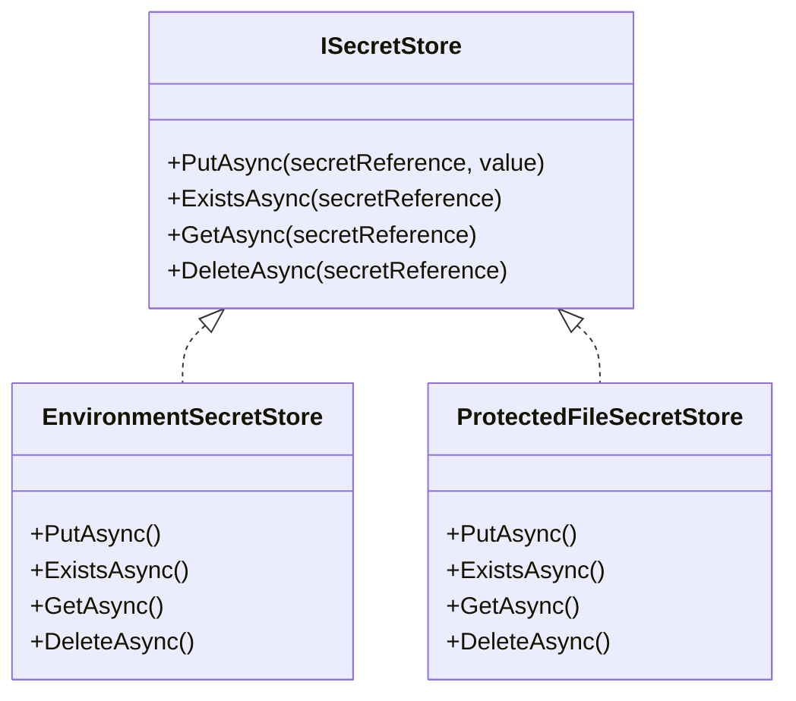
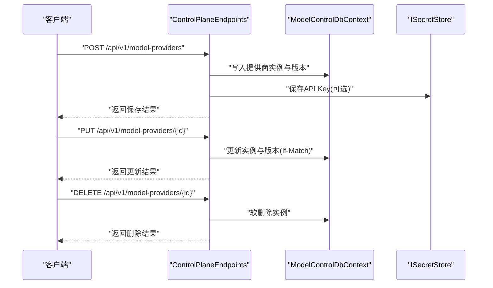
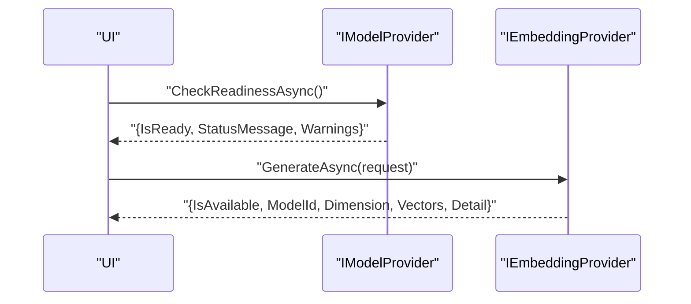
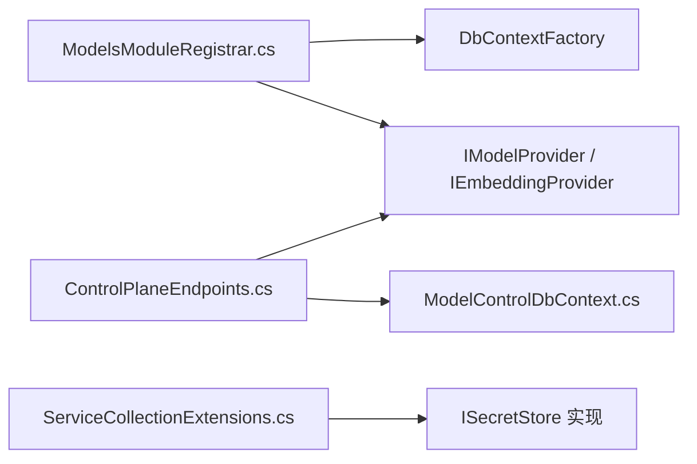

# 提供商管理

<cite>
**本文引用的文件**   
- [IModelProvider.cs](file://TinadecCore/Abstractions/Ports/IModelProvider.cs)
- [ModelsModuleRegistrar.cs](file://TinadecCore/Models/ModelsModuleRegistrar.cs)
- [ModelControlDbContext.cs](file://TinadecCore/Models/ModelControlDbContext.cs)
- [ISecretStore.cs](file://TinadecCore/Persistence/ISecretStore.cs)
- [ServiceCollectionExtensions.cs](file://TinadecCore/Persistence/ServiceCollectionExtensions.cs)
- [ControlPlaneEndpoints.cs](file://TinadecCore/Api/Endpoints/ControlPlaneEndpoints.cs)
- [providerTemplates.ts](file://apps/desktop/src/providerTemplates.ts)
</cite>

## 目录
1. [简介](#简介)
2. [项目结构](#项目结构)
3. [核心组件](#核心组件)
4. [架构总览](#架构总览)
5. [详细组件分析](#详细组件分析)
6. [依赖关系分析](#依赖关系分析)
7. [性能考虑](#性能考虑)
8. [故障排除指南](#故障排除指南)
9. [结论](#结论)
10. [附录](#附录)

## 简介
本文件面向“模型提供商管理”功能，系统性说明如何添加、编辑与删除不同驱动类型的提供商实例（如 OpenAI、Anthropic、本地模型等），涵盖 API Key 的安全存储机制、连接测试与健康检查、提供商实例生命周期管理（启用/禁用与批量操作）、配置验证规则、错误处理与故障排除，以及提供商模板的使用与自定义扩展机制。

## 项目结构
该功能由前端模板定义、后端数据模型与持久化、API 端点、运行时解析与密钥存储等模块共同组成：
- 前端模板：提供多种驱动类型（OpenAI 兼容、Anthropic、Google、Ollama、vLLM、LM Studio、CLI 代理等）的表单字段、默认值与能力声明。
- 数据模型：提供商实例、版本、路由及其版本的数据库实体与 EF Core 映射。
- 运行时：通过 IModelProvider/IEmbeddingProvider 抽象进行客户端获取、健康检查与嵌入生成。
- 安全存储：ISecretStore 抽象及平台适配实现（Windows 保护文件、环境变量）。
- API 端点：提供商列表、创建/更新/删除、模板查询、路由管理等控制面接口。

**图表来源** 
- [providerTemplates.ts:1-471](file://apps/desktop/src/providerTemplates.ts#L1-L471)
- [ControlPlaneEndpoints.cs:10-18](file://TinadecCore/Api/Endpoints/ControlPlaneEndpoints.cs#L10-L18)
- [ModelControlDbContext.cs:1-46](file://TinadecCore/Models/ModelControlDbContext.cs#L1-L46)
- [ModelsModuleRegistrar.cs:43-168](file://TinadecCore/Models/ModelsModuleRegistrar.cs#L43-L168)
- [ISecretStore.cs:1-65](file://TinadecCore/Persistence/ISecretStore.cs#L1-L65)
- [ServiceCollectionExtensions.cs:44-46](file://TinadecCore/Persistence/ServiceCollectionExtensions.cs#L44-L46)

**章节来源**
- [providerTemplates.ts:1-471](file://apps/desktop/src/providerTemplates.ts#L1-L471)
- [ModelControlDbContext.cs:1-46](file://TinadecCore/Models/ModelControlDbContext.cs#L1-L46)
- [ModelsModuleRegistrar.cs:43-168](file://TinadecCore/Models/ModelsModuleRegistrar.cs#L43-L168)
- [ISecretStore.cs:1-65](file://TinadecCore/Persistence/ISecretStore.cs#L1-L65)
- [ServiceCollectionExtensions.cs:44-46](file://TinadecCore/Persistence/ServiceCollectionExtensions.cs#L44-L46)
- [ControlPlaneEndpoints.cs:10-18](file://TinadecCore/Api/Endpoints/ControlPlaneEndpoints.cs#L10-L18)

## 核心组件
- IModelProvider：统一获取聊天客户端与检查就绪状态，不直接暴露凭证。
- IEmbeddingProvider：按租户/工作区解析 embedding 路由，读取不可变内容存储中的配置，从密钥存储获取 API Key，调用 OpenAI 兼容嵌入端点并返回结构化结果。
- ModelControlDbContext：提供商实例、版本、路由与路由版本的持久化模型与索引约束。
- ISecretStore：密钥存取抽象，支持只读环境注入与可写平台实现（Windows DPAPI 保护文件）。
- ControlPlaneEndpoints：提供商 CRUD、模板查询、路由管理的 HTTP 端点。
- providerTemplates.ts：前端驱动的模板集合，包含 driver、connection_kind、capabilities、fields、placeholders 等元数据。

**章节来源**
- [IModelProvider.cs:10-51](file://TinadecCore/Abstractions/Ports/IModelProvider.cs#L10-L51)
- [ModelsModuleRegistrar.cs:43-168](file://TinadecCore/Models/ModelsModuleRegistrar.cs#L43-L168)
- [ModelControlDbContext.cs:1-46](file://TinadecCore/Models/ModelControlDbContext.cs#L1-L46)
- [ISecretStore.cs:1-65](file://TinadecCore/Persistence/ISecretStore.cs#L1-L65)
- [ControlPlaneEndpoints.cs:10-18](file://TinadecCore/Api/Endpoints/ControlPlaneEndpoints.cs#L10-L18)
- [providerTemplates.ts:1-471](file://apps/desktop/src/providerTemplates.ts#L1-L471)

## 架构总览
下图展示了从前端模板到后端 API、数据模型、运行时解析与密钥存储的整体交互流程。

**图表来源** 
- [ControlPlaneEndpoints.cs:10-18](file://TinadecCore/Api/Endpoints/ControlPlaneEndpoints.cs#L10-L18)
- [ModelControlDbContext.cs:1-46](file://TinadecCore/Models/ModelControlDbContext.cs#L1-L46)
- [ModelsModuleRegistrar.cs:70-168](file://TinadecCore/Models/ModelsModuleRegistrar.cs#L70-L168)
- [ISecretStore.cs:1-65](file://TinadecCore/Persistence/ISecretStore.cs#L1-L65)
- [providerTemplates.ts:1-471](file://apps/desktop/src/providerTemplates.ts#L1-L471)

## 详细组件分析

### 提供商模板与前端配置
- 模板字段：driver、display_name_key、summary_key、connection_kind（api-key/cli/local-server/public-api）、category（cloud-api/local-server/agent-cli/custom）、default_base_url、default_model、capabilities、brand_color、icon、fields、placeholders。
- 支持的驱动示例：openai-compatible、anthropic、google、deepseek、openrouter、pollinations、groq、togetherai、fireworks、xai、mistral、cohere、qwen、azure-openai、aws-bedrock、github-copilot、ollama、vllm、sglang、lmstudio、llamacpp、codex-cli、claude-cli、cursor-acp、opencode、custom。
- 使用方式：前端根据模板渲染表单，校验必填字段（如 base_url、model、api_key/binary_path/server_url/launch_args），提交后由后端保存为不可变版本。

**章节来源**
- [providerTemplates.ts:25-59](file://apps/desktop/src/providerTemplates.ts#L25-L59)
- [providerTemplates.ts:68-458](file://apps/desktop/src/providerTemplates.ts#L68-L458)

### 数据模型与版本化
- 表 model_provider_instances：记录提供商实例（Id、TenantId、WorkspaceId、ProjectId、Scope、Driver、DisplayName、ConnectionKind、SecretReference、Enabled、Revision、CurrentVersionId、审计字段、DeletedAt）。
- 表 model_provider_versions：记录不可变配置版本（ProviderId、Version、ContentReference、ContentHash、ContentLength、审计字段）。
- 表 model_routes：路由（Purpose、Scope、TenantId、WorkspaceId、ProjectId、审计字段、DeletedAt）。
- 表 model_route_versions：路由版本（RouteId、Version、ProviderId、Model、审计字段）。
- 索引与约束：唯一性约束与软删除索引确保多租户隔离与并发安全。

**图表来源** 
- [ModelControlDbContext.cs:15-38](file://TinadecCore/Models/ModelControlDbContext.cs#L15-L38)
- [ModelControlDbContext.cs:42-46](file://TinadecCore/Models/ModelControlDbContext.cs#L42-L46)

**章节来源**
- [ModelControlDbContext.cs:15-38](file://TinadecCore/Models/ModelControlDbContext.cs#L15-L38)
- [ModelControlDbContext.cs:42-46](file://TinadecCore/Models/ModelControlDbContext.cs#L42-L46)

### 运行时解析与嵌入生成
- EmbeddingProvider 解析 embedding 路由，读取当前版本配置，从 SecretStore 获取 API Key，构造 OpenAI 兼容客户端并生成向量。
- 若缺少路由、版本、模型、base_url 或 API Key，返回结构化不可用结果而非伪造数据。

**图表来源** 
- [ModelsModuleRegistrar.cs:85-158](file://TinadecCore/Models/ModelsModuleRegistrar.cs#L85-L158)

**章节来源**
- [ModelsModuleRegistrar.cs:70-168](file://TinadecCore/Models/ModelsModuleRegistrar.cs#L70-L168)

### 安全存储机制（API Key）
- ISecretStore 抽象：Put/Exists/Get/Delete，保证关系型记录中不包含明文或密文密钥。
- EnvironmentSecretStore：只读，用于开发/部署时通过环境变量注入。
- ProtectedFileSecretStore：可写，Windows 下使用 DPAPI 保护文件，其他平台以明文文件存储（建议在生产替换为平台级密钥管理服务）。
- DI 自动选择：Windows 使用 ProtectedFileSecretStore，其他平台使用 EnvironmentSecretStore。

**图表来源** 
- [ISecretStore.cs:1-65](file://TinadecCore/Persistence/ISecretStore.cs#L1-L65)
- [ServiceCollectionExtensions.cs:44-46](file://TinadecCore/Persistence/ServiceCollectionExtensions.cs#L44-L46)

**章节来源**
- [ISecretStore.cs:1-65](file://TinadecCore/Persistence/ISecretStore.cs#L1-L65)
- [ServiceCollectionExtensions.cs:44-46](file://TinadecCore/Persistence/ServiceCollectionExtensions.cs#L44-L46)

### API 端点与生命周期管理
- 提供商管理端点：
  - GET /api/v1/model-providers：列出提供商实例。
  - POST /api/v1/model-providers：新增提供商实例。
  - PUT /api/v1/model-providers/{id}：更新提供商实例（支持 If-Match 乐观锁）。
  - DELETE /api/v1/model-providers/{id}：删除提供商实例（软删除）。
- 模板端点：
  - GET /api/v1/model-provider-templates：返回内置模板元数据。
- 路由管理端点：
  - GET /api/v1/model-routes：列出路由。
  - PUT /api/v1/model-routes/{purpose}：保存路由（含 If-Match）。
- 设置端点：
  - GET/PUT /api/v1/model-settings：当前仅返回占位或能力不可用响应，建议使用 model-providers 进行持久化配置。

**图表来源** 
- [ControlPlaneEndpoints.cs:10-18](file://TinadecCore/Api/Endpoints/ControlPlaneEndpoints.cs#L10-L18)
- [ModelControlDbContext.cs:15-38](file://TinadecCore/Models/ModelControlDbContext.cs#L15-L38)
- [ISecretStore.cs:1-65](file://TinadecCore/Persistence/ISecretStore.cs#L1-L65)

**章节来源**
- [ControlPlaneEndpoints.cs:10-18](file://TinadecCore/Api/Endpoints/ControlPlaneEndpoints.cs#L10-L18)

### 健康检查与连接测试
- IModelProvider.CheckReadinessAsync：返回 IsReady、StatusMessage、Warnings，便于 UI 展示连通性与警告信息。
- EmbeddingProvider.GenerateAsync：在解析失败或缺少必要配置时返回 IsAvailable=false 与 Detail 描述，避免假阳性。

**图表来源** 
- [IModelProvider.cs:10-51](file://TinadecCore/Abstractions/Ports/IModelProvider.cs#L10-L51)
- [ModelsModuleRegistrar.cs:85-158](file://TinadecCore/Models/ModelsModuleRegistrar.cs#L85-L158)

**章节来源**
- [IModelProvider.cs:10-51](file://TinadecCore/Abstractions/Ports/IModelProvider.cs#L10-L51)
- [ModelsModuleRegistrar.cs:85-158](file://TinadecCore/Models/ModelsModuleRegistrar.cs#L85-L158)

### 配置验证规则与错误处理
- 必填字段校验：
  - api-key 类型：base_url、model、api_key。
  - cli 类型：binary_path、home_path 或 launch_args。
  - local-server/public-api：base_url、model；public-api 可不要求 api_key。
- 运行时校验：
  - 路由缺失、版本缺失、提供商未启用、配置字段缺失、API Key 缺失均返回明确的不可用原因。
- 错误处理策略：
  - 结构化返回（IsAvailable=false、Detail 描述），避免抛出异常中断调用链。
  - 健康检查返回 StatusMessage 与 Warnings，辅助定位问题。

**章节来源**
- [providerTemplates.ts:25-59](file://apps/desktop/src/providerTemplates.ts#L25-L59)
- [ModelsModuleRegistrar.cs:85-158](file://TinadecCore/Models/ModelsModuleRegistrar.cs#L85-L158)

### 提供商模板的使用与自定义扩展
- 使用内置模板：
  - 前端根据 driver 匹配 PROVIDER_TEMPLATES，填充 fields 与 placeholders，减少用户输入成本。
- 自定义扩展：
  - 新增模板条目（driver、connection_kind、capabilities、fields、placeholders），并在后端 API 模板端点返回对应元数据。
  - 如需新的驱动类型，需在后端运行时增加相应解析逻辑（例如 CLI 启动参数、本地服务器协议适配）。

**章节来源**
- [providerTemplates.ts:68-458](file://apps/desktop/src/providerTemplates.ts#L68-L458)
- [ControlPlaneEndpoints.cs:14](file://TinadecCore/Api/Endpoints/ControlPlaneEndpoints.cs#L14)

## 依赖关系分析
- 模块注册：ModelsModuleRegistrar 注册 IModelProvider、IEmbeddingProvider 与 EF Core DbContextFactory，声明模块能力（provider_management、model_routing、credential_references、error_normalization、readiness、embedding_generation）。
- DI 装配：ServiceCollectionExtensions 根据运行平台选择 SecretStore 实现。
- 数据访问：ModelControlDbContext 负责提供商实例、版本、路由与路由版本的读写与迁移参与。

**图表来源** 
- [ModelsModuleRegistrar.cs:16-36](file://TinadecCore/Models/ModelsModuleRegistrar.cs#L16-L36)
- [ServiceCollectionExtensions.cs:44-46](file://TinadecCore/Persistence/ServiceCollectionExtensions.cs#L44-L46)
- [ControlPlaneEndpoints.cs:10-18](file://TinadecCore/Api/Endpoints/ControlPlaneEndpoints.cs#L10-L18)
- [ModelControlDbContext.cs:1-12](file://TinadecCore/Models/ModelControlDbContext.cs#L1-L12)

**章节来源**
- [ModelsModuleRegistrar.cs:16-36](file://TinadecCore/Models/ModelsModuleRegistrar.cs#L16-L36)
- [ServiceCollectionExtensions.cs:44-46](file://TinadecCore/Persistence/ServiceCollectionExtensions.cs#L44-L46)
- [ControlPlaneEndpoints.cs:10-18](file://TinadecCore/Api/Endpoints/ControlPlaneEndpoints.cs#L10-L18)
- [ModelControlDbContext.cs:1-12](file://TinadecCore/Models/ModelControlDbContext.cs#L1-L12)

## 性能考虑
- 不可变版本与内容存储：配置变更产生新版本，避免频繁修改活跃配置，提升一致性。
- 懒加载与按需解析：运行时仅在需要时解析路由与读取配置，降低冷启动开销。
- 密钥存储优化：Windows 下 DPAPI 加解密开销较小；生产环境建议替换为高性能密钥管理服务（如云厂商 KMS）。
- 并发与乐观锁：API 层支持 If-Match 头，减少冲突重试。

[本节为通用指导，无需特定文件引用]

## 故障排除指南
- 无法获取聊天客户端：
  - 检查 IModelProvider.GetChatClientAsync 是否返回 null（骨架态或未配置）。
  - 确认路由与提供商实例存在且已启用。
- 嵌入生成失败：
  - 查看 EmbeddingResult.Detail，常见原因包括无路由、无版本、提供商禁用、缺少 base_url/model/API Key。
- 健康检查失败：
  - 检查 CheckReadinessAsync 返回的 StatusMessage 与 Warnings，定位缺失配置或服务不可达。
- 密钥相关问题：
  - 确认 SecretReference 指向有效密钥；Windows 环境下检查受保护文件是否存在；其他平台检查环境变量是否注入。
- 模板与字段错误：
  - 核对前端模板 fields 与 placeholders 是否与后端期望一致；确保必填字段完整。

**章节来源**
- [ModelsModuleRegistrar.cs:43-62](file://TinadecCore/Models/ModelsModuleRegistrar.cs#L43-L62)
- [ModelsModuleRegistrar.cs:85-158](file://TinadecCore/Models/ModelsModuleRegistrar.cs#L85-L158)
- [ISecretStore.cs:1-65](file://TinadecCore/Persistence/ISecretStore.cs#L1-L65)

## 结论
提供商管理功能通过模板驱动的前端配置、版本化的不可变配置存储、健壮的运行时解析与安全的密钥管理机制，提供了可扩展、可观测、可运维的模型接入能力。结合健康检查与结构化错误返回，能够快速定位与修复配置问题，满足多云、本地与 CLI 等多种驱动场景。

[本节为总结，无需特定文件引用]

## 附录
- 常用驱动类型参考：
  - cloud-api：openai-compatible、anthropic、google、deepseek、openrouter、groq、togetherai、fireworks、xai、mistral、cohere、qwen、azure-openai、aws-bedrock、github-copilot。
  - local-server：ollama、vllm、sglang、lmstudio、llamacpp。
  - agent-cli：codex-cli、claude-cli、cursor-acp、opencode。
  - custom：自定义驱动。
- 关键端点速查：
  - /api/v1/model-providers（CRUD）
  - /api/v1/model-provider-templates（模板）
  - /api/v1/model-routes（路由）
  - /api/v1/model-settings（占位/能力不可用）

[本节为概览，无需特定文件引用]