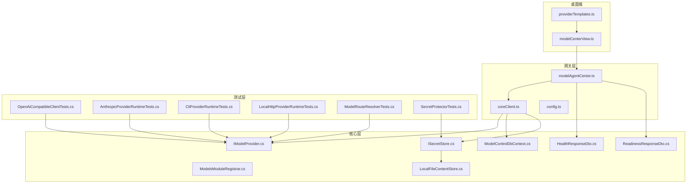
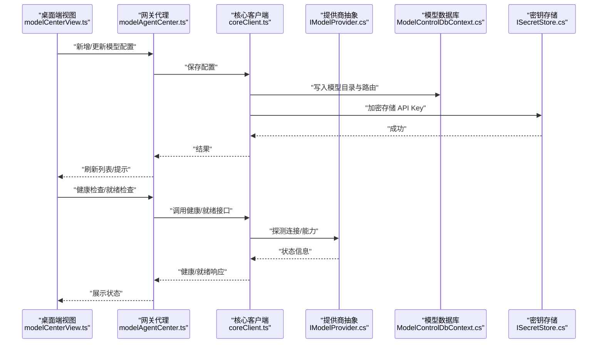
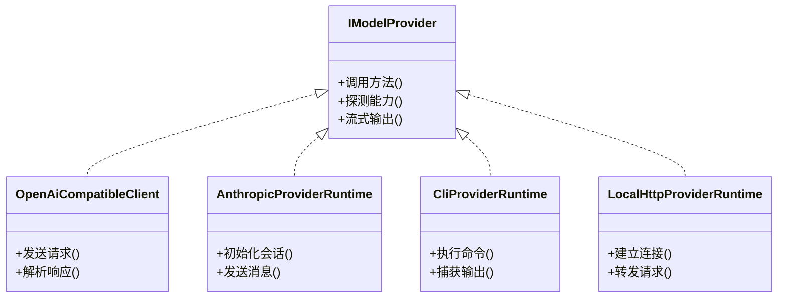
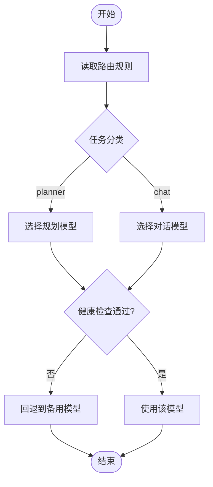
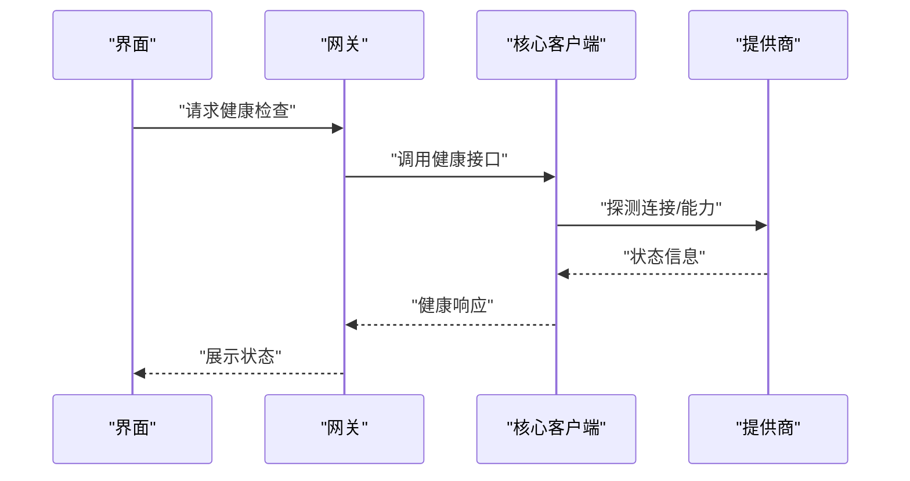
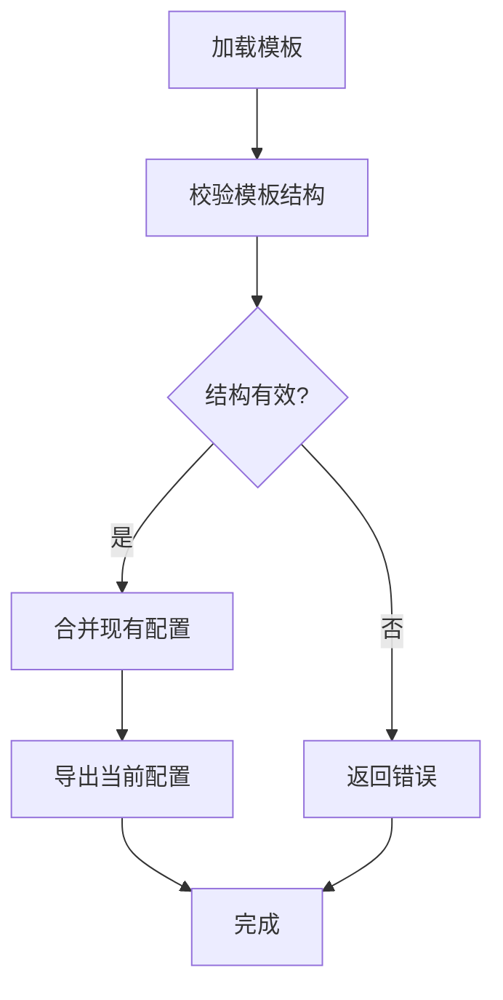
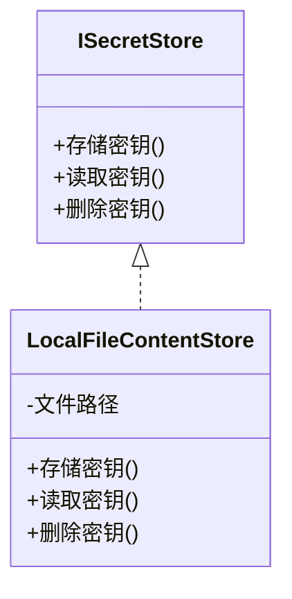
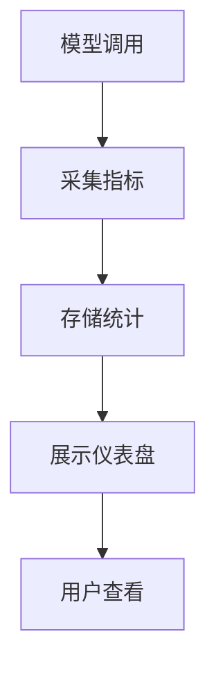
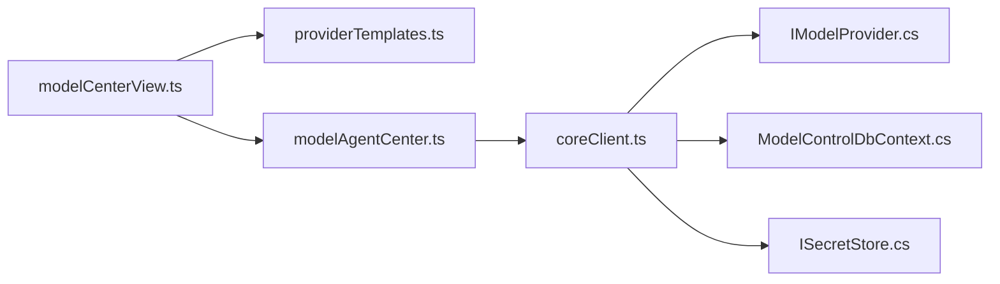

# 模型中心设置

<cite>
**本文引用的文件**   
- [modelCenterView.ts](file://apps/desktop/src/modelCenterView.ts)
- [providerTemplates.ts](file://apps/desktop/src/providerTemplates.ts)
- [modelAgentCenter.ts](file://TinadecGateway/src/modelAgentCenter.ts)
- [modelAgentCenter.test.ts](file://TinadecGateway/src/modelAgentCenter.test.ts)
- [coreClient.ts](file://TinadecGateway/src/coreClient.ts)
- [config.ts](file://TinadecGateway/src/config.ts)
- [IModelProvider.cs](file://TinadecCore/Abstractions/Ports/IModelProvider.cs)
- [ModelsModuleRegistrar.cs](file://TinadecCore/Models/ModelsModuleRegistrar.cs)
- [ModelControlDbContext.cs](file://TinadecCore/Models/ModelControlDbContext.cs)
- [HealthResponseDto.cs](file://TinadecCore/Contracts/Dtos/HealthResponseDto.cs)
- [ReadinessResponseDto.cs](file://TinadecCore/Contracts/Dtos/ReadinessResponseDto.cs)
- [SecretStore.cs](file://TinadecCore/Persistence/LocalFileContentStore.cs)
- [ISecretStore.cs](file://TinadecCore/Persistence/ISecretStore.cs)
- [ServiceCollectionExtensions.cs](file://TinadecCore/Persistence/ServiceCollectionExtensions.cs)
- [OpenAiCompatibleClientTests.cs](file://tests/TinadecCore.Tests/OpenAiCompatibleClientTests.cs)
- [AnthropicProviderRuntimeTests.cs](file://tests/TinadecCore.Tests/AnthropicProviderRuntimeTests.cs)
- [CliProviderRuntimeTests.cs](file://tests/TinadecCore.Tests/CliProviderRuntimeTests.cs)
- [LocalHttpProviderRuntimeTests.cs](file://tests/TinadecCore.Tests/LocalHttpProviderRuntimeTests.cs)
- [ModelRouteResolverTests.cs](file://tests/TinadecCore.Tests/ModelRouteResolverTests.cs)
- [SecretProtectorTests.cs](file://tests/TinadecCore.Tests/SecretProtectorTests.cs)
</cite>

## 目录
1. [简介](#简介)
2. [项目结构](#项目结构)
3. [核心组件](#核心组件)
4. [架构总览](#架构总览)
5. [详细组件分析](#详细组件分析)
6. [依赖关系分析](#依赖关系分析)
7. [性能考虑](#性能考虑)
8. [故障排查指南](#故障排查指南)
9. [结论](#结论)
10. [附录](#附录)

## 简介
本文件为“模型中心设置”模块的全面技术文档，聚焦多模型提供商管理（OpenAI、Anthropic、本地模型等驱动类型）、提供商实例的增删改查、API Key 管理与安全存储、模型路由配置（基于用途如 planner/chat 的智能路由）、模型就绪状态检查与健康监控、故障诊断、模型目录模板管理、批量配置导入导出与版本兼容性检查，以及模型性能监控与使用统计展示。文档面向不同技术背景的读者，提供从高层架构到代码级实现的渐进式说明，并辅以可视化图示与排障建议。

## 项目结构
模型中心设置涉及前端桌面端视图、网关层服务、核心抽象与持久化、以及测试用例等多层协作：
- 桌面端视图层：负责渲染模型中心界面、加载模板、触发配置操作。
- 网关层：封装对核心服务的调用，处理模型代理、健康检查、路由策略。
- 核心层：定义模型提供商抽象、数据库上下文、健康/就绪响应 DTO、密钥存储接口与实现。
- 测试层：覆盖各提供商运行时、路由解析、密钥保护等关键路径。

**图表来源** 
- [modelCenterView.ts](file://apps/desktop/src/modelCenterView.ts)
- [providerTemplates.ts](file://apps/desktop/src/providerTemplates.ts)
- [modelAgentCenter.ts](file://TinadecGateway/src/modelAgentCenter.ts)
- [coreClient.ts](file://TinadecGateway/src/coreClient.ts)
- [config.ts](file://TinadecGateway/src/config.ts)
- [IModelProvider.cs](file://TinadecCore/Abstractions/Ports/IModelProvider.cs)
- [ModelsModuleRegistrar.cs](file://TinadecCore/Models/ModelsModuleRegistrar.cs)
- [ModelControlDbContext.cs](file://TinadecCore/Models/ModelControlDbContext.cs)
- [HealthResponseDto.cs](file://TinadecCore/Contracts/Dtos/HealthResponseDto.cs)
- [ReadinessResponseDto.cs](file://TinadecCore/Contracts/Dtos/ReadinessResponseDto.cs)
- [ISecretStore.cs](file://TinadecCore/Persistence/ISecretStore.cs)
- [LocalFileContentStore.cs](file://TinadecCore/Persistence/LocalFileContentStore.cs)
- [OpenAiCompatibleClientTests.cs](file://tests/TinadecCore.Tests/OpenAiCompatibleClientTests.cs)
- [AnthropicProviderRuntimeTests.cs](file://tests/TinadecCore.Tests/AnthropicProviderRuntimeTests.cs)
- [CliProviderRuntimeTests.cs](file://tests/TinadecCore.Tests/CliProviderRuntimeTests.cs)
- [LocalHttpProviderRuntimeTests.cs](file://tests/TinadecCore.Tests/LocalHttpProviderRuntimeTests.cs)
- [ModelRouteResolverTests.cs](file://tests/TinadecCore.Tests/ModelRouteResolverTests.cs)
- [SecretProtectorTests.cs](file://tests/TinadecCore.Tests/SecretProtectorTests.cs)

**章节来源**
- [modelCenterView.ts](file://apps/desktop/src/modelCenterView.ts)
- [providerTemplates.ts](file://apps/desktop/src/providerTemplates.ts)
- [modelAgentCenter.ts](file://TinadecGateway/src/modelAgentCenter.ts)
- [coreClient.ts](file://TinadecGateway/src/coreClient.ts)
- [config.ts](file://TinadecGateway/src/config.ts)
- [IModelProvider.cs](file://TinadecCore/Abstractions/Ports/IModelProvider.cs)
- [ModelsModuleRegistrar.cs](file://TinadecCore/Models/ModelsModuleRegistrar.cs)
- [ModelControlDbContext.cs](file://TinadecCore/Models/ModelControlDbContext.cs)
- [HealthResponseDto.cs](file://TinadecCore/Contracts/Dtos/HealthResponseDto.cs)
- [ReadinessResponseDto.cs](file://TinadecCore/Contracts/Dtos/ReadinessResponseDto.cs)
- [ISecretStore.cs](file://TinadecCore/Persistence/ISecretStore.cs)
- [LocalFileContentStore.cs](file://TinadecCore/Persistence/LocalFileContentStore.cs)

## 核心组件
- 模型提供商抽象（IModelProvider）：统一不同驱动类型的调用契约，屏蔽 OpenAI、Anthropic、本地 CLI、HTTP 兼容等差异。
- 模型控制数据库上下文（ModelControlDbContext）：承载模型目录、路由规则、模板与配置的持久化。
- 健康与就绪响应 DTO（HealthResponseDto、ReadinessResponseDto）：标准化健康检查与就绪状态的返回结构。
- 密钥存储接口与实现（ISecretStore、LocalFileContentStore）：安全存储 API Key 等敏感信息。
- 网关模型代理（modelAgentCenter）：聚合核心能力，提供模型注册、路由、健康检查、统计等能力。
- 桌面端模型中心视图（modelCenterView）：用户交互入口，支持模板加载、配置编辑、导入导出与监控展示。

**章节来源**
- [IModelProvider.cs](file://TinadecCore/Abstractions/Ports/IModelProvider.cs)
- [ModelControlDbContext.cs](file://TinadecCore/Models/ModelControlDbContext.cs)
- [HealthResponseDto.cs](file://TinadecCore/Contracts/Dtos/HealthResponseDto.cs)
- [ReadinessResponseDto.cs](file://TinadecCore/Contracts/Dtos/ReadinessResponseDto.cs)
- [ISecretStore.cs](file://TinadecCore/Persistence/ISecretStore.cs)
- [LocalFileContentStore.cs](file://TinadecCore/Persistence/LocalFileContentStore.cs)
- [modelAgentCenter.ts](file://TinadecGateway/src/modelAgentCenter.ts)
- [modelCenterView.ts](file://apps/desktop/src/modelCenterView.ts)

## 架构总览
模型中心设置采用分层架构：
- 表现层（桌面端）：通过 modelCenterView.ts 提供 UI，调用 providerTemplates.ts 获取模板数据。
- 网关层：modelAgentCenter.ts 作为门面，协调 coreClient.ts 与 config.ts，转发请求至核心服务。
- 核心层：IModelProvider 抽象统一模型调用；ModelControlDbContext 管理配置与目录；SecretStore 保障密钥安全。
- 测试层：覆盖多种提供商运行时、路由解析与密钥保护场景。

**图表来源** 
- [modelCenterView.ts](file://apps/desktop/src/modelCenterView.ts)
- [modelAgentCenter.ts](file://TinadecGateway/src/modelAgentCenter.ts)
- [coreClient.ts](file://TinadecGateway/src/coreClient.ts)
- [IModelProvider.cs](file://TinadecCore/Abstractions/Ports/IModelProvider.cs)
- [ModelControlDbContext.cs](file://TinadecCore/Models/ModelControlDbContext.cs)
- [ISecretStore.cs](file://TinadecCore/Persistence/ISecretStore.cs)

## 详细组件分析

### 提供商抽象与驱动类型
- IModelProvider 定义了统一的调用接口，涵盖文本生成、流式输出、能力探测等。
- 驱动类型包括：
  - OpenAI 兼容 HTTP 客户端
  - Anthropic 运行时
  - 本地 CLI 执行器
  - 本地 HTTP 服务端适配
- 每种驱动在测试中验证了连通性、错误处理与超时行为。

**图表来源** 
- [IModelProvider.cs](file://TinadecCore/Abstractions/Ports/IModelProvider.cs)
- [OpenAiCompatibleClientTests.cs](file://tests/TinadecCore.Tests/OpenAiCompatibleClientTests.cs)
- [AnthropicProviderRuntimeTests.cs](file://tests/TinadecCore.Tests/AnthropicProviderRuntimeTests.cs)
- [CliProviderRuntimeTests.cs](file://tests/TinadecCore.Tests/CliProviderRuntimeTests.cs)
- [LocalHttpProviderRuntimeTests.cs](file://tests/TinadecCore.Tests/LocalHttpProviderRuntimeTests.cs)

**章节来源**
- [IModelProvider.cs](file://TinadecCore/Abstractions/Ports/IModelProvider.cs)
- [OpenAiCompatibleClientTests.cs](file://tests/TinadecCore.Tests/OpenAiCompatibleClientTests.cs)
- [AnthropicProviderRuntimeTests.cs](file://tests/TinadecCore.Tests/AnthropicProviderRuntimeTests.cs)
- [CliProviderRuntimeTests.cs](file://tests/TinadecCore.Tests/CliProviderRuntimeTests.cs)
- [LocalHttpProviderRuntimeTests.cs](file://tests/TinadecCore.Tests/LocalHttpProviderRuntimeTests.cs)

### 模型路由配置与智能路由策略
- 路由规则基于用途（planner/chat）选择合适模型，支持优先级、权重与回退策略。
- 路由解析在测试中验证了条件匹配、默认回退与冲突解决。

**图表来源** 
- [ModelRouteResolverTests.cs](file://tests/TinadecCore.Tests/ModelRouteResolverTests.cs)

**章节来源**
- [ModelRouteResolverTests.cs](file://tests/TinadecCore.Tests/ModelRouteResolverTests.cs)

### 健康监控与就绪检查
- HealthResponseDto 与 ReadinessResponseDto 标准化健康与就绪状态。
- 网关层提供健康检查接口，核心层探测提供商连接与能力。

**图表来源** 
- [HealthResponseDto.cs](file://TinadecCore/Contracts/Dtos/HealthResponseDto.cs)
- [ReadinessResponseDto.cs](file://TinadecCore/Contracts/Dtos/ReadinessResponseDto.cs)
- [modelAgentCenter.ts](file://TinadecGateway/src/modelAgentCenter.ts)
- [coreClient.ts](file://TinadecGateway/src/coreClient.ts)

**章节来源**
- [HealthResponseDto.cs](file://TinadecCore/Contracts/Dtos/HealthResponseDto.cs)
- [ReadinessResponseDto.cs](file://TinadecCore/Contracts/Dtos/ReadinessResponseDto.cs)
- [modelAgentCenter.ts](file://TinadecGateway/src/modelAgentCenter.ts)
- [coreClient.ts](file://TinadecGateway/src/coreClient.ts)

### 模型目录模板管理与批量导入导出
- providerTemplates.ts 提供模板数据结构与加载逻辑。
- 桌面端视图支持模板选择、批量导入导出与版本兼容性检查。

**图表来源** 
- [providerTemplates.ts](file://apps/desktop/src/providerTemplates.ts)
- [modelCenterView.ts](file://apps/desktop/src/modelCenterView.ts)

**章节来源**
- [providerTemplates.ts](file://apps/desktop/src/providerTemplates.ts)
- [modelCenterView.ts](file://apps/desktop/src/modelCenterView.ts)

### API Key 管理与安全存储
- ISecretStore 定义密钥存取接口，LocalFileContentStore 提供本地文件实现。
- SecretProtectorTests 验证密钥保护机制。

**图表来源** 
- [ISecretStore.cs](file://TinadecCore/Persistence/ISecretStore.cs)
- [LocalFileContentStore.cs](file://TinadecCore/Persistence/LocalFileContentStore.cs)
- [SecretProtectorTests.cs](file://tests/TinadecCore.Tests/SecretProtectorTests.cs)

**章节来源**
- [ISecretStore.cs](file://TinadecCore/Persistence/ISecretStore.cs)
- [LocalFileContentStore.cs](file://TinadecCore/Persistence/LocalFileContentStore.cs)
- [SecretProtectorTests.cs](file://tests/TinadecCore.Tests/SecretProtectorTests.cs)

### 模型性能监控与使用统计
- 网关层可聚合调用次数、延迟、错误率等指标。
- 桌面端视图展示统计面板，支持时间范围筛选与趋势图。

[此图为概念性流程图，不直接映射具体源码文件]

## 依赖关系分析
- 组件耦合：
  - modelCenterView.ts 依赖 providerTemplates.ts 与 modelAgentCenter.ts。
  - modelAgentCenter.ts 依赖 coreClient.ts 与 config.ts。
  - coreClient.ts 依赖 IModelProvider、ModelControlDbContext、ISecretStore。
- 外部依赖：
  - 数据库上下文用于持久化模型目录与路由。
  - 密钥存储用于安全保管 API Key。
- 循环依赖：未发现明显循环依赖。

**图表来源** 
- [modelCenterView.ts](file://apps/desktop/src/modelCenterView.ts)
- [providerTemplates.ts](file://apps/desktop/src/providerTemplates.ts)
- [modelAgentCenter.ts](file://TinadecGateway/src/modelAgentCenter.ts)
- [coreClient.ts](file://TinadecGateway/src/coreClient.ts)
- [IModelProvider.cs](file://TinadecCore/Abstractions/Ports/IModelProvider.cs)
- [ModelControlDbContext.cs](file://TinadecCore/Models/ModelControlDbContext.cs)
- [ISecretStore.cs](file://TinadecCore/Persistence/ISecretStore.cs)

**章节来源**
- [modelCenterView.ts](file://apps/desktop/src/modelCenterView.ts)
- [providerTemplates.ts](file://apps/desktop/src/providerTemplates.ts)
- [modelAgentCenter.ts](file://TinadecGateway/src/modelAgentCenter.ts)
- [coreClient.ts](file://TinadecGateway/src/coreClient.ts)
- [IModelProvider.cs](file://TinadecCore/Abstractions/Ports/IModelProvider.cs)
- [ModelControlDbContext.cs](file://TinadecCore/Models/ModelControlDbContext.cs)
- [ISecretStore.cs](file://TinadecCore/Persistence/ISecretStore.cs)

## 性能考虑
- 连接池与重试：对 HTTP 提供商启用连接复用与指数退避重试。
- 缓存策略：缓存模型能力探测结果，减少重复探测开销。
- 异步处理：健康检查与统计采集采用异步非阻塞方式。
- 资源限制：对本地 CLI 执行设置超时与内存上限。

[本节为通用指导，不直接分析具体文件]

## 故障排查指南
- 常见问题：
  - API Key 无效或过期：检查密钥存储与提供商控制台。
  - 网络超时：确认代理设置与防火墙规则。
  - 路由冲突：检查路由规则优先级与默认回退。
- 诊断步骤：
  - 运行健康检查接口，观察响应状态。
  - 查看日志中的错误码与堆栈。
  - 使用测试用例模拟调用，定位问题边界。

**章节来源**
- [modelAgentCenter.test.ts](file://TinadecGateway/src/modelAgentCenter.test.ts)
- [OpenAiCompatibleClientTests.cs](file://tests/TinadecCore.Tests/OpenAiCompatibleClientTests.cs)
- [AnthropicProviderRuntimeTests.cs](file://tests/TinadecCore.Tests/AnthropicProviderRuntimeTests.cs)
- [CliProviderRuntimeTests.cs](file://tests/TinadecCore.Tests/CliProviderRuntimeTests.cs)
- [LocalHttpProviderRuntimeTests.cs](file://tests/TinadecCore.Tests/LocalHttpProviderRuntimeTests.cs)
- [ModelRouteResolverTests.cs](file://tests/TinadecCore.Tests/ModelRouteResolverTests.cs)
- [SecretProtectorTests.cs](file://tests/TinadecCore.Tests/SecretProtectorTests.cs)

## 结论
模型中心设置模块通过统一的提供商抽象、健壮的路由策略、完善的健康监控与安全存储，实现了多模型提供商的高效管理与灵活调度。结合模板化配置与批量导入导出，提升了运维效率与用户体验。未来可进一步增强统计分析与告警能力，以支撑更大规模的模型生态。

[本节为总结性内容，不直接分析具体文件]

## 附录
- 配置项参考：
  - 提供商类型：openai、anthropic、cli、local-http
  - 路由用途：planner、chat
  - 健康检查间隔：秒级可调
  - 密钥存储路径：本地文件或系统密钥库
- 最佳实践：
  - 定期轮换 API Key
  - 最小权限原则配置访问令牌
  - 监控关键指标并设置阈值告警

[本节为补充信息，不直接分析具体文件]