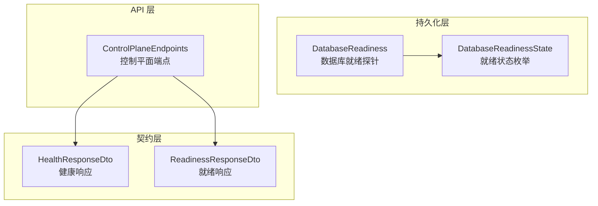
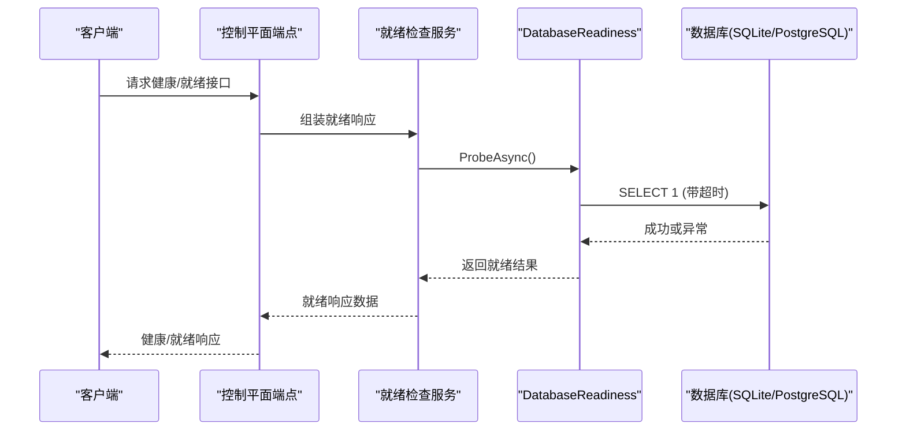
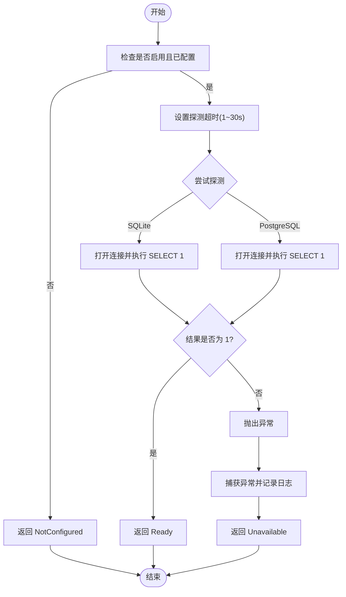
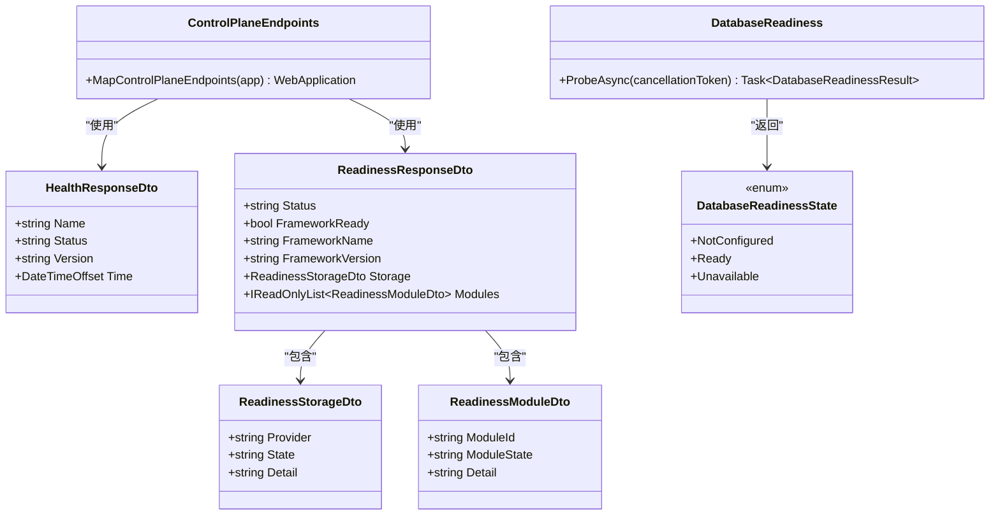

# 监控与诊断

<cite>
**本文引用的文件**   
- [HealthResponseDto.cs](file://TinadecCore\Contracts\Dtos\HealthResponseDto.cs)
- [ReadinessResponseDto.cs](file://TinadecCore\Contracts\Dtos\ReadinessResponseDto.cs)
- [DatabaseReadiness.cs](file://TinadecCore\Persistence\DatabaseReadiness.cs)
- [DatabaseReadinessState.cs](file://TinadecCore\Persistence\DatabaseReadinessState.cs)
- [ControlPlaneEndpoints.cs](file://TinadecCore\Api\Endpoints\ControlPlaneEndpoints.cs)
</cite>

## 目录
1. [简介](#简介)
2. [项目结构](#项目结构)
3. [核心组件](#核心组件)
4. [架构总览](#架构总览)
5. [详细组件分析](#详细组件分析)
6. [依赖关系分析](#依赖关系分析)
7. [性能考虑](#性能考虑)
8. [故障诊断指南](#故障诊断指南)
9. [结论](#结论)
10. [附录](#附录)

## 简介
本文件面向模型中心的监控与诊断能力，重点说明：
- 模型就绪状态检查机制（健康检查间隔、超时配置）
- 就绪状态的触发条件与含义（blocked/warning/ready）
- 性能监控指标的收集与分析（调用次数、延迟分布、错误率）
- 故障诊断工具（连接测试、API 密钥验证、网络连通性检查）
- 监控数据的可视化展示与告警配置选项

该文档基于代码库中的健康与就绪响应 DTO、数据库就绪探针实现以及控制平面端点映射进行系统化梳理，帮助读者快速理解并正确使用现有能力，同时给出扩展建议。

## 项目结构
与监控和诊断相关的核心代码位于以下位置：
- 契约层 DTO：健康与就绪响应数据结构定义
- 持久化层：数据库就绪探针实现与状态枚举
- API 层：控制平面端点映射（用于对外暴露能力）

图表来源
- [HealthResponseDto.cs:1-13](file://TinadecCore\Contracts\Dtos\HealthResponseDto.cs#L1-L13)
- [ReadinessResponseDto.cs:1-32](file://TinadecCore\Contracts\Dtos\ReadinessResponseDto.cs#L1-L32)
- [DatabaseReadiness.cs:1-123](file://TinadecCore\Persistence\DatabaseReadiness.cs#L1-L123)
- [DatabaseReadinessState.cs:1-23](file://TinadecCore\Persistence\DatabaseReadinessState.cs#L1-L23)
- [ControlPlaneEndpoints.cs:1-46](file://TinadecCore\Api\Endpoints\ControlPlaneEndpoints.cs#L1-L46)

章节来源
- [HealthResponseDto.cs:1-13](file://TinadecCore\Contracts\Dtos\HealthResponseDto.cs#L1-L13)
- [ReadinessResponseDto.cs:1-32](file://TinadecCore\Contracts\Dtos\ReadinessResponseDto.cs#L1-L32)
- [DatabaseReadiness.cs:1-123](file://TinadecCore\Persistence\DatabaseReadiness.cs#L1-L123)
- [DatabaseReadinessState.cs:1-23](file://TinadecCore\Persistence\DatabaseReadinessState.cs#L1-L23)
- [ControlPlaneEndpoints.cs:1-46](file://TinadecCore\Api\Endpoints\ControlPlaneEndpoints.cs#L1-L46)

## 核心组件
- 健康响应 DTO：提供标准健康检查返回结构（名称、状态、版本、时间戳），便于外部系统统一消费。
- 就绪响应 DTO：描述框架与模块的就绪情况，包含存储提供者信息、模块列表及各自状态。
- 数据库就绪探针：对 SQLite 与 PostgreSQL 执行“SELECT 1”探测，支持超时控制与异常处理，输出结构化结果。
- 就绪状态枚举：定义 NotConfigured、Ready、Unavailable 三种状态，并提供可读名称映射。
- 控制平面端点：注册模型中心相关 API，为上层编排与监控提供入口。

章节来源
- [HealthResponseDto.cs:1-13](file://TinadecCore\Contracts\Dtos\HealthResponseDto.cs#L1-L13)
- [ReadinessResponseDto.cs:1-32](file://TinadecCore\Contracts\Dtos\ReadinessResponseDto.cs#L1-L32)
- [DatabaseReadiness.cs:1-123](file://TinadecCore\Persistence\DatabaseReadiness.cs#L1-L123)
- [DatabaseReadinessState.cs:1-23](file://TinadecCore\Persistence\DatabaseReadinessState.cs#L1-L23)
- [ControlPlaneEndpoints.cs:1-46](file://TinadecCore\Api\Endpoints\ControlPlaneEndpoints.cs#L1-L46)

## 架构总览
下图展示了健康检查与就绪检查在系统中的交互流程：客户端通过控制平面端点获取健康与就绪信息；就绪检查会调用数据库就绪探针，根据配置与探测结果生成结构化响应。

图表来源
- [ControlPlaneEndpoints.cs:1-46](file://TinadecCore\Api\Endpoints\ControlPlaneEndpoints.cs#L1-L46)
- [DatabaseReadiness.cs:1-123](file://TinadecCore\Persistence\DatabaseReadiness.cs#L1-L123)
- [ReadinessResponseDto.cs:1-32](file://TinadecCore\Contracts\Dtos\ReadinessResponseDto.cs#L1-L32)

## 详细组件分析

### 健康检查与健康响应
- 健康响应 DTO 提供统一的字段：名称、状态、版本、时间戳，便于监控系统采集与展示。
- 典型用途：Kubernetes liveness/readiness 探针、负载均衡器健康检查、运维面板展示。

章节来源
- [HealthResponseDto.cs:1-13](file://TinadecCore\Contracts\Dtos\HealthResponseDto.cs#L1-L13)

### 就绪检查与就绪响应
- 就绪响应 DTO 包含：
  - 框架就绪标志与版本信息
  - 存储提供者就绪信息（Provider、State、Detail）
  - 模块列表（ModuleId、ModuleState、Detail）
- 就绪状态语义：
  - ready：框架与关键依赖可用
  - warning：部分模块未配置或处于降级状态
  - blocked：关键依赖不可用（如数据库不可达）

章节来源
- [ReadinessResponseDto.cs:1-32](file://TinadecCore\Contracts\Dtos\ReadinessResponseDto.cs#L1-L32)

### 数据库就绪探针
- 功能要点：
  - 支持 SQLite 与 PostgreSQL 两种驱动
  - 使用“SELECT 1”作为连通性与可用性探测
  - 支持超时控制（可配置秒数，限制在 1~30 秒）
  - 异常捕获与日志记录，返回结构化结果（Provider、State、Detail）
- 状态映射：
  - Ready：探测成功
  - Unavailable：探测失败（含超时、连接异常等）
  - NotConfigured：未启用或未配置连接字符串

图表来源
- [DatabaseReadiness.cs:1-123](file://TinadecCore\Persistence\DatabaseReadiness.cs#L1-L123)
- [DatabaseReadinessState.cs:1-23](file://TinadecCore\Persistence\DatabaseReadinessState.cs#L1-L23)

章节来源
- [DatabaseReadiness.cs:1-123](file://TinadecCore\Persistence\DatabaseReadiness.cs#L1-L123)
- [DatabaseReadinessState.cs:1-23](file://TinadecCore\Persistence\DatabaseReadinessState.cs#L1-L23)

### 控制平面端点
- 作用：注册模型中心相关 API（如模型提供者、路由、提示片段、代理等），为监控与诊断提供访问入口。
- 健康与就绪：通常由上层服务组合健康与就绪 DTO 并通过这些端点暴露给外部系统。

章节来源
- [ControlPlaneEndpoints.cs:1-46](file://TinadecCore\Api\Endpoints\ControlPlaneEndpoints.cs#L1-L46)

## 依赖关系分析
- 控制平面端点依赖就绪与健康的 DTO 以标准化响应格式。
- 就绪检查依赖数据库就绪探针，探针依赖具体数据库驱动（SQLite/PostgreSQL）。
- 就绪状态枚举为探针与响应 DTO 提供一致的状态语义。

图表来源
- [HealthResponseDto.cs:1-13](file://TinadecCore\Contracts\Dtos\HealthResponseDto.cs#L1-L13)
- [ReadinessResponseDto.cs:1-32](file://TinadecCore\Contracts\Dtos\ReadinessResponseDto.cs#L1-L32)
- [DatabaseReadiness.cs:1-123](file://TinadecCore\Persistence\DatabaseReadiness.cs#L1-L123)
- [DatabaseReadinessState.cs:1-23](file://TinadecCore\Persistence\DatabaseReadinessState.cs#L1-L23)
- [ControlPlaneEndpoints.cs:1-46](file://TinadecCore\Api\Endpoints\ControlPlaneEndpoints.cs#L1-L46)

章节来源
- [HealthResponseDto.cs:1-13](file://TinadecCore\Contracts\Dtos\HealthResponseDto.cs#L1-L13)
- [ReadinessResponseDto.cs:1-32](file://TinadecCore\Contracts\Dtos\ReadinessResponseDto.cs#L1-L32)
- [DatabaseReadiness.cs:1-123](file://TinadecCore\Persistence\DatabaseReadiness.cs#L1-L123)
- [DatabaseReadinessState.cs:1-23](file://TinadecCore\Persistence\DatabaseReadinessState.cs#L1-L23)
- [ControlPlaneEndpoints.cs:1-46](file://TinadecCore\Api\Endpoints\ControlPlaneEndpoints.cs#L1-L46)

## 性能考虑
- 健康检查与就绪检查应轻量、幂等，避免引入额外 I/O 或阻塞操作。
- 数据库就绪探针的超时需合理配置（1~30 秒），防止频繁探测导致雪崩。
- 建议在应用层聚合指标（调用次数、延迟分布、错误率），并通过外部监控系统（如 Prometheus、APM）采集与可视化。
- 对于高并发场景，考虑将探针结果缓存短时效值，减少重复探测开销。

[本节为通用指导，不直接分析具体文件]

## 故障诊断指南
- 连接测试
  - 使用数据库就绪探针进行“SELECT 1”探测，确认连接字符串、权限与网络可达性。
  - 若返回 Unavailable，检查日志中的异常信息与超时原因。
- API 密钥验证
  - 通过控制平面端点提供的模型提供者管理接口，校验密钥有效性（例如保存/更新提供者时返回的错误码与消息）。
- 网络连通性检查
  - 结合就绪响应中的存储与模块状态，定位具体依赖问题（如存储未配置、模块未加载）。
- 常见排查步骤
  - 确认探针超时配置是否过短或过长
  - 检查数据库驱动依赖是否正确安装
  - 查看日志中关于探针失败的警告信息
  - 逐步禁用非关键模块，缩小问题范围

章节来源
- [DatabaseReadiness.cs:1-123](file://TinadecCore\Persistence\DatabaseReadiness.cs#L1-L123)
- [ControlPlaneEndpoints.cs:1-46](file://TinadecCore\Api\Endpoints\ControlPlaneEndpoints.cs#L1-L46)

## 结论
- 健康与就绪检查提供了标准化的监控入口，便于外部系统集成。
- 数据库就绪探针实现了跨驱动的连通性检测与超时控制，具备良好可扩展性。
- 建议在上层补充性能指标采集与可视化能力，完善告警策略，提升整体可观测性。

[本节为总结，不直接分析具体文件]

## 附录
- 就绪状态语义对照
  - ready：关键依赖可用，服务可接收流量
  - warning：部分模块未配置或降级，仍可运行但需谨慎
  - blocked：关键依赖不可用，服务不应接收流量
- 监控指标建议
  - 调用次数：按端点与模块维度统计
  - 延迟分布：P50/P90/P99 分位延迟
  - 错误率：按状态码与异常类型分类
- 告警配置建议
  - 健康检查失败连续 N 次触发告警
  - 就绪状态为 blocked 立即告警
  - 错误率超过阈值持续 M 分钟触发告警
  - 探针超时比例过高触发告警

[本节为概念性内容，不直接分析具体文件]