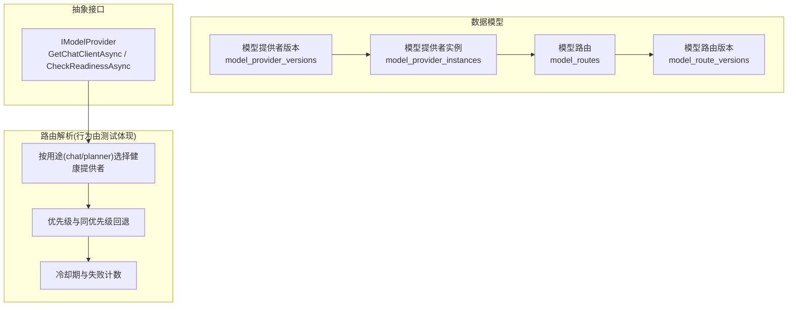
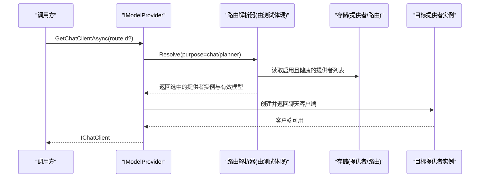
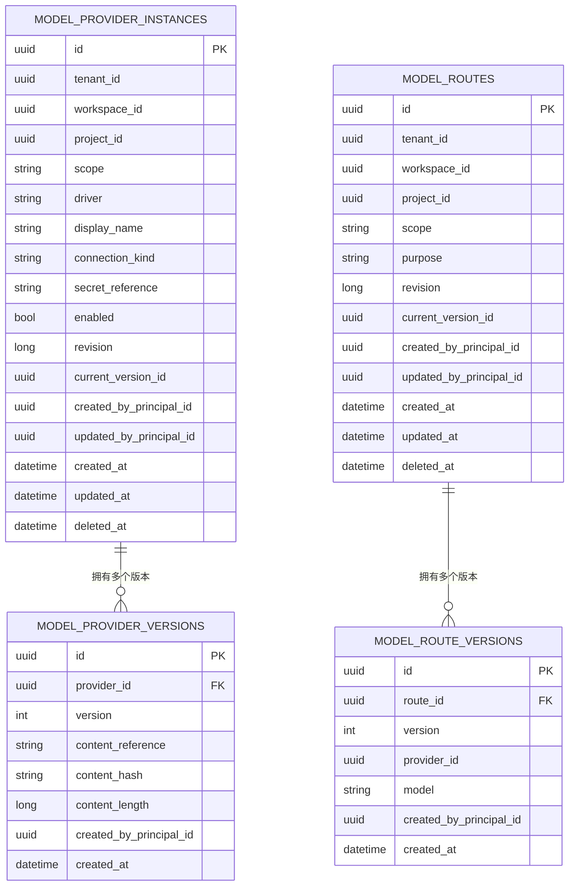
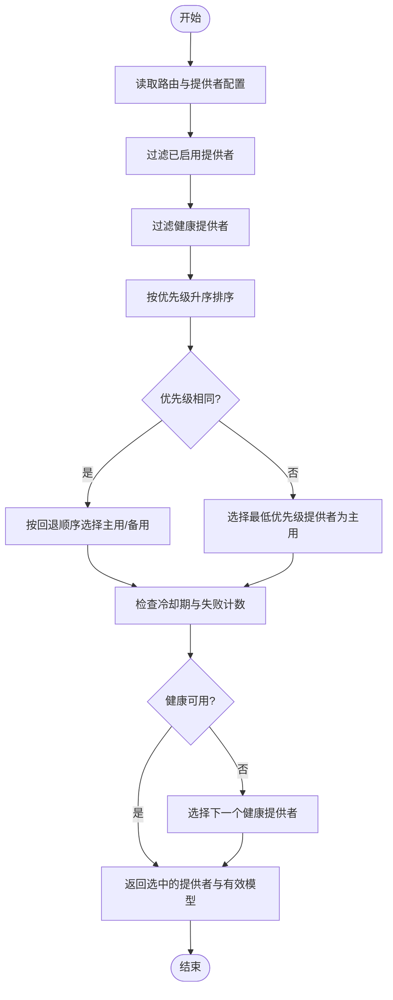
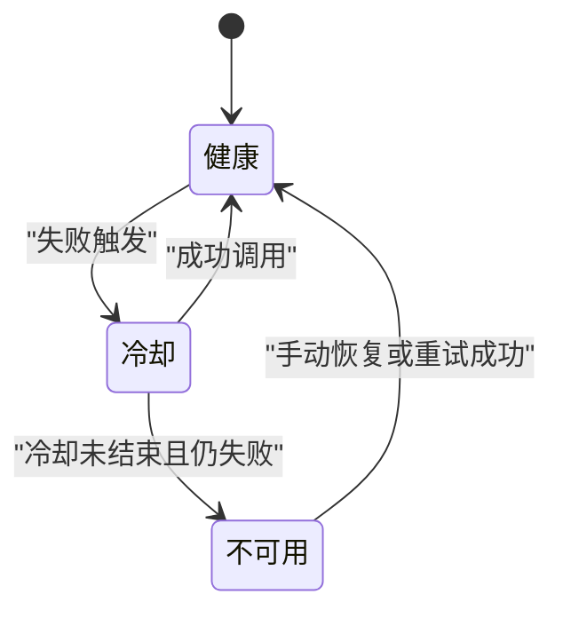
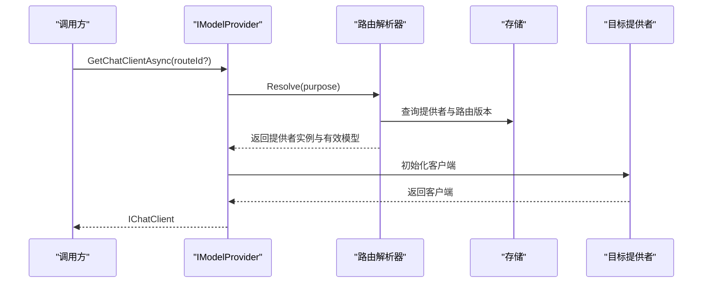
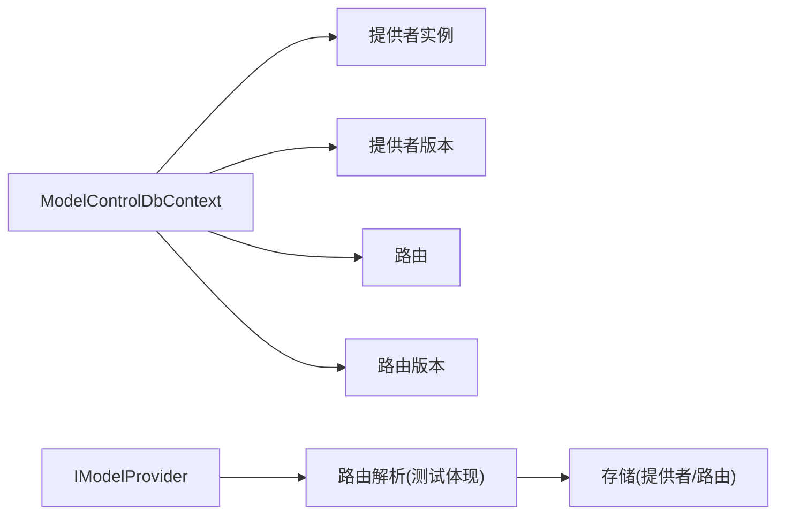

# 路由配置

<cite>
**本文引用的文件**   
- [ModelControlDbContext.cs](file://TinadecCore/Models/ModelControlDbContext.cs)
- [IModelProvider.cs](file://TinadecCore/Abstractions/Ports/IModelProvider.cs)
- [ModelRouteResolverTests.cs](file://tests/TinadecCore.Tests/ModelRouteResolverTests.cs)
</cite>

## 目录
1. [简介](#简介)
2. [项目结构](#项目结构)
3. [核心组件](#核心组件)
4. [架构总览](#架构总览)
5. [详细组件分析](#详细组件分析)
6. [依赖分析](#依赖分析)
7. [性能考虑](#性能考虑)
8. [故障排查指南](#故障排查指南)
9. [结论](#结论)
10. [附录](#附录)

## 简介
本文件面向模型路由配置系统，聚焦基于用途（planner/chat）的智能路由策略配置，涵盖优先级设置、负载均衡与故障转移机制。文档同时记录路由规则的语法与配置格式、条件路由能力、监控指标（响应时间与成功率）、调试工具（请求追踪与决策日志），以及配置的导入导出与版本管理。内容以仓库中已实现的模型控制数据模型、提供者接口与路由解析测试为依据进行归纳与说明。

## 项目结构
围绕模型路由的核心代码集中在以下位置：
- 模型与控制平面数据层：用于持久化模型提供者实例、提供者版本、路由及路由版本。
- 抽象端口：定义模型提供者的统一访问方式与健康就绪检查。
- 路由解析行为：通过测试用例体现按用途选择健康提供者、优先级与故障转移等策略。

图表来源 
- [ModelControlDbContext.cs:13-39](file://TinadecCore/Models/ModelControlDbContext.cs#L13-L39)
- [IModelProvider.cs:10-18](file://TinadecCore/Abstractions/Ports/IModelProvider.cs#L10-L18)

章节来源
- [ModelControlDbContext.cs:1-46](file://TinadecCore/Models/ModelControlDbContext.cs#L1-L46)
- [IModelProvider.cs:1-51](file://TinadecCore/Abstractions/Ports/IModelProvider.cs#L1-L51)

## 核心组件
- 模型提供者抽象（IModelProvider）
  - 提供统一的聊天客户端获取与健康就绪检查能力，屏蔽具体驱动细节。
- 模型控制数据模型（ModelControlDbContext）
  - 维护提供者实例、提供者版本、路由与路由版本的持久化实体与索引。
- 路由解析策略（由测试用例体现）
  - 依据用途（chat/planner）选择健康且启用的提供者；支持优先级排序、同优先级回退、冷却期与失败计数导致的不可用判定。

章节来源
- [IModelProvider.cs:10-18](file://TinadecCore/Abstractions/Ports/IModelProvider.cs#L10-L18)
- [ModelControlDbContext.cs:13-39](file://TinadecCore/Models/ModelControlDbContext.cs#L13-L39)
- [ModelRouteResolverTests.cs:18-120](file://tests/TinadecCore.Tests/ModelRouteResolverTests.cs#L18-L120)

## 架构总览
下图展示从调用方到提供者实例的端到端流程，包括路由解析、健康状态评估与故障转移。

图表来源 
- [IModelProvider.cs:12-18](file://TinadecCore/Abstractions/Ports/IModelProvider.cs#L12-L18)
- [ModelRouteResolverTests.cs:18-120](file://tests/TinadecCore.Tests/ModelRouteResolverTests.cs#L18-L120)

## 详细组件分析

### 数据模型与版本管理
- 模型提供者实例（model_provider_instances）
  - 关键字段：租户/工作区/项目范围、驱动类型、显示名、连接类型、密钥引用、是否启用、修订号、当前版本ID、审计字段与软删除时间。
  - 索引：按租户/工作区/驱动/软删除时间建立唯一性约束，便于多租户隔离与快速定位。
- 模型提供者版本（model_provider_versions）
  - 关键字段：关联提供者ID、版本号、内容引用、内容哈希、长度与审计字段。
  - 索引：提供者ID+版本号唯一，确保版本可追溯与一致性。
- 模型路由（model_routes）
  - 关键字段：租户/工作区/项目范围、作用域、用途（Purpose，如 chat/planner）、修订号、当前版本ID与审计字段。
  - 索引：按租户/工作区/项目/用途/软删除时间唯一，保证同一范围内用途不冲突。
- 模型路由版本（model_route_versions）
  - 关键字段：关联路由ID、版本号、绑定的提供者ID、可选的有效模型名称与审计字段。
  - 索引：路由ID+版本号唯一，支撑版本回滚与变更审计。

图表来源 
- [ModelControlDbContext.cs:15-37](file://TinadecCore/Models/ModelControlDbContext.cs#L15-L37)

章节来源
- [ModelControlDbContext.cs:15-37](file://TinadecCore/Models/ModelControlDbContext.cs#L15-L37)

### 路由策略与规则语法
- 用途（Purpose）
  - 典型值：chat、planner。路由按用途区分，同一租户/工作区/项目下每个用途仅一条活跃路由。
- 优先级（Priority）
  - 提供者能力元数据中包含优先级信息，路由解析优先选择健康且启用的最低优先级数值提供者（数值越小优先级越高）。
- 负载均衡与回退
  - 当多个提供者具有相同优先级时，解析器会选择一个作为主用，其余作为回退；若主用不可用（禁用、冷却期或失败计数导致不可用），则自动切换到下一个健康提供者。
- 条件路由
  - 通过能力元数据（capabilities）描述提供者的特性，例如健康状态、冷却截止时间、失败次数、时钟同步等，路由解析据此过滤与排序。
- 故障转移（Failover）
  - 当首选提供者处于冷却期或标记为不可用时，自动选择下一个健康提供者；成功调用后清除冷却状态并恢复健康。

图表来源 
- [ModelRouteResolverTests.cs:18-120](file://tests/TinadecCore.Tests/ModelRouteResolverTests.cs#L18-L120)

章节来源
- [ModelRouteResolverTests.cs:18-120](file://tests/TinadecCore.Tests/ModelRouteResolverTests.cs#L18-L120)

### 健康状态与冷却期
- 健康状态
  - 提供者具备健康状态与消息，支持“健康”“冷却”“不可用”等状态。
- 冷却期（Cooldown）
  - 失败后进入冷却期，冷却期内视为不可用；冷却截止时间在能力元数据中记录。
- 成功恢复
  - 成功调用后可清除冷却状态并恢复健康，重置失败计数。

图表来源 
- [ModelRouteResolverTests.cs:145-237](file://tests/TinadecCore.Tests/ModelRouteResolverTests.cs#L145-L237)

章节来源
- [ModelRouteResolverTests.cs:145-237](file://tests/TinadecCore.Tests/ModelRouteResolverTests.cs#L145-L237)

### 路由解析与调用序列
- 入口
  - 通过 IModelProvider.GetChatClientAsync 获取聊天客户端，内部根据路由解析结果选择提供者。
- 就绪检查
  - 通过 CheckReadinessAsync 检查整体就绪状态，包含警告与状态消息。

图表来源 
- [IModelProvider.cs:12-18](file://TinadecCore/Abstractions/Ports/IModelProvider.cs#L12-L18)
- [ModelRouteResolverTests.cs:18-120](file://tests/TinadecCore.Tests/ModelRouteResolverTests.cs#L18-L120)

章节来源
- [IModelProvider.cs:12-18](file://TinadecCore/Abstractions/Ports/IModelProvider.cs#L12-L18)
- [ModelRouteResolverTests.cs:18-120](file://tests/TinadecCore.Tests/ModelRouteResolverTests.cs#L18-L120)

## 依赖分析
- 数据模型依赖
  - ModelControlDbContext 定义了四张核心表及其关系与索引，保障多租户隔离与版本可追溯。
- 接口依赖
  - IModelProvider 暴露统一的客户端获取与健康检查方法，屏蔽底层驱动差异。
- 行为依赖
  - 路由解析行为通过测试用例验证，依赖存储提供的提供者实例与路由版本数据。

图表来源 
- [ModelControlDbContext.cs:15-37](file://TinadecCore/Models/ModelControlDbContext.cs#L15-L37)
- [IModelProvider.cs:12-18](file://TinadecCore/Abstractions/Ports/IModelProvider.cs#L12-L18)

章节来源
- [ModelControlDbContext.cs:15-37](file://TinadecCore/Models/ModelControlDbContext.cs#L15-L37)
- [IModelProvider.cs:12-18](file://TinadecCore/Abstractions/Ports/IModelProvider.cs#L12-L18)

## 性能考虑
- 路由解析复杂度
  - 主要开销在于读取提供者与路由版本并进行健康过滤与排序；建议对常用用途的路由缓存以减少重复查询。
- 健康状态更新频率
  - 频繁失败会导致冷却期与不可用判定，应合理设置冷却时长与阈值，避免抖动。
- 并发与锁
  - 多租户场景下，按租户/工作区/项目维度隔离路由，减少竞争；必要时对热点路由加读缓存。
- 网络与超时
  - 结合提供者的就绪检查与超时策略，避免长尾请求阻塞路由选择。

[本节为通用指导，无需特定文件引用]

## 故障排查指南
- 常见问题
  - 无可用提供者：检查是否所有提供者被禁用或处于冷却期；确认用途配置是否存在。
  - 优先级异常：核对能力元数据中的优先级字段是否正确写入。
  - 冷却期过长：检查失败原因（超时、限流等），调整冷却策略。
- 诊断步骤
  - 查看提供者健康状态与冷却截止时间。
  - 检查路由版本是否指向有效的提供者与模型。
  - 使用就绪检查接口获取整体状态与警告信息。
- 恢复操作
  - 成功调用后自动恢复健康；必要时手动清理冷却状态。

章节来源
- [ModelRouteResolverTests.cs:120-237](file://tests/TinadecCore.Tests/ModelRouteResolverTests.cs#L120-L237)
- [IModelProvider.cs:16-18](file://TinadecCore/Abstractions/Ports/IModelProvider.cs#L16-L18)

## 结论
本路由配置系统以用途为中心，结合优先级、健康状态与冷却期实现智能选择与故障转移。数据模型支持版本化管理与审计，接口抽象屏蔽驱动差异，测试用例验证了关键策略的正确性。生产环境中建议配合缓存、监控与调试工具，提升稳定性与可观测性。

[本节为总结性内容，无需特定文件引用]

## 附录

### 路由配置语法与格式要点
- 用途（Purpose）
  - 必填，常见值：chat、planner。
- 优先级（Priority）
  - 整数，数值越小优先级越高；同优先级时按回退顺序选择。
- 能力元数据（Capabilities）
  - 键值对形式，包含健康状态、冷却截止时间、失败计数、时钟同步等。
- 版本管理
  - 路由与提供者均支持版本化，变更需生成新版本并指定当前版本ID。

章节来源
- [ModelRouteResolverTests.cs:265-307](file://tests/TinadecCore.Tests/ModelRouteResolverTests.cs#L265-L307)
- [ModelControlDbContext.cs:15-37](file://TinadecCore/Models/ModelControlDbContext.cs#L15-L37)

### 监控指标建议
- 响应时间统计
  - 按提供者与用途维度统计P50/P95/P99延迟。
- 成功率监控
  - 按提供者与用途维度统计成功/失败比例，结合冷却期与失败计数分析。
- 健康状态看板
  - 实时展示各提供者健康状态、冷却截止时间与最近错误类别。

[本节为通用指导，无需特定文件引用]

### 调试工具与日志
- 请求追踪
  - 记录每次路由选择的输入（用途、租户/工作区/项目）、输出（选中提供者、有效模型）与耗时。
- 决策日志
  - 记录过滤与排序过程，包括禁用、冷却、失败计数等排除原因。
- 健康检查日志
  - 记录就绪检查结果与警告信息，辅助定位配置问题。

[本节为通用指导，无需特定文件引用]

### 导入导出与版本管理
- 导入导出
  - 支持将路由与提供者配置导出为结构化数据，便于迁移与备份；导入时需校验用途唯一性与版本一致性。
- 版本管理
  - 每次变更生成新版本，保留历史版本以便回滚；当前版本ID指向生效版本。

[本节为通用指导，无需特定文件引用]