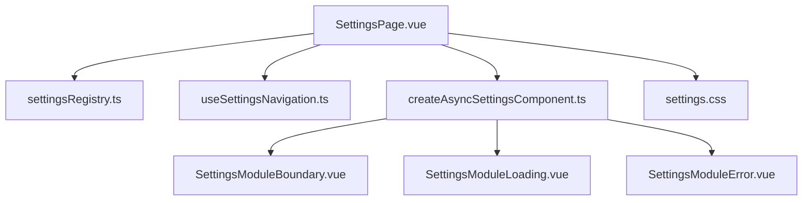
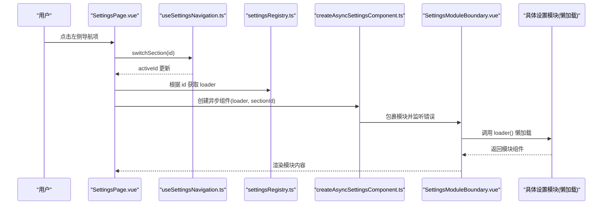
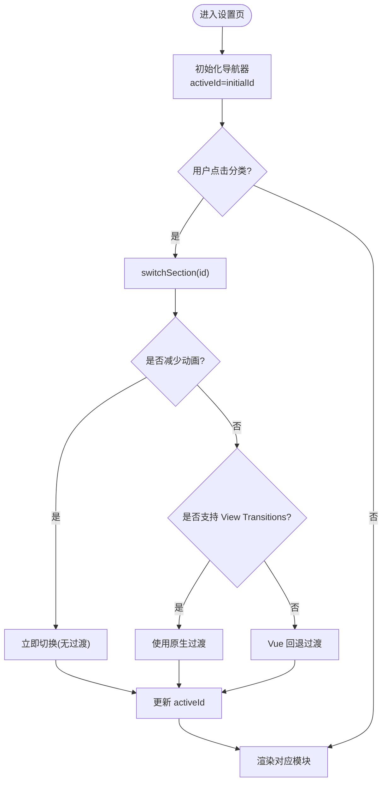
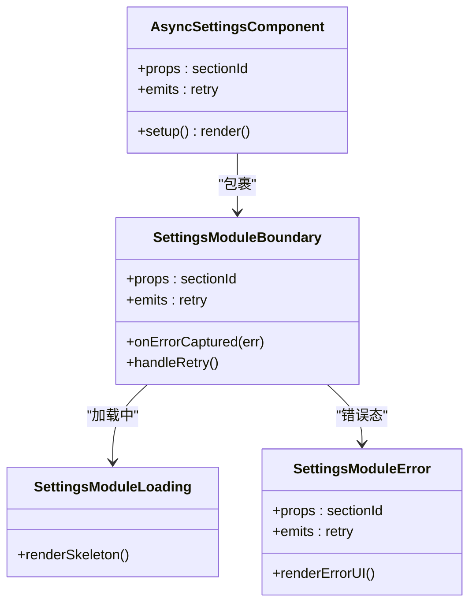
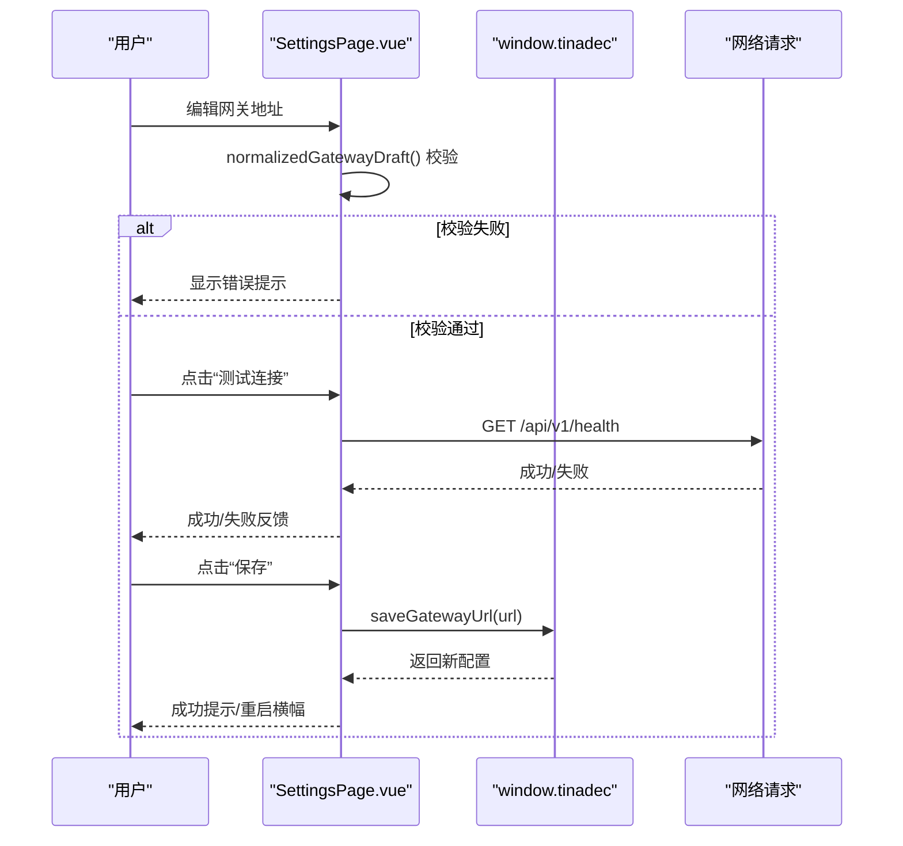
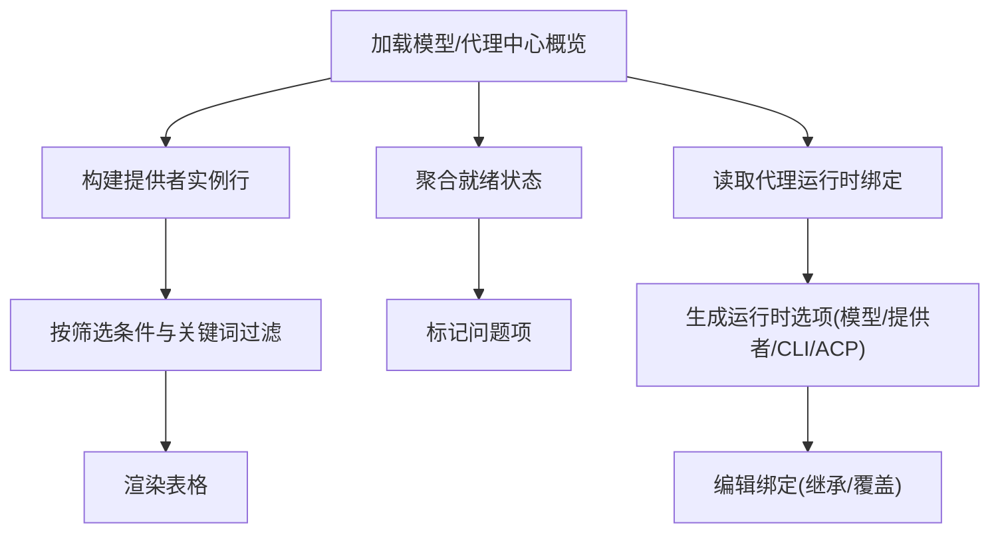
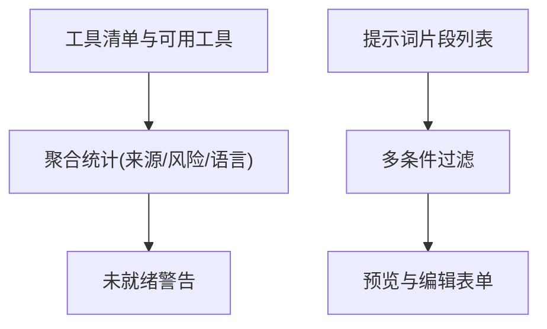
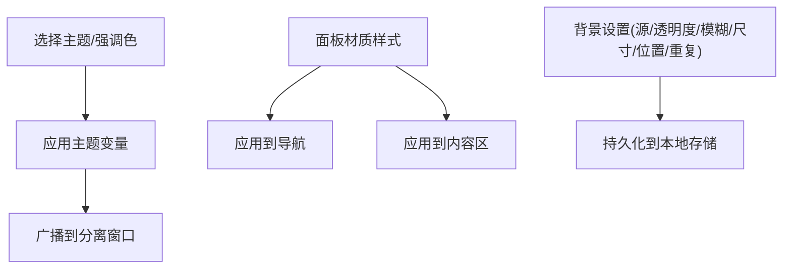
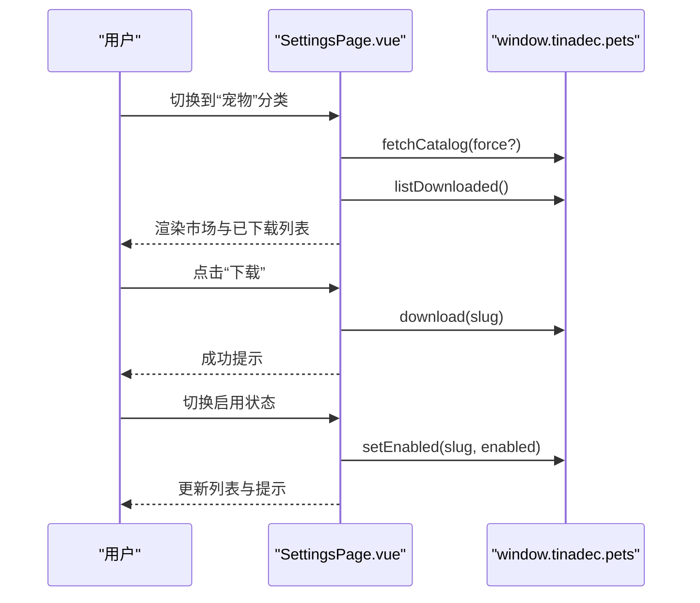
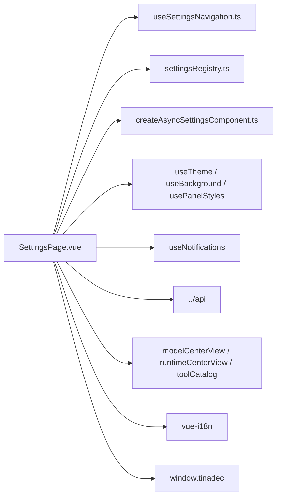

# 设置页面

<cite>
**本文引用的文件**   
- [SettingsPage.vue](file://apps/desktop/src/pages/SettingsPage.vue)
- [settingsRegistry.ts](file://apps/desktop/src/settings/settingsRegistry.ts)
- [types.ts](file://apps/desktop/src/settings/types.ts)
- [useSettingsNavigation.ts](file://apps/desktop/src/settings/useSettingsNavigation.ts)
- [createAsyncSettingsComponent.ts](file://apps/desktop/src/settings/createAsyncSettingsComponent.ts)
- [SettingsModuleBoundary.vue](file://apps/desktop/src/settings/components/SettingsModuleBoundary.vue)
- [SettingsModuleLoading.vue](file://apps/desktop/src/settings/components/SettingsModuleLoading.vue)
- [SettingsModuleError.vue](file://apps/desktop/src/settings/components/SettingsModuleError.vue)
- [settings.css](file://apps/desktop/src/settings/settings.css)
</cite>

## 目录
1. [简介](#简介)
2. [项目结构](#项目结构)
3. [核心组件](#核心组件)
4. [架构总览](#架构总览)
5. [详细组件分析](#详细组件分析)
6. [依赖关系分析](#依赖关系分析)
7. [性能考量](#性能考量)
8. [故障排查指南](#故障排查指南)
9. [结论](#结论)
10. [附录](#附录)

## 简介
本文件为“设置页面”的完整技术文档，聚焦 SettingsPage 组件的设置管理能力。内容涵盖用户偏好配置、系统设置、插件（宠物）管理、账户与模型/代理中心设置等；说明设置项的分类组织、表单验证规则、持久化存储机制；并阐述界面响应式布局、表单校验与实时更新策略。同时提供设置导入/导出、默认值管理与配置迁移的实现思路与实践建议。

## 项目结构
设置功能由一个主页面与一组可插拔的设置模块组成：
- 主页面：负责导航、全局状态、窗口控制、主题与背景、通知、以及各设置子模块的数据加载与展示。
- 设置注册表：集中声明设置分类元数据（id、图标、标签键），并提供按 id 映射到懒加载器的能力。
- 类型定义：统一设置模块的类型、导航选项、媒体查询适配、视图过渡接口等。
- 导航器：维护当前激活的分类、访问历史、失败集合、重试计数、运动模式（原生/回退/减少）。
- 异步组件包装：对每个设置模块进行懒加载、错误边界与重试封装。
- 样式：独立的设置页样式，包含侧边栏、内容区、主题切换、语言选择、宠物市场网格等。

**图示来源** 
- [SettingsPage.vue](file://apps/desktop/src/pages/SettingsPage.vue)
- [settingsRegistry.ts](file://apps/desktop/src/settings/settingsRegistry.ts)
- [useSettingsNavigation.ts](file://apps/desktop/src/settings/useSettingsNavigation.ts)
- [createAsyncSettingsComponent.ts](file://apps/desktop/src/settings/createAsyncSettingsComponent.ts)
- [SettingsModuleBoundary.vue](file://apps/desktop/src/settings/components/SettingsModuleBoundary.vue)
- [SettingsModuleLoading.vue](file://apps/desktop/src/settings/components/SettingsModuleLoading.vue)
- [SettingsModuleError.vue](file://apps/desktop/src/settings/components/SettingsModuleError.vue)
- [settings.css](file://apps/desktop/src/settings/settings.css)

**章节来源**
- [SettingsPage.vue](file://apps/desktop/src/pages/SettingsPage.vue)
- [settingsRegistry.ts](file://apps/desktop/src/settings/settingsRegistry.ts)
- [types.ts](file://apps/desktop/src/settings/types.ts)
- [useSettingsNavigation.ts](file://apps/desktop/src/settings/useSettingsNavigation.ts)
- [createAsyncSettingsComponent.ts](file://apps/desktop/src/settings/createAsyncSettingsComponent.ts)
- [SettingsModuleBoundary.vue](file://apps/desktop/src/settings/components/SettingsModuleBoundary.vue)
- [SettingsModuleLoading.vue](file://apps/desktop/src/settings/components/SettingsModuleLoading.vue)
- [SettingsModuleError.vue](file://apps/desktop/src/settings/components/SettingsModuleError.vue)
- [settings.css](file://apps/desktop/src/settings/settings.css)

## 核心组件
- SettingsPage.vue
  - 职责：设置页面的入口与编排者，承载通用 UI（导航、窗口控制、主题、背景、通知）、各设置模块的数据获取与渲染、以及跨模块交互。
  - 关键能力：
    - 设置分类导航与动态路由切换（general/model/agents/agentEvolution/promptContext/promptEngineering/tools/appearance/pets/language/apiDocs/about）。
    - 网关地址配置与连接测试、保存与重置、重启提示。
    - 模型中心与代理中心概览、提供者实例列表、诊断信息、就绪状态。
    - 工具层发现与清单、提示词片段管理、预览与过滤。
    - 外观设置（主题、强调色、面板材质效果、背景图）。
    - 宠物（插件）市场浏览、下载、启用/禁用、删除、打开文件夹。
    - 语言切换与本地持久化。
    - “关于”页健康检查（Core/Gateway）。
- settingsRegistry.ts
  - 职责：集中声明所有设置分类的元数据（id、图标、i18n 标签键），并提供 createSettingsRegistry 将 id 映射到对应的懒加载器。
- types.ts
  - 职责：定义设置模块类型、导航选项、媒体查询与视图过渡接口、运动模式等。
- useSettingsNavigation.ts
  - 职责：实现设置分类切换逻辑，支持 View Transitions API 或 Vue 回退方案，处理“减少动画”偏好，维护 visited/failed/revisions 等状态。
- createAsyncSettingsComponent.ts
  - 职责：为每个设置模块创建异步组件，集成加载骨架与错误态，并通过边界组件实现错误捕获与重试。
- SettingsModuleBoundary.vue / SettingsModuleLoading.vue / SettingsModuleError.vue
  - 职责：错误边界、加载骨架、错误态 UI，支持重试触发。

**章节来源**
- [SettingsPage.vue](file://apps/desktop/src/pages/SettingsPage.vue)
- [settingsRegistry.ts](file://apps/desktop/src/settings/settingsRegistry.ts)
- [types.ts](file://apps/desktop/src/settings/types.ts)
- [useSettingsNavigation.ts](file://apps/desktop/src/settings/useSettingsNavigation.ts)
- [createAsyncSettingsComponent.ts](file://apps/desktop/src/settings/createAsyncSettingsComponent.ts)
- [SettingsModuleBoundary.vue](file://apps/desktop/src/settings/components/SettingsModuleBoundary.vue)
- [SettingsModuleLoading.vue](file://apps/desktop/src/settings/components/SettingsModuleLoading.vue)
- [SettingsModuleError.vue](file://apps/desktop/src/settings/components/SettingsModuleError.vue)

## 架构总览
设置页面采用“主容器 + 模块化懒加载”的架构。主容器负责导航与状态协调，具体设置模块按需加载，通过统一的类型与导航接口解耦。

**图示来源** 
- [SettingsPage.vue](file://apps/desktop/src/pages/SettingsPage.vue)
- [useSettingsNavigation.ts](file://apps/desktop/src/settings/useSettingsNavigation.ts)
- [settingsRegistry.ts](file://apps/desktop/src/settings/settingsRegistry.ts)
- [createAsyncSettingsComponent.ts](file://apps/desktop/src/settings/createAsyncSettingsComponent.ts)
- [SettingsModuleBoundary.vue](file://apps/desktop/src/settings/components/SettingsModuleBoundary.vue)

## 详细组件分析

### 设置分类与导航
- 分类定义
  - 使用常量数组声明所有设置分类 id、图标与 i18n 标签键，确保类型安全与一致性。
- 导航器
  - 维护 activeId、visitedIds、failedIds、revisions、motionMode。
  - 优先尝试使用 View Transitions API，若不可用则回退到 Vue 内部过渡；尊重 prefers-reduced-motion。
  - 提供 retry 机制，通过 revisions 变更触发重新挂载。

**图示来源** 
- [useSettingsNavigation.ts](file://apps/desktop/src/settings/useSettingsNavigation.ts)
- [types.ts](file://apps/desktop/src/settings/types.ts)

**章节来源**
- [settingsRegistry.ts](file://apps/desktop/src/settings/settingsRegistry.ts)
- [useSettingsNavigation.ts](file://apps/desktop/src/settings/useSettingsNavigation.ts)
- [types.ts](file://apps/desktop/src/settings/types.ts)

### 异步模块加载与错误边界
- 异步组件包装
  - 使用 defineAsyncComponent 延迟加载模块，设置 loading/error 组件，并在错误时交由边界组件处理。
- 错误边界
  - 捕获子树错误，显示错误态 UI，并提供重试按钮；重试时通过 key 变更强制重新挂载。
- 重试联动
  - 与导航器的 retry 配合，增加 revisions 以刷新缓存键。

**图示来源** 
- [createAsyncSettingsComponent.ts](file://apps/desktop/src/settings/createAsyncSettingsComponent.ts)
- [SettingsModuleBoundary.vue](file://apps/desktop/src/settings/components/SettingsModuleBoundary.vue)
- [SettingsModuleLoading.vue](file://apps/desktop/src/settings/components/SettingsModuleLoading.vue)
- [SettingsModuleError.vue](file://apps/desktop/src/settings/components/SettingsModuleError.vue)

**章节来源**
- [createAsyncSettingsComponent.ts](file://apps/desktop/src/settings/createAsyncSettingsComponent.ts)
- [SettingsModuleBoundary.vue](file://apps/desktop/src/settings/components/SettingsModuleBoundary.vue)
- [SettingsModuleLoading.vue](file://apps/desktop/src/settings/components/SettingsModuleLoading.vue)
- [SettingsModuleError.vue](file://apps/desktop/src/settings/components/SettingsModuleError.vue)

### 网关配置与连接测试
- 输入校验
  - 对网关 URL 进行规范化与协议校验，非法时抛出错误并提示。
- 连接测试
  - 向 /api/v1/health 发起请求，超时限制，成功/失败分别反馈。
- 保存与重置
  - 保存后若与运行时地址不同，提示需要重启应用；重置后同步更新草稿与状态。
- 通知与横幅
  - 使用通知系统提示操作结果，必要时显示“立即重启”横幅。

**图示来源** 
- [SettingsPage.vue](file://apps/desktop/src/pages/SettingsPage.vue)

**章节来源**
- [SettingsPage.vue](file://apps/desktop/src/pages/SettingsPage.vue)

### 模型中心与代理中心
- 概览数据
  - 拉取模型中心与代理中心概览，包括供应商、API 连接、模型、CLI/ACP 运行时、诊断信息等。
- 提供者实例
  - 构建表格行，支持筛选（全部/问题/已配置等）与关键词搜索。
- 就绪状态
  - 聚合 providers/routes/templates/toolLayer 的就绪情况，标记 blocked/needs_key 等状态。
- 代理运行时绑定
  - 支持继承/覆盖模式，选择模型、提供者、CLI/ACP 运行时，并显示来源与只读性。

**图示来源** 
- [SettingsPage.vue](file://apps/desktop/src/pages/SettingsPage.vue)

**章节来源**
- [SettingsPage.vue](file://apps/desktop/src/pages/SettingsPage.vue)

### 工具层与提示词工程
- 工具层
  - 从清单与可用工具中汇总工具列表、风险等级、语言支持、来源分布；对未就绪的工具与代理范围给出警告。
- 提示词片段
  - 支持按作用域、类别、目标代理、启用状态过滤；提供预览与编辑表单，含优先级与内置标识。

**图示来源** 
- [SettingsPage.vue](file://apps/desktop/src/pages/SettingsPage.vue)

**章节来源**
- [SettingsPage.vue](file://apps/desktop/src/pages/SettingsPage.vue)

### 外观与主题
- 主题与强调色
  - 支持深色/浅色/系统主题，强调色选择，并广播给分离面板窗口。
- 面板材质效果
  - 通过全局面板样式控制毛玻璃、阴影等效果，应用到设置导航与内容区域。
- 背景设置
  - 支持图片/颜色/渐变等背景源，调节透明度、模糊、尺寸、位置、重复方式，并持久化。

**图示来源** 
- [SettingsPage.vue](file://apps/desktop/src/pages/SettingsPage.vue)
- [settings.css](file://apps/desktop/src/settings/settings.css)

**章节来源**
- [SettingsPage.vue](file://apps/desktop/src/pages/SettingsPage.vue)
- [settings.css](file://apps/desktop/src/settings/settings.css)

### 宠物（插件）管理
- 市场浏览
  - 分页加载、关键词与类型筛选、无限滚动加载。
- 下载与启用
  - 下载后更新本地列表，支持启用/禁用、删除、打开文件夹。
- 事件监听
  - 监听宠物状态变化，自动更新启用状态。

**图示来源** 
- [SettingsPage.vue](file://apps/desktop/src/pages/SettingsPage.vue)

**章节来源**
- [SettingsPage.vue](file://apps/desktop/src/pages/SettingsPage.vue)

### 语言与国际化
- 切换语言
  - 修改 i18n locale，并写入本地存储以持久化。
- 界面文案
  - 所有标题、按钮、提示均通过 i18n 键值渲染。

**章节来源**
- [SettingsPage.vue](file://apps/desktop/src/pages/SettingsPage.vue)

### 关于页与健康检查
- 健康检查
  - 调用 health 接口，展示 Core 与 Gateway 的状态与版本信息。
- 状态指示
  - 使用圆点与文本直观表示 ok/off 状态。

**章节来源**
- [SettingsPage.vue](file://apps/desktop/src/pages/SettingsPage.vue)

## 依赖关系分析
- 组件耦合
  - SettingsPage 依赖导航器、注册表、异步组件包装、主题与背景 composable、通知 composable、API 客户端与各类视图工具函数。
- 外部依赖
  - window.tinadec 暴露桌面端能力（应用配置、宠物管理、主题广播、窗口控制等）。
  - i18n 用于多语言。
  - View Transitions API 用于平滑过渡（可选）。
- 潜在循环
  - 通过注册表与懒加载避免直接引用具体模块，降低耦合。

**图示来源** 
- [SettingsPage.vue](file://apps/desktop/src/pages/SettingsPage.vue)
- [useSettingsNavigation.ts](file://apps/desktop/src/settings/useSettingsNavigation.ts)
- [settingsRegistry.ts](file://apps/desktop/src/settings/settingsRegistry.ts)
- [createAsyncSettingsComponent.ts](file://apps/desktop/src/settings/createAsyncSettingsComponent.ts)

**章节来源**
- [SettingsPage.vue](file://apps/desktop/src/pages/SettingsPage.vue)

## 性能考量
- 懒加载与按需渲染
  - 各设置模块通过异步组件懒加载，减少首屏体积与初始渲染开销。
- 视图过渡优化
  - 在支持 View Transitions 的环境下使用原生过渡，否则回退到 Vue 过渡；尊重 reduced-motion 偏好。
- 列表与分页
  - 宠物市场采用 IntersectionObserver 实现无限滚动，避免一次性渲染大量节点。
- 计算属性与缓存
  - 大量使用 computed 缓存过滤与转换结果，减少重复计算。
- 网络请求
  - 连接测试设置超时，避免长时间阻塞；概览数据按需拉取与缓存。

[本节为通用指导，不直接分析具体文件]

## 故障排查指南
- 模块加载失败
  - 现象：模块区域显示错误态与重试按钮。
  - 处理：点击重试；检查网络与模块路径；查看浏览器控制台错误。
- 网关连接失败
  - 现象：测试连接失败，显示错误提示。
  - 处理：检查 URL 协议与可达性；确认防火墙与代理设置；重试后保存。
- 宠物操作失败
  - 现象：下载/启用/删除失败，弹出错误通知。
  - 处理：检查权限与磁盘空间；重试操作；查看日志。
- 主题/背景不生效
  - 现象：切换后未实时生效。
  - 处理：确认广播到分离窗口；检查 CSS 变量注入；刷新页面。

**章节来源**
- [SettingsModuleError.vue](file://apps/desktop/src/settings/components/SettingsModuleError.vue)
- [SettingsPage.vue](file://apps/desktop/src/pages/SettingsPage.vue)

## 结论
设置页面通过模块化、懒加载与统一导航实现了可扩展、易维护的配置管理。结合完善的表单校验、错误边界与通知体系，提供了良好的用户体验。未来可在导入/导出、默认值管理与配置迁移方面进一步增强，以满足更复杂的部署与协作场景。

[本节为总结，不直接分析具体文件]

## 附录

### 设置项分类与组织
- general：通用设置（如网关地址、应用配置）
- model：模型中心（供应商、API 连接、模型、CLI/ACP）
- agents：代理中心（代理列表、运行时绑定）
- agentEvolution：代理演化（演进策略与策略集）
- promptContext：提示词上下文（片段、作用域、目标代理）
- promptEngineering：提示词工程（模板、预览、调试）
- tools：工具层（工具清单、风险、语言支持）
- appearance：外观（主题、强调色、面板材质、背景）
- pets：宠物（插件）市场与管理
- language：语言与国际化
- apiDocs：API 文档
- about：关于与健康检查

**章节来源**
- [settingsRegistry.ts](file://apps/desktop/src/settings/settingsRegistry.ts)
- [types.ts](file://apps/desktop/src/settings/types.ts)

### 表单验证与实时反馈
- 网关 URL：协议校验、规范化、连接测试、保存/重置反馈。
- 提供者表单：根据模板动态字段，占位符提示，必填校验。
- 提示词片段：作用域/类别/目标代理/启用状态过滤，优先级与内置标识。
- 宠物操作：下载/启用/删除的即时反馈与错误提示。

**章节来源**
- [SettingsPage.vue](file://apps/desktop/src/pages/SettingsPage.vue)

### 持久化存储
- 语言：localStorage 持久化 tinadec-locale。
- 背景设置：通过 composable 持久化背景参数。
- 面板样式：通过 composable 持久化材质效果。
- 其他设置：根据模块实现（如网关地址通过桌面端能力保存）。

**章节来源**
- [SettingsPage.vue](file://apps/desktop/src/pages/SettingsPage.vue)

### 设置导入/导出（建议实现）
- 导出
  - 收集各模块设置快照，序列化为 JSON，提供下载。
- 导入
  - 解析上传 JSON，合并到现有配置，冲突策略（覆盖/跳过/提示）。
- 迁移
  - 版本号与迁移脚本，向后兼容旧格式，逐步升级字段。

[本节为概念性建议，不直接分析具体文件]

### 默认值管理（建议实现）
- 模块级默认值：为每个设置模块提供默认配置对象。
- 合并策略：默认值 < 用户配置 < 环境/托管配置。
- 重置功能：恢复为默认值或最近一次有效配置。

[本节为概念性建议，不直接分析具体文件]

### 响应式设计与样式要点
- 布局：侧边栏 + 内容区的网格布局，移动端自适应。
- 主题变量：通过 CSS 变量统一管理颜色、边框、阴影等。
- 动画：导航与内容进入动画，尊重 reduced-motion。
- 网格与卡片：宠物市场使用自适应网格与卡片样式。

**章节来源**
- [settings.css](file://apps/desktop/src/settings/settings.css)