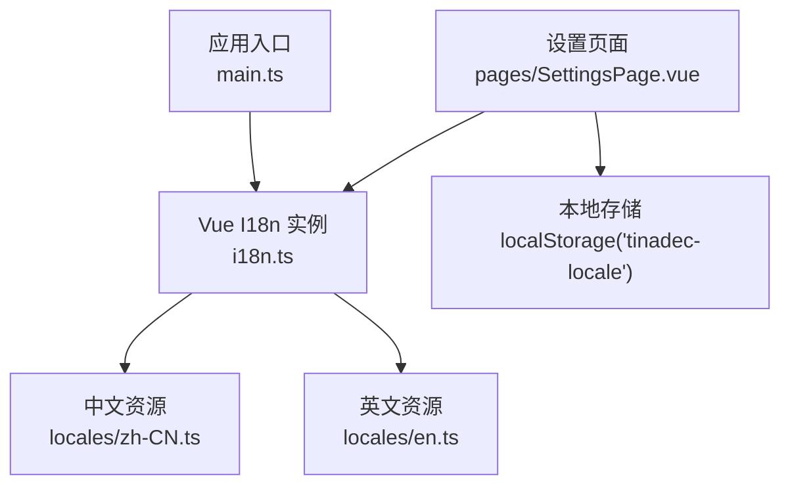
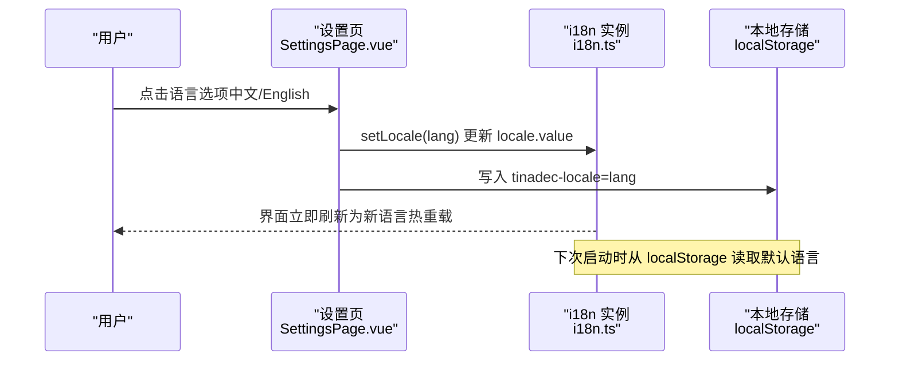
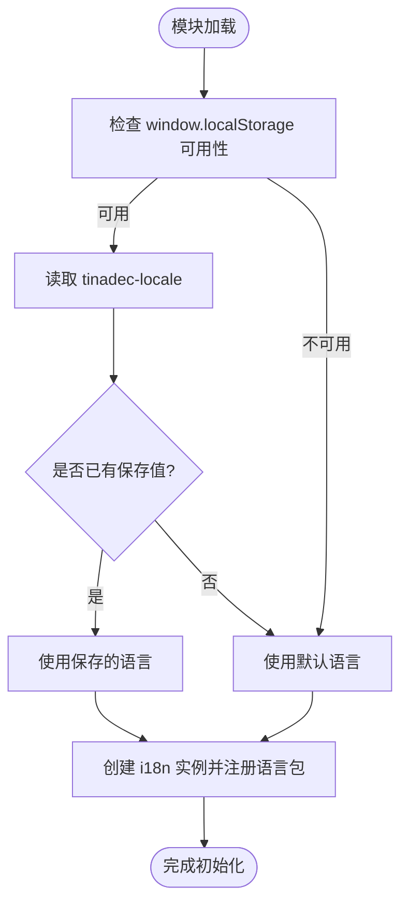
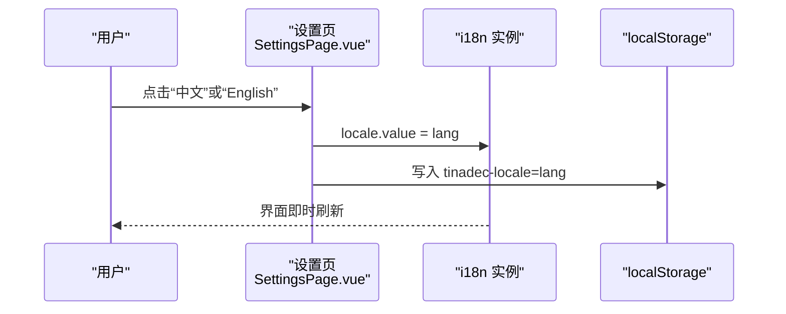
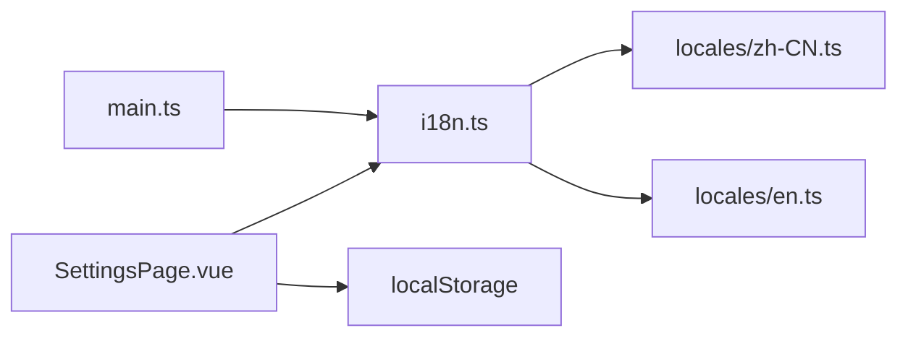

# 语言设置

<cite>
**本文引用的文件**   
- [i18n.ts](file://apps/desktop/src/i18n.ts)
- [zh-CN.ts](file://apps/desktop/src/locales/zh-CN.ts)
- [en.ts](file://apps/desktop/src/locales/en.ts)
- [SettingsPage.vue](file://apps/desktop/src/pages/SettingsPage.vue)
- [main.ts](file://apps/desktop/src/main.ts)
</cite>

## 目录
1. [简介](#简介)
2. [项目结构](#项目结构)
3. [核心组件](#核心组件)
4. [架构总览](#架构总览)
5. [详细组件分析](#详细组件分析)
6. [依赖关系分析](#依赖关系分析)
7. [性能考虑](#性能考虑)
8. [故障排查指南](#故障排查指南)
9. [结论](#结论)
10. [附录](#附录)

## 简介
本文件为 TinadecOffice 桌面端“语言设置模块”的完整技术文档，聚焦多语言支持系统（简体中文、英语等）的切换与热重载、国际化资源管理（键值对翻译）、区域设置（日期/数字/时区）以及用户偏好语言的自动检测与记忆。同时提供新语言添加指南、翻译贡献流程与质量保证机制，并说明语言包版本兼容性与向后兼容性策略。

## 项目结构
语言相关代码位于桌面端 Vue 应用中：
- i18n 初始化与默认语言加载
- 语言资源文件（键值对）
- 设置页中的语言切换 UI 与持久化逻辑
- 应用启动时对 i18n 的挂载与通知文案注入

**图表来源** 
- [main.ts:1-24](file://apps/desktop/src/main.ts#L1-L24)
- [i18n.ts:1-24](file://apps/desktop/src/i18n.ts#L1-L24)
- [SettingsPage.vue:789-792](file://apps/desktop/src/pages/SettingsPage.vue#L789-L792)
- [SettingsPage.vue:3519-3537](file://apps/desktop/src/pages/SettingsPage.vue#L3519-L3537)

**章节来源**
- [main.ts:1-24](file://apps/desktop/src/main.ts#L1-L24)
- [i18n.ts:1-24](file://apps/desktop/src/i18n.ts#L1-L24)
- [SettingsPage.vue:789-792](file://apps/desktop/src/pages/SettingsPage.vue#L789-L792)
- [SettingsPage.vue:3519-3537](file://apps/desktop/src/pages/SettingsPage.vue#L3519-L3537)

## 核心组件
- 国际化初始化器（i18n.ts）
  - 使用 vue-i18n 创建实例，配置 legacy=false，设置默认语言与回退语言，注册已加载的语言包。
  - 通过延迟读取 localStorage 获取上次选择的语言，避免模块加载期访问全局对象导致的问题。
- 语言资源文件（locales/zh-CN.ts、locales/en.ts）
  - 以键值对形式组织翻译内容，覆盖应用界面文本、提示、错误信息等。
- 设置页（SettingsPage.vue）
  - 提供语言选择按钮，调用 setLocale(lang) 更新当前语言并持久化到 localStorage。
  - 使用 useI18n() 暴露的 locale 响应式变量实现热重载切换。
- 应用入口（main.ts）
  - 将 i18n 插件挂载到 Vue 应用，并注入通知组件的本地化 fallback 文案。

**章节来源**
- [i18n.ts:1-24](file://apps/desktop/src/i18n.ts#L1-L24)
- [zh-CN.ts:1-800](file://apps/desktop/src/locales/zh-CN.ts#L1-L800)
- [en.ts:1-800](file://apps/desktop/src/locales/en.ts#L1-L800)
- [SettingsPage.vue:789-792](file://apps/desktop/src/pages/SettingsPage.vue#L789-L792)
- [SettingsPage.vue:3519-3537](file://apps/desktop/src/pages/SettingsPage.vue#L3519-L3537)
- [main.ts:1-24](file://apps/desktop/src/main.ts#L1-L24)

## 架构总览
语言设置模块采用“前端 i18n + 本地缓存”的轻量方案，语言包在应用启动时静态加载，运行时通过设置页即时切换，无需重启。

**图表来源** 
- [SettingsPage.vue:789-792](file://apps/desktop/src/pages/SettingsPage.vue#L789-L792)
- [i18n.ts:6-11](file://apps/desktop/src/i18n.ts#L6-L11)

## 详细组件分析

### 国际化初始化器（i18n.ts）
- 功能要点
  - 创建 vue-i18n 实例，禁用 legacy 模式，设置默认语言与回退语言。
  - 延迟读取 localStorage 获取上次语言，避免在模块加载阶段访问 window。
  - 注册 zh-CN 与 en 两个语言包。
- 复杂度与性能
  - 语言包为静态导入，启动时一次性加载；切换语言仅更新 locale 指针，无额外网络请求。
- 错误处理
  - 若 localStorage 不可用或值为空，回退到默认语言。

**图表来源** 
- [i18n.ts:1-24](file://apps/desktop/src/i18n.ts#L1-L24)

**章节来源**
- [i18n.ts:1-24](file://apps/desktop/src/i18n.ts#L1-L24)

### 语言资源文件（zh-CN.ts、en.ts）
- 组织结构
  - 按业务域分组（如 app、nav、sidebar、chat、context、settings、providers 等），每个域下包含若干键值对。
  - 支持插值占位符（例如 {count}、{name}），便于动态文本渲染。
- 复数与格式化
  - 当前未启用 vue-i18n 的复数规则；如需复数形式，可在后续扩展 messages 配置或使用自定义格式化函数。
- 扩展性
  - 新增语言只需新增对应文件并在 i18n.ts 中注册即可。

**章节来源**
- [zh-CN.ts:1-800](file://apps/desktop/src/locales/zh-CN.ts#L1-L800)
- [en.ts:1-800](file://apps/desktop/src/locales/en.ts#L1-L800)

### 设置页语言切换（SettingsPage.vue）
- 功能要点
  - 提供“中文”和“English”按钮，点击后调用 setLocale(lang)。
  - setLocale 更新 i18n 的 locale 并写入 localStorage，实现即时切换与持久化。
- 交互流程
  - 用户点击 -> 更新 locale -> 写入本地存储 -> 界面热重载。

**图表来源** 
- [SettingsPage.vue:789-792](file://apps/desktop/src/pages/SettingsPage.vue#L789-L792)
- [SettingsPage.vue:3519-3537](file://apps/desktop/src/pages/SettingsPage.vue#L3519-L3537)

**章节来源**
- [SettingsPage.vue:789-792](file://apps/desktop/src/pages/SettingsPage.vue#L789-L792)
- [SettingsPage.vue:3519-3537](file://apps/desktop/src/pages/SettingsPage.vue#L3519-L3537)

### 应用入口与通知文案注入（main.ts）
- 功能要点
  - 将 i18n 插件挂载到 Vue 应用。
  - 为通知组件注入未知错误的本地化 fallback 文案，确保错误信息随语言切换。

**章节来源**
- [main.ts:1-24](file://apps/desktop/src/main.ts#L1-L24)

## 依赖关系分析
- 组件依赖
  - SettingsPage.vue 依赖 i18n.ts 提供的 i18n 实例与 locale 响应式变量。
  - i18n.ts 依赖 locales 下的语言资源文件。
  - main.ts 依赖 i18n.ts 并将其作为插件注入。
- 外部依赖
  - vue-i18n：提供国际化能力。
  - localStorage：用于持久化用户语言偏好。

**图表来源** 
- [main.ts:1-24](file://apps/desktop/src/main.ts#L1-L24)
- [i18n.ts:1-24](file://apps/desktop/src/i18n.ts#L1-L24)
- [SettingsPage.vue:789-792](file://apps/desktop/src/pages/SettingsPage.vue#L789-L792)

**章节来源**
- [main.ts:1-24](file://apps/desktop/src/main.ts#L1-L24)
- [i18n.ts:1-24](file://apps/desktop/src/i18n.ts#L1-L24)
- [SettingsPage.vue:789-792](file://apps/desktop/src/pages/SettingsPage.vue#L789-L792)

## 性能考虑
- 语言包静态加载
  - 所有语言资源在应用启动时静态导入，切换语言不触发网络请求，切换开销极低。
- 本地存储读写
  - 仅在切换语言时写入一次 localStorage，频率低且数据量小，不影响性能。
- 建议优化
  - 若未来语言包数量增长，可考虑按需懒加载语言包，减少首屏体积。
  - 对大型消息字典进行分块或压缩，提升解析速度。

[本节为通用指导，不直接分析具体文件]

## 故障排查指南
- 现象：切换语言无效
  - 检查浏览器控制台是否有 localStorage 访问异常。
  - 确认 i18n.ts 是否正确注册了目标语言包。
  - 验证 SettingsPage.vue 中 setLocale 是否被正确调用。
- 现象：首次启动语言不正确
  - 检查 localStorage 中 tinadec-locale 的值是否为空或被其他脚本覆盖。
  - 确认 i18n.ts 的默认语言与回退语言配置是否符合预期。
- 现象：部分文案未翻译
  - 检查对应 key 是否在目标语言文件中存在。
  - 确认组件中使用的 t(key) 是否与资源文件一致。

**章节来源**
- [i18n.ts:6-11](file://apps/desktop/src/i18n.ts#L6-L11)
- [SettingsPage.vue:789-792](file://apps/desktop/src/pages/SettingsPage.vue#L789-L792)

## 结论
TinadecOffice 桌面端的语言设置模块基于 vue-i18n 与本地存储实现了简洁高效的多语言支持。通过设置页即可即时切换语言并持久化偏好，满足日常使用需求。后续可按需扩展复数规则、区域格式与按需加载能力，进一步提升国际化体验与可扩展性。

[本节为总结，不直接分析具体文件]

## 附录

### 区域设置配置（日期、数字、时区）
- 当前状态
  - 未发现专门的区域设置模块或配置文件。
- 建议方案
  - 使用 Intl API（如 Intl.DateTimeFormat、Intl.NumberFormat、Intl.RelativeTimeFormat）结合当前 locale 进行格式化。
  - 在需要相对时间的地方（如通知时间）直接使用 Intl.RelativeTimeFormat(locale, options)。
- 参考位置
  - 通知组件中使用 Intl.RelativeTimeFormat 的地方可作为示例。

**章节来源**
- [NotificationDetailDialog.vue:157](file://apps/desktop/src/components/NotificationDetailDialog.vue#L157)
- [NotificationIslandHost.vue:61](file://apps/desktop/src/components/NotificationIslandHost.vue#L61)

### 用户偏好语言的自动检测与记忆
- 自动检测
  - 当前未实现浏览器语言自动检测；默认语言由 i18n.ts 的 getSavedLocale 决定。
- 记忆机制
  - 通过 localStorage 的 tinadec-locale 键记录用户选择，下次启动时优先使用该值。
- 改进建议
  - 增加浏览器 navigator.language 的优先级判断，当本地存储为空时回退到浏览器语言。

**章节来源**
- [i18n.ts:6-11](file://apps/desktop/src/i18n.ts#L6-L11)
- [SettingsPage.vue:789-792](file://apps/desktop/src/pages/SettingsPage.vue#L789-L792)

### 新语言添加指南
- 步骤
  1. 在 locales 目录下新增语言文件（如 ja.ts）。
  2. 在 i18n.ts 中导入并注册该语言包。
  3. 在设置页中添加对应语言按钮，调用 setLocale('ja')。
  4. 验证各页面文案是否正常显示。
- 注意事项
  - 保持键名一致性，避免遗漏 key 导致未翻译。
  - 如需复数规则，需在 i18n 配置中启用相应特性。

**章节来源**
- [i18n.ts:1-24](file://apps/desktop/src/i18n.ts#L1-L24)
- [SettingsPage.vue:3519-3537](file://apps/desktop/src/pages/SettingsPage.vue#L3519-L3537)

### 翻译贡献流程与质量保证
- 流程建议
  - 建立翻译分支，新增或修改语言文件后提交 PR。
  - 使用脚本校验 key 的一致性（缺失 key、多余 key）。
  - 人工审核翻译准确性与上下文适配。
- 质量保证
  - 引入自动化测试，随机抽取 key 进行渲染断言。
  - 对关键文案（错误提示、警告）进行重点审查。

[本节为通用指导，不直接分析具体文件]

### 语言包的版本兼容性与向后兼容保证
- 现状
  - 语言包为静态导入，未实现远程下载与版本控制。
- 建议方案
  - 为语言包定义版本号，并在应用启动时校验兼容性。
  - 对破坏性变更（key 重命名、删除）提供迁移脚本与回退策略。
  - 保留旧版 key 的映射，确保老版本语言包仍可运行。

[本节为通用指导，不直接分析具体文件]