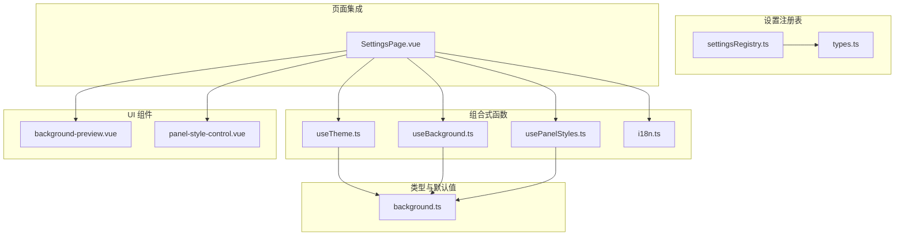
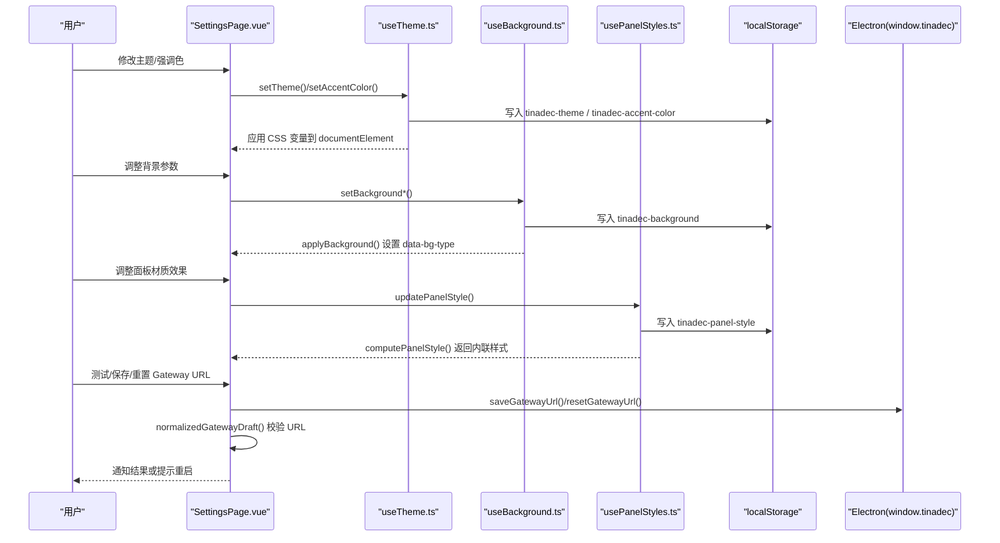
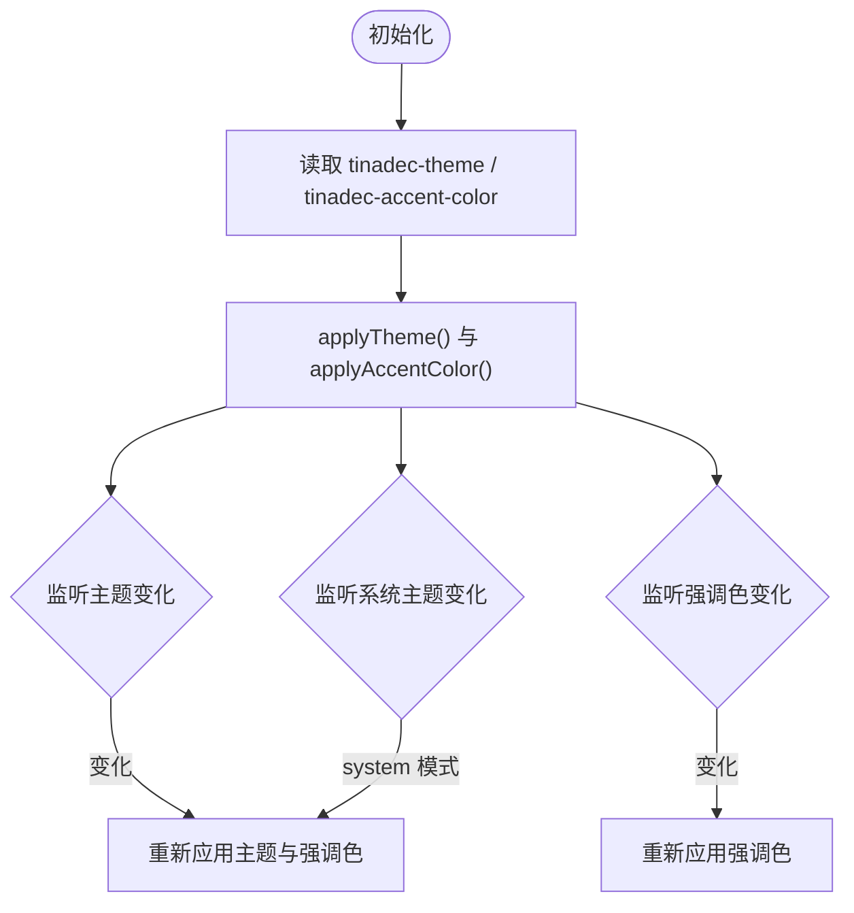
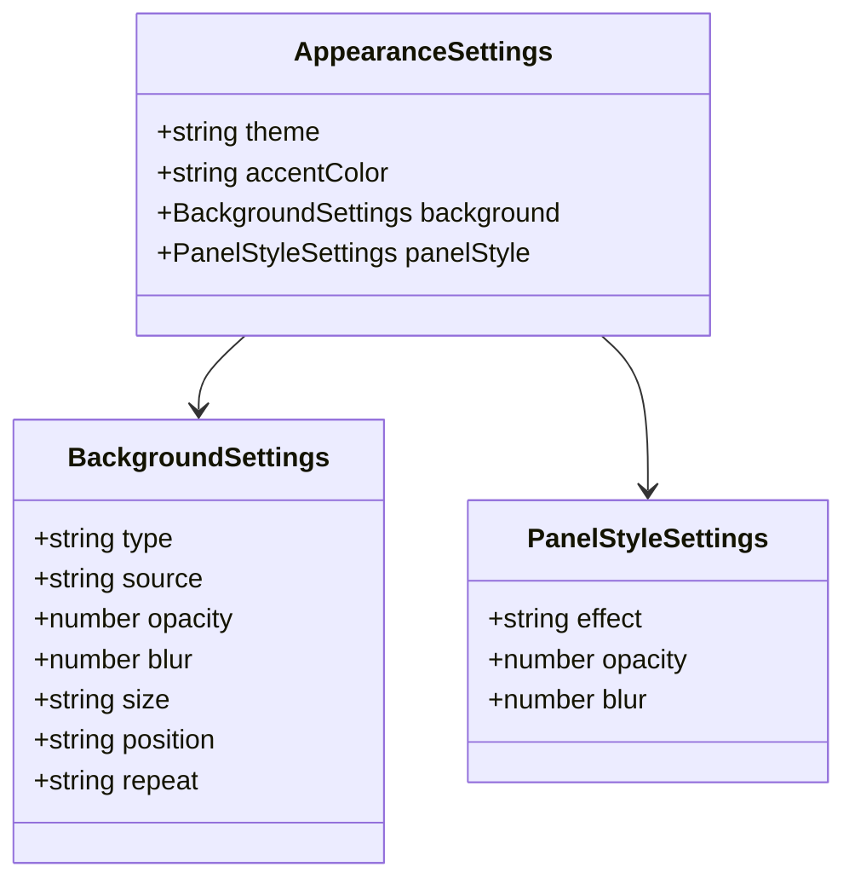
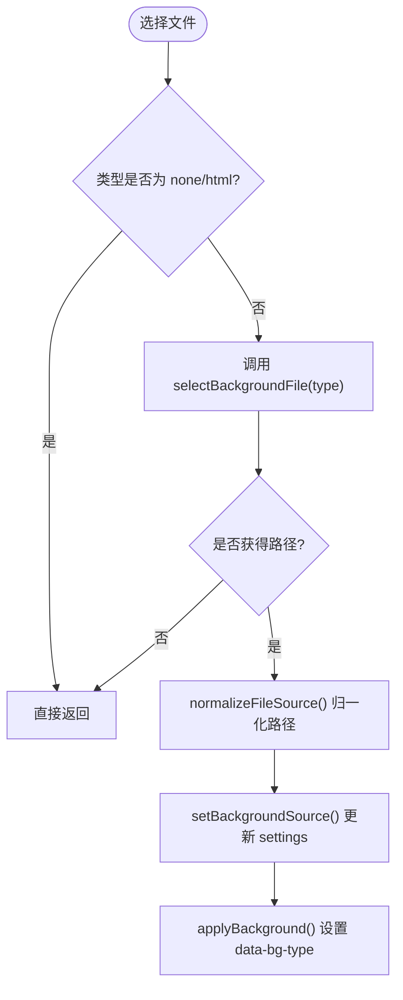
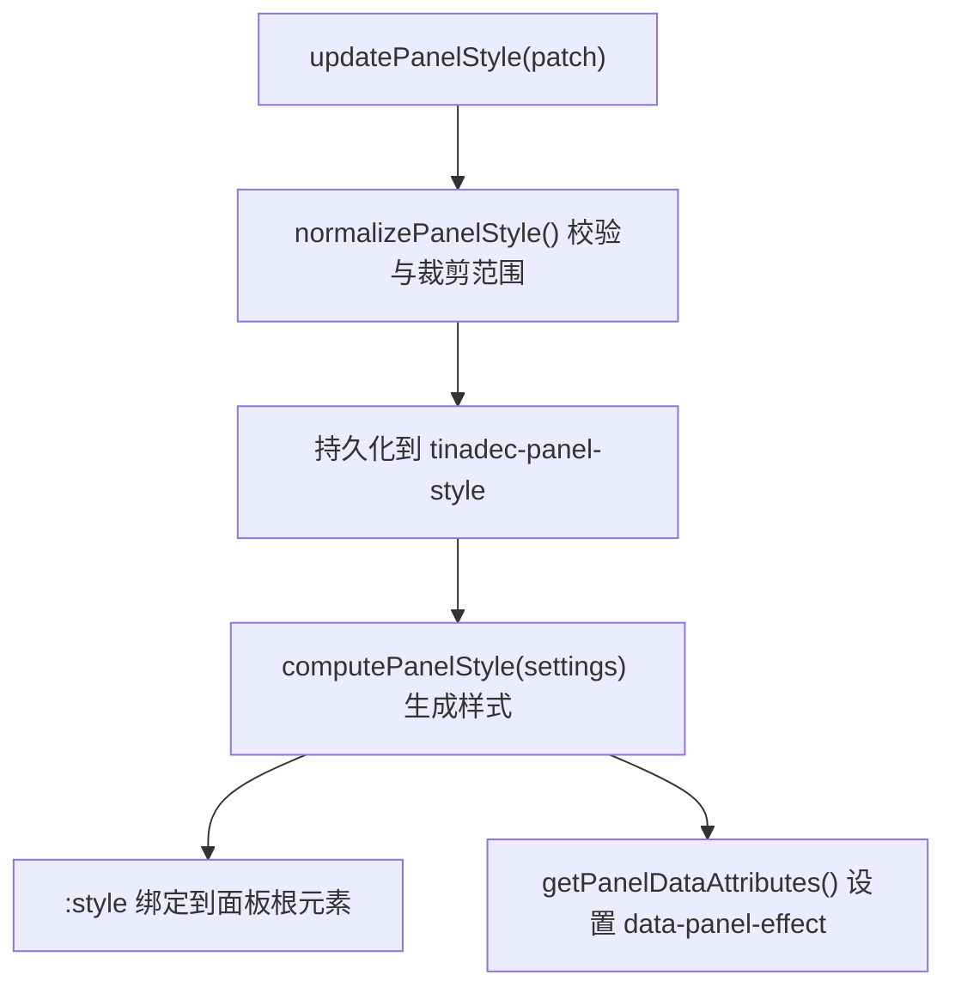
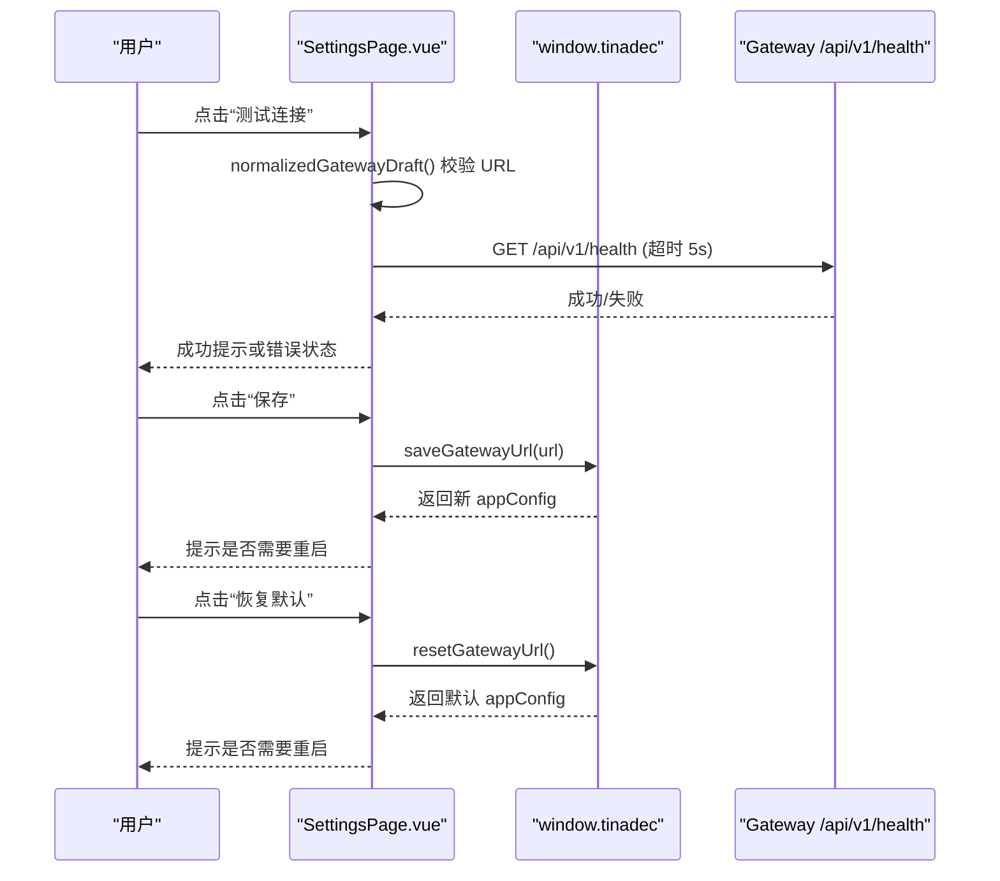
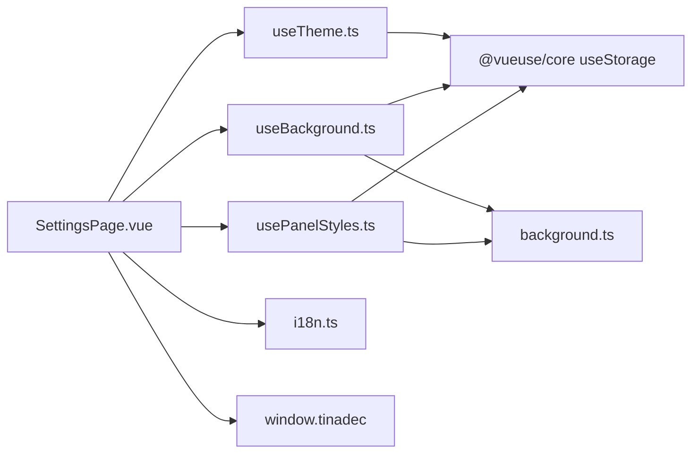

# 通用设置

<cite>
**本文引用的文件**   
- [settingsRegistry.ts](file://apps/desktop/src/settings/settingsRegistry.ts)
- [types.ts](file://apps/desktop/src/settings/types.ts)
- [useBackground.ts](file://apps/desktop/src/composables/useBackground.ts)
- [background.ts](file://apps/desktop/src/types/background.ts)
- [usePanelStyles.ts](file://apps/desktop/src/composables/usePanelStyles.ts)
- [panel-style-control.vue](file://apps/desktop/src/components/ui/panel-style-control.vue)
- [background-preview.vue](file://apps/desktop/src/components/ui/background-preview.vue)
- [useTheme.ts](file://apps/desktop/src/composables/useTheme.ts)
- [i18n.ts](file://apps/desktop/src/i18n.ts)
- [en.ts](file://apps/desktop/src/locales/en.ts)
- [zh-CN.ts](file://apps/desktop/src/locales/zh-CN.ts)
- [SettingsPage.vue](file://apps/desktop/src/pages/SettingsPage.vue)
</cite>

## 目录
1. [简介](#简介)
2. [项目结构](#项目结构)
3. [核心组件](#核心组件)
4. [架构总览](#架构总览)
5. [详细组件分析](#详细组件分析)
6. [依赖关系分析](#依赖关系分析)
7. [性能考量](#性能考量)
8. [故障排查指南](#故障排查指南)
9. [结论](#结论)
10. [附录](#附录)

## 简介
本文件为“通用设置模块”的完整技术文档，覆盖以下能力：
- 应用基础配置：主题（深色/浅色/系统模式）、强调色选择、窗口控制（最小化、最大化、关闭）
- Gateway URL 配置管理：连接测试、保存与重置、环境变量优先级提示
- 背景设置系统：图片、视频、HTML 动态背景；支持透明度、模糊度、尺寸、位置、重复等参数
- 面板材质效果：全局统一的不透明/半透明/毛玻璃三种效果及参数
- 国际化语言设置与本地存储机制
- 配置校验规则与错误处理策略

## 项目结构
设置模块由“注册表 + 组合式函数 + 类型定义 + UI 组件 + 页面集成”构成：
- 设置注册表：集中声明各设置项元数据与懒加载器映射
- 组合式函数：封装主题、背景、面板样式、国际化等状态与行为
- 类型定义：统一数据结构与默认值
- UI 组件：预览与控件（背景预览、面板样式控件）
- 页面集成：设置页聚合所有功能并处理交互流程

图表来源
- [settingsRegistry.ts:19-39](file://apps/desktop/src/settings/settingsRegistry.ts#L19-L39)
- [types.ts:3-16](file://apps/desktop/src/settings/types.ts#L3-L16)
- [useTheme.ts:1-258](file://apps/desktop/src/composables/useTheme.ts#L1-L258)
- [useBackground.ts:1-230](file://apps/desktop/src/composables/useBackground.ts#L1-L230)
- [usePanelStyles.ts:1-203](file://apps/desktop/src/composables/usePanelStyles.ts#L1-L203)
- [background.ts:1-57](file://apps/desktop/src/types/background.ts#L1-L57)
- [background-preview.vue:1-221](file://apps/desktop/src/components/ui/background-preview.vue#L1-L221)
- [panel-style-control.vue:1-293](file://apps/desktop/src/components/ui/panel-style-control.vue#L1-L293)
- [SettingsPage.vue:140-220](file://apps/desktop/src/pages/SettingsPage.vue#L140-L220)

章节来源
- [settingsRegistry.ts:19-39](file://apps/desktop/src/settings/settingsRegistry.ts#L19-L39)
- [types.ts:3-16](file://apps/desktop/src/settings/types.ts#L3-L16)

## 核心组件
- 设置注册表：提供统一的设置项元数据与懒加载映射，便于扩展新的设置模块
- 主题与强调色：持久化主题与强调色，实时应用至根节点 CSS 变量
- 背景系统：统一管理背景类型、源、透明度、模糊、尺寸、位置、重复，并提供文件选择与路径归一化
- 面板材质效果：全局统一三种效果（不透明/半透明/毛玻璃），通过 CSS 变量与 data 属性驱动
- 国际化：基于 vue-i18n，语言偏好持久化到 localStorage
- 设置页集成：Gateway URL 配置、连接测试、保存/重置、窗口控制、主题切换广播

章节来源
- [settingsRegistry.ts:19-39](file://apps/desktop/src/settings/settingsRegistry.ts#L19-L39)
- [useTheme.ts:194-258](file://apps/desktop/src/composables/useTheme.ts#L194-L258)
- [useBackground.ts:97-229](file://apps/desktop/src/composables/useBackground.ts#L97-L229)
- [usePanelStyles.ts:143-202](file://apps/desktop/src/composables/usePanelStyles.ts#L143-L202)
- [i18n.ts:1-24](file://apps/desktop/src/i18n.ts#L1-L24)
- [SettingsPage.vue:140-220](file://apps/desktop/src/pages/SettingsPage.vue#L140-L220)

## 架构总览
设置模块采用“组合式函数 + 响应式存储 + 组件渲染”的分层架构。组合式函数负责状态与业务逻辑，类型定义约束数据结构，组件负责可视化与交互，页面负责编排与外部能力调用（如 Electron API）。

图表来源
- [SettingsPage.vue:489-574](file://apps/desktop/src/pages/SettingsPage.vue#L489-L574)
- [useTheme.ts:217-258](file://apps/desktop/src/composables/useTheme.ts#L217-L258)
- [useBackground.ts:97-229](file://apps/desktop/src/composables/useBackground.ts#L97-L229)
- [usePanelStyles.ts:143-202](file://apps/desktop/src/composables/usePanelStyles.ts#L143-L202)
- [i18n.ts:6-11](file://apps/desktop/src/i18n.ts#L6-L11)

## 详细组件分析

### 主题与强调色（useTheme）
- 支持主题：dark、light、system（跟随系统）
- 强调色：内置多套颜色，分别定义 dark/light 两套变量集
- 持久化：使用 @vueuse/core 的 useStorage 将主题与强调色写入 localStorage
- 应用方式：在 document.documentElement 上设置 data-theme 与 CSS 变量
- 系统主题监听：监听 prefers-color-scheme 变化以响应系统主题切换

图表来源
- [useTheme.ts:172-258](file://apps/desktop/src/composables/useTheme.ts#L172-L258)

章节来源
- [useTheme.ts:1-258](file://apps/desktop/src/composables/useTheme.ts#L1-L258)

### 背景设置系统（useBackground + background-preview）
- 背景类型：none、image、video、html
- 参数：source（URL/本地路径/HTML）、opacity（0-100）、blur（0-20px）、size（cover/contain/auto）、position（center/top/bottom/left/right）、repeat（no-repeat/repeat/repeat-x/repeat-y）
- 文件选择：通过 window.tinadec.selectBackgroundFile(type) 调用 Electron 对话框
- 路径归一化：normalizeFileSource 将 Windows/Unix 路径转换为 file:// URL，兼容 CSS url() 与 HTML src
- 应用方式：设置 data-bg-type 属性，模板根据类型渲染对应元素（img/video/html）
- 预览组件：background-preview.vue 实时展示当前背景与参数

图表来源
- [background.ts:8-40](file://apps/desktop/src/types/background.ts#L8-L40)

图表来源
- [useBackground.ts:78-137](file://apps/desktop/src/composables/useBackground.ts#L78-L137)
- [useBackground.ts:193-210](file://apps/desktop/src/composables/useBackground.ts#L193-L210)

章节来源
- [useBackground.ts:1-230](file://apps/desktop/src/composables/useBackground.ts#L1-L230)
- [background.ts:1-57](file://apps/desktop/src/types/background.ts#L1-L57)
- [background-preview.vue:1-221](file://apps/desktop/src/components/ui/background-preview.vue#L1-L221)

### 面板材质效果（usePanelStyles + panel-style-control）
- 效果类型：opaque（纯色）、translucent（半透明）、blur（毛玻璃）
- 参数：effect、opacity（0-100）、blur（0-20px）
- 存储键：tinadec-panel-style，默认值来自 DEFAULT_PANEL_STYLE_SETTINGS
- 样式计算：computePanelStyle 生成内联样式，并通过 data-panel-effect 暴露给 CSS 进行 token 映射
- 组件：panel-style-control.vue 提供效果选择、滑块调节与实时预览

图表来源
- [usePanelStyles.ts:86-141](file://apps/desktop/src/composables/usePanelStyles.ts#L86-L141)
- [usePanelStyles.ts:143-202](file://apps/desktop/src/composables/usePanelStyles.ts#L143-L202)

章节来源
- [usePanelStyles.ts:1-203](file://apps/desktop/src/composables/usePanelStyles.ts#L1-L203)
- [panel-style-control.vue:1-293](file://apps/desktop/src/components/ui/panel-style-control.vue#L1-L293)

### 国际化与语言设置（i18n + locales）
- 语言包：zh-CN.ts、en.ts
- 初始化：i18n.ts 延迟读取 localStorage 中的 tinadec-locale，默认 zh-CN，回退 en
- 设置页：setLocale(lang) 更新 locale.value 并持久化到 localStorage

章节来源
- [i18n.ts:1-24](file://apps/desktop/src/i18n.ts#L1-L24)
- [en.ts:305-751](file://apps/desktop/src/locales/en.ts#L305-L751)
- [zh-CN.ts:305-751](file://apps/desktop/src/locales/zh-CN.ts#L305-L751)
- [SettingsPage.vue:789-792](file://apps/desktop/src/pages/SettingsPage.vue#L789-L792)

### 设置注册表与导航（settingsRegistry + types）
- 元数据：SETTINGS_METADATA 包含 id、icon、labelKey
- 构建：createSettingsRegistry(loaders) 将元数据与懒加载器合并为条目数组
- 类型：SettingsId、SettingsLoader、SettingsNavigationOptions 等用于类型安全

章节来源
- [settingsRegistry.ts:19-39](file://apps/desktop/src/settings/settingsRegistry.ts#L19-L39)
- [types.ts:3-16](file://apps/desktop/src/settings/types.ts#L3-L16)

### 设置页集成（SettingsPage.vue）
- 窗口控制：minimizeWindow/maximizeWindow/closeWindow 调用 window.tinadec.*
- 主题广播：changeTheme/changeAccentColor 向独立面板窗口广播主题与强调色
- Gateway URL：
  - 读取：loadAppConfig() 获取 appConfig.gateway_url/source/managed
  - 校验：normalizedGatewayDraft() 要求 http/https 协议并去除末尾斜杠
  - 测试：testGatewayConnection() 请求 /api/v1/health，超时 5s
  - 保存：saveGatewayConfiguration() 调用 window.tinadec.saveGatewayUrl()
  - 重置：resetGatewayConfiguration() 调用 window.tinadec.resetGatewayUrl()
  - 重启：restartDesktop() 调用 window.tinadec.restartApp()
- 背景与面板样式：通过 useBackground 与 usePanelStyles 集成

图表来源
- [SettingsPage.vue:489-574](file://apps/desktop/src/pages/SettingsPage.vue#L489-L574)

章节来源
- [SettingsPage.vue:140-220](file://apps/desktop/src/pages/SettingsPage.vue#L140-L220)
- [SettingsPage.vue:489-574](file://apps/desktop/src/pages/SettingsPage.vue#L489-L574)

## 依赖关系分析
- SettingsPage.vue 依赖：
  - useTheme：主题与强调色
  - useBackground：背景设置与文件选择
  - usePanelStyles：面板材质效果
  - i18n：国际化文本
  - window.tinadec：Electron 能力（窗口控制、Gateway 配置、宠物管理等）
- 组合式函数依赖：
  - @vueuse/core 的 useStorage：持久化到 localStorage
  - Vue 响应式 API：ref/watch/computed
- 类型定义：
  - background.ts 定义 BackgroundSettings、PanelStyleSettings、AppearanceSettings 与默认值

图表来源
- [SettingsPage.vue:140-220](file://apps/desktop/src/pages/SettingsPage.vue#L140-L220)
- [useTheme.ts:1-258](file://apps/desktop/src/composables/useTheme.ts#L1-L258)
- [useBackground.ts:1-230](file://apps/desktop/src/composables/useBackground.ts#L1-L230)
- [usePanelStyles.ts:1-203](file://apps/desktop/src/composables/usePanelStyles.ts#L1-L203)
- [background.ts:1-57](file://apps/desktop/src/types/background.ts#L1-L57)

章节来源
- [SettingsPage.vue:140-220](file://apps/desktop/src/pages/SettingsPage.vue#L140-L220)

## 性能考量
- 背景渲染：
  - 大图片或视频背景可能影响性能，建议合理选择尺寸与格式
  - 模糊度较高时，backdrop-filter 会带来额外开销
- 主题与强调色：
  - 通过 CSS 变量一次性应用，避免频繁 DOM 操作
- 面板材质效果：
  - blur 效果会触发合成层重绘，建议控制在 0-20px 范围内
- 本地存储：
  - 使用 @vueuse/core 的 useStorage，惰性初始化与同步刷新，减少不必要的读写

## 故障排查指南
- Gateway 连接失败：
  - 检查 URL 是否为 http/https，且无多余斜杠
  - 确认网络可达与防火墙策略
  - 查看 /api/v1/health 返回码与消息
- 背景文件无法加载：
  - 确认文件路径已正确归一化为 file:// URL
  - 检查文件格式与浏览器支持（图片 JPG/PNG/GIF/WebP，视频 MP4/WebM）
  - 若为 HTML 背景，确保内容不包含交互脚本
- 面板样式异常：
  - 检查 data-panel-effect 是否正确设置
  - 确认 CSS 变量 --bg-primary-rgb 与 --surface-* 已定义
- 主题未生效：
  - 检查 documentElement 的 data-theme 与 CSS 变量
  - 确认系统主题监听事件未被拦截
- 国际化未切换：
  - 检查 localStorage 中 tinadec-locale 是否写入成功
  - 确认 i18n 实例 locale 已更新

章节来源
- [SettingsPage.vue:494-574](file://apps/desktop/src/pages/SettingsPage.vue#L494-L574)
- [useBackground.ts:42-73](file://apps/desktop/src/composables/useBackground.ts#L42-L73)
- [usePanelStyles.ts:86-141](file://apps/desktop/src/composables/usePanelStyles.ts#L86-L141)
- [useTheme.ts:194-258](file://apps/desktop/src/composables/useTheme.ts#L194-L258)
- [i18n.ts:6-11](file://apps/desktop/src/i18n.ts#L6-L11)

## 结论
通用设置模块通过清晰的职责划分与类型约束，实现了主题、背景、面板材质、国际化与 Gateway 配置的完整闭环。组合式函数与本地存储结合保证了状态的持久化与响应式更新，组件层提供直观的预览与交互。整体架构易于扩展与维护，适合持续迭代与跨平台适配。

## 附录
- 配置键名与默认值：
  - tinadec-theme：主题（dark/light/system），默认 dark
  - tinadec-accent-color：强调色 key，默认 blue
  - tinadec-background：背景设置对象，默认 none
  - tinadec-panel-style：面板材质效果对象，默认 opaque
  - tinadec-locale：语言代码，默认 zh-CN
- 支持的背景类型与参数：
  - 类型：none/image/video/html
  - 参数：source、opacity、blur、size、position、repeat
- 面板材质效果：
  - 效果：opaque/translucent/blur
  - 参数：opacity、blur