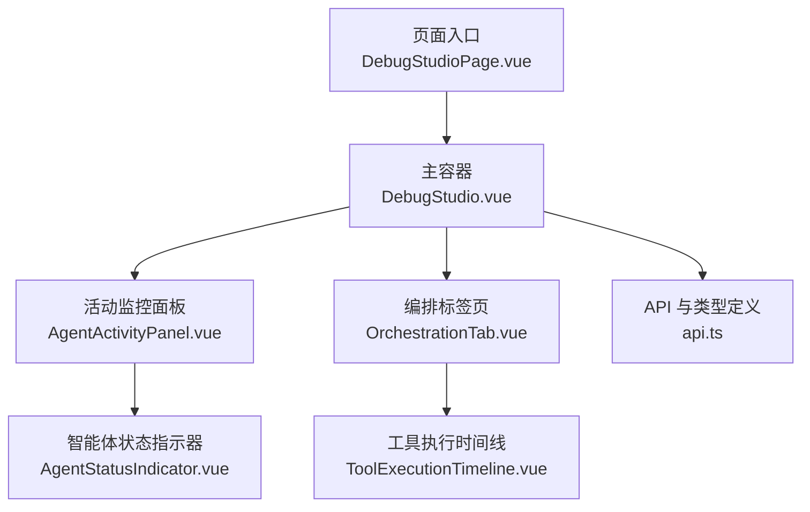
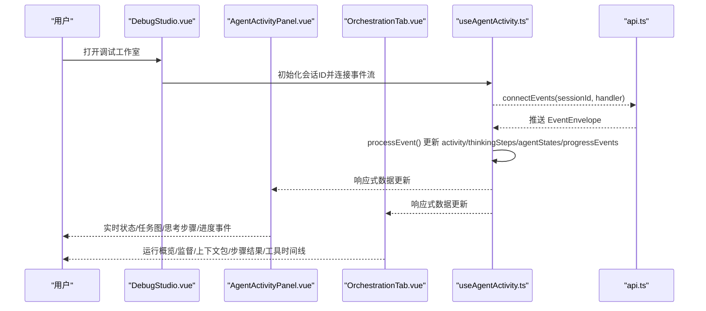
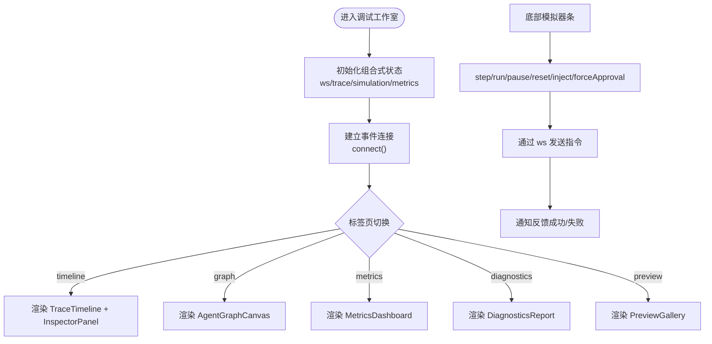
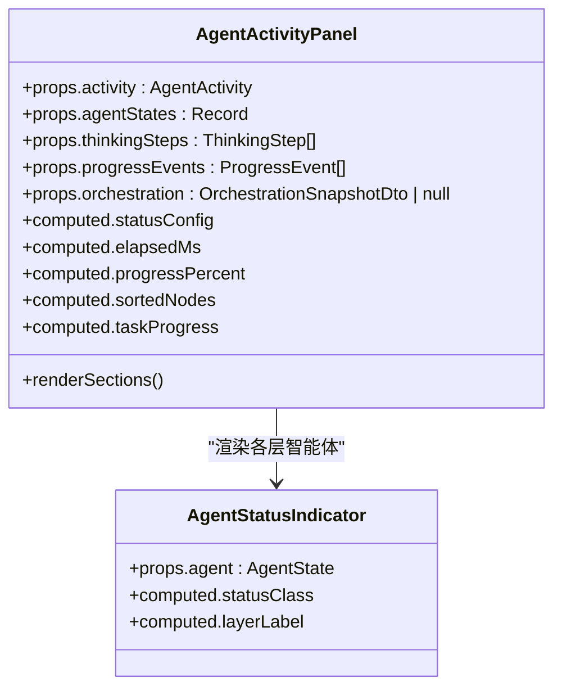
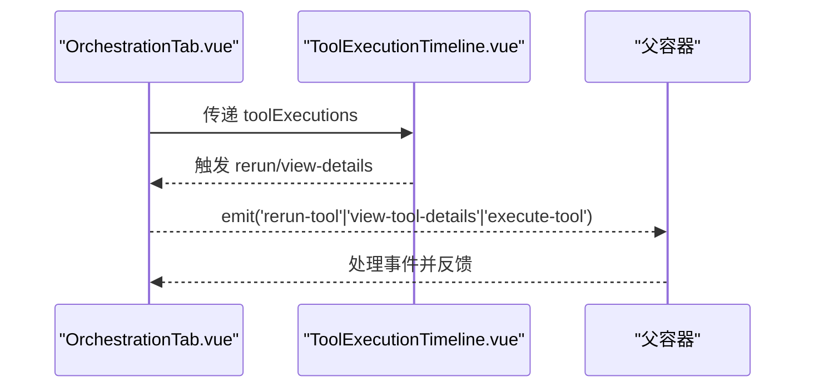
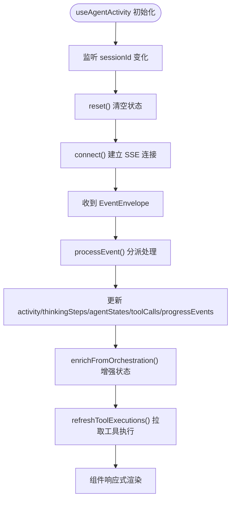
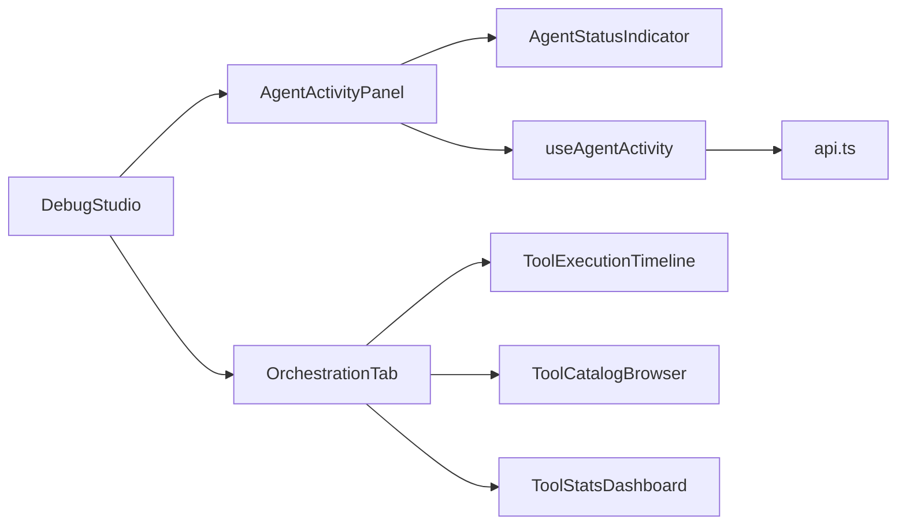

# 调试工作室核心组件

<cite>
**本文引用的文件**   
- [DebugStudioPage.vue](file://apps/desktop/src/pages/DebugStudioPage.vue)
- [DebugStudio.vue](file://apps/desktop/src/debug/DebugStudio.vue)
- [AgentActivityPanel.vue](file://apps/desktop/src/components/AgentActivityPanel.vue)
- [OrchestrationTab.vue](file://apps/desktop/src/components/OrchestrationTab.vue)
- [useAgentActivity.ts](file://apps/desktop/src/composables/useAgentActivity.ts)
- [ToolExecutionTimeline.vue](file://apps/desktop/src/components/tools/ToolExecutionTimeline.vue)
- [AgentStatusIndicator.vue](file://apps/desktop/src/components/chat/AgentStatusIndicator.vue)
- [api.ts](file://apps/desktop/src/api.ts)
</cite>

## 目录
1. [简介](#简介)
2. [项目结构](#项目结构)
3. [核心组件](#核心组件)
4. [架构总览](#架构总览)
5. [详细组件分析](#详细组件分析)
6. [依赖关系分析](#依赖关系分析)
7. [性能考量](#性能考量)
8. [故障排查指南](#故障排查指南)
9. [结论](#结论)

## 简介
本文件面向“调试工作室”前端核心，聚焦以下目标：
- 说明 DebugStudio.vue 主组件的架构设计，包括面板布局管理、状态管理和事件处理机制。
- 记录 AgentActivityPanel 活动监控面板的实现，包括实时数据流、性能指标展示和交互功能。
- 详细说明 OrchestrationTab 编排标签页的功能，包括工作流可视化、状态跟踪和调试控制。
- 梳理组件间的通信模式、数据绑定与响应式更新机制。

## 项目结构
调试工作室由页面入口、主容器、活动监控面板、编排标签页以及工具执行时间线等关键模块组成。整体采用 Vue 单文件组件 + Composition API 的组合方式，通过组合式函数 useAgentActivity 统一管理与后端的事件流与状态同步。

图表来源
- [DebugStudioPage.vue:1-8](file://apps/desktop/src/pages/DebugStudioPage.vue#L1-L8)
- [DebugStudio.vue:1-303](file://apps/desktop/src/debug/DebugStudio.vue#L1-L303)
- [AgentActivityPanel.vue:1-400](file://apps/desktop/src/components/AgentActivityPanel.vue#L1-L400)
- [OrchestrationTab.vue:1-150](file://apps/desktop/src/components/OrchestrationTab.vue#L1-L150)
- [ToolExecutionTimeline.vue:1-120](file://apps/desktop/src/components/tools/ToolExecutionTimeline.vue#L1-L120)
- [AgentStatusIndicator.vue:1-80](file://apps/desktop/src/components/chat/AgentStatusIndicator.vue#L1-L80)
- [api.ts:1-200](file://apps/desktop/src/api.ts#L1-L200)

章节来源
- [DebugStudioPage.vue:1-8](file://apps/desktop/src/pages/DebugStudioPage.vue#L1-L8)
- [DebugStudio.vue:1-120](file://apps/desktop/src/debug/DebugStudio.vue#L1-L120)

## 核心组件
- DebugStudio.vue：调试工作室主容器，负责窗口标题栏、标签页切换、底部模拟器条、子面板布局与全局事件（如模拟注入、审批决策）的分发。
- AgentActivityPanel.vue：活动监控面板，聚合运行状态、任务图、思考步骤、实时进度事件，并渲染各层智能体状态。
- OrchestrationTab.vue：编排标签页，提供运行概览、监督发现、上下文包、步骤结果及工具执行时间线的多标签视图。
- ToolExecutionTimeline.vue：工具执行时间线，支持过滤、排序、展开详情、重放与查看详情。
- AgentStatusIndicator.vue：智能体状态指示器，显示名称、层级、当前任务与状态动画。
- useAgentActivity.ts：核心组合式函数，维护活动状态、工具调用、思考步骤、智能体状态与进度事件，并通过 SSE 接收事件、拉取工具执行列表，驱动响应式更新。

章节来源
- [DebugStudio.vue:1-160](file://apps/desktop/src/debug/DebugStudio.vue#L1-L160)
- [AgentActivityPanel.vue:1-200](file://apps/desktop/src/components/AgentActivityPanel.vue#L1-L200)
- [OrchestrationTab.vue:1-120](file://apps/desktop/src/components/OrchestrationTab.vue#L1-L120)
- [ToolExecutionTimeline.vue:1-120](file://apps/desktop/src/components/tools/ToolExecutionTimeline.vue#L1-L120)
- [AgentStatusIndicator.vue:1-80](file://apps/desktop/src/components/chat/AgentStatusIndicator.vue#L1-L80)
- [useAgentActivity.ts:1-120](file://apps/desktop/src/composables/useAgentActivity.ts#L1-L120)

## 架构总览
调试工作室采用“容器 + 面板 + 组合式状态”的架构：
- 容器层（DebugStudio.vue）组织 UI 布局与用户操作，将事件向下分发到子面板或模拟器条。
- 面板层（AgentActivityPanel.vue、OrchestrationTab.vue）消费来自组合式函数的响应式数据，进行可视化呈现与交互。
- 状态层（useAgentActivity.ts）统一管理事件流、数据转换、本地缓存与清理策略，并通过 api.ts 提供的接口与后端交互。

图表来源
- [DebugStudio.vue:60-120](file://apps/desktop/src/debug/DebugStudio.vue#L60-L120)
- [useAgentActivity.ts:640-680](file://apps/desktop/src/composables/useAgentActivity.ts#L640-L680)
- [api.ts:1-200](file://apps/desktop/src/api.ts#L1-L200)

## 详细组件分析

### DebugStudio.vue 主组件
- 布局管理：顶部标题栏包含会话选择、实时回放开关、WebSocket 状态；中部为标签页内容区（时间线、智能体图、指标、诊断、预览）；底部为模拟器条，提供步进、运行、暂停、重置、注入消息与强制审批等操作。
- 状态管理：使用多个组合式函数（useDebugWebSocket、useTraceData、useSimulation、useMetrics）分别管理 WebSocket、追踪数据、模拟状态与指标诊断。
- 事件处理：对模拟器条的操作通过事件回调转发至 WebSocket 或模拟逻辑，同时通过通知组件反馈结果。

图表来源
- [DebugStudio.vue:20-160](file://apps/desktop/src/debug/DebugStudio.vue#L20-L160)

章节来源
- [DebugStudio.vue:1-160](file://apps/desktop/src/debug/DebugStudio.vue#L1-L160)

### AgentActivityPanel 活动监控面板
- 实时数据流：通过 useAgentActivity 订阅 SSE 事件，解析 run.started、task_graph.created、task.assigned、step.result.created、supervision.checked、context.pack.created、approval.requested/rejected、message.created 等事件，更新活动状态、思考步骤、智能体状态与进度事件。
- 性能指标展示：计算运行耗时、完成节点比例、任务图进度、最近 15 条进度事件滚动展示。
- 交互功能：折叠/展开状态区块、任务图区块、思考步骤区块；按层级分组展示规划层与执行层智能体；根据状态动态图标与颜色。

图表来源
- [AgentActivityPanel.vue:1-200](file://apps/desktop/src/components/AgentActivityPanel.vue#L1-L200)
- [AgentStatusIndicator.vue:1-80](file://apps/desktop/src/components/chat/AgentStatusIndicator.vue#L1-L80)

章节来源
- [AgentActivityPanel.vue:1-400](file://apps/desktop/src/components/AgentActivityPanel.vue#L1-L400)
- [AgentStatusIndicator.vue:1-120](file://apps/desktop/src/components/chat/AgentStatusIndicator.vue#L1-L120)

### OrchestrationTab 编排标签页
- 功能范围：运行概览（run.summary/status/nodes/assignments）、监督发现（severity/category/summary/recommendation）、上下文包（token_budget/compression_ratio）、步骤结果（status/summary）。
- 工具执行时间线：三个标签页（Timeline/Catalog/Stats），支持过滤（全部/成功/失败/审批/运行中）、排序（新旧）、展开详情、重放与查看详情。
- 调试控制：通过 emit 向上抛出 rerun-tool、view-tool-details、execute-tool 事件，供上层容器处理。

图表来源
- [OrchestrationTab.vue:1-120](file://apps/desktop/src/components/OrchestrationTab.vue#L1-L120)
- [ToolExecutionTimeline.vue:1-120](file://apps/desktop/src/components/tools/ToolExecutionTimeline.vue#L1-L120)

章节来源
- [OrchestrationTab.vue:1-150](file://apps/desktop/src/components/OrchestrationTab.vue#L1-L150)
- [ToolExecutionTimeline.vue:1-200](file://apps/desktop/src/components/tools/ToolExecutionTimeline.vue#L1-L200)

### useAgentActivity 组合式函数
- 数据结构：AgentActivity、ToolCall、ThinkingStep、AgentState、ProgressEvent 等类型定义，用于描述运行状态、工具调用、思考步骤、智能体状态与进度事件。
- 事件处理：processEvent 分派不同事件类型，更新 activity、thinkingSteps、agentStates、toolCalls、progressEvents，并在必要时刷新工具执行列表。
- 数据增强：enrichFromOrchestration 从编排快照补充运行状态、节点计数与智能体状态映射。
- 生命周期：watch sessionId 变化时重置并重新连接；watch orchestration 快照变化时增强状态；onUnmounted 清理定时器与事件源。

图表来源
- [useAgentActivity.ts:150-220](file://apps/desktop/src/composables/useAgentActivity.ts#L150-L220)
- [useAgentActivity.ts:490-540](file://apps/desktop/src/composables/useAgentActivity.ts#L490-L540)
- [useAgentActivity.ts:585-640](file://apps/desktop/src/composables/useAgentActivity.ts#L585-L640)
- [useAgentActivity.ts:640-680](file://apps/desktop/src/composables/useAgentActivity.ts#L640-L680)

章节来源
- [useAgentActivity.ts:1-200](file://apps/desktop/src/composables/useAgentActivity.ts#L1-L200)
- [useAgentActivity.ts:490-680](file://apps/desktop/src/composables/useAgentActivity.ts#L490-L680)

## 依赖关系分析
- 组件依赖：
  - AgentActivityPanel 依赖 AgentStatusIndicator 与 useAgentActivity 提供的响应式数据。
  - OrchestrationTab 依赖 ToolExecutionTimeline、ToolCatalogBrowser、ToolStatsDashboard，并通过事件向上传播用户操作。
  - DebugStudio 作为容器，协调各面板与模拟器条，不直接持有业务状态。
- 数据依赖：
  - useAgentActivity 依赖 api.ts 中的类型定义与 SSE 连接方法，确保前后端契约一致。
  - 工具执行时间线依赖 ToolExecutionTimelineItemDto 等 DTO，保证字段映射正确。
- 外部依赖：
  - @lucide/vue 图标库用于状态与分类图标。
  - vue-i18n 用于国际化文本。

图表来源
- [AgentActivityPanel.vue:1-120](file://apps/desktop/src/components/AgentActivityPanel.vue#L1-L120)
- [OrchestrationTab.vue:1-120](file://apps/desktop/src/components/OrchestrationTab.vue#L1-L120)
- [useAgentActivity.ts:1-120](file://apps/desktop/src/composables/useAgentActivity.ts#L1-L120)
- [api.ts:1-200](file://apps/desktop/src/api.ts#L1-L200)

章节来源
- [AgentActivityPanel.vue:1-200](file://apps/desktop/src/components/AgentActivityPanel.vue#L1-L200)
- [OrchestrationTab.vue:1-120](file://apps/desktop/src/components/OrchestrationTab.vue#L1-L120)
- [useAgentActivity.ts:1-120](file://apps/desktop/src/composables/useAgentActivity.ts#L1-L120)
- [api.ts:1-200](file://apps/desktop/src/api.ts#L1-L200)

## 性能考量
- 事件节流与裁剪：进度事件仅保留最近 20 条，避免内存增长；可见进度事件仅展示最近 15 条，降低渲染压力。
- 计算属性优化：使用 computed 缓存排序后的节点、任务进度、状态配置等，减少重复计算。
- 增量更新：SSE 事件处理仅更新差异字段，避免全量替换；工具执行列表在特定事件后刷新，而非每次事件都拉取。
- 清理策略：会话切换或组件卸载时清理定时器与事件源，防止泄漏。

[本节为通用指导，无需引用具体文件]

## 故障排查指南
- 无活动显示：检查 sessionId 是否正确传入 useAgentActivity；确认 SSE 连接是否建立；查看 progressEvents 是否有新事件。
- 状态不更新：确认 processEvent 分支是否匹配事件类型；检查 enrichFromOrchestration 是否能从快照中获取节点与分配信息。
- 工具执行列表为空：确认 refreshToolExecutions 是否被触发；检查 api.listToolExecutions 返回数据是否符合预期。
- 审批流程卡住：检查 approval.requested/rejected 事件是否到达；确认 toolCalls 中对应 approvalId 的状态是否更新。

章节来源
- [useAgentActivity.ts:490-540](file://apps/desktop/src/composables/useAgentActivity.ts#L490-L540)
- [useAgentActivity.ts:585-640](file://apps/desktop/src/composables/useAgentActivity.ts#L585-L640)
- [useAgentActivity.ts:640-680](file://apps/desktop/src/composables/useAgentActivity.ts#L640-L680)

## 结论
调试工作室以 DebugStudio.vue 为容器，结合 AgentActivityPanel 与 OrchestrationTab 两大面板，通过 useAgentActivity 统一管理与后端的实时事件流与状态同步。该架构清晰分离了布局、展示与状态逻辑，具备良好的可维护性与扩展性。未来可在以下方向进一步优化：
- 增加更细粒度的错误边界与重试机制。
- 引入虚拟滚动优化大量事件与工具执行的渲染性能。
- 扩展更多编排可视化能力（如拓扑图、依赖关系图）。

[本节为总结性内容，无需引用具体文件]