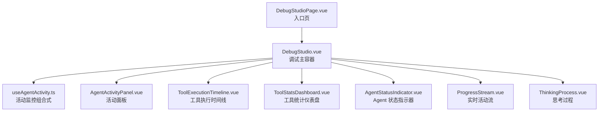
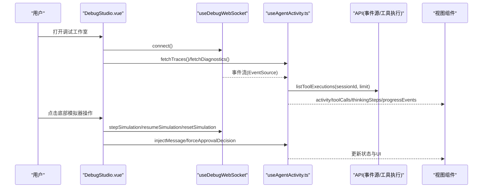
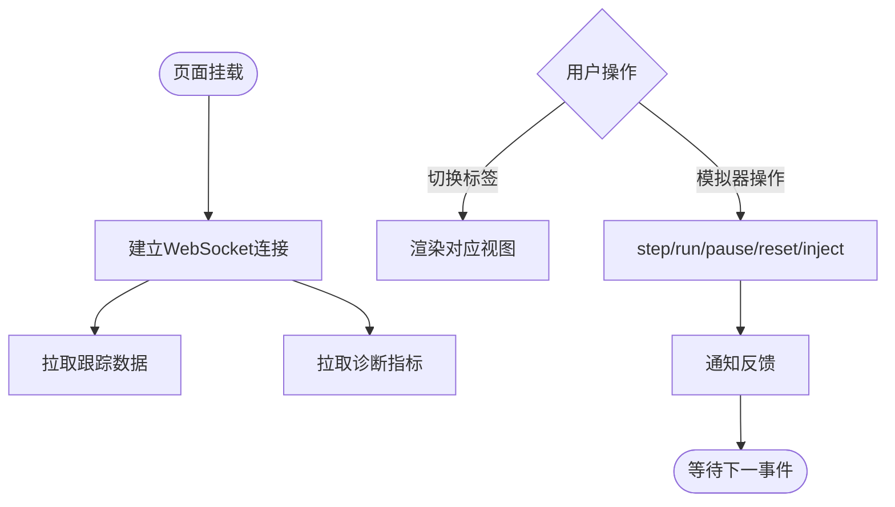
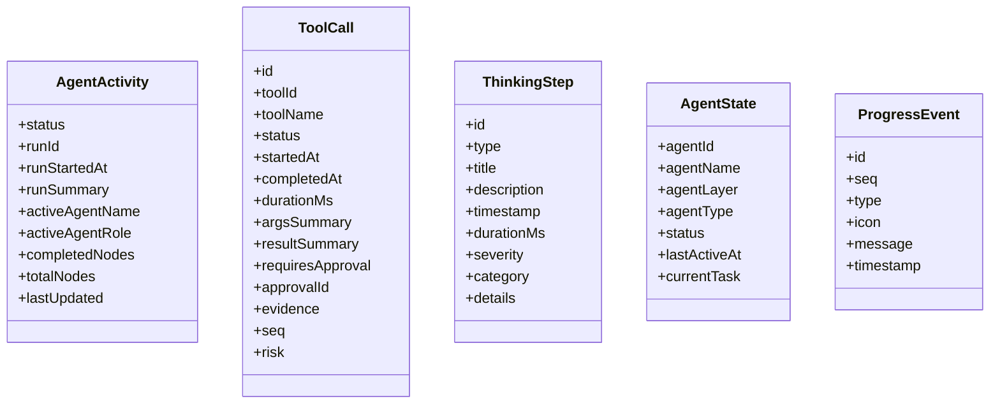
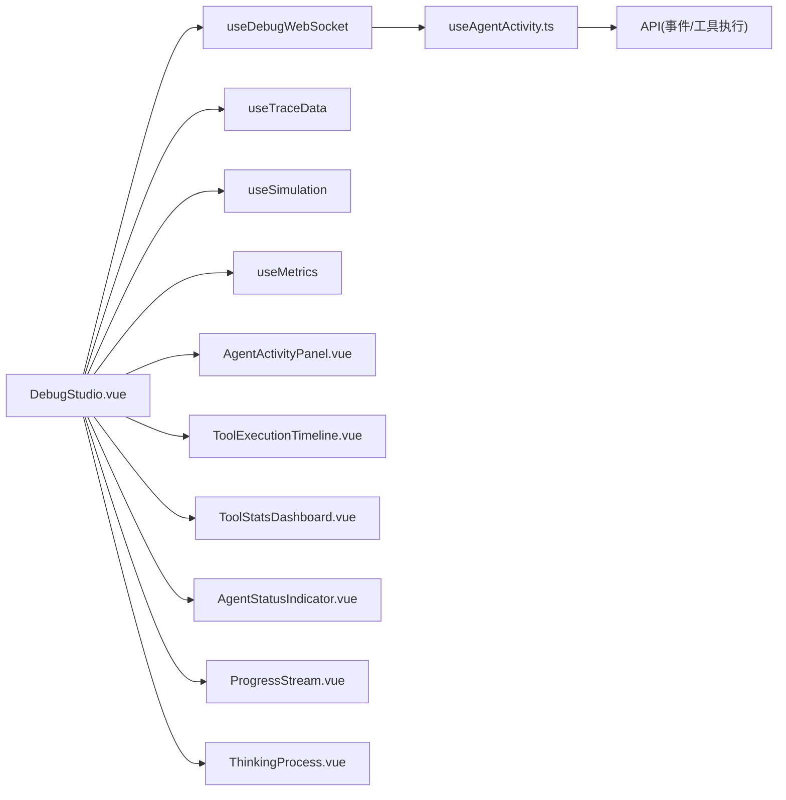

# 调试工作室页面

<cite>
**本文引用的文件**   
- [DebugStudioPage.vue](file://apps/desktop/src/pages/DebugStudioPage.vue)
- [DebugStudio.vue](file://apps/desktop/src/debug/DebugStudio.vue)
- [useAgentActivity.ts](file://apps/desktop/src/composables/useAgentActivity.ts)
- [AgentActivityPanel.vue](file://apps/desktop/src/components/AgentActivityPanel.vue)
- [ToolExecutionTimeline.vue](file://apps/desktop/src/components/tools/ToolExecutionTimeline.vue)
- [ToolStatsDashboard.vue](file://apps/desktop/src/components/tools/ToolStatsDashboard.vue)
- [AgentStatusIndicator.vue](file://apps/desktop/src/components/chat/AgentStatusIndicator.vue)
- [ProgressStream.vue](file://apps/desktop/src/components/chat/ProgressStream.vue)
- [ThinkingProcess.vue](file://apps/desktop/src/components/chat/ThinkingProcess.vue)
</cite>

## 目录
1. [简介](#简介)
2. [项目结构](#项目结构)
3. [核心组件与能力](#核心组件与能力)
4. [架构总览](#架构总览)
5. [详细组件分析](#详细组件分析)
6. [依赖关系分析](#依赖关系分析)
7. [性能考量](#性能考量)
8. [故障排查指南](#故障排查指南)
9. [结论](#结论)
10. [附录：数据模型与事件契约](#附录数据模型与事件契约)

## 简介
本文件为“调试工作室页面”的完整技术文档，聚焦于 DebugStudioPage 及其承载的调试能力：Agent 活动监控、编排状态查看、日志分析与性能追踪。文档覆盖实时数据流、事件监听与状态同步机制，并说明调试面板布局设计、数据可视化图表与交互式调试工具（模拟注入、审批强制、回放控制等）。同时给出调试过滤器、告警配置思路与导出报告能力的落地建议。

## 项目结构
调试工作室由一个轻量入口页与一个主调试容器组成，后者通过标签页组织不同视图：时间线、图拓扑、指标仪表盘、诊断报告与预览画廊。关键文件职责如下：
- 入口页：仅负责引入并渲染主调试容器。
- 主调试容器：管理 WebSocket 连接、会话选择、实时回放开关、标签页切换、底部模拟器栏以及各子视图的数据绑定。
- 活动监控组合式函数：订阅后端事件流，维护 Agent 运行状态、思考步骤、工具调用与进度事件，并与编排快照进行双向增强。
- 活动面板与统计组件：将结构化数据渲染为可交互的 UI，包括任务图、思考过程、实时活动流、工具执行时间线与统计概览。

**图示来源** 
- [DebugStudioPage.vue:1-8](file://apps/desktop/src/pages/DebugStudioPage.vue#L1-L8)
- [DebugStudio.vue:1-158](file://apps/desktop/src/debug/DebugStudio.vue#L1-L158)

**章节来源**
- [DebugStudioPage.vue:1-8](file://apps/desktop/src/pages/DebugStudioPage.vue#L1-L8)
- [DebugStudio.vue:1-158](file://apps/desktop/src/debug/DebugStudio.vue#L1-L158)

## 核心组件与能力
- 调试主容器（DebugStudio.vue）
  - 生命周期：挂载时建立 WebSocket 连接、拉取跟踪数据、获取诊断指标。
  - 标签页：时间线、Agent 图、指标、诊断、预览。
  - 底部模拟器栏：支持步进、运行、暂停、重置、消息注入、工具结果注入、强制审批决策。
- 活动监控（useAgentActivity.ts）
  - 事件驱动：基于 SSE/EventSource 接收事件，映射到运行状态、任务图、Agent 分配、监督、上下文包、审批请求/决定、消息创建等。
  - 编排增强：从 OrchestrationSnapshotDto 补充节点完成数、Agent 状态映射。
  - 工具调用刷新：在特定事件后拉取工具执行列表，保持时间线一致。
- 活动面板（AgentActivityPanel.vue）
  - 展示运行状态、任务图、思考步骤、实时活动流；支持折叠/展开、进度条、时间格式化。
- 工具执行时间线（ToolExecutionTimeline.vue）
  - 过滤（全部/成功/失败/审批/运行）、排序（新/旧）、展开详情、证据标签、风险与来源标识。
- 工具统计仪表盘（ToolStatsDashboard.vue）
  - 总体指标、状态分布、Top 工具、来源分布、平均耗时与审批通过率。
- 辅助组件
  - AgentStatusIndicator.vue：按层（规划/执行）与状态显示 Agent 卡片。
  - ProgressStream.vue：最近 N 条活动事件的可折叠列表。
  - ThinkingProcess.vue：思考步骤的时间轴视图。

**章节来源**
- [DebugStudio.vue:1-158](file://apps/desktop/src/debug/DebugStudio.vue#L1-L158)
- [useAgentActivity.ts:151-696](file://apps/desktop/src/composables/useAgentActivity.ts#L151-L696)
- [AgentActivityPanel.vue:1-200](file://apps/desktop/src/components/AgentActivityPanel.vue#L1-L200)
- [ToolExecutionTimeline.vue:1-164](file://apps/desktop/src/components/tools/ToolExecutionTimeline.vue#L1-L164)
- [ToolStatsDashboard.vue:1-142](file://apps/desktop/src/components/tools/ToolStatsDashboard.vue#L1-L142)
- [AgentStatusIndicator.vue:1-53](file://apps/desktop/src/components/chat/AgentStatusIndicator.vue#L1-L53)
- [ProgressStream.vue:1-63](file://apps/desktop/src/components/chat/ProgressStream.vue#L1-L63)
- [ThinkingProcess.vue:1-68](file://apps/desktop/src/components/chat/ThinkingProcess.vue#L1-L68)

## 架构总览
调试工作室采用“容器 + 组合式逻辑 + 展示组件”的分层架构。容器负责路由与窗口控制、WebSocket 生命周期与模拟控制；组合式逻辑负责事件解析、状态聚合与数据刷新；展示组件专注渲染与交互。

**图示来源** 
- [DebugStudio.vue:60-64](file://apps/desktop/src/debug/DebugStudio.vue#L60-L64)
- [useAgentActivity.ts:640-654](file://apps/desktop/src/composables/useAgentActivity.ts#L640-L654)
- [useAgentActivity.ts:540-565](file://apps/desktop/src/composables/useAgentActivity.ts#L540-L565)

## 详细组件分析

### 调试主容器（DebugStudio.vue）
- 功能要点
  - 顶部标题栏：会话选择、实时/回放切换、WebSocket 连接状态。
  - 标签导航：timeline/graph/metrics/diagnostics/preview。
  - 主体区域：根据 activeTab 渲染对应子视图。
  - 底部模拟器栏：提供步进、运行、暂停、重置、消息注入、工具结果注入、强制审批决策等交互。
- 数据流
  - 使用 useDebugWebSocket 管理连接与模拟控制。
  - 使用 useTraceData 获取与选择跟踪项。
  - 使用 useMetrics 获取诊断指标。
  - 使用 useSimulation 处理模拟模式与错误提示。
- 交互流程
  - 注入消息与强制审批会触发通知反馈（成功/拒绝/失败）。

**图示来源** 
- [DebugStudio.vue:60-64](file://apps/desktop/src/debug/DebugStudio.vue#L60-L64)
- [DebugStudio.vue:40-58](file://apps/desktop/src/debug/DebugStudio.vue#L40-L58)

**章节来源**
- [DebugStudio.vue:1-158](file://apps/desktop/src/debug/DebugStudio.vue#L1-L158)

### 活动监控组合式（useAgentActivity.ts）
- 数据结构
  - AgentActivity：运行状态、运行ID、摘要、活跃Agent、节点计数、更新时间。
  - ToolCall：工具调用明细（状态、时间、耗时、参数/结果摘要、是否需审批、证据、风险等级）。
  - ThinkingStep：思考步骤（类型、标题、描述、时间、耗时、严重级别、分类、详情）。
  - AgentState：Agent 实例状态（名称、层级、类型、当前任务、最后活跃时间）。
  - ProgressEvent：实时活动事件（类型、图标、消息、时间戳）。
- 事件处理
  - run.started/task_graph.created/task.assigned/step.result.created/supervision.checked/context.pack.created/approval.requested/tool.shell.approval_required/approval.approved/approval.rejected/message.created。
  - 对审批相关事件维护 toolCalls 的状态流转。
- 编排增强
  - 从 OrchestrationSnapshotDto 计算完成节点数、映射 Agent 状态。
- 数据刷新
  - 在工具/审批/步骤/任务类事件后拉取工具执行列表，保证时间线一致性。
- 生命周期
  - 监听 sessionId 变化重连；watch orchestration 快照增量更新；卸载时清理定时器与事件源。

**图示来源** 
- [useAgentActivity.ts:9-96](file://apps/desktop/src/composables/useAgentActivity.ts#L9-L96)

**章节来源**
- [useAgentActivity.ts:151-696](file://apps/desktop/src/composables/useAgentActivity.ts#L151-L696)

### 活动面板（AgentActivityPanel.vue）
- 展示维度
  - 运行状态区：图标、标签、摘要、耗时、进度条。
  - 任务图区：节点列表、状态图标、进度小条、分配 Agent 信息。
  - 思考过程区：步骤时间轴、类型标签、时间/耗时/严重级别。
  - 实时活动流：最近 N 条事件，带图标与时间。
- 交互特性
  - 各区块可折叠/展开；进度条动态宽度；时间格式化；空态提示。

**章节来源**
- [AgentActivityPanel.vue:1-200](file://apps/desktop/src/components/AgentActivityPanel.vue#L1-L200)

### 工具执行时间线（ToolExecutionTimeline.vue）
- 过滤与排序
  - 状态过滤：全部/成功/失败/审批/运行；排序：新/旧。
- 展示细节
  - 工具图标映射、来源标签、状态标签、审批标记、证据标签、风险与层级。
- 交互
  - 行内展开详情，触发重跑或查看详情事件。

**章节来源**
- [ToolExecutionTimeline.vue:1-164](file://apps/desktop/src/components/tools/ToolExecutionTimeline.vue#L1-L164)

### 工具统计仪表盘（ToolStatsDashboard.vue）
- 指标
  - 总数、成功、失败、运行、待审批、阻塞、平均耗时、审批通过率。
- 分布
  - 状态分布条形图、Top 工具调用排行、来源分布占比。
- 用途
  - 快速定位高频工具与瓶颈、评估审批策略效果。

**章节来源**
- [ToolStatsDashboard.vue:1-142](file://apps/desktop/src/components/tools/ToolStatsDashboard.vue#L1-L142)

### Agent 状态指示器（AgentStatusIndicator.vue）
- 按层（规划/执行）与状态（空闲/执行中/等待/已完成/出错）渲染卡片。
- 显示当前任务与状态动画。

**章节来源**
- [AgentStatusIndicator.vue:1-53](file://apps/desktop/src/components/chat/AgentStatusIndicator.vue#L1-L53)

### 实时活动流（ProgressStream.vue）
- 默认显示最近 5 条，支持展开查看全部。
- 每条事件包含图标、消息与时间。

**章节来源**
- [ProgressStream.vue:1-63](file://apps/desktop/src/components/chat/ProgressStream.vue#L1-L63)

### 思考过程（ThinkingProcess.vue）
- 以时间轴形式展示思考步骤，支持折叠/展开。
- 显示步骤类型、描述、时间与耗时、严重级别。

**章节来源**
- [ThinkingProcess.vue:1-68](file://apps/desktop/src/components/chat/ThinkingProcess.vue#L1-L68)

## 依赖关系分析
- 组件耦合
  - DebugStudio.vue 作为容器，依赖多个组合式与子组件，但通过 props/events 解耦。
  - useAgentActivity.ts 是状态中枢，被活动面板与时间线等消费。
- 外部依赖
  - EventSource 用于事件流；API 接口用于工具执行列表与诊断数据。
- 潜在循环依赖
  - 无直接循环导入；组合式与组件单向依赖。

**图示来源** 
- [DebugStudio.vue:1-27](file://apps/desktop/src/debug/DebugStudio.vue#L1-L27)
- [useAgentActivity.ts:640-654](file://apps/desktop/src/composables/useAgentActivity.ts#L640-L654)

**章节来源**
- [DebugStudio.vue:1-27](file://apps/desktop/src/debug/DebugStudio.vue#L1-L27)
- [useAgentActivity.ts:640-654](file://apps/desktop/src/composables/useAgentActivity.ts#L640-L654)

## 性能考量
- 事件流与刷新
  - 仅在工具/审批/步骤/任务类事件后拉取工具执行列表，避免频繁全量刷新。
  - 活动面板限制最近事件数量（如 15 条），减少 DOM 压力。
- 渲染优化
  - 使用 computed 派生数据（过滤、排序、统计），避免重复计算。
  - 列表项使用 key 稳定化，提升 Diff 效率。
- 内存管理
  - 组件卸载时关闭 EventSource、清除定时器，防止泄漏。
- 交互体验
  - 进度条与状态动画使用 CSS 过渡，降低 JS 开销。

[本节为通用指导，不直接分析具体文件]

## 故障排查指南
- WebSocket 未连接
  - 检查 ws.connected 状态与标题栏连接指示。
  - 确认 onMounted 阶段已调用 connect。
- 事件未更新
  - 检查 EventSource 是否正确建立与回调注册。
  - 确认事件类型匹配处理分支。
- 工具执行时间线为空
  - 检查 refreshToolExecutions 是否被触发与 API 返回。
  - 校验 sessionId 有效性。
- 审批卡住
  - 观察 approval.requested 与 approval.approved/rejected 事件序列。
  - 使用模拟器强制审批决策验证流程。

**章节来源**
- [useAgentActivity.ts:640-654](file://apps/desktop/src/composables/useAgentActivity.ts#L640-L654)
- [useAgentActivity.ts:540-565](file://apps/desktop/src/composables/useAgentActivity.ts#L540-L565)
- [DebugStudio.vue:60-64](file://apps/desktop/src/debug/DebugStudio.vue#L60-L64)

## 结论
调试工作室页面通过清晰的容器-组合式-组件分层，实现了 Agent 活动监控、编排状态查看、日志分析与性能追踪的一体化体验。其事件驱动与编排增强的设计保证了数据的实时性与准确性；丰富的可视化与交互能力提升了问题定位效率。建议在后续迭代中完善告警配置与报告导出能力，进一步提升运维与排障闭环。

[本节为总结性内容，不直接分析具体文件]

## 附录：数据模型与事件契约
- Agent 运行状态
  - idle/thinking/working/waiting_approval/completed/error
- 工具调用状态
  - pending/running/completed/failed/waiting_approval
- Agent 状态
  - idle/active/waiting/completed/error
- 思考步骤类型
  - run_started/task_graph/agent_assignment/supervision/context_pack/step_result
- 关键事件
  - run.started、task_graph.created、task.assigned、step.result.created、supervision.checked、context.pack.created、approval.requested、tool.shell.approval_required、approval.approved、approval.rejected、message.created

**章节来源**
- [useAgentActivity.ts:9-96](file://apps/desktop/src/composables/useAgentActivity.ts#L9-L96)
- [useAgentActivity.ts:490-530](file://apps/desktop/src/composables/useAgentActivity.ts#L490-L530)