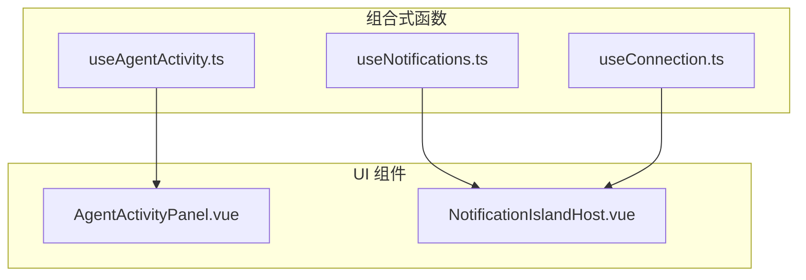
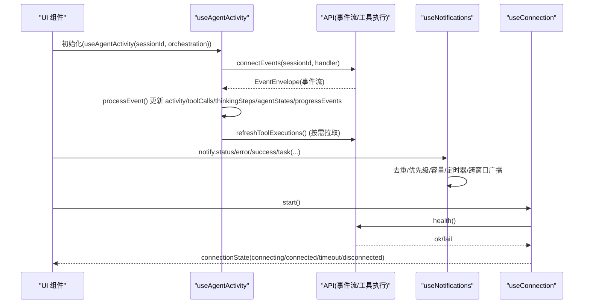
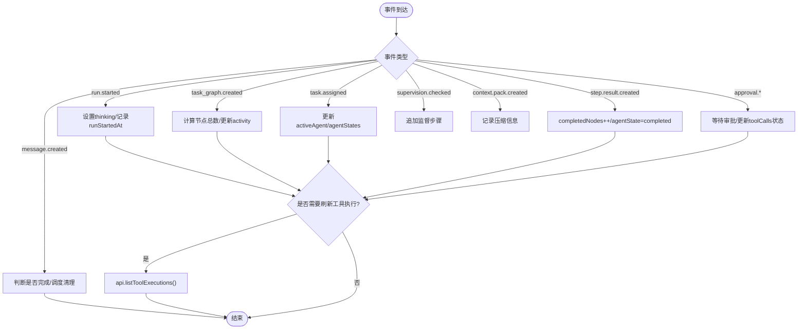
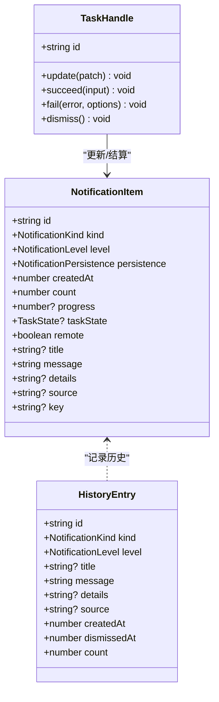
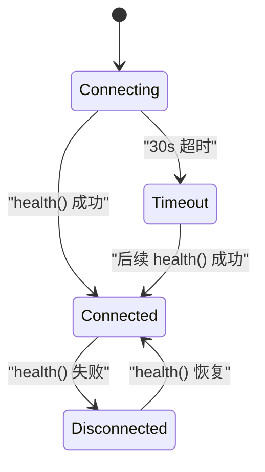
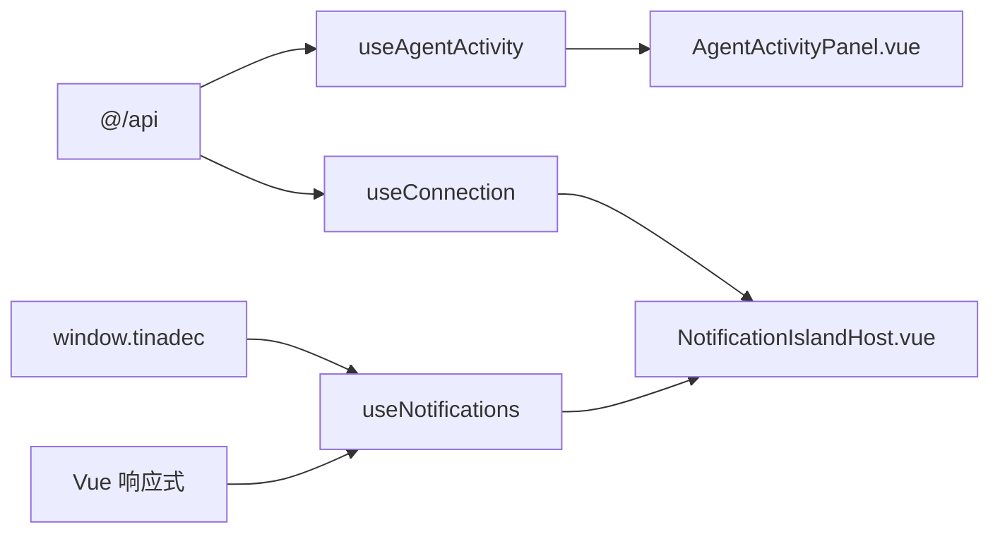

# 调试组合式函数

<cite>
**本文引用的文件**   
- [useAgentActivity.ts](file://apps/desktop/src/composables/useAgentActivity.ts)
- [useNotifications.ts](file://apps/desktop/src/composables/useNotifications.ts)
- [useConnection.ts](file://apps/desktop/src/composables/useConnection.ts)
- [NotificationIslandHost.vue](file://apps/desktop/src/components/NotificationIslandHost.vue)
- [AgentActivityPanel.vue](file://apps/desktop/src/components/AgentActivityPanel.vue)
- [useNotifications.test.ts](file://apps/desktop/src/composables/useNotifications.test.ts)
- [useConnection.test.ts](file://apps/desktop/src/composables/useConnection.test.ts)
</cite>

## 目录
1. [简介](#简介)
2. [项目结构](#项目结构)
3. [核心组件](#核心组件)
4. [架构总览](#架构总览)
5. [详细组件分析](#详细组件分析)
6. [依赖关系分析](#依赖关系分析)
7. [性能考量](#性能考量)
8. [故障排查指南](#故障排查指南)
9. [结论](#结论)
10. [附录：使用示例与最佳实践](#附录使用示例与最佳实践)

## 简介
本文件面向调试场景，系统性梳理并文档化三个关键的前端组合式函数（Composables）：
- useAgentActivity：Agent 活动监控、事件订阅、状态管理与清理优化
- useNotifications：通知系统，包含消息队列、优先级处理、跨窗口状态同步与用户交互
- useConnection：连接管理，包含重连机制、错误处理与状态同步

这些组合式函数为桌面端应用提供实时 Agent 运行可视化、统一的通知体验以及稳定的后端连接状态。

## 项目结构
- 组合式函数位于 apps/desktop/src/composables 目录
- 相关 UI 组件位于 apps/desktop/src/components
- 测试用例位于对应 .test.ts 文件中，覆盖行为契约与边界条件

图表来源
- [useAgentActivity.ts:151-696](file://apps/desktop/src/composables/useAgentActivity.ts#L151-L696)
- [useNotifications.ts:1-800](file://apps/desktop/src/composables/useNotifications.ts#L1-L800)
- [useConnection.ts:105-129](file://apps/desktop/src/composables/useConnection.ts#L105-L129)
- [AgentActivityPanel.vue:1-200](file://apps/desktop/src/components/AgentActivityPanel.vue#L1-L200)
- [NotificationIslandHost.vue:1-200](file://apps/desktop/src/components/NotificationIslandHost.vue#L1-L200)

章节来源
- [useAgentActivity.ts:151-696](file://apps/desktop/src/composables/useAgentActivity.ts#L151-L696)
- [useNotifications.ts:1-800](file://apps/desktop/src/composables/useNotifications.ts#L1-L800)
- [useConnection.ts:105-129](file://apps/desktop/src/composables/useConnection.ts#L105-L129)
- [AgentActivityPanel.vue:1-200](file://apps/desktop/src/components/AgentActivityPanel.vue#L1-L200)
- [NotificationIslandHost.vue:1-200](file://apps/desktop/src/components/NotificationIslandHost.vue#L1-L200)

## 核心组件
- useAgentActivity
  - 通过 SSE 事件流订阅编排运行、任务分配、步骤结果、监督、上下文包、审批请求/决定、消息创建等事件
  - 维护活动状态、工具调用列表、思考步骤、智能体状态、进度事件
  - 支持从编排快照增量更新状态，并在完成后定时清理
- useNotifications
  - 统一的“岛式”通知中心，支持 transient、status、task 三类通知
  - 内置去重、优先级排序、容量上限、历史环、跨窗口状态广播
  - 提供任务句柄、确认对话框、动作执行状态、悬停/展开交互
- useConnection
  - 启动时轮询健康检查，超时进入主界面，持续后台健康监视
  - 支持手动重试、幂等启动、状态机转换

章节来源
- [useAgentActivity.ts:151-696](file://apps/desktop/src/composables/useAgentActivity.ts#L151-L696)
- [useNotifications.ts:1-800](file://apps/desktop/src/composables/useNotifications.ts#L1-L800)
- [useConnection.ts:105-129](file://apps/desktop/src/composables/useConnection.ts#L105-L129)

## 架构总览

图表来源
- [useAgentActivity.ts:640-685](file://apps/desktop/src/composables/useAgentActivity.ts#L640-L685)
- [useNotifications.ts:433-483](file://apps/desktop/src/composables/useNotifications.ts#L433-L483)
- [useConnection.ts:105-129](file://apps/desktop/src/composables/useConnection.ts#L105-L129)

## 详细组件分析

### useAgentActivity：Agent 活动监控
- 事件订阅与处理
  - 通过 api.connectEvents 建立事件流，按事件类型分发到具体处理器
  - 支持 run.started、task_graph.created、task.assigned、step.result.created、supervision.checked、context.pack.created、approval.requested/approval.approved/approval.rejected、tool.shell.approval_required、message.created
- 状态管理
  - activity：运行状态、摘要、活跃智能体、节点完成数、更新时间
  - toolCalls：工具调用序列，含状态映射、审批关联、证据、风险等级
  - thinkingSteps：思考步骤，记录关键阶段与耗时
  - agentStates：各智能体的当前任务与状态
  - progressEvents：进度事件，限制长度避免内存增长
- 性能优化
  - 仅对特定事件触发 refreshToolExecutions，减少不必要拉取
  - 完成后延迟清理，避免频繁状态重置
  - 事件去重与切片限制（如 progressEvents 最多保留最近若干条）
- 编排快照增强
  - 根据 OrchestrationSnapshotDto 的 run/nodes/assignments 增量更新状态，保证一致性

图表来源
- [useAgentActivity.ts:490-530](file://apps/desktop/src/composables/useAgentActivity.ts#L490-L530)
- [useAgentActivity.ts:540-583](file://apps/desktop/src/composables/useAgentActivity.ts#L540-L583)
- [useAgentActivity.ts:585-638](file://apps/desktop/src/composables/useAgentActivity.ts#L585-L638)

章节来源
- [useAgentActivity.ts:151-696](file://apps/desktop/src/composables/useAgentActivity.ts#L151-L696)
- [AgentActivityPanel.vue:1-200](file://apps/desktop/src/components/AgentActivityPanel.vue#L1-L200)

### useNotifications：通知系统
- 消息队列与优先级
  - 两类区域：status（状态类，独立区）与 transient（临时反馈，聚合英雄+折叠计数）
  - 优先级：error > pending task > info/success；同优先级按时间倒序
  - 容量上限 MAX_ITEMS=50，优先淘汰低优先级可丢弃项，pending task 与 status 受保护
- 生命周期与持久性
  - transient：默认 auto 过期，可 sticky 常驻直到用户关闭
  - task：pending 期间不自动过期，settled 后转为 auto 过期
  - status：source-owned，由 key 唯一标识，永不自动过期，需显式 dismissByKey 或远端广播清除
- 去重与合并
  - 基于指纹（kind/level/title/message/key）合并重复通知，保持槽位与动画
- 跨窗口状态同步
  - 通过 window.tinadec 桥接 StatusBroadcast，本地 raise 广播，远程 apply 抑制回环
- 用户交互
  - 悬停展开卡片、点击打开详情、折叠堆栈、溢出面板、键盘 ESC 关闭
  - 动作执行状态跟踪，失败信息保留在通知上以便复用视图
- 历史与可访问性
  - 历史记录环形存储，最新在前，最多 50 条
  - aria-live 播报，区分 error 与一般消息

图表来源
- [useNotifications.ts:89-110](file://apps/desktop/src/composables/useNotifications.ts#L89-L110)
- [useNotifications.ts:125-136](file://apps/desktop/src/composables/useNotifications.ts#L125-L136)
- [useNotifications.ts:433-483](file://apps/desktop/src/composables/useNotifications.ts#L433-L483)

章节来源
- [useNotifications.ts:1-800](file://apps/desktop/src/composables/useNotifications.ts#L1-L800)
- [NotificationIslandHost.vue:1-200](file://apps/desktop/src/components/NotificationIslandHost.vue#L1-L200)
- [useNotifications.test.ts:1-694](file://apps/desktop/src/composables/useNotifications.test.ts#L1-L694)

### useConnection：连接管理
- 状态机
  - connecting：启动中，显示启动屏，轮询健康
  - connected：后端可达，隐藏启动屏
  - timeout：超过 30s 未连通，仍进入主界面
  - disconnected：已连接后健康探测失败
- 重连与健康监视
  - 首次健康探测失败则周期性 poll（1.5s），成功即标记 connected
  - 后台 watch 每 6s 探测一次，维持 connected/disconnected 切换
- 幂等性与资源清理
  - start() 只生效一次，避免重复轮询
  - 提供 __resetConnectionForTests 用于测试重置单例状态

图表来源
- [useConnection.ts:10-15](file://apps/desktop/src/composables/useConnection.ts#L10-L15)
- [useConnection.ts:48-71](file://apps/desktop/src/composables/useConnection.ts#L48-L71)
- [useConnection.ts:82-94](file://apps/desktop/src/composables/useConnection.ts#L82-L94)

章节来源
- [useConnection.ts:1-138](file://apps/desktop/src/composables/useConnection.ts#L1-138)
- [useConnection.test.ts:1-84](file://apps/desktop/src/composables/useConnection.test.ts#L1-L84)

## 依赖关系分析
- useAgentActivity
  - 依赖 @/api 的事件流与工具执行接口
  - 被 AgentActivityPanel 消费以渲染活动面板
- useNotifications
  - 依赖 Vue 响应式与全局 window.tinadec 进行跨窗口广播
  - 被 NotificationIslandHost 消费以渲染岛式通知中心
- useConnection
  - 依赖 @/api.health 进行健康探测
  - 被应用入口或启动页消费以控制启动屏与主界面切换

图表来源
- [useAgentActivity.ts:1-8](file://apps/desktop/src/composables/useAgentActivity.ts#L1-L8)
- [useNotifications.ts:1-10](file://apps/desktop/src/composables/useNotifications.ts#L1-L10)
- [useConnection.ts:1-3](file://apps/desktop/src/composables/useConnection.ts#L1-L3)
- [AgentActivityPanel.vue:1-30](file://apps/desktop/src/components/AgentActivityPanel.vue#L1-L30)
- [NotificationIslandHost.vue:1-30](file://apps/desktop/src/components/NotificationIslandHost.vue#L1-L30)

章节来源
- [useAgentActivity.ts:1-8](file://apps/desktop/src/composables/useAgentActivity.ts#L1-L8)
- [useNotifications.ts:1-10](file://apps/desktop/src/composables/useNotifications.ts#L1-L10)
- [useConnection.ts:1-3](file://apps/desktop/src/composables/useConnection.ts#L1-L3)
- [AgentActivityPanel.vue:1-30](file://apps/desktop/src/components/AgentActivityPanel.vue#L1-L30)
- [NotificationIslandHost.vue:1-30](file://apps/desktop/src/components/NotificationIslandHost.vue#L1-L30)

## 性能考量
- useAgentActivity
  - 事件处理器内只做必要的最小状态更新，避免全量重建
  - 工具执行拉取仅在相关事件发生时触发，且限制返回数量
  - 完成后延迟清理，降低频繁状态切换开销
- useNotifications
  - 去重与合并减少 DOM 抖动与动画闪烁
  - 容量上限防止内存泄漏，pending task/status 豁免淘汰策略
  - 定时器暂停/恢复机制确保用户注意力下的通知不被误关
- useConnection
  - 幂等启动避免重复轮询
  - 后台健康监视间隔较长，降低网络压力

[本节为通用指导，无需列出章节来源]

## 故障排查指南
- useAgentActivity
  - 若事件未更新：检查 sessionId 是否正确、SSE 连接是否建立、事件类型是否匹配处理器
  - 若工具执行列表为空：确认 refreshToolExecutions 是否在相关事件触发后被调用
  - 若状态未清理：检查 completed 分支是否触发 scheduleCleanup
- useNotifications
  - 若通知未消失：检查 persistence 是否为 sticky/source，或是否处于 pending task
  - 若跨窗口不同步：确认 window.tinadec 是否存在，applyStatusBroadcast 是否被调用
  - 若队列卡住：检查 off-screen 定时器是否仍在运行（不应暂停）
- useConnection
  - 若一直 connecting：检查 health() 是否可用、poll 是否启动、超时是否触发
  - 若状态异常切换：查看 markConnected/markDisconnected 的条件分支

章节来源
- [useAgentActivity.ts:640-685](file://apps/desktop/src/composables/useAgentActivity.ts#L640-L685)
- [useNotifications.ts:542-592](file://apps/desktop/src/composables/useNotifications.ts#L542-L592)
- [useConnection.ts:96-103](file://apps/desktop/src/composables/useConnection.ts#L96-L103)

## 结论
这三个组合式函数构成了调试与运行时可视化的核心能力：
- useAgentActivity 将复杂的 Agent 编排过程转化为直观的活动面板
- useNotifications 提供稳定、可预期、跨窗口的通知体验
- useConnection 保障应用在不同网络条件下的健壮性

它们共同提升了用户体验与可观测性，并为后续扩展提供了清晰的抽象边界。

[本节为总结，无需列出章节来源]

## 附录：使用示例与最佳实践

- useAgentActivity
  - 基本用法：传入 Ref<string | null> 的 sessionId 与可选的 orchestration Ref
  - 监听事件：组件内订阅返回的 activity/toolCalls/thinkingSteps/agentStates/progressEvents
  - 最佳实践：
    - 在会话切换时 reset 并重新 connect
    - 结合编排快照 enrichFromOrchestration 提升一致性
    - 避免在高频事件中做昂贵操作，必要时节流

- useNotifications
  - 基本用法：
    - n.notify.info/warning/error/success(...)
    - n.status.error({ key: 'backend-connection', message: '...' })
    - const task = n.notify.task({ message: 'deploying' }); task.succeed('done')
  - 最佳实践：
    - 使用 key 标识状态类通知，便于替换与清除
    - 对长任务使用 task 句柄，避免过早过期
    - 利用 isUserDismissible 判断关闭权限
    - 通过 setNotificationFallbackText 设置未知错误文案

- useConnection
  - 基本用法：const { connectionState, start, retryConnection } = useConnection(); await start()
  - 最佳实践：
    - 在应用启动时调用 start，并根据 connectionState 控制启动屏
    - 在 UI 提供重试按钮调用 retryConnection
    - 测试中使用 __resetConnectionForTests 重置单例状态

章节来源
- [useAgentActivity.ts:151-176](file://apps/desktop/src/composables/useAgentActivity.ts#L151-L176)
- [useNotifications.ts:433-483](file://apps/desktop/src/composables/useNotifications.ts#L433-L483)
- [useConnection.ts:105-129](file://apps/desktop/src/composables/useConnection.ts#L105-L129)
- [useNotifications.test.ts:1-694](file://apps/desktop/src/composables/useNotifications.test.ts#L1-L694)
- [useConnection.test.ts:1-84](file://apps/desktop/src/composables/useConnection.test.ts#L1-L84)