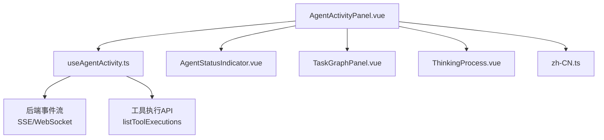
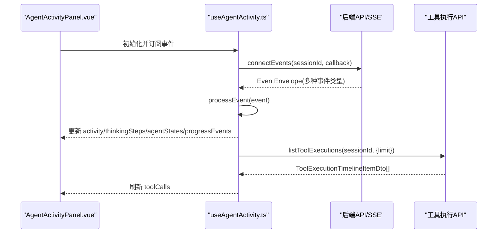
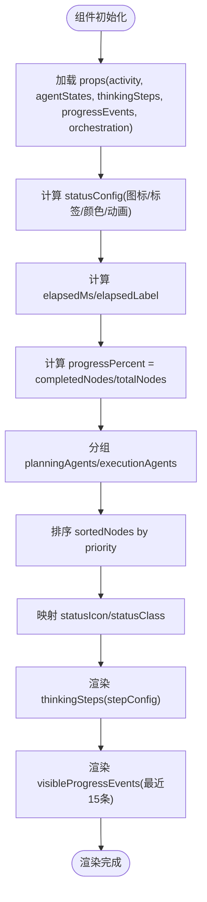
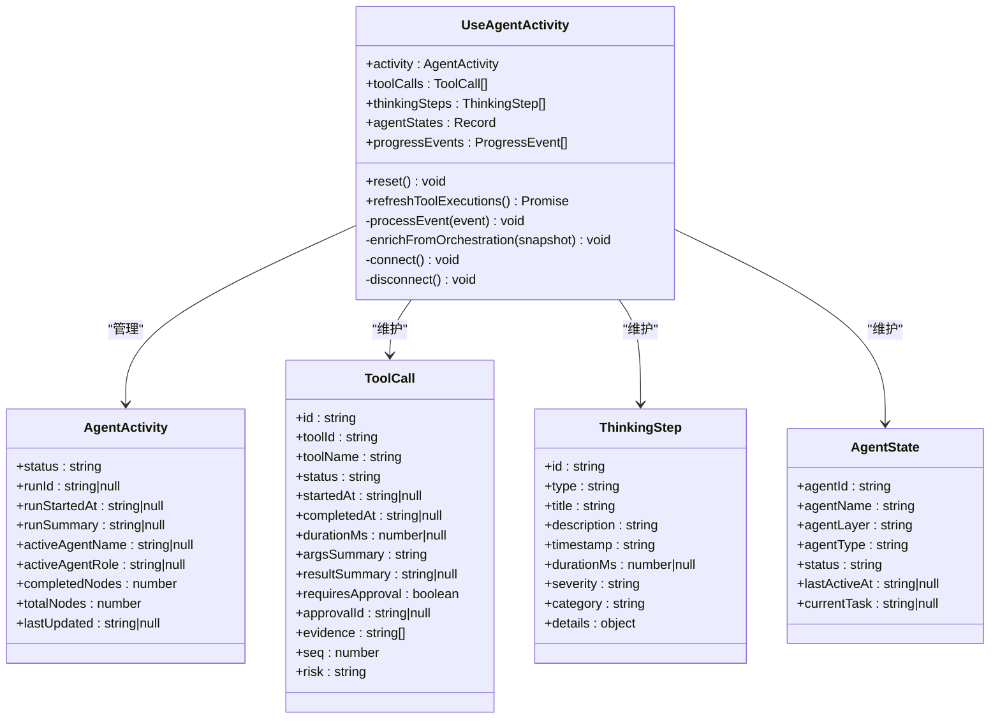
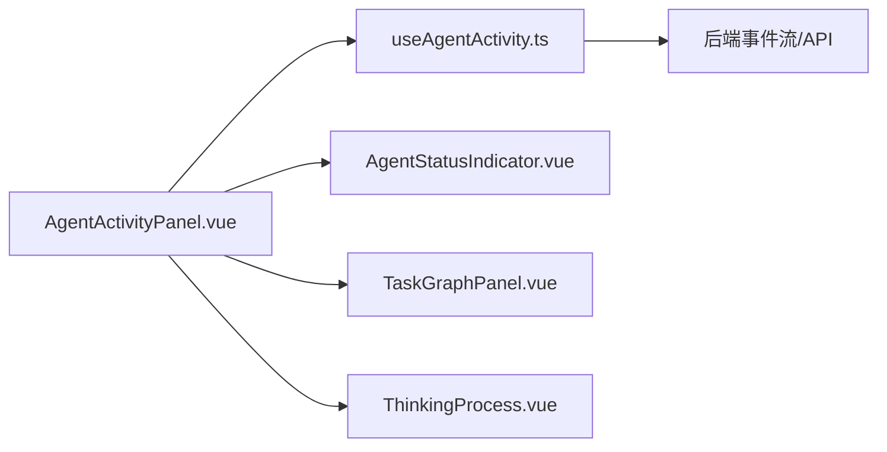

# Agent活动监控面板

<cite>
**本文引用的文件**   
- [AgentActivityPanel.vue](file://apps/desktop/src/components/AgentActivityPanel.vue)
- [useAgentActivity.ts](file://apps/desktop/src/composables/useAgentActivity.ts)
- [TaskGraphPanel.vue](file://apps/desktop/src/components/TaskGraphPanel.vue)
- [ThinkingProcess.vue](file://apps/desktop/src/components/chat/ThinkingProcess.vue)
- [AgentStatusIndicator.vue](file://apps/desktop/src/components/chat/AgentStatusIndicator.vue)
- [zh-CN.ts](file://apps/desktop/src/locales/zh-CN.ts)
</cite>

## 目录
1. [简介](#简介)
2. [项目结构](#项目结构)
3. [核心组件与能力](#核心组件与能力)
4. [架构总览](#架构总览)
5. [详细组件分析](#详细组件分析)
6. [依赖关系分析](#依赖关系分析)
7. [性能考量](#性能考量)
8. [故障排查指南](#故障排查指南)
9. [结论](#结论)
10. [附录](#附录)

## 简介
本文件为 Agent 活动监控面板的完整技术文档，围绕 AgentActivityPanel 组件及其相关能力进行系统化说明。内容涵盖：
- Agent 状态监控（thinking、working、waiting_approval、completed、error）的视觉表现与动画效果
- 任务图展示（优先级排序、状态图标映射、完成百分比计算）
- 思考步骤追踪（类型化步骤、时间格式化、持续时长）
- 实时活动流（最近事件滚动、图标映射、时间戳）
- Agent 分组显示（规划层与执行层）
- 进度计算逻辑与时间格式化
- 自定义样式扩展点与国际化支持

## 项目结构
Agent 活动监控面板由以下关键文件组成：
- 主面板组件：AgentActivityPanel.vue
- 数据与事件处理：useAgentActivity.ts
- 任务图子面板：TaskGraphPanel.vue
- 思考过程子面板：ThinkingProcess.vue
- 智能体状态指示器：AgentStatusIndicator.vue
- 国际化资源：zh-CN.ts

图表来源
- [AgentActivityPanel.vue:1-120](file://apps/desktop/src/components/AgentActivityPanel.vue#L1-L120)
- [useAgentActivity.ts:150-220](file://apps/desktop/src/composables/useAgentActivity.ts#L150-L220)

章节来源
- [AgentActivityPanel.vue:1-120](file://apps/desktop/src/components/AgentActivityPanel.vue#L1-L120)
- [useAgentActivity.ts:150-220](file://apps/desktop/src/composables/useAgentActivity.ts#L150-L220)

## 核心组件与能力
- AgentActivityPanel.vue：聚合展示 Agent 运行状态、任务图、思考步骤和实时活动流；提供折叠/展开交互、进度条、状态标签、动画效果。
- useAgentActivity.ts：维护运行时状态（activity、toolCalls、thinkingSteps、agentStates、progressEvents），订阅后端事件并更新 UI 数据。
- TaskGraphPanel.vue：独立的任务图展示组件，按优先级排序节点，显示状态图标与完成进度。
- ThinkingProcess.vue：独立的思考步骤展示组件，按类型渲染不同图标与颜色，支持时间格式化与持续时间显示。
- AgentStatusIndicator.vue：单个 Agent 的状态指示卡片，区分规划层与执行层，显示当前任务与状态标签。
- zh-CN.ts：中文本地化键值，覆盖面板标题、状态标签、步骤类型等文案。

章节来源
- [AgentActivityPanel.vue:1-120](file://apps/desktop/src/components/AgentActivityPanel.vue#L1-L120)
- [useAgentActivity.ts:150-220](file://apps/desktop/src/composables/useAgentActivity.ts#L150-L220)
- [TaskGraphPanel.vue:1-60](file://apps/desktop/src/components/TaskGraphPanel.vue#L1-L60)
- [ThinkingProcess.vue:1-70](file://apps/desktop/src/components/chat/ThinkingProcess.vue#L1-L70)
- [AgentStatusIndicator.vue:1-60](file://apps/desktop/src/components/chat/AgentStatusIndicator.vue#L1-L60)
- [zh-CN.ts:500-650](file://apps/desktop/src/locales/zh-CN.ts#L500-L650)

## 架构总览
Agent 活动监控面板采用“组件 + Composable”的解耦架构：
- 视图层（Vue 组件）负责渲染与交互
- 数据层（Composable）负责事件订阅、状态管理与数据转换
- 外部依赖通过 API 模块获取工具执行记录与事件流

图表来源
- [useAgentActivity.ts:640-680](file://apps/desktop/src/composables/useAgentActivity.ts#L640-L680)
- [AgentActivityPanel.vue:170-200](file://apps/desktop/src/components/AgentActivityPanel.vue#L170-L200)

章节来源
- [useAgentActivity.ts:640-680](file://apps/desktop/src/composables/useAgentActivity.ts#L640-L680)
- [AgentActivityPanel.vue:170-200](file://apps/desktop/src/components/AgentActivityPanel.vue#L170-L200)

## 详细组件分析

### AgentActivityPanel 组件分析
- 功能：聚合展示 Agent 运行状态、任务图、思考步骤、实时活动流
- 状态配置：根据 activity.status 动态选择图标、标签、颜色与动画（spin/pulse）
- 进度计算：基于 completedNodes/totalNodes 计算百分比
- 时间格式化：elapsedLabel 显示运行时长，formatTime/formatDuration 用于步骤元数据
- 分组显示：planningAgents 与 executionAgents 分别渲染
- 任务图：sortedNodes 按 priority 排序，statusIcon/statusClass 映射状态到图标与样式类
- 思考步骤：stepConfig 根据 type 映射图标、颜色与标签
- 实时活动流：visibleProgressEvents 保留最近 15 条，reverse 倒序显示

图表来源
- [AgentActivityPanel.vue:48-85](file://apps/desktop/src/components/AgentActivityPanel.vue#L48-L85)
- [AgentActivityPanel.vue:110-140](file://apps/desktop/src/components/AgentActivityPanel.vue#L110-L140)
- [AgentActivityPanel.vue:142-178](file://apps/desktop/src/components/AgentActivityPanel.vue#L142-L178)

章节来源
- [AgentActivityPanel.vue:48-85](file://apps/desktop/src/components/AgentActivityPanel.vue#L48-L85)
- [AgentActivityPanel.vue:110-140](file://apps/desktop/src/components/AgentActivityPanel.vue#L110-L140)
- [AgentActivityPanel.vue:142-178](file://apps/desktop/src/components/AgentActivityPanel.vue#L142-L178)

### useAgentActivity Composable 分析
- 状态管理：activity、toolCalls、thinkingSteps、agentStates、progressEvents
- 事件处理：processRunStarted、processTaskGraphCreated、processTaskAssigned、processStepResult、processSupervision、processContextPack、processApprovalRequested、processApprovalDecided、processShellApprovalRequired、processMessageCreated
- 工具执行刷新：refreshToolExecutions 调用 API 并映射 ToolCall 状态
- 编排快照增强：enrichFromOrchestration 同步 snapshot.run/nodes/assignments 到 activity 与 agentStates
- 连接管理：connect/disconnect 管理 SSE/WebSocket 生命周期

图表来源
- [useAgentActivity.ts:31-96](file://apps/desktop/src/composables/useAgentActivity.ts#L31-L96)
- [useAgentActivity.ts:155-176](file://apps/desktop/src/composables/useAgentActivity.ts#L155-L176)
- [useAgentActivity.ts:540-584](file://apps/desktop/src/composables/useAgentActivity.ts#L540-L584)

章节来源
- [useAgentActivity.ts:155-176](file://apps/desktop/src/composables/useAgentActivity.ts#L155-L176)
- [useAgentActivity.ts:540-584](file://apps/desktop/src/composables/useAgentActivity.ts#L540-L584)

### TaskGraphPanel 组件分析
- 功能：独立展示任务图，按优先级排序节点，显示状态图标与完成进度
- 进度计算：done/total/percent 基于 nodes 状态过滤
- 状态映射：statusIcon/statusClass 将节点状态映射为图标与样式类
- 交互：折叠/展开切换

章节来源
- [TaskGraphPanel.vue:31-60](file://apps/desktop/src/components/TaskGraphPanel.vue#L31-L60)

### ThinkingProcess 组件分析
- 功能：独立展示思考步骤，按类型渲染不同图标与颜色
- 时间格式化：formatTime 使用 locale 'zh-CN' 格式化时间
- 持续时间：formatDuration 支持毫秒/秒/分钟单位
- 交互：折叠/展开切换

章节来源
- [ThinkingProcess.vue:43-64](file://apps/desktop/src/components/chat/ThinkingProcess.vue#L43-L64)

### AgentStatusIndicator 组件分析
- 功能：单个 Agent 状态指示卡片，区分规划层与执行层
- 状态标签：active/waiting/completed/error/idle
- 层级标签：planning/execution/other
- 动画：dot-active/dot-waiting 脉冲动画

章节来源
- [AgentStatusIndicator.vue:12-53](file://apps/desktop/src/components/chat/AgentStatusIndicator.vue#L12-L53)

## 依赖关系分析
- AgentActivityPanel.vue 依赖 useAgentActivity.ts 提供的响应式数据
- AgentActivityPanel.vue 依赖 AgentStatusIndicator.vue 渲染 Agent 状态卡片
- AgentActivityPanel.vue 依赖 TaskGraphPanel.vue 或内联任务图逻辑
- AgentActivityPanel.vue 依赖 ThinkingProcess.vue 或内联思考步骤逻辑
- useAgentActivity.ts 依赖后端事件流（SSE/WebSocket）与工具执行 API

图表来源
- [AgentActivityPanel.vue:1-40](file://apps/desktop/src/components/AgentActivityPanel.vue#L1-L40)
- [useAgentActivity.ts:640-680](file://apps/desktop/src/composables/useAgentActivity.ts#L640-L680)

章节来源
- [AgentActivityPanel.vue:1-40](file://apps/desktop/src/components/AgentActivityPanel.vue#L1-L40)
- [useAgentActivity.ts:640-680](file://apps/desktop/src/composables/useAgentActivity.ts#L640-L680)

## 性能考量
- 事件去重：addProgressEvent 通过 id 去重，避免重复事件
- 列表限制：visibleProgressEvents 仅保留最近 15 条，减少渲染压力
- 工具执行刷新：refreshToolExecutions 仅在特定事件触发时调用，避免频繁请求
- 清理机制：scheduleCleanup 在完成后 30 秒自动重置状态，防止内存泄漏
- 动画优化：CSS 动画使用 transform/opacity，避免重排重绘

章节来源
- [useAgentActivity.ts:178-190](file://apps/desktop/src/composables/useAgentActivity.ts#L178-L190)
- [AgentActivityPanel.vue:198](file://apps/desktop/src/components/AgentActivityPanel.vue#L198)
- [useAgentActivity.ts:532-538](file://apps/desktop/src/composables/useAgentActivity.ts#L532-L538)

## 故障排查指南
- 事件未更新：检查 sessionId 是否正确，确认 connectEvents 已调用
- 工具执行未刷新：确认事件类型是否包含 tool./approval./step./task 前缀
- 状态异常：检查 enrichFromOrchestration 是否正确映射 snapshot 数据
- 国际化缺失：确认 zh-CN.ts 中对应 key 是否存在
- 样式问题：检查 CSS 变量（如 --accent-primary、--text-muted）是否正确定义

章节来源
- [useAgentActivity.ts:640-680](file://apps/desktop/src/composables/useAgentActivity.ts#L640-L680)
- [zh-CN.ts:500-650](file://apps/desktop/src/locales/zh-CN.ts#L500-L650)

## 结论
Agent 活动监控面板通过组件化与 Composable 模式实现了高内聚、低耦合的架构设计。其核心能力包括状态监控、任务图展示、思考步骤追踪与实时活动流，同时提供了丰富的可视化效果与交互体验。通过合理的性能优化与错误处理机制，确保了在高负载场景下的稳定性与响应性。

## 附录

### 状态配置与视觉表现
- thinking：紫色主题，旋转动画（spin）
- working：蓝色主题，脉冲动画（pulse）
- waiting_approval：黄色主题，静态图标
- completed：绿色主题，成功图标
- error：红色主题，错误图标

章节来源
- [AgentActivityPanel.vue:48-63](file://apps/desktop/src/components/AgentActivityPanel.vue#L48-L63)

### 任务节点优先级排序与状态图标映射
- 排序：按 node.priority 升序排列
- 状态映射：
  - done/completed → CircleCheck
  - running/in_progress/in-progress → CircleDot
  - failed/error/cancelled → CircleX
  - 其他 → Circle

章节来源
- [AgentActivityPanel.vue:110-131](file://apps/desktop/src/components/AgentActivityPanel.vue#L110-L131)
- [TaskGraphPanel.vue:31-52](file://apps/desktop/src/components/TaskGraphPanel.vue#L31-L52)

### 完成百分比计算
- 面板进度：progressPercent = (completedNodes / totalNodes) * 100
- 任务图进度：percent = (done / total) * 100

章节来源
- [AgentActivityPanel.vue:81-84](file://apps/desktop/src/components/AgentActivityPanel.vue#L81-L84)
- [TaskGraphPanel.vue:35-40](file://apps/desktop/src/components/TaskGraphPanel.vue#L35-L40)

### 时间格式化功能
- 运行时长：elapsedLabel 显示分钟+秒
- 步骤时间：formatTime 使用 'zh-CN' 本地化
- 持续时间：formatDuration 支持 ms/s/min 单位

章节来源
- [AgentActivityPanel.vue:65-79](file://apps/desktop/src/components/AgentActivityPanel.vue#L65-L79)
- [AgentActivityPanel.vue:161-177](file://apps/desktop/src/components/AgentActivityPanel.vue#L161-L177)
- [ThinkingProcess.vue:43-63](file://apps/desktop/src/components/chat/ThinkingProcess.vue#L43-L63)

### 自定义样式扩展点
- CSS 变量：--accent-primary、--text-muted、--surface-raised 等
- 状态类：status-thinking、status-working、status-waiting、status-completed、status-error
- 步骤类型类：step-run、step-graph、step-assign、step-supervision、step-context、step-result
- 严重级别类：severity-info、severity-warning、severity-critical、severity-error

章节来源
- [AgentActivityPanel.vue:435-588](file://apps/desktop/src/components/AgentActivityPanel.vue#L435-L588)
- [AgentActivityPanel.vue:870-977](file://apps/desktop/src/components/AgentActivityPanel.vue#L870-L977)

### 国际化支持说明
- 使用 vue-i18n 的 t() 函数获取本地化文本
- 中文键值定义在 zh-CN.ts 中
- 支持的键包括：agent.thinking、agent.working、agent.waitingApproval、agent.completed、agent.error 等

章节来源
- [AgentActivityPanel.vue:27-63](file://apps/desktop/src/components/AgentActivityPanel.vue#L27-L63)
- [zh-CN.ts:500-650](file://apps/desktop/src/locales/zh-CN.ts#L500-L650)