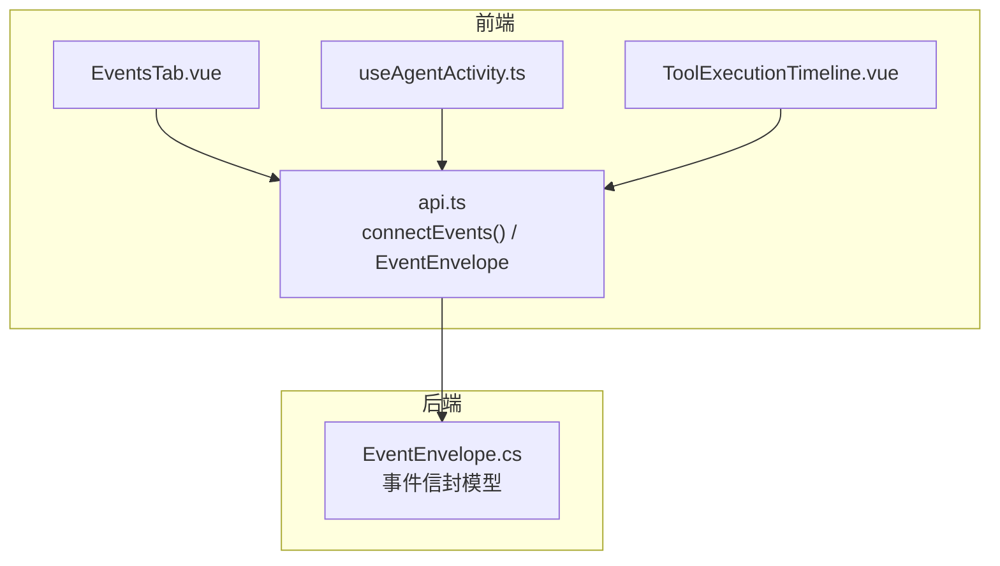
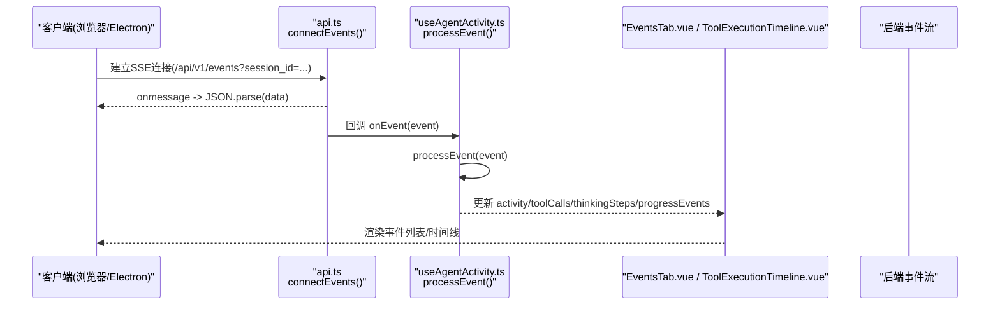
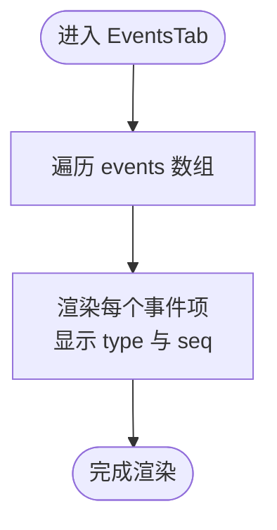
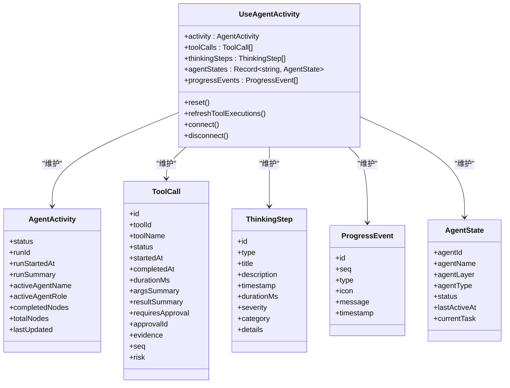
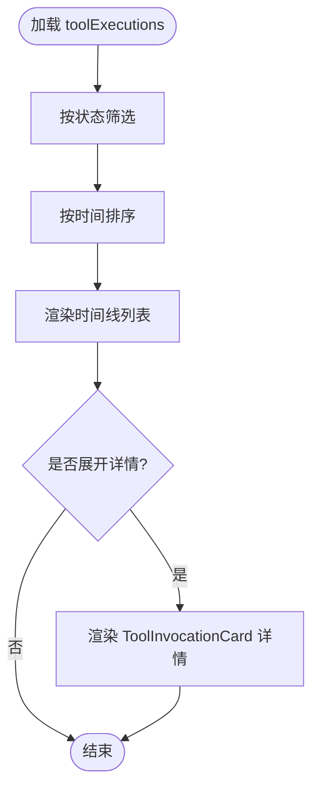
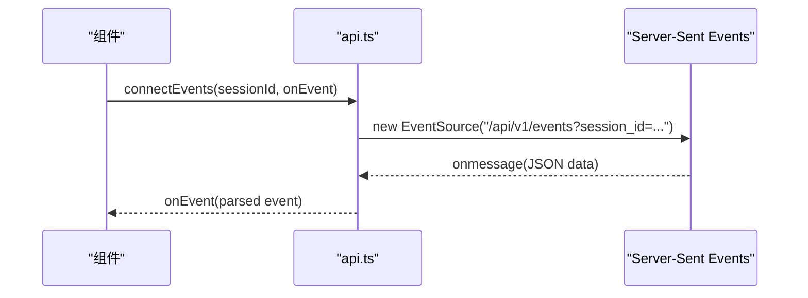
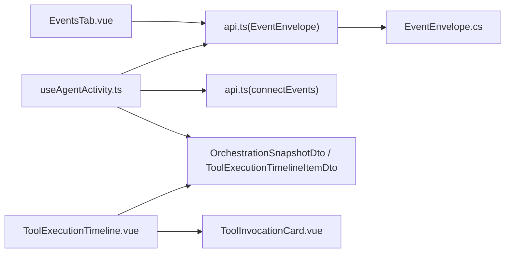

# 事件追踪标签页

<cite>
**本文引用的文件**
- [EventsTab.vue](file://apps/desktop/src/components/EventsTab.vue)
- [api.ts](file://apps/desktop/src/api.ts)
- [useAgentActivity.ts](file://apps/desktop/src/composables/useAgentActivity.ts)
- [ToolExecutionTimeline.vue](file://apps/desktop/src/components/tools/ToolExecutionTimeline.vue)
- [EventEnvelope.cs](file://TinadecCore/Contracts/Events/EventEnvelope.cs)
</cite>

## 目录
1. [简介](#简介)
2. [项目结构](#项目结构)
3. [核心组件](#核心组件)
4. [架构总览](#架构总览)
5. [详细组件分析](#详细组件分析)
6. [依赖关系分析](#依赖关系分析)
7. [性能考量](#性能考量)
8. [故障排查指南](#故障排查指南)
9. [结论](#结论)
10. [附录](#附录)

## 简介
本文件为“事件追踪标签页”的综合文档，聚焦于 EventsTab 组件的事件收集、存储与展示机制。内容涵盖：
- 事件类型分类与时间线视图
- 筛选过滤与搜索能力
- 实时接收（SSE）处理、持久化策略与性能优化
- 事件详情查看、导出能力
- 事件格式规范、自定义事件扩展方法与调试工具集成
- 监控最佳实践与故障排查

## 项目结构
事件追踪相关的前端实现主要位于桌面应用前端代码中，包括：
- 事件数据模型定义（TypeScript 接口）
- 事件实时接入（SSE）封装
- 事件处理组合式函数（状态管理、事件分发）
- 事件展示组件（基础列表、工具执行时间线）

图表来源
- [EventsTab.vue:1-19](file://apps/desktop/src/components/EventsTab.vue#L1-L19)
- [api.ts:274-285](file://apps/desktop/src/api.ts#L274-L285)
- [api.ts:1310-1328](file://apps/desktop/src/api.ts#L1310-L1328)
- [EventEnvelope.cs:1-33](file://TinadecCore/Contracts/Events/EventEnvelope.cs#L1-L33)

章节来源
- [EventsTab.vue:1-19](file://apps/desktop/src/components/EventsTab.vue#L1-L19)
- [api.ts:274-285](file://apps/desktop/src/api.ts#L274-L285)
- [api.ts:1310-1328](file://apps/desktop/src/api.ts#L1310-L1328)
- [EventEnvelope.cs:1-33](file://TinadecCore/Contracts/Events/EventEnvelope.cs#L1-L33)

## 核心组件
- EventsTab.vue：事件列表展示的最小单元，按序列号与类型渲染事件条目。
- useAgentActivity.ts：事件订阅、解析与状态聚合的核心逻辑，负责将 SSE 事件映射到运行状态、思考步骤、工具调用等结构化数据。
- ToolExecutionTimeline.vue：工具执行时间线视图，提供筛选、排序、展开详情等交互。
- api.ts：事件类型定义与 SSE 连接封装，统一事件通道。

章节来源
- [EventsTab.vue:1-19](file://apps/desktop/src/components/EventsTab.vue#L1-L19)
- [useAgentActivity.ts:1-697](file://apps/desktop/src/composables/useAgentActivity.ts#L1-L697)
- [ToolExecutionTimeline.vue:1-646](file://apps/desktop/src/components/tools/ToolExecutionTimeline.vue#L1-L646)
- [api.ts:274-285](file://apps/desktop/src/api.ts#L274-L285)
- [api.ts:1310-1328](file://apps/desktop/src/api.ts#L1310-L1328)

## 架构总览
事件从后端通过 Server-Sent Events（SSE）推送至前端，前端在 api.ts 中建立连接并分发到 useAgentActivity.ts 进行解析与状态更新，最终由 EventsTab.vue 与 ToolExecutionTimeline.vue 呈现。

图表来源
- [api.ts:1310-1328](file://apps/desktop/src/api.ts#L1310-L1328)
- [useAgentActivity.ts:490-530](file://apps/desktop/src/composables/useAgentActivity.ts#L490-L530)

## 详细组件分析

### EventsTab.vue：事件列表展示
- 输入：接收来自父组件的 events 数组（类型为 EventEnvelope）。
- 展示：以有序列表形式渲染每个事件的 type 与 seq。
- 扩展点：可在此组件基础上增加搜索框、类型筛选、时间范围过滤、详情弹窗等。

章节来源
- [EventsTab.vue:1-19](file://apps/desktop/src/components/EventsTab.vue#L1-L19)

### useAgentActivity.ts：事件处理与状态聚合
- 事件订阅：通过 api.connectEvents 建立 SSE 连接，监听多种事件类型。
- 事件分发：processEvent 根据 event.type 分派到对应处理器（如 run.started、task_graph.created、step.result.created 等）。
- 状态管理：维护 activity（运行状态）、toolCalls（工具调用）、thinkingSteps（思考步骤）、agentStates（智能体状态）、progressEvents（进度事件）。
- 数据增强：结合编排快照（OrchestrationSnapshotDto）补充节点数量、完成度等信息。
- 工具调用刷新：对特定事件触发 refreshToolExecutions，拉取最新工具执行记录。

图表来源
- [useAgentActivity.ts:31-96](file://apps/desktop/src/composables/useAgentActivity.ts#L31-L96)
- [useAgentActivity.ts:151-176](file://apps/desktop/src/composables/useAgentActivity.ts#L151-L176)
- [useAgentActivity.ts:490-530](file://apps/desktop/src/composables/useAgentActivity.ts#L490-L530)
- [useAgentActivity.ts:540-565](file://apps/desktop/src/composables/useAgentActivity.ts#L540-L565)

章节来源
- [useAgentActivity.ts:1-697](file://apps/desktop/src/composables/useAgentActivity.ts#L1-L697)

### ToolExecutionTimeline.vue：工具执行时间线视图
- 功能：展示工具执行记录，支持按状态筛选（全部、成功、失败、审批、运行中），按时间排序，展开查看详细信息。
- 数据来源：通过 props 接收 ToolExecutionTimelineItemDto 数组。
- 交互：点击行展开详情，内部使用 ToolInvocationCard 组件展示更丰富的信息。

章节来源
- [ToolExecutionTimeline.vue:1-646](file://apps/desktop/src/components/tools/ToolExecutionTimeline.vue#L1-L646)

### api.ts：事件类型与 SSE 连接
- 事件类型定义：EventEnvelope 包含版本、类型、请求ID、会话ID、追踪ID、序列号、时间戳、能力集、负载与错误信息等字段。
- SSE 连接：connectEvents 方法建立到 /api/v1/events 的连接，支持 session_id 参数，并对多种事件类型注册监听器。

图表来源
- [api.ts:274-285](file://apps/desktop/src/api.ts#L274-L285)
- [api.ts:1310-1328](file://apps/desktop/src/api.ts#L1310-L1328)

章节来源
- [api.ts:274-285](file://apps/desktop/src/api.ts#L274-L285)
- [api.ts:1310-1328](file://apps/desktop/src/api.ts#L1310-L1328)

### EventEnvelope.cs：后端事件信封模型
- 字段说明：Version、EventId、EventType、Timestamp、SessionId、RunId、Payload 等，采用 snake_case 序列化约定。
- 用途：作为前后端事件传输的统一契约，确保事件结构与兼容性。

章节来源
- [EventEnvelope.cs:1-33](file://TinadecCore/Contracts/Events/EventEnvelope.cs#L1-L33)

## 依赖关系分析
- EventsTab.vue 依赖 api.ts 中的 EventEnvelope 类型用于 props 校验。
- useAgentActivity.ts 依赖 api.ts 的 connectEvents 与 EventEnvelope 类型，同时依赖 OrchestrationSnapshotDto、ToolExecutionTimelineItemDto 等 DTO。
- ToolExecutionTimeline.vue 依赖 ToolExecutionTimelineItemDto 类型与 ToolInvocationCard 子组件。
- 后端 EventEnvelope.cs 定义了事件信封的结构，前端与之保持契约一致。

图表来源
- [EventsTab.vue:1-19](file://apps/desktop/src/components/EventsTab.vue#L1-L19)
- [api.ts:274-285](file://apps/desktop/src/api.ts#L274-L285)
- [api.ts:1310-1328](file://apps/desktop/src/api.ts#L1310-L1328)
- [useAgentActivity.ts:1-697](file://apps/desktop/src/composables/useAgentActivity.ts#L1-L697)
- [ToolExecutionTimeline.vue:1-646](file://apps/desktop/src/components/tools/ToolExecutionTimeline.vue#L1-L646)
- [EventEnvelope.cs:1-33](file://TinadecCore/Contracts/Events/EventEnvelope.cs#L1-L33)

章节来源
- [EventsTab.vue:1-19](file://apps/desktop/src/components/EventsTab.vue#L1-L19)
- [api.ts:274-285](file://apps/desktop/src/api.ts#L274-L285)
- [api.ts:1310-1328](file://apps/desktop/src/api.ts#L1310-L1328)
- [useAgentActivity.ts:1-697](file://apps/desktop/src/composables/useAgentActivity.ts#L1-L697)
- [ToolExecutionTimeline.vue:1-646](file://apps/desktop/src/components/tools/ToolExecutionTimeline.vue#L1-L646)
- [EventEnvelope.cs:1-33](file://TinadecCore/Contracts/Events/EventEnvelope.cs#L1-L33)

## 性能考量
- 事件去重与限流：useAgentActivity.ts 中对 progressEvents 做了去重与长度限制（保留最近若干条），避免内存膨胀。
- 增量更新：仅对关键事件（工具、审批、步骤、任务）触发工具执行记录的刷新，减少不必要的网络请求。
- 渲染优化：ToolExecutionTimeline.vue 使用计算属性进行筛选与排序，避免每次渲染重复计算；事件列表按需展开详情。
- 资源清理：组件卸载时断开 SSE 连接并清理定时器，防止内存泄漏。

章节来源
- [useAgentActivity.ts:178-190](file://apps/desktop/src/composables/useAgentActivity.ts#L178-L190)
- [useAgentActivity.ts:540-565](file://apps/desktop/src/composables/useAgentActivity.ts#L540-L565)
- [ToolExecutionTimeline.vue:91-99](file://apps/desktop/src/components/tools/ToolExecutionTimeline.vue#L91-L99)
- [useAgentActivity.ts:682-685](file://apps/desktop/src/composables/useAgentActivity.ts#L682-L685)

## 故障排查指南
- 连接失败：检查 api.ts 中 gatewayUrl 配置与网络连通性；确认 /api/v1/events 路径可用。
- 事件未到达：确认 connectEvents 是否正确注册 onmessage 与各事件类型监听器；检查 session_id 参数传递。
- 状态不同步：核对 processEvent 的分发逻辑与对应处理器是否覆盖所有事件类型；检查编排快照增强逻辑 enrichFromOrchestration。
- 工具执行记录不更新：确认触发 refreshToolExecutions 的事件条件是否满足；检查 listToolExecutions 接口返回数据。
- 内存增长：检查 progressEvents 的长度限制与去重逻辑；确保组件卸载时正确断开连接与清理定时器。

章节来源
- [api.ts:945-979](file://apps/desktop/src/api.ts#L945-L979)
- [api.ts:1310-1328](file://apps/desktop/src/api.ts#L1310-L1328)
- [useAgentActivity.ts:490-530](file://apps/desktop/src/composables/useAgentActivity.ts#L490-L530)
- [useAgentActivity.ts:585-638](file://apps/desktop/src/composables/useAgentActivity.ts#L585-L638)
- [useAgentActivity.ts:656-661](file://apps/desktop/src/composables/useAgentActivity.ts#L656-L661)

## 结论
事件追踪标签页通过 SSE 实现实时事件接收，结合 useAgentActivity.ts 的状态管理与 ToolExecutionTimeline.vue 的时间线视图，提供了完整的事件收集、展示与交互能力。未来可在 EventsTab.vue 上扩展搜索与筛选功能，并在 useAgentActivity.ts 中完善更多事件类型的处理逻辑，以提升可观测性与用户体验。

## 附录

### 事件格式规范（EventEnvelope）
- 版本：v（字符串）
- 类型：type（字符串）
- 请求ID：request_id（字符串）
- 会话ID：session_id（可选字符串）
- 追踪ID：trace_id（字符串）
- 序列号：seq（数字）
- 时间戳：ts（字符串 ISO 时间）
- 能力集：capabilities（字符串数组）
- 负载：payload（可选对象）
- 错误：error（可选对象，含 code、message、detail）

章节来源
- [api.ts:274-285](file://apps/desktop/src/api.ts#L274-L285)

### 自定义事件类型的扩展方法
- 在 api.ts 的 connectEvents 中添加新的 addEventListener 监听器，绑定新的事件类型。
- 在 useAgentActivity.ts 的 processEvent 中新增 case 分支，编写对应的处理器函数。
- 如需持久化，可在处理器中将事件写入本地存储或调用后端接口保存。

章节来源
- [api.ts:1310-1328](file://apps/desktop/src/api.ts#L1310-L1328)
- [useAgentActivity.ts:490-530](file://apps/desktop/src/composables/useAgentActivity.ts#L490-L530)

### 调试工具集成建议
- 在浏览器控制台打印事件流，便于观察事件到达顺序与内容。
- 使用 Network 面板检查 SSE 连接状态与响应头。
- 在 useAgentActivity.ts 中添加日志输出，跟踪状态变更与数据处理流程。

[本节为通用指导，不直接分析具体文件]

### 事件监控最佳实践
- 合理设置事件去重与长度限制，避免内存占用过高。
- 对关键事件进行异步刷新，降低主线程阻塞风险。
- 组件生命周期内正确管理连接与定时器，防止资源泄漏。
- 对错误事件进行捕获与上报，提升问题定位效率。

[本节为通用指导，不直接分析具体文件]