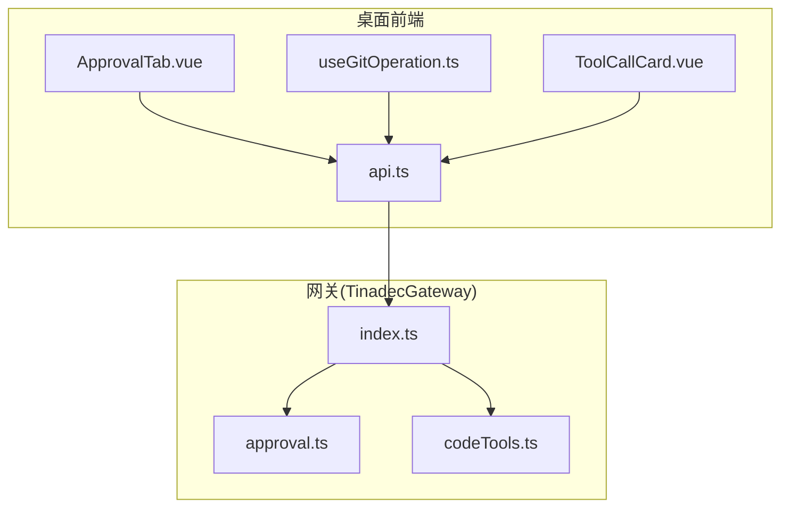
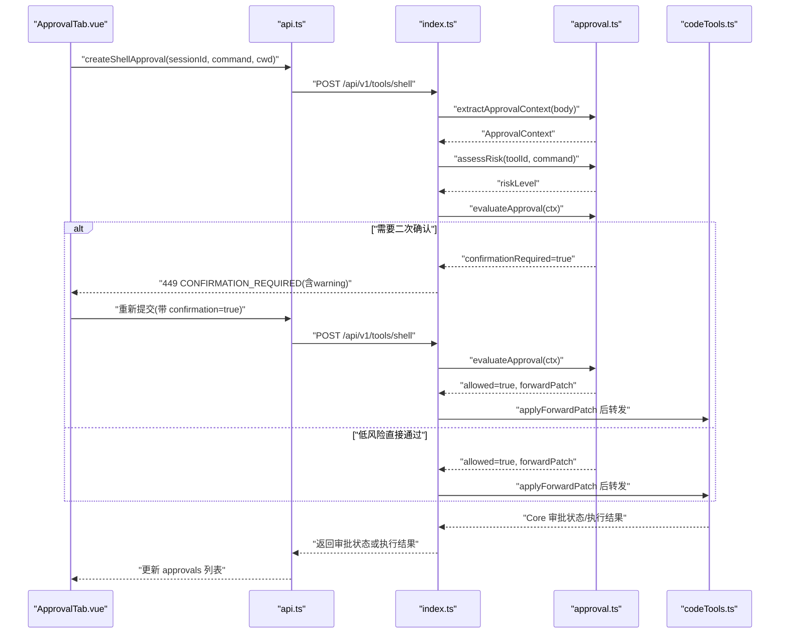
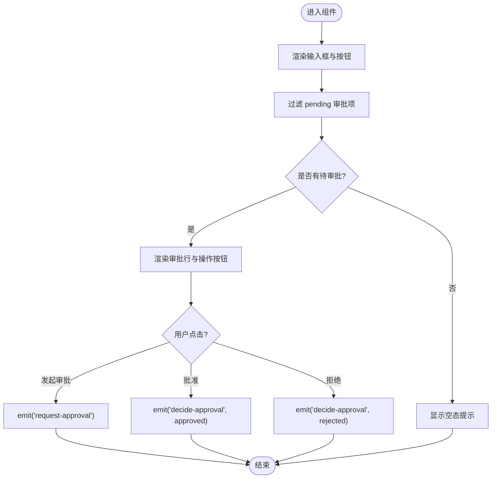
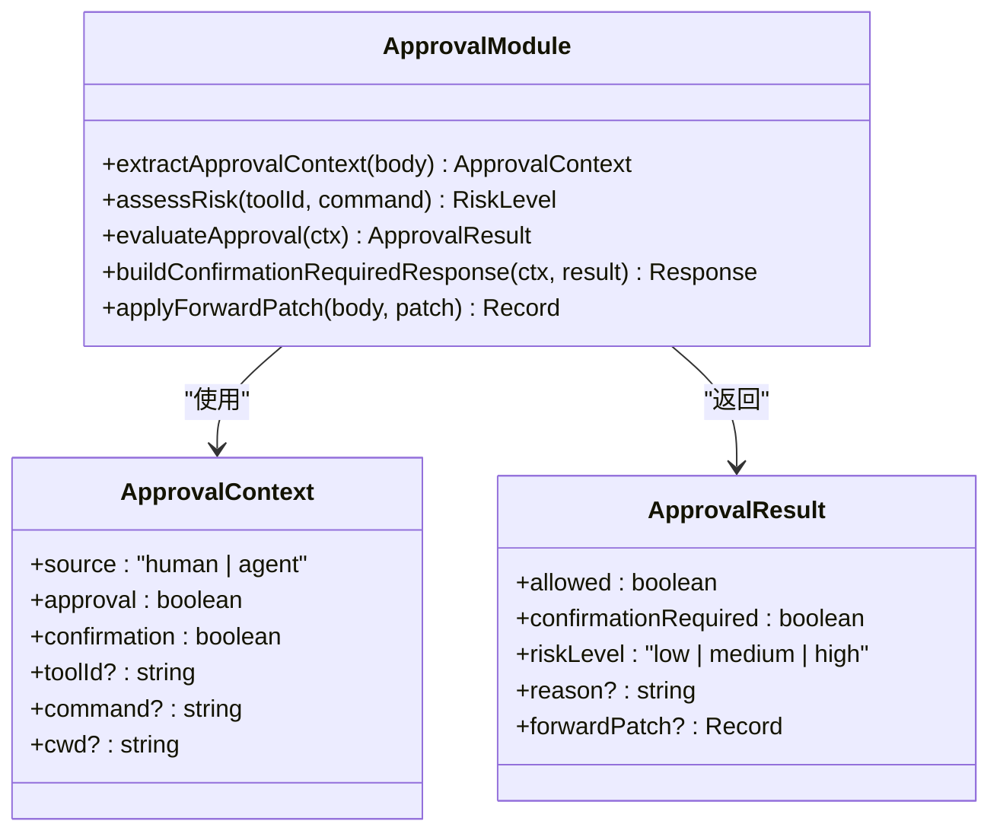
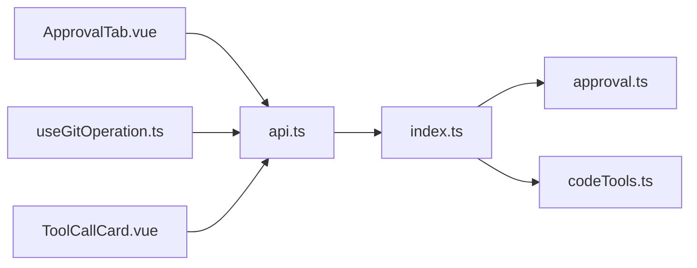

# 审批管理标签页

<cite>
**本文引用的文件**   
- [ApprovalTab.vue](file://apps/desktop/src/components/ApprovalTab.vue)
- [api.ts](file://apps/desktop/src/api.ts)
- [useGitOperation.ts](file://apps/desktop/src/composables/useGitOperation.ts)
- [approval.ts](file://TinadecGateway/src/approval.ts)
- [codeTools.ts](file://TinadecGateway/src/codeTools.ts)
- [index.ts](file://TinadecGateway/src/index.ts)
- [ToolCallCard.vue](file://apps/desktop/src/components/chat/ToolCallCard.vue)
</cite>

## 目录
1. [简介](#简介)
2. [项目结构](#项目结构)
3. [核心组件](#核心组件)
4. [架构总览](#架构总览)
5. [详细组件分析](#详细组件分析)
6. [依赖关系分析](#依赖关系分析)
7. [性能考虑](#性能考虑)
8. [故障排查指南](#故障排查指南)
9. [结论](#结论)
10. [附录](#附录)

## 简介
本文件围绕“审批管理标签页”展开，聚焦 ApprovalTab 组件的审批流程管理能力，包括待审批事项列表、审批决策处理与审批历史记录。文档同时说明审批状态的实时更新机制、批量操作能力、审批规则配置，以及与审批门控系统的集成方式、权限控制与安全验证机制。此外，还涵盖审批通知、审计日志与合规性检查的实现要点，并提供自定义审批流程的配置方法与扩展点说明，帮助读者快速理解并扩展该功能。

## 项目结构
审批管理标签页位于桌面应用前端（Vue + TypeScript），通过 API 层与后端交互；网关侧提供审批拦截器与风险评估逻辑，确保高风险操作的二次确认与人类/Agent 来源区分。关键文件分布如下：
- 前端 UI：ApprovalTab.vue 负责展示待审批项与用户决策
- 前端数据模型与接口：api.ts 定义 ApprovalDto、创建与决策接口
- 业务编排：useGitOperation.ts 在 Git 操作中触发审批请求与状态跟踪
- 网关审批拦截：approval.ts 实现风险评估、二次确认与透传补丁
- 工具调用集成：codeTools.ts 将 Core 审批状态映射到执行结果
- 网关入口：index.ts 对审批相关响应进行统一处理
- 聊天卡片审批：ToolCallCard.vue 提供工具调用的审批按钮

图表来源 
- [ApprovalTab.vue:1-58](file://apps/desktop/src/components/ApprovalTab.vue#L1-L58)
- [api.ts:25-43](file://apps/desktop/src/api.ts#L25-L43)
- [useGitOperation.ts:160-359](file://apps/desktop/src/composables/useGitOperation.ts#L160-L359)
- [approval.ts:1-235](file://TinadecGateway/src/approval.ts#L1-L235)
- [codeTools.ts:320-388](file://TinadecGateway/src/codeTools.ts#L320-L388)
- [index.ts:90-110](file://TinadecGateway/src/index.ts#L90-L110)

章节来源
- [ApprovalTab.vue:1-58](file://apps/desktop/src/components/ApprovalTab.vue#L1-L58)
- [api.ts:25-43](file://apps/desktop/src/api.ts#L25-L43)
- [useGitOperation.ts:160-359](file://apps/desktop/src/composables/useGitOperation.ts#L160-L359)
- [approval.ts:1-235](file://TinadecGateway/src/approval.ts#L1-L235)
- [codeTools.ts:320-388](file://TinadecGateway/src/codeTools.ts#L320-L388)
- [index.ts:90-110](file://TinadecGateway/src/index.ts#L90-L110)

## 核心组件
- ApprovalTab 组件
  - 输入属性：approvals（待审批列表）、shellCommand（命令输入框）、busy（忙碌态）、selectedSessionId（当前会话）
  - 事件输出：request-approval（发起审批）、decide-approval（批准/拒绝）、update:shellCommand（命令更新）
  - 过滤逻辑：仅展示 status 为 pending 的审批项
- API 数据模型
  - ApprovalDto：包含 id、session_id、kind、summary、command、cwd、status、created_at、decided_at
  - CreateApprovalInput：用于创建审批请求
- 业务编排 useGitOperation
  - 维护多个审批 ID 与对应动作（stage/unstage/commit/pull/fetch/merge/rebase/branch/worktree 等）
  - 计算是否可发起审批与是否可决策（基于 status === 'pending'）
- 网关审批拦截 approval.ts
  - 提取上下文 extractApprovalContext
  - 风险评估 assessRisk（按 toolId/command 判定 low/medium/high）
  - 评估策略 evaluateApproval（人类/Agent 来源、二次确认 confirmation）
  - 构建确认响应 buildConfirmationRequiredResponse（返回 449 及警告信息）
  - 合并透传补丁 applyForwardPatch

章节来源
- [ApprovalTab.vue:1-58](file://apps/desktop/src/components/ApprovalTab.vue#L1-L58)
- [api.ts:25-43](file://apps/desktop/src/api.ts#L25-L43)
- [useGitOperation.ts:160-359](file://apps/desktop/src/composables/useGitOperation.ts#L160-L359)
- [approval.ts:91-197](file://TinadecGateway/src/approval.ts#L91-L197)

## 架构总览
审批流程贯穿前端 UI、API 层、网关审批拦截与工具执行。整体时序如下：

图表来源 
- [ApprovalTab.vue:1-58](file://apps/desktop/src/components/ApprovalTab.vue#L1-L58)
- [api.ts:1039-1049](file://apps/desktop/src/api.ts#L1039-L1049)
- [index.ts:90-110](file://TinadecGateway/src/index.ts#L90-L110)
- [approval.ts:91-197](file://TinadecGateway/src/approval.ts#L91-L197)
- [codeTools.ts:320-388](file://TinadecGateway/src/codeTools.ts#L320-L388)

## 详细组件分析

### ApprovalTab 组件分析
- 功能职责
  - 展示待审批事项列表（仅 status=pending）
  - 提供命令输入框与“发起审批”按钮
  - 支持单条审批的批准/拒绝决策
- 交互事件
  - request-approval：由父组件监听并调用 createShellApproval
  - decide-approval：由父组件监听并调用 decideApproval
  - update:shellCommand：双向绑定命令文本
- 渲染与空态
  - 无待审批时显示“暂无审批”提示

图表来源 
- [ApprovalTab.vue:21-56](file://apps/desktop/src/components/ApprovalTab.vue#L21-L56)

章节来源
- [ApprovalTab.vue:1-58](file://apps/desktop/src/components/ApprovalTab.vue#L1-L58)

### API 数据模型与接口
- ApprovalDto
  - 字段：id、session_id、kind、summary、command、cwd、status、created_at、decided_at
- CreateApprovalInput
  - 字段：session_id、kind、summary、command、cwd
- 接口方法
  - listApprovals：获取审批列表
  - createApproval：创建审批
  - decideApproval：对指定审批做出批准/拒绝决策
  - createShellApproval：发起 Shell 审批（供 ApprovalTab 使用）

章节来源
- [api.ts:25-43](file://apps/desktop/src/api.ts#L25-L43)
- [api.ts:1039-1049](file://apps/desktop/src/api.ts#L1039-L1049)

### 业务编排 useGitOperation
- 审批跟踪
  - 维护各操作的审批 ID（如 indexApprovalId、commitApprovalId、pushApprovalId 等）
  - 通过 computed 查找对应审批项并判断 canDecide*（status === 'pending'）
- 审批触发
  - 针对 stage/unstage/commit/pull/fetch/merge/rebase/branch/worktree 等操作，封装 request*Approval 函数
  - 调用 api.createShellApproval 或相应接口，并将新审批注入 approvals 列表
- 结果反馈
  - mutationCompleted 根据执行结果发出成功/警告通知

章节来源
- [useGitOperation.ts:160-359](file://apps/desktop/src/composables/useGitOperation.ts#L160-L359)

### 网关审批拦截 approval.ts
- 上下文提取
  - extractApprovalContext：从请求体解析 source、approval、confirmation、toolId、command、cwd
- 风险评估
  - assessRisk：依据 toolId 与 command 文本判定 riskLevel（low/medium/high）
- 评估策略
  - evaluateApproval：
    - Agent 请求不拦截，交由 Core 审批门
    - 人类请求必须携带 approval=true，否则拒绝
    - 低/中风险直接通过，高风险需 confirmation=true
- 响应构建
  - buildConfirmationRequiredResponse：返回 449 状态码与警告信息，驱动 UI 弹窗
- 补丁合并
  - applyForwardPatch：将审批标记与来源信息合并到请求体

图表来源 
- [approval.ts:22-48](file://TinadecGateway/src/approval.ts#L22-L48)
- [approval.ts:91-197](file://TinadecGateway/src/approval.ts#L91-L197)

章节来源
- [approval.ts:1-235](file://TinadecGateway/src/approval.ts#L1-L235)

### 工具调用集成 codeTools.ts
- 工具元数据
  - 为部分工具标注 requiresApproval 与 approvalSummary，便于 UI 展示与策略判断
- 审批状态映射
  - 当 Core 审批状态非 approved 时，返回 blocked 结果并附带 approval_status
  - 允许通过的请求会携带 approval_status 以便追踪

章节来源
- [codeTools.ts:320-388](file://TinadecGateway/src/codeTools.ts#L320-L388)

### 聊天卡片审批 ToolCallCard.vue
- 提供批准/拒绝按钮，触发 approve/reject 事件
- 与 ApprovalTab 的决策事件语义一致，形成统一的审批交互入口

章节来源
- [ToolCallCard.vue:111-115](file://apps/desktop/src/components/chat/ToolCallCard.vue#L111-L115)

## 依赖关系分析
- 前端依赖
  - ApprovalTab.vue 依赖 api.ts 的 ApprovalDto 与接口方法
  - useGitOperation.ts 依赖 api.ts 接口与 ApprovalDto，用于触发与跟踪审批
  - ToolCallCard.vue 依赖审批事件模型，与 ApprovalTab 保持一致
- 网关依赖
  - index.ts 统一处理审批相关响应，结合 approval.ts 的策略与 codeTools.ts 的状态映射
  - approval.ts 独立实现风险评估与二次确认逻辑，被 index.ts 调用

图表来源 
- [ApprovalTab.vue:1-58](file://apps/desktop/src/components/ApprovalTab.vue#L1-L58)
- [api.ts:1039-1049](file://apps/desktop/src/api.ts#L1039-L1049)
- [index.ts:90-110](file://TinadecGateway/src/index.ts#L90-L110)
- [approval.ts:91-197](file://TinadecGateway/src/approval.ts#L91-L197)
- [codeTools.ts:320-388](file://TinadecGateway/src/codeTools.ts#L320-L388)

章节来源
- [api.ts:1039-1049](file://apps/desktop/src/api.ts#L1039-L1049)
- [index.ts:90-110](file://TinadecGateway/src/index.ts#L90-L110)
- [approval.ts:91-197](file://TinadecGateway/src/approval.ts#L91-L197)
- [codeTools.ts:320-388](file://TinadecGateway/src/codeTools.ts#L320-L388)

## 性能考虑
- 前端渲染优化
  - 仅渲染 pending 审批项，减少 DOM 节点数量
  - 使用 computed 缓存审批查找与决策可用性，避免重复计算
- 网络与状态同步
  - 审批列表拉取频率应合理设置，避免频繁刷新导致抖动
  - 决策后立即乐观更新本地状态，提升交互响应速度
- 网关处理
  - 风险评估与上下文提取为轻量逻辑，注意避免阻塞主路径
  - 449 确认响应仅在高风险场景返回，降低 UI 弹窗开销

[本节为通用指导，无需代码引用]

## 故障排查指南
- 常见问题定位
  - 审批未出现：检查 createShellApproval 是否被调用、API 是否返回有效数据
  - 无法决策：确认审批状态是否为 pending，canDecide* 计算是否正确
  - 高风险确认循环：确认 confirmation 标志是否正确传递，buildConfirmationRequiredResponse 的 warning 内容是否清晰
- 调试建议
  - 打印 ApprovalContext 与 ApprovalResult，核对 source、approval、confirmation、riskLevel
  - 查看 codeTools 返回的 approval_status，确认 Core 审批门状态
  - 检查 index.ts 对 449 响应的处理逻辑，确保 UI 能正确弹出确认对话框

章节来源
- [approval.ts:91-197](file://TinadecGateway/src/approval.ts#L91-L197)
- [codeTools.ts:320-388](file://TinadecGateway/src/codeTools.ts#L320-L388)
- [index.ts:90-110](file://TinadecGateway/src/index.ts#L90-L110)

## 结论
ApprovalTab 组件提供了直观的审批管理与决策入口，配合 api.ts 的数据模型与接口、useGitOperation 的业务编排，以及网关 approval.ts 的风险评估与二次确认机制，形成了完整的审批闭环。通过 codeTools.ts 与 index.ts 的集成，审批状态得以准确映射与处理。建议在后续迭代中增强批量操作、审计日志与合规性检查能力，并开放更多扩展点以支持自定义审批流程。

[本节为总结性内容，无需代码引用]

## 附录
- 自定义审批流程配置方法
  - 扩展高风险工具集合：在 approval.ts 中添加新的 toolId 至 HIGH_RISK_TOOL_IDS 或 MEDIUM_RISK_TOOL_IDS
  - 调整风险评估规则：修改 assessRisk 的命令文本匹配逻辑，增加新的危险模式
  - 新增审批类型：在 api.ts 中扩展 ApprovalDto/CreateApprovalInput，并在 useGitOperation.ts 中增加对应的 request*Approval 函数
  - 集成新工具：在 codeTools.ts 中标注 requiresApproval 与 approvalSummary，使 UI 与策略识别新工具
- 扩展点说明
  - 网关入口 index.ts：可在此统一接入新的审批策略或中间件
  - 前端事件模型：ApprovalTab 与 ToolCallCard 的事件契约可作为扩展基础，支持更多交互形态
  - 通知系统：结合 useNotifications 的能力，为审批事件提供持久化与跨窗口广播

[本节为概念性内容，无需代码引用]