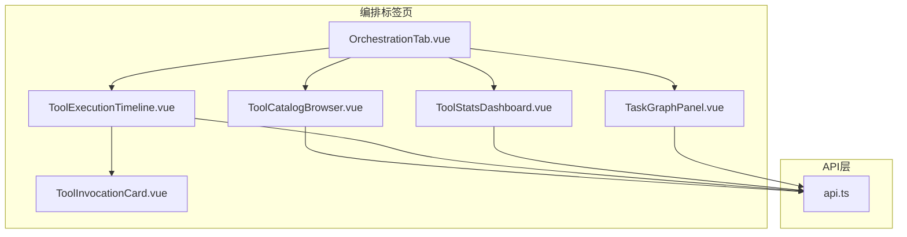
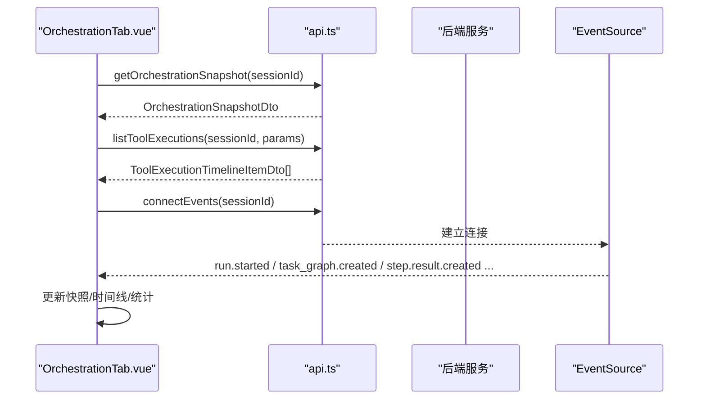
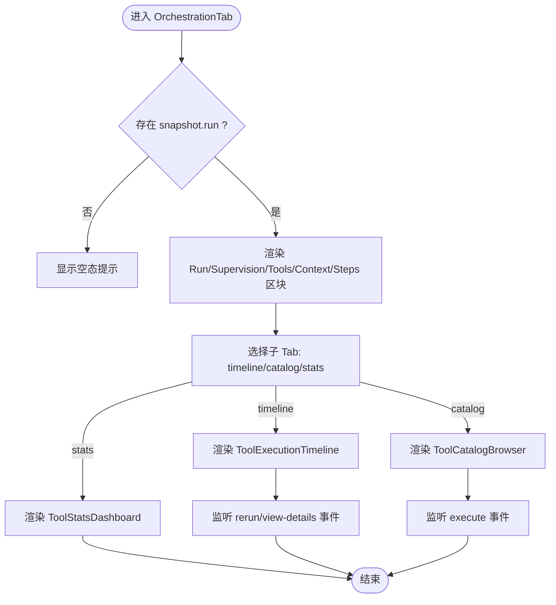
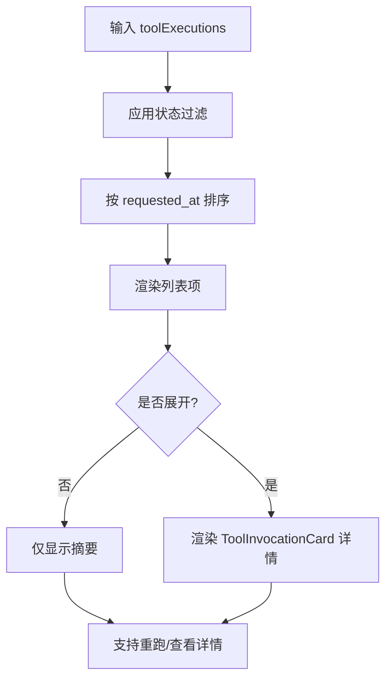
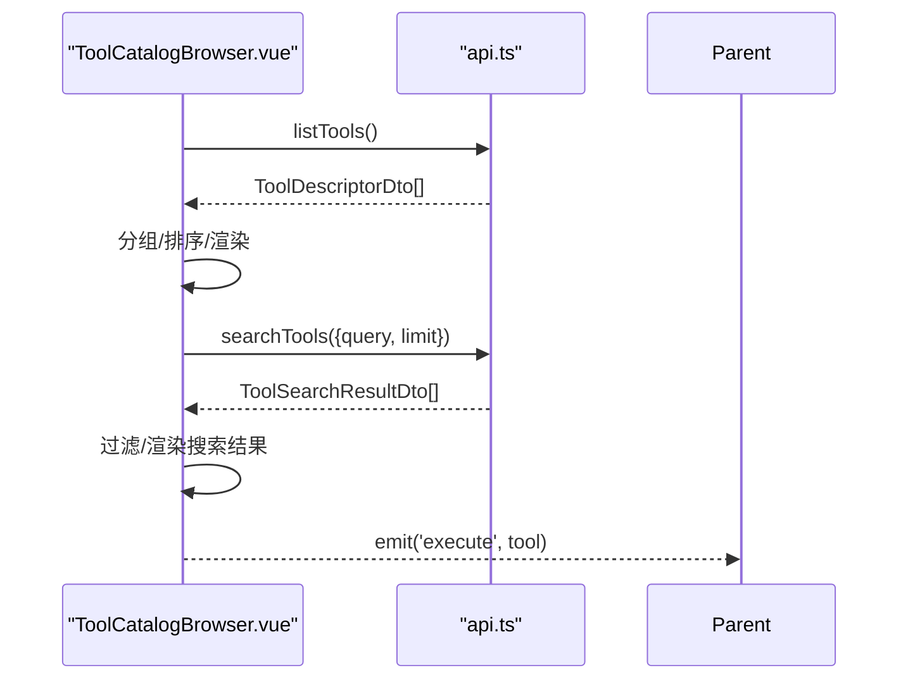
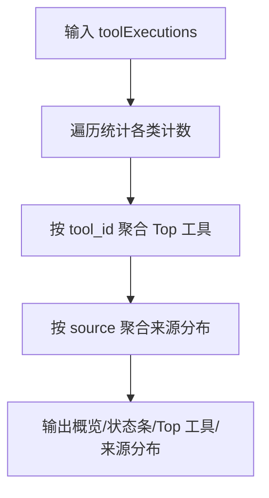
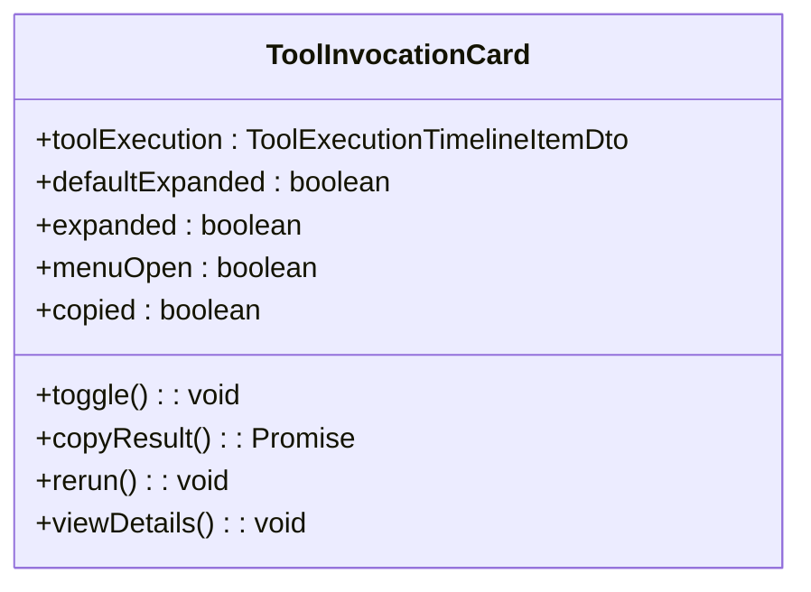
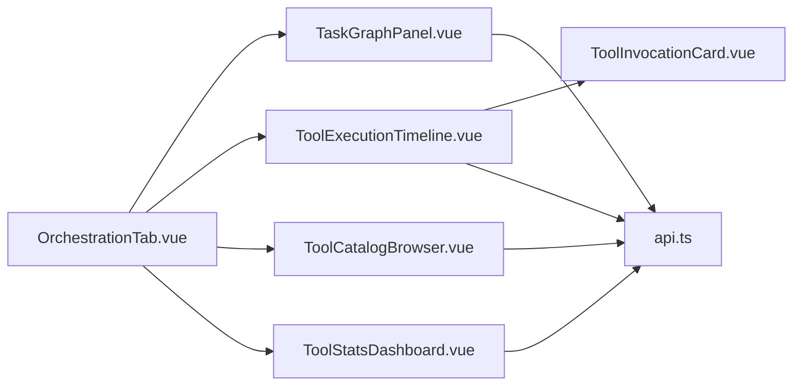

# 工作流编排标签页

<cite>
**本文引用的文件**   
- [OrchestrationTab.vue](file://apps/desktop/src/components/OrchestrationTab.vue)
- [TaskGraphPanel.vue](file://apps/desktop/src/components/TaskGraphPanel.vue)
- [ToolExecutionTimeline.vue](file://apps/desktop/src/components/tools/ToolExecutionTimeline.vue)
- [ToolCatalogBrowser.vue](file://apps/desktop/src/components/tools/ToolCatalogBrowser.vue)
- [ToolStatsDashboard.vue](file://apps/desktop/src/components/tools/ToolStatsDashboard.vue)
- [ToolInvocationCard.vue](file://apps/desktop/src/components/tools/ToolInvocationCard.vue)
- [api.ts](file://apps/desktop/src/api.ts)
</cite>

## 目录
1. [简介](#简介)
2. [项目结构](#项目结构)
3. [核心组件](#核心组件)
4. [架构总览](#架构总览)
5. [详细组件分析](#详细组件分析)
6. [依赖关系分析](#依赖关系分析)
7. [性能考虑](#性能考虑)
8. [故障排查指南](#故障排查指南)
9. [结论](#结论)
10. [附录](#附录)

## 简介
本文件面向“工作流编排标签页”的前端实现，重点说明 OrchestrationTab 组件如何展示与管理 Agent 编排信息，包括：
- 任务图可视化与节点状态跟踪（通过 TaskGraphPanel）
- 工具执行时间线、展开收起、状态过滤与排序（ToolExecutionTimeline）
- 工具目录浏览、搜索与执行入口（ToolCatalogBrowser）
- 统计概览面板（ToolStatsDashboard）
- 编排数据获取方式、实时更新机制（SSE）、错误处理策略与性能优化措施
- 编排模板管理与自定义编排流程的开发指引

## 项目结构
工作流编排标签页由多个 Vue 单文件组件构成，围绕 OrchestrationTab 作为容器，组合渲染编排快照、工具执行时间线、工具目录与统计面板；任务图以独立面板形式呈现。



图表来源
- [OrchestrationTab.vue:1-150](file://apps/desktop/src/components/OrchestrationTab.vue#L1-L150)
- [TaskGraphPanel.vue:1-119](file://apps/desktop/src/components/TaskGraphPanel.vue#L1-L119)
- [ToolExecutionTimeline.vue:1-200](file://apps/desktop/src/components/tools/ToolExecutionTimeline.vue#L1-L200)
- [ToolCatalogBrowser.vue:1-200](file://apps/desktop/src/components/tools/ToolCatalogBrowser.vue#L1-L200)
- [ToolStatsDashboard.vue:1-120](file://apps/desktop/src/components/tools/ToolStatsDashboard.vue#L1-L120)
- [ToolInvocationCard.vue:1-120](file://apps/desktop/src/components/tools/ToolInvocationCard.vue#L1-L120)
- [api.ts:997-1330](file://apps/desktop/src/api.ts#L997-L1330)

章节来源
- [OrchestrationTab.vue:1-150](file://apps/desktop/src/components/OrchestrationTab.vue#L1-L150)
- [TaskGraphPanel.vue:1-119](file://apps/desktop/src/components/TaskGraphPanel.vue#L1-L119)
- [api.ts:997-1330](file://apps/desktop/src/api.ts#L997-L1330)

## 核心组件
- OrchestrationTab：编排标签页容器，聚合 Run、Supervision、Tool Executions（含 Timeline/Catalog/Stats 三个子 Tab）、Context Packs、Step Results 等区块。
- TaskGraphPanel：任务图面板，按优先级排序展示节点列表，计算完成进度，映射节点到分配的执行 Agent。
- ToolExecutionTimeline：工具执行时间线，支持状态过滤、排序、展开详情、重跑与查看详情。
- ToolCatalogBrowser：工具目录，支持搜索、按来源/风险/审批要求筛选，分组展示并触发执行。
- ToolStatsDashboard：统计面板，汇总调用总量、成功率、平均耗时、来源分布、Top 工具等。
- ToolInvocationCard：单次工具调用的卡片，展示元数据、证据片段、审批标记、结果查看与复制。

章节来源
- [OrchestrationTab.vue:1-150](file://apps/desktop/src/components/OrchestrationTab.vue#L1-L150)
- [TaskGraphPanel.vue:1-119](file://apps/desktop/src/components/TaskGraphPanel.vue#L1-L119)
- [ToolExecutionTimeline.vue:1-200](file://apps/desktop/src/components/tools/ToolExecutionTimeline.vue#L1-L200)
- [ToolCatalogBrowser.vue:1-200](file://apps/desktop/src/components/tools/ToolCatalogBrowser.vue#L1-L200)
- [ToolStatsDashboard.vue:1-120](file://apps/desktop/src/components/tools/ToolStatsDashboard.vue#L1-L120)
- [ToolInvocationCard.vue:1-120](file://apps/desktop/src/components/tools/ToolInvocationCard.vue#L1-L120)

## 架构总览
前端通过 api.ts 统一封装 HTTP/SSE 请求，编排数据来源于后端会话级接口；事件流通过 EventSource 推送运行期变更，驱动 UI 实时刷新。



图表来源
- [api.ts:1022-1033](file://apps/desktop/src/api.ts#L1022-L1033)
- [api.ts:1310-1328](file://apps/desktop/src/api.ts#L1310-L1328)
- [OrchestrationTab.vue:1-150](file://apps/desktop/src/components/OrchestrationTab.vue#L1-L150)

## 详细组件分析

### OrchestrationTab 组件
- 功能要点
  - 接收编排快照 snapshot、工具执行列表 toolExecutions、工具描述 tools 作为 props。
  - 内部维护三个子 Tab：timeline、catalog、stats，切换渲染对应子组件。
  - 暴露 rerun-tool、view-tool-details、execute-tool 事件供父组件处理交互。
  - 展示 Run 摘要、Supervision 发现、Context Packs、Step Results 等区块。
- 数据绑定
  - 通过 computed(hasSnapshot) 判断是否存在有效 run。
  - 将 toolExecutions 透传给 ToolExecutionTimeline 与 ToolStatsDashboard。
- 交互流程
  - 点击重跑/查看详情/执行工具时，向上抛出事件，由上层编排控制器协调后续动作。



图表来源
- [OrchestrationTab.vue:1-150](file://apps/desktop/src/components/OrchestrationTab.vue#L1-L150)

章节来源
- [OrchestrationTab.vue:1-150](file://apps/desktop/src/components/OrchestrationTab.vue#L1-L150)

### TaskGraphPanel 组件
- 功能要点
  - 根据 snapshot.nodes 按 priority 排序，计算完成进度（done/total/percent）。
  - 将 assignments 按 task_node_id 分组，关联节点与执行 Agent。
  - 根据节点 status 映射图标与样式类，支持折叠/展开。
- 数据与状态
  - collapsed 控制面板折叠。
  - assignmentsByNode 为 Map<task_node_id, AgentAssignmentDto[]>。
  - sortedNodes 为排序后的节点数组。
  - progress 为完成度统计。
- 交互
  - 点击头部切换折叠；列表项显示节点标题、状态、分配 Agent。

```mermaid
classDiagram
class TaskGraphPanel {
+collapsed : boolean
+assignmentsByNode : Map<string, AgentAssignmentDto[]>
+sortedNodes : TaskNodeDto[]
+progress : {done : number,total : number,percent : number}
+nodeAssignments(node) : AgentAssignmentDto[]
+statusIcon(status) : string
+statusClass(status) : string
+toggleCollapse() : void
}
```

图表来源
- [TaskGraphPanel.vue:1-119](file://apps/desktop/src/components/TaskGraphPanel.vue#L1-L119)

章节来源
- [TaskGraphPanel.vue:1-119](file://apps/desktop/src/components/TaskGraphPanel.vue#L1-L119)

### ToolExecutionTimeline 组件
- 功能要点
  - 支持状态过滤（全部/成功/失败/待审批/运行中），按时间升/降序排列。
  - 每个条目可展开查看 ToolInvocationCard 详情，支持重跑与查看详情。
  - 提供证据片段、耗时、风险等级、来源层等信息。
- 数据与状态
  - expandedIds 记录已展开的条目 ID。
  - filteredExecutions 基于过滤器与排序生成。
  - filterCounts 统计各过滤条件数量。
- 交互
  - 点击条目切换展开；按钮切换排序；过滤按钮切换状态。



图表来源
- [ToolExecutionTimeline.vue:1-200](file://apps/desktop/src/components/tools/ToolExecutionTimeline.vue#L1-L200)

章节来源
- [ToolExecutionTimeline.vue:1-200](file://apps/desktop/src/components/tools/ToolExecutionTimeline.vue#L1-L200)

### ToolCatalogBrowser 组件
- 功能要点
  - 本地或远程加载工具清单，支持搜索（防抖）、来源/风险/审批要求筛选。
  - 按 source 分组，组内按 id 排序，支持展开查看工具详情与执行。
  - 使用 api.listTools 与 api.searchTools 获取数据。
- 数据与状态
  - localTools 缓存工具列表。
  - searchResults 存储搜索结果。
  - groupedTools 与 sortedGroupKeys 用于分组与排序。
- 交互
  - 输入框搜索（300ms 防抖）；下拉筛选；点击执行触发 emit('execute')。



图表来源
- [ToolCatalogBrowser.vue:1-200](file://apps/desktop/src/components/tools/ToolCatalogBrowser.vue#L1-L200)
- [api.ts:1130-1140](file://apps/desktop/src/api.ts#L1130-L1140)

章节来源
- [ToolCatalogBrowser.vue:1-200](file://apps/desktop/src/components/tools/ToolCatalogBrowser.vue#L1-L200)
- [api.ts:1130-1140](file://apps/desktop/src/api.ts#L1130-L1140)

### ToolStatsDashboard 组件
- 功能要点
  - 统计总调用数、成功/失败/运行/等待/阻塞计数、平均耗时、审批通过率。
  - Top 工具排行（按调用次数），来源分布（core/code/codex-rust/extension）。
- 数据与状态
  - stats 计算对象包含多维指标与聚合结果。
  - formatDuration 与 barWidth/sourceBarWidth 辅助格式化与宽度计算。
- 交互
  - 纯展示型，无用户操作。



图表来源
- [ToolStatsDashboard.vue:1-120](file://apps/desktop/src/components/tools/ToolStatsDashboard.vue#L1-L120)

章节来源
- [ToolStatsDashboard.vue:1-120](file://apps/desktop/src/components/tools/ToolStatsDashboard.vue#L1-L120)

### ToolInvocationCard 组件
- 功能要点
  - 展示单次工具调用的元数据（名称、ID、来源、状态、耗时、风险、层、时间、序列号）。
  - 支持参数提示、审批标记、证据片段、结果展开查看与复制。
  - 提供重跑与查看详情菜单项。
- 数据与状态
  - expanded 控制结果区域展开。
  - menuOpen 控制菜单可见性。
  - copied 临时反馈复制成功。
- 交互
  - 点击展开/收起结果；菜单项触发 rerun/view-details/copy。



图表来源
- [ToolInvocationCard.vue:1-120](file://apps/desktop/src/components/tools/ToolInvocationCard.vue#L1-L120)

章节来源
- [ToolInvocationCard.vue:1-120](file://apps/desktop/src/components/tools/ToolInvocationCard.vue#L1-L120)

## 依赖关系分析
- 组件依赖
  - OrchestrationTab 依赖 TaskGraphPanel、ToolExecutionTimeline、ToolCatalogBrowser、ToolStatsDashboard。
  - ToolExecutionTimeline 依赖 ToolInvocationCard。
  - ToolCatalogBrowser 依赖 api.ts 的工具查询接口。
- API 依赖
  - 编排快照：getOrchestrationSnapshot
  - 工具执行：listToolExecutions
  - 工具目录：listTools、searchTools
  - 事件流：connectEvents（SSE）
- 外部依赖
  - @lucide/vue 图标库
  - vue-i18n（ToolCatalogBrowser 国际化）



图表来源
- [OrchestrationTab.vue:1-150](file://apps/desktop/src/components/OrchestrationTab.vue#L1-L150)
- [ToolExecutionTimeline.vue:1-200](file://apps/desktop/src/components/tools/ToolExecutionTimeline.vue#L1-L200)
- [ToolCatalogBrowser.vue:1-200](file://apps/desktop/src/components/tools/ToolCatalogBrowser.vue#L1-L200)
- [ToolStatsDashboard.vue:1-120](file://apps/desktop/src/components/tools/ToolStatsDashboard.vue#L1-L120)
- [TaskGraphPanel.vue:1-119](file://apps/desktop/src/components/TaskGraphPanel.vue#L1-L119)
- [api.ts:997-1330](file://apps/desktop/src/api.ts#L997-L1330)

章节来源
- [api.ts:997-1330](file://apps/desktop/src/api.ts#L997-L1330)

## 性能考虑
- 列表与过滤
  - ToolExecutionTimeline 使用 computed 对过滤与排序进行惰性计算，避免重复渲染。
  - ToolCatalogBrowser 使用防抖（300ms）减少搜索请求频率。
- 数据缓存
  - ToolCatalogBrowser 本地缓存 localTools，避免重复拉取。
- 渲染优化
  - 按需展开详情（ToolExecutionTimeline 与 ToolInvocationCard），减少初始 DOM 体积。
  - 证据片段限制显示数量（最多 3 条），避免过长文本影响布局。
- 网络与事件
  - SSE 事件集中处理，避免频繁全量刷新；仅在必要字段变化时更新视图。
  - 错误响应统一提取 message/error.message，降低异常分支复杂度。

[本节为通用指导，不直接分析具体文件]

## 故障排查指南
- 网络连接失败
  - api.ts 的 request 函数在 fetch 失败时抛出“无法连接后端”的错误，检查 gatewayUrl 与 CORS。
- 非 JSON 响应
  - 当响应体不是合法 JSON 时，抛出“服务器响应无效”的错误，便于定位后端问题。
- 工具目录加载失败
  - ToolCatalogBrowser 捕获错误并通过通知系统提示重试，确认后端 /api/v1/tools 可用。
- 事件流断开
  - EventSource 未收到事件时，检查 /api/v1/events 路由与会话参数是否正确。

章节来源
- [api.ts:945-995](file://apps/desktop/src/api.ts#L945-L995)
- [ToolCatalogBrowser.vue:158-175](file://apps/desktop/src/components/tools/ToolCatalogBrowser.vue#L158-L175)
- [api.ts:1310-1328](file://apps/desktop/src/api.ts#L1310-L1328)

## 结论
工作流编排标签页通过清晰的组件分层与统一的 API 封装，实现了编排快照、任务图、工具执行时间线、工具目录与统计面板的完整展示与交互。借助 SSE 事件流，前端能够实时反映运行期状态变化。建议在大规模数据场景下继续优化列表虚拟化、增量更新与缓存策略，以提升用户体验与系统稳定性。

[本节为总结性内容，不直接分析具体文件]

## 附录

### 编排数据获取与实时更新
- 获取编排快照：调用 getOrchestrationSnapshot(sessionId)，返回 OrchestrationSnapshotDto。
- 获取工具执行列表：调用 listToolExecutions(sessionId, {run_id?, limit?})，返回 ToolExecutionTimelineItemDto[]。
- 实时更新：通过 connectEvents(sessionId) 订阅 run.started、task_graph.created、step.result.created、supervision.checked、context.pack.created 等事件，驱动 UI 增量更新。

章节来源
- [api.ts:1022-1033](file://apps/desktop/src/api.ts#L1022-L1033)
- [api.ts:1310-1328](file://apps/desktop/src/api.ts#L1310-L1328)

### 任务节点的展开收起、状态过滤与搜索
- 任务图面板：TaskGraphPanel 支持折叠/展开，按优先级排序，计算完成进度。
- 工具执行时间线：ToolExecutionTimeline 支持状态过滤（全部/成功/失败/待审批/运行中）与时间排序。
- 工具目录：ToolCatalogBrowser 支持搜索（防抖）、来源/风险/审批要求筛选。

章节来源
- [TaskGraphPanel.vue:1-119](file://apps/desktop/src/components/TaskGraphPanel.vue#L1-L119)
- [ToolExecutionTimeline.vue:1-200](file://apps/desktop/src/components/tools/ToolExecutionTimeline.vue#L1-L200)
- [ToolCatalogBrowser.vue:1-200](file://apps/desktop/src/components/tools/ToolCatalogBrowser.vue#L1-L200)

### 与后端 API 的集成方式与错误处理
- 统一请求封装：request(path, init?) 负责 fetch、JSON 解析、错误提取与抛错。
- 错误提取：extractErrorMessage 优先读取 message 或 error.message，回退到 statusText。
- SSE 事件：connectEvents 注册多种事件类型，统一回调 onEvent。

章节来源
- [api.ts:945-995](file://apps/desktop/src/api.ts#L945-L995)
- [api.ts:1310-1328](file://apps/desktop/src/api.ts#L1310-L1328)

### 编排模板管理与自定义编排流程开发指南
- 模板管理
  - 通过 ToolCatalogBrowser 的搜索与筛选能力，快速定位可复用的工具与能力。
  - 结合 ToolStatsDashboard 的统计结果，评估工具使用效果与风险。
- 自定义编排流程
  - 在 OrchestrationTab 中扩展新的子 Tab，接入新的数据源与展示逻辑。
  - 利用 SSE 事件流，订阅 run 与 task_graph 相关事件，实现动态编排。
  - 通过 ToolExecutionTimeline 的事件（rerun、view-details）与 ToolCatalogBrowser 的 execute 事件，串联用户操作与后端执行。

[本节为概念性指导，不直接分析具体文件]