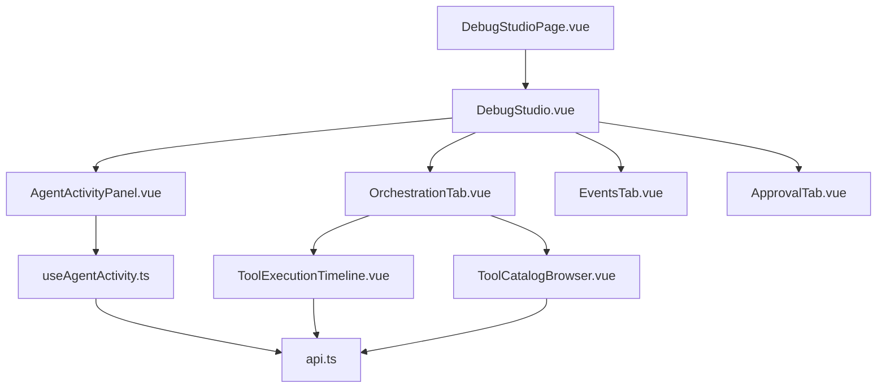
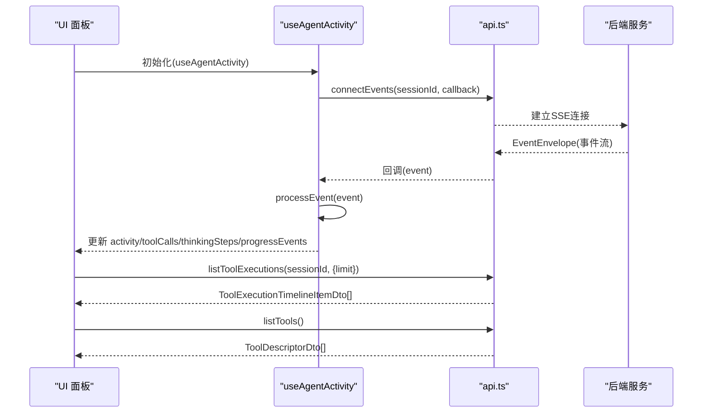
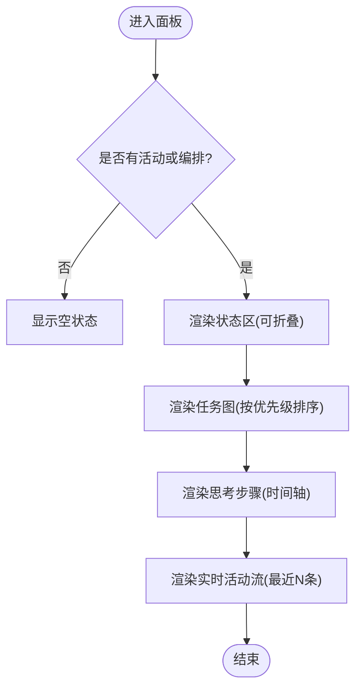
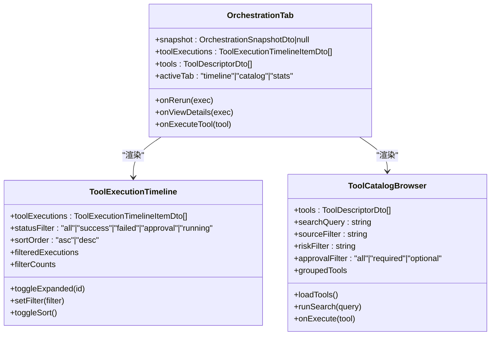
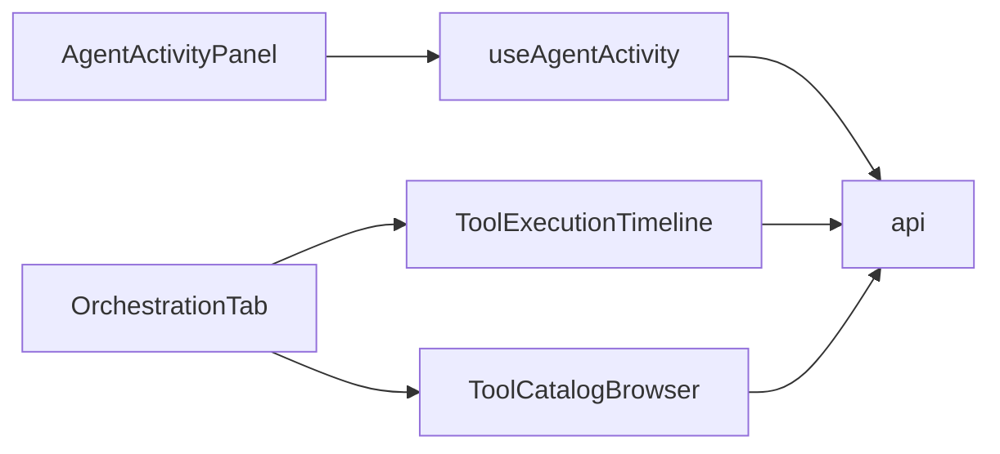

# 调试面板组件

<cite>
**本文引用的文件**   
- [AgentActivityPanel.vue](file://apps/desktop/src/components/AgentActivityPanel.vue)
- [OrchestrationTab.vue](file://apps/desktop/src/components/OrchestrationTab.vue)
- [EventsTab.vue](file://apps/desktop/src/components/EventsTab.vue)
- [ApprovalTab.vue](file://apps/desktop/src/components/ApprovalTab.vue)
- [useAgentActivity.ts](file://apps/desktop/src/composables/useAgentActivity.ts)
- [api.ts](file://apps/desktop/src/api.ts)
- [ToolExecutionTimeline.vue](file://apps/desktop/src/components/tools/ToolExecutionTimeline.vue)
- [ToolCatalogBrowser.vue](file://apps/desktop/src/components/tools/ToolCatalogBrowser.vue)
- [DebugStudioPage.vue](file://apps/desktop/src/pages/DebugStudioPage.vue)
- [DebugStudio.vue](file://apps/desktop/src/debug/DebugStudio.vue)
</cite>

## 目录
1. [简介](#简介)
2. [项目结构](#项目结构)
3. [核心组件](#核心组件)
4. [架构总览](#架构总览)
5. [详细组件分析](#详细组件分析)
6. [依赖关系分析](#依赖关系分析)
7. [性能考虑](#性能考虑)
8. [故障排查指南](#故障排查指南)
9. [结论](#结论)
10. [附录：自定义面板开发指南与扩展点](#附录自定义面板开发指南与扩展点)

## 简介
本文件为“调试面板组件”的综合文档，聚焦以下四个调试面板的功能实现与交互机制：
- AgentActivityPanel：活动监控（运行状态、任务图、思考步骤、实时进度事件）
- OrchestrationTab：工作流编排（运行摘要、监督发现、工具执行时间线、上下文包、步骤结果）
- EventsTab：事件追踪（按序列号展示事件）
- ApprovalTab：审批管理（待审批列表、审批决策、Shell 命令输入）

文档涵盖数据源、实时更新机制、用户交互逻辑、面板间状态同步、过滤器功能与导出能力，并提供自定义面板开发与扩展点说明。

## 项目结构
调试面板位于桌面应用前端（Vue + TypeScript），通过 API 层与后端服务通信，使用 SSE（EventSource）进行实时事件推送。关键文件组织如下：
- 页面入口：DebugStudioPage.vue 挂载 DebugStudio.vue
- 调试主界面：DebugStudio.vue（标签页切换、会话选择、仿真控制）
- 面板组件：AgentActivityPanel.vue、OrchestrationTab.vue、EventsTab.vue、ApprovalTab.vue
- 工具相关子组件：ToolExecutionTimeline.vue、ToolCatalogBrowser.vue
- 数据与类型：api.ts（DTO 定义、API 方法）、useAgentActivity.ts（SSE 事件处理、状态聚合）

图表来源
- [DebugStudioPage.vue:1-8](file://apps/desktop/src/pages/DebugStudioPage.vue#L1-L8)
- [DebugStudio.vue:1-158](file://apps/desktop/src/debug/DebugStudio.vue#L1-L158)
- [AgentActivityPanel.vue:1-200](file://apps/desktop/src/components/AgentActivityPanel.vue#L1-L200)
- [OrchestrationTab.vue:1-120](file://apps/desktop/src/components/OrchestrationTab.vue#L1-L120)
- [EventsTab.vue:1-19](file://apps/desktop/src/components/EventsTab.vue#L1-L19)
- [ApprovalTab.vue:1-58](file://apps/desktop/src/components/ApprovalTab.vue#L1-L58)
- [ToolExecutionTimeline.vue:1-120](file://apps/desktop/src/components/tools/ToolExecutionTimeline.vue#L1-L120)
- [ToolCatalogBrowser.vue:1-120](file://apps/desktop/src/components/tools/ToolCatalogBrowser.vue#L1-L120)
- [useAgentActivity.ts:1-120](file://apps/desktop/src/composables/useAgentActivity.ts#L1-L120)
- [api.ts:274-285](file://apps/desktop/src/api.ts#L274-L285)

章节来源
- [DebugStudioPage.vue:1-8](file://apps/desktop/src/pages/DebugStudioPage.vue#L1-L8)
- [DebugStudio.vue:1-158](file://apps/desktop/src/debug/DebugStudio.vue#L1-L158)

## 核心组件
- AgentActivityPanel：接收活动数据、Agent 状态、思考步骤、进度事件与编排快照，渲染状态卡片、任务图、思考步骤与实时活动流。
- OrchestrationTab：基于编排快照展示运行信息、监督发现、工具执行时间线（含筛选与排序）、上下文包与步骤结果。
- EventsTab：简单事件列表，按事件序号展示类型与序号。
- ApprovalTab：展示待审批项，支持 Shell 命令输入与审批决策（批准/拒绝）。

章节来源
- [AgentActivityPanel.vue:1-200](file://apps/desktop/src/components/AgentActivityPanel.vue#L1-L200)
- [OrchestrationTab.vue:1-120](file://apps/desktop/src/components/OrchestrationTab.vue#L1-L120)
- [EventsTab.vue:1-19](file://apps/desktop/src/components/EventsTab.vue#L1-L19)
- [ApprovalTab.vue:1-58](file://apps/desktop/src/components/ApprovalTab.vue#L1-L58)

## 架构总览
调试面板的数据流由三部分构成：
- 事件驱动（SSE）：useAgentActivity 连接后端事件流，解析 EventEnvelope，更新活动状态、Agent 状态、思考步骤与进度事件。
- 编排快照：OrchestrationSnapshotDto 提供节点、分配、步骤结果等静态快照，用于补充活动面板的统计与可视化。
- 工具执行与目录：ToolExecutionTimelineItemDto 与 ToolDescriptorDto 分别用于时间线与工具目录浏览。

图表来源
- [useAgentActivity.ts:640-680](file://apps/desktop/src/composables/useAgentActivity.ts#L640-L680)
- [api.ts:274-285](file://apps/desktop/src/api.ts#L274-L285)

章节来源
- [useAgentActivity.ts:151-200](file://apps/desktop/src/composables/useAgentActivity.ts#L151-L200)
- [api.ts:274-285](file://apps/desktop/src/api.ts#L274-L285)

## 详细组件分析

### AgentActivityPanel 活动监控
- 数据源
  - props.activity：当前运行状态、摘要、完成节点数、总节点数、最后更新时间
  - props.agentStates：各 Agent 的状态（规划层/执行层）
  - props.thinkingSteps：思考步骤（run_started、task_graph、agent_assignment、supervision、context_pack、step_result）
  - props.progressEvents：实时进度事件（play、network、user-check、shield、package、check-circle、alert-circle、message-square、terminal）
  - props.orchestration：编排快照（nodes、assignments、graph.title）
- 实时更新机制
  - useAgentActivity 通过 SSE 事件处理函数更新 activity、thinkingSteps、agentStates、progressEvents；当收到 tool/approval/step/task 相关事件时，刷新工具执行列表。
- 用户交互逻辑
  - 状态区可折叠，显示运行摘要、耗时、进度条
  - 任务图区按优先级排序，显示节点状态与分配 Agent
  - 思考步骤区按时间轴展示，带图标、描述、时间与持续时间
  - 实时活动流仅保留最近若干条，自动滚动
- 过滤器与导出
  - 活动流固定显示最近 N 条（内部切片），未提供外部过滤开关
  - 未直接暴露导出按钮；可在上层容器集成导出逻辑（如 CSV/JSON）

图表来源
- [AgentActivityPanel.vue:200-400](file://apps/desktop/src/components/AgentActivityPanel.vue#L200-L400)

章节来源
- [AgentActivityPanel.vue:1-200](file://apps/desktop/src/components/AgentActivityPanel.vue#L1-L200)
- [useAgentActivity.ts:215-337](file://apps/desktop/src/composables/useAgentActivity.ts#L215-L337)

### OrchestrationTab 工作流编排
- 数据源
  - snapshot：OrchestrationSnapshotDto（run、nodes、assignments、supervision_findings、context_packs、step_results）
  - toolExecutions：ToolExecutionTimelineItemDto[]
  - tools：ToolDescriptorDto[]（可选，来自 props 或本地加载）
- 用户交互逻辑
  - 三个子标签：时间线、目录、统计
  - 时间线：支持状态筛选（全部/成功/失败/审批/运行中）、排序（新/旧）、展开详情
  - 目录：搜索、按来源/风险/审批要求过滤，分组展示，支持执行
  - 统计：基于工具执行计算指标（由 ToolStatsDashboard 负责）
- 过滤器与导出
  - 时间线具备内置筛选与排序
  - 目录具备多条件过滤与搜索
  - 未直接提供导出按钮；可在上层集成导出（CSV/JSON）

图表来源
- [OrchestrationTab.vue:1-120](file://apps/desktop/src/components/OrchestrationTab.vue#L1-L120)
- [ToolExecutionTimeline.vue:1-120](file://apps/desktop/src/components/tools/ToolExecutionTimeline.vue#L1-L120)
- [ToolCatalogBrowser.vue:1-120](file://apps/desktop/src/components/tools/ToolCatalogBrowser.vue#L1-L120)

章节来源
- [OrchestrationTab.vue:1-120](file://apps/desktop/src/components/OrchestrationTab.vue#L1-L120)
- [ToolExecutionTimeline.vue:1-120](file://apps/desktop/src/components/tools/ToolExecutionTimeline.vue#L1-L120)
- [ToolCatalogBrowser.vue:1-120](file://apps/desktop/src/components/tools/ToolCatalogBrowser.vue#L1-L120)

### EventsTab 事件追踪
- 数据源
  - events：EventEnvelope[]（包含 type、seq、ts、payload 等）
- 用户交互逻辑
  - 简单列表展示事件类型与序号
- 过滤器与导出
  - 未提供过滤与导出；适合在父级容器扩展

章节来源
- [EventsTab.vue:1-19](file://apps/desktop/src/components/EventsTab.vue#L1-L19)
- [api.ts:274-285](file://apps/desktop/src/api.ts#L274-L285)

### ApprovalTab 审批管理
- 数据源
  - approvals：ApprovalDto[]（id、kind、summary、command、cwd、status、created_at、decided_at）
  - shellCommand：字符串（用户输入的 Shell 命令）
  - busy：是否忙碌（禁用请求按钮）
  - selectedSessionId：当前会话 ID（用于发起审批请求）
- 用户交互逻辑
  - 输入 Shell 命令并点击请求按钮触发 request-approval
  - 对 pending 状态的审批项执行 approve/reject 决策，发出 decide-approval 事件
- 过滤器与导出
  - 仅展示 pending 状态的审批项
  - 未提供导出；可在上层集成

章节来源
- [ApprovalTab.vue:1-58](file://apps/desktop/src/components/ApprovalTab.vue#L1-L58)
- [api.ts:25-35](file://apps/desktop/src/api.ts#L25-L35)

## 依赖关系分析
- 组件依赖
  - AgentActivityPanel 依赖 useAgentActivity 提供的状态与事件处理
  - OrchestrationTab 依赖 ToolExecutionTimeline 与 ToolCatalogBrowser
  - EventsTab 与 ApprovalTab 为轻量展示与交互组件
- 数据依赖
  - api.ts 定义了所有 DTO 与 API 方法（包括事件类型 EventEnvelope）
  - useAgentActivity 通过 api.connectEvents 与 api.listToolExecutions 获取数据
- 潜在循环依赖
  - 组件之间无直接循环导入；状态集中在 composable 中，避免耦合

图表来源
- [AgentActivityPanel.vue:1-80](file://apps/desktop/src/components/AgentActivityPanel.vue#L1-L80)
- [OrchestrationTab.vue:1-44](file://apps/desktop/src/components/OrchestrationTab.vue#L1-L44)
- [ToolExecutionTimeline.vue:1-30](file://apps/desktop/src/components/tools/ToolExecutionTimeline.vue#L1-L30)
- [ToolCatalogBrowser.vue:1-30](file://apps/desktop/src/components/tools/ToolCatalogBrowser.vue#L1-L30)
- [useAgentActivity.ts:1-10](file://apps/desktop/src/composables/useAgentActivity.ts#L1-L10)
- [api.ts:274-285](file://apps/desktop/src/api.ts#L274-L285)

章节来源
- [api.ts:274-285](file://apps/desktop/src/api.ts#L274-L285)
- [useAgentActivity.ts:151-200](file://apps/desktop/src/composables/useAgentActivity.ts#L151-L200)

## 性能考虑
- 事件流处理
  - useAgentActivity 对进度事件限制最大长度（例如最近 20 条），避免内存增长
  - 工具执行列表刷新仅在特定事件类型触发，减少不必要的拉取
- 渲染优化
  - 活动面板对进度事件使用切片与反向顺序，降低 DOM 数量
  - 工具时间线采用筛选与排序计算属性，避免全量重排
- 网络请求
  - 工具目录加载具备防抖搜索，减少频繁请求
  - 错误处理忽略拉取异常，保证 UI 稳定性

[本节为通用指导，不直接分析具体文件]

## 故障排查指南
- 事件流断开
  - 检查 useAgentActivity 的连接与断连逻辑，确认 sessionId 变化时重置与重连
- 工具执行列表为空
  - 确认 refreshToolExecutions 被调用（在 tool/approval/step/task 事件后触发）
  - 检查 api.listToolExecutions 返回结构与映射
- 审批流程卡住
  - 确认 approval.requested 与 approval.approved/rejected 事件是否正确处理
  - 检查 ApprovalTab 的 pending 过滤与决策事件派发
- 工具目录无法加载
  - 检查 api.listTools 与 searchTools 的错误处理与重试逻辑

章节来源
- [useAgentActivity.ts:640-680](file://apps/desktop/src/composables/useAgentActivity.ts#L640-L680)
- [ToolCatalogBrowser.vue:158-201](file://apps/desktop/src/components/tools/ToolCatalogBrowser.vue#L158-L201)
- [ApprovalTab.vue:21-58](file://apps/desktop/src/components/ApprovalTab.vue#L21-L58)

## 结论
调试面板组件通过清晰的数据流与事件驱动机制，实现了活动监控、工作流编排、事件追踪与审批管理的完整闭环。各面板职责明确、交互直观，具备良好的可扩展性。建议在父级容器中统一集成导出能力与更丰富的过滤器，以提升调试效率。

[本节为总结，不直接分析具体文件]

## 附录：自定义面板开发指南与扩展点
- 新增面板建议
  - 复用 useAgentActivity 提供的状态与事件处理，确保与其他面板一致的数据源
  - 使用 api.ts 中的 DTO 定义，保持类型一致性
  - 如需实时数据，优先使用 SSE（connectEvents），必要时结合轮询（listToolExecutions）
- 交互与状态同步
  - 通过 defineEmits 向上抛出事件，由父级协调跨面板状态（如审批决策、工具执行）
  - 使用 computed/ref 管理本地状态，避免直接修改共享数据
- 过滤器与导出
  - 在组件内实现筛选与排序（参考 ToolExecutionTimeline）
  - 导出功能建议在父级容器统一实现，支持 JSON/CSV 下载
- 扩展点
  - 工具目录与时间线已提供扩展接口（execute、rerun、view-details）
  - 审批流程可通过 ApprovalTab 的事件派发接入自定义决策逻辑

章节来源
- [ToolExecutionTimeline.vue:157-163](file://apps/desktop/src/components/tools/ToolExecutionTimeline.vue#L157-L163)
- [ToolCatalogBrowser.vue:203-206](file://apps/desktop/src/components/tools/ToolCatalogBrowser.vue#L203-L206)
- [ApprovalTab.vue:15-23](file://apps/desktop/src/components/ApprovalTab.vue#L15-L23)
- [useAgentActivity.ts:640-680](file://apps/desktop/src/composables/useAgentActivity.ts#L640-L680)