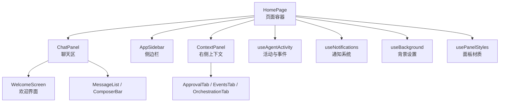
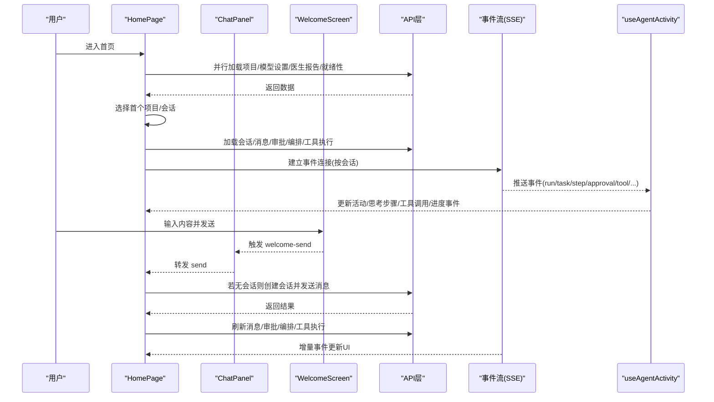
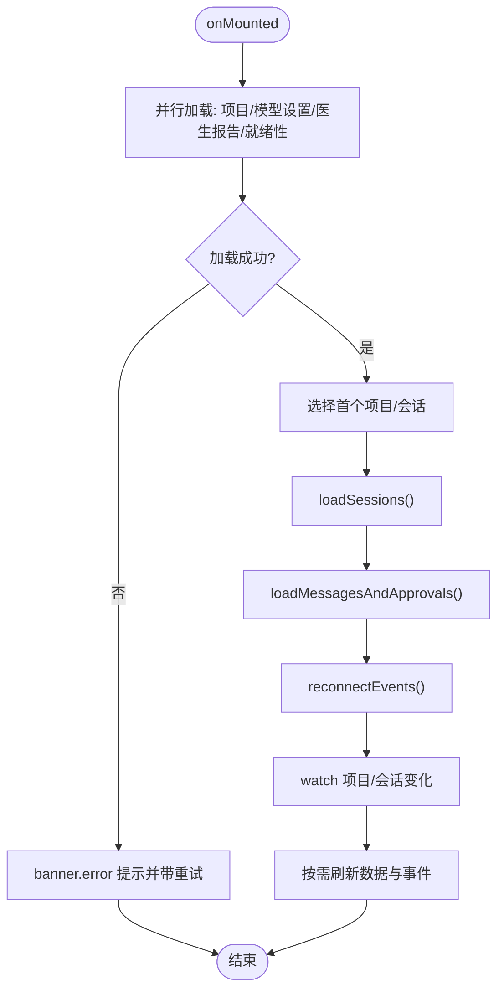
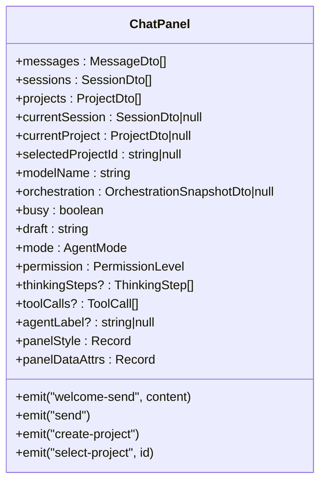
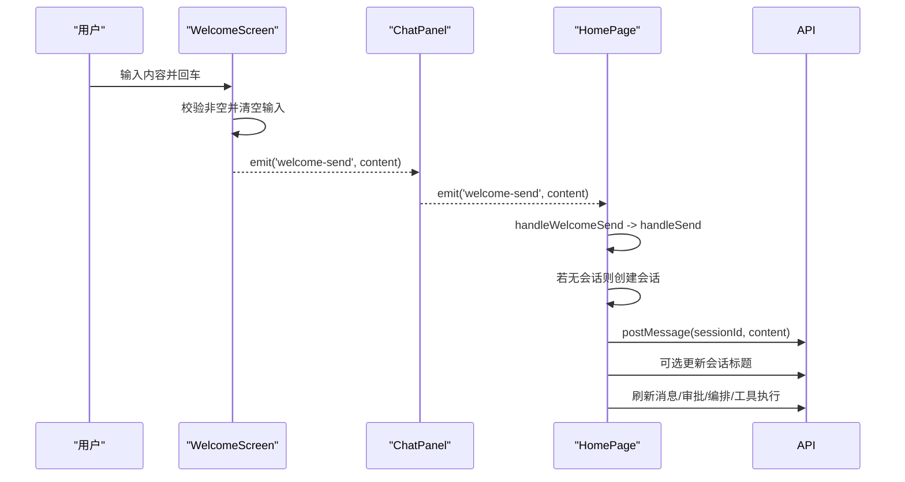
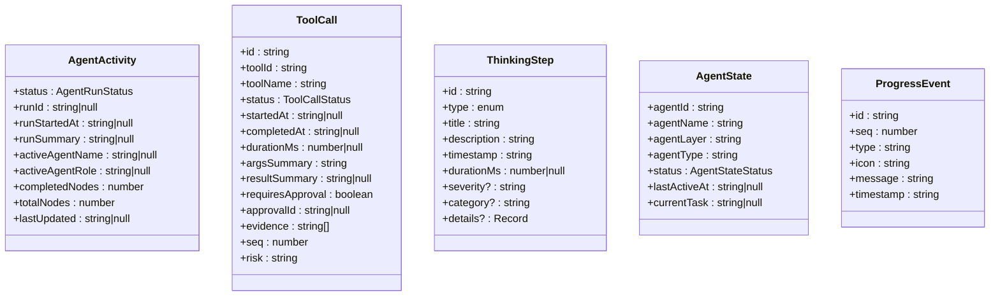
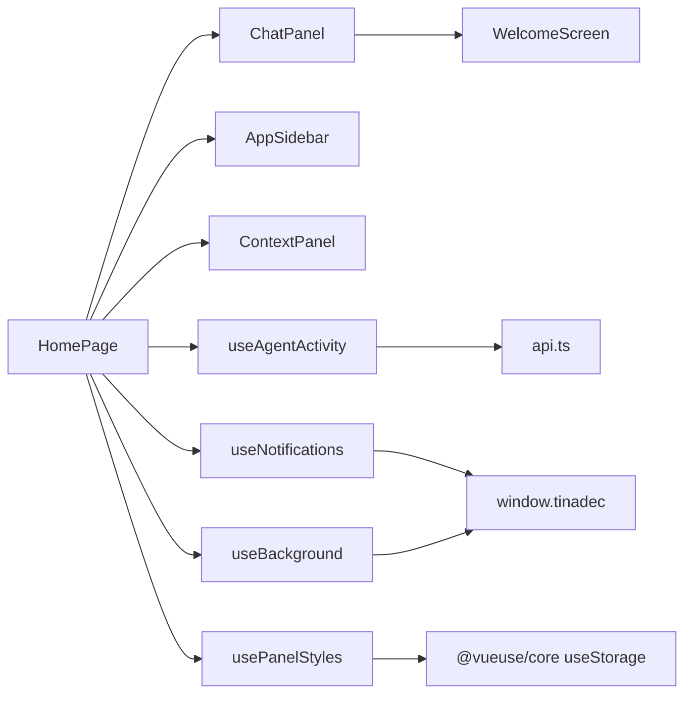

# 首页模块

<cite>
**本文引用的文件**   
- [HomePage.vue](file://apps/desktop/src/pages/HomePage.vue)
- [ChatPanel.vue](file://apps/desktop/src/components/ChatPanel.vue)
- [WelcomeScreen.vue](file://apps/desktop/src/components/WelcomeScreen.vue)
- [AppSidebar.vue](file://apps/desktop/src/components/AppSidebar.vue)
- [ContextPanel.vue](file://apps/desktop/src/components/ContextPanel.vue)
- [useAgentActivity.ts](file://apps/desktop/src/composables/useAgentActivity.ts)
- [useNotifications.ts](file://apps/desktop/src/composables/useNotifications.ts)
- [useBackground.ts](file://apps/desktop/src/composables/useBackground.ts)
- [usePanelStyles.ts](file://apps/desktop/src/composables/usePanelStyles.ts)
- [background.ts](file://apps/desktop/src/types/background.ts)
- [api.ts](file://apps/desktop/src/api.ts)
</cite>

## 目录
1. [简介](#简介)
2. [项目结构](#项目结构)
3. [核心组件与职责](#核心组件与职责)
4. [架构总览](#架构总览)
5. [详细组件分析](#详细组件分析)
6. [依赖关系分析](#依赖关系分析)
7. [性能考量](#性能考量)
8. [故障排查指南](#故障排查指南)
9. [结论](#结论)
10. [附录](#附录)

## 简介
本章节面向“首页模块”，围绕 HomePage 组件及其子组件，系统化说明欢迎界面、项目概览、快速启动入口等核心功能；记录用户交互流程、数据展示逻辑与状态管理；并给出页面初始化流程、错误处理与性能优化策略。该模块以 Vue 3 + TypeScript 构建，通过 API 层与后端服务通信，使用事件流（SSE）实现实时状态更新，并通过可组合式函数（composables）管理通知、背景与面板样式等全局能力。

## 项目结构
首页模块由一个主页面与多个面板/子组件构成：
- 页面级：HomePage（路由页面）
- 聊天与会话：ChatPanel、WelcomeScreen、ComposerBar、MessageList
- 侧边栏：AppSidebar（项目与会话导航）
- 右侧上下文面板：ContextPanel（审批、事件、编排、工具执行等）
- 可组合式：useAgentActivity（活动与事件）、useNotifications（通知岛）、useBackground（背景设置）、usePanelStyles（面板材质效果）
- 类型与API：api.ts（DTO与接口）、background.ts（背景与面板样式类型）

图表来源
- [HomePage.vue:1-428](file://apps/desktop/src/pages/HomePage.vue#L1-L428)
- [ChatPanel.vue:1-107](file://apps/desktop/src/components/ChatPanel.vue#L1-L107)
- [WelcomeScreen.vue:1-303](file://apps/desktop/src/components/WelcomeScreen.vue#L1-L303)
- [AppSidebar.vue:1-200](file://apps/desktop/src/components/AppSidebar.vue#L1-L200)
- [ContextPanel.vue:1-200](file://apps/desktop/src/components/ContextPanel.vue#L1-L200)
- [useAgentActivity.ts:1-697](file://apps/desktop/src/composables/useAgentActivity.ts#L1-L697)
- [useNotifications.ts:1-800](file://apps/desktop/src/composables/useNotifications.ts#L1-L800)
- [useBackground.ts:1-230](file://apps/desktop/src/composables/useBackground.ts#L1-L230)
- [usePanelStyles.ts:1-203](file://apps/desktop/src/composables/usePanelStyles.ts#L1-L203)

章节来源
- [HomePage.vue:1-428](file://apps/desktop/src/pages/HomePage.vue#L1-L428)
- [api.ts:1-200](file://apps/desktop/src/api.ts#L1-L200)

## 核心组件与职责
- HomePage：页面容器与状态中枢，负责加载项目/会话/消息/审批/编排/工具执行等数据，维护选中项目与会话，连接事件流，驱动各面板渲染与交互。
- ChatPanel：聊天区域容器，根据是否有消息决定渲染 WelcomeScreen 或活跃聊天面板，透传模式与权限选择，转发发送与创建项目等事件。
- WelcomeScreen：欢迎界面，提供输入框、快捷操作（添加图片/文件）、项目下拉选择、模式与权限切换、跳转设置页等。
- AppSidebar：左侧导航，展示项目树与会话列表，支持搜索、新建会话、打开市场与调试中心。
- ContextPanel：右侧上下文面板，聚合审批、事件、医生报告、就绪性、编排快照、工具执行时间线等，支持标签页、拖拽分离、响应式布局。
- useAgentActivity：订阅 SSE 事件，维护运行状态、思考步骤、工具调用、智能体状态与进度事件，并在必要时刷新工具执行列表。
- useNotifications：统一的“通知岛”系统，支持瞬时、任务、状态三类通知，跨窗口广播与去重、自动过期、优先级队列等。
- useBackground：背景设置持久化与应用，支持图片/视频/HTML背景，路径规范化与透明度/模糊控制。
- usePanelStyles：全局面板材质效果（不透明/半透明/毛玻璃），计算内联样式与 data 属性，供所有面板共享。

章节来源
- [HomePage.vue:1-428](file://apps/desktop/src/pages/HomePage.vue#L1-L428)
- [ChatPanel.vue:1-107](file://apps/desktop/src/components/ChatPanel.vue#L1-L107)
- [WelcomeScreen.vue:1-303](file://apps/desktop/src/components/WelcomeScreen.vue#L1-L303)
- [AppSidebar.vue:1-200](file://apps/desktop/src/components/AppSidebar.vue#L1-L200)
- [ContextPanel.vue:1-200](file://apps/desktop/src/components/ContextPanel.vue#L1-L200)
- [useAgentActivity.ts:1-697](file://apps/desktop/src/composables/useAgentActivity.ts#L1-L697)
- [useNotifications.ts:1-800](file://apps/desktop/src/composables/useNotifications.ts#L1-L800)
- [useBackground.ts:1-230](file://apps/desktop/src/composables/useBackground.ts#L1-L230)
- [usePanelStyles.ts:1-203](file://apps/desktop/src/composables/usePanelStyles.ts#L1-L203)

## 架构总览
首页模块采用“页面容器 + 多面板”的布局，配合可组合式能力与事件流，形成清晰的数据流与交互流。

图表来源
- [HomePage.vue:125-198](file://apps/desktop/src/pages/HomePage.vue#L125-L198)
- [HomePage.vue:230-278](file://apps/desktop/src/pages/HomePage.vue#L230-L278)
- [HomePage.vue:298-331](file://apps/desktop/src/pages/HomePage.vue#L298-L331)
- [ChatPanel.vue:63-106](file://apps/desktop/src/components/ChatPanel.vue#L63-L106)
- [WelcomeScreen.vue:66-79](file://apps/desktop/src/components/WelcomeScreen.vue#L66-L79)
- [useAgentActivity.ts:640-684](file://apps/desktop/src/composables/useAgentActivity.ts#L640-L684)

## 详细组件分析

### HomePage 组件分析
- 状态管理
  - 项目/会话/消息/审批/事件/医生报告/就绪性/模型设置/编排快照/工具执行时间线等均为响应式 ref。
  - 当前选中项目与会话通过 computed 派生 currentProject/currentSession。
  - 最近事件 recentEvents 取 events 末尾若干条倒序显示。
- 初始化与数据加载
  - onMounted 中并行加载项目、模型设置、医生报告、就绪性，随后加载会话；失败时通过 banner.error 提示并提供重试动作。
  - loadSessions 按项目批量拉取会话，并保证选中会话有效性。
  - loadMessagesAndApprovals 拉取消息、审批、编排快照与工具执行时间线。
- 交互流程
  - openProject：调用 Electron IPC 打开项目对话框，创建项目并置顶选择。
  - createSession：避免重复创建，优先复用 pendingSessionId。
  - sendMessage/handleWelcomeSend：无会话时自动创建会话，发送后尝试更新会话标题，再刷新消息与审批。
  - requestShellApproval/decideApproval：发起 Shell 命令审批与决策，刷新审批列表。
- 事件流
  - reconnectEvents：建立 SSE 连接，合并去重并按 seq 排序保留最近 80 条；对关键事件类型触发消息与审批刷新。
  - watch(selectedProjectId/selectedSessionId)：切换项目/会话时自动刷新数据与事件连接。
- 动画与过渡
  - 子窗口（?splash=0）跳过 main-rise 入场动画，使用 no-transition 提升体验。
  - Transition 包裹主容器，统一入场动画。
- 面板样式与背景
  - 通过 usePanelStyles 获取全局 material 效果，注入到各面板。
  - useBackground 提供背景设置，HomePage 计算 backgroundStyle 并应用。

图表来源
- [HomePage.vue:125-154](file://apps/desktop/src/pages/HomePage.vue#L125-L154)
- [HomePage.vue:156-177](file://apps/desktop/src/pages/HomePage.vue#L156-L177)
- [HomePage.vue:179-198](file://apps/desktop/src/pages/HomePage.vue#L179-L198)
- [HomePage.vue:298-331](file://apps/desktop/src/pages/HomePage.vue#L298-L331)

章节来源
- [HomePage.vue:1-428](file://apps/desktop/src/pages/HomePage.vue#L1-L428)

### ChatPanel 组件分析
- 响应式模式：根据 conversation 宽度检测 narrow/ultra 模式，影响布局类名。
- 条件渲染：当 messages 为空时渲染 WelcomeScreen，否则渲染活跃聊天面板（头部、消息列表、输入栏）。
- 事件转发：approve/reject、send/welcome-send、create-project、select-project、update:draft/mode/permission 等事件透传到父组件。

图表来源
- [ChatPanel.vue:12-43](file://apps/desktop/src/components/ChatPanel.vue#L12-L43)
- [ChatPanel.vue:63-106](file://apps/desktop/src/components/ChatPanel.vue#L63-L106)

章节来源
- [ChatPanel.vue:1-107](file://apps/desktop/src/components/ChatPanel.vue#L1-L107)

### WelcomeScreen 组件分析
- 输入与发送：支持 Enter 发送、Shift+Enter 换行，自动调整高度。
- 快捷菜单：Plus 按钮弹出“添加图片/文件”菜单，Teleport 到 body，点击外部关闭。
- 项目下拉：固定定位下拉，滚动区域展示已打开项目，支持新建项目。
- 模式与权限：ModeSelector 与 PermissionSelector 双向绑定并向上抛出 update:mode/update:permission。
- 设置跳转：点击设置按钮跳转到 /settings。

图表来源
- [WelcomeScreen.vue:66-79](file://apps/desktop/src/components/WelcomeScreen.vue#L66-L79)
- [ChatPanel.vue:63-106](file://apps/desktop/src/components/ChatPanel.vue#L63-L106)
- [HomePage.vue:230-278](file://apps/desktop/src/pages/HomePage.vue#L230-L278)

章节来源
- [WelcomeScreen.vue:1-303](file://apps/desktop/src/components/WelcomeScreen.vue#L1-L303)

### AppSidebar 组件分析
- 项目分组与展开：点击项目行展开/折叠会话列表。
- 会话过滤：仅展示 title 不为默认值的会话。
- 快捷操作：新建会话、打开市场、调试中心（Electron IPC 调用）。
- 搜索：按项目名称过滤。

章节来源
- [AppSidebar.vue:1-200](file://apps/desktop/src/components/AppSidebar.vue#L1-L200)

### ContextPanel 组件分析
- 标签页管理：支持打开/关闭/分离标签，拖拽分离通过 Electron IPC 实现。
- 响应式与标签可见性：根据面板宽度与标签数量动态决定是否隐藏标签文本。
- 数据聚合：审批、事件、医生报告、就绪性、编排快照、工具执行时间线等。
- 交互：请求 Shell 审批、决策审批、更新 Shell 命令。

章节来源
- [ContextPanel.vue:1-200](file://apps/desktop/src/components/ContextPanel.vue#L1-L200)

### useAgentActivity 可组合式分析
- 数据结构：AgentActivity、ToolCall、ThinkingStep、AgentState、ProgressEvent。
- 事件处理：run.started、task_graph.created、task.assigned、step.result.created、supervision.checked、context.pack.created、approval.requested/tool.shell.approval_required、approval.approved/rejected、message.created。
- 工具执行刷新：在特定事件后拉取工具执行时间线并映射为 ToolCall。
- 编排快照增强：从 orchestration 快照补充运行状态、节点计数与智能体状态。
- 生命周期：watch sessionId 连接/断开事件源；watch orchestration 同步快照；卸载时清理定时器与事件源。

图表来源
- [useAgentActivity.ts:9-96](file://apps/desktop/src/composables/useAgentActivity.ts#L9-L96)
- [useAgentActivity.ts:151-176](file://apps/desktop/src/composables/useAgentActivity.ts#L151-L176)
- [useAgentActivity.ts:490-530](file://apps/desktop/src/composables/useAgentActivity.ts#L490-L530)
- [useAgentActivity.ts:540-583](file://apps/desktop/src/composables/useAgentActivity.ts#L540-L583)
- [useAgentActivity.ts:585-638](file://apps/desktop/src/composables/useAgentActivity.ts#L585-L638)
- [useAgentActivity.ts:640-684](file://apps/desktop/src/composables/useAgentActivity.ts#L640-L684)

章节来源
- [useAgentActivity.ts:1-697](file://apps/desktop/src/composables/useAgentActivity.ts#L1-L697)

### useNotifications 可组合式分析
- 通知类型：transient（瞬时）、task（任务）、status（状态）。
- 生命周期：auto/sticky/source 三种持久化策略，支持跨窗口广播与去重。
- 队列与优先级：error > task(pending) > 其他，最多 50 条，历史最多 50 条。
- 交互：悬停展开、点击详情、堆叠折叠、超时自动消失。

章节来源
- [useNotifications.ts:1-800](file://apps/desktop/src/composables/useNotifications.ts#L1-L800)

### useBackground 与 usePanelStyles 分析
- useBackground：持久化背景设置，支持图片/视频/HTML，路径规范化（Windows/Unix/URL），透明度与模糊控制。
- usePanelStyles：全局面板材质效果（opaque/translucent/blur），计算内联样式与 data-panel-effect 属性，供所有面板共享。

章节来源
- [useBackground.ts:1-230](file://apps/desktop/src/composables/useBackground.ts#L1-L230)
- [usePanelStyles.ts:1-203](file://apps/desktop/src/composables/usePanelStyles.ts#L1-L203)
- [background.ts:1-57](file://apps/desktop/src/types/background.ts#L1-L57)

## 依赖关系分析
- 组件耦合
  - HomePage 作为容器，强依赖 ChatPanel、AppSidebar、ContextPanel 的数据与事件。
  - ChatPanel 依赖 WelcomeScreen 与消息/输入组件，事件透传至 HomePage。
  - ContextPanel 依赖多个 Tab 组件与 usePanelTabs 能力。
- 可组合式依赖
  - useAgentActivity 依赖 api.connectEvents 与 listToolExecutions。
  - useNotifications 依赖 window.tinadec 进行跨窗口广播。
  - useBackground/usePanelStyles 依赖 @vueuse/core 的 useStorage 与本地存储。
- 外部依赖
  - Electron IPC：openProjectDialog、selectBackgroundFile、detachPanel、broadcastStatusNotification 等。
  - SSE：事件流实时更新。

图表来源
- [HomePage.vue:1-428](file://apps/desktop/src/pages/HomePage.vue#L1-L428)
- [useAgentActivity.ts:1-697](file://apps/desktop/src/composables/useAgentActivity.ts#L1-L697)
- [useNotifications.ts:1-800](file://apps/desktop/src/composables/useNotifications.ts#L1-L800)
- [useBackground.ts:1-230](file://apps/desktop/src/composables/useBackground.ts#L1-L230)
- [usePanelStyles.ts:1-203](file://apps/desktop/src/composables/usePanelStyles.ts#L1-L203)

章节来源
- [api.ts:1-200](file://apps/desktop/src/api.ts#L1-L200)

## 性能考量
- 并行加载：首页初始化使用 Promise.all 并行拉取项目、模型设置、医生报告、就绪性，减少首屏等待。
- 事件流节流：events 数组限制最近 80 条，recentEvents 取最后 8 条，避免大列表渲染开销。
- 去重与合并：useNotifications 通过指纹去重与合并，避免重复通知闪烁；useAgentActivity 对 toolCalls 与 thinkingSteps 去重与切片。
- 懒连接：useAgentActivity 仅在 sessionId 变化时连接/断开事件源，避免无效连接。
- 样式与背景：usePanelStyles 通过内联样式与 data 属性统一应用，避免频繁 DOM 操作；useBackground 的路径规范化与缓存减少重复计算。
- 渲染优化：ChatPanel 根据 messages 长度条件渲染 WelcomeScreen 或活跃面板，减少不必要的组件挂载。

[本节为通用指导，不直接分析具体文件]

## 故障排查指南
- 首页加载失败
  - 现象：banner.error 提示“加载失败”，并提供重试按钮。
  - 排查：检查网络与后端可用性；确认 api.listProjects/getModelSettings/doctor/readiness 是否返回正常。
  - 参考：HomePage 的 loadInitial 错误分支与 dismissByKey。
- 会话未创建或发送失败
  - 现象：发送消息时报错“请先打开项目”。
  - 排查：确保 selectedProjectId 存在；handleSend 会先创建会话再发消息。
  - 参考：HomePage 的 handleSend 与 createSession。
- 事件流未更新
  - 现象：右侧事件/审批/工具执行不刷新。
  - 排查：检查 reconnectEvents 是否正确建立 SSE；确认事件类型是否命中刷新条件。
  - 参考：HomePage 的 reconnectEvents 与 useAgentActivity 的 connect/disconnect。
- 通知异常
  - 现象：通知不出现或无法关闭。
  - 排查：检查 isUserDismissible 与 persistence 策略；确认跨窗口广播是否可用。
  - 参考：useNotifications 的 add/update/dismiss 与 applyStatusBroadcast。
- 背景与面板样式异常
  - 现象：背景不生效或面板材质效果异常。
  - 排查：检查 normalizeFileSource 与 computePanelStyle；确认 data-bg-type 与 data-panel-effect 属性。
  - 参考：useBackground 与 usePanelStyles。

章节来源
- [HomePage.vue:125-154](file://apps/desktop/src/pages/HomePage.vue#L125-L154)
- [HomePage.vue:230-278](file://apps/desktop/src/pages/HomePage.vue#L230-L278)
- [HomePage.vue:298-331](file://apps/desktop/src/pages/HomePage.vue#L298-L331)
- [useNotifications.ts:1-800](file://apps/desktop/src/composables/useNotifications.ts#L1-L800)
- [useBackground.ts:1-230](file://apps/desktop/src/composables/useBackground.ts#L1-L230)
- [usePanelStyles.ts:1-203](file://apps/desktop/src/composables/usePanelStyles.ts#L1-L203)

## 结论
首页模块以 HomePage 为核心，结合 ChatPanel、WelcomeScreen、AppSidebar、ContextPanel 与一系列可组合式能力，构建了完整的欢迎界面、项目概览与快速启动入口。通过并行加载、事件流与通知系统，实现了流畅的用户体验与可靠的错误处理。性能方面通过去重、限流、条件渲染与样式优化，保障了良好的响应性与稳定性。

[本节为总结性内容，不直接分析具体文件]

## 附录
- 关键 DTO 定义（节选）
  - ProjectDto：项目标识、名称、路径、创建时间。
  - SessionDto：会话标识、所属项目、标题、状态、时间戳。
  - MessageDto：消息角色、内容、时间。
  - ApprovalDto：审批类型、摘要、命令与工作目录、状态、时间。
  - ModelSettingsDto：模型基础 URL、模型名、是否拥有 API Key、更新时间。
  - DoctorReportDto：平台信息、核心版本、检查项。
  - RuntimeReadinessComponentDto：运行时就绪性组件信息。

章节来源
- [api.ts:1-200](file://apps/desktop/src/api.ts#L1-L200)