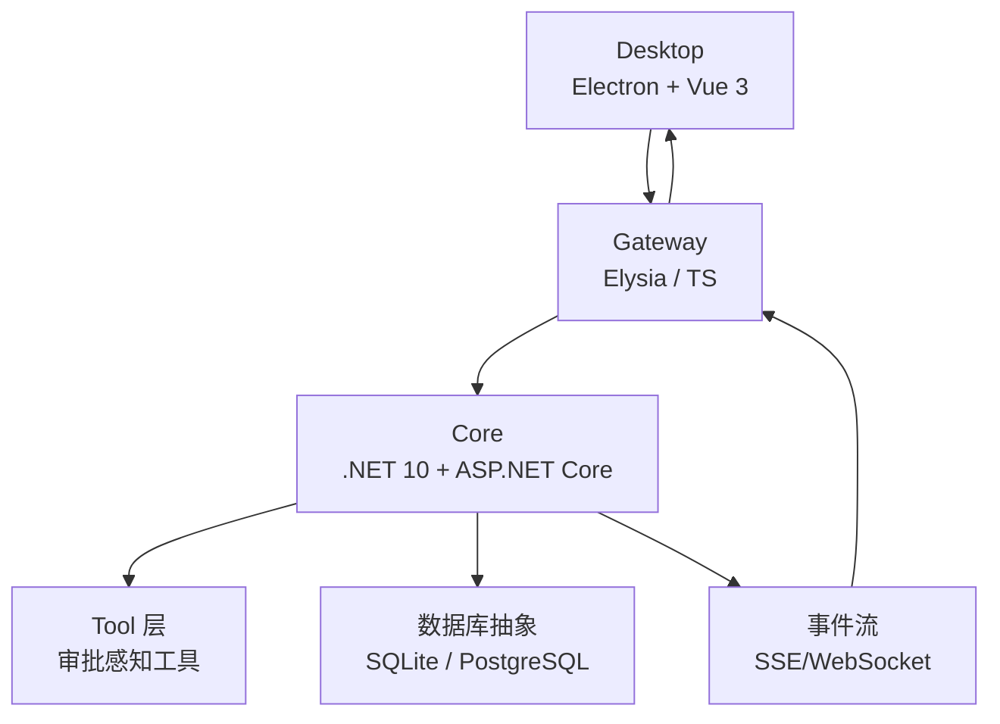
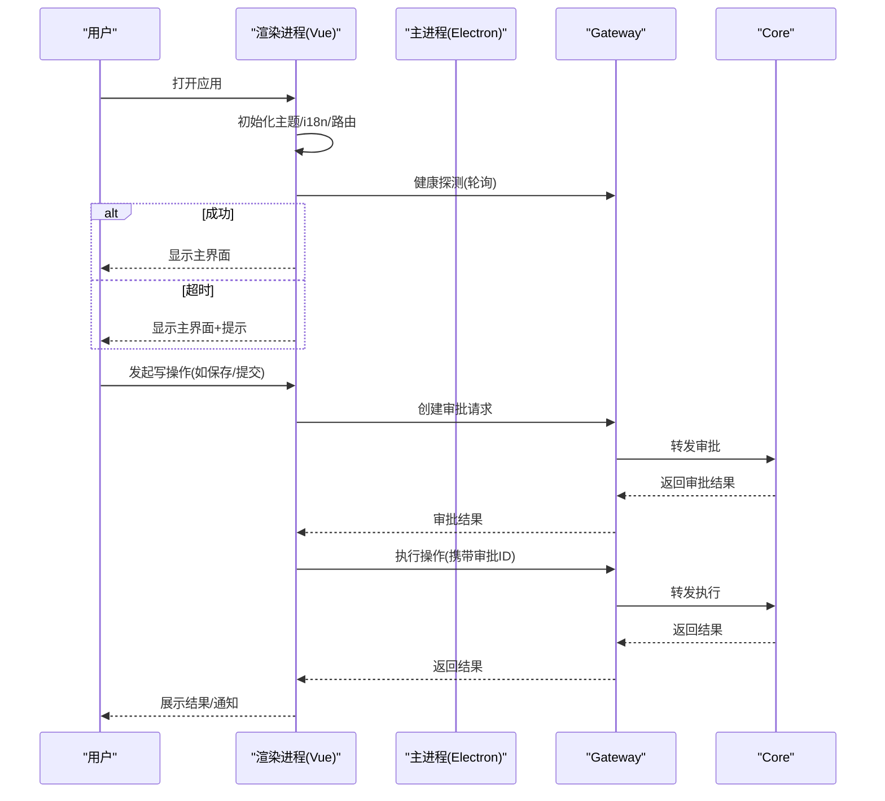
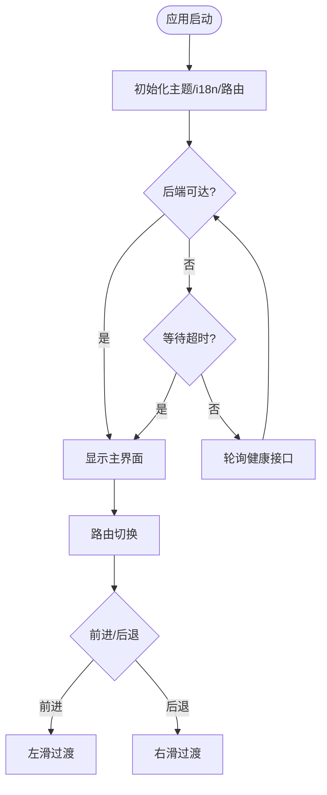
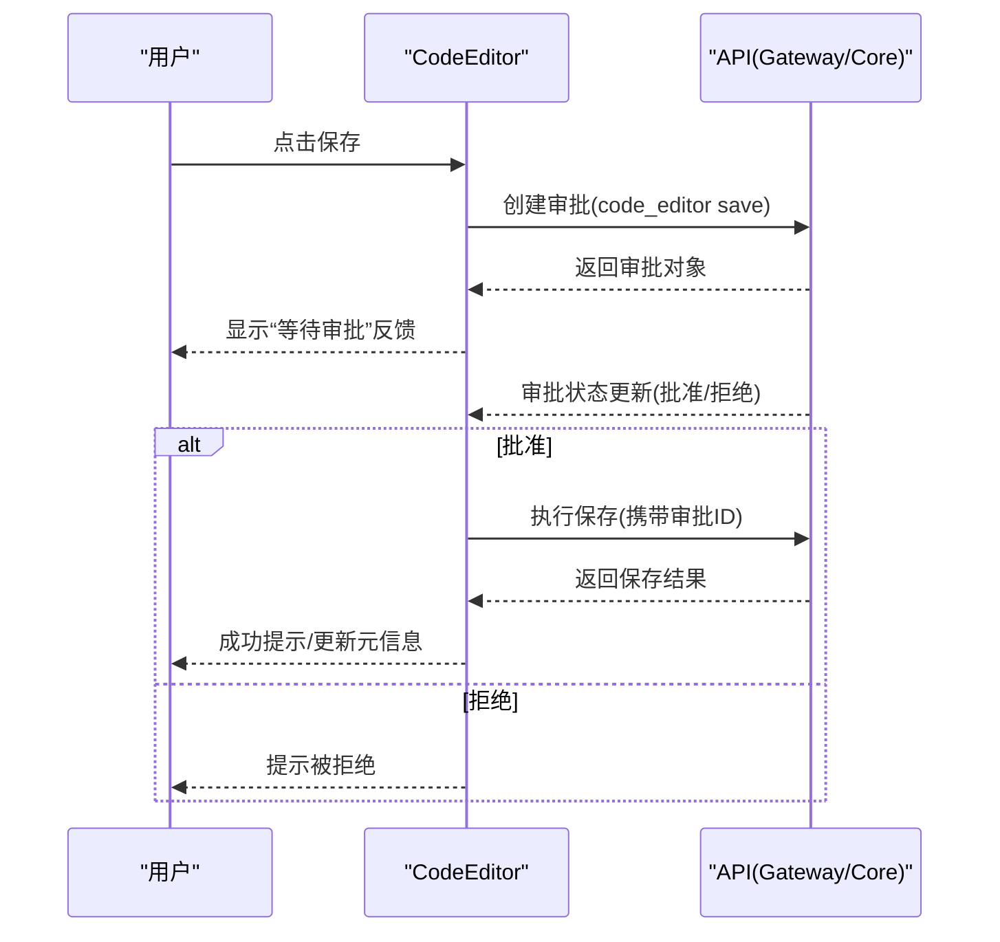
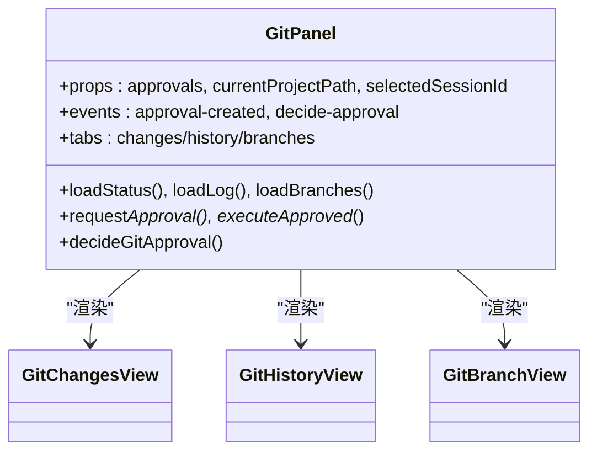
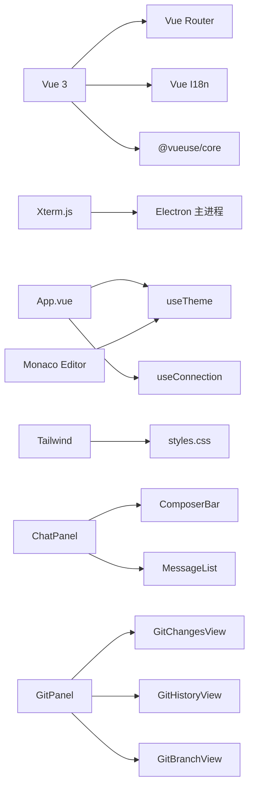

# 桌面应用程序

<cite>
**本文引用的文件**   
- [README.md](file://README.md)
- [apps/desktop/package.json](file://apps/desktop/package.json)
- [apps/desktop/src/main.ts](file://apps/desktop/src/main.ts)
- [apps/desktop/src/App.vue](file://apps/desktop/src/App.vue)
- [apps/desktop/src/router.ts](file://apps/desktop/src/router.ts)
- [apps/desktop/electron/main.cjs](file://apps/desktop/electron/main.cjs)
- [apps/desktop/src/styles.css](file://apps/desktop/src/styles.css)
- [apps/desktop/src/composables/useTheme.ts](file://apps/desktop/src/composables/useTheme.ts)
- [apps/desktop/src/composables/useConnection.ts](file://apps/desktop/src/composables/useConnection.ts)
- [apps/desktop/src/components/ChatPanel.vue](file://apps/desktop/src/components/ChatPanel.vue)
- [apps/desktop/src/components/code/CodeEditor.vue](file://apps/desktop/src/components/code/CodeEditor.vue)
- [apps/desktop/src/components/GitPanel.vue](file://apps/desktop/src/components/GitPanel.vue)
- [apps/desktop/src/components/AppSidebar.vue](file://apps/desktop/src/components/AppSidebar.vue)
</cite>

## 目录
1. [简介](#简介)
2. [项目结构](#项目结构)
3. [核心组件](#核心组件)
4. [架构总览](#架构总览)
5. [详细组件分析](#详细组件分析)
6. [依赖关系分析](#依赖关系分析)
7. [性能考量](#性能考量)
8. [故障排查指南](#故障排查指南)
9. [结论](#结论)
10. [附录](#附录)

## 简介
本文件为 TinadecOffice 桌面应用的 UI 组件文档，聚焦 Electron + Vue 3 的架构设计、组件结构与状态管理。内容覆盖聊天界面、代码编辑器、Git 管理、工具面板等核心功能，并给出组件属性、事件、插槽与自定义选项说明；同时提供响应式设计与无障碍访问指导、样式定制与主题支持、跨浏览器兼容性建议，以及组件组合模式与与其他 UI 元素的集成方式。

## 项目结构
TinadecOffice 采用三层架构：Desktop（Electron + Vue 3）、Gateway（Elysia + TypeScript）、Core（.NET 10 + ASP.NET Core）。前端通过 Gateway 代理访问 Core，保持 Desktop 无状态。

图表来源
- [README.md:33-43](file://README.md#L33-L43)

章节来源
- [README.md:1-120](file://README.md#L1-L120)
- [apps/desktop/package.json:1-69](file://apps/desktop/package.json#L1-L69)

## 核心组件
- 应用壳与路由
  - App.vue：全局背景层、启动引导（Splash）、连接门控、页面过渡方向控制、通知岛与详情弹窗挂载。
  - main.ts：Vue 应用初始化、i18n 注入、主题初始应用、挂载入口。
  - router.ts：Hash 路由定义，懒加载页面组件。
- 侧边栏与导航
  - AppSidebar.vue：项目与会话列表、搜索过滤、新建会话、Debug Studio 入口、模式切换占位。
- 聊天面板
  - ChatPanel.vue：消息区、欢迎页、ComposerBar 输入区、响应式模式检测、审批事件透传。
- 代码编辑器
  - CodeEditor.vue：Monaco Editor 封装、文件加载/保存、审批流程、格式化/撤销重做、主题自适应。
- Git 管理
  - GitPanel.vue：变更/历史/分支三标签视图、操作审批门控、响应式布局、刷新与同步。
- 主题与系统能力
  - useTheme.ts：主题（暗/亮/系统）与强调色管理，CSS 变量注入。
  - useConnection.ts：后端连接状态机（连接中/已连接/超时/断开），健康探测与重试。
  - electron/main.cjs：主进程窗口管理、IPC 桥接、面板窗口、宠物窗口、终端、协议注册、广播机制。

章节来源
- [apps/desktop/src/App.vue:1-182](file://apps/desktop/src/App.vue#L1-L182)
- [apps/desktop/src/main.ts:1-24](file://apps/desktop/src/main.ts#L1-L24)
- [apps/desktop/src/router.ts:1-45](file://apps/desktop/src/router.ts#L1-L45)
- [apps/desktop/src/components/AppSidebar.vue:1-264](file://apps/desktop/src/components/AppSidebar.vue#L1-L264)
- [apps/desktop/src/components/ChatPanel.vue:1-107](file://apps/desktop/src/components/ChatPanel.vue#L1-L107)
- [apps/desktop/src/components/code/CodeEditor.vue:1-287](file://apps/desktop/src/components/code/CodeEditor.vue#L1-L287)
- [apps/desktop/src/components/GitPanel.vue:1-585](file://apps/desktop/src/components/GitPanel.vue#L1-L585)
- [apps/desktop/src/composables/useTheme.ts:1-258](file://apps/desktop/src/composables/useTheme.ts#L1-L258)
- [apps/desktop/src/composables/useConnection.ts:1-138](file://apps/desktop/src/composables/useConnection.ts#L1-L138)
- [apps/desktop/electron/main.cjs:1-374](file://apps/desktop/electron/main.cjs#L1-L374)

## 架构总览
- 渲染层（Renderer）：Vue 3 单页应用，使用 Hash 路由，按需懒加载页面。
- 主进程（Main）：Electron 主进程负责窗口生命周期、IPC、子窗口（面板/宠物/调试工作室）、协议处理与广播。
- 通信层：HTTP/SSE/WebSocket 经由 Gateway 转发至 Core，保证 Desktop 不直接持有业务状态。
- 主题与样式：Tailwind + CSS 变量，动态 data-theme 与强调色变量注入，支持明暗主题与强调色选择。
- 连接门控：启动时轮询健康接口，超时后进入主界面并持续后台探测，异常时弹出通知并提供重试。

图表来源
- [apps/desktop/src/composables/useConnection.ts:1-138](file://apps/desktop/src/composables/useConnection.ts#L1-L138)
- [apps/desktop/src/components/code/CodeEditor.vue:1-287](file://apps/desktop/src/components/code/CodeEditor.vue#L1-L287)
- [apps/desktop/src/components/GitPanel.vue:1-585](file://apps/desktop/src/components/GitPanel.vue#L1-L585)
- [apps/desktop/electron/main.cjs:1-374](file://apps/desktop/electron/main.cjs#L1-L374)

## 详细组件分析

### 应用壳与路由（App.vue / main.ts / router.ts）
- 职责
  - 全局背景层（图片/视频/HTML/纯色）与页面过渡动画。
  - 连接门控与通知系统集成。
  - 路由方向判断与 Transition 名称设置。
  - 子窗口（?splash=0）跳过首次启动序列。
- 关键交互
  - 监听 connectionState 变化，超时或断连时弹出可重试通知。
  - 根据路由顺序决定左右滑入/滑出过渡。
- 扩展点
  - 可通过 panelStyle/panelDataAttrs 向子面板注入样式与数据属性。

图表来源
- [apps/desktop/src/App.vue:1-182](file://apps/desktop/src/App.vue#L1-L182)
- [apps/desktop/src/main.ts:1-24](file://apps/desktop/src/main.ts#L1-L24)
- [apps/desktop/src/router.ts:1-45](file://apps/desktop/src/router.ts#L1-L45)

章节来源
- [apps/desktop/src/App.vue:1-182](file://apps/desktop/src/App.vue#L1-L182)
- [apps/desktop/src/main.ts:1-24](file://apps/desktop/src/main.ts#L1-L24)
- [apps/desktop/src/router.ts:1-45](file://apps/desktop/src/router.ts#L1-L45)

### 侧边栏（AppSidebar.vue）
- 属性
  - projects/sessions：项目与会话数据源。
  - selectedProjectId/selectedSessionId：当前选中项。
  - busy：是否忙碌（禁用新建等操作）。
  - panelStyle/panelDataAttrs：面板级样式与数据属性透传。
- 事件
  - select-project/select-session/create-session/open-project/go-settings/go-market。
- 行为
  - 项目分组展开/收起，会话列表筛选，搜索过滤。
  - Debug Studio 入口调用主进程 IPC。

章节来源
- [apps/desktop/src/components/AppSidebar.vue:1-264](file://apps/desktop/src/components/AppSidebar.vue#L1-L264)

### 聊天面板（ChatPanel.vue）
- 属性
  - messages/sessions/projects/currentSession/currentProject/selectedProjectId/modelName/orchestration/busy/draft/mode/permission/thinkingSteps/toolCalls/agentLabel/panelStyle/panelDataAttrs。
- 事件
  - update:draft/update:mode/update:permission/send/welcome-send/create-project/select-project/approve/reject。
- 行为
  - 响应式模式检测（窄屏/超窄屏），欢迎页与活跃会话切换。
  - 审批动作透传到父级。

章节来源
- [apps/desktop/src/components/ChatPanel.vue:1-107](file://apps/desktop/src/components/ChatPanel.vue#L1-L107)

### 代码编辑器（CodeEditor.vue）
- 属性
  - cwd/filePath/initialContent/selectedSessionId/approvals/fontSize/wordWrap/tabSize。
- 事件
  - approval-requested/saved/cancel。
- 行为
  - Monaco Editor 初始化、语言自动识别、主题跟随系统。
  - 保存前创建审批，审批通过后执行保存，失败回滚状态。
  - 快捷键 Ctrl+S 触发保存，格式化/撤销/重做。
- 复杂度
  - 编辑器实例与模型生命周期管理，避免内存泄漏。

图表来源
- [apps/desktop/src/components/code/CodeEditor.vue:1-287](file://apps/desktop/src/components/code/CodeEditor.vue#L1-L287)

章节来源
- [apps/desktop/src/components/code/CodeEditor.vue:1-287](file://apps/desktop/src/components/code/CodeEditor.vue#L1-L287)

### Git 管理（GitPanel.vue）
- 属性
  - approvals/currentProjectPath/selectedSessionId。
- 事件
  - approval-created/decide-approval。
- 行为
  - 三标签：变更/历史/分支，各标签独立数据加载与刷新。
  - 所有写操作均走审批门控（索引、提交、推送、拉取、检出、分支、合并、变基、冲突解决、工作树等）。
  - 响应式紧凑模式，头部显示 ahead/behind 计数。
- 状态
  - loading/operationLoading、sections/statusFiles/recentCommits/branches/pushBlockers/pushReady/hasPushCandidate 等。

图表来源
- [apps/desktop/src/components/GitPanel.vue:1-585](file://apps/desktop/src/components/GitPanel.vue#L1-L585)

章节来源
- [apps/desktop/src/components/GitPanel.vue:1-585](file://apps/desktop/src/components/GitPanel.vue#L1-L585)

### 主题与样式（useTheme.ts / styles.css）
- 主题策略
  - 支持 dark/light/system，通过 data-theme 切换。
  - 强调色集合 ACCENT_COLORS，按主题映射 CSS 变量。
- 样式体系
  - Tailwind 变量映射到 CSS 变量，统一色彩与圆角。
  - 明暗两套语义化变量（--bg-*、--text-*、--accent-* 等）。
  - Material-aware surface tokens，便于面板材质效果复用。
- 运行时
  - 应用启动即注入初始主题与强调色，监听系统偏好变化。

章节来源
- [apps/desktop/src/composables/useTheme.ts:1-258](file://apps/desktop/src/composables/useTheme.ts#L1-L258)
- [apps/desktop/src/styles.css:1-800](file://apps/desktop/src/styles.css#L1-L800)

### 连接门控（useConnection.ts）
- 状态机
  - connecting → connected/timeout/disconnected。
- 机制
  - 启动立即探测，未达则定时轮询；超时后进入主界面并继续后台探测。
  - 断连时发出通知，提供重试入口。
- 测试友好
  - 提供 __resetConnectionForTests 重置单例状态。

章节来源
- [apps/desktop/src/composables/useConnection.ts:1-138](file://apps/desktop/src/composables/useConnection.ts#L1-L138)

### 主进程与 IPC（electron/main.cjs）
- 窗口管理
  - 主窗口、调试工作室窗口、可分离面板窗口、宠物窗口。
  - 窗口持久化恢复、关闭/聚焦/广播主题与状态通知。
- IPC 能力
  - 打开项目、应用配置读写、重启、最小化/最大化/关闭。
  - 背景文件选择、面板分离/重新附着、光标位置与主窗口边界查询。
  - 宠物窗口生命周期与预览协议 tinadec-pet-preview。
- 安全
  - contextIsolation、nodeIntegration=false、sandbox=true。

章节来源
- [apps/desktop/electron/main.cjs:1-374](file://apps/desktop/electron/main.cjs#L1-L374)

## 依赖关系分析
- 前端依赖
  - Vue 3、Vue Router、Vue I18n、@vueuse/core、Monaco Editor、Xterm.js、Lucide 图标、Tailwind。
- 构建与开发
  - Vite、TypeScript、Vitest、Electron、@tailwindcss/vite。
- 运行时依赖
  - node-pty（终端）、dompurify（Markdown 安全渲染）、marked（Markdown 解析）。

图表来源
- [apps/desktop/package.json:1-69](file://apps/desktop/package.json#L1-L69)
- [apps/desktop/src/App.vue:1-182](file://apps/desktop/src/App.vue#L1-L182)
- [apps/desktop/src/components/ChatPanel.vue:1-107](file://apps/desktop/src/components/ChatPanel.vue#L1-L107)
- [apps/desktop/src/components/GitPanel.vue:1-585](file://apps/desktop/src/components/GitPanel.vue#L1-L585)

章节来源
- [apps/desktop/package.json:1-69](file://apps/desktop/package.json#L1-L69)

## 性能考量
- 渲染优化
  - 路由懒加载减少首屏体积。
  - 背景层置于 Transition 外部，避免 transform 导致的 fixed 定位退化。
- 资源加载
  - Monaco/Xterm 按需加载与销毁，避免内存泄漏。
  - 图片/视频背景支持模糊与透明度，注意大媒体文件对渲染的影响。
- 网络与状态
  - 健康探测间隔与超时合理配置，避免频繁轮询。
  - 审批流程异步化，避免阻塞 UI。
- 主进程
  - 子窗口数量与状态持久化，退出前清理终端与窗口。

[本节为通用指导，无需引用具体文件]

## 故障排查指南
- 连接问题
  - 检查 Gateway/Core 端口与地址，确认 health 接口可达。
  - 查看连接状态与通知，必要时点击重试。
- 编辑器问题
  - 确认 filePath/cwd 有效，session_id 存在以触发审批。
  - 检查主题与语言识别是否正确。
- Git 操作
  - 确认仓库路径正确，分支与远端状态一致。
  - 审批未通过时无法执行写操作，需先决策审批。
- 主进程
  - 检查 IPC 通道是否注册，窗口是否被意外关闭。
  - 宠物窗口与面板窗口状态持久化失败时，查看日志与配置文件。

章节来源
- [apps/desktop/src/composables/useConnection.ts:1-138](file://apps/desktop/src/composables/useConnection.ts#L1-L138)
- [apps/desktop/src/components/code/CodeEditor.vue:1-287](file://apps/desktop/src/components/code/CodeEditor.vue#L1-L287)
- [apps/desktop/src/components/GitPanel.vue:1-585](file://apps/desktop/src/components/GitPanel.vue#L1-L585)
- [apps/desktop/electron/main.cjs:1-374](file://apps/desktop/electron/main.cjs#L1-L374)

## 结论
TinadecOffice 桌面应用通过清晰的三层架构与模块化组件设计，实现了高内聚、低耦合的前端体验。聊天、代码编辑、Git 管理与工具面板等功能围绕审批门控与主题系统构建，具备良好的可扩展性与可维护性。建议在后续迭代中继续完善无障碍特性、国际化文案与性能监控，以提升整体用户体验。

[本节为总结性内容，无需引用具体文件]

## 附录
- 响应式设计
  - 使用 useElementSize 提供的响应式模式（chat-narrow/chat-ultra/git-compact）适配不同屏幕尺寸。
- 无障碍访问
  - 按钮与输入元素具备语义化标题与键盘快捷键（如 Ctrl+S）。
  - 颜色对比度遵循主题变量，确保可读性。
- 样式定制
  - 通过 CSS 变量与 Tailwind 配置覆盖默认主题，支持强调色与材质表面 token。
- 跨浏览器兼容
  - 基于 Electron Chromium 内核，主要关注 Windows/macOS/Linux 平台差异。
- 组件组合模式
  - 父组件通过 props 下发数据与样式，子组件通过 events 上报交互；composables 封装共享逻辑（主题、连接、Monaco、Git 操作）。

[本节为补充说明，无需引用具体文件]