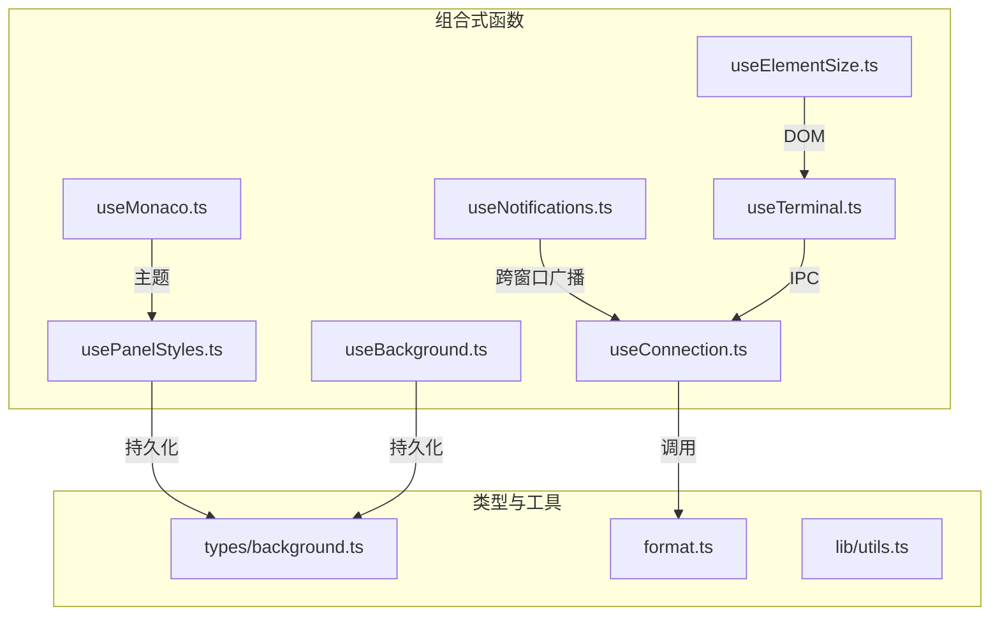
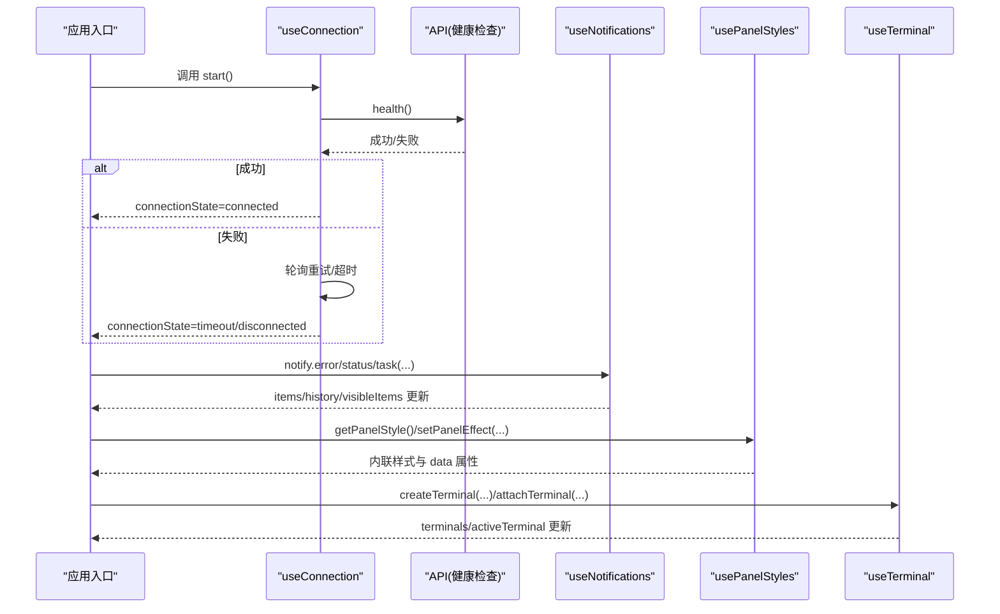
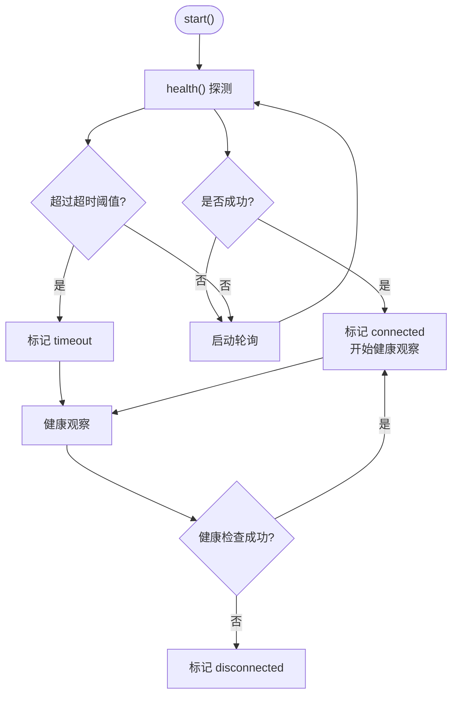
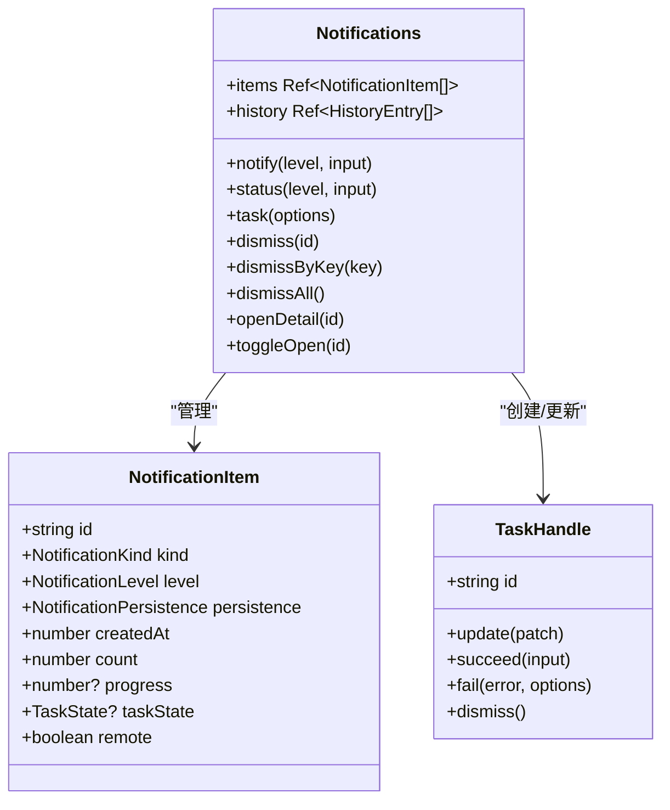
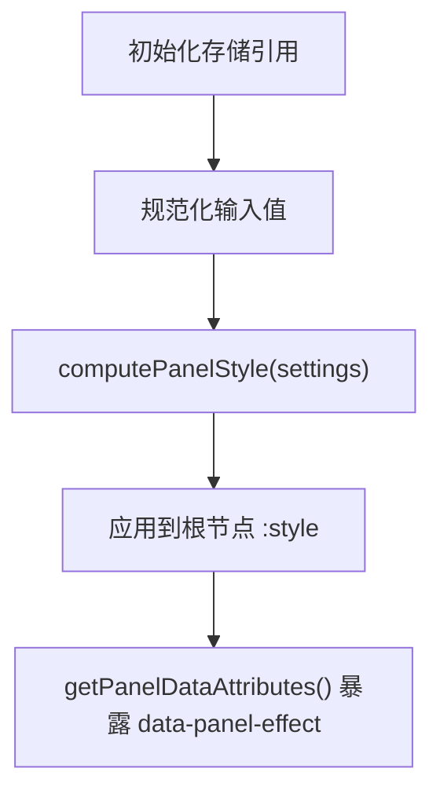
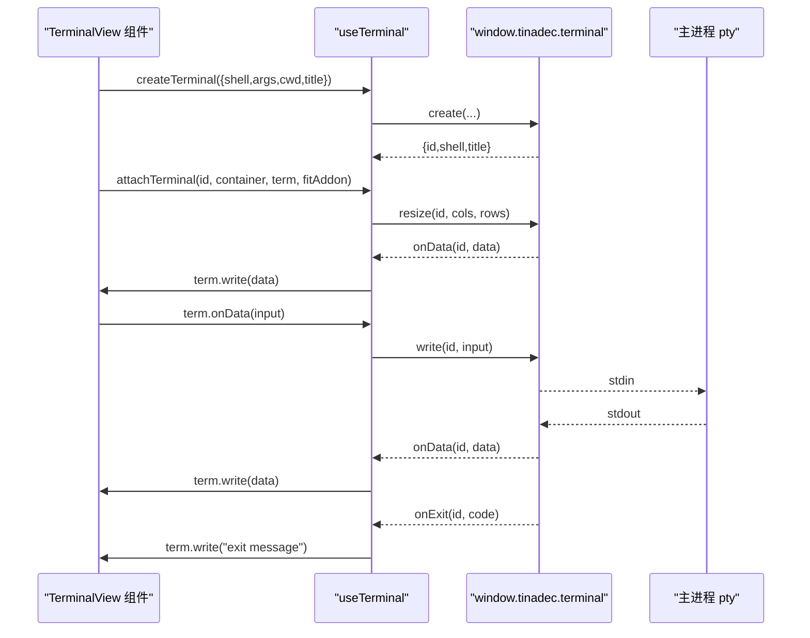
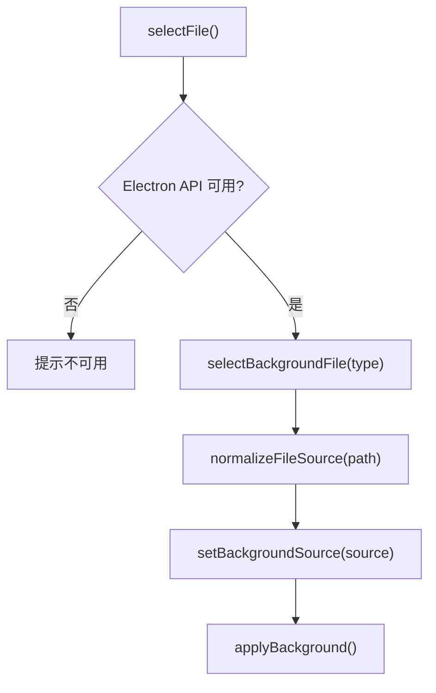
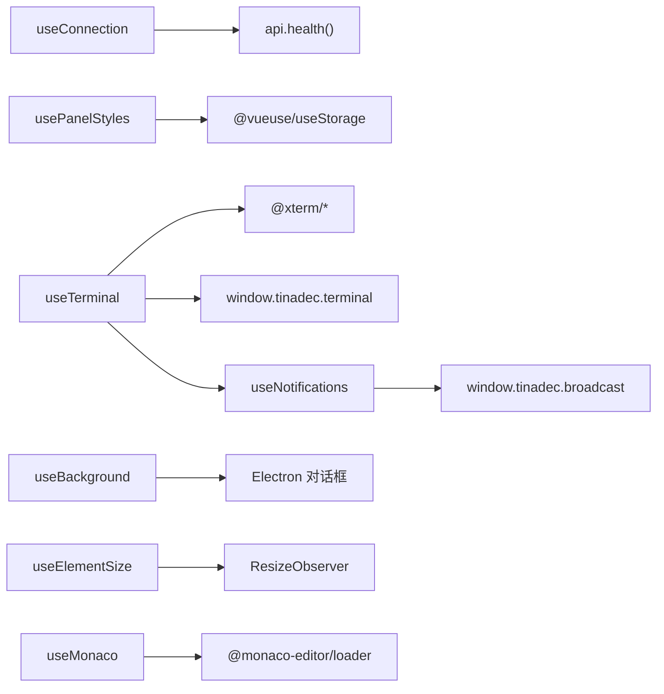

# 组合式函数与工具

<cite>
**本文引用的文件**   
- [useConnection.ts](file://apps/desktop/src/composables/useConnection.ts)
- [useNotifications.ts](file://apps/desktop/src/composables/useNotifications.ts)
- [usePanelStyles.ts](file://apps/desktop/src/composables/usePanelStyles.ts)
- [useTerminal.ts](file://apps/desktop/src/composables/useTerminal.ts)
- [useBackground.ts](file://apps/desktop/src/composables/useBackground.ts)
- [useElementSize.ts](file://apps/desktop/src/composables/useElementSize.ts)
- [useMonaco.ts](file://apps/desktop/src/composables/useMonaco.ts)
- [format.ts](file://apps/desktop/src/format.ts)
- [utils.ts](file://apps/desktop/src/lib/utils.ts)
- [background.ts](file://apps/desktop/src/types/background.ts)
- [useConnection.test.ts](file://apps/desktop/src/composables/useConnection.test.ts)
- [useNotifications.test.ts](file://apps/desktop/src/composables/useNotifications.test.ts)
- [usePanelStyles.test.ts](file://apps/desktop/src/composables/usePanelStyles.test.ts)
</cite>

## 目录
1. [简介](#简介)
2. [项目结构](#项目结构)
3. [核心组件](#核心组件)
4. [架构总览](#架构总览)
5. [详细组件分析](#详细组件分析)
6. [依赖分析](#依赖分析)
7. [性能考虑](#性能考虑)
8. [故障排查指南](#故障排查指南)
9. [结论](#结论)
10. [附录](#附录)

## 简介
本文件面向 TinadecOffice 桌面端的前端组合式函数与工具库，系统化梳理可复用的业务逻辑封装，包括连接管理、通知系统、面板样式、终端操作等核心能力。文档覆盖 useConnection、useNotifications、usePanelStyles、useTerminal 等组合式函数的参数、返回值与使用要点，并补充文件格式化处理、日期时间转换、字符串操作等实用工具。同时提供自定义组合式函数的开发规范、错误处理策略、性能优化建议以及单元测试实践。

## 项目结构
- 组合式函数集中于 apps/desktop/src/composables，按职责划分：连接、通知、面板样式、终端、背景、元素尺寸、编辑器集成等。
- 类型定义集中在 apps/desktop/src/types/background.ts，统一描述背景与面板样式配置。
- 通用工具位于 apps/desktop/src/format.ts 与 apps/desktop/src/lib/utils.ts，提供路径/状态映射与类名合并等基础能力。
- 测试用例与实现一一对应，便于验证行为与回归保护。

图表来源
- [useConnection.ts:1-138](file://apps/desktop/src/composables/useConnection.ts#L1-L138)
- [useNotifications.ts:1-800](file://apps/desktop/src/composables/useNotifications.ts#L1-L800)
- [usePanelStyles.ts:1-203](file://apps/desktop/src/composables/usePanelStyles.ts#L1-L203)
- [useTerminal.ts:1-515](file://apps/desktop/src/composables/useTerminal.ts#L1-L515)
- [useBackground.ts:1-230](file://apps/desktop/src/composables/useBackground.ts#L1-L230)
- [useElementSize.ts:1-163](file://apps/desktop/src/composables/useElementSize.ts#L1-L163)
- [useMonaco.ts:1-147](file://apps/desktop/src/composables/useMonaco.ts#L1-L147)
- [background.ts:1-57](file://apps/desktop/src/types/background.ts#L1-L57)
- [format.ts:1-13](file://apps/desktop/src/format.ts#L1-L13)
- [utils.ts:1-9](file://apps/desktop/src/lib/utils.ts#L1-L9)

章节来源
- [useConnection.ts:1-138](file://apps/desktop/src/composables/useConnection.ts#L1-L138)
- [useNotifications.ts:1-800](file://apps/desktop/src/composables/useNotifications.ts#L1-L800)
- [usePanelStyles.ts:1-203](file://apps/desktop/src/composables/usePanelStyles.ts#L1-L203)
- [useTerminal.ts:1-515](file://apps/desktop/src/composables/useTerminal.ts#L1-L515)
- [useBackground.ts:1-230](file://apps/desktop/src/composables/useBackground.ts#L1-L230)
- [useElementSize.ts:1-163](file://apps/desktop/src/composables/useElementSize.ts#L1-L163)
- [useMonaco.ts:1-147](file://apps/desktop/src/composables/useMon Monaco.ts#L1-L147)
- [background.ts:1-57](file://apps/desktop/src/types/background.ts#L1-L57)
- [format.ts:1-13](file://apps/desktop/src/format.ts#L1-L13)
- [utils.ts:1-9](file://apps/desktop/src/lib/utils.ts#L1-L9)

## 核心组件
- 连接管理（useConnection）
  - 职责：启动后端健康探测、超时控制、轮询重试、健康状态监听、手动重试。
  - 关键常量：连接超时时长、轮询间隔、横幅键名。
  - 返回：连接状态、启动方法、重试方法；内部维护单例状态与定时器。
  - 典型用法：在应用启动时调用 start()，根据 connectionState 控制引导界面显示。
  - 错误处理：探测失败不抛错，转为状态变更；支持 retryConnection() 主动重试。
  - 性能：首次探测后立即进入轮询；健康观察以较低频率运行，避免频繁请求。

- 通知系统（useNotifications）
  - 职责：统一的 toast/status/task 通知中心，支持去重、优先级排序、自动过期、用户交互暂停/恢复、跨窗口状态同步、历史回溯、容量上限。
  - 类型：通知级别、种类、持久性、任务状态、动作、确认框等。
  - 返回：items/history/primaryId/detailId/openId 等响应式状态，以及 notify/status/task/confirm/dismissAll 等方法。
  - 典型用法：业务模块通过 n.notify.error(...) 或 n.status.warning(...) 上报；任务用 n.notify.task(...) 管理生命周期。
  - 错误处理：未知错误归一化为可读文本；action 执行异常保留在 actionStates 中供 UI 展示。
  - 性能：MAX_ITEMS 限制内存占用；折叠聚合减少视觉拥挤；计时器按注意力暂停/恢复。

- 面板样式（usePanelStyles）
  - 职责：全局面板材质效果（不透明/半透明/毛玻璃），持久化到本地存储，计算内联样式与 data 属性。
  - 返回：panelStyle、updatePanelStyle/setPanelEffect/resetPanelStyle/getPanelStyle/getPanelDataAttributes。
  - 典型用法：在面板根节点绑定 :style="getPanelStyle()" 与 data-panel-effect 属性，由 CSS 变量驱动子表面。
  - 错误处理：初始化失败抛出明确错误；值规范化确保越界参数安全。
  - 性能：effectScope 隔离存储订阅，避免组件销毁后泄漏。

- 终端（useTerminal）
  - 职责：多实例终端管理、xterm.js 集成、主题适配、IPC 数据流（输入/输出/退出/调整大小）。
  - 返回：terminals/activeTerminalId/availableShells/shellsLoaded 等状态，以及 createTerminal/closeTerminal/attachTerminal/fitAllTerminals/focusTerminal 等方法。
  - 典型用法：创建终端实例后，在组件挂载时将 xterm 附加到 DOM，并在卸载时分离清理。
  - 错误处理：IPC 不可用时给出提示；fit 失败忽略；主题切换自动刷新。
  - 性能：按需加载 shell 列表；MutationObserver 监听主题变化；一次性安装观察者。

- 背景（useBackground）
  - 职责：背景设置持久化、文件选择、路径标准化（Windows/Unix/URL）、DOM 属性更新。
  - 返回：settings/isApplying 及一系列 setter/selectFile/resetBackground。
  - 典型用法：在设置页调用 selectFile() 选择图片/视频，自动转换为 file:// URL 并写入 settings。
  - 错误处理：Electron API 不可用时降级提示；路径标准化避免 CSS url() 转义问题。

- 元素尺寸与响应式（useElementSize / useResponsiveMode / useChatResponsiveMode / useTabLabelMode）
  - 职责：ResizeObserver 跟踪元素宽高；基于宽度推导响应式模式；智能计算标签可见性。
  - 返回：width/height/mode/isCompact/isNarrow 等响应式值。
  - 典型用法：为面板/聊天区域提供自适应布局决策。

- 编辑器（useMonaco）
  - 职责：懒加载 monaco-editor，主题跟随应用主题，语言检测。
  - 返回：monacoReady/getMonaco/isDark/setTheme/detectLanguage。
  - 典型用法：按需获取 monaco 实例并设置主题；根据文件扩展名推断语言。

- 工具函数（format.ts / utils.ts）
  - basenameFromPath：从路径提取文件名。
  - toneForStatus：将状态字符串映射为语义化颜色等级。
  - cn：合并 Tailwind 类名，兼容 clsx + tailwind-merge。

章节来源
- [useConnection.ts:1-138](file://apps/desktop/src/composables/useConnection.ts#L1-L138)
- [useNotifications.ts:1-800](file://apps/desktop/src/composables/useNotifications.ts#L1-L800)
- [usePanelStyles.ts:1-203](file://apps/desktop/src/composables/usePanelStyles.ts#L1-L203)
- [useTerminal.ts:1-515](file://apps/desktop/src/composables/useTerminal.ts#L1-L515)
- [useBackground.ts:1-230](file://apps/desktop/src/composables/useBackground.ts#L1-L230)
- [useElementSize.ts:1-163](file://apps/desktop/src/composables/useElementSize.ts#L1-L163)
- [useMonaco.ts:1-147](file://apps/desktop/src/composables/useMonaco.ts#L1-L147)
- [format.ts:1-13](file://apps/desktop/src/format.ts#L1-L13)
- [utils.ts:1-9](file://apps/desktop/src/lib/utils.ts#L1-L9)

## 架构总览
下图展示了组合式函数之间的协作关系与数据流向，包括连接探测、通知广播、面板样式计算、终端 IPC 等关键路径。

图表来源
- [useConnection.ts:1-138](file://apps/desktop/src/composables/useConnection.ts#L1-L138)
- [useNotifications.ts:1-800](file://apps/desktop/src/composables/useNotifications.ts#L1-L800)
- [usePanelStyles.ts:1-203](file://apps/desktop/src/composables/usePanelStyles.ts#L1-L203)
- [useTerminal.ts:1-515](file://apps/desktop/src/composables/useTerminal.ts#L1-L515)

## 详细组件分析

### 连接管理（useConnection）
- 状态机：connecting → connected | timeout | disconnected
- 关键流程：
  - start()：首次探测，失败则定时轮询；超时后进入 timeout；已连接后持续健康观察。
  - retryConnection()：主动触发一次探测并尝试恢复。
  - 健康观察：低频轮询，连接/断开时切换状态。
- 错误处理：探测失败不抛错，仅状态变更；支持 __resetConnectionForTests() 重置单例。
- 性能：幂等 start() 防止重复轮询；健康观察间隔较长降低负载。

图表来源
- [useConnection.ts:1-138](file://apps/desktop/src/composables/useConnection.ts#L1-L138)

章节来源
- [useConnection.ts:1-138](file://apps/desktop/src/composables/useConnection.ts#L1-L138)
- [useConnection.test.ts:1-84](file://apps/desktop/src/composables/useConnection.test.ts#L1-L84)

### 通知系统（useNotifications）
- 数据结构：NotificationItem（id/kind/level/persistence/count/createdAt/progress/taskState/remote 等）
- 分区与优先级：status 区独立于 transient 区；error > pending task > info
- 生命周期：auto/sticky/source；任务 pending 不自动过期，settled 后回到 auto
- 去重与聚合：相同 key 或指纹合并；hero 聚合折叠计数
- 跨窗口同步：status 广播 raise/clear，防回环
- 交互模型：hover 展开卡片、点击打开详情、栈区折叠、溢出面板
- 容量与历史：MAX_ITEMS=50，history 最多 50 条，最新优先

图表来源
- [useNotifications.ts:1-800](file://apps/desktop/src/composables/useNotifications.ts#L1-L800)

章节来源
- [useNotifications.ts:1-800](file://apps/desktop/src/composables/useNotifications.ts#L1-L800)
- [useNotifications.test.ts:1-694](file://apps/desktop/src/composables/useNotifications.test.ts#L1-L694)

### 面板样式（usePanelStyles）
- 材质效果：opaque/translucent/blur，三选一全局生效
- 持久化：localStorage 同步保存，effectScope 隔离订阅
- 计算样式：computePanelStyle() 生成内联 style；getPanelDataAttributes() 暴露 data-panel-effect
- 值规范化：opacity 0-100，blur 0-20，无效值回退默认

图表来源
- [usePanelStyles.ts:1-203](file://apps/desktop/src/composables/usePanelStyles.ts#L1-L203)
- [background.ts:1-57](file://apps/desktop/src/types/background.ts#L1-L57)

章节来源
- [usePanelStyles.ts:1-203](file://apps/desktop/src/composables/usePanelStyles.ts#L1-L203)
- [usePanelStyles.test.ts:1-167](file://apps/desktop/src/composables/usePanelStyles.test.ts#L1-L167)
- [background.ts:1-57](file://apps/desktop/src/types/background.ts#L1-L57)

### 终端（useTerminal）
- 实例管理：多实例数组、活跃终端 ID、shell 列表
- 生命周期：createTerminal → attachTerminal → onData/onExit/onResize → detachTerminal → destroy
- 主题适配：读取 CSS 变量构建 xterm ITheme，监听 data-theme 变化刷新
- IPC 通道：window.tinadec.terminal.*（create/write/resize/onData/onExit/destroy）
- 错误处理：IPC 不可用提示；fit 失败忽略；主题切换自动刷新

图表来源
- [useTerminal.ts:1-515](file://apps/desktop/src/composables/useTerminal.ts#L1-L515)

章节来源
- [useTerminal.ts:1-515](file://apps/desktop/src/composables/useTerminal.ts#L1-L515)

### 背景（useBackground）
- 路径标准化：normalizeFileSource() 将 Windows/Unix 路径转为 file:// URL，保持 http/https/blob/data 原样
- 文件选择：selectBackgroundFile() 调用 Electron API，失败降级提示
- 设置更新：setBackgroundType/Source/Opacity/Blur/Size/Position/Repeat
- 应用：applyBackground() 设置 data-bg-type 供模板渲染

图表来源
- [useBackground.ts:1-230](file://apps/desktop/src/composables/useBackground.ts#L1-L230)

章节来源
- [useBackground.ts:1-230](file://apps/desktop/src/composables/useBackground.ts#L1-L230)

### 元素尺寸与响应式（useElementSize / useResponsiveMode / useChatResponsiveMode / useTabLabelMode）
- ResizeObserver 跟踪宽高，onMounted/onUnmounted 管理订阅
- 响应式模式：normal/compact/ultra 或 normal/narrow/ultra
- 标签可见性：根据面板宽度与标签数量动态决定 full/active-only/hidden

章节来源
- [useElementSize.ts:1-163](file://apps/desktop/src/composables/useElementSize.ts#L1-L163)

### 编辑器（useMonaco）
- 懒加载：loader.config 本地或 CDN 回退，initPromise 保证单次初始化
- 主题：跟随应用主题，watch isDark 切换 vs/vs-dark
- 语言检测：detectLanguage(filePath) 基于扩展名映射

章节来源
- [useMonaco.ts:1-147](file://apps/desktop/src/composables/useMonaco.ts#L1-L147)

### 工具函数（format.ts / utils.ts）
- basenameFromPath：去除尾部斜杠，按分隔符取最后一段
- toneForStatus：状态到语义颜色的映射
- cn：clsx + tailwind-merge 合并类名

章节来源
- [format.ts:1-13](file://apps/desktop/src/format.ts#L1-L13)
- [utils.ts:1-9](file://apps/desktop/src/lib/utils.ts#L1-L9)

## 依赖分析
- useConnection 依赖 api.health() 进行健康探测，被通知系统用于状态横幅（如后端不可达）。
- useNotifications 通过 window.tinadec 的广播接口实现跨窗口 status 同步，避免回环。
- usePanelStyles 依赖 @vueuse/core 的 useStorage 与 Vue effectScope 管理持久化与订阅。
- useTerminal 依赖 xterm.js 及其插件、Electron IPC 接口，并与 useNotifications 集成错误提示。
- useBackground 依赖 Electron 对话框 API 与 localStorage。
- useElementSize 依赖浏览器 ResizeObserver。
- useMonaco 依赖 monaco-editor/loader 与应用主题。

图表来源
- [useConnection.ts:1-138](file://apps/desktop/src/composables/useConnection.ts#L1-L138)
- [useNotifications.ts:1-800](file://apps/desktop/src/composables/useNotifications.ts#L1-L800)
- [usePanelStyles.ts:1-203](file://apps/desktop/src/composables/usePanelStyles.ts#L1-L203)
- [useTerminal.ts:1-515](file://apps/desktop/src/composables/useTerminal.ts#L1-L515)
- [useBackground.ts:1-230](file://apps/desktop/src/composables/useBackground.ts#L1-L230)
- [useElementSize.ts:1-163](file://apps/desktop/src/composables/useElementSize.ts#L1-L163)
- [useMonaco.ts:1-147](file://apps/desktop/src/composables/useMonaco.ts#L1-L147)

章节来源
- [useConnection.ts:1-138](file://apps/desktop/src/composables/useConnection.ts#L1-L138)
- [useNotifications.ts:1-800](file://apps/desktop/src/composables/useNotifications.ts#L1-L800)
- [usePanelStyles.ts:1-203](file://apps/desktop/src/composables/usePanelStyles.ts#L1-L203)
- [useTerminal.ts:1-515](file://apps/desktop/src/composables/useTerminal.ts#L1-L515)
- [useBackground.ts:1-230](file://apps/desktop/src/composables/useBackground.ts#L1-L230)
- [useElementSize.ts:1-163](file://apps/desktop/src/composables/useElementSize.ts#L1-L163)
- [useMonaco.ts:1-147](file://apps/desktop/src/composables/useMonaco.ts#L1-L147)

## 性能考虑
- 连接管理：幂等 start() 避免重复轮询；健康观察间隔较长；失败不抛错，降低异常开销。
- 通知系统：MAX_ITEMS 限制内存；折叠聚合减少渲染压力；计时器按注意力暂停/恢复，避免后台项阻塞。
- 面板样式：effectScope 隔离存储订阅，组件销毁不影响全局；值规范化避免无效计算。
- 终端：按需加载 shell 列表；MutationObserver 只监听必要属性；fit 失败忽略；主题切换批量刷新。
- 背景：路径标准化避免 CSS 解析失败；Electron API 不可用快速降级。
- 元素尺寸：ResizeObserver 仅在 mounted 时观察，unmounted 时释放。
- 编辑器：懒加载 monaco，initPromise 保证单次初始化；主题切换直接 setTheme。

[本节为通用指导，无需源码引用]

## 故障排查指南
- 连接无法建立
  - 现象：connectionState 停留在 connecting 或 timeout。
  - 排查：检查 api.health() 是否可达；查看轮询与超时配置；调用 retryConnection() 手动重试。
  - 参考：[useConnection.ts:1-138](file://apps/desktop/src/composables/useConnection.ts#L1-L138)

- 通知未消失或堆积
  - 现象：transient 不自动过期；队列停滞。
  - 排查：确认 duration 与 DEFAULT_DURATION；检查 pause/resume 调用；查看 MAX_ITEMS 与折叠逻辑。
  - 参考：[useNotifications.ts:1-800](file://apps/desktop/src/composables/useNotifications.ts#L1-L800)

- 面板样式未生效
  - 现象：opaque/translucent/blur 无效果。
  - 排查：确认 computePanelStyle() 返回值；检查 data-panel-effect 属性；验证 CSS 变量 --bg-primary-rgb。
  - 参考：[usePanelStyles.ts:1-203](file://apps/desktop/src/composables/usePanelStyles.ts#L1-L203)

- 终端无输出或无法输入
  - 现象：xterm 空白或输入无响应。
  - 排查：检查 window.tinadec.terminal 是否可用；确认 attachTerminal 顺序；核对 onData/onExit/onResize 监听。
  - 参考：[useTerminal.ts:1-515](file://apps/desktop/src/composables/useTerminal.ts#L1-L515)

- 背景文件无法加载
  - 现象：图片或视频不显示。
  - 排查：确认 normalizeFileSource() 转换结果；检查 Electron 对话框权限；验证 file:// URL。
  - 参考：[useBackground.ts:1-230](file://apps/desktop/src/composables/useBackground.ts#L1-L230)

章节来源
- [useConnection.ts:1-138](file://apps/desktop/src/composables/useConnection.ts#L1-L138)
- [useNotifications.ts:1-800](file://apps/desktop/src/composables/useNotifications.ts#L1-L800)
- [usePanelStyles.ts:1-203](file://apps/desktop/src/composables/usePanelStyles.ts#L1-L203)
- [useTerminal.ts:1-515](file://apps/desktop/src/composables/useTerminal.ts#L1-L515)
- [useBackground.ts:1-230](file://apps/desktop/src/composables/useBackground.ts#L1-L230)

## 结论
本仓库的组合式函数与工具库围绕“可复用、可观测、可测试”的原则设计，覆盖了连接、通知、面板样式、终端、背景、尺寸与编辑器等关键领域。通过清晰的职责边界、健壮的错误处理与完善的测试覆盖，确保了良好的可维护性与用户体验。建议在新增功能时遵循现有模式，保持单一职责、响应式状态与副作用清晰分离，并通过单元测试保障行为稳定。

[本节为总结，无需源码引用]

## 附录

### 组合式函数 API 速查
- useConnection
  - 返回：connectionState、start、retryConnection
  - 用途：启动连接探测、轮询、超时与健康观察
  - 参考：[useConnection.ts:1-138](file://apps/desktop/src/composables/useConnection.ts#L1-L138)

- useNotifications
  - 返回：items、history、primaryId、detailId、openId、stackZone、overflowOpen、actionStates、hasPendingTask 等
  - 方法：notify.info/success/warning/error、status.*、task({...})、confirm({...})、dismiss/dismissAll/dismissByKey、pause/resume、openDetail/toggleOpen/closeDetail/closeOpen
  - 用途：统一通知中心、任务生命周期、跨窗口状态同步
  - 参考：[useNotifications.ts:1-800](file://apps/desktop/src/composables/useNotifications.ts#L1-L800)

- usePanelStyles
  - 返回：panelStyle、isApplying、updatePanelStyle、setPanelEffect、resetPanelStyle、getPanelStyle、getPanelDataAttributes
  - 用途：全局面板材质效果与样式计算
  - 参考：[usePanelStyles.ts:1-203](file://apps/desktop/src/composables/usePanelStyles.ts#L1-L203)

- useTerminal
  - 返回：terminals、activeTerminalId、availableShells、shellsLoaded、activeTerminal
  - 方法：loadShells、createTerminal、closeTerminal、closeAllTerminals、getTerminal、setActiveTerminal、attachTerminal、detachTerminal、fitTerminal、fitAllTerminals、focusTerminal、refreshTerminalThemes、isTerminalAvailable
  - 用途：多实例终端管理与 xterm.js 集成
  - 参考：[useTerminal.ts:1-515](file://apps/desktop/src/composables/useTerminal.ts#L1-L515)

- useBackground
  - 返回：settings、isApplying
  - 方法：applyBackground、setBackgroundType/Source/Opacity/Blur/Size/Position/Repeat、selectFile、resetBackground
  - 用途：背景设置与文件选择、路径标准化
  - 参考：[useBackground.ts:1-230](file://apps/desktop/src/composables/useBackground.ts#L1-L230)

- useElementSize / useResponsiveMode / useChatResponsiveMode / useTabLabelMode
  - 返回：width/height、mode、isCompact/isNarrow、tabLabelMode
  - 用途：元素尺寸跟踪与响应式布局决策
  - 参考：[useElementSize.ts:1-163](file://apps/desktop/src/composables/useElementSize.ts#L1-L163)

- useMonaco
  - 返回：monacoReady、getMonaco、isDark、setTheme、detectLanguage
  - 用途：编辑器懒加载与主题/语言适配
  - 参考：[useMonaco.ts:1-147](file://apps/desktop/src/composables/useMonaco.ts#L1-L147)

- 工具函数
  - basenameFromPath、toneForStatus、cn
  - 参考：[format.ts:1-13](file://apps/desktop/src/format.ts#L1-L13)、[utils.ts:1-9](file://apps/desktop/src/lib/utils.ts#L1-L9)

### 自定义组合式函数开发规范与最佳实践
- 单一职责：每个组合式函数聚焦一个领域（连接、通知、样式、终端等）。
- 响应式状态：使用 ref/computed 暴露状态，避免直接操作 DOM。
- 副作用管理：在 onMounted/onUnmounted 中注册/清理监听器与定时器。
- 错误处理：对外暴露明确的错误信息或状态，避免未捕获异常。
- 可测试性：提供 __reset*ForTests() 辅助函数，配合 vi.useFakeTimers 与 mock。
- 性能优化：懒加载、防抖/节流、容量限制、最小化重渲染。
- 类型安全：集中定义类型与默认值，使用 TypeScript 约束输入输出。
- 文档化：为每个函数提供参数、返回值、使用示例与注意事项。

[本节为通用指导，无需源码引用]