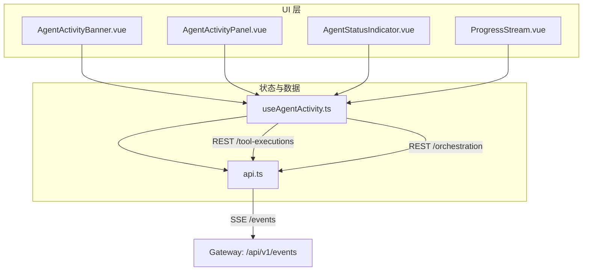
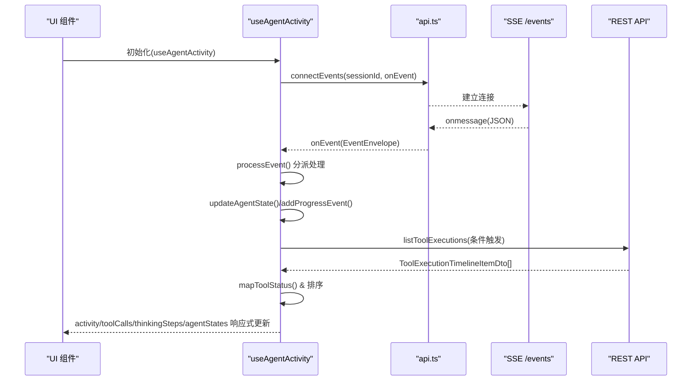
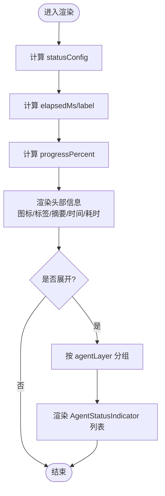
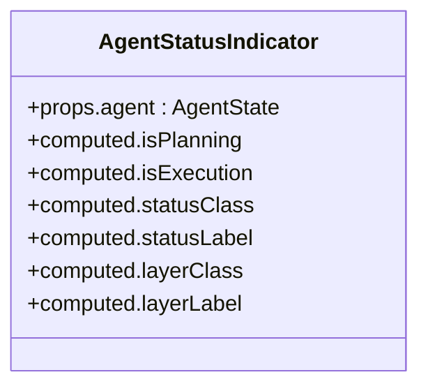
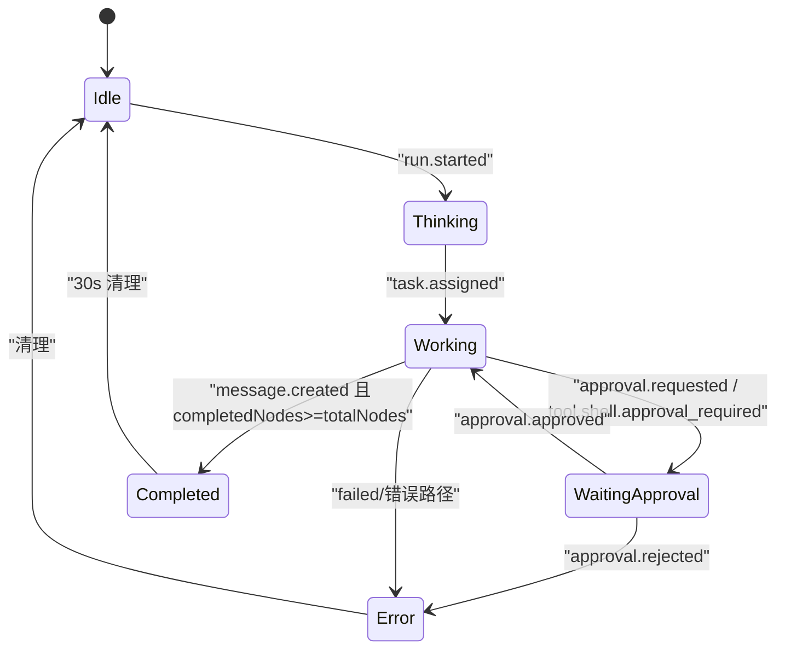
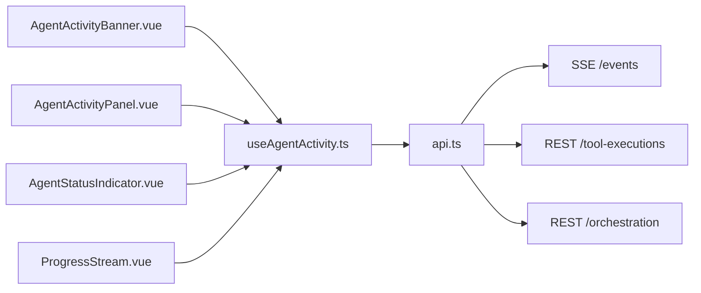

# Agent 活动监控

<cite>
**本文引用的文件**   
- [AgentActivityBanner.vue](file://apps/desktop/src/components/chat/AgentActivityBanner.vue)
- [AgentStatusIndicator.vue](file://apps/desktop/src/components/chat/AgentStatusIndicator.vue)
- [useAgentActivity.ts](file://apps/desktop/src/composables/useAgentActivity.ts)
- [AgentActivityPanel.vue](file://apps/desktop/src/components/AgentActivityPanel.vue)
- [ProgressStream.vue](file://apps/desktop/src/components/chat/ProgressStream.vue)
- [api.ts](file://apps/desktop/src/api.ts)
</cite>

## 目录
1. [简介](#简介)
2. [项目结构](#项目结构)
3. [核心组件](#核心组件)
4. [架构总览](#架构总览)
5. [详细组件分析](#详细组件分析)
6. [依赖关系分析](#依赖关系分析)
7. [性能与资源管理](#性能与资源管理)
8. [故障排查指南](#故障排查指南)
9. [结论](#结论)
10. [附录：扩展与配置](#附录扩展与配置)

## 简介
本文件为 Agent 活动监控系统的技术文档，聚焦以下目标：
- 深入说明 AgentActivityBanner 与 AgentStatusIndicator 的功能实现
- 记录 Agent 状态跟踪、实时状态更新和活动日志显示机制
- 描述活动事件订阅、状态转换逻辑与用户交互反馈
- 覆盖多 Agent 协作场景下的状态同步、冲突处理与优先级管理
- 提供自定义状态类型扩展、通知配置与审计日志导出思路
- 包含性能监控、资源清理与异常恢复策略

## 项目结构
Agent 活动监控由前端 Vue 组件与组合式函数构成，通过 SSE（Server-Sent Events）订阅后端事件流，结合编排快照与工具执行时间线，形成完整的“运行状态—任务图—思考步骤—进度流”可视化体系。

图表来源
- [AgentActivityBanner.vue:1-515](file://apps/desktop/src/components/chat/AgentActivityBanner.vue#L1-L515)
- [AgentStatusIndicator.vue:1-204](file://apps/desktop/src/components/chat/AgentStatusIndicator.vue#L1-L204)
- [useAgentActivity.ts:1-697](file://apps/desktop/src/composables/useAgentActivity.ts#L1-L697)
- [AgentActivityPanel.vue:1-800](file://apps/desktop/src/components/AgentActivityPanel.vue#L1-L800)
- [ProgressStream.vue:1-216](file://apps/desktop/src/components/chat/ProgressStream.vue#L1-L216)
- [api.ts:1300-1330](file://apps/desktop/src/api.ts#L1300-L1330)

章节来源
- [AgentActivityBanner.vue:1-515](file://apps/desktop/src/components/chat/AgentActivityBanner.vue#L1-L515)
- [AgentStatusIndicator.vue:1-204](file://apps/desktop/src/components/chat/AgentStatusIndicator.vue#L1-L204)
- [useAgentActivity.ts:1-697](file://apps/desktop/src/composables/useAgentActivity.ts#L1-L697)
- [AgentActivityPanel.vue:1-800](file://apps/desktop/src/components/AgentActivityPanel.vue#L1-L800)
- [ProgressStream.vue:1-216](file://apps/desktop/src/components/chat/ProgressStream.vue#L1-L216)
- [api.ts:1300-1330](file://apps/desktop/src/api.ts#L1300-L1330)

## 核心组件
- AgentActivityBanner：以横幅形式展示当前运行的 Agent 摘要、状态标签、耗时、进度条，并支持展开查看规划层与执行层 Agent 的状态卡片。
- AgentStatusIndicator：单条 Agent 状态卡片，展示名称、层级（规划/执行）、状态点与当前任务。
- useAgentActivity：组合式函数，负责事件订阅、状态机更新、工具调用时间线拉取、编排快照增强、进度事件聚合与自动清理。
- AgentActivityPanel：更丰富的面板视图，包含状态区、任务图、思考步骤、实时进度流等。
- ProgressStream：轻量级进度流展示组件，用于在聊天区域嵌入最近的活动事件。

章节来源
- [AgentActivityBanner.vue:1-515](file://apps/desktop/src/components/chat/AgentActivityBanner.vue#L1-L515)
- [AgentStatusIndicator.vue:1-204](file://apps/desktop/src/components/chat/AgentStatusIndicator.vue#L1-L204)
- [useAgentActivity.ts:1-697](file://apps/desktop/src/composables/useAgentActivity.ts#L1-L697)
- [AgentActivityPanel.vue:1-800](file://apps/desktop/src/components/AgentActivityPanel.vue#L1-L800)
- [ProgressStream.vue:1-216](file://apps/desktop/src/components/chat/ProgressStream.vue#L1-L216)

## 架构总览
系统采用“事件驱动 + 快照增强”的架构：
- 事件驱动：通过 EventSource 订阅 /api/v1/events，按事件类型分发到对应处理器，更新运行状态、任务分配、步骤结果、审批流等。
- 快照增强：周期性或按需获取 OrchestrationSnapshotDto，补充节点完成数、任务图、Agent 分配等信息。
- 工具执行时间线：拉取 ToolExecutionTimelineItemDto，映射为本地 ToolCall 模型，支撑审批与执行状态展示。

图表来源
- [useAgentActivity.ts:640-654](file://apps/desktop/src/composables/useAgentActivity.ts#L640-L654)
- [api.ts:1310-1327](file://apps/desktop/src/api.ts#L1310-L1327)
- [useAgentActivity.ts:540-583](file://apps/desktop/src/composables/useAgentActivity.ts#L540-L583)

章节来源
- [useAgentActivity.ts:1-697](file://apps/desktop/src/composables/useAgentActivity.ts#L1-L697)
- [api.ts:1300-1330](file://apps/desktop/src/api.ts#L1300-L1330)

## 详细组件分析

### AgentActivityBanner 组件
- 功能要点
  - 根据 activity.status 动态渲染图标、标签、颜色与动画（旋转/脉冲）。
  - 计算已耗时与开始时间，展示运行摘要与进度条。
  - 展开后按 agentLayer 分组渲染 AgentStatusIndicator。
  - 空态提示“正在等待智能体分配”。
- 关键逻辑
  - statusConfig：状态到视觉配置的映射。
  - elapsedMs/elapsedLabel：基于 runStartedAt 与 lastUpdated 计算耗时。
  - progressPercent：completedNodes/totalNodes 百分比。
  - hasActivity：当非空闲或有运行 ID/活跃 Agent/Agent 列表时显示。

图表来源
- [AgentActivityBanner.vue:24-128](file://apps/desktop/src/components/chat/AgentActivityBanner.vue#L24-L128)
- [AgentActivityBanner.vue:131-204](file://apps/desktop/src/components/chat/AgentActivityBanner.vue#L131-L204)

章节来源
- [AgentActivityBanner.vue:1-515](file://apps/desktop/src/components/chat/AgentActivityBanner.vue#L1-L515)

### AgentStatusIndicator 组件
- 功能要点
  - 根据 agent.status 渲染状态点颜色与动画（active/waiting 脉冲）。
  - 显示 agentName、layerTag（规划层/执行层）、statusLabel 与 currentTask。
- 关键逻辑
  - statusClass/statusLabel：状态到样式与文案映射。
  - layerClass/layerLabel：层级区分与标签文案。

图表来源
- [AgentStatusIndicator.vue:1-204](file://apps/desktop/src/components/chat/AgentStatusIndicator.vue#L1-L204)

章节来源
- [AgentStatusIndicator.vue:1-204](file://apps/desktop/src/components/chat/AgentStatusIndicator.vue#L1-L204)

### useAgentActivity 组合式函数
- 职责
  - 维护 activity、toolCalls、thinkingSteps、agentStates、progressEvents 五大响应式状态。
  - 订阅 SSE 事件，统一分发到 processEvent，再路由到具体处理器。
  - 从 OrchestrationSnapshotDto 增强节点计数、Agent 分配与运行状态。
  - 拉取工具执行时间线，映射为 ToolCall 并排序。
  - 生命周期管理：sessionId 变化时重连；onUnmounted 清理定时器与连接。
- 状态机与事件映射
  - run.started → thinking
  - task_graph.created → 设置 totalNodes
  - task.assigned → working，更新 activeAgent 与 agentStates
  - step.result.created → completedNodes++，标记 agent 完成
  - supervision.checked/context.pack.created → 记录思考步骤
  - approval.requested/tool.shell.approval_required → waiting_approval
  - approval.approved/rejected → 恢复 working 或失败
  - message.created → 若节点全部完成则 completed，否则 working

图表来源
- [useAgentActivity.ts:215-241](file://apps/desktop/src/composables/useAgentActivity.ts#L215-L241)
- [useAgentActivity.ts:243-270](file://apps/desktop/src/composables/useAgentActivity.ts#L243-L270)
- [useAgentActivity.ts:272-303](file://apps/desktop/src/composables/useAgentActivity.ts#L272-L303)
- [useAgentActivity.ts:305-337](file://apps/desktop/src/composables/useAgentActivity.ts#L305-L337)
- [useAgentActivity.ts:339-383](file://apps/desktop/src/composables/useAgentActivity.ts#L339-L383)
- [useAgentActivity.ts:385-432](file://apps/desktop/src/composables/useAgentActivity.ts#L385-L432)
- [useAgentActivity.ts:472-488](file://apps/desktop/src/composables/useAgentActivity.ts#L472-L488)
- [useAgentActivity.ts:532-538](file://apps/desktop/src/composables/useAgentActivity.ts#L532-L538)

章节来源
- [useAgentActivity.ts:1-697](file://apps/desktop/src/composables/useAgentActivity.ts#L1-L697)

### AgentActivityPanel 组件
- 功能要点
  - 整合状态区、任务图、思考步骤、实时进度流四大区块。
  - 任务图按 priority 排序，显示每个节点的完成状态与指派 Agent。
  - 思考步骤按类型渲染不同图标与标签，支持时长与严重级别展示。
  - 实时进度流限制最多 15 条，支持折叠/展开。
- 关键逻辑
  - assignmentsByNode：将 OrchestrationSnapshotDto.assignments 按 node_id 分组。
  - sortedNodes：按 priority 排序。
  - taskProgress：统计 done/completed 节点比例。
  - stepConfig：ThinkingStep.type 到图标与标签映射。

章节来源
- [AgentActivityPanel.vue:1-800](file://apps/desktop/src/components/AgentActivityPanel.vue#L1-L800)

### ProgressStream 组件
- 功能要点
  - 展示最近 5 条进度事件，支持“收起/展开”切换。
  - 每条事件含图标、消息文本与时间戳。
- 关键逻辑
  - visibleEvents：默认反转最后 5 条，展开后显示全部。
  - iconMap：事件图标映射。

章节来源
- [ProgressStream.vue:1-216](file://apps/desktop/src/components/chat/ProgressStream.vue#L1-L216)

## 依赖关系分析
- 组件依赖
  - AgentActivityBanner 依赖 useAgentActivity 暴露的 activity 与 agentStates。
  - AgentActivityPanel 依赖 useAgentActivity 暴露的全部状态以及 OrchestrationSnapshotDto。
  - AgentStatusIndicator 依赖 AgentState。
  - ProgressStream 依赖 ProgressEvent。
- 数据源依赖
  - api.connectEvents 建立 SSE 连接，分发事件。
  - api.listToolExecutions 拉取工具执行时间线。
  - api.getOrchestrationSnapshot 拉取编排快照（在 Hook 中通过 watch 增强）。

图表来源
- [useAgentActivity.ts:640-654](file://apps/desktop/src/composables/useAgentActivity.ts#L640-L654)
- [api.ts:1310-1327](file://apps/desktop/src/api.ts#L1310-L1327)

章节来源
- [useAgentActivity.ts:1-697](file://apps/desktop/src/composables/useAgentActivity.ts#L1-L697)
- [api.ts:1300-1330](file://apps/desktop/src/api.ts#L1300-L1330)

## 性能与资源管理
- 事件去重与限流
  - addProgressEvent 使用 id 去重，并限制最多保留 20 条，避免内存膨胀。
- 批量刷新
  - 仅在特定事件类型（tool./approval./step./task）触发 refreshToolExecutions，减少不必要的 REST 请求。
- 自动清理
  - 完成运行后 scheduleCleanup 延迟 30 秒重置状态，防止残留数据影响后续会话。
- 连接管理
  - sessionId 变化时 disconnect 旧连接并重新 connect；组件卸载时确保关闭 EventSource 与清除定时器。
- 渲染优化
  - 使用 computed 缓存状态计算；模板中使用 v-if 控制展开区域渲染；TransitionGroup 平滑过渡。

章节来源
- [useAgentActivity.ts:178-190](file://apps/desktop/src/composables/useAgentActivity.ts#L178-L190)
- [useAgentActivity.ts:532-538](file://apps/desktop/src/composables/useAgentActivity.ts#L532-L538)
- [useAgentActivity.ts:640-654](file://apps/desktop/src/composables/useAgentActivity.ts#L640-L654)
- [useAgentActivity.ts:682-685](file://apps/desktop/src/composables/useAgentActivity.ts#L682-L685)

## 故障排查指南
- 常见问题定位
  - 无事件到达：检查 api.connectEvents 是否正确传入 sessionId，确认 gatewayUrl 与 /api/v1/events 可达。
  - 状态不更新：核对 event.type 是否在 processEvent 分支内；确认 payload 字段提取函数 extractString/extractNumber/extractArray 返回值是否符合预期。
  - 工具执行时间线为空：检查 refreshToolExecutions 是否被触发；确认 listToolExecutions 接口返回与 mapToolStatus 映射。
  - 内存增长：确认 addProgressEvent 的去重与长度限制生效；检查是否有未清理的定时器或 EventSource。
- 建议调试手段
  - 在 processEvent 入口打印 event.type 与 payload 关键字段。
  - 在 refreshToolExecutions 捕获并记录错误堆栈。
  - 观察 agentStates 的更新频率与大小，必要时增加去重或采样策略。

章节来源
- [api.ts:1310-1327](file://apps/desktop/src/api.ts#L1310-L1327)
- [useAgentActivity.ts:490-530](file://apps/desktop/src/composables/useAgentActivity.ts#L490-L530)
- [useAgentActivity.ts:540-583](file://apps/desktop/src/composables/useAgentActivity.ts#L540-L583)

## 结论
Agent 活动监控系统通过清晰的事件驱动与快照增强机制，实现了高内聚、低耦合的前端状态管理与可视化。AgentActivityBanner 与 AgentStatusIndicator 提供了直观的运行概览与细粒度 Agent 状态展示；useAgentActivity 作为中枢，协调事件订阅、状态转换与数据拉取；AgentActivityPanel 与 ProgressStream 丰富了用户交互与信息密度。整体设计具备良好的可扩展性与可维护性，适合在多 Agent 协作场景中持续演进。

## 附录：扩展与配置
- 自定义状态类型扩展
  - 在 AgentRunStatus/AgentStateStatus/ToolCallStatus 中添加新枚举值，并在 useAgentActivity 的状态处理器与 mapToolStatus 中补齐映射。
  - 在 AgentActivityBanner 与 AgentStatusIndicator 的 statusConfig/statusClass 中补充样式与文案。
- 通知配置
  - 可在 addProgressEvent 基础上接入桌面通知或应用内通知中心，依据 severity 与 category 决定提醒强度。
- 审计日志导出
  - 基于 thinkingSteps、progressEvents、toolCalls 三大数据集，定期序列化导出为 JSON/CSV，便于事后审计与分析。
- 多 Agent 协作与冲突处理
  - 利用 agentStates 的 agentId 唯一键进行幂等更新；对同一 agent 的重复 assignment 以最后一次为准。
  - 任务图 priority 决定执行顺序；当多个 Agent 竞争同一节点时，以 OrchestrationSnapshotDto.assignments 为准。
- 性能监控
  - 在 refreshToolExecutions 与 SSE 回调中加入耗时埋点，统计事件处理 P95/P99 延迟。
  - 监控 agentStates 数量与 thinkingSteps/progressEvents 长度，设定阈值告警。
- 资源清理与异常恢复
  - 确保 onUnmounted 中关闭 EventSource 与清除定时器；网络异常时实现指数退避重连。
  - 对不可恢复的错误（如权限不足、网关不可用）给出明确的用户提示与降级方案。