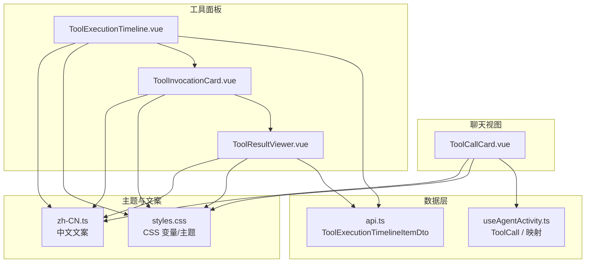
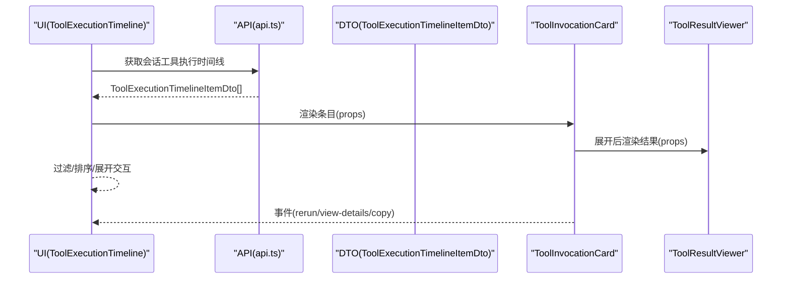
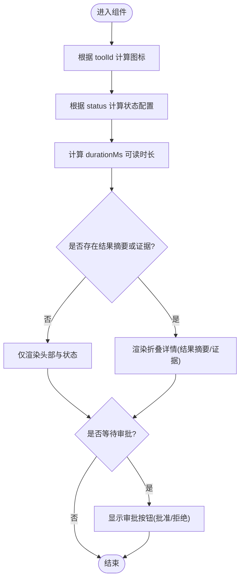
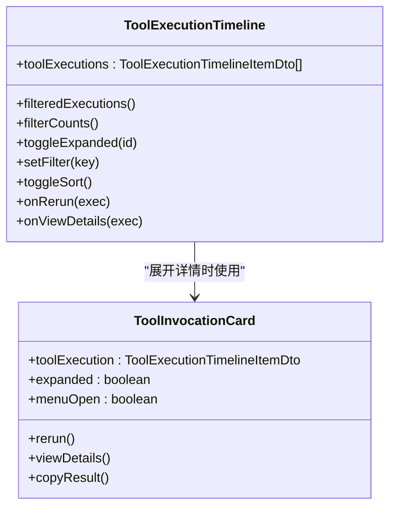
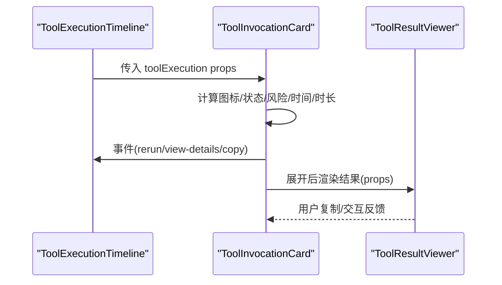
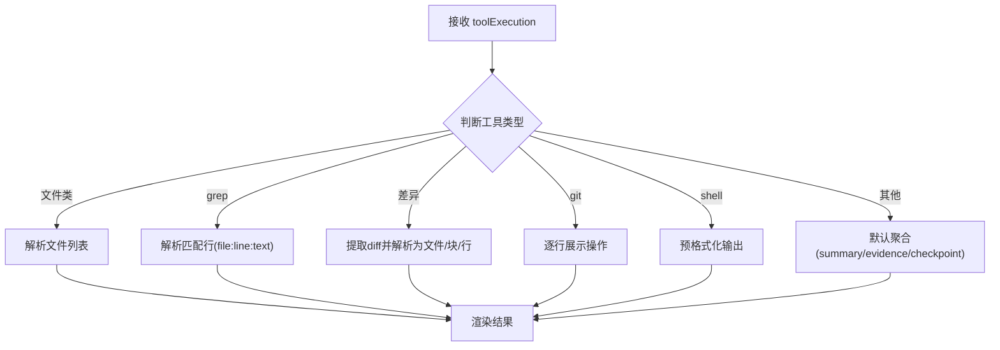
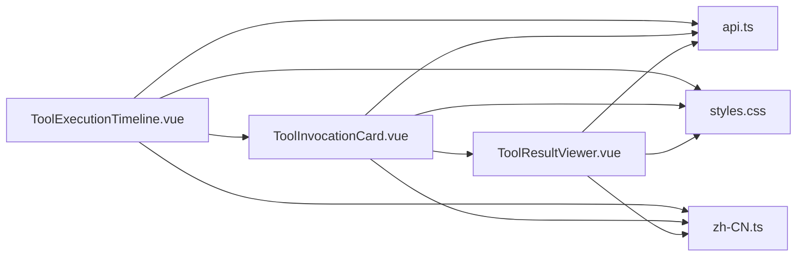

# 工具调用展示

<cite>
**本文引用的文件**   
- [ToolCallCard.vue](file://apps/desktop/src/components/chat/ToolCallCard.vue)
- [ToolExecutionTimeline.vue](file://apps/desktop/src/components/tools/ToolExecutionTimeline.vue)
- [ToolInvocationCard.vue](file://apps/desktop/src/components/tools/ToolInvocationCard.vue)
- [ToolResultViewer.vue](file://apps/desktop/src/components/tools/ToolResultViewer.vue)
- [api.ts](file://apps/desktop/src/api.ts)
- [useAgentActivity.ts](file://apps/desktop/src/composables/useAgentActivity.ts)
- [zh-CN.ts](file://apps/desktop/src/locales/zh-CN.ts)
- [styles.css](file://apps/desktop/src/styles.css)
</cite>

## 目录
1. [简介](#简介)
2. [项目结构](#项目结构)
3. [核心组件](#核心组件)
4. [架构总览](#架构总览)
5. [详细组件分析](#详细组件分析)
6. [依赖关系分析](#依赖关系分析)
7. [性能考量](#性能考量)
8. [故障排查指南](#故障排查指南)
9. [结论](#结论)
10. [附录](#附录)

## 简介
本文件面向“工具调用展示系统”，聚焦以下能力：
- ToolCallCard：参数摘要、结果摘要与执行状态展示，支持高风险标记与审批交互。
- ToolExecutionTimeline：时间线布局、事件排序、过滤与展开详情。
- ToolInvocationCard：调用详情、参数提示、证据标签、错误与风险展示、菜单操作（重跑、查看详情、复制结果）。
- ToolResultViewer：复杂参数的格式化展示（文件列表、grep 匹配、统一差异 diff、Git 操作、Shell 输出），以及默认文本/证据聚合。
- 数据绑定与事件通信：基于 API DTO 的单向数据流与组件间事件冒泡。
- 国际化与样式定制：通过主题变量与本地化资源实现多语言与主题切换。

## 项目结构
与工具调用展示相关的核心代码位于桌面应用前端模块中，采用 Vue 单文件组件组织，配合统一的类型定义与 API 客户端。

图表来源
- [ToolCallCard.vue](file://apps/desktop/src/components/chat/ToolCallCard.vue)
- [ToolExecutionTimeline.vue](file://apps/desktop/src/components/tools/ToolExecutionTimeline.vue)
- [ToolInvocationCard.vue](file://apps/desktop/src/components/tools/ToolInvocationCard.vue)
- [ToolResultViewer.vue](file://apps/desktop/src/components/tools/ToolResultViewer.vue)
- [api.ts](file://apps/desktop/src/api.ts)
- [useAgentActivity.ts](file://apps/desktop/src/composables/useAgentActivity.ts)
- [styles.css](file://apps/desktop/src/styles.css)
- [zh-CN.ts](file://apps/desktop/src/locales/zh-CN.ts)

章节来源
- [ToolCallCard.vue](file://apps/desktop/src/components/chat/ToolCallCard.vue)
- [ToolExecutionTimeline.vue](file://apps/desktop/src/components/tools/ToolExecutionTimeline.vue)
- [ToolInvocationCard.vue](file://apps/desktop/src/components/tools/ToolInvocationCard.vue)
- [ToolResultViewer.vue](file://apps/desktop/src/components/tools/ToolResultViewer.vue)
- [api.ts](file://apps/desktop/src/api.ts)
- [useAgentActivity.ts](file://apps/desktop/src/composables/useAgentActivity.ts)
- [styles.css](file://apps/desktop/src/styles.css)
- [zh-CN.ts](file://apps/desktop/src/locales/zh-CN.ts)

## 核心组件
- ToolCallCard：以卡片形式展示单次工具调用的标题、参数摘要、状态徽标、耗时与证据；在等待审批时提供批准/拒绝按钮。
- ToolExecutionTimeline：按时间轴展示工具执行记录，支持按状态过滤、按请求时间排序、点击展开查看 ToolInvocationCard 详情。
- ToolInvocationCard：展示工具 ID、显示名、来源、状态、耗时、风险等级、审批标识、证据标签、元信息（层、序列号、时间）；支持重跑、查看详情、复制结果。
- ToolResultViewer：根据工具类型渲染差异化结果视图（文件列表、grep 匹配、diff 差异、Git 操作、Shell 输出），并提供复制功能。

章节来源
- [ToolCallCard.vue](file://apps/desktop/src/components/chat/ToolCallCard.vue)
- [ToolExecutionTimeline.vue](file://apps/desktop/src/components/tools/ToolExecutionTimeline.vue)
- [ToolInvocationCard.vue](file://apps/desktop/src/components/tools/ToolInvocationCard.vue)
- [ToolResultViewer.vue](file://apps/desktop/src/components/tools/ToolResultViewer.vue)

## 架构总览
整体数据流遵循“后端 DTO → 前端类型 → 组件 props”的单向绑定模式，组件之间通过事件向上冒泡触发父级行为（如重跑、查看详情、审批）。

图表来源
- [ToolExecutionTimeline.vue](file://apps/desktop/src/components/tools/ToolExecutionTimeline.vue)
- [ToolInvocationCard.vue](file://apps/desktop/src/components/tools/ToolInvocationCard.vue)
- [ToolResultViewer.vue](file://apps/desktop/src/components/tools/ToolResultViewer.vue)
- [api.ts](file://apps/desktop/src/api.ts)

## 详细组件分析

### ToolCallCard 组件
- 参数展示：使用 argsSummary 作为参数摘要行，结合工具图标与名称快速识别。
- 结果预览：当 resultSummary 存在且与 argsSummary 不同时，折叠区域展示“结果摘要”。
- 执行状态：根据 status 动态选择图标、标签与颜色，并显示 durationMs 换算后的时长。
- 高风险与审批：risk 为 high/critical 时显示“高风险”标签；status 为 waiting_approval 时显示审批区与 approve/reject 按钮。
- 证据展示：evidence 数组以列表形式呈现。

图表来源
- [ToolCallCard.vue](file://apps/desktop/src/components/chat/ToolCallCard.vue)

章节来源
- [ToolCallCard.vue](file://apps/desktop/src/components/chat/ToolCallCard.vue)

### ToolExecutionTimeline 组件
- 时间线布局：左侧轨道点+竖线，右侧内容区包含图标、标题、来源、状态、时间、耗时、风险、层、审批标记等。
- 事件排序：按 requested_at 升/降序排列，默认最新在前。
- 过滤：支持 all/success/failed/approval/running 五种状态过滤，并显示计数。
- 交互：点击节点展开/收起，内部嵌入 ToolInvocationCard 展示详情；支持 rerun 与 view-details 事件上抛。

图表来源
- [ToolExecutionTimeline.vue](file://apps/desktop/src/components/tools/ToolExecutionTimeline.vue)
- [ToolInvocationCard.vue](file://apps/desktop/src/components/tools/ToolInvocationCard.vue)

章节来源
- [ToolExecutionTimeline.vue](file://apps/desktop/src/components/tools/ToolExecutionTimeline.vue)

### ToolInvocationCard 组件
- 调用详情：展示 tool_id、tool_display_name、source、status、duration_ms、risk、provider_layer、requested_at、seq 范围等。
- 参数提示：从 summary 解析出若干片段作为 paramHints 标签。
- 证据标签：截取前 3 条 evidence 并以标签形式展示，超出部分显示计数。
- 审批与风险：requires_approval 时显示审批标识与 approval_id；risk 分类着色。
- 菜单操作：重跑、查看详情、复制结果（汇总 summary/checkpoint_summary/evidence）。

图表来源
- [ToolInvocationCard.vue](file://apps/desktop/src/components/tools/ToolInvocationCard.vue)
- [ToolResultViewer.vue](file://apps/desktop/src/components/tools/ToolResultViewer.vue)

章节来源
- [ToolInvocationCard.vue](file://apps/desktop/src/components/tools/ToolInvocationCard.vue)

### ToolResultViewer 组件
- 文件列表视图：针对 read_file/list_directory/glob_search，从 evidence 中提取路径列表。
- grep 匹配视图：针对 grep_content，解析 file:line:text 格式并高亮显示。
- 差异视图：针对 apply_patch/code_editor/git_worktree_manager，提取 diff 文本并解析为文件/块/行，区分新增/删除。
- Git 操作视图：针对 git_* 工具，逐行展示操作日志。
- Shell 输出视图：针对 sandbox_exec，以预格式化文本展示。
- 默认视图：聚合 summary/checkpoint_summary/evidence 并以列表展示。

图表来源
- [ToolResultViewer.vue](file://apps/desktop/src/components/tools/ToolResultViewer.vue)

章节来源
- [ToolResultViewer.vue](file://apps/desktop/src/components/tools/ToolResultViewer.vue)

### 数据模型与类型
- ToolExecutionTimelineItemDto：承载工具执行的完整元数据（ID、运行/会话 ID、工具 ID/显示名、来源、层、风险、审批、状态、摘要、证据、时间戳、耗时、序列号、事件类型、检查点摘要）。
- ToolCall：用于活动流的简化表示（ID、工具 ID/名称、状态、时间、耗时、参数/结果摘要、审批、证据、序列号、风险）。

章节来源
- [api.ts](file://apps/desktop/src/api.ts)
- [useAgentActivity.ts](file://apps/desktop/src/composables/useAgentActivity.ts)

## 依赖关系分析
- ToolExecutionTimeline 依赖 ToolInvocationCard 进行详情渲染。
- ToolInvocationCard 依赖 ToolResultViewer 进行结果可视化。
- 所有组件均依赖 api.ts 中的 DTO 类型定义，保证数据结构一致性。
- 样式依赖 styles.css 的主题变量（背景、边框、文本、强调色等），确保一致的主题体验。
- 文案依赖 zh-CN.ts 的中文资源（当前组件内文案多为硬编码，但可迁移至 i18n 资源）。

图表来源
- [ToolExecutionTimeline.vue](file://apps/desktop/src/components/tools/ToolExecutionTimeline.vue)
- [ToolInvocationCard.vue](file://apps/desktop/src/components/tools/ToolInvocationCard.vue)
- [ToolResultViewer.vue](file://apps/desktop/src/components/tools/ToolResultViewer.vue)
- [api.ts](file://apps/desktop/src/api.ts)
- [styles.css](file://apps/desktop/src/styles.css)
- [zh-CN.ts](file://apps/desktop/src/locales/zh-CN.ts)

章节来源
- [ToolExecutionTimeline.vue](file://apps/desktop/src/components/tools/ToolExecutionTimeline.vue)
- [ToolInvocationCard.vue](file://apps/desktop/src/components/tools/ToolInvocationCard.vue)
- [ToolResultViewer.vue](file://apps/desktop/src/components/tools/ToolResultViewer.vue)
- [api.ts](file://apps/desktop/src/api.ts)
- [styles.css](file://apps/desktop/src/styles.css)
- [zh-CN.ts](file://apps/desktop/src/locales/zh-CN.ts)

## 性能考量
- 大文本处理：ToolResultViewer 对 diff/grep/shell 等大文本进行按需解析与渲染，避免一次性全量渲染导致卡顿。
- 证据截断：证据列表限制展示数量（如前 3 条），其余以计数提示，减少 DOM 压力。
- 排序与过滤：在 computed 中完成过滤与排序，利用响应式缓存提升性能。
- 动画与过渡：展开/收起使用过渡动画，注意 max-height 与 opacity 的组合，避免重排抖动。

[本节为通用指导，不直接分析具体文件]

## 故障排查指南
- 参数解析失败：当后端返回的参数结构与预期不一致（例如字符串与数组类型不匹配），会导致工具调用失败。建议检查入参序列化逻辑与 DTO 定义的一致性。
- 网络连接异常：前端 fetch 封装在网络不可达或跨域拦截时会抛出错误，需检查网关地址与 CORS 策略。
- 审批流程阻塞：requires_approval 为真时，必须完成审批才能继续执行；确认审批状态与 approval_id 是否正确传递。
- 复制失败：剪贴板权限受限可能导致复制失败，应捕获异常并给出友好提示。

章节来源
- [api.ts](file://apps/desktop/src/api.ts)
- [ToolInvocationCard.vue](file://apps/desktop/src/components/tools/ToolInvocationCard.vue)
- [ToolExecutionTimeline.vue](file://apps/desktop/src/components/tools/ToolExecutionTimeline.vue)

## 结论
工具调用展示系统通过清晰的组件分层与类型驱动的数据绑定，实现了从时间线概览到详情可视化的完整链路。ToolCallCard 负责轻量展示与审批交互，ToolExecutionTimeline 提供全局视角与筛选排序，ToolInvocationCard 与 ToolResultViewer 协同完成复杂结果的格式化与交互。借助主题变量与本地化资源，系统具备良好的可扩展性与可定制性。

[本节为总结性内容，不直接分析具体文件]

## 附录

### 数据绑定与事件通信
- 数据绑定：组件通过 props 接收 ToolExecutionTimelineItemDto，内部计算属性派生展示所需字段（状态、时长、时间、风险等）。
- 事件通信：组件通过 emit 向父级派发 rerun、view-details、approve/reject 等事件，由上层协调业务逻辑。

章节来源
- [ToolExecutionTimeline.vue](file://apps/desktop/src/components/tools/ToolExecutionTimeline.vue)
- [ToolInvocationCard.vue](file://apps/desktop/src/components/tools/ToolInvocationCard.vue)
- [ToolCallCard.vue](file://apps/desktop/src/components/chat/ToolCallCard.vue)

### 复杂参数格式化与二进制数据预览
- 文件列表/grep/diff/Git/Shell 等专用视图已覆盖常见文本型结果。
- 二进制数据：当前未实现二进制预览，建议在 ToolResultViewer 中扩展二进制检测与 Base64/缩略图预览能力。

章节来源
- [ToolResultViewer.vue](file://apps/desktop/src/components/tools/ToolResultViewer.vue)

### 自定义工具卡片模板与样式定制
- 样式定制：通过 styles.css 的 CSS 变量（背景、边框、文本、强调色、阴影等）统一控制主题；组件内使用 scoped 样式隔离。
- 模板扩展：可在 ToolResultViewer 中新增分支以适配新的工具类型与结果格式。

章节来源
- [styles.css](file://apps/desktop/src/styles.css)
- [ToolResultViewer.vue](file://apps/desktop/src/components/tools/ToolResultViewer.vue)

### 国际化支持
- 当前组件内文案多为硬编码，建议逐步迁移至 zh-CN.ts 等资源文件，并通过 i18n 库进行替换，以实现多语言支持。

章节来源
- [zh-CN.ts](file://apps/desktop/src/locales/zh-CN.ts)