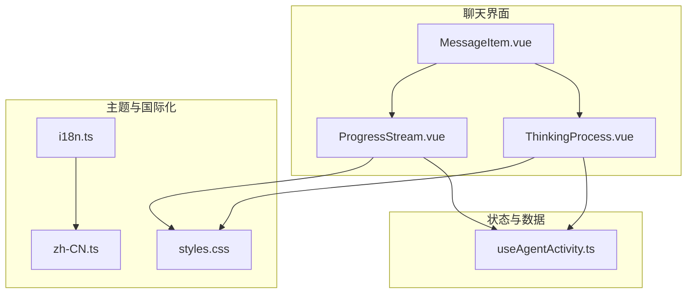
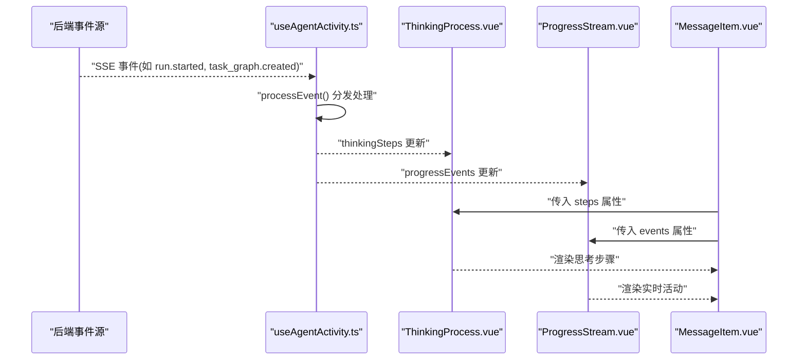
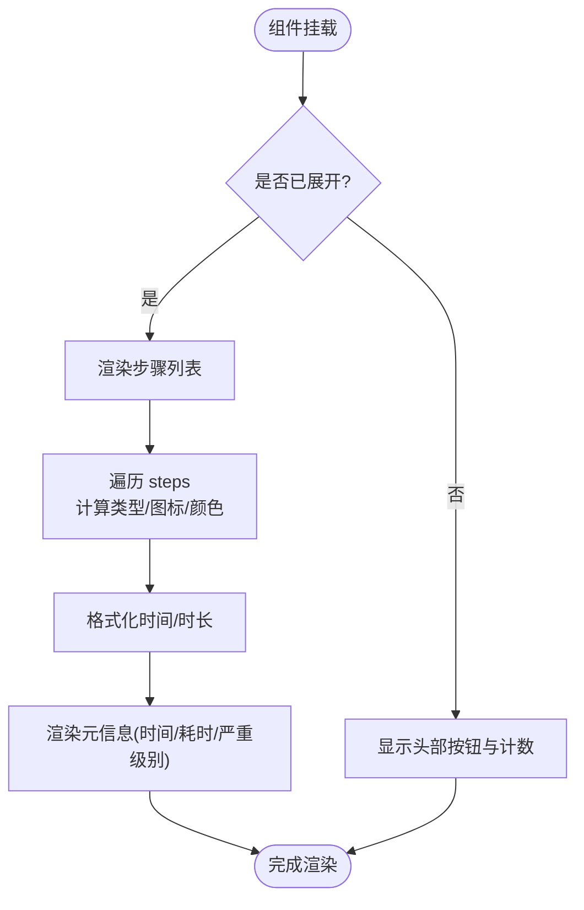
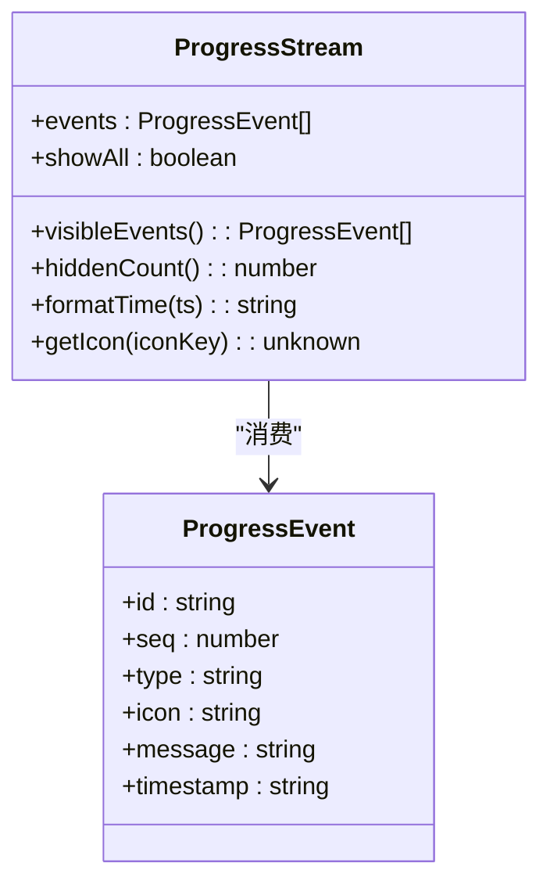
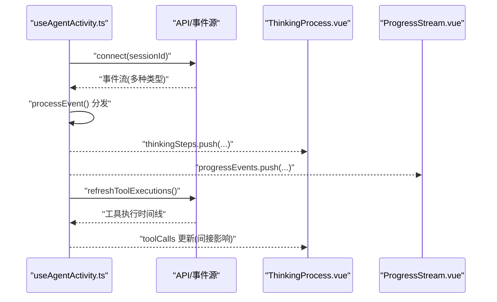
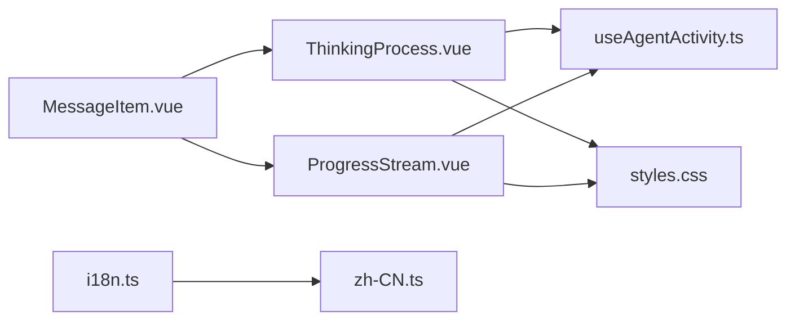

# 思考过程可视化

<cite>
**本文引用的文件**   
- [ThinkingProcess.vue](file://apps/desktop/src/components/chat/ThinkingProcess.vue)
- [ProgressStream.vue](file://apps/desktop/src/components/chat/ProgressStream.vue)
- [useAgentActivity.ts](file://apps/desktop/src/composables/useAgentActivity.ts)
- [MessageItem.vue](file://apps/desktop/src/components/MessageItem.vue)
- [styles.css](file://apps/desktop/src/styles.css)
- [i18n.ts](file://apps/desktop/src/i18n.ts)
- [zh-CN.ts](file://apps/desktop/src/locales/zh-CN.ts)
</cite>

## 目录
1. [简介](#简介)
2. [项目结构](#项目结构)
3. [核心组件](#核心组件)
4. [架构总览](#架构总览)
5. [详细组件分析](#详细组件分析)
6. [依赖关系分析](#依赖关系分析)
7. [性能考虑](#性能考虑)
8. [故障排除指南](#故障排除指南)
9. [结论](#结论)
10. [附录](#附录)

## 简介
本文件面向“思考过程可视化系统”，聚焦以下能力：
- ThinkingProcess 组件的动画效果、步骤展示与进度追踪
- ProgressStream 组件的流式数据处理、实时更新与性能优化
- 思考步骤的状态管理、用户交互控制与自定义渲染模板
- 动画配置、主题定制与多语言支持实现指南
- 大数据量处理、内存优化与用户体验优化策略
- 调试工具、性能分析与故障排除方法

## 项目结构
与思考过程可视化相关的代码集中在桌面端应用的聊天模块中，包含两个关键 UI 组件（ThinkingProcess、ProgressStream）、一个状态与事件编排的可复用组合式函数（useAgentActivity），以及消息项集成点（MessageItem）。样式与国际化分别由全局样式与 i18n 配置提供。

图表来源
- [MessageItem.vue:1-138](file://apps/desktop/src/components/MessageItem.vue#L1-L138)
- [ThinkingProcess.vue:1-343](file://apps/desktop/src/components/chat/ThinkingProcess.vue#L1-L343)
- [ProgressStream.vue:1-216](file://apps/desktop/src/components/chat/ProgressStream.vue#L1-L216)
- [useAgentActivity.ts:1-697](file://apps/desktop/src/composables/useAgentActivity.ts#L1-L697)
- [styles.css:1-800](file://apps/desktop/src/styles.css#L1-L800)
- [i18n.ts:1-24](file://apps/desktop/src/i18n.ts#L1-L24)
- [zh-CN.ts:1-800](file://apps/desktop/src/locales/zh-CN.ts#L1-L800)

章节来源
- [MessageItem.vue:1-138](file://apps/desktop/src/components/MessageItem.vue#L1-L138)
- [ThinkingProcess.vue:1-343](file://apps/desktop/src/components/chat/ThinkingProcess.vue#L1-L343)
- [ProgressStream.vue:1-216](file://apps/desktop/src/components/chat/ProgressStream.vue#L1-L216)
- [useAgentActivity.ts:1-697](file://apps/desktop/src/composables/useAgentActivity.ts#L1-L697)
- [styles.css:1-800](file://apps/desktop/src/styles.css#L1-L800)
- [i18n.ts:1-24](file://apps/desktop/src/i18n.ts#L1-L24)
- [zh-CN.ts:1-800](file://apps/desktop/src/locales/zh-CN.ts#L1-L800)

## 核心组件
- ThinkingProcess：以时间线形式呈现思考步骤，支持展开/收起动画、类型化图标与颜色、时间与时长格式化、严重级别标签等。
- ProgressStream：实时活动流，支持滚动列表、最多显示最近若干条、切换查看全部、滑入滑出过渡动画。
- useAgentActivity：统一的事件处理与状态管理，负责从后端事件源解析并更新 thinkingSteps、progressEvents、toolCalls、agentStates 等。

章节来源
- [ThinkingProcess.vue:1-343](file://apps/desktop/src/components/chat/ThinkingProcess.vue#L1-L343)
- [ProgressStream.vue:1-216](file://apps/desktop/src/components/chat/ProgressStream.vue#L1-L216)
- [useAgentActivity.ts:1-697](file://apps/desktop/src/composables/useAgentActivity.ts#L1-L697)

## 架构总览
下图展示了从事件到 UI 的完整链路：后端事件通过 EventSource 进入 useAgentActivity，解析为 ThinkingStep 与 ProgressEvent；ThinkingProcess 与 ProgressStream 消费这些数据进行渲染。

图表来源
- [useAgentActivity.ts:490-530](file://apps/desktop/src/composables/useAgentActivity.ts#L490-L530)
- [ThinkingProcess.vue:1-124](file://apps/desktop/src/components/chat/ThinkingProcess.vue#L1-L124)
- [ProgressStream.vue:1-98](file://apps/desktop/src/components/chat/ProgressStream.vue#L1-L98)
- [MessageItem.vue:1-138](file://apps/desktop/src/components/MessageItem.vue#L1-L138)

## 详细组件分析

### ThinkingProcess 组件分析
- 功能要点
  - 步骤类型映射：run_started、task_graph、agent_assignment、supervision、context_pack、step_result 等，每种类型对应不同图标与颜色。
  - 时间/时长格式化：本地化时间显示，毫秒/秒/分钟自动转换。
  - 展开/收起动画：使用 Vue Transition 实现淡入淡出与高度变化。
  - 元信息展示：时间、耗时、严重级别标签。
- 动画与交互
  - 头部按钮控制 expanded 状态，配合 Transition 名称 thinking-expand。
  - 列表项之间绘制连接线，增强时间线感。
- 可定制性
  - 通过 props.steps 注入数据，可在父组件按需过滤或排序。
  - 样式基于 CSS 变量，支持主题切换。

图表来源
- [ThinkingProcess.vue:22-41](file://apps/desktop/src/components/chat/ThinkingProcess.vue#L22-L41)
- [ThinkingProcess.vue:43-63](file://apps/desktop/src/components/chat/ThinkingProcess.vue#L43-L63)
- [ThinkingProcess.vue:71-124](file://apps/desktop/src/components/chat/ThinkingProcess.vue#L71-L124)

章节来源
- [ThinkingProcess.vue:1-343](file://apps/desktop/src/components/chat/ThinkingProcess.vue#L1-L343)

### ProgressStream 组件分析
- 功能要点
  - 事件列表：按 seq 倒序显示，默认仅展示最近 5 条，可通过“还有 N 条”切换查看全部。
  - 图标映射：根据 event.icon 选择对应图标，未匹配时回退到 Activity。
  - 时间格式化：统一本地化时间显示。
  - 过渡动画：TransitionGroup 实现滑入滑出效果。
- 性能优化
  - visibleEvents 仅保留最近若干条，避免长列表重排。
  - key 使用唯一 id，减少不必要的 DOM 重建。
- 交互控制
  - showAll 控制显示范围，hiddenCount 动态计算隐藏数量。

图表来源
- [ProgressStream.vue:19-63](file://apps/desktop/src/components/chat/ProgressStream.vue#L19-L63)
- [ProgressStream.vue:65-98](file://apps/desktop/src/components/chat/ProgressStream.vue#L65-L98)

章节来源
- [ProgressStream.vue:1-216](file://apps/desktop/src/components/chat/ProgressStream.vue#L1-L216)

### 状态管理与事件处理（useAgentActivity）
- 数据结构
  - AgentActivity：运行状态、节点统计、最后更新时间等。
  - ToolCall：工具调用生命周期与审批状态。
  - ThinkingStep：思考步骤的类型、标题、描述、时间、耗时、严重级别等。
  - AgentState：智能体状态与当前任务。
  - ProgressEvent：实时活动事件。
- 事件处理流程
  - processRunStarted：初始化运行状态，添加“运行启动”步骤与活动。
  - processTaskGraphCreated：记录任务图创建，计算耗时，更新节点总数。
  - processTaskAssigned：分配任务给智能体，更新活跃智能体与角色。
  - processStepResult：标记步骤完成，更新已完成节点数。
  - processSupervision：监督发现，附带严重级别与分类。
  - processContextPack：上下文包压缩，记录压缩比等信息。
  - processApprovalRequested / processShellApprovalRequired：进入等待审批状态。
  - processApprovalDecided：审批结果决定后续状态。
  - processMessageCreated：助手消息生成，可能触发完成清理。
- 连接与清理
  - connect/disconnect：基于 sessionId 建立/关闭 SSE 连接。
  - refreshToolExecutions：轮询工具执行时间线，补充 toolCalls。
  - enrichFromOrchestration：从编排快照同步状态。

图表来源
- [useAgentActivity.ts:151-176](file://apps/desktop/src/composables/useAgentActivity.ts#L151-L176)
- [useAgentActivity.ts:178-190](file://apps/desktop/src/composables/useAgentActivity.ts#L178-L190)
- [useAgentActivity.ts:215-241](file://apps/desktop/src/composables/useAgentActivity.ts#L215-L241)
- [useAgentActivity.ts:243-270](file://apps/desktop/src/composables/useAgentActivity.ts#L243-L270)
- [useAgentActivity.ts:272-303](file://apps/desktop/src/composables/useAgentActivity.ts#L272-L303)
- [useAgentActivity.ts:305-337](file://apps/desktop/src/composables/useAgentActivity.ts#L305-L337)
- [useAgentActivity.ts:339-360](file://apps/desktop/src/composables/useAgentActivity.ts#L339-L360)
- [useAgentActivity.ts:362-383](file://apps/desktop/src/composables/useAgentActivity.ts#L362-L383)
- [useAgentActivity.ts:385-404](file://apps/desktop/src/composables/useAgentActivity.ts#L385-L404)
- [useAgentActivity.ts:406-432](file://apps/desktop/src/composables/useAgentActivity.ts#L406-L432)
- [useAgentActivity.ts:434-470](file://apps/desktop/src/composables/useAgentActivity.ts#L434-L470)
- [useAgentActivity.ts:472-488](file://apps/desktop/src/composables/useAgentActivity.ts#L472-L488)
- [useAgentActivity.ts:490-530](file://apps/desktop/src/composables/useAgentActivity.ts#L490-L530)
- [useAgentActivity.ts:540-565](file://apps/desktop/src/composables/useAgentActivity.ts#L540-L565)
- [useAgentActivity.ts:640-661](file://apps/desktop/src/composables/useAgentActivity.ts#L640-L661)

章节来源
- [useAgentActivity.ts:1-697](file://apps/desktop/src/composables/useAgentActivity.ts#L1-L697)

### 集成点（MessageItem）
- MessageItem 将 thinkingSteps 与 toolCalls 透传给 ThinkingProcess 与 ToolCallCard，形成消息级上下文。
- 在助手消息区域渲染 ThinkingProcess，便于用户理解 AI 的思考路径。

章节来源
- [MessageItem.vue:1-138](file://apps/desktop/src/components/MessageItem.vue#L1-L138)

## 依赖关系分析
- ThinkingProcess 依赖 useAgentActivity 提供的 thinkingSteps，并通过 CSS 变量适配主题。
- ProgressStream 依赖 useAgentActivity 提供的 progressEvents，并使用 TransitionGroup 进行列表动画。
- MessageItem 作为容器，聚合 ThinkingProcess 与 ToolCallCard，形成完整的消息视图。
- i18n 提供多语言支持，当前中文文案集中于 zh-CN.ts。

图表来源
- [ThinkingProcess.vue:1-343](file://apps/desktop/src/components/chat/ThinkingProcess.vue#L1-L343)
- [ProgressStream.vue:1-216](file://apps/desktop/src/components/chat/ProgressStream.vue#L1-L216)
- [useAgentActivity.ts:1-697](file://apps/desktop/src/composables/useAgentActivity.ts#L1-L697)
- [MessageItem.vue:1-138](file://apps/desktop/src/components/MessageItem.vue#L1-L138)
- [styles.css:1-800](file://apps/desktop/src/styles.css#L1-L800)
- [i18n.ts:1-24](file://apps/desktop/src/i18n.ts#L1-L24)
- [zh-CN.ts:1-800](file://apps/desktop/src/locales/zh-CN.ts#L1-L800)

章节来源
- [ThinkingProcess.vue:1-343](file://apps/desktop/src/components/chat/ThinkingProcess.vue#L1-L343)
- [ProgressStream.vue:1-216](file://apps/desktop/src/components/chat/ProgressStream.vue#L1-L216)
- [useAgentActivity.ts:1-697](file://apps/desktop/src/composables/useAgentActivity.ts#L1-L697)
- [MessageItem.vue:1-138](file://apps/desktop/src/components/MessageItem.vue#L1-L138)
- [styles.css:1-800](file://apps/desktop/src/styles.css#L1-L800)
- [i18n.ts:1-24](file://apps/desktop/src/i18n.ts#L1-L24)
- [zh-CN.ts:1-800](file://apps/desktop/src/locales/zh-CN.ts#L1-L800)

## 性能考虑
- 列表长度控制
  - ProgressStream 默认仅显示最近 5 条，避免大列表重排；必要时可调整可见阈值。
  - thinkingSteps 无显式截断，建议在父组件对历史步骤做分页或虚拟滚动。
- 动画与渲染
  - 使用 Transition/TransitionGroup 的轻量动画，避免复杂布局抖动。
  - 列表 key 使用稳定 id，减少不必要的 DOM 重建。
- 网络与状态刷新
  - refreshToolExecutions 仅在相关事件发生时触发，降低轮询频率。
  - 完成状态后设置清理定时器，避免长时间占用内存。
- 主题与样式
  - 通过 CSS 变量统一主题，减少运行时样式计算开销。

[本节为通用指导，不直接分析具体文件]

## 故障排除指南
- 事件未更新
  - 检查 sessionId 是否正确，确认 connect() 已调用且 EventSource 未被关闭。
  - 查看 processEvent() 分支是否覆盖所有事件类型。
- 思考步骤缺失
  - 确认 useAgentActivity 中的 thinkingSteps 更新逻辑是否被触发。
  - 检查 ThinkingProcess 的 props.steps 是否为空数组。
- 实时活动不显示
  - 确认 progressEvents 是否被 addProgressEvent 正确追加。
  - 检查 visibleEvents 的计算逻辑与 key 的唯一性。
- 主题异常
  - 验证 styles.css 中的 CSS 变量是否生效，确保 data-theme 设置正确。
- 多语言问题
  - 检查 i18n.ts 的 locale 设置与 fallbackLocale。
  - 确认 zh-CN.ts 中所需文案键是否存在。

章节来源
- [useAgentActivity.ts:640-661](file://apps/desktop/src/composables/useAgentActivity.ts#L640-L661)
- [useAgentActivity.ts:178-190](file://apps/desktop/src/composables/useAgentActivity.ts#L178-L190)
- [ThinkingProcess.vue:71-124](file://apps/desktop/src/components/chat/ThinkingProcess.vue#L71-L124)
- [ProgressStream.vue:39-46](file://apps/desktop/src/components/chat/ProgressStream.vue#L39-L46)
- [styles.css:30-74](file://apps/desktop/src/styles.css#L30-L74)
- [i18n.ts:6-11](file://apps/desktop/src/i18n.ts#L6-L11)
- [zh-CN.ts:1-120](file://apps/desktop/src/locales/zh-CN.ts#L1-L120)

## 结论
ThinkingProcess 与 ProgressStream 共同构建了清晰、流畅的思考过程可视化体验。通过 useAgentActivity 的统一事件处理，UI 层能够及时响应后端状态变化，并以动画与主题化的方式呈现给用户。结合合理的列表长度控制、稳定的 key 与轻量动画，系统在大数据量场景下仍保持良好性能。多语言与主题体系为扩展提供了坚实基础。

[本节为总结，不直接分析具体文件]

## 附录
- 动画配置建议
  - 控制 Transition 的持续时间与缓动函数，避免过长导致卡顿。
  - 对于超长列表，考虑虚拟滚动或分页加载。
- 主题定制指南
  - 通过修改 styles.css 中的 CSS 变量，快速切换明暗主题与强调色。
  - 组件内使用 var(--*) 变量，确保主题一致性。
- 多语言支持实现
  - 在 i18n.ts 中注册新语言包，并在 zh-CN.ts 中添加对应文案键。
  - 组件内通过 $t('key') 获取文案，确保 fallbackLocale 有效。
- 大数据量与内存优化
  - 限制 visibleEvents 长度，定期清理过期 thinkingSteps。
  - 避免在高频事件中创建大量临时对象，尽量复用或就地更新。
- 用户体验优化
  - 提供“展开/收起”、“查看全部”等交互，帮助用户快速定位关键信息。
  - 对错误与警告使用显著的颜色与图标，提升可读性。

[本节为通用指导，不直接分析具体文件]